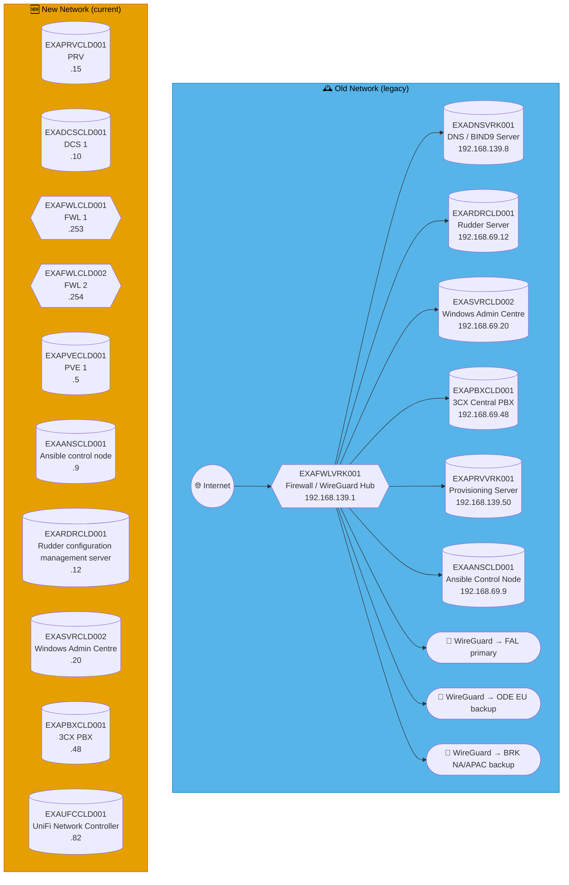
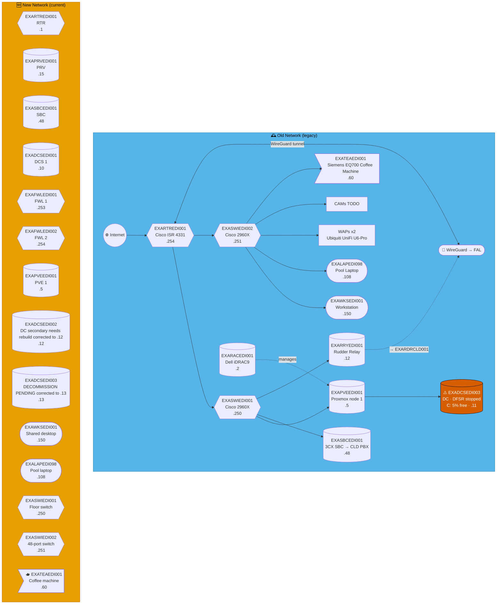
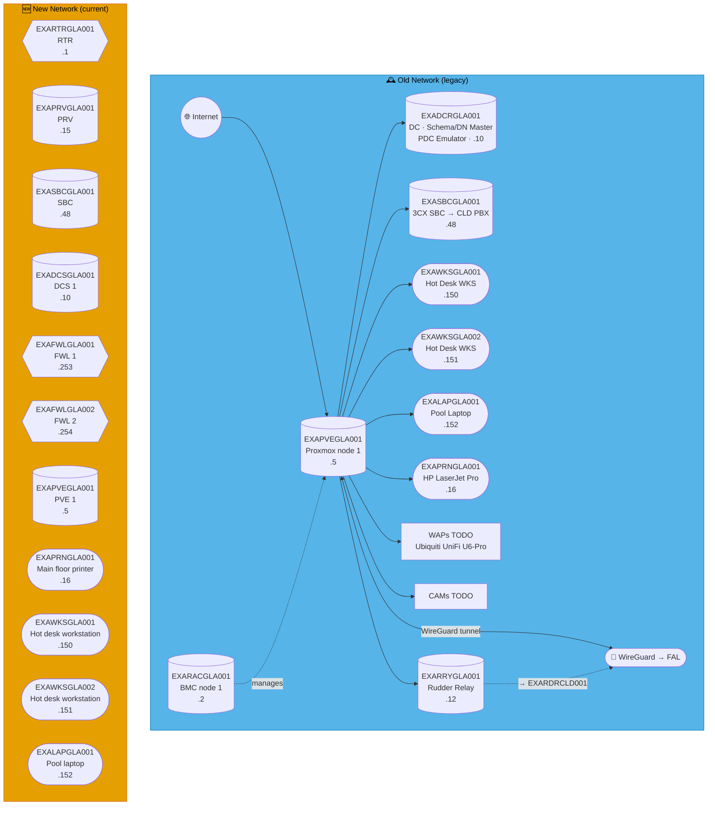
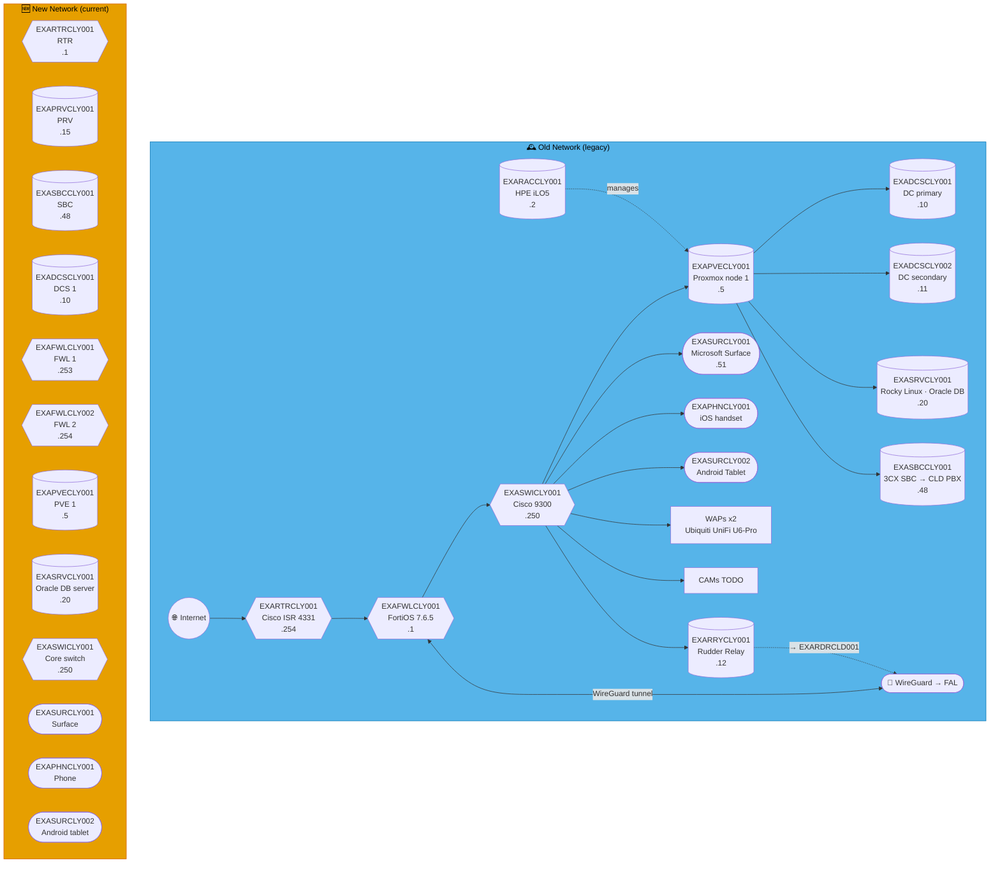
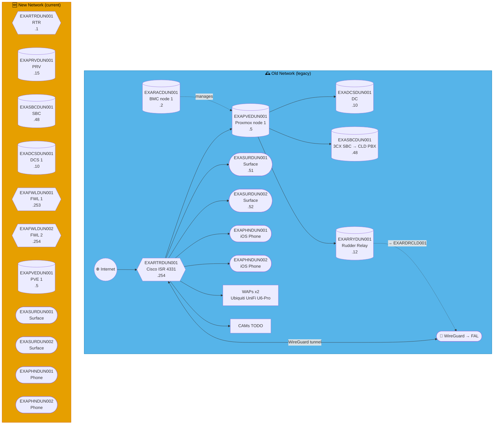
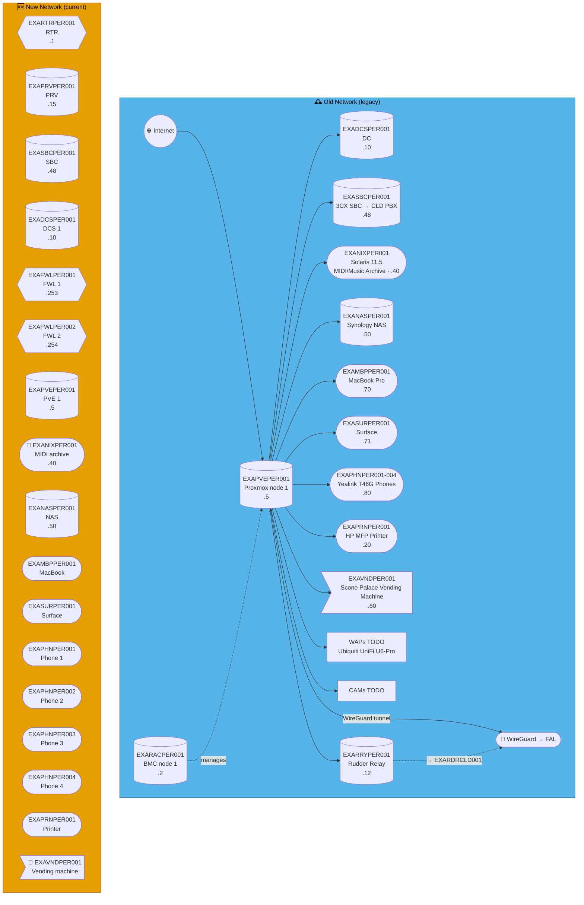
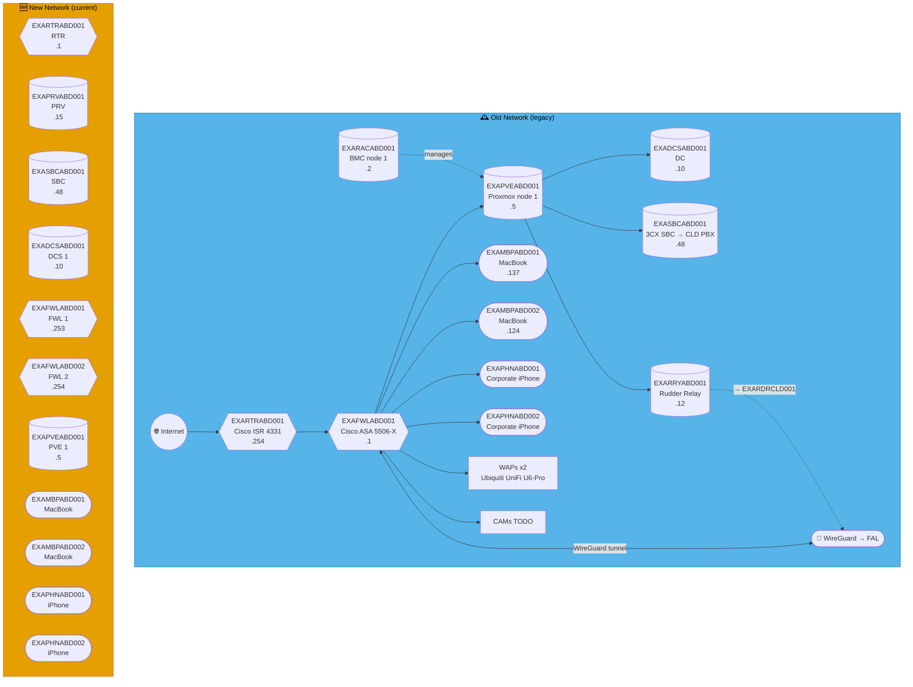
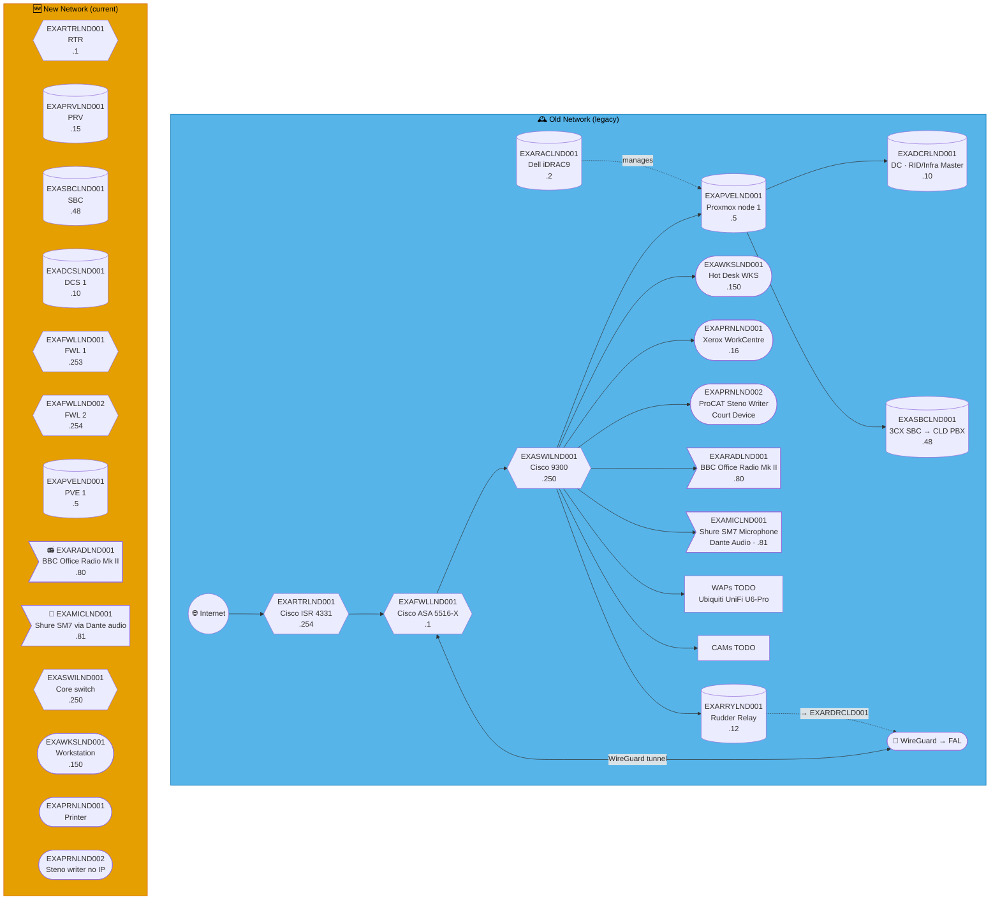

# Mermaid render bisection — Q1

Throwaway debug file, sites: CLD, FAL, EDI, GLA, CLY, DUN, PER, ABD, LND

---

## ☁️  — Cloud / Provisioning

**vRACK (`VRK`):** `192.168.139.0/24` · **CLD LAN:** `192.168.69.0/24` · **WireGuard VPN:** `10.0.139.0/24`
**Role:** WireGuard hub — routes to all sites. Central PBX, Ansible, Rudder, WAC.
CLD's own LAN is `192.168.69.0/24` — the vRACK (`192.168.139.0/24`) is a separate site code, `VRK`.  
**Entity:** Example Music Limited · **Landline:** N/A · **Mobile:** N/A

---

---

## 🏴󠁧󠁢󠁳󠁣󠁴󠁿 Scotland

---

## FAL — Falkirk *(Head Office)* ⭐

**Address:** Brockville Stadium, Hope Street, Falkirk  
**LAN:** `192.168.76.0/24` · **VPN:** `10.0.76.0/24` · **Domain:** `example.net`  
**PVE nodes:** 3 (hub) · **VPN parent:** CLD (primary head node)  
**Entity:** Example Music (Scotland) Ltd · **Landline:** +44 1324 500 0xxx · **Mobile:** +44 7700 903 2xxx

```mermaid
graph TD
    subgraph OLD_FAL ["🕰️ Old Network (legacy)"]
      INET(("🌐 Internet"))
      RTR{{"EXARTRFAL001<br/>Cisco ISR 4331<br/>.254"}}
      FWL{{"EXAFWLFAL001<br/>FortiOS<br/>.1"}}
      SW1{{"EXASWIFAL001<br/>Cisco 9300<br/>.250"}}
      SW2{{"EXASWIFAL002<br/>Cisco 9300<br/>.251"}}

      subgraph BMC ["BMC Pool"]
          RAC1[("EXARACFAL001<br/>Dell iDRAC9<br/>.2")]
          RAC2[("EXARACFAL002<br/>Dell iDRAC9<br/>.3")]
          RAC3[("EXARACFAL003<br/>Dell iDRAC9<br/>.4")]
      end

      subgraph PVE ["Proxmox Cluster (3-node)"]
          PVE1[("EXAPVEFAL001<br/>Proxmox node 1<br/>.5")]
          PVE2[("EXAPVEFAL002<br/>Proxmox node 2<br/>.6")]
          PVE3[("EXAPVEFAL003<br/>Proxmox node 3<br/>.7")]
      end

      subgraph DC ["Domain Controllers"]
          DC1[("EXADCSFAL001<br/>DC · PDC Emulator<br/>.10")]
          DC2[("EXADCSFAL002<br/>DC secondary<br/>.11")]
      end

      subgraph INFRA ["Infrastructure"]
          SBC[("EXASBCFAL001<br/>3CX SBC → CLD PBX<br/>.48")]
          RRY[("EXARRYFAL001<br/>Rudder Relay<br/>.12")]
          NAS[("EXANASFAL001<br/>FreeNAS 13.0-U6<br/>.32")]
          TAR[("EXATARFAL001<br/>Tape Archiver<br/>.33")]
      end

      subgraph ENDPOINTS ["Endpoints"]
          WKS1(["EXAWKSFAL001<br/>Mixing Desk WKS<br/>.100"])
          WKS2(["EXAWKSFAL002<br/>Reel-to-Reel WKS<br/>.101"])
          WKS3(["EXAWKSFAL003<br/>Shared Editing WKS<br/>.102"])
          LAP(["EXALAPFAL001<br/>Production Laptop<br/>.103"])
          SUR(["EXASURFAL001<br/>Microsoft Surface<br/>.104"])
          PHN(["EXAPHNFAL001-003<br/>Staff Phones"])
          PHN2(["EXAPHNFAL006-007<br/>Yealink T58A"])
          TAB(["EXATABFAL001<br/>Tablet"])
      end

      subgraph WAP_CAM ["Wireless & Security"]
          WAP["WAPs x6<br/>Ubiquiti UniFi U6-Pro<br/>.5-.10"]
          CAM1(["EXACAMFAL001<br/>Axis · Front entrance<br/>.70"])
          CAM2(["EXACAMFAL002<br/>Axis · Studio hallway<br/>.71"])
          CAM3(["EXACAMFAL003<br/>Axis · Car park<br/>.72"])
          CAM4(["EXACAMFAL004<br/>Axis · Loading bay<br/>.73"])
          RDR[("EXARDRFAL001<br/>HID Signo Badge Reader<br/>.16")]
      end

      subgraph SITE ["Site-Specific Equipment"]
          LCD(["EXALCDFAL001<br/>Samsung Tizen Display<br/>.50"])
          VCU(["EXAVCUFAL001<br/>Poly Studio X70<br/>.51"])
          JKB>"EXAMUSFAL001<br/>Pureline 128V Jukebox<br/>.67"]
          PAY>"EXAPAYFAL001<br/>GPO Kiosk No.6 Payphone<br/>.95"]
          COF>"EXATEAFAL001<br/>Smart Coffee Machine<br/>.61"]
          VND1>"EXADONFAL001<br/>Tim Hortons Vending<br/>.62"]
          VND2>"EXAVNDFAL002<br/>Irn-Bru Machine<br/>.63"]
          VND3>"EXAVNDFAL003<br/>McCowans Dispenser<br/>.64"]
          VND4>"EXAVNDFAL004<br/>Mrs Tily Dispenser<br/>.65"]
          VND5>"EXAVNDFAL005<br/>¼lb Confectionery<br/>.66"]
          PMP>"EXAPMPFAL001<br/>Networked Petrol Pump<br/>.60"]
          CLK>"EXACLKFAL001<br/>NTP Clock<br/>.80"]
      end

      VPN_CLD(["🔗 WireGuard ← CLD<br/>10.0.76.0/24"])

      INET --> RTR --> FWL --> SW1 & SW2
      SW1 --> PVE1 & PVE2 & PVE3
      SW1 --> DC1 & DC2
      SW1 --> SBC & NAS & TAR
      SW2 --> WKS1
      SW2 --> WAP
      SW2 --> LCD
      RAC1 -.->|"manages"| PVE1
      RAC2 -.->|"manages"| PVE2
      RAC3 -.->|"manages"| PVE3
      FWL <-->|"WireGuard tunnel"| VPN_CLD

      SW1 --> RRY
      RRY -. "→ EXARDRCLD001" .-> VPN_CLD
    end
    style OLD_FAL fill:#56B4E9,stroke:#0072B2,color:#000000
    %% GENERATED:NEW-NETWORK:FAL:START
    subgraph NEW_FAL ["🆕 New Network (current)"]
      N_RTR{{"EXARTRFAL001<br/>RTR<br/>.1"}}
      N_PRV[("EXAPRVFAL001<br/>PRV<br/>.15")]
      N_SBC[("EXASBCFAL001<br/>SBC<br/>.48")]
      N_DCS[("EXADCSFAL001<br/>DCS 1<br/>.10")]
      N_FWL{{"EXAFWLFAL001<br/>FWL 1<br/>.253"}}
      N_FWL2{{"EXAFWLFAL002<br/>FWL 2<br/>.254"}}
      N_PVE[("EXAPVEFAL001<br/>PVE 1<br/>.5")]
      N_RDR[("EXARDRFAL001<br/>HID Signo badge reader<br/>.16")]
      N_SRV[("EXASRVFAL001<br/>Reserved<br/>.20")]
      N_NAS[("EXANASFAL001<br/>Primary storage<br/>.32")]
      N_TAR[("💽 EXATARFAL001<br/>Legacy tape archive<br/>.33")]
      N_LCD(["EXALCDFAL001<br/>Reception display<br/>.50"])
      N_VCU(["🎧 EXAVCUFAL001<br/>Video conferencing<br/>.51"])
      N_PMP>"⛽ EXAPMPFAL001<br/>Networked petrol pump<br/>.60"]
      N_TEA>"🫖 EXATEAFAL001<br/>Smart coffee machine<br/>.61"]
      N_DON>"🍩 EXADONFAL001<br/>Donut vending<br/>.62"]
      N_VND>"🍫 EXAVNDFAL002<br/>Vending machine<br/>.63"]
      N_VND2>"🍫 EXAVNDFAL003<br/>Vending machine<br/>.64"]
      N_VND3>"🍫 EXAVNDFAL004<br/>Vending machine<br/>.65"]
      N_VND4>"🍫 EXAVNDFAL005<br/>Confectionery machine<br/>.66"]
      N_MUS>"💿 EXAMUSFAL001<br/>Jukebox<br/>.67"]
      N_CAM(["EXACAMFAL001<br/>Camera front entrance<br/>.70"])
      N_CAM2(["EXACAMFAL002<br/>Camera studio hallway<br/>.71"])
      N_CAM3(["EXACAMFAL003<br/>Camera car park<br/>.72"])
      N_CAM4(["EXACAMFAL004<br/>Camera rear loading bay<br/>.73"])
      N_CLK>"⏰ EXACLKFAL001<br/>Embedded NTP clock<br/>.80"]
      N_PAY>"☎️ EXAPAYFAL001<br/>GPO Kiosk No.6 payphone<br/>.95"]
      N_WKS(["EXAWKSFAL001<br/>Workstation Analog Mixing Desk v1<br/>.100"])
      N_WKS2(["EXAWKSFAL003<br/>Workstation shared editing<br/>.102"])
      N_LAP(["EXALAPFAL001<br/>Production laptop<br/>.103"])
      N_SUR(["EXASURFAL001<br/>Microsoft Surface<br/>.104"])
      N_SWI{{"EXASWIFAL001<br/>Core switch 1<br/>.250"}}
      N_SWI2{{"EXASWIFAL002<br/>Core switch 2<br/>.251"}}
      N_PHN(["EXAPHNFAL001<br/>Phone 1"])
      N_PHN2(["EXAPHNFAL002<br/>Phone 2"])
      N_PHN3(["EXAPHNFAL003<br/>Phone 3"])
      N_PHN4(["EXAPHNFAL006<br/>Phone 6"])
      N_PHN5(["EXAPHNFAL007<br/>Phone 7"])
      N_TAB(["EXATABFAL001<br/>Tablet"])
      N_TTY>"🖥️ EXATTYFAL001<br/>VT320 serial terminal"]
      N_BUS>"🚌 EXABUSFAL001<br/>Tour bus 1"]
      N_BUS2>"🚌 EXABUSFAL002<br/>Tour bus 2"]
      N_BUS3>"🚌 EXABUSFAL003<br/>Tour bus 3"]
      N_CAR>"🚗 EXACARFAL001<br/>Car 1"]
      N_CAR2>"🚗 EXACARFAL002<br/>Car 2"]
      N_CAR3>"🚗 EXACARFAL003<br/>Car 3"]
      N_CAR4>"🚗 EXACARFAL004<br/>Car 4"]
      N_CAR5>"🚗 EXACARFAL005<br/>Car 5"]
      N_TRK>"🚚 EXATRKFAL001<br/>Truck 1"]
      N_TRK2>"🚚 EXATRKFAL002<br/>Truck 2"]
      N_TRK3>"🚚 EXATRKFAL003<br/>Truck 3"]
      N_TRK4>"🚚 EXATRKFAL004<br/>Truck 4"]
      N_TRK5>"🚚 EXATRKFAL005<br/>Truck 5"]
      N_JET>"✈️ EXAJETFAL001<br/>Jet 1"]
      N_JET2>"✈️ EXAJETFAL002<br/>Jet 2"]
      N_JET3>"✈️ EXAJETFAL003<br/>Jet 3"]
      N_JET4>"✈️ EXAJETFAL004<br/>Jet 4"]
      N_JET5>"✈️ EXAJETFAL005<br/>Jet 5"]
    end
    style NEW_FAL fill:#E69F00,stroke:#D55E00,color:#000000
    %% GENERATED:NEW-NETWORK:FAL:END
```

---

## EDI — Edinburgh ⚠️

**LAN:** `192.168.131.0/24` · **Domain:** `example.org` / `example.net`  
**PVE nodes:** 1 · **VPN parent:** FAL  
> ⚠️ `EXADCSEDI003` — DFSR stopped, C: drive at 5% free. Immediate action required.  
**Entity:** Example Music (Scotland) Ltd · **Landline:** +44 131 496 0xxx · **Mobile:** +44 770 090 3xxx

---

## GLA — Glasgow

**LAN:** `192.168.141.0/24` · **Domain:** `example.net`  
**PVE nodes:** 1 · **VPN parent:** FAL  
**Entity:** Example Music (Scotland) Ltd · **Landline:** +44 141 496 01xx · **Mobile:** +44 770 009 4xxx

---

## CLY — Clydebank

**LAN:** `192.168.41.0/24` · **Domain:** `example.net`  
**PVE nodes:** 1 · **VPN parent:** FAL  
**Entity:** Example Music (Scotland) Ltd · **Landline:** +44 141 496 00xx · **Mobile:** +44 770 090 5xxx

---

## DUN — Dundee

**LAN:** `192.168.138.0/24` · **Domain:** `example.net`  
**PVE nodes:** 1 · **VPN parent:** FAL  
**Entity:** Example Music (Scotland) Ltd · **Landline:** +44 163 249 60xx · **Mobile:** +44 770 090 82xx

---

## PER — Perth

**LAN:** `192.168.173.0/24` · **Domain:** `example.net`  
**PVE nodes:** 1 · **VPN parent:** FAL  
**Entity:** Example Music (Scotland) Ltd · **Landline:** +44 173 849 60xx · **Mobile:** +44 770 0173 0xx

---

## ABD — Aberdeen

**LAN:** `192.168.224.0/24` · **Domain:** `example.org`  
**PVE nodes:** 1 · **VPN parent:** FAL  
**Entity:** Example Music (Scotland) Ltd · **Landline:** +44 1224 496 0xxx · **Mobile:** +44 7700 900 2xxx

---

---

## 🏴󠁧󠁢󠁥󠁮󠁧󠁿 England

---

## LND — London

**LAN:** `192.168.20.0/24` · **Domain:** `example.net`  
**PVE nodes:** 1 · **VPN parent:** FAL  
**Entity:** Example Music (England) Ltd · **Landline:** +44 207 496 0xxx · **Mobile:** +44 770 090 0xxx

---
