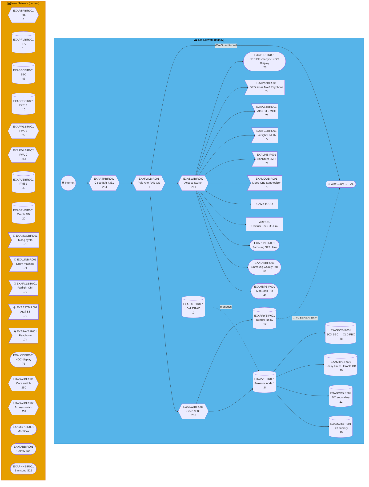
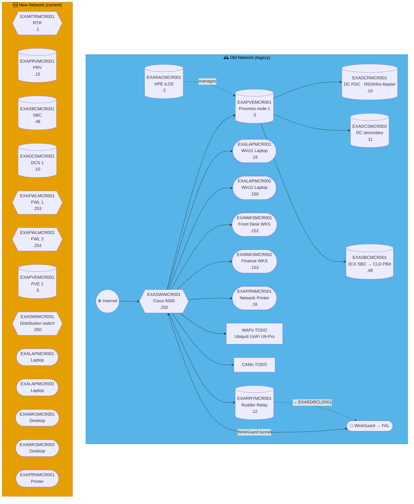
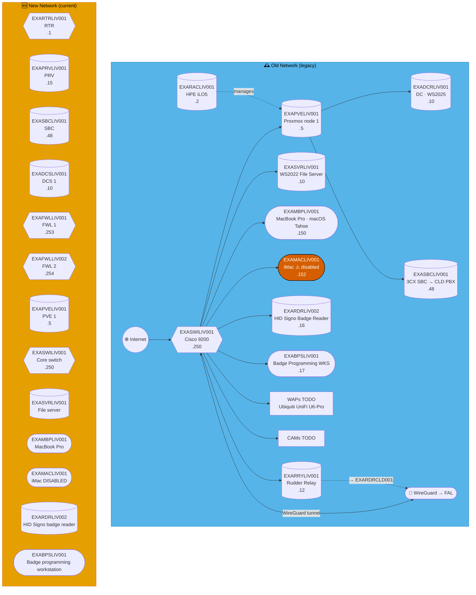
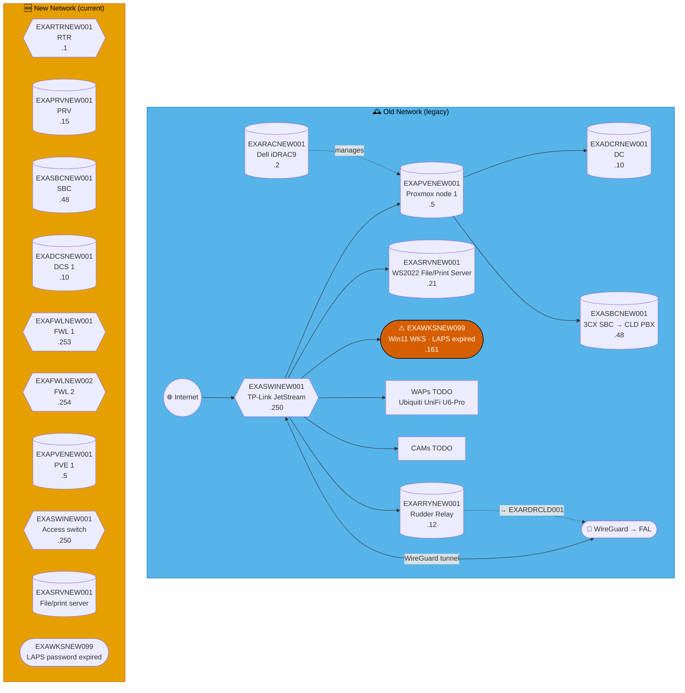
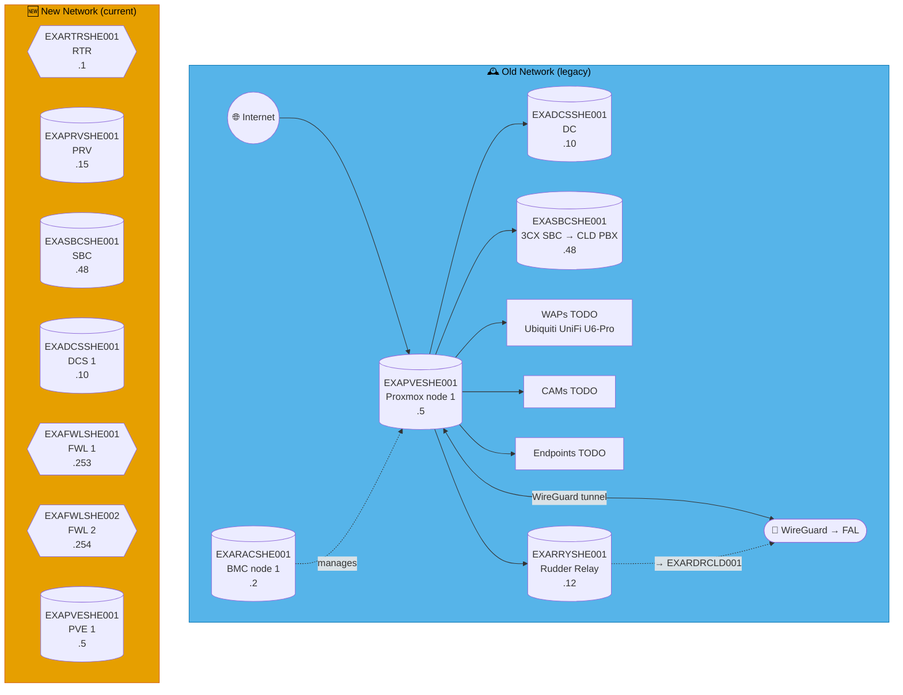
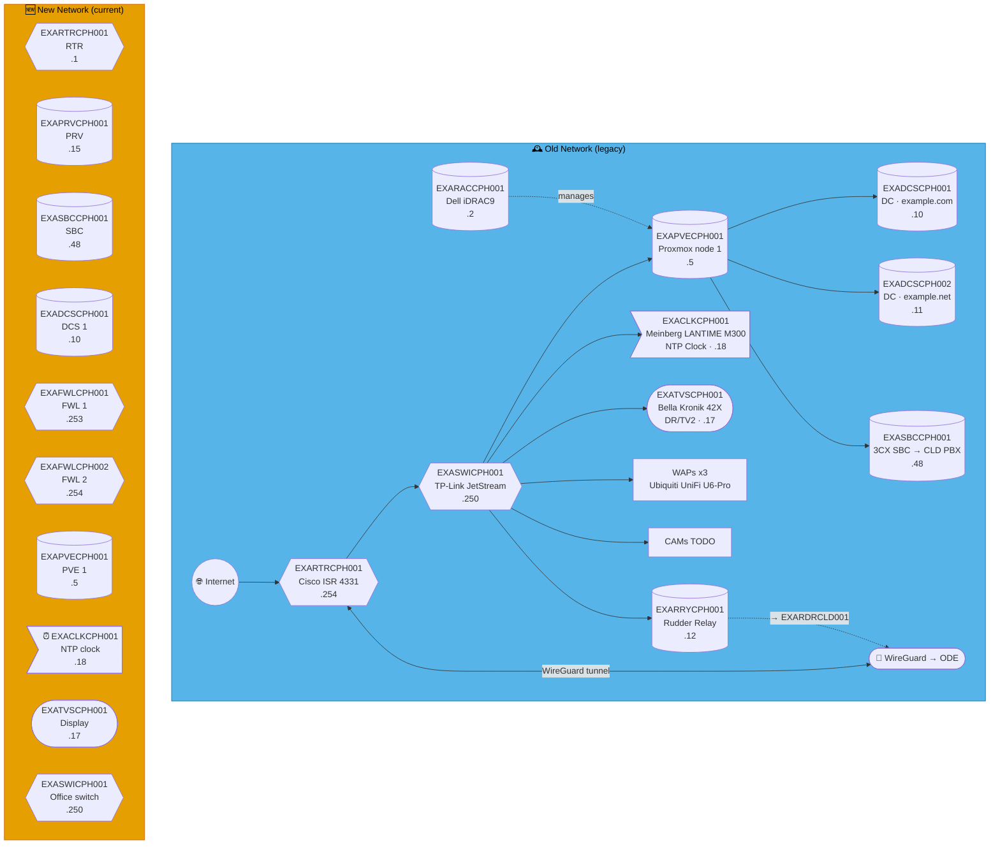
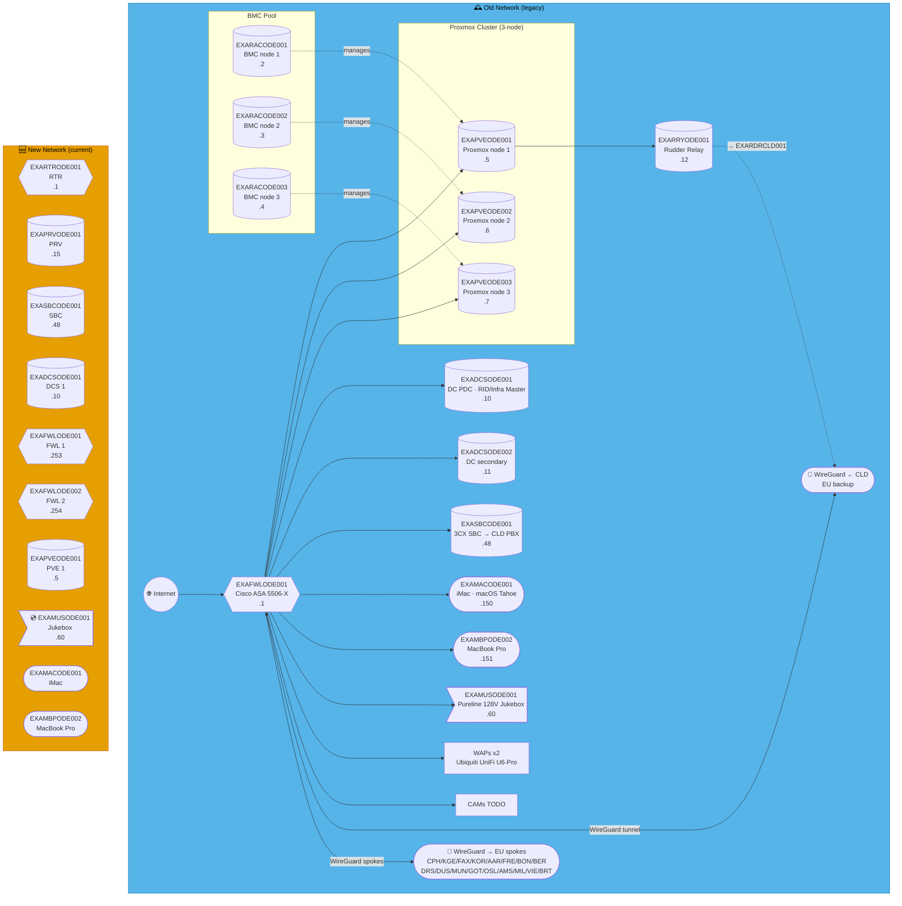
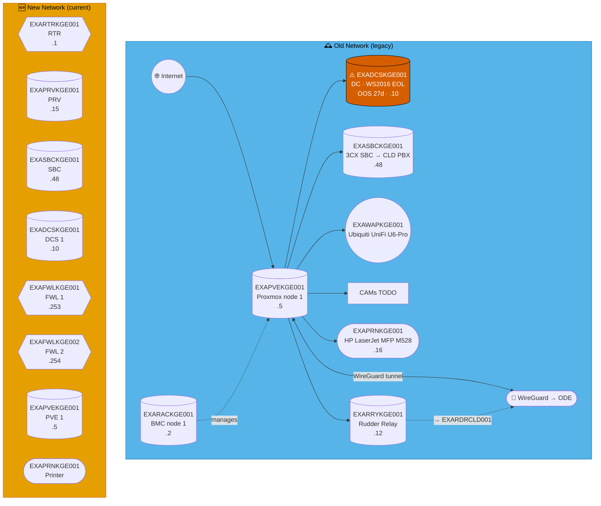
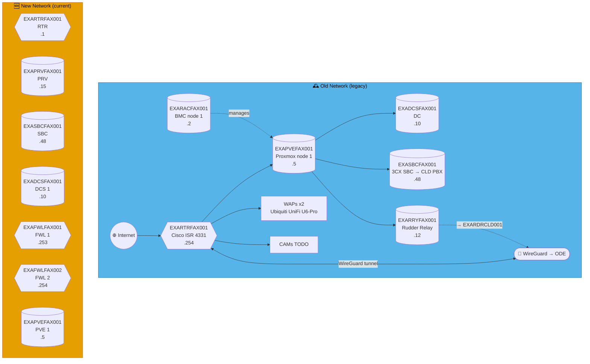
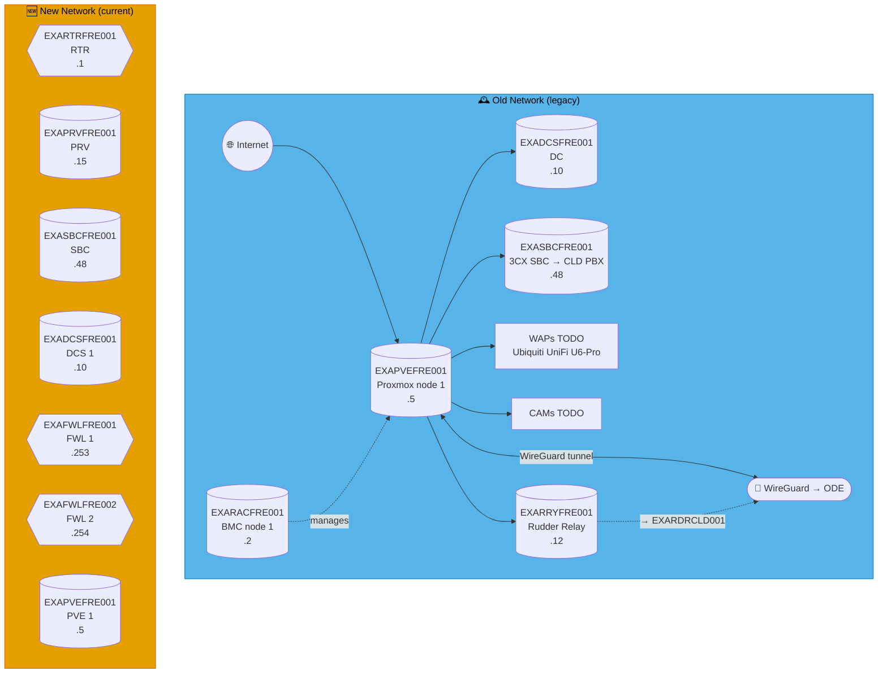

# Mermaid render bisection — Q2

Throwaway debug file, sites: BIR, MCR, LIV, NEW, SHE, HAL, HUL, COV, CPH, ODE, KGE, FAX, KOR, AAR, FRE

---

## BIR — Birmingham

**LAN:** `192.168.121.0/24` · **Domain:** `example.net`  
**PVE nodes:** 1 · **VPN parent:** FAL  
**Entity:** Example Music (England) Ltd · **Landline:** +44 121 496 0xxx · **Mobile:** +44 7700 900 2xxx

---

## MCR — Manchester

**LAN:** `192.168.161.0/24` · **Domain:** `example.org`  
**PVE nodes:** 1 · **VPN parent:** FAL  
**Entity:** Example Music (England) Ltd · **Landline:** +44 161 715 xxxx · **Mobile:** +44 770 090 6xxx

---

## LIV — Liverpool

**LAN:** `192.168.151.0/24` · **Domain:** `example.org`  
**PVE nodes:** 1 · **VPN parent:** FAL  
**Entity:** Example Music (England) Ltd · **Landline:** +44 151 496 0xxx · **Mobile:** +44 770 090 5xxx

---

## NEW — Newcastle

**LAN:** `192.168.191.0/24` · **Domain:** `example.org`  
**PVE nodes:** 1 · **VPN parent:** FAL  
**Entity:** Example Music (England) Ltd · **Landline:** +44 191 496 0xxx · **Mobile:** +44 770 090 9xxx

---

## SHE — Sheffield

**LAN:** `192.168.114.0/24` · **Domain:** `example.net`  
**PVE nodes:** 1 · **VPN parent:** FAL  
**Entity:** Example Music (England) Ltd · **Landline:** +44 114 250 0xxx · **Mobile:** +44 7700 905 2xxx

---

## HAL — Halifax

**LAN:** `192.168.142.0/24` · **Domain:** `example.net`  
**PVE nodes:** 1 · **VPN parent:** FAL  
**Entity:** Example Music (England) Ltd · **Landline:** +44 1422 200 0xxx · **Mobile:** +44 7700 904 2xxx

---

## HUL — Hull

**LAN:** `192.168.148.0/24` · **Domain:** `example.net`  
**PVE nodes:** 1 · **VPN parent:** FAL  
**Entity:** Example Music (England) Ltd · **Landline:** +44 1482 300 0xxx · **Mobile:** +44 7700 902 2xxx

---

## COV — Coventry

**LAN:** `192.168.247.0/24` · **Domain:** `example.net`  
**PVE nodes:** 1 · **VPN parent:** FAL  
*Note: WAP/RTR-only site — minimal infrastructure.*  
**Entity:** Example Music (England) Ltd · **Landline:** +44 247 765 0xxx · **Mobile:** +44 7700 901 2xxx

---

---

## 🇩🇰 Danmark

---

## CPH — København

**LAN:** `192.168.231.0/24` · **Domain:** `example.com` / `example.net`  
**PVE nodes:** 1 · **VPN parent:** ODE  
**Entity:** Example Music (Danmark) ApS · **Landline:** +45 00 000 xxx · **Mobile:** +45 2x xxx xxx

---

## ODE — Odense *(EU Hub)* ⭐

**LAN:** `192.168.126.0/24` · **Domain:** `example.net`  
**PVE nodes:** 3 (EU hub) · **VPN parent:** CLD (EU backup)  
**Entity:** Example Music (Danmark) ApS · **Landline:** +45 00 000 xxx · **Mobile:** +45 2x xxx xxx

---

## KGE — Køge ⚠️

**LAN:** `192.168.65.0/24` · **Domain:** `example.net`  
**PVE nodes:** 1 · **VPN parent:** ODE  
> ⚠️ DC out of sync 27 days · WS2016 EOL · disk space low — rebuild required  
**Entity:** Example Music (Danmark) ApS · **Landline:** +45 00 000 xxx · **Mobile:** +45 2x xxx xxx

---

## FAX — Faxe

**LAN:** `192.168.246.0/24` · **Domain:** `example.net`  
**PVE nodes:** 1 · **VPN parent:** ODE  
**Entity:** Example Music (Danmark) ApS · **Landline:** +45 00 000 xxx · **Mobile:** +45 2x xxx xxx

---

## KOR — Korsør

**LAN:** `192.168.238.0/24` · **Domain:** `example.net`  
**PVE nodes:** 1 · **VPN parent:** ODE  
**Entity:** Example Music (Danmark) ApS · **Landline:** +45 00 000 xxx · **Mobile:** +45 2x xxx xxx

---

## AAR — Aarhus

**LAN:** `192.168.86.0/24` · **Domain:** `example.net`  
**PVE nodes:** 1 · **VPN parent:** ODE  
**Entity:** Example Music (Danmark) ApS · **Landline:** +45 00 000 xxx · **Mobile:** +45 2x xxx xxx

---

## FRE — Fredericia

**LAN:** `192.168.75.0/24` · **Domain:** `example.net`  
**PVE nodes:** 1 · **VPN parent:** ODE  
**Entity:** Example Music (Danmark) ApS · **Landline:** +45 75 xx xx xx · **Mobile:** +45 2x xx xx xx

---
