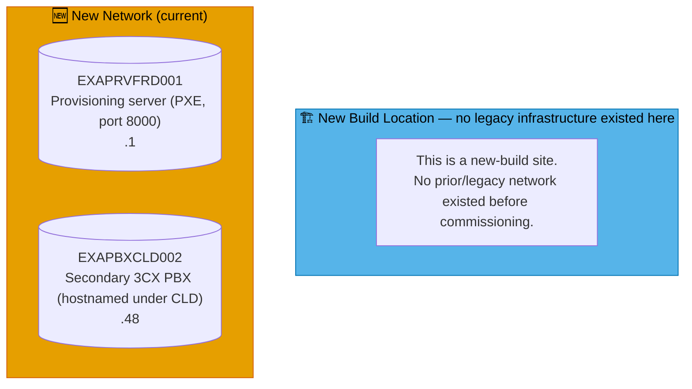
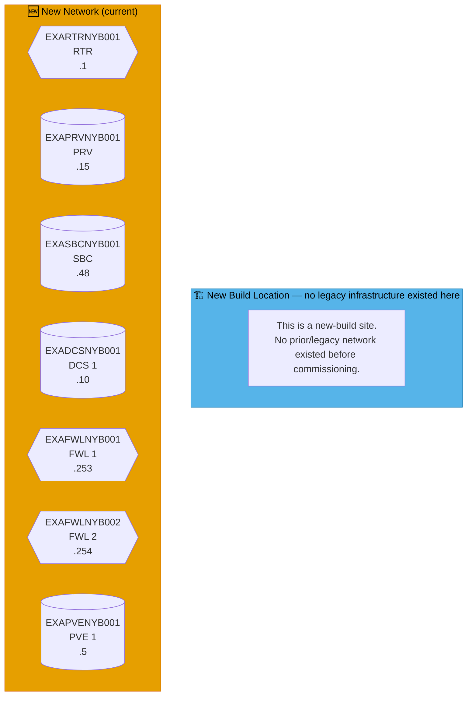
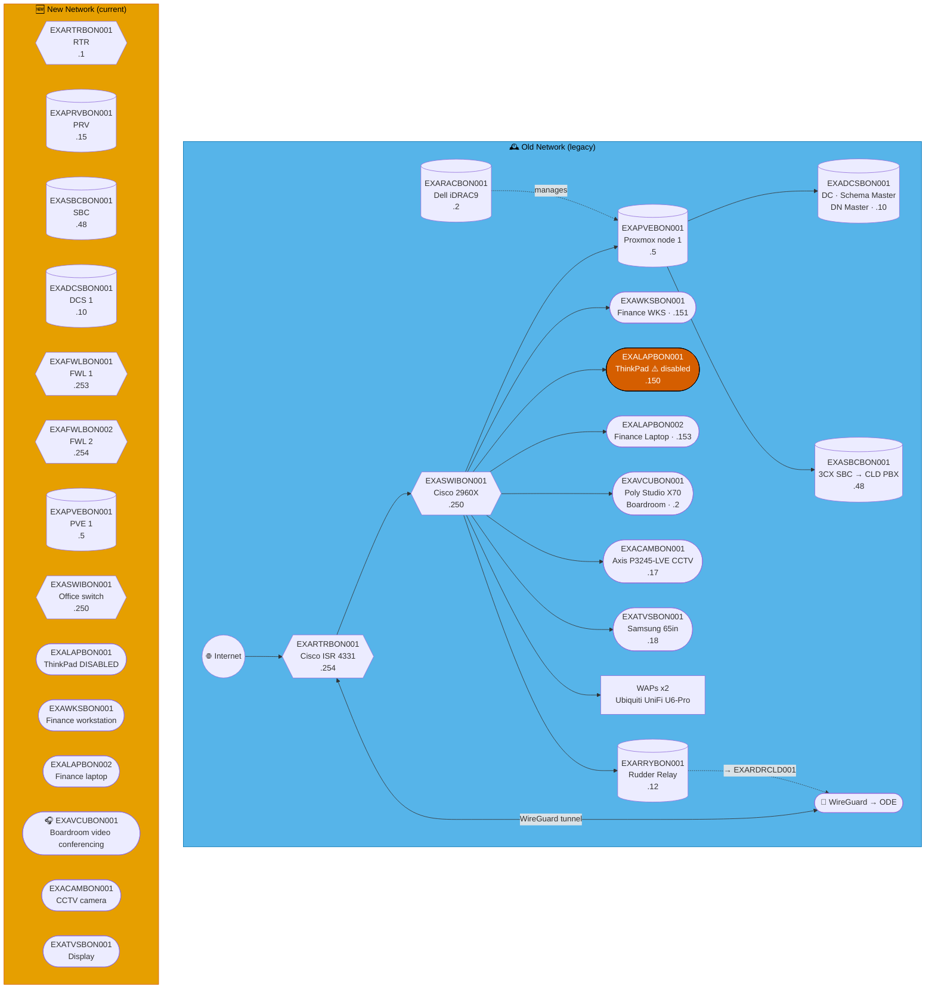
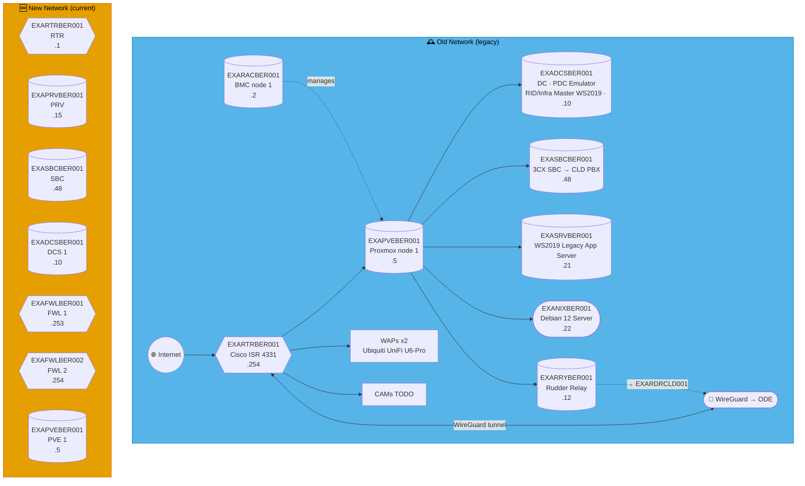
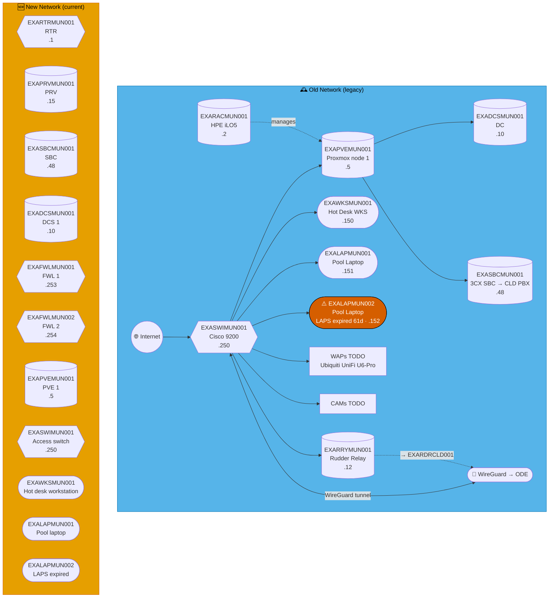
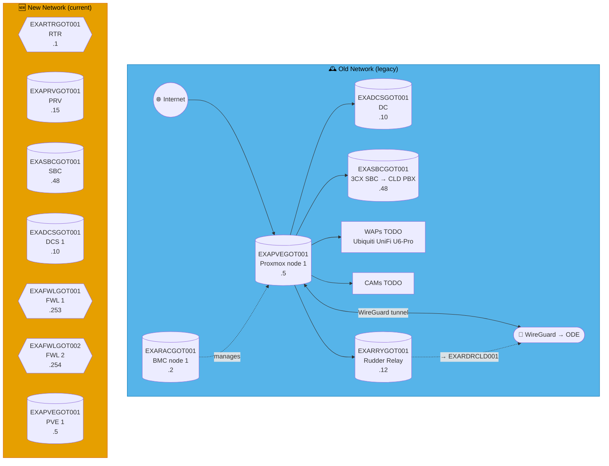
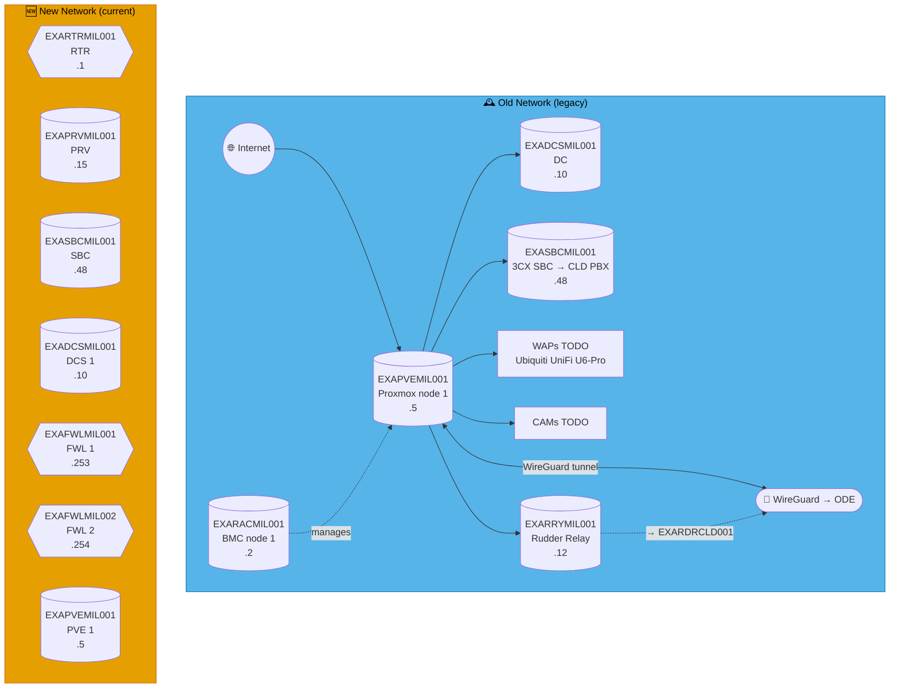
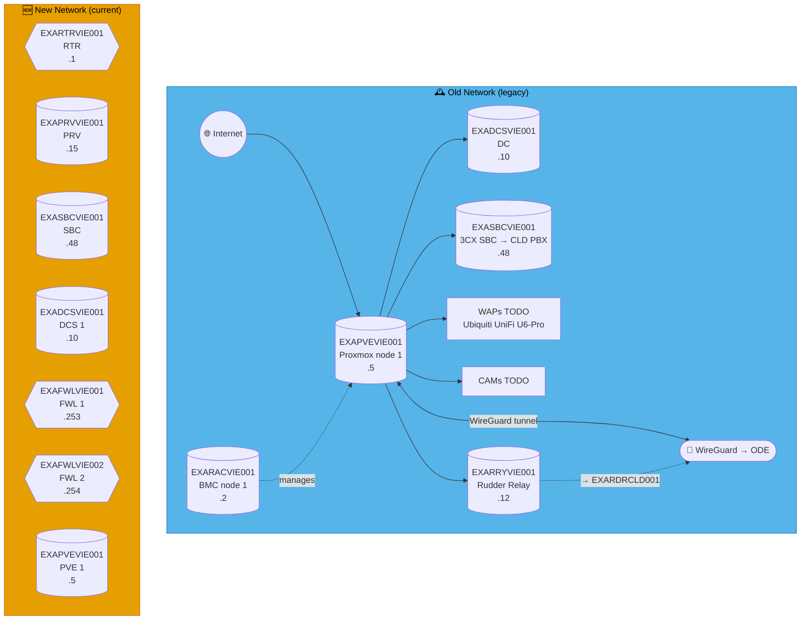
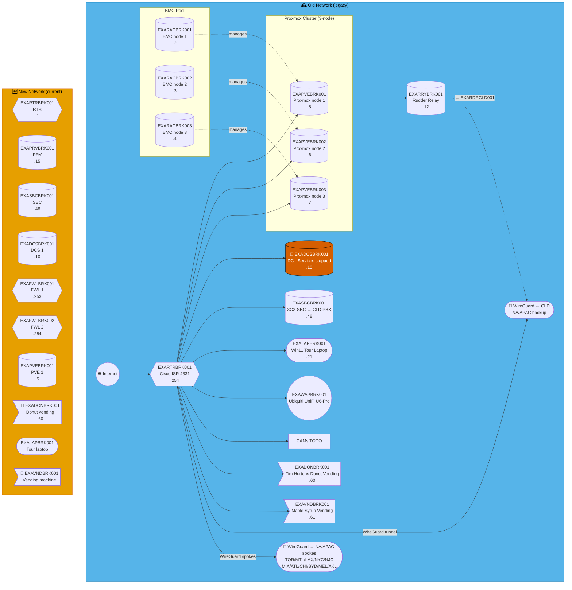

# Mermaid render bisection — Q3

Throwaway debug file, sites: FRD, NYB, BON, BER, MUN, DRS, DUS, GOT, OSL, AMS, MIL, VIE, BRT, BRK

---

## FRD — Fredericia Havn *(New Build)*

**LAN:** `172.16.124.0/24` · **Domain:** `example.net`  
**PVE nodes:** 0 — see notes below · **VPN parent:** CLD (direct, non-standard networking)  
**Entity:** Example Music Limited · **Landline:** N/A · **Mobile:** N/A

> **New-build site.** No legacy infrastructure ever existed here — see the "New Build Location" box below in place of "Old Network." Fredericia Havn is one machine today: a MacBook running `python3 -m http.server 8000` as a PXE mirror, plus a secondary 3CX PBX hostnamed under CLD (`EXAPBXCLD002`) but physically here — see `benarbejde/generate_inventory.py`'s `NON_STANDARD_SITES`/`SubnetSite` handling.

---

## NYB — Nyborg *(New Build)*

**LAN:** `192.168.90.0/24` · **Domain:** `example.net`  
**PVE nodes:** 1 (reserved — see notes below) · **VPN parent:** ODE  
**Entity:** Example Music (Danmark) ApS · **Landline:** +45 80 400 0xxx · **Mobile:** +45 200 900 2xxx

> **New-build site.** No legacy infrastructure ever existed here — see the "New Build Location" box below in place of "Old Network." Standard-slot addresses are allocated in `benarbejde/address_policy.json`/`sites.csv` the same as any other site (this is what makes the .ini/DNS generation already treat them as real, per the generated-file-freshness harness check) but no `devices.csv` exception rows exist yet — nothing beyond the standard template has been confirmed built on site.

---

---

## 🇩🇪 Deutschland

---

## BON — Bonn

**LAN:** `192.168.228.0/24` · **Domain:** `example.net`  
**PVE nodes:** 1 · **VPN parent:** ODE  
**Note:** Hosts Schema Master + Domain Naming Master  
**Entity:** Example Music (Deutschland) GmbH · **Landline:** +49 228 555 xxx · **Mobile:** +49 211 xxx xxxx

---

## BER — West Berlin

**LAN:** `192.168.113.0/24` · **Domain:** `example.net`  
**PVE nodes:** 1 · **VPN parent:** ODE  
**Entity:** Example Music (Deutschland) GmbH · **Landline:** +49 311 555 xxx · **Mobile:** +49 211 xxx xxxx

---

## MUN — Munich

**LAN:** `192.168.189.0/24` · **Domain:** `example.net`  
**PVE nodes:** 1 · **VPN parent:** ODE  
**Entity:** Example Music (Deutschland) GmbH · **Landline:** +49 893 555 33xx · **Mobile:** +49 893 555 99xx

---

## DRS — Dresden

**LAN:** `192.168.153.0/24` · **Domain:** `example.net`  
**PVE nodes:** 1 · **VPN parent:** ODE  
**Entity:** Example Music (Deutschland) GmbH · **Landline:** +49 351 555 xxx · **Mobile:** +49 172 xxx xxxx

---

## DUS — Düsseldorf

**LAN:** `192.168.211.0/24` · **Domain:** `example.net`  
**PVE nodes:** 1 · **VPN parent:** ODE  
**Entity:** Example Music (Deutschland) GmbH · **Landline:** +49 211 555 xxx · **Mobile:** +49 172 xxx xxxx

---

---

## 🇸🇪 Sverige

---

## GOT — Gothenburg

**LAN:** `192.168.46.0/24` · **Domain:** `example.net`  
**PVE nodes:** 1 · **VPN parent:** ODE  
**Entity:** Example Music (Sverige) AB · **Landline:** N/A · **Mobile:** N/A

---

---

## 🇳🇴 Norge

---

## OSL — Oslo

**LAN:** `192.168.47.0/24` · **Domain:** `example.net`  
**PVE nodes:** 1 · **VPN parent:** ODE  
**Entity:** Example Music (Norge) ASA · **Landline:** N/A · **Mobile:** N/A

---

---

## 🇳🇱 Nederland

---

## AMS — Amsterdam

**LAN:** `192.168.31.0/24` · **Domain:** `example.net`  
**PVE nodes:** 1 · **VPN parent:** ODE  
**Entity:** Example Music (Nederland) B.V. · **Landline:** N/A · **Mobile:** N/A

---

---

## 🇮🇹 Italia

---

## MIL — Milan

**LAN:** `192.168.39.0/24` · **Domain:** `example.net`  
**PVE nodes:** 1 · **VPN parent:** ODE  
**Entity:** Example Music (Italia) S.p.a. · **Landline:** N/A · **Mobile:** N/A

---

---

## 🇦🇹 Österreich

---

## VIE — Vienna

**LAN:** `192.168.78.0/24` · **Domain:** `example.net`  
**PVE nodes:** 1 · **VPN parent:** ODE  
**Entity:** Example Music (Osterreich) GmbH · **Landline:** +43 800 078 0xx · **Mobile:** +43 664 665 xxx

---

---

## 🇱🇧 Lebanon

---

## BRT — Beirut

**LAN:** `192.168.169.0/24` · **Domain:** `example.net`  
**PVE nodes:** 1 · **VPN parent:** ODE  
**Entity:** Example Music (Lebanon) SAL · **Landline:** +961 1 555 xxxx · **Mobile:** +961 3 555 xxxx

---

---

## 🇨🇦 Canada

---

## BRK — Brockville *(NA/APAC Hub)* ⭐

**LAN:** `192.168.136.0/24` · **Domain:** `example.net`  
**PVE nodes:** 3 (NA/APAC hub) · **VPN parent:** CLD (NA/APAC backup)  
> ⚠️ `EXADCSBRK001` — DNS, Netlogon and KDC services stopped.  
**Entity:** Example Music (Canada) Inc. · **Landline:** +1 613 555 6xxx · **Mobile:** +1 613 555 6xxx

---
