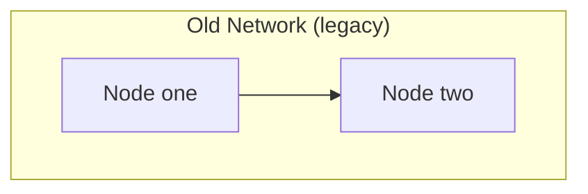
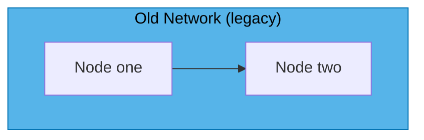
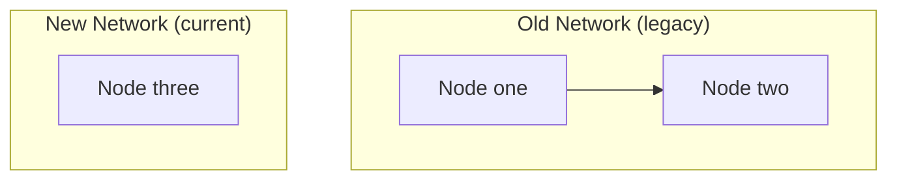
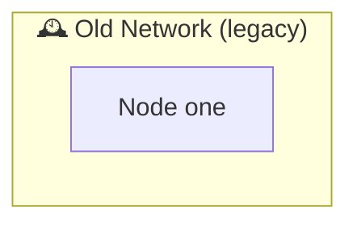
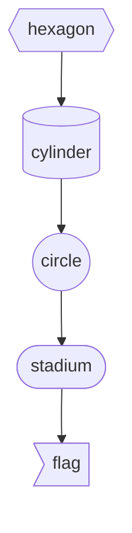
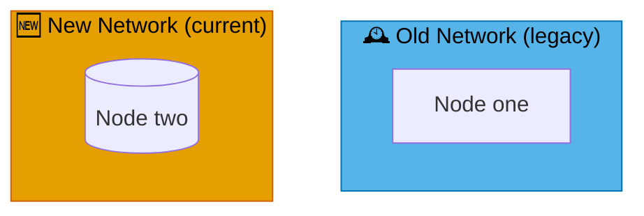
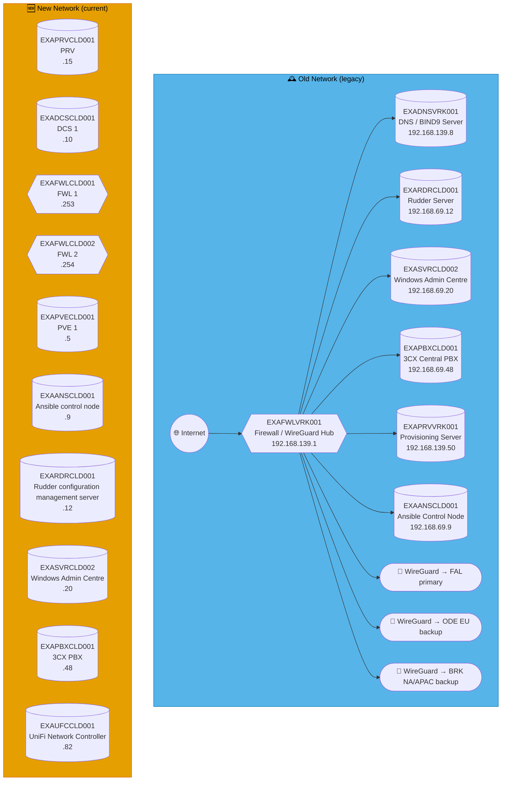

# Mermaid GitHub render debug

Throwaway file, not indexed, will be deleted once the CLD/network-diagram.md render bug is found.
kroki.io renders all of these fine — the point is to find which ones GitHub's renderer rejects.
For each one, tell me: renders fine, or "Unable to render rich display"?

## A — plain subgraph, no style, no comment (baseline, matches the pre-existing working pattern)

## B — subgraph + style targeting the subgraph ID (this file's current New/Old Network pattern)

## C — subgraph + a %% comment right after end (isolates the GENERATED marker theory)

## D — subgraph title WITH emoji + quotes (isolates the emoji-in-subgraph-title theory)

## E — the five node shapes together (isolates the shape-syntax theory)

## F — style on subgraph AND emoji title AND %% comment together (closest full reproduction)

## G — CLD's actual real diagram, copied verbatim, as the control

