# Buildsheet — Firewall / Router (EXAFWL\*001)

**Doc ID:** NET-BUILD-FWL-001  
**Last Updated:** 2026-03-06  
**Applies to:** All site firewall/router VMs — hub-primary (FAL), hub-regional (ODE, BRK), spokes (all other sites)  
**Script:** `firewallme.sh` — hosted on bootstrap server at `http://192.168.139.50/firewallme.sh`  
**Cross-reference:** `bootstrap/ad-dc-wireguard-deployment.md` (NET-AD-DC-001) · `buildsheet-pve.md` (NET-BUILD-PVE-001)

> ⚠️ **Build hubs before spokes.** FAL must be fully live before any spoke or regional hub can establish its WireGuard tunnel.  
> Order: **FAL → ODE → BRK → all spokes**

---

## Architecture Overview

```mermaid
graph TD
    WAN["🌐 WAN / Provisioning\n192.168.139.0/24\n bootstrap: 192.168.139.50"]

    FAL["🏴󠁧󠁢󠁳󠁣󠁴󠁿 FAL — Falkirk\nhub-primary\n192.168.76.0/24 · wg: 10.0.76.1"]
    ODE["🇩🇰 ODE — Odense\nhub-regional\n192.168.126.0/24 · wg: 10.0.126.1"]
    BRK["🇨🇦 BRK — Brockville\nhub-regional\n192.168.136.0/24 · wg: 10.0.136.1"]

    WAN --> FAL
    WAN --> ODE
    WAN --> BRK
    FAL <-->|WireGuard mesh| ODE
    FAL <-->|WireGuard mesh| BRK
    ODE <-->|WireGuard mesh| BRK

    subgraph UK ["🇬🇧 United Kingdom — FAL spokes"]
        direction TB
        EDI["EDI · Edinburgh · .131"]
        GLA["GLA · Glasgow · .141"]
        CLY["CLY · Clydebank · .41"]
        DUN["DUN · Dundee · .138"]
        PER["PER · Perth · .173"]
        ABD["ABD · Aberdeen · .224"]
        LND["LND · London · .20"]
        MCR["MCR · Manchester · .161"]
        BIR["BIR · Birmingham · .121"]
        LIV["LIV · Liverpool · .151"]
        NEW["NEW · Newcastle · .191"]
        SHE["SHE · Sheffield · .114"]
        HUL["HUL · Hull · .148"]
        COV["COV · Coventry · .247"]
        HAL["HAL · Halifax · .142"]
    end

    subgraph EU ["🇪🇺 Europe — ODE spokes"]
        direction TB
        CPH["CPH · København · .231"]
        KGE["KGE · Køge · .65"]
        FAX["FAX · Faxe · .246"]
        KOR["KOR · Korsør · .238"]
        BON["BON · Bonn · .228"]
        BER["BER · Berlin · .113"]
        MUN["MUN · Munich · .189"]
        GOT["GOT · Gothenburg · .46"]
        OSL["OSL · Oslo · .47"]
        AMS["AMS · Amsterdam · .31"]
        MIL["MIL · Milan · .39"]
        VIE["VIE · Vienna · .78"]
    end

    subgraph NAAPAC ["🌎 Americas & APAC — BRK spokes"]
        direction TB
        TOR["TOR · Toronto · .146"]
        MTL["MTL · Montréal · .154"]
        NYC["NYC · New York · .212"]
        LAX["LAX · Los Angeles · .213"]
        MIA["MIA · Miami · .135 ⚠️"]
        NJC["NJC · New Jersey · .201"]
        CHI["CHI · Chicago · .214"]
        ATL["ATL · Atlanta · .33"]
        SYD["SYD · Sydney · .29"]
        MEL["MEL · Melbourne · .61"]
        AKL["AKL · Auckland · .93"]
    end

    FAL --> UK
    ODE --> EU
    BRK --> NAAPAC
```



> Spokes connect to their regional hub. UK/Ireland spokes → FAL, European spokes → ODE, Americas/APAC spokes → BRK.  
> Regional hubs are fully meshed with FAL and each other for resilience.

---

## VM Specifications

| Parameter | Value |
|-----------|-------|
| vCPU | 1–2 |
| RAM | 512 MB |
| Disk | 5 GB (LVM, expandable) |
| NIC 1 (WAN) | Proxmox bridge connected to uplink / WAN vSwitch |
| NIC 2 (LAN) | Proxmox bridge connected to site LAN vSwitch |
| OS | Debian 13 (Trixie) — installed via iPXE/preseed |
| PVE node | Site PVE node (`.5` — or `.6`/`.7` at hub sites) |

> On VMware Fusion (ARM64 lab/test) use Host-Only for LAN, Bridged for WAN. Memory/CPU same.

---

## Step 1 — Create the VM on Proxmox

Use `create-vm.py` from DeployTools to provision the VM:

```bash
# From the PVE node or a machine with API access:
python3 create-vm.py --host 192.168.76.5 --user root@pam
```

Follow the interactive prompts. Suggested settings:

| Field | Value |
|-------|-------|
| VM name | `EXAFWL<SITE>001` (e.g. `EXAFWLEDI001`) |
| Memory | 512 MB |
| CPU | 1 socket, 2 cores |
| Disk | 5 GB, `zfs` or `local-lvm` |
| NIC 1 | `vmbr0` (WAN / uplink bridge) |
| NIC 2 | `vmbr1` (LAN bridge) |
| Boot order | CD-ROM first |

> If provisioning the **first VM at a new site** with no existing PVE node, boot the Debian ISO directly from the Proxmox web UI or attach via IPMI/RAC before WireGuard is up.

---

## Step 2 — Boot and Install Debian via iPXE

The Debian installer is served from the bootstrap server (`192.168.139.50`) using iPXE + preseed.

**2a. Boot the VM.** When the iPXE prompt appears:

```
dhcp net0
chain http://192.168.139.50/boot.ipxe
```

> If DHCP is already configured to serve the iPXE chain, this happens automatically.

**2b. The iPXE menu appears.** Select **Debian Install** (or equivalent entry in `boot.ipxe`).

**2c. The installer runs unattended using `lvm.seed`.** You will be prompted for:

| Prompt | Value |
|--------|-------|
| Hostname | `EXAFWL<SITE>001` — e.g. `EXAFWLEDI001` |
| Ansible user password | See password manager — **change immediately after first boot** |

The installer will then proceed automatically. Watch the bootstrap server console — you will see HTTP requests for `lvm.seed`, `late_command.sh`, and `ansible_sshkey.pub` as the install progresses.

**What `lvm.seed` configures automatically:**
- GB locale and keyboard
- Debian mirror: `ftp.uk.debian.org`
- LVM partitioning: `/boot` (ext3, 384MB) + swap (512MB LV) + `/` (ext4, 5GB LV, expandable)
- VG name = hostname
- Packages: `vim tmux openssh-server net-tools tofrodos tree sudo zsh zsh-autosuggestions zsh-syntax-highlighting`
- Unattended security updates enabled
- Calls `late_command.sh` at the end

**What `late_command.sh` does:**
- Forces LVM modules into initramfs (ensures LVM is accessible at boot)
- Adds `ansible` user to `sudo`
- Installs `openssh-server`, `sudo`, `net-tools`, `bash-completion`
- Fetches `ansible_sshkey.pub` from `http://192.168.139.50/` and places it in `/home/ansible/.ssh/authorized_keys`
- Sets up `.vimrc` (ruler, dark background, syntax hilighting)
- Configures password-less sudo for the `ansible` user via `/etc/sudoers.d/ansible`

**2d. On first reboot:** the VM comes up with Debian installed, `ansible` user present, SSH key auth ready.

---

## Step 3 — Change the Ansible User Password

```bash
ssh ansible@<VM-IP>
passwd
```

> ⚠️ The default password set during preseed install **must be changed immediately**. See password manager for the current default and the required new credential pattern.

---

## Step 4 — Run `firewallme.sh`

`firewallme.sh` configures NAT, DHCP/DNS, WireGuard, Cockpit, SSH banner, and dynamic MOTD.

```bash
wget http://192.168.139.50/firewallme.sh
tofrodos firewallme.sh
chmod 755 firewallme.sh
sudo ./firewallme.sh
```

The script is interactive. It will prompt for the following — answers for each site are in the network inventory (`network-inventory.md`):

| Prompt | Notes |
|--------|-------|
| WAN interface | Auto-detected from `192.168.139.x` DHCP lease — confirm or override |
| LAN interface | Remaining interface — confirm |
| Site code | e.g. `EDI`, `CPH`, `BRK` — auto-fills subnet, city, entity |
| LAN IP suffix | `1` (primary gateway) or `253` (secondary) — see network inventory |
| Ansible/PXE last octet | `15` (standard) |
| Internal DNS IP | Last octet of DC primary — e.g. `10` → `192.168.x.10` — leave blank if DC not yet built |
| WAN SSH | `N` unless remote access required — if yes, restrict to source IP |
| WireGuard role | `hub-primary` (FAL only) · `hub-regional` (ODE, BRK) · `spoke` (all others) · `none` |

**WireGuard role-specific prompts:**

*Hub-primary / hub-regional:*
- Tunnel IP (default: `10.0.<octet>.1`)
- Listen port (default: `51820`)
- For hub-regional: FAL endpoint and public key (fetched automatically via SSH, or paste manually)
- Add spoke peers interactively, or skip and edit `/etc/wireguard/wg0.conf` later

*Spoke:*
- Tunnel IP (default: `10.0.<octet>.2`)
- Hub site code (e.g. `FAL`, `ODE`, `BRK`) — endpoint and public key auto-fetched or pasted
- Optional backup hub peers

> **Hub key auto-fetch:** The script will attempt `ssh ansible@<hub-ip> 'cat /etc/wireguard/public.key'` automatically. If SSH fails (hub not yet reachable or key not accepted), it falls back to manual paste. The hub's public key is always saved at `/etc/wireguard/public.key`.

**What `firewallme.sh` configures:**
- Installs all required packages (NM, nftables, dnsmasq, WireGuard, Cockpit, grc, tmux, zsh, etc.)
- Cockpit Navigator file manager plugin
- Strips unused locales, generates lean initramfs (blacklists audio/GPU/WiFi/BT modules)
- Sets up zsh + prompt for `ansible` and `root`
- Pins interface names by MAC via systemd `.link` files (survives reboots and PCI bus shuffles)
- Creates NetworkManager WAN (DHCP) and LAN (static) profiles
- Enables IP forwarding
- Configures nftables: NAT/masquerade, FORWARD, INPUT (SSH, Cockpit, DNS, DHCP, TFTP, HTTP on LAN; WireGuard on WAN for hubs)
- Configures dnsmasq: DHCP range `.150`–`.250`, upstream DNS, iPXE vendor class tagging, local DNS records (`ansible.jukebox.internal` + CNAMEs)
- Binds Cockpit socket to LAN IP only
- Generates and starts WireGuard (`wg-quick@wg0`)
- Configures SSH login banner (entity, site, hostname)
- Configures dynamic MOTD (ASCII art, WireGuard peer status, system stats)
- Writes node info file `/etc/example-music/nodeinfo.json` (prevents re-runs; shows build config)
- Prompts to reboot

---

## Step 5 — Reboot

The script prompts to reboot. **Say yes.** This ensures:
- systemd `.link` files take effect (interface name pinning)
- NM profiles load cleanly
- WireGuard starts via `wg-quick@wg0.service`
- Cockpit socket binds to LAN correctly

---

## Step 6 — Add This Site as a Peer on the Hub (Spokes Only)

After the spoke reboots, the script will have printed a peer stanza. Copy it to the hub:

```
# <SITE>
[Peer]
PublicKey = <spoke-public-key>
Endpoint = <spoke-WAN-IP>:51820
AllowedIPs = 10.0.<octet>.0/24, 192.168.<octet>.0/24
PersistentKeepalive = 25
```

On the hub, append this to `/etc/wireguard/wg0.conf` and apply live:

```bash
sudo bash -c 'wg setconf wg0 <(wg-quick strip /etc/wireguard/wg0.conf)'
sudo wg show
```

The spoke's public key is always retrievable at:
```bash
sudo cat /etc/wireguard/public.key
# or derive from private key:
sudo cat /etc/wireguard/private.key | wg pubkey
```

---

## Step 7 — Verify

```bash
# On the spoke — check tunnel is up and hub handshake received
sudo wg show

# Ping hub tunnel IP
ping -c 3 10.0.76.1        # FAL hub-primary
ping -c 3 10.0.126.1       # ODE hub-regional
ping -c 3 10.0.136.1       # BRK hub-regional

# Ping hub LAN
ping -c 3 192.168.76.10    # FAL DC

# Check dnsmasq is serving DHCP/DNS
dig ansible.jukebox.internal @192.168.<site-octet>.1

# Check Cockpit
curl -k https://192.168.<site-octet>.<1 or 253>:9090

# Useful diagnostics
sudo tcpdump -i <WAN-iface> udp port 51820 -n   # WireGuard traffic
sudo nft list ruleset                             # firewall rules
sudo journalctl -u wg-quick@wg0 -n 50           # WG service log
sudo journalctl -u dnsmasq -n 50                 # DHCP/DNS log
```

**Fix subnet if AllowedIPs was set to /32 instead of /24:**
```bash
sudo sed -i 's/AllowedIPs = 10.0.<octet>.0\/32/AllowedIPs = 10.0.<octet>.0\/24/' /etc/wireguard/wg0.conf
sudo bash -c 'wg setconf wg0 <(wg-quick strip /etc/wireguard/wg0.conf)'
```

---

## Step 8 — Add to Ansible Inventory

Once the firewall is up and reachable, add it to the Ansible inventory on `EXASVRCLD002` (Ansible control node, `192.168.139.49`).

---

## Useful Post-Build Commands

```bash
# Live WireGuard reload without reboot
sudo bash -c 'wg setconf wg0 <(wg-quick strip /etc/wireguard/wg0.conf)'

# View WireGuard status (peers, handshakes, traffic)
sudo wg show

# Verify traffic on WAN
sudo tcpdump -i <WAN-iface> udp port 51820 -n

# View nftables ruleset
sudo nft list ruleset

# Reload nftables rules
sudo nft -f /etc/nftables.conf

# dnsmasq status
sudo systemctl status dnsmasq
sudo journalctl -u dnsmasq -f

# Cockpit
https://192.168.<octet>.<1 or 253>:9090

# Node info file (shows build config)
cat /etc/example-music/nodeinfo.json
```

---

## Build Checklist

> One row per site. Tick left to right.  
>
> **Columns:**
> `VM` 	`VM created on PVE`
> `OS`	`Debian installed via iPXE`
> `PW`	`ansible password changed`
> `FW`	`firewallme.sh run`
> `RB`	`rebooted`
> `WG`	`WireGuard tunnel up`
> `PR`	`Peer stanza added to hub`
> `VF`	`verified (ping + DNS + Cockpit)`
> `AN`	`added to Ansible inventory`
> `OK`	`engineer sign-off`


### Cloud / Provisioning (build these first)

| Site | Hostname     | IP              | Role        | VM   | OS   | PW   | FW   | RB   | WG   | PR   | VF   | AN   | OK   | Notes                         |
| ---- | ------------ | --------------- | ----------- | ---- | ---- | ---- | ---- | ---- | ---- | ---- | ---- | ---- | ---- | ----------------------------- |
| CLD  | EXAFWLCLD001 | 192.168.139.253 | Cloud Infra | X    | X    | X    | X    | X    | X    | N/A  | X    |      |      | Hosted at OVH                 |
| PRV  | EXAFWLPRV001 | 192.168.139.253 | Cloud twin  | X    | X    | X    | X    | X    | X    | X    | X    |      |      | Legal fiction. Does not exist |

### Hubs (build these next)

| Site | Hostname | IP | Role | VM | OS | PW | FW | RB | WG | PR | VF | AN | OK | Notes |
|------|----------|----|----|----|----|----|----|----|----|----|----|----|----|-------|
| FAL | EXAFWLFAL001 | 192.168.76.253 | hub-primary | X | X    | X    | X    | X    | X    | N/A  | X    |      |      | Head Office · build first! |
| ODE | EXAFWLODE001 | 192.168.126.253 | hub-regional | X | X    | X    | X    | X    | X    | X    | X    |      |      | EU Head Office peer with FAL |
| BRK | EXAFWLBRK001 | 192.168.136.253 | hub-regional |      |      |      |      |      |      |      |      |      |      | NA/APAC Head Office · peer with FAL |

### Scotland

| Site | Hostname | IP | VM | OS | PW | FW | RB | WG | PR | VF | AN | OK | Notes |
|------|----------|----|----|----|----|----|----|----|----|----|----|----|----|
| ABD | EXAFWLABD001 | 192.168.224.253 |      |      |      |      |      |      |      |      |      |      | |
| CLY | EXAFWLCLY001 | 192.168.41.253 |      |      |      |      |      |      |      |      |      |      | |
| DUN | EXAFWLDUN001 | 192.168.138.253 |      |      |      |      |      |      |      |      |      |      | |
| EDI | EXAFWLEDI001 | 192.168.131.253 |      |      |      |      |      |      |      |      |      |      | |
| GLA | EXAFWLGLA001 | 192.168.141.253 |      |      |      |      |      |      |      |      |      |      | |
| PER | EXAFWLPER001 | 192.168.173.253 |      |      |      |      |      |      |      |      |      |      | |

### England

| Site | Hostname | IP | VM | OS | PW | FW | RB | WG | PR | VF | AN | OK | Notes |
|------|----------|----|----|----|----|----|----|----|----|----|----|----|----|
| BIR | EXAFWLBIR001 | 192.168.121.253 |      |      |      |      |      |      |      |      |      |      | |
| COV | EXAFWLCOV001 | 192.168.247.253 |      |      |      |      |      |      |      |      |      |      | |
| HUL | EXAFWLHUL001 | 192.168.148.253 |      |      |      |      |      |      |      |      |      |      | |
| HAL | EXAFWLHAL001 | 192.168.142.253 |      |      |      |      |      |      |      |      |      |      | |
| LIV | EXAFWLLIV001 | 192.168.151.253 |      |      |      |      |      |      |      |      |      |      | |
| LND | EXAFWLLND001 | 192.168.20.253 |      |      |      |      |      |      |      |      |      |      | |
| MCR | EXAFWLMCR001 | 192.168.161.253 |      |      |      |      |      |      |      |      |      |      | |
| NEW | EXAFWLNEW001 | 192.168.191.253 |      |      |      |      |      |      |      |      |      |      | |
| SHE | EXAFWLSHE001 | 192.168.114.253 |      |      |      |      |      |      |      |      |      |      | |

### Danmark

| Site | Hostname | IP | VM | OS | PW | FW | RB | WG | PR | VF | AN | OK | Notes |
|------|----------|----|----|----|----|----|----|----|----|----|----|----|----|
| CPH | EXAFWLCPH001 | 192.168.231.253 |      |      |      |      |      |      |      |      |      |      | DeployTools host site |
| FAX | EXAFWLFAX001 | 192.168.246.253 |      |      |      |      |      |      |      |      |      |      | |
| KGE | EXAFWLKGE001 | 192.168.65.253 |      |      |      |      |      |      |      |      |      |      | |
| KOR | EXAFWLKOR001 | 192.168.238.253 |      |      |      |      |      |      |      |      |      |      | |

### Deutschland

| Site | Hostname | IP | VM | OS | PW | FW | RB | WG | PR | VF | AN | OK | Notes |
|------|----------|----|----|----|----|----|----|----|----|----|----|----|----|
| BER | EXAFWLBER001 | 192.168.113.253 |      |      |      |      |      |      |      |      |      |      | |
| BON | EXAFWLBON001 | 192.168.228.253 |      |      |      |      |      |      |      |      |      |      | |
| MUN | EXAFWLMUN001 | 192.168.189.253 |      |      |      |      |      |      |      |      |      |      | |

### Sverige / Norge / Nederland / Italia / Österreich

| Site | Hostname | IP | VM | OS | PW | FW | RB | WG | PR | VF | AN | OK | Notes |
|------|----------|----|----|----|----|----|----|----|----|----|----|----|----|
| AMS | EXAFWLAMS001 | 192.168.31.253 |      |      |      |      |      |      |      |      |      |      | Amsterdam |
| GOT | EXAFWLGOT001 | 192.168.46.253 |      |      |      |      |      |      |      |      |      |      | Gothenburg |
| MIL | EXAFWLMIL001 | 192.168.39.253 |      |      |      |      |      |      |      |      |      |      | Milan |
| OSL | EXAFWLOSL001 | 192.168.47.253 |      |      |      |      |      |      |      |      |      |      | Oslo |
| VIE | EXAFWLVIE001 | 192.168.78.253 |      |      |      |      |      |      |      |      |      |      | Vienna |

### Canada

| Site | Hostname | IP | VM | OS | PW | FW | RB | WG | PR | VF | AN | OK | Notes |
|------|----------|----|----|----|----|----|----|----|----|----|----|----|----|
| MTL | EXAFWLMTL001 | 192.168.154.253 |      |      |      |      |      |      |      |      |      |      | Montréal |
| TOR | EXAFWLTOR001 | 192.168.146.253 |      |      |      |      |      |      |      |      |      |      | Toronto |

### USA

| Site | Hostname | IP | VM | OS | PW | FW | RB | WG | PR | VF | AN | OK | Notes |
|------|----------|----|----|----|----|----|----|----|----|----|----|----|----|
| ATL | EXAFWLATL001 | 192.168.33.253 |      |      |      |      |      |      |      |      |      |      | Athens GA |
| CHI | EXAFWLCHI001 | 192.168.214.253 |      |      |      |      |      |      |      |      |      |      | Chicago |
| LAX | EXAFWLLAX001 | 192.168.213.253 |      |      |      |      |      |      |      |      |      |      | Los Angeles |
| MIA | EXAFWLMIA001 | 192.168.135.253 |      |      |      |      |      |      |      |      |      |      | Miami — PENDING BUILD |
| NJC | EXAFWLNJC001 | 192.168.201.253 |      |      |      |      |      |      |      |      |      |      | New Jersey |
| NYC | EXAFWLNYC001 | 192.168.212.253 |      |      |      |      |      |      |      |      |      |      | New York |

### Australia / New Zealand

| Site | Hostname | IP | VM | OS | PW | FW | RB | WG | PR | VF | AN | OK | Notes |
|------|----------|----|----|----|----|----|----|----|----|----|----|----|----|
| AKL | EXAFWLAKL001 | 192.168.93.253 |      |      |      |      |      |      |      |      |      |      | Auckland |
| MEL | EXAFWLMEL001 | 192.168.61.253 |      |      |      |      |      |      |      |      |      |      | Melbourne |
| SYD | EXAFWLSYD001 | 192.168.29.253 |      |      |      |      |      |      |      |      |      |      | Sydney |

---

## Sign-Off

| Role | Name | Signature | Date |
|------|------|-----------|------|
| Build engineer | | | |
| Network lead | | | |
| Operations manager | | | |

---

## Appendix — Bootstrap Server Contents Reference

The bootstrap server at `192.168.139.50` (or `http://ansible.jukebox.internal/` once DNS is up) serves:

| File | Purpose |
|------|---------|
| `boot.ipxe` | iPXE boot menu — Debian install + rescue options |
| `lvm.seed` | Debian preseed — partitioning, locale, packages, late_command |
| `late_command.sh` | Post-install chroot script — ansible user, SSH key, sudoers |
| `ansible_sshkey.pub` | Ansible SSH public key — deployed to all nodes at install |
| `firewallme.sh` | Firewall/router setup script — run manually on first boot |
| `debian/` | Debian netboot files |
| `phoenixpe/` | WinPE recovery environment |

> `firewallme.sh` will be moved to `bootstrap/` in the main documentation repo once published. The script contains reference WAN IPs and WireGuard public keys for FAL and ODE in its `HUB_KNOWN_PUBKEY` and `HUB_WAN_IP` tables — update these if either hub is rebuilt.

---

*Example Music Limited — Internal Infrastructure Documentation*  
*Do not distribute outside the organisation*  
*Credentials: See password manager — never store passwords in this document*
