# Example Music Limited — Per-Site Network Diagrams

> **Classification:** Internal — Infrastructure  
> **Generated:** 2026-03-06  
> **Note:** WAPs and cameras confirmed at all 42 sites — marked TODO where full inventory pending.  
> Legend: ⭐ = 3-node hub · ⚠️ = issue flagged · 🔴 = DC services stopped

---

## Table of Contents

### ☁️ Cloud (CLD)
- [CLD — Cloud / Provisioning](#cld--cloud--provisioning)

### 🏴󠁧󠁢󠁳󠁣󠁴󠁿 Scotland
- [FAL — Falkirk *(Head Office)*](#fal--falkirk-head-office-)
- [EDI — Edinburgh](#edi--edinburgh-)
- [GLA — Glasgow](#gla--glasgow)
- [CLY — Clydebank](#cly--clydebank)
- [DUN — Dundee](#dun--dundee)
- [PER — Perth](#per--perth)
- [ABD — Aberdeen](#abd--aberdeen)

### 🏴󠁧󠁢󠁥󠁮󠁧󠁿 England
- [LND — London](#lnd--london)
- [BIR — Birmingham](#bir--birmingham)
- [MCR — Manchester](#mcr--manchester)
- [LIV — Liverpool](#liv--liverpool)
- [NEW — Newcastle](#new--newcastle)
- [SHE — Sheffield](#she--sheffield)
- [HAL — Halifax](#hal--halifax)
- [HUL — Hull](#hul--hull)
- [COV — Coventry](#cov--coventry)

### 🇩🇰 Danmark
- [CPH — København](#cph--kbenhavn)
- [ODE — Odense *(EU Hub)*](#ode--odense-eu-hub-)
- [KGE — Køge](#kge--kge-)
- [FAX — Faxe](#fax--faxe)
- [KOR — Korsør](#kor--korsr)

### 🇩🇪 Deutschland
- [BON — Bonn](#bon--bonn)
- [BER — West Berlin](#ber--west-berlin)
- [MUN — Munich](#mun--munich)

### 🇸🇪 Sverige
- [GOT — Gothenburg](#got--gothenburg)

### 🇳🇴 Norge
- [OSL — Oslo](#osl--oslo)

### 🇳🇱 Nederland
- [AMS — Amsterdam](#ams--amsterdam)

### 🇮🇹 Italia
- [MIL — Milan](#mil--milan)

### 🇦🇹 Österreich
- [VIE — Vienna](#vie--vienna)

### 🇨🇦 Canada
- [BRK — Brockville *(NA/APAC Hub)*](#brk--brockville-naapac-hub-)
- [TOR — Toronto](#tor--toronto-)
- [MTL — Montreal](#mtl--montreal)

### 🇺🇸 United States
- [LAX — Los Angeles](#lax--los-angeles-)
- [NYC — New York](#nyc--new-york-)
- [NJC — New Jersey](#njc--new-jersey-)
- [MIA — Miami](#mia--miami)
- [ATL — Athens GA](#atl--athens-ga-)
- [CHI — Chicago](#chi--chicago-)

### 🇦🇺 Australia
- [SYD — Sydney](#syd--sydney-)
- [MEL — Melbourne](#mel--melbourne-)

### 🇳🇿 New Zealand
- [AKL — Auckland](#akl--auckland-)

---

---

## ☁️  — Cloud / Provisioning

**LAN:** `192.168.139.0/24` · **WireGuard VPN:** `10.0.139.0/24`  
**Role:** WireGuard hub — routes to all sites. Central PBX, Ansible, Rudder, WAC.

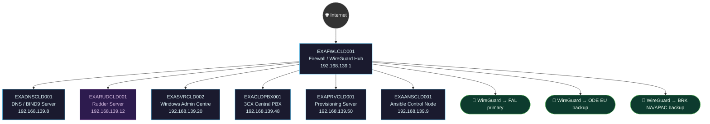

---

---

## 🏴󠁧󠁢󠁳󠁣󠁴󠁿 Scotland

---

## FAL — Falkirk *(Head Office)* ⭐

**Address:** Brockville Stadium, Hope Street, Falkirk  
**LAN:** `192.168.76.0/24` · **VPN:** `10.0.76.0/24` · **Domain:** `example.net`  
**PVE nodes:** 3 (hub) · **VPN parent:** CLD (primary head node)

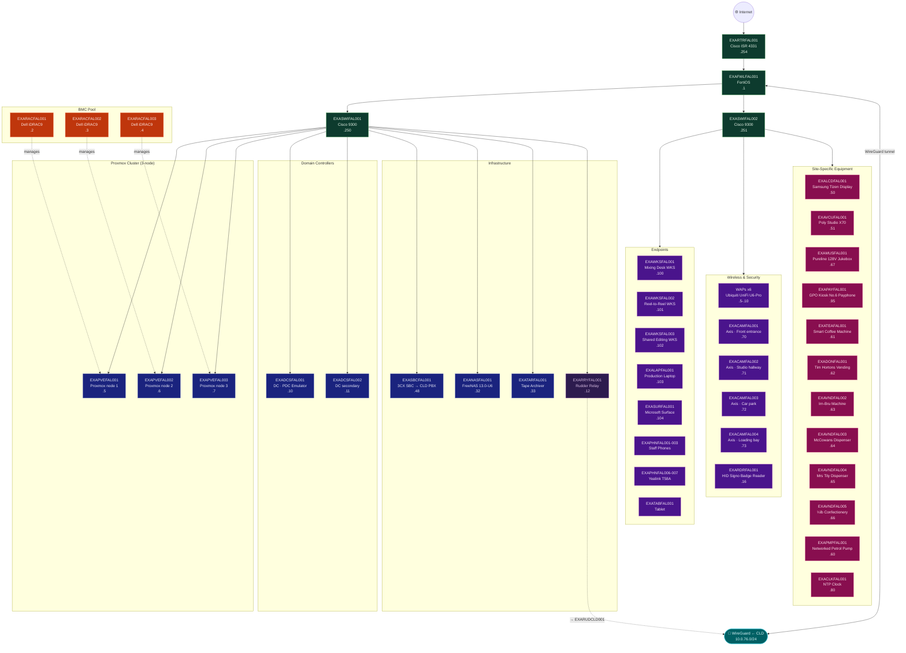

---

## EDI — Edinburgh ⚠️

**LAN:** `192.168.131.0/24` · **Domain:** `example.org` / `example.net`  
**PVE nodes:** 1 · **VPN parent:** FAL  
> ⚠️ `EXADCSEDI003` — DFSR stopped, C: drive at 5% free. Immediate action required.

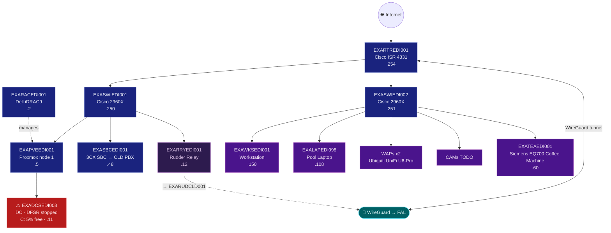

---

## GLA — Glasgow

**LAN:** `192.168.141.0/24` · **Domain:** `example.net`  
**PVE nodes:** 1 · **VPN parent:** FAL

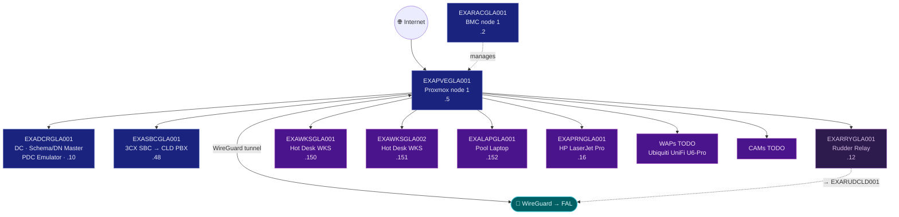

---

## CLY — Clydebank

**LAN:** `192.168.41.0/24` · **Domain:** `example.net`  
**PVE nodes:** 1 · **VPN parent:** FAL

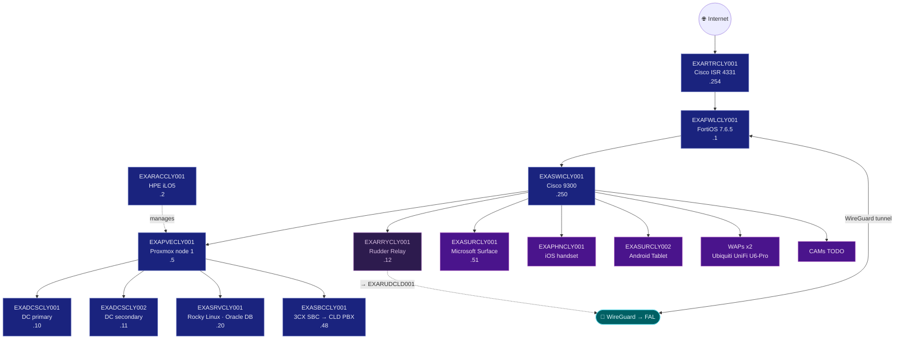

---

## DUN — Dundee

**LAN:** `192.168.138.0/24` · **Domain:** `example.net`  
**PVE nodes:** 1 · **VPN parent:** FAL

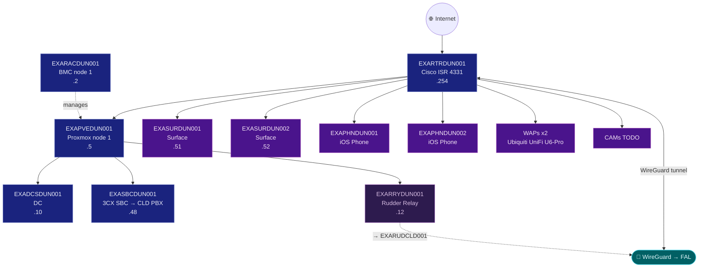

---

## PER — Perth

**LAN:** `192.168.173.0/24` · **Domain:** `example.net`  
**PVE nodes:** 1 · **VPN parent:** FAL

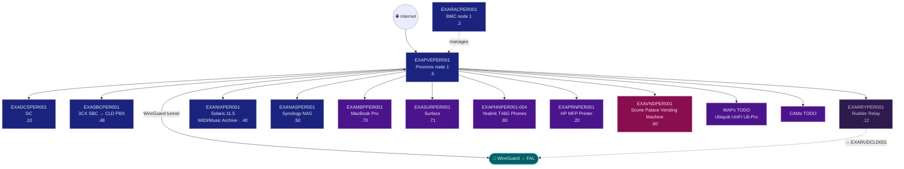

---

## ABD — Aberdeen

**LAN:** `192.168.224.0/24` · **Domain:** `example.org`  
**PVE nodes:** 1 · **VPN parent:** FAL

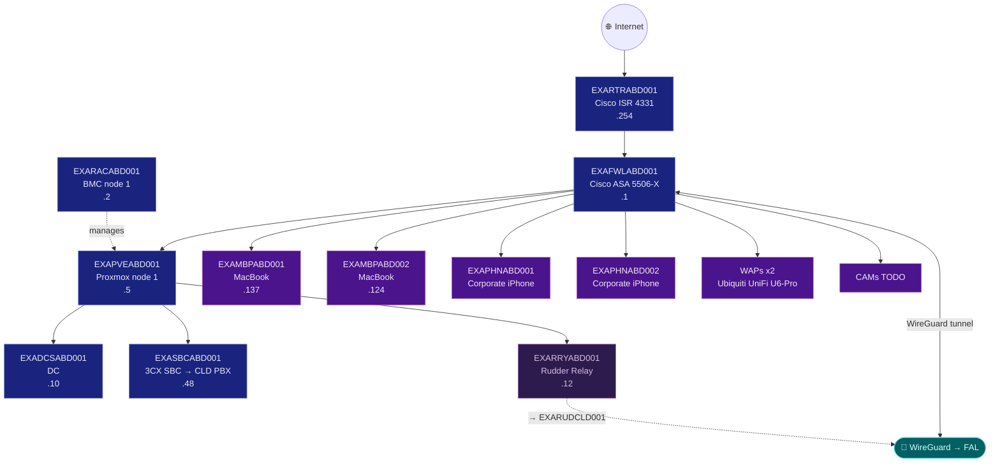

---

---

## 🏴󠁧󠁢󠁥󠁮󠁧󠁿 England

---

## LND — London

**LAN:** `192.168.20.0/24` · **Domain:** `example.net`  
**PVE nodes:** 1 · **VPN parent:** FAL

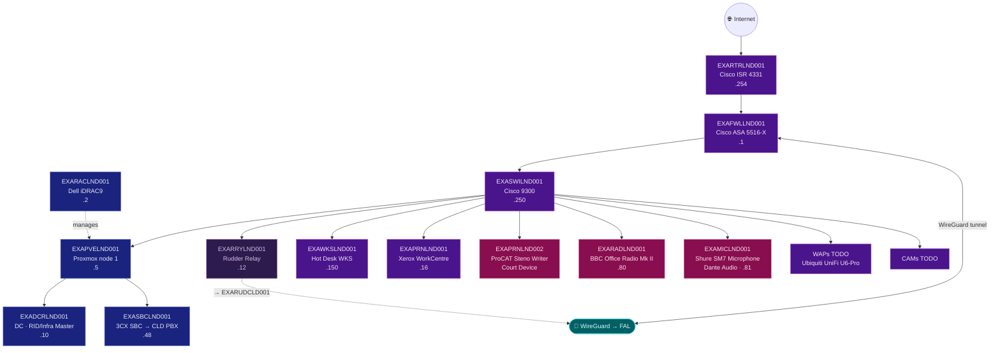

---

## BIR — Birmingham

**LAN:** `192.168.121.0/24` · **Domain:** `example.net`  
**PVE nodes:** 1 · **VPN parent:** FAL

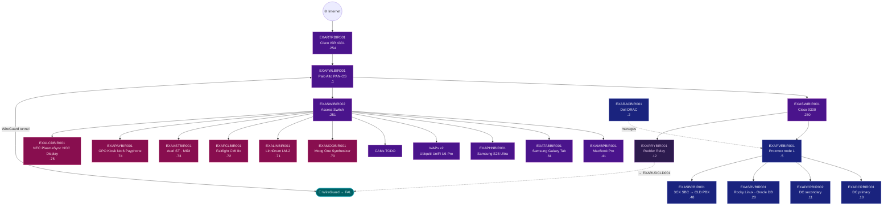

---

## MCR — Manchester

**LAN:** `192.168.161.0/24` · **Domain:** `example.org`  
**PVE nodes:** 1 · **VPN parent:** FAL

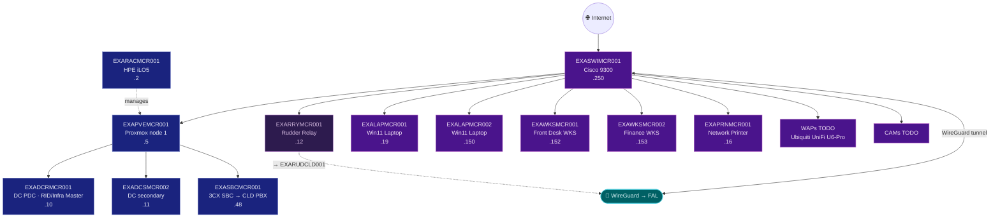

---

## LIV — Liverpool

**LAN:** `192.168.151.0/24` · **Domain:** `example.org`  
**PVE nodes:** 1 · **VPN parent:** FAL

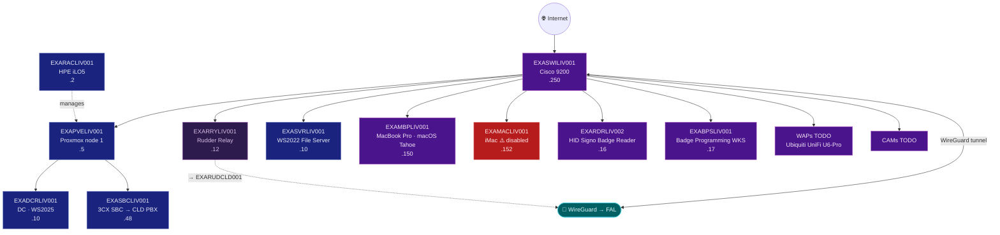

---

## NEW — Newcastle

**LAN:** `192.168.191.0/24` · **Domain:** `example.org`  
**PVE nodes:** 1 · **VPN parent:** FAL

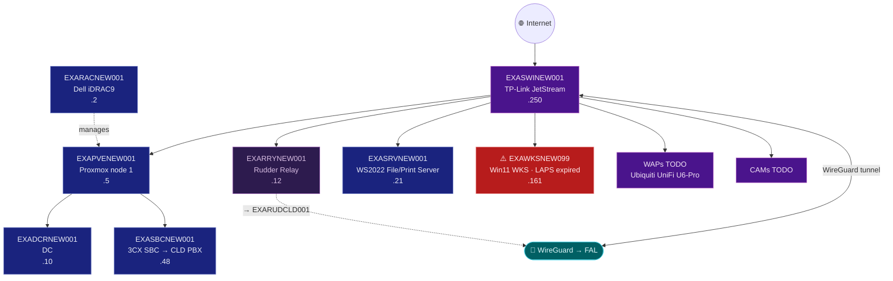

---

## SHE — Sheffield

**LAN:** `192.168.114.0/24` · **Domain:** `example.net`  
**PVE nodes:** 1 · **VPN parent:** FAL

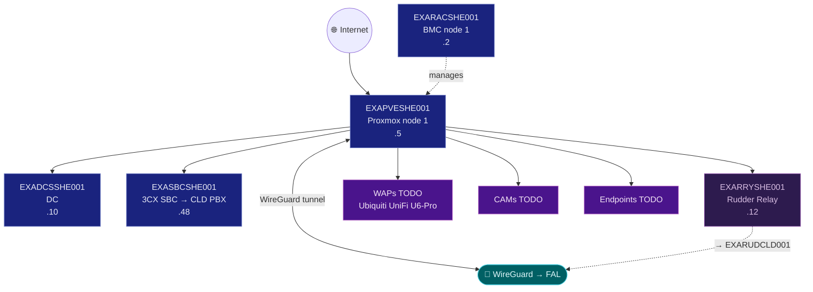

---

## HAL — Halifax

**LAN:** `192.168.142.0/24` · **Domain:** `example.net`  
**PVE nodes:** 1 · **VPN parent:** FAL


---

## HUL — Hull

**LAN:** `192.168.148.0/24` · **Domain:** `example.net`  
**PVE nodes:** 1 · **VPN parent:** FAL


---

## COV — Coventry

**LAN:** `192.168.247.0/24` · **Domain:** `example.net`  
**PVE nodes:** 1 · **VPN parent:** FAL  
*Note: WAP/RTR-only site — minimal infrastructure.*

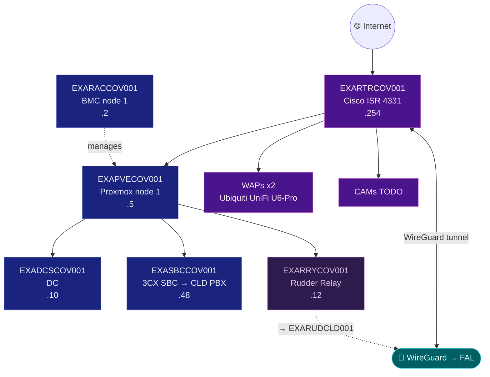

---

---

## 🇩🇰 Danmark

---

## CPH — København

**LAN:** `192.168.231.0/24` · **Domain:** `example.com` / `example.net`  
**PVE nodes:** 1 · **VPN parent:** ODE

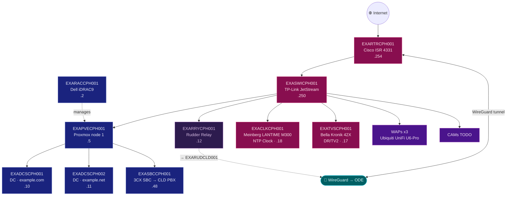

---

## ODE — Odense *(EU Hub)* ⭐

**LAN:** `192.168.126.0/24` · **Domain:** `example.net`  
**PVE nodes:** 3 (EU hub) · **VPN parent:** CLD (EU backup)

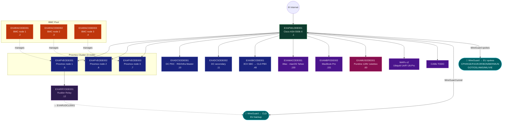

---

## KGE — Køge ⚠️

**LAN:** `192.168.65.0/24` · **Domain:** `example.net`  
**PVE nodes:** 1 · **VPN parent:** ODE  
> ⚠️ DC out of sync 27 days · WS2016 EOL · disk space low — rebuild required

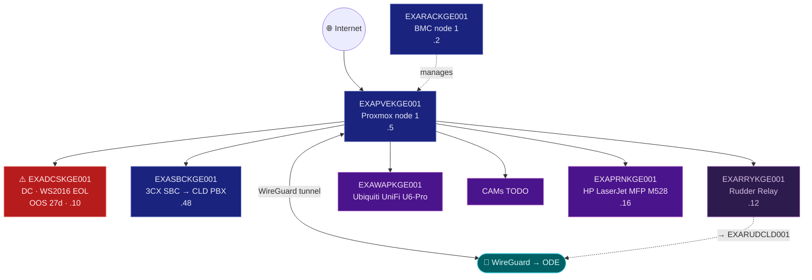

---

## FAX — Faxe

**LAN:** `192.168.246.0/24` · **Domain:** `example.net`  
**PVE nodes:** 1 · **VPN parent:** ODE

```mermaid
graph TD
    INET(("🌐 Internet"))
    RTR["EXARTRFAX001\nCisco ISR 4331\n.254"]
    RAC["EXARACFAX001\nBMC node 1\n.2"]
    PVE["EXAPVEFAX001\nProxmox node 1\n.5"]
    DC["EXADCSFAX001\nDC\n.10"]
    SBC["EXASBCFAX001\n3CX SBC → CLD PBX\n.48"]
    RRY["EXARRYFAX001\nRudder Relay\n.12"]
    WAP["WAPs x2\nUbiquiti UniFi U6-Pro"]
    CAM["CAMs TODO"]
    VPN(["🔗 WireGuard → ODE"])

    INET --> RTR --> PVE --> DC & SBC
    RAC -.->|"manages"| PVE
    RTR --> WAP & CAM
    RTR <-->|"WireGuard tunnel"| VPN

    PVE --> RRY
    RRY -. "→ EXARUDCLD001" .-> VPN
    classDef net fill:#880e4f,stroke:#f48fb1,color:#fce4ec
    classDef srv fill:#1a237e,stroke:#7986cb,color:#e8eaf6
    classDef ep fill:#4a148c,stroke:#ba68c8,color:#f3e5f5
    classDef vpn fill:#006064,stroke:#4dd0e1,color:#e0f7fa
    classDef rudder fill:#2d1b4e,stroke:#a569bd,color:#d7bde2
    class RTR net
    class PVE,DC,SBC,RAC srv
    class RRY rudder
    class WAP,CAM ep
    class VPN vpn
```

---

## KOR — Korsør

**LAN:** `192.168.238.0/24` · **Domain:** `example.net`  
**PVE nodes:** 1 · **VPN parent:** ODE

```mermaid
graph TD
    INET(("🌐 Internet"))
    RAC["EXARACKOR001\nBMC node 1\n.2"]
    PVE["EXAPVEKOR001\nProxmox node 1\n.5"]
    DC["EXADCSKOR001\nDC\n.10"]
    SBC["EXASBCKOR001\n3CX SBC → CLD PBX\n.48"]
    RRY["EXARRYKOR001\nRudder Relay\n.12"]
    WAP["WAPs TODO\nUbiquiti UniFi U6-Pro"]
    CAM["CAMs TODO"]
    VPN(["🔗 WireGuard → ODE"])

    INET --> PVE --> DC & SBC
    RAC -.->|"manages"| PVE
    PVE --> WAP & CAM
    PVE <-->|"WireGuard tunnel"| VPN

    PVE --> RRY
    RRY -. "→ EXARUDCLD001" .-> VPN
    classDef srv fill:#1a237e,stroke:#7986cb,color:#e8eaf6
    classDef ep fill:#4a148c,stroke:#ba68c8,color:#f3e5f5
    classDef vpn fill:#006064,stroke:#4dd0e1,color:#e0f7fa
    classDef rudder fill:#2d1b4e,stroke:#a569bd,color:#d7bde2
    class PVE,DC,SBC,RAC srv
    class RRY rudder
    class WAP,CAM ep
    class VPN vpn
```

---

---

## 🇩🇪 Deutschland

---

## BON — Bonn

**LAN:** `192.168.228.0/24` · **Domain:** `example.net`  
**PVE nodes:** 1 · **VPN parent:** ODE  
**Note:** Hosts Schema Master + Domain Naming Master

```mermaid
graph TD
    INET(("🌐 Internet"))
    SW["EXASWIBON001\nCisco 2960X\n.250"]
    RTR["EXARTRBON001\nCisco ISR 4331\n.254"]
    RAC["EXARACBON001\nDell iDRAC9\n.2"]
    PVE["EXAPVEBON001\nProxmox node 1\n.5"]
    DC["EXADCSBON001\nDC · Schema Master\nDN Master · .10"]
    SBC["EXASBCBON001\n3CX SBC → CLD PBX\n.48"]
    RRY["EXARRYBON001\nRudder Relay\n.12"]
    WKS["EXAWKSBON001\nFinance WKS · .151"]
    LAP1["EXALAPBON001\nThinkPad ⚠️ disabled\n.150"]
    LAP2["EXALAPBON002\nFinance Laptop · .153"]
    VCU["EXAVCUBON001\nPoly Studio X70\nBoardroom · .2"]
    CAM["EXACAMBON001\nAxis P3245-LVE CCTV\n.17"]
    TV["EXATVSBON001\nSamsung 65\"\n.18"]
    WAP["WAPs x2\nUbiquiti UniFi U6-Pro"]
    VPN(["🔗 WireGuard → ODE"])

    INET --> RTR --> SW
    SW --> PVE --> DC & SBC
    RAC -.->|"manages"| PVE
    SW --> WKS & LAP1 & LAP2 & VCU & CAM & TV & WAP
    RTR <-->|"WireGuard tunnel"| VPN

    SW --> RRY
    RRY -. "→ EXARUDCLD001" .-> VPN
    classDef net fill:#bf360c,stroke:#ff8a65,color:#fbe9e7
    classDef srv fill:#1a237e,stroke:#7986cb,color:#e8eaf6
    classDef ep fill:#4a148c,stroke:#ba68c8,color:#f3e5f5
    classDef site fill:#880e4f,stroke:#f48fb1,color:#fce4ec
    classDef warn fill:#b71c1c,stroke:#ef9a9a,color:#ffebee
    classDef vpn fill:#006064,stroke:#4dd0e1,color:#e0f7fa
    classDef rudder fill:#2d1b4e,stroke:#a569bd,color:#d7bde2
    class SW,RTR net
    class PVE,DC,SBC,RAC srv
    class RRY rudder
    class WKS,LAP2,WAP ep
    class VCU,CAM,TV site
    class LAP1 warn
    class VPN vpn
```

---

## BER — West Berlin

**LAN:** `192.168.113.0/24` · **Domain:** `example.net`  
**PVE nodes:** 1 · **VPN parent:** ODE

```mermaid
graph TD
    INET(("🌐 Internet"))
    RTR["EXARTRBER001\nCisco ISR 4331\n.254"]
    RAC["EXARACBER001\nBMC node 1\n.2"]
    PVE["EXAPVEBER001\nProxmox node 1\n.5"]
    DC["EXADCSBER001\nDC · PDC Emulator\nRID/Infra Master WS2019 · .10"]
    SBC["EXASBCBER001\n3CX SBC → CLD PBX\n.48"]
    RRY["EXARRYBER001\nRudder Relay\n.12"]
    SRV["EXASRVBER001\nWS2019 Legacy App Server\n.21"]
    NIX["EXANIXBER001\nDebian 12 Server\n.22"]
    WAP["WAPs x2\nUbiquiti UniFi U6-Pro"]
    CAM["CAMs TODO"]
    VPN(["🔗 WireGuard → ODE"])

    INET --> RTR --> PVE --> DC & SBC & SRV & NIX
    RAC -.->|"manages"| PVE
    RTR --> WAP & CAM
    RTR <-->|"WireGuard tunnel"| VPN

    PVE --> RRY
    RRY -. "→ EXARUDCLD001" .-> VPN
    classDef net fill:#bf360c,stroke:#ff8a65,color:#fbe9e7
    classDef srv fill:#1a237e,stroke:#7986cb,color:#e8eaf6
    classDef ep fill:#4a148c,stroke:#ba68c8,color:#f3e5f5
    classDef vpn fill:#006064,stroke:#4dd0e1,color:#e0f7fa
    classDef rudder fill:#2d1b4e,stroke:#a569bd,color:#d7bde2
    class RTR net
    class PVE,DC,SBC,SRV,NIX,RAC srv
    class RRY rudder
    class WAP,CAM ep
    class VPN vpn
```

---

## MUN — Munich

**LAN:** `192.168.189.0/24` · **Domain:** `example.net`  
**PVE nodes:** 1 · **VPN parent:** ODE

```mermaid
graph TD
    INET(("🌐 Internet"))
    SW["EXASWIMUN001\nCisco 9200\n.250"]
    RAC["EXARACMUN001\nHPE iLO5\n.2"]
    PVE["EXAPVEMUN001\nProxmox node 1\n.5"]
    DC["EXADCSMUN001\nDC\n.10"]
    SBC["EXASBCMUN001\n3CX SBC → CLD PBX\n.48"]
    RRY["EXARRYMUN001\nRudder Relay\n.12"]
    WKS["EXAWKSMUN001\nHot Desk WKS\n.150"]
    LAP1["EXALAPMUN001\nPool Laptop\n.151"]
    LAP2["⚠️ EXALAPMUN002\nPool Laptop\nLAPS expired 61d · .152"]
    WAP["WAPs TODO\nUbiquiti UniFi U6-Pro"]
    CAM["CAMs TODO"]
    VPN(["🔗 WireGuard → ODE"])

    INET --> SW
    SW --> PVE --> DC & SBC
    RAC -.->|"manages"| PVE
    SW --> WKS & LAP1 & LAP2 & WAP & CAM
    SW <-->|"WireGuard tunnel"| VPN

    SW --> RRY
    RRY -. "→ EXARUDCLD001" .-> VPN
    classDef net fill:#bf360c,stroke:#ff8a65,color:#fbe9e7
    classDef srv fill:#1a237e,stroke:#7986cb,color:#e8eaf6
    classDef ep fill:#4a148c,stroke:#ba68c8,color:#f3e5f5
    classDef warn fill:#b71c1c,stroke:#ef9a9a,color:#ffebee
    classDef vpn fill:#006064,stroke:#4dd0e1,color:#e0f7fa
    classDef rudder fill:#2d1b4e,stroke:#a569bd,color:#d7bde2
    class SW net
    class PVE,DC,SBC,RAC srv
    class RRY rudder
    class WKS,LAP1,WAP,CAM ep
    class LAP2 warn
    class VPN vpn
```

---

---

## 🇸🇪 Sverige

---

## GOT — Gothenburg

**LAN:** `192.168.46.0/24` · **Domain:** `example.net`  
**PVE nodes:** 1 · **VPN parent:** ODE

```mermaid
graph TD
    INET(("🌐 Internet"))
    RAC["EXARACGOT001\nBMC node 1\n.2"]
    PVE["EXAPVEGOT001\nProxmox node 1\n.5"]
    DC["EXADCSGOT001\nDC\n.10"]
    SBC["EXASBCGOT001\n3CX SBC → CLD PBX\n.48"]
    RRY["EXARRYGOT001\nRudder Relay\n.12"]
    WAP["WAPs TODO\nUbiquiti UniFi U6-Pro"]
    CAM["CAMs TODO"]
    VPN(["🔗 WireGuard → ODE"])

    INET --> PVE --> DC & SBC
    RAC -.->|"manages"| PVE
    PVE --> WAP & CAM
    PVE <-->|"WireGuard tunnel"| VPN

    PVE --> RRY
    RRY -. "→ EXARUDCLD001" .-> VPN
    classDef srv fill:#1a237e,stroke:#7986cb,color:#e8eaf6
    classDef ep fill:#4a148c,stroke:#ba68c8,color:#f3e5f5
    classDef vpn fill:#006064,stroke:#4dd0e1,color:#e0f7fa
    classDef rudder fill:#2d1b4e,stroke:#a569bd,color:#d7bde2
    class PVE,DC,SBC,RAC srv
    class RRY rudder
    class WAP,CAM ep
    class VPN vpn
```

---

---

## 🇳🇴 Norge

---

## OSL — Oslo

**LAN:** `192.168.47.0/24` · **Domain:** `example.net`  
**PVE nodes:** 1 · **VPN parent:** ODE

```mermaid
graph TD
    INET(("🌐 Internet"))
    RAC["EXARACOSL001\nBMC node 1\n.2"]
    PVE["EXAPVEOSL001\nProxmox node 1\n.5"]
    DC["EXADCSOSL001\nDC\n.10"]
    SBC["EXASBCOSL001\n3CX SBC → CLD PBX\n.48"]
    RRY["EXARRYOSL001\nRudder Relay\n.12"]
    WAP["WAPs TODO\nUbiquiti UniFi U6-Pro"]
    CAM["CAMs TODO"]
    VPN(["🔗 WireGuard → ODE"])

    INET --> PVE --> DC & SBC
    RAC -.->|"manages"| PVE
    PVE --> WAP & CAM
    PVE <-->|"WireGuard tunnel"| VPN

    PVE --> RRY
    RRY -. "→ EXARUDCLD001" .-> VPN
    classDef srv fill:#1a237e,stroke:#7986cb,color:#e8eaf6
    classDef ep fill:#4a148c,stroke:#ba68c8,color:#f3e5f5
    classDef vpn fill:#006064,stroke:#4dd0e1,color:#e0f7fa
    classDef rudder fill:#2d1b4e,stroke:#a569bd,color:#d7bde2
    class PVE,DC,SBC,RAC srv
    class RRY rudder
    class WAP,CAM ep
    class VPN vpn
```

---

---

## 🇳🇱 Nederland

---

## AMS — Amsterdam

**LAN:** `192.168.31.0/24` · **Domain:** `example.net`  
**PVE nodes:** 1 · **VPN parent:** ODE

```mermaid
graph TD
    INET(("🌐 Internet"))
    RAC["EXARACAMS001\nBMC node 1\n.2"]
    PVE["EXAPVEAMS001\nProxmox node 1\n.5"]
    DC["EXADCSAMS001\nDC\n.10"]
    SBC["EXASBCAMS001\n3CX SBC → CLD PBX\n.48"]
    RRY["EXARRYAMS001\nRudder Relay\n.12"]
    WAP["WAPs TODO\nUbiquiti UniFi U6-Pro"]
    CAM["CAMs TODO"]
    VPN(["🔗 WireGuard → ODE"])

    INET --> PVE --> DC & SBC
    RAC -.->|"manages"| PVE
    PVE --> WAP & CAM
    PVE <-->|"WireGuard tunnel"| VPN

    PVE --> RRY
    RRY -. "→ EXARUDCLD001" .-> VPN
    classDef srv fill:#1a237e,stroke:#7986cb,color:#e8eaf6
    classDef ep fill:#4a148c,stroke:#ba68c8,color:#f3e5f5
    classDef vpn fill:#006064,stroke:#4dd0e1,color:#e0f7fa
    classDef rudder fill:#2d1b4e,stroke:#a569bd,color:#d7bde2
    class PVE,DC,SBC,RAC srv
    class RRY rudder
    class WAP,CAM ep
    class VPN vpn
```

---

---

## 🇮🇹 Italia

---

## MIL — Milan

**LAN:** `192.168.39.0/24` · **Domain:** `example.net`  
**PVE nodes:** 1 · **VPN parent:** ODE

```mermaid
graph TD
    INET(("🌐 Internet"))
    RAC["EXARACMIL001\nBMC node 1\n.2"]
    PVE["EXAPVEMIL001\nProxmox node 1\n.5"]
    DC["EXADCSMIL001\nDC\n.10"]
    SBC["EXASBCMIL001\n3CX SBC → CLD PBX\n.48"]
    RRY["EXARRYMIL001\nRudder Relay\n.12"]
    WAP["WAPs TODO\nUbiquiti UniFi U6-Pro"]
    CAM["CAMs TODO"]
    VPN(["🔗 WireGuard → ODE"])

    INET --> PVE --> DC & SBC
    RAC -.->|"manages"| PVE
    PVE --> WAP & CAM
    PVE <-->|"WireGuard tunnel"| VPN

    PVE --> RRY
    RRY -. "→ EXARUDCLD001" .-> VPN
    classDef srv fill:#1a237e,stroke:#7986cb,color:#e8eaf6
    classDef ep fill:#4a148c,stroke:#ba68c8,color:#f3e5f5
    classDef vpn fill:#006064,stroke:#4dd0e1,color:#e0f7fa
    classDef rudder fill:#2d1b4e,stroke:#a569bd,color:#d7bde2
    class PVE,DC,SBC,RAC srv
    class RRY rudder
    class WAP,CAM ep
    class VPN vpn
```

---

---

## 🇦🇹 Österreich

---

## VIE — Vienna

**LAN:** `192.168.78.0/24` · **Domain:** `example.net`  
**PVE nodes:** 1 · **VPN parent:** ODE

```mermaid
graph TD
    INET(("🌐 Internet"))
    RAC["EXARACVIE001\nBMC node 1\n.2"]
    PVE["EXAPVEVIE001\nProxmox node 1\n.5"]
    DC["EXADCSVIE001\nDC\n.10"]
    SBC["EXASBCVIE001\n3CX SBC → CLD PBX\n.48"]
    RRY["EXARRYVIE001\nRudder Relay\n.12"]
    WAP["WAPs TODO\nUbiquiti UniFi U6-Pro"]
    CAM["CAMs TODO"]
    VPN(["🔗 WireGuard → ODE"])

    INET --> PVE --> DC & SBC
    RAC -.->|"manages"| PVE
    PVE --> WAP & CAM
    PVE <-->|"WireGuard tunnel"| VPN

    PVE --> RRY
    RRY -. "→ EXARUDCLD001" .-> VPN
    classDef srv fill:#1a237e,stroke:#7986cb,color:#e8eaf6
    classDef ep fill:#4a148c,stroke:#ba68c8,color:#f3e5f5
    classDef vpn fill:#006064,stroke:#4dd0e1,color:#e0f7fa
    classDef rudder fill:#2d1b4e,stroke:#a569bd,color:#d7bde2
    class PVE,DC,SBC,RAC srv
    class RRY rudder
    class WAP,CAM ep
    class VPN vpn
```

---

---

## 🇨🇦 Canada

---

## BRK — Brockville *(NA/APAC Hub)* ⭐

**LAN:** `192.168.136.0/24` · **Domain:** `example.net`  
**PVE nodes:** 3 (NA/APAC hub) · **VPN parent:** CLD (NA/APAC backup)  
> ⚠️ `EXADCSBRK001` — DNS, Netlogon and KDC services stopped.

```mermaid
graph TD
    INET(("🌐 Internet"))
    RTR["EXARTRBRK001\nCisco ISR 4331\n.254"]

    subgraph BMC ["BMC Pool"]
        RAC1["EXARACBRK001\nBMC node 1\n.2"]
        RAC2["EXARACBRK002\nBMC node 2\n.3"]
        RAC3["EXARACBRK003\nBMC node 3\n.4"]
    end

    subgraph PVE ["Proxmox Cluster (3-node)"]
        PVE1["EXAPVEBRK001\nProxmox node 1\n.5"]
        PVE2["EXAPVEBRK002\nProxmox node 2\n.6"]
        PVE3["EXAPVEBRK003\nProxmox node 3\n.7"]
    end

    DC["🔴 EXADCSBRK001\nDC · Services stopped\n.10"]
    SBC["EXASBCBRK001\n3CX SBC → CLD PBX\n.48"]
    RRY["EXARRYBRK001\nRudder Relay\n.12"]
    LAP["EXALAPBRK001\nWin11 Tour Laptop\n.21"]
    WAP["EXAWAPBRK001\nUbiquiti UniFi U6-Pro"]
    CAM["CAMs TODO"]
    VND1["EXADONBRK001\nTim Hortons Donut Vending\n.60"]
    VND2["EXAVNDBRK001\nMaple Syrup Vending\n.61"]
    VPN_CLD(["🔗 WireGuard ← CLD\nNA/APAC backup"])
    VPN_NA(["🔗 WireGuard → NA/APAC spokes\nTOR/MTL/LAX/NYC/NJC\nMIA/ATL/CHI/SYD/MEL/AKL"])

    INET --> RTR
    RTR --> PVE1 & PVE2 & PVE3
    RTR --> DC & SBC
    RAC1 -.->|"manages"| PVE1
    RAC2 -.->|"manages"| PVE2
    RAC3 -.->|"manages"| PVE3
    RTR --> LAP & WAP & CAM & VND1 & VND2
    RTR <-->|"WireGuard tunnel"| VPN_CLD
    RTR -->|"WireGuard spokes"| VPN_NA

    PVE1 --> RRY
    RRY -. "→ EXARUDCLD001" .-> VPN_CLD
    classDef net fill:#0d3b2e,stroke:#66bb6a,color:#e8f5e9
    classDef srv fill:#1a237e,stroke:#7986cb,color:#e8eaf6
    classDef warn fill:#b71c1c,stroke:#ef9a9a,color:#ffebee
    classDef ep fill:#4a148c,stroke:#ba68c8,color:#f3e5f5
    classDef site fill:#880e4f,stroke:#f48fb1,color:#fce4ec
    classDef bmc fill:#bf360c,stroke:#ff8a65,color:#fbe9e7
    classDef vpn fill:#006064,stroke:#4dd0e1,color:#e0f7fa
    classDef rudder fill:#2d1b4e,stroke:#a569bd,color:#d7bde2
    class RTR net
    class PVE1,PVE2,PVE3,SBC srv
    class RRY rudder
    class DC warn
    class LAP,WAP,CAM ep
    class VND1,VND2 site
    class RAC1,RAC2,RAC3 bmc
    class VPN_CLD,VPN_NA vpn
```

---

## TOR — Toronto ⚠️

**LAN:** `192.168.146.0/24` · **Domain:** `example.net`  
**PVE nodes:** 1 · **VPN parent:** BRK  
> ⚠️ `EXADCSTOR001` — DNS, Netlogon and KDC services stopped.

```mermaid
graph TD
    INET(("🌐 Internet"))
    RAC["EXARACTOR001\nBMC node 1\n.2"]
    PVE["EXAPVETOR001\nProxmox node 1\n.5"]
    DC["🔴 EXADCSTOR001\nDC · Services stopped\n.10"]
    SBC["EXASBCTOR001\n3CX SBC → CLD PBX\n.48"]
    RRY["EXARRYTOR001\nRudder Relay\n.12"]
    WAP["WAPs TODO\nUbiquiti UniFi U6-Pro"]
    CAM["CAMs TODO"]
    VPN(["🔗 WireGuard → BRK"])

    INET --> PVE --> DC & SBC
    RAC -.->|"manages"| PVE
    PVE --> WAP & CAM
    PVE <-->|"WireGuard tunnel"| VPN

    PVE --> RRY
    RRY -. "→ EXARUDCLD001" .-> VPN
    classDef srv fill:#1a237e,stroke:#7986cb,color:#e8eaf6
    classDef warn fill:#b71c1c,stroke:#ef9a9a,color:#ffebee
    classDef ep fill:#4a148c,stroke:#ba68c8,color:#f3e5f5
    classDef vpn fill:#006064,stroke:#4dd0e1,color:#e0f7fa
    classDef rudder fill:#2d1b4e,stroke:#a569bd,color:#d7bde2
    class PVE,SBC,RAC srv
    class RRY rudder
    class DC warn
    class WAP,CAM ep
    class VPN vpn
```

---

## MTL — Montreal

**LAN:** `192.168.154.0/24` · **Domain:** `example.net`  
**PVE nodes:** 1 · **VPN parent:** BRK

```mermaid
graph TD
    INET(("🌐 Internet"))
    RAC["EXARACMTL001\nBMC node 1\n.2"]
    PVE["EXAPVEMTL001\nProxmox node 1\n.5"]
    DC["EXADCSMTL001\nDC\n.10"]
    SBC["EXASBCMTL001\n3CX SBC → CLD PBX\n.48"]
    RRY["EXARRYMTL001\nRudder Relay\n.12"]
    WAP["WAPs TODO\nUbiquiti UniFi U6-Pro"]
    CAM["CAMs TODO"]
    VPN(["🔗 WireGuard → BRK"])

    INET --> PVE --> DC & SBC
    RAC -.->|"manages"| PVE
    PVE --> WAP & CAM
    PVE <-->|"WireGuard tunnel"| VPN

    PVE --> RRY
    RRY -. "→ EXARUDCLD001" .-> VPN
    classDef srv fill:#1a237e,stroke:#7986cb,color:#e8eaf6
    classDef ep fill:#4a148c,stroke:#ba68c8,color:#f3e5f5
    classDef vpn fill:#006064,stroke:#4dd0e1,color:#e0f7fa
    classDef rudder fill:#2d1b4e,stroke:#a569bd,color:#d7bde2
    class PVE,DC,SBC,RAC srv
    class RRY rudder
    class WAP,CAM ep
    class VPN vpn
```

---

---

## 🇺🇸 United States

---

## LAX — Los Angeles ⚠️

**LAN:** `192.168.213.0/24` · **Domain:** `example.net`  
**PVE nodes:** 1 · **VPN parent:** BRK  
> ⚠️ `EXADCSLAX001` — DNS, Netlogon and KDC services stopped.

```mermaid
graph TD
    INET(("🌐 Internet"))
    FWL["EXAFWLLAX001\nPalo Alto PAN-OS 10.x\n.1"]
    SW1["EXASWILAX001\nCisco 9300\n.250"]
    SW2["EXASWILAX002\nCisco 2960\n.251"]
    RTR["EXARTRLAX001\nCisco ISR 4331\n.254"]
    RAC["EXARACLAX001\nDell iDRAC9\n.2"]
    PVE["EXAPVELAX001\nProxmox node 1\n.5"]
    DC["🔴 EXADCSLAX001\nDC · Services stopped\n.10"]
    SRV["EXASRVLAX001\nRocky Linux · Local services/DB\n.20"]
    SBC["EXASBCLAX001\n3CX SBC → CLD PBX\n.48"]
    RRY["EXARRYLAX001\nRudder Relay\n.12"]
    MBP["EXAMBPLAX001\nMacBook Pro\n.41"]
    TAB["EXATABLAX001\niPad · Setlists\n.61"]
    PHN["EXAPHNLAX001\nAndroid Phone"]
    WAP["WAPs x3\nUbiquiti UniFi U6-Pro"]
    CAM["CAMs TODO"]
    MOO["EXAMUSLAX001\nMoog One Synthesizer\n.70"]
    LIN["EXAMUSLAX002\nLinnDrum LM-2\n.71"]
    FCL["EXAMUSLAX003\nFairlight CMI IIx\n.72"]
    AST["EXATTYLAX001\nAtari ST · MIDI\n.73"]
    PAY["EXAPAYLAX001\nLobby Payphone\n.74"]
    LCD["EXALCDLAX001\nNEC PlasmaSync Display\n.75"]
    VPN(["🔗 WireGuard → BRK"])

    INET --> RTR --> FWL --> SW1 & SW2
    SW1 --> PVE --> DC & SRV & SBC
    RAC -.->|"manages"| PVE
    SW2 --> MBP & TAB & PHN & WAP & CAM
    SW2 --> MOO & LIN & FCL & AST & PAY & LCD
    FWL <-->|"WireGuard tunnel"| VPN

    SW1 --> RRY
    RRY -. "→ EXARUDCLD001" .-> VPN
    classDef net fill:#1b5e20,stroke:#81c784,color:#f1f8e9
    classDef srv fill:#1a237e,stroke:#7986cb,color:#e8eaf6
    classDef warn fill:#b71c1c,stroke:#ef9a9a,color:#ffebee
    classDef ep fill:#4a148c,stroke:#ba68c8,color:#f3e5f5
    classDef site fill:#880e4f,stroke:#f48fb1,color:#fce4ec
    classDef vpn fill:#006064,stroke:#4dd0e1,color:#e0f7fa
    classDef rudder fill:#2d1b4e,stroke:#a569bd,color:#d7bde2
    class FWL,SW1,SW2,RTR net
    class PVE,SRV,SBC,RAC srv
    class RRY rudder
    class DC warn
    class MBP,TAB,PHN,WAP,CAM ep
    class MOO,LIN,FCL,AST,PAY,LCD site
    class VPN vpn
```

---

## NYC — New York ⚠️

**LAN:** `192.168.212.0/24` · **Domain:** `example.net`  
**PVE nodes:** 1 · **VPN parent:** BRK  
> ⚠️ `EXADCSNYC001` — DNS, Netlogon and KDC services stopped.

```mermaid
graph TD
    INET(("🌐 Internet"))
    RAC["EXARACNYC001\nBMC node 1\n.2"]
    PVE["EXAPVENYC001\nProxmox node 1\n.5"]
    DC["🔴 EXADCSNYC001\nDC · Services stopped\n.10"]
    SBC["EXASBCNYC001\n3CX SBC → CLD PBX\n.48"]
    RRY["EXARRYNYC001\nRudder Relay\n.12"]
    WAP["WAPs TODO\nUbiquiti UniFi U6-Pro"]
    CAM["CAMs TODO"]
    VPN(["🔗 WireGuard → BRK"])

    INET --> PVE --> DC & SBC
    RAC -.->|"manages"| PVE
    PVE --> WAP & CAM
    PVE <-->|"WireGuard tunnel"| VPN

    PVE --> RRY
    RRY -. "→ EXARUDCLD001" .-> VPN
    classDef srv fill:#1a237e,stroke:#7986cb,color:#e8eaf6
    classDef warn fill:#b71c1c,stroke:#ef9a9a,color:#ffebee
    classDef ep fill:#4a148c,stroke:#ba68c8,color:#f3e5f5
    classDef vpn fill:#006064,stroke:#4dd0e1,color:#e0f7fa
    classDef rudder fill:#2d1b4e,stroke:#a569bd,color:#d7bde2
    class PVE,SBC,RAC srv
    class RRY rudder
    class DC warn
    class WAP,CAM ep
    class VPN vpn
```

---

## NJC — New Jersey ⚠️

**LAN:** `192.168.201.0/24` · **Domain:** `example.net`  
**PVE nodes:** 1 · **VPN parent:** BRK  
> ⚠️ `EXADCSNJC001` — DNS, Netlogon and KDC services stopped.

```mermaid
graph TD
    INET(("🌐 Internet"))
    RAC["EXARACNJC001\nBMC node 1\n.2"]
    PVE["EXAPVENJC001\nProxmox node 1\n.5"]
    DC["🔴 EXADCSNJC001\nDC · Services stopped\n.10"]
    SBC["EXASBCNJC001\n3CX SBC → CLD PBX\n.48"]
    RRY["EXARRYNJC001\nRudder Relay\n.12"]
    WAP["WAPs TODO\nUbiquiti UniFi U6-Pro"]
    CAM["CAMs TODO"]
    VPN(["🔗 WireGuard → BRK"])

    INET --> PVE --> DC & SBC
    RAC -.->|"manages"| PVE
    PVE --> WAP & CAM
    PVE <-->|"WireGuard tunnel"| VPN

    PVE --> RRY
    RRY -. "→ EXARUDCLD001" .-> VPN
    classDef srv fill:#1a237e,stroke:#7986cb,color:#e8eaf6
    classDef warn fill:#b71c1c,stroke:#ef9a9a,color:#ffebee
    classDef ep fill:#4a148c,stroke:#ba68c8,color:#f3e5f5
    classDef vpn fill:#006064,stroke:#4dd0e1,color:#e0f7fa
    classDef rudder fill:#2d1b4e,stroke:#a569bd,color:#d7bde2
    class PVE,SBC,RAC srv
    class RRY rudder
    class DC warn
    class WAP,CAM ep
    class VPN vpn
```

---

## MIA — Miami

**LAN:** `192.168.135.0/24` · **Domain:** `example.net`  
**PVE nodes:** 1 · **VPN parent:** BRK

```mermaid
graph TD
    INET(("🌐 Internet"))
    RAC["EXARACMIA001\nBMC node 1\n.2"]
    PVE["EXAPVEMIA001\nProxmox node 1\n.5"]
    DC["EXADCSMIA001\nDC\n.10"]
    SBC["EXASBCMIA001\n3CX SBC → CLD PBX\n.48"]
    RRY["EXARRYMIA001\nRudder Relay\n.12"]
    LAP["EXALAPMIA001\nmacOS Sonoma Laptop\n.21"]
    COF["EXACOFMIA001\nCuban Covfefe Machine\nVxWorks · .60"]
    WAP["WAPs TODO\nUbiquiti UniFi U6-Pro"]
    CAM["CAMs TODO"]
    VPN(["🔗 WireGuard → BRK"])

    INET --> PVE --> DC & SBC
    RAC -.->|"manages"| PVE
    PVE --> LAP & COF & WAP & CAM
    PVE <-->|"WireGuard tunnel"| VPN

    PVE --> RRY
    RRY -. "→ EXARUDCLD001" .-> VPN
    classDef srv fill:#1a237e,stroke:#7986cb,color:#e8eaf6
    classDef ep fill:#4a148c,stroke:#ba68c8,color:#f3e5f5
    classDef site fill:#880e4f,stroke:#f48fb1,color:#fce4ec
    classDef vpn fill:#006064,stroke:#4dd0e1,color:#e0f7fa
    classDef rudder fill:#2d1b4e,stroke:#a569bd,color:#d7bde2
    class PVE,DC,SBC,RAC srv
    class RRY rudder
    class LAP,WAP,CAM ep
    class COF site
    class VPN vpn
```

---

## ATL — Athens, GA ⚠️

**LAN:** `192.168.33.0/24` · **Domain:** `example.net`  
**PVE nodes:** 1 · **VPN parent:** BRK  
> ⚠️ `EXADCSATL001` — DNS, Netlogon and KDC services stopped.

```mermaid
graph TD
    INET(("🌐 Internet"))
    RAC["EXARACATL001\nBMC node 1\n.2"]
    PVE["EXAPVEATL001\nProxmox node 1\n.5"]
    DC["🔴 EXADCSATL001\nDC · Services stopped\n.10"]
    SBC["EXASBCATL001\n3CX SBC → CLD PBX\n.48"]
    RRY["EXARRYATL001\nRudder Relay\n.12"]
    WAP["WAPs TODO\nUbiquiti UniFi U6-Pro"]
    CAM["CAMs TODO"]
    VPN(["🔗 WireGuard → BRK"])

    INET --> PVE --> DC & SBC
    RAC -.->|"manages"| PVE
    PVE --> WAP & CAM
    PVE <-->|"WireGuard tunnel"| VPN

    PVE --> RRY
    RRY -. "→ EXARUDCLD001" .-> VPN
    classDef srv fill:#1a237e,stroke:#7986cb,color:#e8eaf6
    classDef warn fill:#b71c1c,stroke:#ef9a9a,color:#ffebee
    classDef ep fill:#4a148c,stroke:#ba68c8,color:#f3e5f5
    classDef vpn fill:#006064,stroke:#4dd0e1,color:#e0f7fa
    classDef rudder fill:#2d1b4e,stroke:#a569bd,color:#d7bde2
    class PVE,SBC,RAC srv
    class RRY rudder
    class DC warn
    class WAP,CAM ep
    class VPN vpn
```

---

## CHI — Chicago ⚠️

**LAN:** `192.168.214.0/24` · **Domain:** `example.net`  
**PVE nodes:** 1 · **VPN parent:** BRK  
> ⚠️ `EXADCSCHI001` — DNS, Netlogon and KDC services stopped.

```mermaid
graph TD
    INET(("🌐 Internet"))
    RAC["EXARACCHI001\nBMC node 1\n.2"]
    PVE["EXAPVECHI001\nProxmox node 1\n.5"]
    DC["🔴 EXADCSCHI001\nDC · Services stopped\n.10"]
    SBC["EXASBCCHI001\n3CX SBC → CLD PBX\n.48"]
    RRY["EXARRYCHI001\nRudder Relay\n.12"]
    WAP["WAPs TODO\nUbiquiti UniFi U6-Pro"]
    CAM["CAMs TODO"]
    VPN(["🔗 WireGuard → BRK"])

    INET --> PVE --> DC & SBC
    RAC -.->|"manages"| PVE
    PVE --> WAP & CAM
    PVE <-->|"WireGuard tunnel"| VPN

    PVE --> RRY
    RRY -. "→ EXARUDCLD001" .-> VPN
    classDef srv fill:#1a237e,stroke:#7986cb,color:#e8eaf6
    classDef warn fill:#b71c1c,stroke:#ef9a9a,color:#ffebee
    classDef ep fill:#4a148c,stroke:#ba68c8,color:#f3e5f5
    classDef vpn fill:#006064,stroke:#4dd0e1,color:#e0f7fa
    classDef rudder fill:#2d1b4e,stroke:#a569bd,color:#d7bde2
    class PVE,SBC,RAC srv
    class RRY rudder
    class DC warn
    class WAP,CAM ep
    class VPN vpn
```

---

---

## 🇦🇺 Australia

---

## SYD — Sydney ⚠️

**LAN:** `192.168.29.0/24` · **Domain:** `example.net`  
**PVE nodes:** 1 · **VPN parent:** BRK  
> ⚠️ `EXADCSSYD001` — DNS, Netlogon and KDC services stopped.

```mermaid
graph TD
    INET(("🌐 Internet"))
    FWL["EXAFWLSYD001\nFortiGate 7.x\n.1"]
    SW1["EXASWISYD001\nCisco 9300\n.250"]
    SW2["EXASWISYD002\nCisco 2960\n.251"]
    RAC["EXARACSYD001\nDell iDRAC9\n.2"]
    PVE["EXAPVESYD001\nProxmox node 1\n.5"]
    DC["🔴 EXADCSSYD001\nDC · Services stopped\n.10"]
    SRV["EXASRVSYD001\nWS2022 Local Infra\n.20"]
    SBC["EXASBCSYD001\n3CX SBC → CLD PBX\n.48"]
    RRY["EXARRYSYD001\nRudder Relay\n.12"]
    MBP["EXAMBPSYD001\nMacBook Pro\n.40"]
    WKS["EXAWKSSYD001\nWin11 Workstation\n.41"]
    PHN["EXAPHNSYD001\nAndroid Phone"]
    TAB["EXATABSYD001\niPad · Setlists\n.60"]
    WAP["EXAWAPSYD001\nUbiquiti UniFi"]
    CAM1["EXACAMSYD001\nHikvision · Coffee cam\n.82"]
    CAM2["EXACAMSYD002\nHikvision · Reception\n.83"]
    LCD["EXALCDSYD001\nLG Signage Wallboard\n.70"]
    PRN["EXAPRNSYD001\nBrother Laser Printer\n.80"]
    COF["EXACOFSYD001\nSmart Coffee Machine\nRFC2324 · .83"]
    VPN(["🔗 WireGuard → BRK"])

    INET --> FWL --> SW1 & SW2
    SW1 --> PVE --> DC & SRV & SBC
    RAC -.->|"manages"| PVE
    SW2 --> MBP & WKS & PHN & TAB & WAP
    SW2 --> CAM1 & CAM2 & LCD & PRN & COF
    FWL <-->|"WireGuard tunnel"| VPN

    SW1 --> RRY
    RRY -. "→ EXARUDCLD001" .-> VPN
    classDef net fill:#f57f17,stroke:#ffee58,color:#1a1a1a
    classDef srv fill:#1a237e,stroke:#7986cb,color:#e8eaf6
    classDef warn fill:#b71c1c,stroke:#ef9a9a,color:#ffebee
    classDef ep fill:#4a148c,stroke:#ba68c8,color:#f3e5f5
    classDef site fill:#880e4f,stroke:#f48fb1,color:#fce4ec
    classDef vpn fill:#006064,stroke:#4dd0e1,color:#e0f7fa
    classDef rudder fill:#2d1b4e,stroke:#a569bd,color:#d7bde2
    class FWL,SW1,SW2 net
    class PVE,SRV,SBC,RAC srv
    class RRY rudder
    class DC warn
    class MBP,WKS,PHN,TAB,WAP ep
    class CAM1,CAM2,LCD,PRN,COF site
    class VPN vpn
```

---

## MEL — Melbourne ⚠️

**LAN:** `192.168.61.0/24` · **Domain:** `example.net`  
**PVE nodes:** 1 · **VPN parent:** BRK  
> ⚠️ `EXADCSMEL001` — DNS, Netlogon and KDC services stopped.

```mermaid
graph TD
    INET(("🌐 Internet"))
    FWL["EXAFWLMEL001\nFortiGate 7.x\n.1"]
    SW1["EXASWIMEL001\nCisco 9300\n.250"]
    SW2["EXASWIMEL002\nCisco 2960\n.251"]
    RAC["EXARACMEL001\nHPE iLO5\n.2"]
    PVE["EXAPVEMEL001\nProxmox node 1\n.5"]
    DC["🔴 EXADCSMEL001\nDC · Services stopped\n.10"]
    SRV["EXASRVMEL001\nWS2022 File/Print\n.20"]
    SBC["EXASBCMEL001\n3CX SBC → CLD PBX\n.48"]
    RRY["EXARRYMEL001\nRudder Relay\n.12"]
    MBP["EXAMBPMEL001\nMacBook Pro\n.40"]
    WKS["EXAWKSMEL001\nWin11 Workstation\n.41"]
    PHN["EXAPHNMEL001\niOS Phone"]
    TAB["EXATABMEL001\niPad\n.60"]
    WAP["WAPs TODO\nUbiquiti UniFi U6-Pro"]
    CAM["CAMs TODO"]
    LCD["EXALCDMEL001\nSamsung Signage\n.70"]
    PRN["EXAPRNMEL001\nHP LaserJet\n.80"]
    NAS["EXANASMEL001\nSynology NAS DSM 7.x\n.81"]
    VPN(["🔗 WireGuard → BRK"])

    INET --> FWL --> SW1 & SW2
    SW1 --> PVE --> DC & SRV & SBC
    RAC -.->|"manages"| PVE
    SW2 --> MBP & WKS & PHN & TAB & WAP & CAM
    SW2 --> LCD & PRN & NAS
    FWL <-->|"WireGuard tunnel"| VPN

    SW1 --> RRY
    RRY -. "→ EXARUDCLD001" .-> VPN
    classDef net fill:#f57f17,stroke:#ffee58,color:#1a1a1a
    classDef srv fill:#1a237e,stroke:#7986cb,color:#e8eaf6
    classDef warn fill:#b71c1c,stroke:#ef9a9a,color:#ffebee
    classDef ep fill:#4a148c,stroke:#ba68c8,color:#f3e5f5
    classDef site fill:#880e4f,stroke:#f48fb1,color:#fce4ec
    classDef vpn fill:#006064,stroke:#4dd0e1,color:#e0f7fa
    classDef rudder fill:#2d1b4e,stroke:#a569bd,color:#d7bde2
    class FWL,SW1,SW2 net
    class PVE,SRV,SBC,RAC srv
    class RRY rudder
    class DC warn
    class MBP,WKS,PHN,TAB,WAP,CAM ep
    class LCD,PRN,NAS site
    class VPN vpn
```

---

---

## 🇳🇿 New Zealand

---

## AKL — Auckland ⚠️

**LAN:** `192.168.93.0/24` · **Domain:** `example.net`  
**PVE nodes:** 1 · **VPN parent:** BRK  
> ⚠️ `EXADCSAKL001` — DNS, Netlogon and KDC services stopped.

```mermaid
graph TD
    INET(("🌐 Internet"))
    FWL["EXAFWLAKL001\nFortiGate 7.x\n.1"]
    SW1["EXASWIAKL001\nCisco 9300\n.250"]
    SW2["EXASWIAKL002\nCisco 2960\n.251"]
    RTR["EXARTRAKL001\nCisco ISR 4331\n.254"]
    RAC["EXARACAKL001\nHPE iLO5\n.2"]
    PVE["EXAPVEAKL001\nProxmox node 1\n.5"]
    DC["🔴 EXADCSAKL001\nDC · Services stopped\n.10"]
    SRV["EXASRVAKL001\nWS2022 Local Server\n.20"]
    SBC["EXASBCAKL001\n3CX SBC → CLD PBX\n.48"]
    RRY["EXARRYAKL001\nRudder Relay\n.12"]
    WKS["EXAWKSAKL001\nWin11 Workstation\n.40"]
    MBP["EXAMBPAKL001\nMacBook Pro\n.41"]
    PHN["EXAPHNAKL001\nAndroid Phone"]
    TAB["EXATABAKL001\niPad\n.60"]
    WAP1["EXAWAPAKL001\nUbiquiti UniFi"]
    WAP2["EXAWAPAKL002\nUbiquiti UniFi"]
    CAM["EXACAMAKL001\nAxis Camera\n.82"]
    LCD["EXALCDAKL001\nSamsung Signage\n.70"]
    PRN["EXAPRNAKL001\nHP LaserJet\n.80"]
    COF["EXACOFAKL001\nSmart Coffee Machine\n.83"]
    VPN(["🔗 WireGuard → BRK"])

    INET --> RTR --> FWL --> SW1 & SW2
    SW1 --> PVE --> DC & SRV & SBC
    RAC -.->|"manages"| PVE
    SW2 --> WKS & MBP & PHN & TAB & WAP1 & WAP2
    SW2 --> CAM & LCD & PRN & COF
    FWL <-->|"WireGuard tunnel"| VPN

    SW1 --> RRY
    RRY -. "→ EXARUDCLD001" .-> VPN
    classDef net fill:#f57f17,stroke:#ffee58,color:#1a1a1a
    classDef srv fill:#1a237e,stroke:#7986cb,color:#e8eaf6
    classDef warn fill:#b71c1c,stroke:#ef9a9a,color:#ffebee
    classDef ep fill:#4a148c,stroke:#ba68c8,color:#f3e5f5
    classDef site fill:#880e4f,stroke:#f48fb1,color:#fce4ec
    classDef vpn fill:#006064,stroke:#4dd0e1,color:#e0f7fa
    classDef rudder fill:#2d1b4e,stroke:#a569bd,color:#d7bde2
    class FWL,SW1,SW2,RTR net
    class PVE,SRV,SBC,RAC srv
    class RRY rudder
    class DC warn
    class WKS,MBP,PHN,TAB,WAP1,WAP2 ep
    class CAM,LCD,PRN,COF site
    class VPN vpn
```

---

*Example Music Limited — Internal Infrastructure Documentation*   *Do not distribute outside the organisation*cloud

