# Example Music Limited — Per-Site Network Diagrams

> **Classification:** Internal — Infrastructure  
> **Generated:** 2026-03-06  
> **Note:** WAPs and cameras confirmed at all 42 sites — marked TODO where full inventory pending.  
> Legend: ⭐ = 3-node hub · ⚠️ = issue flagged · 🔴 = DC services stopped

---

## Table of Contents

### ☁️ Cloud (CLD)
- [CLD — Cloud / Provisioning](#cld--cloud--provisioning)

### 🏴󠁧󠁢󠁳󠁣󠁴󠁿 Scotland
- [FAL — Falkirk *(Head Office)*](#fal--falkirk-head-office-)
- [EDI — Edinburgh](#edi--edinburgh-)
- [GLA — Glasgow](#gla--glasgow)
- [CLY — Clydebank](#cly--clydebank)
- [DUN — Dundee](#dun--dundee)
- [PER — Perth](#per--perth)
- [ABD — Aberdeen](#abd--aberdeen)

### 🏴󠁧󠁢󠁥󠁮󠁧󠁿 England
- [LND — London](#lnd--london)
- [BIR — Birmingham](#bir--birmingham)
- [MCR — Manchester](#mcr--manchester)
- [LIV — Liverpool](#liv--liverpool)
- [NEW — Newcastle](#new--newcastle)
- [SHE — Sheffield](#she--sheffield)
- [HAL — Halifax](#hal--halifax)
- [HUL — Hull](#hul--hull)
- [COV — Coventry](#cov--coventry)

### 🇩🇰 Danmark
- [CPH — København](#cph--kbenhavn)
- [ODE — Odense *(EU Hub)*](#ode--odense-eu-hub-)
- [KGE — Køge](#kge--kge-)
- [FAX — Faxe](#fax--faxe)
- [KOR — Korsør](#kor--korsr)
- [AAR — Aarhus](#aar--aarhus)
- [FRE — Fredericia](#fre--fredericia)

### 🇩🇪 Deutschland
- [BON — Bonn](#bon--bonn)
- [BER — West Berlin](#ber--west-berlin)
- [MUN — Munich](#mun--munich)
- [DRS — Dresden](#drs--dresden)
- [DUS — Düsseldorf](#dus--dsseldorf)

### 🇸🇪 Sverige
- [GOT — Gothenburg](#got--gothenburg)

### 🇳🇴 Norge
- [OSL — Oslo](#osl--oslo)

### 🇳🇱 Nederland
- [AMS — Amsterdam](#ams--amsterdam)

### 🇮🇹 Italia
- [MIL — Milan](#mil--milan)

### 🇦🇹 Österreich
- [VIE — Vienna](#vie--vienna)

### 🇱🇧 Lebanon
- [BRT — Beirut](#brt--beirut)

### 🇨🇦 Canada
- [BRK — Brockville *(NA/APAC Hub)*](#brk--brockville-naapac-hub-)
- [TOR — Toronto](#tor--toronto-)
- [MTL — Montreal](#mtl--montreal)

### 🇺🇸 United States
- [LAX — Los Angeles](#lax--los-angeles-)
- [NYC — New York](#nyc--new-york-)
- [NJC — New Jersey](#njc--new-jersey-)
- [MIA — Miami](#mia--miami)
- [ATL — Atlanta](#atl--atlanta-)
- [CHI — Chicago](#chi--chicago-)

### 🇦🇺 Australia
- [SYD — Sydney](#syd--sydney-)
- [MEL — Melbourne](#mel--melbourne-)

### 🇳🇿 New Zealand
- [AKL — Auckland](#akl--auckland-)

---

---

## ☁️  — Cloud / Provisioning

**vRACK (`VRK`):** `192.168.139.0/24` · **CLD LAN:** `192.168.69.0/24` · **WireGuard VPN:** `10.0.139.0/24`
**Role:** WireGuard hub — routes to all sites. Central PBX, Ansible, Rudder, WAC.
CLD's own LAN is `192.168.69.0/24` — the vRACK (`192.168.139.0/24`) is a separate site code, `VRK`.

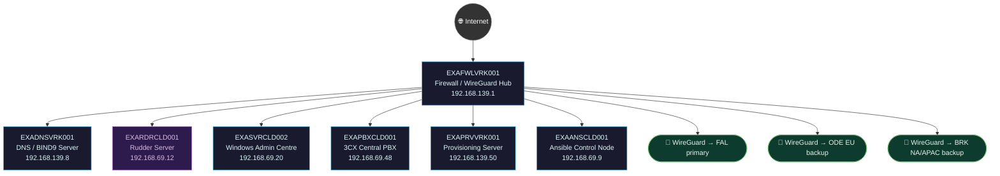
```mermaid
graph TD
    INET(("🌐 Internet"))
    FWLCLD["EXAFWLVRK001<br/>Firewall / WireGuard Hub<br/>192.168.139.1"]
    DNS["EXADNSVRK001<br/>DNS / BIND9 Server<br/>192.168.139.8"]
    PRV["EXAPRVVRK001<br/>Provisioning Server<br/>192.168.139.50"]
    RUD["EXARDRCLD001<br/>Rudder Server<br/>192.168.69.12"]
    WAC["EXASVRCLD002<br/>Windows Admin Centre<br/>192.168.69.20"]
    PBX["EXAPBXCLD001<br/>3CX Central PBX<br/>192.168.69.48"]
    ANS["EXAANSCLD001<br/>Ansible Control Node<br/>192.168.69.9"]

    VPN_FAL(["🔗 WireGuard → FAL primary"])
    VPN_ODE(["🔗 WireGuard → ODE EU backup"])
    VPN_BRK(["🔗 WireGuard → BRK NA/APAC backup"])

    INET --> FWLCLD
    FWLCLD --> DNS
    FWLCLD --> RUD
    FWLCLD --> WAC
    FWLCLD --> PBX
    FWLCLD --> PRV
    FWLCLD --> ANS
    FWLCLD --> VPN_FAL
    FWLCLD --> VPN_ODE
    FWLCLD --> VPN_BRK

    classDef server fill:#1a1a2e,stroke:#4fc3f7,color:#e0f7fa
    classDef rudder fill:#2d1b4e,stroke:#a569bd,color:#d7bde2
    classDef vpn fill:#0d3b2e,stroke:#66bb6a,color:#e8f5e9
    classDef inet fill:#333,stroke:#aaa,color:#fff
    class FWLCLD,DNS,WAC,PBX,PRV,ANS server
    class RUD rudder
    class VPN_FAL,VPN_ODE,VPN_BRK vpn
    class INET inet
```

---

---

## 🏴󠁧󠁢󠁳󠁣󠁴󠁿 Scotland

---

## FAL — Falkirk *(Head Office)* ⭐

**Address:** Brockville Stadium, Hope Street, Falkirk  
**LAN:** `192.168.76.0/24` · **VPN:** `10.0.76.0/24` · **Domain:** `example.net`  
**PVE nodes:** 3 (hub) · **VPN parent:** CLD (primary head node)

```mermaid
graph TD
    INET(("🌐 Internet"))
    RTR["EXARTRFAL001<br/>Cisco ISR 4331<br/>.254"]
    FWL["EXAFWLFAL001<br/>FortiOS<br/>.1"]
    SW1["EXASWIFAL001<br/>Cisco 9300<br/>.250"]
    SW2["EXASWIFAL002<br/>Cisco 9300<br/>.251"]

    subgraph BMC ["BMC Pool"]
        RAC1["EXARACFAL001<br/>Dell iDRAC9<br/>.2"]
        RAC2["EXARACFAL002<br/>Dell iDRAC9<br/>.3"]
        RAC3["EXARACFAL003<br/>Dell iDRAC9<br/>.4"]
    end

    subgraph PVE ["Proxmox Cluster (3-node)"]
        PVE1["EXAPVEFAL001<br/>Proxmox node 1<br/>.5"]
        PVE2["EXAPVEFAL002<br/>Proxmox node 2<br/>.6"]
        PVE3["EXAPVEFAL003<br/>Proxmox node 3<br/>.7"]
    end

    subgraph DC ["Domain Controllers"]
        DC1["EXADCSFAL001<br/>DC · PDC Emulator<br/>.10"]
        DC2["EXADCSFAL002<br/>DC secondary<br/>.11"]
    end

    subgraph INFRA ["Infrastructure"]
        SBC["EXASBCFAL001<br/>3CX SBC → CLD PBX<br/>.48"]
        RRY["EXARRYFAL001<br/>Rudder Relay<br/>.12"]
        NAS["EXANASFAL001<br/>FreeNAS 13.0-U6<br/>.32"]
        TAR["EXATARFAL001<br/>Tape Archiver<br/>.33"]
    end

    subgraph ENDPOINTS ["Endpoints"]
        WKS1["EXAWKSFAL001<br/>Mixing Desk WKS<br/>.100"]
        WKS2["EXAWKSFAL002<br/>Reel-to-Reel WKS<br/>.101"]
        WKS3["EXAWKSFAL003<br/>Shared Editing WKS<br/>.102"]
        LAP["EXALAPFAL001<br/>Production Laptop<br/>.103"]
        SUR["EXASURFAL001<br/>Microsoft Surface<br/>.104"]
        PHN["EXAPHNFAL001-003<br/>Staff Phones"]
        PHN2["EXAPHNFAL006-007<br/>Yealink T58A"]
        TAB["EXATABFAL001<br/>Tablet"]
    end

    subgraph WAP_CAM ["Wireless & Security"]
        WAP["WAPs x6<br/>Ubiquiti UniFi U6-Pro<br/>.5-.10"]
        CAM1["EXACAMFAL001<br/>Axis · Front entrance<br/>.70"]
        CAM2["EXACAMFAL002<br/>Axis · Studio hallway<br/>.71"]
        CAM3["EXACAMFAL003<br/>Axis · Car park<br/>.72"]
        CAM4["EXACAMFAL004<br/>Axis · Loading bay<br/>.73"]
        RDR["EXARDRFAL001<br/>HID Signo Badge Reader<br/>.16"]
    end

    subgraph SITE ["Site-Specific Equipment"]
        LCD["EXALCDFAL001<br/>Samsung Tizen Display<br/>.50"]
        VCU["EXAVCUFAL001<br/>Poly Studio X70<br/>.51"]
        JKB["EXAMUSFAL001<br/>Pureline 128V Jukebox<br/>.67"]
        PAY["EXAPAYFAL001<br/>GPO Kiosk No.6 Payphone<br/>.95"]
        COF["EXATEAFAL001<br/>Smart Coffee Machine<br/>.61"]
        VND1["EXADONFAL001<br/>Tim Hortons Vending<br/>.62"]
        VND2["EXAVNDFAL002<br/>Irn-Bru Machine<br/>.63"]
        VND3["EXAVNDFAL003<br/>McCowans Dispenser<br/>.64"]
        VND4["EXAVNDFAL004<br/>Mrs Tily Dispenser<br/>.65"]
        VND5["EXAVNDFAL005<br/>¼lb Confectionery<br/>.66"]
        PMP["EXAPMPFAL001<br/>Networked Petrol Pump<br/>.60"]
        CLK["EXACLKFAL001<br/>NTP Clock<br/>.80"]
    end

    VPN_CLD(["🔗 WireGuard ← CLD<br/>10.0.76.0/24"])

    INET --> RTR --> FWL --> SW1 & SW2
    SW1 --> PVE1 & PVE2 & PVE3
    SW1 --> DC1 & DC2
    SW1 --> SBC & NAS & TAR
    SW2 --> WKS1
    SW2 --> WAP
    SW2 --> LCD
    RAC1 -.->|"manages"| PVE1
    RAC2 -.->|"manages"| PVE2
    RAC3 -.->|"manages"| PVE3
    FWL <-->|"WireGuard tunnel"| VPN_CLD

    SW1 --> RRY
    RRY -. "→ EXARDRCLD001" .-> VPN_CLD
    classDef net fill:#0d3b2e,stroke:#66bb6a,color:#e8f5e9
    classDef srv fill:#1a237e,stroke:#7986cb,color:#e8eaf6
    classDef ep fill:#4a148c,stroke:#ba68c8,color:#f3e5f5
    classDef site fill:#880e4f,stroke:#f48fb1,color:#fce4ec
    classDef bmc fill:#bf360c,stroke:#ff8a65,color:#fbe9e7
    classDef vpn fill:#006064,stroke:#4dd0e1,color:#e0f7fa
    classDef rudder fill:#2d1b4e,stroke:#a569bd,color:#d7bde2
    class RTR,FWL,SW1,SW2 net
    class PVE1,PVE2,PVE3,DC1,DC2,SBC,NAS,TAR srv
    class RRY rudder
    class WKS1,WKS2,WKS3,LAP,SUR,PHN,PHN2,TAB,WAP,CAM1,CAM2,CAM3,CAM4,RDR ep
    class LCD,VCU,JKB,PAY,COF,VND1,VND2,VND3,VND4,VND5,PMP,CLK site
    class RAC1,RAC2,RAC3 bmc
    class VPN_CLD vpn
```

---

## EDI — Edinburgh ⚠️

**LAN:** `192.168.131.0/24` · **Domain:** `example.org` / `example.net`  
**PVE nodes:** 1 · **VPN parent:** FAL  
> ⚠️ `EXADCSEDI003` — DFSR stopped, C: drive at 5% free. Immediate action required.

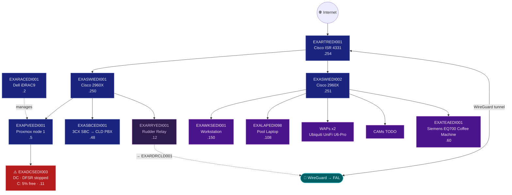
```mermaid
graph TD
    INET(("🌐 Internet"))
    RTR["EXARTREDI001<br/>Cisco ISR 4331<br/>.254"]
    SW1["EXASWIEDI001<br/>Cisco 2960X<br/>.250"]
    SW2["EXASWIEDI002<br/>Cisco 2960X<br/>.251"]
    RAC["EXARACEDI001<br/>Dell iDRAC9<br/>.2"]
    PVE["EXAPVEEDI001<br/>Proxmox node 1<br/>.5"]
    DC["⚠️ EXADCSEDI003<br/>DC · DFSR stopped<br/>C: 5% free · .11"]
    SBC["EXASBCEDI001<br/>3CX SBC → CLD PBX<br/>.48"]
    RRY["EXARRYEDI001<br/>Rudder Relay<br/>.12"]
    WKS["EXAWKSEDI001<br/>Workstation<br/>.150"]
    LAP["EXALAPEDI098<br/>Pool Laptop<br/>.108"]
    WAP["WAPs x2<br/>Ubiquiti UniFi U6-Pro"]
    CAM["CAMs TODO"]
    COF["EXATEAEDI001<br/>Siemens EQ700 Coffee Machine<br/>.60"]
    VPN(["🔗 WireGuard → FAL"])

    INET --> RTR --> SW1 & SW2
    SW1 --> PVE --> DC
    SW1 --> SBC
    RAC -.->|"manages"| PVE
    SW2 --> WKS & LAP & WAP & CAM & COF
    RTR <-->|"WireGuard tunnel"| VPN

    SW1 --> RRY
    RRY -. "→ EXARDRCLD001" .-> VPN
    classDef net fill:#1a237e,stroke:#7986cb,color:#e8eaf6
    classDef warn fill:#b71c1c,stroke:#ef9a9a,color:#ffebee
    classDef srv fill:#1a237e,stroke:#7986cb,color:#e8eaf6
    classDef ep fill:#4a148c,stroke:#ba68c8,color:#f3e5f5
    classDef vpn fill:#006064,stroke:#4dd0e1,color:#e0f7fa
    classDef rudder fill:#2d1b4e,stroke:#a569bd,color:#d7bde2
    class RTR,SW1,SW2 net
    class DC warn
    class PVE,SBC,RAC srv
    class RRY rudder
    class WKS,LAP,WAP,CAM,COF ep
    class VPN vpn
```

---

## GLA — Glasgow

**LAN:** `192.168.141.0/24` · **Domain:** `example.net`  
**PVE nodes:** 1 · **VPN parent:** FAL

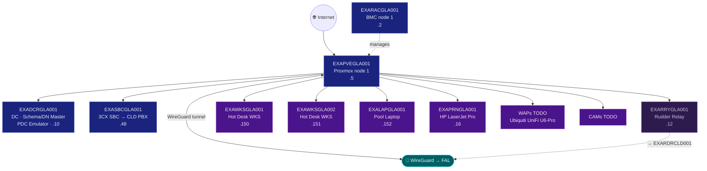
```mermaid
graph TD
    INET(("🌐 Internet"))
    PVE["EXAPVEGLA001<br/>Proxmox node 1<br/>.5"]
    RAC["EXARACGLA001<br/>BMC node 1<br/>.2"]
    DC["EXADCRGLA001<br/>DC · Schema/DN Master<br/>PDC Emulator · .10"]
    SBC["EXASBCGLA001<br/>3CX SBC → CLD PBX<br/>.48"]
    RRY["EXARRYGLA001<br/>Rudder Relay<br/>.12"]
    WKS1["EXAWKSGLA001<br/>Hot Desk WKS<br/>.150"]
    WKS2["EXAWKSGLA002<br/>Hot Desk WKS<br/>.151"]
    LAP["EXALAPGLA001<br/>Pool Laptop<br/>.152"]
    PRN["EXAPRNGLA001<br/>HP LaserJet Pro<br/>.16"]
    WAP["WAPs TODO<br/>Ubiquiti UniFi U6-Pro"]
    CAM["CAMs TODO"]
    VPN(["🔗 WireGuard → FAL"])

    INET --> PVE
    PVE --> DC & SBC
    RAC -.->|"manages"| PVE
    PVE --> WKS1 & WKS2 & LAP & PRN & WAP & CAM
    PVE <-->|"WireGuard tunnel"| VPN

    PVE --> RRY
    RRY -. "→ EXARDRCLD001" .-> VPN
    classDef net fill:#1a237e,stroke:#7986cb,color:#e8eaf6
    classDef srv fill:#1a237e,stroke:#7986cb,color:#e8eaf6
    classDef ep fill:#4a148c,stroke:#ba68c8,color:#f3e5f5
    classDef vpn fill:#006064,stroke:#4dd0e1,color:#e0f7fa
    classDef rudder fill:#2d1b4e,stroke:#a569bd,color:#d7bde2
    class PVE,DC,SBC,RAC srv
    class RRY rudder
    class WKS1,WKS2,LAP,PRN,WAP,CAM ep
    class VPN vpn
```

---

## CLY — Clydebank

**LAN:** `192.168.41.0/24` · **Domain:** `example.net`  
**PVE nodes:** 1 · **VPN parent:** FAL

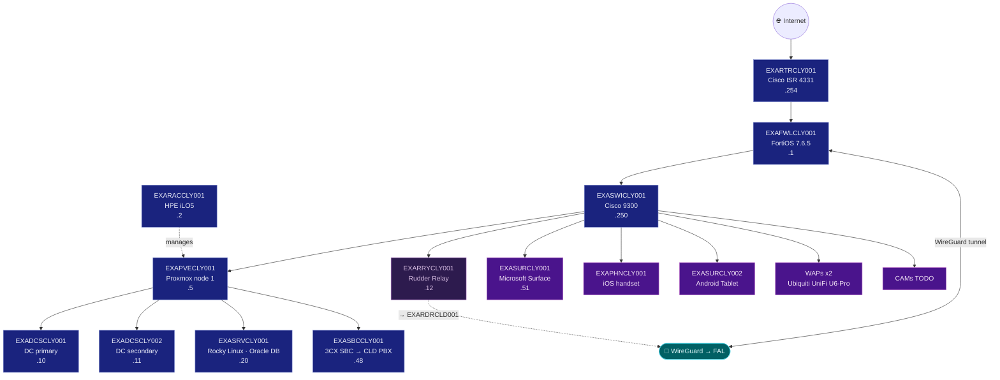
```mermaid
graph TD
    INET(("🌐 Internet"))
    FWL["EXAFWLCLY001<br/>FortiOS 7.6.5<br/>.1"]
    RTR["EXARTRCLY001<br/>Cisco ISR 4331<br/>.254"]
    SW["EXASWICLY001<br/>Cisco 9300<br/>.250"]
    RAC["EXARACCLY001<br/>HPE iLO5<br/>.2"]
    PVE["EXAPVECLY001<br/>Proxmox node 1<br/>.5"]
    DC1["EXADCSCLY001<br/>DC primary<br/>.10"]
    DC2["EXADCSCLY002<br/>DC secondary<br/>.11"]
    SRV["EXASRVCLY001<br/>Rocky Linux · Oracle DB<br/>.20"]
    SBC["EXASBCCLY001<br/>3CX SBC → CLD PBX<br/>.48"]
    RRY["EXARRYCLY001<br/>Rudder Relay<br/>.12"]
    SUR["EXASURCLY001<br/>Microsoft Surface<br/>.51"]
    PHN["EXAPHNCLY001<br/>iOS handset"]
    TAB["EXASURCLY002<br/>Android Tablet"]
    WAP["WAPs x2<br/>Ubiquiti UniFi U6-Pro"]
    CAM["CAMs TODO"]
    VPN(["🔗 WireGuard → FAL"])

    INET --> RTR --> FWL --> SW
    SW --> PVE --> DC1 & DC2 & SRV & SBC
    RAC -.->|"manages"| PVE
    SW --> SUR & PHN & TAB & WAP & CAM
    FWL <-->|"WireGuard tunnel"| VPN

    SW --> RRY
    RRY -. "→ EXARDRCLD001" .-> VPN
    classDef net fill:#1a237e,stroke:#7986cb,color:#e8eaf6
    classDef srv fill:#1a237e,stroke:#7986cb,color:#e8eaf6
    classDef ep fill:#4a148c,stroke:#ba68c8,color:#f3e5f5
    classDef vpn fill:#006064,stroke:#4dd0e1,color:#e0f7fa
    classDef rudder fill:#2d1b4e,stroke:#a569bd,color:#d7bde2
    class FWL,RTR,SW net
    class PVE,DC1,DC2,SRV,SBC,RAC srv
    class RRY rudder
    class SUR,PHN,TAB,WAP,CAM ep
    class VPN vpn
```

---

## DUN — Dundee

**LAN:** `192.168.138.0/24` · **Domain:** `example.net`  
**PVE nodes:** 1 · **VPN parent:** FAL

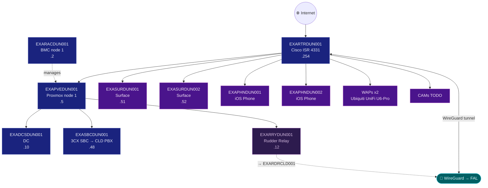
```mermaid
graph TD
    INET(("🌐 Internet"))
    RTR["EXARTRDUN001<br/>Cisco ISR 4331<br/>.254"]
    RAC["EXARACDUN001<br/>BMC node 1<br/>.2"]
    PVE["EXAPVEDUN001<br/>Proxmox node 1<br/>.5"]
    DC["EXADCSDUN001<br/>DC<br/>.10"]
    SBC["EXASBCDUN001<br/>3CX SBC → CLD PBX<br/>.48"]
    RRY["EXARRYDUN001<br/>Rudder Relay<br/>.12"]
    SUR1["EXASURDUN001<br/>Surface<br/>.51"]
    SUR2["EXASURDUN002<br/>Surface<br/>.52"]
    PHN1["EXAPHNDUN001<br/>iOS Phone"]
    PHN2["EXAPHNDUN002<br/>iOS Phone"]
    WAP["WAPs x2<br/>Ubiquiti UniFi U6-Pro"]
    CAM["CAMs TODO"]
    VPN(["🔗 WireGuard → FAL"])

    INET --> RTR --> PVE
    PVE --> DC & SBC
    RAC -.->|"manages"| PVE
    RTR --> SUR1 & SUR2 & PHN1 & PHN2 & WAP & CAM
    RTR <-->|"WireGuard tunnel"| VPN

    PVE --> RRY
    RRY -. "→ EXARDRCLD001" .-> VPN
    classDef net fill:#1a237e,stroke:#7986cb,color:#e8eaf6
    classDef srv fill:#1a237e,stroke:#7986cb,color:#e8eaf6
    classDef ep fill:#4a148c,stroke:#ba68c8,color:#f3e5f5
    classDef vpn fill:#006064,stroke:#4dd0e1,color:#e0f7fa
    classDef rudder fill:#2d1b4e,stroke:#a569bd,color:#d7bde2
    class RTR net
    class PVE,DC,SBC,RAC srv
    class RRY rudder
    class SUR1,SUR2,PHN1,PHN2,WAP,CAM ep
    class VPN vpn
```

---

## PER — Perth

**LAN:** `192.168.173.0/24` · **Domain:** `example.net`  
**PVE nodes:** 1 · **VPN parent:** FAL

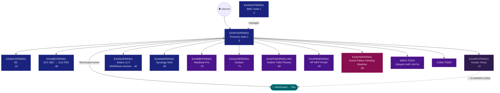
```mermaid
graph TD
    INET(("🌐 Internet"))
    RAC["EXARACPER001<br/>BMC node 1<br/>.2"]
    PVE["EXAPVEPER001<br/>Proxmox node 1<br/>.5"]
    DC["EXADCSPER001<br/>DC<br/>.10"]
    SBC["EXASBCPER001<br/>3CX SBC → CLD PBX<br/>.48"]
    RRY["EXARRYPER001<br/>Rudder Relay<br/>.12"]
    NIX["EXANIXPER001<br/>Solaris 11.5<br/>MIDI/Music Archive · .40"]
    NAS["EXANASPER001<br/>Synology NAS<br/>.50"]
    MBP["EXAMBPPER001<br/>MacBook Pro<br/>.70"]
    SUR["EXASURPER001<br/>Surface<br/>.71"]
    PHN["EXAPHNPER001-004<br/>Yealink T46G Phones<br/>.80"]
    PRN["EXAPRNPER001<br/>HP MFP Printer<br/>.20"]
    VND["EXAVNDPER001<br/>Scone Palace Vending Machine<br/>.60"]
    WAP["WAPs TODO<br/>Ubiquiti UniFi U6-Pro"]
    CAM["CAMs TODO"]
    VPN(["🔗 WireGuard → FAL"])

    INET --> PVE
    PVE --> DC & SBC & NIX & NAS
    RAC -.->|"manages"| PVE
    PVE --> MBP & SUR & PHN & PRN & VND & WAP & CAM
    PVE <-->|"WireGuard tunnel"| VPN

    PVE --> RRY
    RRY -. "→ EXARDRCLD001" .-> VPN
    classDef srv fill:#1a237e,stroke:#7986cb,color:#e8eaf6
    classDef ep fill:#4a148c,stroke:#ba68c8,color:#f3e5f5
    classDef site fill:#880e4f,stroke:#f48fb1,color:#fce4ec
    classDef vpn fill:#006064,stroke:#4dd0e1,color:#e0f7fa
    classDef rudder fill:#2d1b4e,stroke:#a569bd,color:#d7bde2
    class PVE,DC,SBC,NIX,NAS,RAC srv
    class RRY rudder
    class MBP,SUR,PHN,PRN,WAP,CAM ep
    class VND site
    class VPN vpn
```

---

## ABD — Aberdeen

**LAN:** `192.168.224.0/24` · **Domain:** `example.org`  
**PVE nodes:** 1 · **VPN parent:** FAL

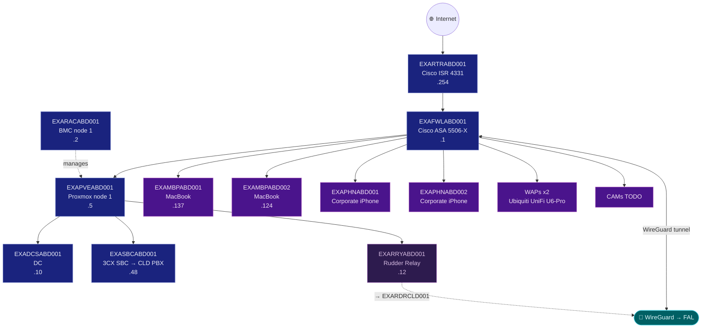
```mermaid
graph TD
    INET(("🌐 Internet"))
    FWL["EXAFWLABD001<br/>Cisco ASA 5506-X<br/>.1"]
    RTR["EXARTRABD001<br/>Cisco ISR 4331<br/>.254"]
    RAC["EXARACABD001<br/>BMC node 1<br/>.2"]
    PVE["EXAPVEABD001<br/>Proxmox node 1<br/>.5"]
    DC["EXADCSABD001<br/>DC<br/>.10"]
    SBC["EXASBCABD001<br/>3CX SBC → CLD PBX<br/>.48"]
    RRY["EXARRYABD001<br/>Rudder Relay<br/>.12"]
    MBP1["EXAMBPABD001<br/>MacBook<br/>.137"]
    MBP2["EXAMBPABD002<br/>MacBook<br/>.124"]
    PHN1["EXAPHNABD001<br/>Corporate iPhone"]
    PHN2["EXAPHNABD002<br/>Corporate iPhone"]
    WAP["WAPs x2<br/>Ubiquiti UniFi U6-Pro"]
    CAM["CAMs TODO"]
    VPN(["🔗 WireGuard → FAL"])

    INET --> RTR --> FWL --> PVE
    PVE --> DC & SBC
    RAC -.->|"manages"| PVE
    FWL --> MBP1 & MBP2 & PHN1 & PHN2 & WAP & CAM
    FWL <-->|"WireGuard tunnel"| VPN

    PVE --> RRY
    RRY -. "→ EXARDRCLD001" .-> VPN
    classDef net fill:#1a237e,stroke:#7986cb,color:#e8eaf6
    classDef srv fill:#1a237e,stroke:#7986cb,color:#e8eaf6
    classDef ep fill:#4a148c,stroke:#ba68c8,color:#f3e5f5
    classDef vpn fill:#006064,stroke:#4dd0e1,color:#e0f7fa
    classDef rudder fill:#2d1b4e,stroke:#a569bd,color:#d7bde2
    class FWL,RTR net
    class PVE,DC,SBC,RAC srv
    class RRY rudder
    class MBP1,MBP2,PHN1,PHN2,WAP,CAM ep
    class VPN vpn
```

---

---

## 🏴󠁧󠁢󠁥󠁮󠁧󠁿 England

---

## LND — London

**LAN:** `192.168.20.0/24` · **Domain:** `example.net`  
**PVE nodes:** 1 · **VPN parent:** FAL

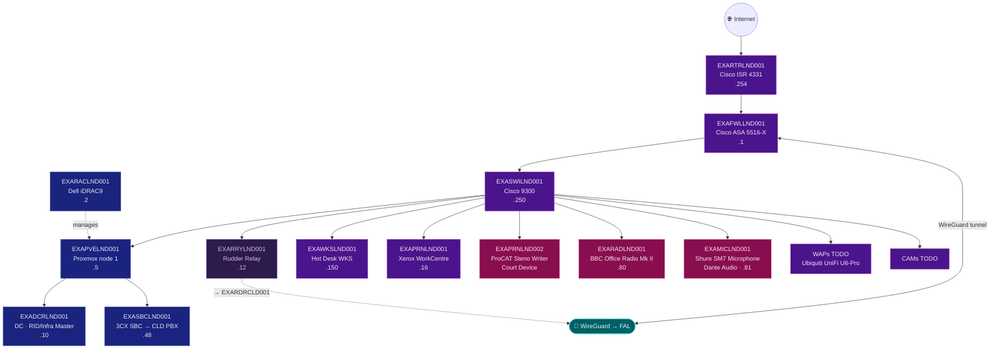
```mermaid
graph TD
    INET(("🌐 Internet"))
    FWL["EXAFWLLND001<br/>Cisco ASA 5516-X<br/>.1"]
    SW["EXASWILND001<br/>Cisco 9300<br/>.250"]
    RTR["EXARTRLND001<br/>Cisco ISR 4331<br/>.254"]
    RAC["EXARACLND001<br/>Dell iDRAC9<br/>.2"]
    PVE["EXAPVELND001<br/>Proxmox node 1<br/>.5"]
    DC["EXADCRLND001<br/>DC · RID/Infra Master<br/>.10"]
    SBC["EXASBCLND001<br/>3CX SBC → CLD PBX<br/>.48"]
    RRY["EXARRYLND001<br/>Rudder Relay<br/>.12"]
    WKS["EXAWKSLND001<br/>Hot Desk WKS<br/>.150"]
    PRN1["EXAPRNLND001<br/>Xerox WorkCentre<br/>.16"]
    PRN2["EXAPRNLND002<br/>ProCAT Steno Writer<br/>Court Device"]
    RAD["EXARADLND001<br/>BBC Office Radio Mk II<br/>.80"]
    MIC["EXAMICLND001<br/>Shure SM7 Microphone<br/>Dante Audio · .81"]
    WAP["WAPs TODO<br/>Ubiquiti UniFi U6-Pro"]
    CAM["CAMs TODO"]
    VPN(["🔗 WireGuard → FAL"])

    INET --> RTR --> FWL --> SW
    SW --> PVE --> DC & SBC
    RAC -.->|"manages"| PVE
    SW --> WKS & PRN1 & PRN2 & RAD & MIC & WAP & CAM
    FWL <-->|"WireGuard tunnel"| VPN

    SW --> RRY
    RRY -. "→ EXARDRCLD001" .-> VPN
    classDef net fill:#4a148c,stroke:#ba68c8,color:#f3e5f5
    classDef srv fill:#1a237e,stroke:#7986cb,color:#e8eaf6
    classDef ep fill:#4a148c,stroke:#ba68c8,color:#f3e5f5
    classDef site fill:#880e4f,stroke:#f48fb1,color:#fce4ec
    classDef vpn fill:#006064,stroke:#4dd0e1,color:#e0f7fa
    classDef rudder fill:#2d1b4e,stroke:#a569bd,color:#d7bde2
    class FWL,SW,RTR net
    class PVE,DC,SBC,RAC srv
    class RRY rudder
    class WKS,PRN1,WAP,CAM ep
    class PRN2,RAD,MIC site
    class VPN vpn
```

---

## BIR — Birmingham

**LAN:** `192.168.121.0/24` · **Domain:** `example.net`  
**PVE nodes:** 1 · **VPN parent:** FAL

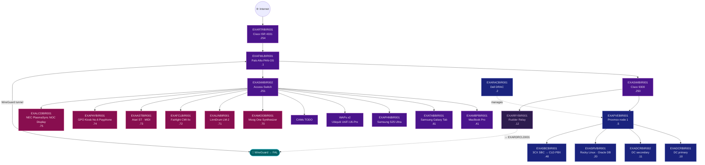
```mermaid
graph TD
    INET(("🌐 Internet"))
    FWL["EXAFWLBIR001<br/>Palo Alto PAN-OS<br/>.1"]
    SW1["EXASWIBIR001<br/>Cisco 9300<br/>.250"]
    SW2["EXASWIBIR002<br/>Access Switch<br/>.251"]
    RTR["EXARTRBIR001<br/>Cisco ISR 4331<br/>.254"]
    RAC["EXARACBIR001<br/>Dell DRAC<br/>.2"]
    PVE["EXAPVEBIR001<br/>Proxmox node 1<br/>.5"]
    DC1["EXADCRBIR001<br/>DC primary<br/>.10"]
    DC2["EXADCRBIR002<br/>DC secondary<br/>.11"]
    SRV["EXASRVBIR001<br/>Rocky Linux · Oracle DB<br/>.20"]
    SBC["EXASBCBIR001<br/>3CX SBC → CLD PBX<br/>.48"]
    RRY["EXARRYBIR001<br/>Rudder Relay<br/>.12"]
    MBP["EXAMBPBIR001<br/>MacBook Pro<br/>.41"]
    TAB["EXATABBIR001<br/>Samsung Galaxy Tab<br/>.61"]
    PHN["EXAPHNBIR001<br/>Samsung S25 Ultra"]
    WAP["WAPs x2<br/>Ubiquiti UniFi U6-Pro"]
    CAM["CAMs TODO"]
    MOO["EXAMOOBIR001<br/>Moog One Synthesizer<br/>.70"]
    LIN["EXALINBIR001<br/>LinnDrum LM-2<br/>.71"]
    FCL["EXAFCLBIR001<br/>Fairlight CMI IIx<br/>.72"]
    AST["EXAASTBIR001<br/>Atari ST · MIDI<br/>.73"]
    PAY["EXAPAYBIR001<br/>GPO Kiosk No.6 Payphone<br/>.74"]
    LCD["EXALCDBIR001<br/>NEC PlasmaSync NOC Display<br/>.75"]
    VPN(["🔗 WireGuard → FAL"])

    INET --> RTR --> FWL --> SW1 & SW2
    SW1 --> PVE --> DC1 & DC2 & SRV & SBC
    RAC -.->|"manages"| PVE
    SW2 --> MBP & TAB & PHN & WAP & CAM
    SW2 --> MOO & LIN & FCL & AST & PAY & LCD
    FWL <-->|"WireGuard tunnel"| VPN

    SW1 --> RRY
    RRY -. "→ EXARDRCLD001" .-> VPN
    classDef net fill:#4a148c,stroke:#ba68c8,color:#f3e5f5
    classDef srv fill:#1a237e,stroke:#7986cb,color:#e8eaf6
    classDef ep fill:#4a148c,stroke:#ba68c8,color:#f3e5f5
    classDef site fill:#880e4f,stroke:#f48fb1,color:#fce4ec
    classDef vpn fill:#006064,stroke:#4dd0e1,color:#e0f7fa
    classDef rudder fill:#2d1b4e,stroke:#a569bd,color:#d7bde2
    class FWL,SW1,SW2,RTR net
    class PVE,DC1,DC2,SRV,SBC,RAC srv
    class RRY rudder
    class MBP,TAB,PHN,WAP,CAM ep
    class MOO,LIN,FCL,AST,PAY,LCD site
    class VPN vpn
```

---

## MCR — Manchester

**LAN:** `192.168.161.0/24` · **Domain:** `example.org`  
**PVE nodes:** 1 · **VPN parent:** FAL

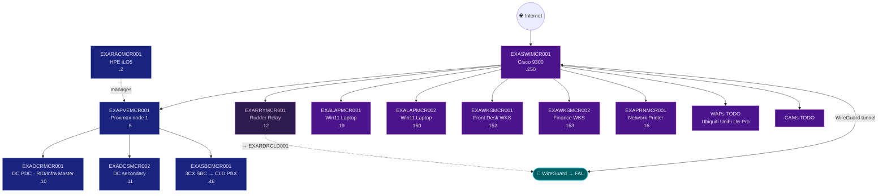
```mermaid
graph TD
    INET(("🌐 Internet"))
    SW["EXASWIMCR001<br/>Cisco 9300<br/>.250"]
    RAC["EXARACMCR001<br/>HPE iLO5<br/>.2"]
    PVE["EXAPVEMCR001<br/>Proxmox node 1<br/>.5"]
    DC1["EXADCRMCR001<br/>DC PDC · RID/Infra Master<br/>.10"]
    DC2["EXADCSMCR002<br/>DC secondary<br/>.11"]
    SBC["EXASBCMCR001<br/>3CX SBC → CLD PBX<br/>.48"]
    RRY["EXARRYMCR001<br/>Rudder Relay<br/>.12"]
    LAP1["EXALAPMCR001<br/>Win11 Laptop<br/>.19"]
    LAP2["EXALAPMCR002<br/>Win11 Laptop<br/>.150"]
    WKS1["EXAWKSMCR001<br/>Front Desk WKS<br/>.152"]
    WKS2["EXAWKSMCR002<br/>Finance WKS<br/>.153"]
    PRN["EXAPRNMCR001<br/>Network Printer<br/>.16"]
    WAP["WAPs TODO<br/>Ubiquiti UniFi U6-Pro"]
    CAM["CAMs TODO"]
    VPN(["🔗 WireGuard → FAL"])

    INET --> SW
    SW --> PVE --> DC1 & DC2 & SBC
    RAC -.->|"manages"| PVE
    SW --> LAP1 & LAP2 & WKS1 & WKS2 & PRN & WAP & CAM
    SW <-->|"WireGuard tunnel"| VPN

    SW --> RRY
    RRY -. "→ EXARDRCLD001" .-> VPN
    classDef net fill:#4a148c,stroke:#ba68c8,color:#f3e5f5
    classDef srv fill:#1a237e,stroke:#7986cb,color:#e8eaf6
    classDef ep fill:#4a148c,stroke:#ba68c8,color:#f3e5f5
    classDef vpn fill:#006064,stroke:#4dd0e1,color:#e0f7fa
    classDef rudder fill:#2d1b4e,stroke:#a569bd,color:#d7bde2
    class SW net
    class PVE,DC1,DC2,SBC,RAC srv
    class RRY rudder
    class LAP1,LAP2,WKS1,WKS2,PRN,WAP,CAM ep
    class VPN vpn
```

---

## LIV — Liverpool

**LAN:** `192.168.151.0/24` · **Domain:** `example.org`  
**PVE nodes:** 1 · **VPN parent:** FAL

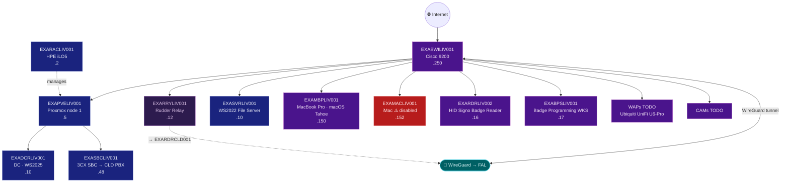
```mermaid
graph TD
    INET(("🌐 Internet"))
    SW["EXASWILIV001<br/>Cisco 9200<br/>.250"]
    RAC["EXARACLIV001<br/>HPE iLO5<br/>.2"]
    PVE["EXAPVELIV001<br/>Proxmox node 1<br/>.5"]
    DC["EXADCRLIV001<br/>DC · WS2025<br/>.10"]
    SBC["EXASBCLIV001<br/>3CX SBC → CLD PBX<br/>.48"]
    RRY["EXARRYLIV001<br/>Rudder Relay<br/>.12"]
    SRV["EXASVRLIV001<br/>WS2022 File Server<br/>.10"]
    MBP["EXAMBPLIV001<br/>MacBook Pro · macOS Tahoe<br/>.150"]
    MAC["EXAMACLIV001<br/>iMac ⚠️ disabled<br/>.152"]
    RDR["EXARDRLIV002<br/>HID Signo Badge Reader<br/>.16"]
    BPS["EXABPSLIV001<br/>Badge Programming WKS<br/>.17"]
    WAP["WAPs TODO<br/>Ubiquiti UniFi U6-Pro"]
    CAM["CAMs TODO"]
    VPN(["🔗 WireGuard → FAL"])

    INET --> SW
    SW --> PVE --> DC & SBC
    RAC -.->|"manages"| PVE
    SW --> SRV & MBP & MAC & RDR & BPS & WAP & CAM
    SW <-->|"WireGuard tunnel"| VPN

    SW --> RRY
    RRY -. "→ EXARDRCLD001" .-> VPN
    classDef net fill:#4a148c,stroke:#ba68c8,color:#f3e5f5
    classDef srv fill:#1a237e,stroke:#7986cb,color:#e8eaf6
    classDef ep fill:#4a148c,stroke:#ba68c8,color:#f3e5f5
    classDef warn fill:#b71c1c,stroke:#ef9a9a,color:#ffebee
    classDef vpn fill:#006064,stroke:#4dd0e1,color:#e0f7fa
    classDef rudder fill:#2d1b4e,stroke:#a569bd,color:#d7bde2
    class SW net
    class PVE,DC,SBC,RAC,SRV srv
    class RRY rudder
    class MBP,RDR,BPS,WAP,CAM ep
    class MAC warn
    class VPN vpn
```

---

## NEW — Newcastle

**LAN:** `192.168.191.0/24` · **Domain:** `example.org`  
**PVE nodes:** 1 · **VPN parent:** FAL

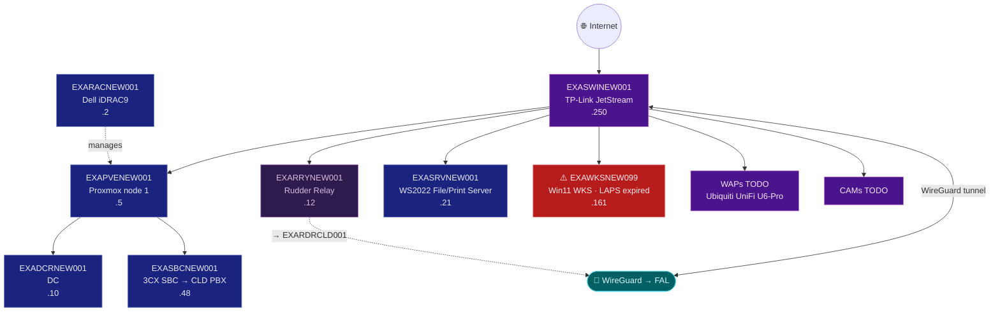
```mermaid
graph TD
    INET(("🌐 Internet"))
    SW["EXASWINEW001<br/>TP-Link JetStream<br/>.250"]
    RAC["EXARACNEW001<br/>Dell iDRAC9<br/>.2"]
    PVE["EXAPVENEW001<br/>Proxmox node 1<br/>.5"]
    DC["EXADCRNEW001<br/>DC<br/>.10"]
    SBC["EXASBCNEW001<br/>3CX SBC → CLD PBX<br/>.48"]
    RRY["EXARRYNEW001<br/>Rudder Relay<br/>.12"]
    SRV["EXASRVNEW001<br/>WS2022 File/Print Server<br/>.21"]
    WKS["⚠️ EXAWKSNEW099<br/>Win11 WKS · LAPS expired<br/>.161"]
    WAP["WAPs TODO<br/>Ubiquiti UniFi U6-Pro"]
    CAM["CAMs TODO"]
    VPN(["🔗 WireGuard → FAL"])

    INET --> SW
    SW --> PVE --> DC & SBC
    RAC -.->|"manages"| PVE
    SW --> SRV & WKS & WAP & CAM
    SW <-->|"WireGuard tunnel"| VPN

    SW --> RRY
    RRY -. "→ EXARDRCLD001" .-> VPN
    classDef net fill:#4a148c,stroke:#ba68c8,color:#f3e5f5
    classDef srv fill:#1a237e,stroke:#7986cb,color:#e8eaf6
    classDef ep fill:#4a148c,stroke:#ba68c8,color:#f3e5f5
    classDef warn fill:#b71c1c,stroke:#ef9a9a,color:#ffebee
    classDef vpn fill:#006064,stroke:#4dd0e1,color:#e0f7fa
    classDef rudder fill:#2d1b4e,stroke:#a569bd,color:#d7bde2
    class SW net
    class PVE,DC,SBC,RAC,SRV srv
    class RRY rudder
    class WAP,CAM ep
    class WKS warn
    class VPN vpn
```

---

## SHE — Sheffield

**LAN:** `192.168.114.0/24` · **Domain:** `example.net`  
**PVE nodes:** 1 · **VPN parent:** FAL

```mermaid
graph TD
    INET(("🌐 Internet"))
    RAC["EXARACSHE001<br/>BMC node 1<br/>.2"]
    PVE["EXAPVESHE001<br/>Proxmox node 1<br/>.5"]
    DC["EXADCSSHE001<br/>DC<br/>.10"]
    SBC["EXASBCSHE001<br/>3CX SBC → CLD PBX<br/>.48"]
    RRY["EXARRYSHE001<br/>Rudder Relay<br/>.12"]
    WAP["WAPs TODO<br/>Ubiquiti UniFi U6-Pro"]
    CAM["CAMs TODO"]
    EP["Endpoints TODO"]
    VPN(["🔗 WireGuard → FAL"])

    INET --> PVE --> DC & SBC
    RAC -.->|"manages"| PVE
    PVE --> WAP & CAM & EP
    PVE <-->|"WireGuard tunnel"| VPN

    PVE --> RRY
    RRY -. "→ EXARDRCLD001" .-> VPN
    classDef srv fill:#1a237e,stroke:#7986cb,color:#e8eaf6
    classDef ep fill:#4a148c,stroke:#ba68c8,color:#f3e5f5
    classDef vpn fill:#006064,stroke:#4dd0e1,color:#e0f7fa
    classDef rudder fill:#2d1b4e,stroke:#a569bd,color:#d7bde2
    class PVE,DC,SBC,RAC srv
    class RRY rudder
    class WAP,CAM,EP ep
    class VPN vpn
```

---

## HAL — Halifax

**LAN:** `192.168.142.0/24` · **Domain:** `example.net`  
**PVE nodes:** 1 · **VPN parent:** FAL

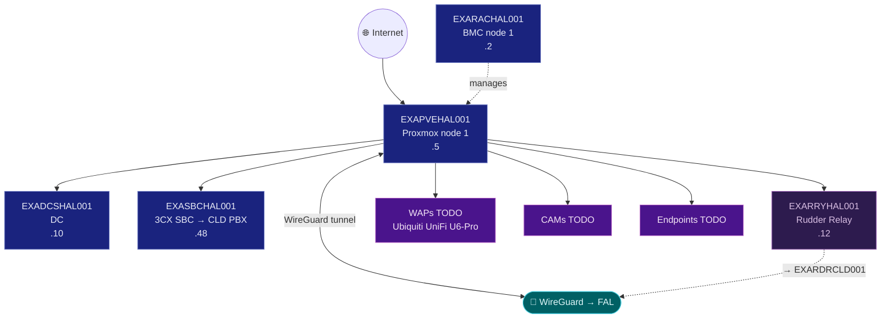
```mermaid
graph TD
    INET(("🌐 Internet"))
    RAC["EXARACHAL001<br/>BMC node 1<br/>.2"]
    PVE["EXAPVEHAL001<br/>Proxmox node 1<br/>.5"]
    DC["EXADCSHAL001<br/>DC<br/>.10"]
    SBC["EXASBCHAL001<br/>3CX SBC → CLD PBX<br/>.48"]
    RRY["EXARRYHAL001<br/>Rudder Relay<br/>.12"]
    WAP["WAPs TODO<br/>Ubiquiti UniFi U6-Pro"]
    CAM["CAMs TODO"]
    EP["Endpoints TODO"]
    VPN(["🔗 WireGuard → FAL"])

    INET --> PVE --> DC & SBC
    RAC -.->|"manages"| PVE
    PVE --> WAP & CAM & EP
    PVE <-->|"WireGuard tunnel"| VPN

    PVE --> RRY
    RRY -. "→ EXARDRCLD001" .-> VPN
    classDef srv fill:#1a237e,stroke:#7986cb,color:#e8eaf6
    classDef ep fill:#4a148c,stroke:#ba68c8,color:#f3e5f5
    classDef vpn fill:#006064,stroke:#4dd0e1,color:#e0f7fa
    classDef rudder fill:#2d1b4e,stroke:#a569bd,color:#d7bde2
    class PVE,DC,SBC,RAC srv
    class RRY rudder
    class WAP,CAM,EP ep
    class VPN vpn
```

---

## HUL — Hull

**LAN:** `192.168.148.0/24` · **Domain:** `example.net`  
**PVE nodes:** 1 · **VPN parent:** FAL

```mermaid
graph TD
    INET(("🌐 Internet"))
    RAC["EXARACHUL001<br/>BMC node 1<br/>.2"]
    PVE["EXAPVEHUL001<br/>Proxmox node 1<br/>.5"]
    DC["EXADCSHUL001<br/>DC<br/>.10"]
    SBC["EXASBCHUL001<br/>3CX SBC → CLD PBX<br/>.48"]
    RRY["EXARRYHUL001<br/>Rudder Relay<br/>.12"]
    WAP["WAPs TODO<br/>Ubiquiti UniFi U6-Pro"]
    CAM["CAMs TODO"]
    EP["Endpoints TODO"]
    VPN(["🔗 WireGuard → FAL"])

    INET --> PVE --> DC & SBC
    RAC -.->|"manages"| PVE
    PVE --> WAP & CAM & EP
    PVE <-->|"WireGuard tunnel"| VPN

    PVE --> RRY
    RRY -. "→ EXARDRCLD001" .-> VPN
    classDef srv fill:#1a237e,stroke:#7986cb,color:#e8eaf6
    classDef ep fill:#4a148c,stroke:#ba68c8,color:#f3e5f5
    classDef vpn fill:#006064,stroke:#4dd0e1,color:#e0f7fa
    classDef rudder fill:#2d1b4e,stroke:#a569bd,color:#d7bde2
    class PVE,DC,SBC,RAC srv
    class RRY rudder
    class WAP,CAM,EP ep
    class VPN vpn
```

---

## COV — Coventry

**LAN:** `192.168.247.0/24` · **Domain:** `example.net`  
**PVE nodes:** 1 · **VPN parent:** FAL  
*Note: WAP/RTR-only site — minimal infrastructure.*

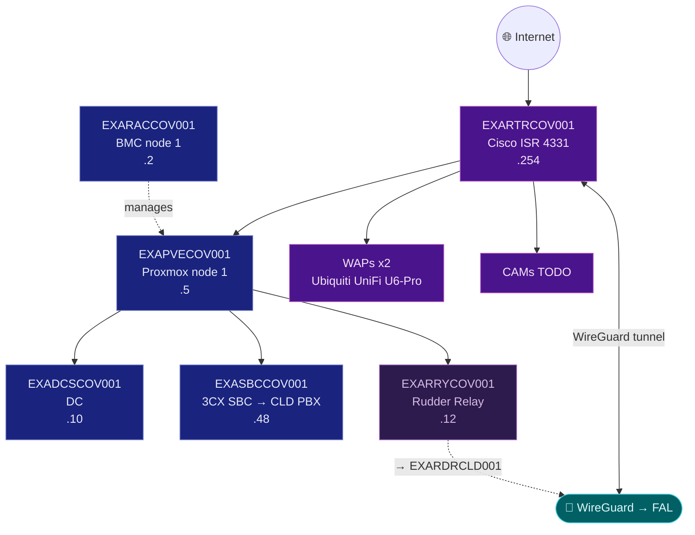
```mermaid
graph TD
    INET(("🌐 Internet"))
    RTR["EXARTRCOV001<br/>Cisco ISR 4331<br/>.254"]
    RAC["EXARACCOV001<br/>BMC node 1<br/>.2"]
    PVE["EXAPVECOV001<br/>Proxmox node 1<br/>.5"]
    DC["EXADCSCOV001<br/>DC<br/>.10"]
    SBC["EXASBCCOV001<br/>3CX SBC → CLD PBX<br/>.48"]
    RRY["EXARRYCOV001<br/>Rudder Relay<br/>.12"]
    WAP["WAPs x2<br/>Ubiquiti UniFi U6-Pro"]
    CAM["CAMs TODO"]
    VPN(["🔗 WireGuard → FAL"])

    INET --> RTR --> PVE --> DC & SBC
    RAC -.->|"manages"| PVE
    RTR --> WAP & CAM
    RTR <-->|"WireGuard tunnel"| VPN

    PVE --> RRY
    RRY -. "→ EXARDRCLD001" .-> VPN
    classDef net fill:#4a148c,stroke:#ba68c8,color:#f3e5f5
    classDef srv fill:#1a237e,stroke:#7986cb,color:#e8eaf6
    classDef ep fill:#4a148c,stroke:#ba68c8,color:#f3e5f5
    classDef vpn fill:#006064,stroke:#4dd0e1,color:#e0f7fa
    classDef rudder fill:#2d1b4e,stroke:#a569bd,color:#d7bde2
    class RTR net
    class PVE,DC,SBC,RAC srv
    class RRY rudder
    class WAP,CAM ep
    class VPN vpn
```

---

---

## 🇩🇰 Danmark

---

## CPH — København

**LAN:** `192.168.231.0/24` · **Domain:** `example.com` / `example.net`  
**PVE nodes:** 1 · **VPN parent:** ODE

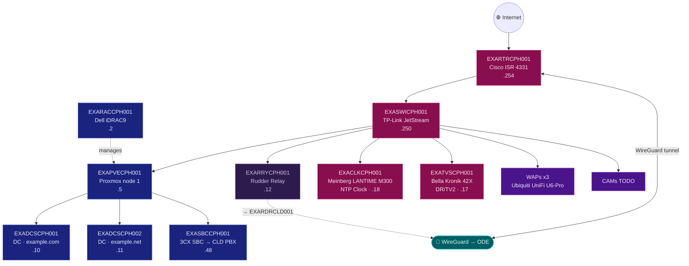
```mermaid
graph TD
    INET(("🌐 Internet"))
    SW["EXASWICPH001<br/>TP-Link JetStream<br/>.250"]
    RTR["EXARTRCPH001<br/>Cisco ISR 4331<br/>.254"]
    RAC["EXARACCPH001<br/>Dell iDRAC9<br/>.2"]
    PVE["EXAPVECPH001<br/>Proxmox node 1<br/>.5"]
    DC1["EXADCSCPH001<br/>DC · example.com<br/>.10"]
    DC2["EXADCSCPH002<br/>DC · example.net<br/>.11"]
    SBC["EXASBCCPH001<br/>3CX SBC → CLD PBX<br/>.48"]
    RRY["EXARRYCPH001<br/>Rudder Relay<br/>.12"]
    NTP["EXACLKCPH001<br/>Meinberg LANTIME M300<br/>NTP Clock · .18"]
    TV["EXATVSCPH001<br/>Bella Kronik 42X<br/>DR/TV2 · .17"]
    WAP["WAPs x3<br/>Ubiquiti UniFi U6-Pro"]
    CAM["CAMs TODO"]
    VPN(["🔗 WireGuard → ODE"])

    INET --> RTR --> SW
    SW --> PVE --> DC1 & DC2 & SBC
    RAC -.->|"manages"| PVE
    SW --> NTP & TV & WAP & CAM
    RTR <-->|"WireGuard tunnel"| VPN

    SW --> RRY
    RRY -. "→ EXARDRCLD001" .-> VPN
    classDef net fill:#880e4f,stroke:#f48fb1,color:#fce4ec
    classDef srv fill:#1a237e,stroke:#7986cb,color:#e8eaf6
    classDef site fill:#880e4f,stroke:#f48fb1,color:#fce4ec
    classDef vpn fill:#006064,stroke:#4dd0e1,color:#e0f7fa
    classDef ep fill:#4a148c,stroke:#ba68c8,color:#f3e5f5
    classDef rudder fill:#2d1b4e,stroke:#a569bd,color:#d7bde2
    class RTR,SW net
    class PVE,DC1,DC2,SBC,RAC srv
    class RRY rudder
    class NTP,TV site
    class WAP,CAM ep
    class VPN vpn
```

---

## ODE — Odense *(EU Hub)* ⭐

**LAN:** `192.168.126.0/24` · **Domain:** `example.net`  
**PVE nodes:** 3 (EU hub) · **VPN parent:** CLD (EU backup)

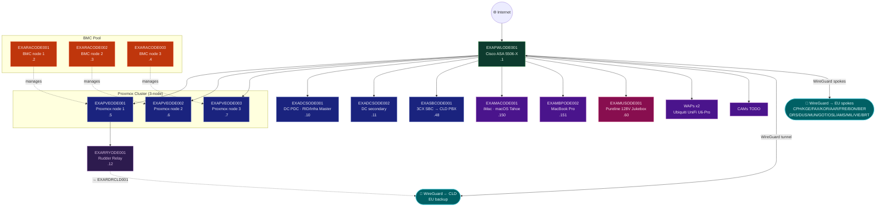
```mermaid
graph TD
    INET(("🌐 Internet"))
    FWL["EXAFWLODE001<br/>Cisco ASA 5506-X<br/>.1"]

    subgraph BMC ["BMC Pool"]
        RAC1["EXARACODE001<br/>BMC node 1<br/>.2"]
        RAC2["EXARACODE002<br/>BMC node 2<br/>.3"]
        RAC3["EXARACODE003<br/>BMC node 3<br/>.4"]
    end

    subgraph PVE ["Proxmox Cluster (3-node)"]
        PVE1["EXAPVEODE001<br/>Proxmox node 1<br/>.5"]
        PVE2["EXAPVEODE002<br/>Proxmox node 2<br/>.6"]
        PVE3["EXAPVEODE003<br/>Proxmox node 3<br/>.7"]
    end

    DC1["EXADCSODE001<br/>DC PDC · RID/Infra Master<br/>.10"]
    DC2["EXADCSODE002<br/>DC secondary<br/>.11"]
    SBC["EXASBCODE001<br/>3CX SBC → CLD PBX<br/>.48"]
    RRY["EXARRYODE001<br/>Rudder Relay<br/>.12"]
    MAC["EXAMACODE001<br/>iMac · macOS Tahoe<br/>.150"]
    MBP["EXAMBPODE002<br/>MacBook Pro<br/>.151"]
    JKB["EXAMUSODE001<br/>Pureline 128V Jukebox<br/>.60"]
    WAP["WAPs x2<br/>Ubiquiti UniFi U6-Pro"]
    CAM["CAMs TODO"]
    VPN_CLD(["🔗 WireGuard ← CLD<br/>EU backup"])
    VPN_EU(["🔗 WireGuard → EU spokes<br/>CPH/KGE/FAX/KOR/AAR/FRE/BON/BER<br/>DRS/DUS/MUN/GOT/OSL/AMS/MIL/VIE/BRT"])

    INET --> FWL
    FWL --> PVE1 & PVE2 & PVE3
    FWL --> DC1 & DC2 & SBC
    RAC1 -.->|"manages"| PVE1
    RAC2 -.->|"manages"| PVE2
    RAC3 -.->|"manages"| PVE3
    FWL --> MAC & MBP & JKB & WAP & CAM
    FWL <-->|"WireGuard tunnel"| VPN_CLD
    FWL -->|"WireGuard spokes"| VPN_EU

    PVE1 --> RRY
    RRY -. "→ EXARDRCLD001" .-> VPN_CLD
    classDef net fill:#0d3b2e,stroke:#66bb6a,color:#e8f5e9
    classDef srv fill:#1a237e,stroke:#7986cb,color:#e8eaf6
    classDef ep fill:#4a148c,stroke:#ba68c8,color:#f3e5f5
    classDef site fill:#880e4f,stroke:#f48fb1,color:#fce4ec
    classDef bmc fill:#bf360c,stroke:#ff8a65,color:#fbe9e7
    classDef vpn fill:#006064,stroke:#4dd0e1,color:#e0f7fa
    classDef rudder fill:#2d1b4e,stroke:#a569bd,color:#d7bde2
    class FWL net
    class PVE1,PVE2,PVE3,DC1,DC2,SBC srv
    class RRY rudder
    class MAC,MBP,WAP,CAM ep
    class JKB site
    class RAC1,RAC2,RAC3 bmc
    class VPN_CLD,VPN_EU vpn
```

---

## KGE — Køge ⚠️

**LAN:** `192.168.65.0/24` · **Domain:** `example.net`  
**PVE nodes:** 1 · **VPN parent:** ODE  
> ⚠️ DC out of sync 27 days · WS2016 EOL · disk space low — rebuild required

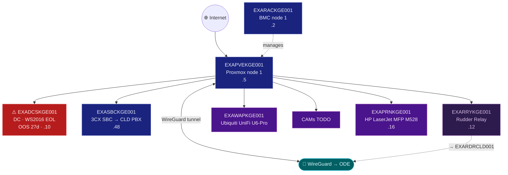
```mermaid
graph TD
    INET(("🌐 Internet"))
    RAC["EXARACKGE001<br/>BMC node 1<br/>.2"]
    PVE["EXAPVEKGE001<br/>Proxmox node 1<br/>.5"]
    DC["⚠️ EXADCSKGE001<br/>DC · WS2016 EOL<br/>OOS 27d · .10"]
    SBC["EXASBCKGE001<br/>3CX SBC → CLD PBX<br/>.48"]
    RRY["EXARRYKGE001<br/>Rudder Relay<br/>.12"]
    WAP["EXAWAPKGE001<br/>Ubiquiti UniFi U6-Pro"]
    CAM["CAMs TODO"]
    PRN["EXAPRNKGE001<br/>HP LaserJet MFP M528<br/>.16"]
    VPN(["🔗 WireGuard → ODE"])

    INET --> PVE --> DC & SBC
    RAC -.->|"manages"| PVE
    PVE --> WAP & CAM & PRN
    PVE <-->|"WireGuard tunnel"| VPN

    PVE --> RRY
    RRY -. "→ EXARDRCLD001" .-> VPN
    classDef srv fill:#1a237e,stroke:#7986cb,color:#e8eaf6
    classDef warn fill:#b71c1c,stroke:#ef9a9a,color:#ffebee
    classDef ep fill:#4a148c,stroke:#ba68c8,color:#f3e5f5
    classDef vpn fill:#006064,stroke:#4dd0e1,color:#e0f7fa
    classDef rudder fill:#2d1b4e,stroke:#a569bd,color:#d7bde2
    class PVE,SBC,RAC srv
    class RRY rudder
    class DC warn
    class WAP,CAM,PRN ep
    class VPN vpn
```

---

## FAX — Faxe

**LAN:** `192.168.246.0/24` · **Domain:** `example.net`  
**PVE nodes:** 1 · **VPN parent:** ODE

```mermaid
graph TD
    INET(("🌐 Internet"))
    RTR["EXARTRFAX001<br/>Cisco ISR 4331<br/>.254"]
    RAC["EXARACFAX001<br/>BMC node 1<br/>.2"]
    PVE["EXAPVEFAX001<br/>Proxmox node 1<br/>.5"]
    DC["EXADCSFAX001<br/>DC<br/>.10"]
    SBC["EXASBCFAX001<br/>3CX SBC → CLD PBX<br/>.48"]
    RRY["EXARRYFAX001<br/>Rudder Relay<br/>.12"]
    WAP["WAPs x2<br/>Ubiquiti UniFi U6-Pro"]
    CAM["CAMs TODO"]
    VPN(["🔗 WireGuard → ODE"])

    INET --> RTR --> PVE --> DC & SBC
    RAC -.->|"manages"| PVE
    RTR --> WAP & CAM
    RTR <-->|"WireGuard tunnel"| VPN

    PVE --> RRY
    RRY -. "→ EXARDRCLD001" .-> VPN
    classDef net fill:#880e4f,stroke:#f48fb1,color:#fce4ec
    classDef srv fill:#1a237e,stroke:#7986cb,color:#e8eaf6
    classDef ep fill:#4a148c,stroke:#ba68c8,color:#f3e5f5
    classDef vpn fill:#006064,stroke:#4dd0e1,color:#e0f7fa
    classDef rudder fill:#2d1b4e,stroke:#a569bd,color:#d7bde2
    class RTR net
    class PVE,DC,SBC,RAC srv
    class RRY rudder
    class WAP,CAM ep
    class VPN vpn
```

---

## KOR — Korsør

**LAN:** `192.168.238.0/24` · **Domain:** `example.net`  
**PVE nodes:** 1 · **VPN parent:** ODE

```mermaid
graph TD
    INET(("🌐 Internet"))
    RAC["EXARACKOR001<br/>BMC node 1<br/>.2"]
    PVE["EXAPVEKOR001<br/>Proxmox node 1<br/>.5"]
    DC["EXADCSKOR001<br/>DC<br/>.10"]
    SBC["EXASBCKOR001<br/>3CX SBC → CLD PBX<br/>.48"]
    RRY["EXARRYKOR001<br/>Rudder Relay<br/>.12"]
    WAP["WAPs TODO<br/>Ubiquiti UniFi U6-Pro"]
    CAM["CAMs TODO"]
    VPN(["🔗 WireGuard → ODE"])

    INET --> PVE --> DC & SBC
    RAC -.->|"manages"| PVE
    PVE --> WAP & CAM
    PVE <-->|"WireGuard tunnel"| VPN

    PVE --> RRY
    RRY -. "→ EXARDRCLD001" .-> VPN
    classDef srv fill:#1a237e,stroke:#7986cb,color:#e8eaf6
    classDef ep fill:#4a148c,stroke:#ba68c8,color:#f3e5f5
    classDef vpn fill:#006064,stroke:#4dd0e1,color:#e0f7fa
    classDef rudder fill:#2d1b4e,stroke:#a569bd,color:#d7bde2
    class PVE,DC,SBC,RAC srv
    class RRY rudder
    class WAP,CAM ep
    class VPN vpn
```

---

## AAR — Aarhus

**LAN:** `192.168.86.0/24` · **Domain:** `example.net`  
**PVE nodes:** 1 · **VPN parent:** ODE

```mermaid
graph TD
    INET(("🌐 Internet"))
    RAC["EXARACAAR001<br/>BMC node 1<br/>.2"]
    PVE["EXAPVEAAR001<br/>Proxmox node 1<br/>.5"]
    DC["EXADCSAAR001<br/>DC<br/>.10"]
    SBC["EXASBCAAR001<br/>3CX SBC → CLD PBX<br/>.48"]
    RRY["EXARRYAAR001<br/>Rudder Relay<br/>.12"]
    WAP["WAPs TODO<br/>Ubiquiti UniFi U6-Pro"]
    CAM["CAMs TODO"]
    VPN(["🔗 WireGuard → ODE"])

    INET --> PVE --> DC & SBC
    RAC -.->|"manages"| PVE
    PVE --> WAP & CAM
    PVE <-->|"WireGuard tunnel"| VPN

    PVE --> RRY
    RRY -. "→ EXARDRCLD001" .-> VPN
    classDef srv fill:#1a237e,stroke:#7986cb,color:#e8eaf6
    classDef ep fill:#4a148c,stroke:#ba68c8,color:#f3e5f5
    classDef vpn fill:#006064,stroke:#4dd0e1,color:#e0f7fa
    classDef rudder fill:#2d1b4e,stroke:#a569bd,color:#d7bde2
    class PVE,DC,SBC,RAC srv
    class RRY rudder
    class WAP,CAM ep
    class VPN vpn
```

---

## FRE — Fredericia

**LAN:** `192.168.75.0/24` · **Domain:** `example.net`  
**PVE nodes:** 1 · **VPN parent:** ODE

```mermaid
graph TD
    INET(("🌐 Internet"))
    RAC["EXARACFRE001<br/>BMC node 1<br/>.2"]
    PVE["EXAPVEFRE001<br/>Proxmox node 1<br/>.5"]
    DC["EXADCSFRE001<br/>DC<br/>.10"]
    SBC["EXASBCFRE001<br/>3CX SBC → CLD PBX<br/>.48"]
    RRY["EXARRYFRE001<br/>Rudder Relay<br/>.12"]
    WAP["WAPs TODO<br/>Ubiquiti UniFi U6-Pro"]
    CAM["CAMs TODO"]
    VPN(["🔗 WireGuard → ODE"])

    INET --> PVE --> DC & SBC
    RAC -.->|"manages"| PVE
    PVE --> WAP & CAM
    PVE <-->|"WireGuard tunnel"| VPN

    PVE --> RRY
    RRY -. "→ EXARDRCLD001" .-> VPN
    classDef srv fill:#1a237e,stroke:#7986cb,color:#e8eaf6
    classDef ep fill:#4a148c,stroke:#ba68c8,color:#f3e5f5
    classDef vpn fill:#006064,stroke:#4dd0e1,color:#e0f7fa
    classDef rudder fill:#2d1b4e,stroke:#a569bd,color:#d7bde2
    class PVE,DC,SBC,RAC srv
    class RRY rudder
    class WAP,CAM ep
    class VPN vpn
```

---

---

## 🇩🇪 Deutschland

---

## BON — Bonn

**LAN:** `192.168.228.0/24` · **Domain:** `example.net`  
**PVE nodes:** 1 · **VPN parent:** ODE  
**Note:** Hosts Schema Master + Domain Naming Master

```mermaid
graph TD
    INET(("🌐 Internet"))
    SW["EXASWIBON001<br/>Cisco 2960X<br/>.250"]
    RTR["EXARTRBON001<br/>Cisco ISR 4331<br/>.254"]
    RAC["EXARACBON001<br/>Dell iDRAC9<br/>.2"]
    PVE["EXAPVEBON001<br/>Proxmox node 1<br/>.5"]
    DC["EXADCSBON001<br/>DC · Schema Master<br/>DN Master · .10"]
    SBC["EXASBCBON001<br/>3CX SBC → CLD PBX<br/>.48"]
    RRY["EXARRYBON001<br/>Rudder Relay<br/>.12"]
    WKS["EXAWKSBON001<br/>Finance WKS · .151"]
    LAP1["EXALAPBON001<br/>ThinkPad ⚠️ disabled<br/>.150"]
    LAP2["EXALAPBON002<br/>Finance Laptop · .153"]
    VCU["EXAVCUBON001<br/>Poly Studio X70<br/>Boardroom · .2"]
    CAM["EXACAMBON001<br/>Axis P3245-LVE CCTV<br/>.17"]
    TV["EXATVSBON001<br/>Samsung 65in<br/>.18"]
    WAP["WAPs x2<br/>Ubiquiti UniFi U6-Pro"]
    VPN(["🔗 WireGuard → ODE"])

    INET --> RTR --> SW
    SW --> PVE --> DC & SBC
    RAC -.->|"manages"| PVE
    SW --> WKS & LAP1 & LAP2 & VCU & CAM & TV & WAP
    RTR <-->|"WireGuard tunnel"| VPN

    SW --> RRY
    RRY -. "→ EXARDRCLD001" .-> VPN
    classDef net fill:#bf360c,stroke:#ff8a65,color:#fbe9e7
    classDef srv fill:#1a237e,stroke:#7986cb,color:#e8eaf6
    classDef ep fill:#4a148c,stroke:#ba68c8,color:#f3e5f5
    classDef site fill:#880e4f,stroke:#f48fb1,color:#fce4ec
    classDef warn fill:#b71c1c,stroke:#ef9a9a,color:#ffebee
    classDef vpn fill:#006064,stroke:#4dd0e1,color:#e0f7fa
    classDef rudder fill:#2d1b4e,stroke:#a569bd,color:#d7bde2
    class SW,RTR net
    class PVE,DC,SBC,RAC srv
    class RRY rudder
    class WKS,LAP2,WAP ep
    class VCU,CAM,TV site
    class LAP1 warn
    class VPN vpn
```

---

## BER — West Berlin

**LAN:** `192.168.113.0/24` · **Domain:** `example.net`  
**PVE nodes:** 1 · **VPN parent:** ODE

```mermaid
graph TD
    INET(("🌐 Internet"))
    RTR["EXARTRBER001<br/>Cisco ISR 4331<br/>.254"]
    RAC["EXARACBER001<br/>BMC node 1<br/>.2"]
    PVE["EXAPVEBER001<br/>Proxmox node 1<br/>.5"]
    DC["EXADCSBER001<br/>DC · PDC Emulator<br/>RID/Infra Master WS2019 · .10"]
    SBC["EXASBCBER001<br/>3CX SBC → CLD PBX<br/>.48"]
    RRY["EXARRYBER001<br/>Rudder Relay<br/>.12"]
    SRV["EXASRVBER001<br/>WS2019 Legacy App Server<br/>.21"]
    NIX["EXANIXBER001<br/>Debian 12 Server<br/>.22"]
    WAP["WAPs x2<br/>Ubiquiti UniFi U6-Pro"]
    CAM["CAMs TODO"]
    VPN(["🔗 WireGuard → ODE"])

    INET --> RTR --> PVE --> DC & SBC & SRV & NIX
    RAC -.->|"manages"| PVE
    RTR --> WAP & CAM
    RTR <-->|"WireGuard tunnel"| VPN

    PVE --> RRY
    RRY -. "→ EXARDRCLD001" .-> VPN
    classDef net fill:#bf360c,stroke:#ff8a65,color:#fbe9e7
    classDef srv fill:#1a237e,stroke:#7986cb,color:#e8eaf6
    classDef ep fill:#4a148c,stroke:#ba68c8,color:#f3e5f5
    classDef vpn fill:#006064,stroke:#4dd0e1,color:#e0f7fa
    classDef rudder fill:#2d1b4e,stroke:#a569bd,color:#d7bde2
    class RTR net
    class PVE,DC,SBC,SRV,NIX,RAC srv
    class RRY rudder
    class WAP,CAM ep
    class VPN vpn
```

---

## MUN — Munich

**LAN:** `192.168.189.0/24` · **Domain:** `example.net`  
**PVE nodes:** 1 · **VPN parent:** ODE

```mermaid
graph TD
    INET(("🌐 Internet"))
    SW["EXASWIMUN001<br/>Cisco 9200<br/>.250"]
    RAC["EXARACMUN001<br/>HPE iLO5<br/>.2"]
    PVE["EXAPVEMUN001<br/>Proxmox node 1<br/>.5"]
    DC["EXADCSMUN001<br/>DC<br/>.10"]
    SBC["EXASBCMUN001<br/>3CX SBC → CLD PBX<br/>.48"]
    RRY["EXARRYMUN001<br/>Rudder Relay<br/>.12"]
    WKS["EXAWKSMUN001<br/>Hot Desk WKS<br/>.150"]
    LAP1["EXALAPMUN001<br/>Pool Laptop<br/>.151"]
    LAP2["⚠️ EXALAPMUN002<br/>Pool Laptop<br/>LAPS expired 61d · .152"]
    WAP["WAPs TODO<br/>Ubiquiti UniFi U6-Pro"]
    CAM["CAMs TODO"]
    VPN(["🔗 WireGuard → ODE"])

    INET --> SW
    SW --> PVE --> DC & SBC
    RAC -.->|"manages"| PVE
    SW --> WKS & LAP1 & LAP2 & WAP & CAM
    SW <-->|"WireGuard tunnel"| VPN

    SW --> RRY
    RRY -. "→ EXARDRCLD001" .-> VPN
    classDef net fill:#bf360c,stroke:#ff8a65,color:#fbe9e7
    classDef srv fill:#1a237e,stroke:#7986cb,color:#e8eaf6
    classDef ep fill:#4a148c,stroke:#ba68c8,color:#f3e5f5
    classDef warn fill:#b71c1c,stroke:#ef9a9a,color:#ffebee
    classDef vpn fill:#006064,stroke:#4dd0e1,color:#e0f7fa
    classDef rudder fill:#2d1b4e,stroke:#a569bd,color:#d7bde2
    class SW net
    class PVE,DC,SBC,RAC srv
    class RRY rudder
    class WKS,LAP1,WAP,CAM ep
    class LAP2 warn
    class VPN vpn
```

---

## DRS — Dresden

**LAN:** `192.168.153.0/24` · **Domain:** `example.net`  
**PVE nodes:** 1 · **VPN parent:** ODE

```mermaid
graph TD
    INET(("🌐 Internet"))
    RAC["EXARACDRS001<br/>BMC node 1<br/>.2"]
    PVE["EXAPVEDRS001<br/>Proxmox node 1<br/>.5"]
    DC["EXADCSDRS001<br/>DC<br/>.10"]
    SBC["EXASBCDRS001<br/>3CX SBC → CLD PBX<br/>.48"]
    RRY["EXARRYDRS001<br/>Rudder Relay<br/>.12"]
    WAP["WAPs TODO<br/>Ubiquiti UniFi U6-Pro"]
    CAM["CAMs TODO"]
    VPN(["🔗 WireGuard → ODE"])

    INET --> PVE --> DC & SBC
    RAC -.->|"manages"| PVE
    PVE --> WAP & CAM
    PVE <-->|"WireGuard tunnel"| VPN

    PVE --> RRY
    RRY -. "→ EXARDRCLD001" .-> VPN
    classDef srv fill:#1a237e,stroke:#7986cb,color:#e8eaf6
    classDef ep fill:#4a148c,stroke:#ba68c8,color:#f3e5f5
    classDef vpn fill:#006064,stroke:#4dd0e1,color:#e0f7fa
    classDef rudder fill:#2d1b4e,stroke:#a569bd,color:#d7bde2
    class PVE,DC,SBC,RAC srv
    class RRY rudder
    class WAP,CAM ep
    class VPN vpn
```

---

## DUS — Düsseldorf

**LAN:** `192.168.211.0/24` · **Domain:** `example.net`  
**PVE nodes:** 1 · **VPN parent:** ODE

```mermaid
graph TD
    INET(("🌐 Internet"))
    RAC["EXARACDUS001<br/>BMC node 1<br/>.2"]
    PVE["EXAPVEDUS001<br/>Proxmox node 1<br/>.5"]
    DC["EXADCSDUS001<br/>DC<br/>.10"]
    SBC["EXASBCDUS001<br/>3CX SBC → CLD PBX<br/>.48"]
    RRY["EXARRYDUS001<br/>Rudder Relay<br/>.12"]
    WAP["WAPs TODO<br/>Ubiquiti UniFi U6-Pro"]
    CAM["CAMs TODO"]
    VPN(["🔗 WireGuard → ODE"])

    INET --> PVE --> DC & SBC
    RAC -.->|"manages"| PVE
    PVE --> WAP & CAM
    PVE <-->|"WireGuard tunnel"| VPN

    PVE --> RRY
    RRY -. "→ EXARDRCLD001" .-> VPN
    classDef srv fill:#1a237e,stroke:#7986cb,color:#e8eaf6
    classDef ep fill:#4a148c,stroke:#ba68c8,color:#f3e5f5
    classDef vpn fill:#006064,stroke:#4dd0e1,color:#e0f7fa
    classDef rudder fill:#2d1b4e,stroke:#a569bd,color:#d7bde2
    class PVE,DC,SBC,RAC srv
    class RRY rudder
    class WAP,CAM ep
    class VPN vpn
```

---

---

## 🇸🇪 Sverige

---

## GOT — Gothenburg

**LAN:** `192.168.46.0/24` · **Domain:** `example.net`  
**PVE nodes:** 1 · **VPN parent:** ODE

```mermaid
graph TD
    INET(("🌐 Internet"))
    RAC["EXARACGOT001<br/>BMC node 1<br/>.2"]
    PVE["EXAPVEGOT001<br/>Proxmox node 1<br/>.5"]
    DC["EXADCSGOT001<br/>DC<br/>.10"]
    SBC["EXASBCGOT001<br/>3CX SBC → CLD PBX<br/>.48"]
    RRY["EXARRYGOT001<br/>Rudder Relay<br/>.12"]
    WAP["WAPs TODO<br/>Ubiquiti UniFi U6-Pro"]
    CAM["CAMs TODO"]
    VPN(["🔗 WireGuard → ODE"])

    INET --> PVE --> DC & SBC
    RAC -.->|"manages"| PVE
    PVE --> WAP & CAM
    PVE <-->|"WireGuard tunnel"| VPN

    PVE --> RRY
    RRY -. "→ EXARDRCLD001" .-> VPN
    classDef srv fill:#1a237e,stroke:#7986cb,color:#e8eaf6
    classDef ep fill:#4a148c,stroke:#ba68c8,color:#f3e5f5
    classDef vpn fill:#006064,stroke:#4dd0e1,color:#e0f7fa
    classDef rudder fill:#2d1b4e,stroke:#a569bd,color:#d7bde2
    class PVE,DC,SBC,RAC srv
    class RRY rudder
    class WAP,CAM ep
    class VPN vpn
```

---

---

## 🇳🇴 Norge

---

## OSL — Oslo

**LAN:** `192.168.47.0/24` · **Domain:** `example.net`  
**PVE nodes:** 1 · **VPN parent:** ODE

```mermaid
graph TD
    INET(("🌐 Internet"))
    RAC["EXARACOSL001<br/>BMC node 1<br/>.2"]
    PVE["EXAPVEOSL001<br/>Proxmox node 1<br/>.5"]
    DC["EXADCSOSL001<br/>DC<br/>.10"]
    SBC["EXASBCOSL001<br/>3CX SBC → CLD PBX<br/>.48"]
    RRY["EXARRYOSL001<br/>Rudder Relay<br/>.12"]
    WAP["WAPs TODO<br/>Ubiquiti UniFi U6-Pro"]
    CAM["CAMs TODO"]
    VPN(["🔗 WireGuard → ODE"])

    INET --> PVE --> DC & SBC
    RAC -.->|"manages"| PVE
    PVE --> WAP & CAM
    PVE <-->|"WireGuard tunnel"| VPN

    PVE --> RRY
    RRY -. "→ EXARDRCLD001" .-> VPN
    classDef srv fill:#1a237e,stroke:#7986cb,color:#e8eaf6
    classDef ep fill:#4a148c,stroke:#ba68c8,color:#f3e5f5
    classDef vpn fill:#006064,stroke:#4dd0e1,color:#e0f7fa
    classDef rudder fill:#2d1b4e,stroke:#a569bd,color:#d7bde2
    class PVE,DC,SBC,RAC srv
    class RRY rudder
    class WAP,CAM ep
    class VPN vpn
```

---

---

## 🇳🇱 Nederland

---

## AMS — Amsterdam

**LAN:** `192.168.31.0/24` · **Domain:** `example.net`  
**PVE nodes:** 1 · **VPN parent:** ODE

```mermaid
graph TD
    INET(("🌐 Internet"))
    RAC["EXARACAMS001<br/>BMC node 1<br/>.2"]
    PVE["EXAPVEAMS001<br/>Proxmox node 1<br/>.5"]
    DC["EXADCSAMS001<br/>DC<br/>.10"]
    SBC["EXASBCAMS001<br/>3CX SBC → CLD PBX<br/>.48"]
    RRY["EXARRYAMS001<br/>Rudder Relay<br/>.12"]
    WAP["WAPs TODO<br/>Ubiquiti UniFi U6-Pro"]
    CAM["CAMs TODO"]
    VPN(["🔗 WireGuard → ODE"])

    INET --> PVE --> DC & SBC
    RAC -.->|"manages"| PVE
    PVE --> WAP & CAM
    PVE <-->|"WireGuard tunnel"| VPN

    PVE --> RRY
    RRY -. "→ EXARDRCLD001" .-> VPN
    classDef srv fill:#1a237e,stroke:#7986cb,color:#e8eaf6
    classDef ep fill:#4a148c,stroke:#ba68c8,color:#f3e5f5
    classDef vpn fill:#006064,stroke:#4dd0e1,color:#e0f7fa
    classDef rudder fill:#2d1b4e,stroke:#a569bd,color:#d7bde2
    class PVE,DC,SBC,RAC srv
    class RRY rudder
    class WAP,CAM ep
    class VPN vpn
```

---

---

## 🇮🇹 Italia

---

## MIL — Milan

**LAN:** `192.168.39.0/24` · **Domain:** `example.net`  
**PVE nodes:** 1 · **VPN parent:** ODE

```mermaid
graph TD
    INET(("🌐 Internet"))
    RAC["EXARACMIL001<br/>BMC node 1<br/>.2"]
    PVE["EXAPVEMIL001<br/>Proxmox node 1<br/>.5"]
    DC["EXADCSMIL001<br/>DC<br/>.10"]
    SBC["EXASBCMIL001<br/>3CX SBC → CLD PBX<br/>.48"]
    RRY["EXARRYMIL001<br/>Rudder Relay<br/>.12"]
    WAP["WAPs TODO<br/>Ubiquiti UniFi U6-Pro"]
    CAM["CAMs TODO"]
    VPN(["🔗 WireGuard → ODE"])

    INET --> PVE --> DC & SBC
    RAC -.->|"manages"| PVE
    PVE --> WAP & CAM
    PVE <-->|"WireGuard tunnel"| VPN

    PVE --> RRY
    RRY -. "→ EXARDRCLD001" .-> VPN
    classDef srv fill:#1a237e,stroke:#7986cb,color:#e8eaf6
    classDef ep fill:#4a148c,stroke:#ba68c8,color:#f3e5f5
    classDef vpn fill:#006064,stroke:#4dd0e1,color:#e0f7fa
    classDef rudder fill:#2d1b4e,stroke:#a569bd,color:#d7bde2
    class PVE,DC,SBC,RAC srv
    class RRY rudder
    class WAP,CAM ep
    class VPN vpn
```

---

---

## 🇦🇹 Österreich

---

## VIE — Vienna

**LAN:** `192.168.78.0/24` · **Domain:** `example.net`  
**PVE nodes:** 1 · **VPN parent:** ODE

```mermaid
graph TD
    INET(("🌐 Internet"))
    RAC["EXARACVIE001<br/>BMC node 1<br/>.2"]
    PVE["EXAPVEVIE001<br/>Proxmox node 1<br/>.5"]
    DC["EXADCSVIE001<br/>DC<br/>.10"]
    SBC["EXASBCVIE001<br/>3CX SBC → CLD PBX<br/>.48"]
    RRY["EXARRYVIE001<br/>Rudder Relay<br/>.12"]
    WAP["WAPs TODO<br/>Ubiquiti UniFi U6-Pro"]
    CAM["CAMs TODO"]
    VPN(["🔗 WireGuard → ODE"])

    INET --> PVE --> DC & SBC
    RAC -.->|"manages"| PVE
    PVE --> WAP & CAM
    PVE <-->|"WireGuard tunnel"| VPN

    PVE --> RRY
    RRY -. "→ EXARDRCLD001" .-> VPN
    classDef srv fill:#1a237e,stroke:#7986cb,color:#e8eaf6
    classDef ep fill:#4a148c,stroke:#ba68c8,color:#f3e5f5
    classDef vpn fill:#006064,stroke:#4dd0e1,color:#e0f7fa
    classDef rudder fill:#2d1b4e,stroke:#a569bd,color:#d7bde2
    class PVE,DC,SBC,RAC srv
    class RRY rudder
    class WAP,CAM ep
    class VPN vpn
```

---

---

## 🇱🇧 Lebanon

---

## BRT — Beirut

**LAN:** `192.168.169.0/24` · **Domain:** `example.net`  
**PVE nodes:** 1 · **VPN parent:** ODE

```mermaid
graph TD
    INET(("🌐 Internet"))
    RAC["EXARACBRT001<br/>BMC node 1<br/>.2"]
    PVE["EXAPVEBRT001<br/>Proxmox node 1<br/>.5"]
    DC["EXADCSBRT001<br/>DC<br/>.10"]
    SBC["EXASBCBRT001<br/>3CX SBC → CLD PBX<br/>.48"]
    RRY["EXARRYBRT001<br/>Rudder Relay<br/>.12"]
    WAP["WAPs TODO<br/>Ubiquiti UniFi U6-Pro"]
    CAM["CAMs TODO"]
    VPN(["🔗 WireGuard → ODE"])

    INET --> PVE --> DC & SBC
    RAC -.->|"manages"| PVE
    PVE --> WAP & CAM
    PVE <-->|"WireGuard tunnel"| VPN

    PVE --> RRY
    RRY -. "→ EXARDRCLD001" .-> VPN
    classDef srv fill:#1a237e,stroke:#7986cb,color:#e8eaf6
    classDef ep fill:#4a148c,stroke:#ba68c8,color:#f3e5f5
    classDef vpn fill:#006064,stroke:#4dd0e1,color:#e0f7fa
    classDef rudder fill:#2d1b4e,stroke:#a569bd,color:#d7bde2
    class PVE,DC,SBC,RAC srv
    class RRY rudder
    class WAP,CAM ep
    class VPN vpn
```

---

---

## 🇨🇦 Canada

---

## BRK — Brockville *(NA/APAC Hub)* ⭐

**LAN:** `192.168.136.0/24` · **Domain:** `example.net`  
**PVE nodes:** 3 (NA/APAC hub) · **VPN parent:** CLD (NA/APAC backup)  
> ⚠️ `EXADCSBRK001` — DNS, Netlogon and KDC services stopped.

```mermaid
graph TD
    INET(("🌐 Internet"))
    RTR["EXARTRBRK001<br/>Cisco ISR 4331<br/>.254"]

    subgraph BMC ["BMC Pool"]
        RAC1["EXARACBRK001<br/>BMC node 1<br/>.2"]
        RAC2["EXARACBRK002<br/>BMC node 2<br/>.3"]
        RAC3["EXARACBRK003<br/>BMC node 3<br/>.4"]
    end

    subgraph PVE ["Proxmox Cluster (3-node)"]
        PVE1["EXAPVEBRK001<br/>Proxmox node 1<br/>.5"]
        PVE2["EXAPVEBRK002<br/>Proxmox node 2<br/>.6"]
        PVE3["EXAPVEBRK003<br/>Proxmox node 3<br/>.7"]
    end

    DC["🔴 EXADCSBRK001<br/>DC · Services stopped<br/>.10"]
    SBC["EXASBCBRK001<br/>3CX SBC → CLD PBX<br/>.48"]
    RRY["EXARRYBRK001<br/>Rudder Relay<br/>.12"]
    LAP["EXALAPBRK001<br/>Win11 Tour Laptop<br/>.21"]
    WAP["EXAWAPBRK001<br/>Ubiquiti UniFi U6-Pro"]
    CAM["CAMs TODO"]
    VND1["EXADONBRK001<br/>Tim Hortons Donut Vending<br/>.60"]
    VND2["EXAVNDBRK001<br/>Maple Syrup Vending<br/>.61"]
    VPN_CLD(["🔗 WireGuard ← CLD<br/>NA/APAC backup"])
    VPN_NA(["🔗 WireGuard → NA/APAC spokes<br/>TOR/MTL/LAX/NYC/NJC<br/>MIA/ATL/CHI/SYD/MEL/AKL"])

    INET --> RTR
    RTR --> PVE1 & PVE2 & PVE3
    RTR --> DC & SBC
    RAC1 -.->|"manages"| PVE1
    RAC2 -.->|"manages"| PVE2
    RAC3 -.->|"manages"| PVE3
    RTR --> LAP & WAP & CAM & VND1 & VND2
    RTR <-->|"WireGuard tunnel"| VPN_CLD
    RTR -->|"WireGuard spokes"| VPN_NA

    PVE1 --> RRY
    RRY -. "→ EXARDRCLD001" .-> VPN_CLD
    classDef net fill:#0d3b2e,stroke:#66bb6a,color:#e8f5e9
    classDef srv fill:#1a237e,stroke:#7986cb,color:#e8eaf6
    classDef warn fill:#b71c1c,stroke:#ef9a9a,color:#ffebee
    classDef ep fill:#4a148c,stroke:#ba68c8,color:#f3e5f5
    classDef site fill:#880e4f,stroke:#f48fb1,color:#fce4ec
    classDef bmc fill:#bf360c,stroke:#ff8a65,color:#fbe9e7
    classDef vpn fill:#006064,stroke:#4dd0e1,color:#e0f7fa
    classDef rudder fill:#2d1b4e,stroke:#a569bd,color:#d7bde2
    class RTR net
    class PVE1,PVE2,PVE3,SBC srv
    class RRY rudder
    class DC warn
    class LAP,WAP,CAM ep
    class VND1,VND2 site
    class RAC1,RAC2,RAC3 bmc
    class VPN_CLD,VPN_NA vpn
```

---

## TOR — Toronto ⚠️

**LAN:** `192.168.146.0/24` · **Domain:** `example.net`  
**PVE nodes:** 1 · **VPN parent:** BRK  
> ⚠️ `EXADCSTOR001` — DNS, Netlogon and KDC services stopped.

```mermaid
graph TD
    INET(("🌐 Internet"))
    RAC["EXARACTOR001<br/>BMC node 1<br/>.2"]
    PVE["EXAPVETOR001<br/>Proxmox node 1<br/>.5"]
    DC["🔴 EXADCSTOR001<br/>DC · Services stopped<br/>.10"]
    SBC["EXASBCTOR001<br/>3CX SBC → CLD PBX<br/>.48"]
    RRY["EXARRYTOR001<br/>Rudder Relay<br/>.12"]
    WAP["WAPs TODO<br/>Ubiquiti UniFi U6-Pro"]
    CAM["CAMs TODO"]
    VPN(["🔗 WireGuard → BRK"])

    INET --> PVE --> DC & SBC
    RAC -.->|"manages"| PVE
    PVE --> WAP & CAM
    PVE <-->|"WireGuard tunnel"| VPN

    PVE --> RRY
    RRY -. "→ EXARDRCLD001" .-> VPN
    classDef srv fill:#1a237e,stroke:#7986cb,color:#e8eaf6
    classDef warn fill:#b71c1c,stroke:#ef9a9a,color:#ffebee
    classDef ep fill:#4a148c,stroke:#ba68c8,color:#f3e5f5
    classDef vpn fill:#006064,stroke:#4dd0e1,color:#e0f7fa
    classDef rudder fill:#2d1b4e,stroke:#a569bd,color:#d7bde2
    class PVE,SBC,RAC srv
    class RRY rudder
    class DC warn
    class WAP,CAM ep
    class VPN vpn
```

---

## MTL — Montreal

**LAN:** `192.168.154.0/24` · **Domain:** `example.net`  
**PVE nodes:** 1 · **VPN parent:** BRK

```mermaid
graph TD
    INET(("🌐 Internet"))
    RAC["EXARACMTL001<br/>BMC node 1<br/>.2"]
    PVE["EXAPVEMTL001<br/>Proxmox node 1<br/>.5"]
    DC["EXADCSMTL001<br/>DC<br/>.10"]
    SBC["EXASBCMTL001<br/>3CX SBC → CLD PBX<br/>.48"]
    RRY["EXARRYMTL001<br/>Rudder Relay<br/>.12"]
    WAP["WAPs TODO<br/>Ubiquiti UniFi U6-Pro"]
    CAM["CAMs TODO"]
    VPN(["🔗 WireGuard → BRK"])

    INET --> PVE --> DC & SBC
    RAC -.->|"manages"| PVE
    PVE --> WAP & CAM
    PVE <-->|"WireGuard tunnel"| VPN

    PVE --> RRY
    RRY -. "→ EXARDRCLD001" .-> VPN
    classDef srv fill:#1a237e,stroke:#7986cb,color:#e8eaf6
    classDef ep fill:#4a148c,stroke:#ba68c8,color:#f3e5f5
    classDef vpn fill:#006064,stroke:#4dd0e1,color:#e0f7fa
    classDef rudder fill:#2d1b4e,stroke:#a569bd,color:#d7bde2
    class PVE,DC,SBC,RAC srv
    class RRY rudder
    class WAP,CAM ep
    class VPN vpn
```

---

---

## 🇺🇸 United States

---

## LAX — Los Angeles ⚠️

**LAN:** `192.168.213.0/24` · **Domain:** `example.net`  
**PVE nodes:** 1 · **VPN parent:** BRK  
> ⚠️ `EXADCSLAX001` — DNS, Netlogon and KDC services stopped.

```mermaid
graph TD
    INET(("🌐 Internet"))
    FWL["EXAFWLLAX001<br/>Palo Alto PAN-OS 10.x<br/>.1"]
    SW1["EXASWILAX001<br/>Cisco 9300<br/>.250"]
    SW2["EXASWILAX002<br/>Cisco 2960<br/>.251"]
    RTR["EXARTRLAX001<br/>Cisco ISR 4331<br/>.254"]
    RAC["EXARACLAX001<br/>Dell iDRAC9<br/>.2"]
    PVE["EXAPVELAX001<br/>Proxmox node 1<br/>.5"]
    DC["🔴 EXADCSLAX001<br/>DC · Services stopped<br/>.10"]
    SRV["EXASRVLAX001<br/>Rocky Linux · Local services/DB<br/>.20"]
    SBC["EXASBCLAX001<br/>3CX SBC → CLD PBX<br/>.48"]
    RRY["EXARRYLAX001<br/>Rudder Relay<br/>.12"]
    MBP["EXAMBPLAX001<br/>MacBook Pro<br/>.41"]
    TAB["EXATABLAX001<br/>iPad · Setlists<br/>.61"]
    PHN["EXAPHNLAX001<br/>Android Phone"]
    WAP["WAPs x3<br/>Ubiquiti UniFi U6-Pro"]
    CAM["CAMs TODO"]
    MOO["EXAMUSLAX001<br/>Moog One Synthesizer<br/>.70"]
    LIN["EXAMUSLAX002<br/>LinnDrum LM-2<br/>.71"]
    FCL["EXAMUSLAX003<br/>Fairlight CMI IIx<br/>.72"]
    AST["EXATTYLAX001<br/>Atari ST · MIDI<br/>.73"]
    PAY["EXAPAYLAX001<br/>Lobby Payphone<br/>.74"]
    LCD["EXALCDLAX001<br/>NEC PlasmaSync Display<br/>.75"]
    VPN(["🔗 WireGuard → BRK"])

    INET --> RTR --> FWL --> SW1 & SW2
    SW1 --> PVE --> DC & SRV & SBC
    RAC -.->|"manages"| PVE
    SW2 --> MBP & TAB & PHN & WAP & CAM
    SW2 --> MOO & LIN & FCL & AST & PAY & LCD
    FWL <-->|"WireGuard tunnel"| VPN

    SW1 --> RRY
    RRY -. "→ EXARDRCLD001" .-> VPN
    classDef net fill:#1b5e20,stroke:#81c784,color:#f1f8e9
    classDef srv fill:#1a237e,stroke:#7986cb,color:#e8eaf6
    classDef warn fill:#b71c1c,stroke:#ef9a9a,color:#ffebee
    classDef ep fill:#4a148c,stroke:#ba68c8,color:#f3e5f5
    classDef site fill:#880e4f,stroke:#f48fb1,color:#fce4ec
    classDef vpn fill:#006064,stroke:#4dd0e1,color:#e0f7fa
    classDef rudder fill:#2d1b4e,stroke:#a569bd,color:#d7bde2
    class FWL,SW1,SW2,RTR net
    class PVE,SRV,SBC,RAC srv
    class RRY rudder
    class DC warn
    class MBP,TAB,PHN,WAP,CAM ep
    class MOO,LIN,FCL,AST,PAY,LCD site
    class VPN vpn
```

---

## NYC — New York ⚠️

**LAN:** `192.168.212.0/24` · **Domain:** `example.net`  
**PVE nodes:** 1 · **VPN parent:** BRK  
> ⚠️ `EXADCSNYC001` — DNS, Netlogon and KDC services stopped.

```mermaid
graph TD
    INET(("🌐 Internet"))
    RAC["EXARACNYC001<br/>BMC node 1<br/>.2"]
    PVE["EXAPVENYC001<br/>Proxmox node 1<br/>.5"]
    DC["🔴 EXADCSNYC001<br/>DC · Services stopped<br/>.10"]
    SBC["EXASBCNYC001<br/>3CX SBC → CLD PBX<br/>.48"]
    RRY["EXARRYNYC001<br/>Rudder Relay<br/>.12"]
    WAP["WAPs TODO<br/>Ubiquiti UniFi U6-Pro"]
    CAM["CAMs TODO"]
    VPN(["🔗 WireGuard → BRK"])

    INET --> PVE --> DC & SBC
    RAC -.->|"manages"| PVE
    PVE --> WAP & CAM
    PVE <-->|"WireGuard tunnel"| VPN

    PVE --> RRY
    RRY -. "→ EXARDRCLD001" .-> VPN
    classDef srv fill:#1a237e,stroke:#7986cb,color:#e8eaf6
    classDef warn fill:#b71c1c,stroke:#ef9a9a,color:#ffebee
    classDef ep fill:#4a148c,stroke:#ba68c8,color:#f3e5f5
    classDef vpn fill:#006064,stroke:#4dd0e1,color:#e0f7fa
    classDef rudder fill:#2d1b4e,stroke:#a569bd,color:#d7bde2
    class PVE,SBC,RAC srv
    class RRY rudder
    class DC warn
    class WAP,CAM ep
    class VPN vpn
```

---

## NJC — New Jersey ⚠️

**LAN:** `192.168.201.0/24` · **Domain:** `example.net`  
**PVE nodes:** 1 · **VPN parent:** BRK  
> ⚠️ `EXADCSNJC001` — DNS, Netlogon and KDC services stopped.

```mermaid
graph TD
    INET(("🌐 Internet"))
    RAC["EXARACNJC001<br/>BMC node 1<br/>.2"]
    PVE["EXAPVENJC001<br/>Proxmox node 1<br/>.5"]
    DC["🔴 EXADCSNJC001<br/>DC · Services stopped<br/>.10"]
    SBC["EXASBCNJC001<br/>3CX SBC → CLD PBX<br/>.48"]
    RRY["EXARRYNJC001<br/>Rudder Relay<br/>.12"]
    WAP["WAPs TODO<br/>Ubiquiti UniFi U6-Pro"]
    CAM["CAMs TODO"]
    VPN(["🔗 WireGuard → BRK"])

    INET --> PVE --> DC & SBC
    RAC -.->|"manages"| PVE
    PVE --> WAP & CAM
    PVE <-->|"WireGuard tunnel"| VPN

    PVE --> RRY
    RRY -. "→ EXARDRCLD001" .-> VPN
    classDef srv fill:#1a237e,stroke:#7986cb,color:#e8eaf6
    classDef warn fill:#b71c1c,stroke:#ef9a9a,color:#ffebee
    classDef ep fill:#4a148c,stroke:#ba68c8,color:#f3e5f5
    classDef vpn fill:#006064,stroke:#4dd0e1,color:#e0f7fa
    classDef rudder fill:#2d1b4e,stroke:#a569bd,color:#d7bde2
    class PVE,SBC,RAC srv
    class RRY rudder
    class DC warn
    class WAP,CAM ep
    class VPN vpn
```

---

## MIA — Miami

**LAN:** `192.168.135.0/24` · **Domain:** `example.net`  
**PVE nodes:** 1 · **VPN parent:** BRK

```mermaid
graph TD
    INET(("🌐 Internet"))
    RAC["EXARACMIA001<br/>BMC node 1<br/>.2"]
    PVE["EXAPVEMIA001<br/>Proxmox node 1<br/>.5"]
    DC["EXADCSMIA001<br/>DC<br/>.10"]
    SBC["EXASBCMIA001<br/>3CX SBC → CLD PBX<br/>.48"]
    RRY["EXARRYMIA001<br/>Rudder Relay<br/>.12"]
    LAP["EXALAPMIA001<br/>macOS Sonoma Laptop<br/>.21"]
    COF["EXACOFMIA001<br/>Cuban Covfefe Machine<br/>VxWorks · .60"]
    WAP["WAPs TODO<br/>Ubiquiti UniFi U6-Pro"]
    CAM["CAMs TODO"]
    VPN(["🔗 WireGuard → BRK"])

    INET --> PVE --> DC & SBC
    RAC -.->|"manages"| PVE
    PVE --> LAP & COF & WAP & CAM
    PVE <-->|"WireGuard tunnel"| VPN

    PVE --> RRY
    RRY -. "→ EXARDRCLD001" .-> VPN
    classDef srv fill:#1a237e,stroke:#7986cb,color:#e8eaf6
    classDef ep fill:#4a148c,stroke:#ba68c8,color:#f3e5f5
    classDef site fill:#880e4f,stroke:#f48fb1,color:#fce4ec
    classDef vpn fill:#006064,stroke:#4dd0e1,color:#e0f7fa
    classDef rudder fill:#2d1b4e,stroke:#a569bd,color:#d7bde2
    class PVE,DC,SBC,RAC srv
    class RRY rudder
    class LAP,WAP,CAM ep
    class COF site
    class VPN vpn
```

---

## ATL — Atlanta ⚠️

**LAN:** `192.168.33.0/24` · **Domain:** `example.net`  
**PVE nodes:** 1 · **VPN parent:** BRK  
> ⚠️ `EXADCSATL001` — DNS, Netlogon and KDC services stopped.

```mermaid
graph TD
    INET(("🌐 Internet"))
    RAC["EXARACATL001<br/>BMC node 1<br/>.2"]
    PVE["EXAPVEATL001<br/>Proxmox node 1<br/>.5"]
    DC["🔴 EXADCSATL001<br/>DC · Services stopped<br/>.10"]
    SBC["EXASBCATL001<br/>3CX SBC → CLD PBX<br/>.48"]
    RRY["EXARRYATL001<br/>Rudder Relay<br/>.12"]
    WAP["WAPs TODO<br/>Ubiquiti UniFi U6-Pro"]
    CAM["CAMs TODO"]
    VPN(["🔗 WireGuard → BRK"])

    INET --> PVE --> DC & SBC
    RAC -.->|"manages"| PVE
    PVE --> WAP & CAM
    PVE <-->|"WireGuard tunnel"| VPN

    PVE --> RRY
    RRY -. "→ EXARDRCLD001" .-> VPN
    classDef srv fill:#1a237e,stroke:#7986cb,color:#e8eaf6
    classDef warn fill:#b71c1c,stroke:#ef9a9a,color:#ffebee
    classDef ep fill:#4a148c,stroke:#ba68c8,color:#f3e5f5
    classDef vpn fill:#006064,stroke:#4dd0e1,color:#e0f7fa
    classDef rudder fill:#2d1b4e,stroke:#a569bd,color:#d7bde2
    class PVE,SBC,RAC srv
    class RRY rudder
    class DC warn
    class WAP,CAM ep
    class VPN vpn
```

---

## CHI — Chicago ⚠️

**LAN:** `192.168.214.0/24` · **Domain:** `example.net`  
**PVE nodes:** 1 · **VPN parent:** BRK  
> ⚠️ `EXADCSCHI001` — DNS, Netlogon and KDC services stopped.

```mermaid
graph TD
    INET(("🌐 Internet"))
    RAC["EXARACCHI001<br/>BMC node 1<br/>.2"]
    PVE["EXAPVECHI001<br/>Proxmox node 1<br/>.5"]
    DC["🔴 EXADCSCHI001<br/>DC · Services stopped<br/>.10"]
    SBC["EXASBCCHI001<br/>3CX SBC → CLD PBX<br/>.48"]
    RRY["EXARRYCHI001<br/>Rudder Relay<br/>.12"]
    WAP["WAPs TODO<br/>Ubiquiti UniFi U6-Pro"]
    CAM["CAMs TODO"]
    VPN(["🔗 WireGuard → BRK"])

    INET --> PVE --> DC & SBC
    RAC -.->|"manages"| PVE
    PVE --> WAP & CAM
    PVE <-->|"WireGuard tunnel"| VPN

    PVE --> RRY
    RRY -. "→ EXARDRCLD001" .-> VPN
    classDef srv fill:#1a237e,stroke:#7986cb,color:#e8eaf6
    classDef warn fill:#b71c1c,stroke:#ef9a9a,color:#ffebee
    classDef ep fill:#4a148c,stroke:#ba68c8,color:#f3e5f5
    classDef vpn fill:#006064,stroke:#4dd0e1,color:#e0f7fa
    classDef rudder fill:#2d1b4e,stroke:#a569bd,color:#d7bde2
    class PVE,SBC,RAC srv
    class RRY rudder
    class DC warn
    class WAP,CAM ep
    class VPN vpn
```

---

---

## 🇦🇺 Australia

---

## SYD — Sydney ⚠️

**LAN:** `192.168.29.0/24` · **Domain:** `example.net`  
**PVE nodes:** 1 · **VPN parent:** BRK  
> ⚠️ `EXADCSSYD001` — DNS, Netlogon and KDC services stopped.

```mermaid
graph TD
    INET(("🌐 Internet"))
    FWL["EXAFWLSYD001<br/>FortiGate 7.x<br/>.1"]
    SW1["EXASWISYD001<br/>Cisco 9300<br/>.250"]
    SW2["EXASWISYD002<br/>Cisco 2960<br/>.251"]
    RAC["EXARACSYD001<br/>Dell iDRAC9<br/>.2"]
    PVE["EXAPVESYD001<br/>Proxmox node 1<br/>.5"]
    DC["🔴 EXADCSSYD001<br/>DC · Services stopped<br/>.10"]
    SRV["EXASRVSYD001<br/>WS2022 Local Infra<br/>.20"]
    SBC["EXASBCSYD001<br/>3CX SBC → CLD PBX<br/>.48"]
    RRY["EXARRYSYD001<br/>Rudder Relay<br/>.12"]
    MBP["EXAMBPSYD001<br/>MacBook Pro<br/>.40"]
    WKS["EXAWKSSYD001<br/>Win11 Workstation<br/>.41"]
    PHN["EXAPHNSYD001<br/>Android Phone"]
    TAB["EXATABSYD001<br/>iPad · Setlists<br/>.60"]
    WAP["EXAWAPSYD001<br/>Ubiquiti UniFi"]
    CAM1["EXACAMSYD001<br/>Hikvision · Coffee cam<br/>.82"]
    CAM2["EXACAMSYD002<br/>Hikvision · Reception<br/>.83"]
    LCD["EXALCDSYD001<br/>LG Signage Wallboard<br/>.70"]
    PRN["EXAPRNSYD001<br/>Brother Laser Printer<br/>.80"]
    COF["EXACOFSYD001<br/>Smart Coffee Machine<br/>RFC2324 · .83"]
    VPN(["🔗 WireGuard → BRK"])

    INET --> FWL --> SW1 & SW2
    SW1 --> PVE --> DC & SRV & SBC
    RAC -.->|"manages"| PVE
    SW2 --> MBP & WKS & PHN & TAB & WAP
    SW2 --> CAM1 & CAM2 & LCD & PRN & COF
    FWL <-->|"WireGuard tunnel"| VPN

    SW1 --> RRY
    RRY -. "→ EXARDRCLD001" .-> VPN
    classDef net fill:#f57f17,stroke:#ffee58,color:#1a1a1a
    classDef srv fill:#1a237e,stroke:#7986cb,color:#e8eaf6
    classDef warn fill:#b71c1c,stroke:#ef9a9a,color:#ffebee
    classDef ep fill:#4a148c,stroke:#ba68c8,color:#f3e5f5
    classDef site fill:#880e4f,stroke:#f48fb1,color:#fce4ec
    classDef vpn fill:#006064,stroke:#4dd0e1,color:#e0f7fa
    classDef rudder fill:#2d1b4e,stroke:#a569bd,color:#d7bde2
    class FWL,SW1,SW2 net
    class PVE,SRV,SBC,RAC srv
    class RRY rudder
    class DC warn
    class MBP,WKS,PHN,TAB,WAP ep
    class CAM1,CAM2,LCD,PRN,COF site
    class VPN vpn
```

---

## MEL — Melbourne ⚠️

**LAN:** `192.168.61.0/24` · **Domain:** `example.net`  
**PVE nodes:** 1 · **VPN parent:** BRK  
> ⚠️ `EXADCSMEL001` — DNS, Netlogon and KDC services stopped.

```mermaid
graph TD
    INET(("🌐 Internet"))
    FWL["EXAFWLMEL001<br/>FortiGate 7.x<br/>.1"]
    SW1["EXASWIMEL001<br/>Cisco 9300<br/>.250"]
    SW2["EXASWIMEL002<br/>Cisco 2960<br/>.251"]
    RAC["EXARACMEL001<br/>HPE iLO5<br/>.2"]
    PVE["EXAPVEMEL001<br/>Proxmox node 1<br/>.5"]
    DC["🔴 EXADCSMEL001<br/>DC · Services stopped<br/>.10"]
    SRV["EXASRVMEL001<br/>WS2022 File/Print<br/>.20"]
    SBC["EXASBCMEL001<br/>3CX SBC → CLD PBX<br/>.48"]
    RRY["EXARRYMEL001<br/>Rudder Relay<br/>.12"]
    MBP["EXAMBPMEL001<br/>MacBook Pro<br/>.40"]
    WKS["EXAWKSMEL001<br/>Win11 Workstation<br/>.41"]
    PHN["EXAPHNMEL001<br/>iOS Phone"]
    TAB["EXATABMEL001<br/>iPad<br/>.60"]
    WAP["WAPs TODO<br/>Ubiquiti UniFi U6-Pro"]
    CAM["CAMs TODO"]
    LCD["EXALCDMEL001<br/>Samsung Signage<br/>.70"]
    PRN["EXAPRNMEL001<br/>HP LaserJet<br/>.80"]
    NAS["EXANASMEL001<br/>Synology NAS DSM 7.x<br/>.81"]
    VPN(["🔗 WireGuard → BRK"])

    INET --> FWL --> SW1 & SW2
    SW1 --> PVE --> DC & SRV & SBC
    RAC -.->|"manages"| PVE
    SW2 --> MBP & WKS & PHN & TAB & WAP & CAM
    SW2 --> LCD & PRN & NAS
    FWL <-->|"WireGuard tunnel"| VPN

    SW1 --> RRY
    RRY -. "→ EXARDRCLD001" .-> VPN
    classDef net fill:#f57f17,stroke:#ffee58,color:#1a1a1a
    classDef srv fill:#1a237e,stroke:#7986cb,color:#e8eaf6
    classDef warn fill:#b71c1c,stroke:#ef9a9a,color:#ffebee
    classDef ep fill:#4a148c,stroke:#ba68c8,color:#f3e5f5
    classDef site fill:#880e4f,stroke:#f48fb1,color:#fce4ec
    classDef vpn fill:#006064,stroke:#4dd0e1,color:#e0f7fa
    classDef rudder fill:#2d1b4e,stroke:#a569bd,color:#d7bde2
    class FWL,SW1,SW2 net
    class PVE,SRV,SBC,RAC srv
    class RRY rudder
    class DC warn
    class MBP,WKS,PHN,TAB,WAP,CAM ep
    class LCD,PRN,NAS site
    class VPN vpn
```

---

---

## 🇳🇿 New Zealand

---

## AKL — Auckland ⚠️

**LAN:** `192.168.93.0/24` · **Domain:** `example.net`  
**PVE nodes:** 1 · **VPN parent:** BRK  
> ⚠️ `EXADCSAKL001` — DNS, Netlogon and KDC services stopped.

```mermaid
graph TD
    INET(("🌐 Internet"))
    FWL["EXAFWLAKL001<br/>FortiGate 7.x<br/>.1"]
    SW1["EXASWIAKL001<br/>Cisco 9300<br/>.250"]
    SW2["EXASWIAKL002<br/>Cisco 2960<br/>.251"]
    RTR["EXARTRAKL001<br/>Cisco ISR 4331<br/>.254"]
    RAC["EXARACAKL001<br/>HPE iLO5<br/>.2"]
    PVE["EXAPVEAKL001<br/>Proxmox node 1<br/>.5"]
    DC["🔴 EXADCSAKL001<br/>DC · Services stopped<br/>.10"]
    SRV["EXASRVAKL001<br/>WS2022 Local Server<br/>.20"]
    SBC["EXASBCAKL001<br/>3CX SBC → CLD PBX<br/>.48"]
    RRY["EXARRYAKL001<br/>Rudder Relay<br/>.12"]
    WKS["EXAWKSAKL001<br/>Win11 Workstation<br/>.40"]
    MBP["EXAMBPAKL001<br/>MacBook Pro<br/>.41"]
    PHN["EXAPHNAKL001<br/>Android Phone"]
    TAB["EXATABAKL001<br/>iPad<br/>.60"]
    WAP1["EXAWAPAKL001<br/>Ubiquiti UniFi"]
    WAP2["EXAWAPAKL002<br/>Ubiquiti UniFi"]
    CAM["EXACAMAKL001<br/>Axis Camera<br/>.82"]
    LCD["EXALCDAKL001<br/>Samsung Signage<br/>.70"]
    PRN["EXAPRNAKL001<br/>HP LaserJet<br/>.80"]
    COF["EXACOFAKL001<br/>Smart Coffee Machine<br/>.83"]
    VPN(["🔗 WireGuard → BRK"])

    INET --> RTR --> FWL --> SW1 & SW2
    SW1 --> PVE --> DC & SRV & SBC
    RAC -.->|"manages"| PVE
    SW2 --> WKS & MBP & PHN & TAB & WAP1 & WAP2
    SW2 --> CAM & LCD & PRN & COF
    FWL <-->|"WireGuard tunnel"| VPN

    SW1 --> RRY
    RRY -. "→ EXARDRCLD001" .-> VPN
    classDef net fill:#f57f17,stroke:#ffee58,color:#1a1a1a
    classDef srv fill:#1a237e,stroke:#7986cb,color:#e8eaf6
    classDef warn fill:#b71c1c,stroke:#ef9a9a,color:#ffebee
    classDef ep fill:#4a148c,stroke:#ba68c8,color:#f3e5f5
    classDef site fill:#880e4f,stroke:#f48fb1,color:#fce4ec
    classDef vpn fill:#006064,stroke:#4dd0e1,color:#e0f7fa
    classDef rudder fill:#2d1b4e,stroke:#a569bd,color:#d7bde2
    class FWL,SW1,SW2,RTR net
    class PVE,SRV,SBC,RAC srv
    class RRY rudder
    class DC warn
    class WKS,MBP,PHN,TAB,WAP1,WAP2 ep
    class CAM,LCD,PRN,COF site
    class VPN vpn
```

---

*Example Music Limited — Internal Infrastructure Documentation*   *Do not distribute outside the organisation*cloud

