# Example Music Limited — Per-Site Network Diagrams

> **Classification:** Internal — Infrastructure  
> **Generated:** 2026-03-06 · **Old/New split + visual standard applied:** 2026-07-13  
> **Note:** WAPs and cameras confirmed at all 42 sites — marked TODO where full inventory pending.  
> Legend: ⭐ = 3-node hub · ⚠️ = issue flagged · 🔴 = DC services stopped

---

## Visual Standard

Every per-site diagram in this file is split into two labelled boxes:

- **Old Network (legacy)** — this file's original content, sourced by hand over time. Kept as-is data-wise; not regenerated.
- **New Network (current)** — generated from `benarbejde/sites.csv` + `benarbejde/devices.csv` + `benarbejde/address_policy.json`, the actual single source of truth for the estate. Regenerated by `benarbejde/generate_network_diagrams.py` and checked for drift by the test harness (`ansible/at_have_ryggen_fri/`, check 14) — if you edit a New Network box by hand, the next harness run will flag it as stale.

**Shape = functional device class** (same shape means same class, in both boxes):

| Shape | Class | Type codes |
|---|---|---|
| `{{hexagon}}` | Network infrastructure | RTR, FWL, SWI |
| `[("cylinder")]` | Servers / compute / management | DCS, DCR, SVR, SRV, RDR, RRY, ANS, PBX, DNS, PRV, NAS, PVE, SBC, TAR, UFC, RAC |
| `(("circle"))` | Wireless access points | WAP |
| `(["stadium"])` | Endpoints / workstations | WKS, LAP, MBP, TAB, SUR, PHN, PRN, CAM, LCD, VCU, TVS, MAC, NIX, BPS |
| `>"flag"]` | Curveball / novelty devices — shape itself is the "look closer, read the label" flag | VND, MUS, PAY, COF, TEA, PMP, CLK, MIC, RAD, MOO, LIN, FCL, AST, TTY, BUS, CAR, JET, TRK, DON |

**Colour = old vs new**, applied once per box (not per site, not per node — 53 sites of per-site colour would be unreadable, and colourblind-unfriendly with it):

| Box | Fill | Notes |
|---|---|---|
| Old Network (legacy) | `#56B4E9` (sky blue) | Okabe–Ito colourblind-safe palette |
| New Network (current) | `#E69F00` (orange) | Okabe–Ito colourblind-safe palette |
| Issue flagged (`warn`) | `#D55E00` (vermillion) on `#000000` text | Distinct from the above under all common colour-vision deficiencies; replaces this file's former per-diagram ad-hoc `warn`/`net` colours, several of which were red/green pairs — a real colourblind hazard found during the 2026-07-13 audit, not a hypothetical one. |

**Unicode symbols, not icon fonts.** Specific-device identity within a class (☕ coffee machine, ☎ payphone, 🚌 tour bus, etc.) is a literal Unicode character prefixed to the node label — confirmed via a live kroki.io round-trip 2026-07-13 to render reliably with no external dependency. FontAwesome-class icon syntax (`fa:fa-x`) and Mermaid's newer `@{ icon: }` syntax were tested the same way and do **not** reliably render through this pipeline (unstyled CSS class with no attached webfont, or a silent fallback to a generic default shape) — do not use either. Real Cisco stencils are not an option (trademarked, and not portable through kroki regardless). Any device not yet assigned a symbol carries a literal `❓` placeholder pending sign-off — see `ansible/at_have_ryggen_fri/README.md`'s Backlog section.

---

## Table of Contents

### ☁️ Cloud (CLD)
- [CLD — Cloud / Provisioning](#cld--cloud--provisioning)

### 🏴󠁧󠁢󠁳󠁣󠁴󠁿 Scotland
- [FAL — Falkirk *(Head Office)*](#fal--falkirk-head-office-)
- [EDI — Edinburgh](#edi--edinburgh-)
- [GLA — Glasgow](#gla--glasgow)
- [CLY — Clydebank](#cly--clydebank)
- [DUN — Dundee](#dun--dundee)
- [PER — Perth](#per--perth)
- [ABD — Aberdeen](#abd--aberdeen)

### 🏴󠁧󠁢󠁥󠁮󠁧󠁿 England
- [LND — London](#lnd--london)
- [BIR — Birmingham](#bir--birmingham)
- [MCR — Manchester](#mcr--manchester)
- [LIV — Liverpool](#liv--liverpool)
- [NEW — Newcastle](#new--newcastle)
- [SHE — Sheffield](#she--sheffield)
- [HAL — Halifax](#hal--halifax)
- [HUL — Hull](#hul--hull)
- [COV — Coventry](#cov--coventry)

### 🇩🇰 Danmark
- [CPH — København](#cph--kbenhavn)
- [ODE — Odense *(EU Hub)*](#ode--odense-eu-hub-)
- [KGE — Køge](#kge--kge-)
- [FAX — Faxe](#fax--faxe)
- [KOR — Korsør](#kor--korsr)
- [AAR — Aarhus](#aar--aarhus)
- [FRE — Fredericia](#fre--fredericia)

### 🇩🇪 Deutschland
- [BON — Bonn](#bon--bonn)
- [BER — West Berlin](#ber--west-berlin)
- [MUN — Munich](#mun--munich)
- [DRS — Dresden](#drs--dresden)
- [DUS — Düsseldorf](#dus--dsseldorf)

### 🇸🇪 Sverige
- [GOT — Gothenburg](#got--gothenburg)

### 🇳🇴 Norge
- [OSL — Oslo](#osl--oslo)

### 🇳🇱 Nederland
- [AMS — Amsterdam](#ams--amsterdam)

### 🇮🇹 Italia
- [MIL — Milan](#mil--milan)

### 🇦🇹 Österreich
- [VIE — Vienna](#vie--vienna)

### 🇱🇧 Lebanon
- [BRT — Beirut](#brt--beirut)

### 🇨🇦 Canada
- [BRK — Brockville *(NA/APAC Hub)*](#brk--brockville-naapac-hub-)
- [TOR — Toronto](#tor--toronto-)
- [MTL — Montreal](#mtl--montreal)

### 🇺🇸 United States
- [LAX — Los Angeles](#lax--los-angeles-)
- [NYC — New York](#nyc--new-york-)
- [NJC — New Jersey](#njc--new-jersey-)
- [MIA — Miami](#mia--miami)
- [ATL — Atlanta](#atl--atlanta-)
- [CHI — Chicago](#chi--chicago-)

### 🇦🇺 Australia
- [SYD — Sydney](#syd--sydney-)
- [MEL — Melbourne](#mel--melbourne-)

### 🇳🇿 New Zealand
- [AKL — Auckland](#akl--auckland-)

---

---

## ☁️  — Cloud / Provisioning

**vRACK (`VRK`):** `192.168.139.0/24` · **CLD LAN:** `192.168.69.0/24` · **WireGuard VPN:** `10.0.139.0/24`
**Role:** WireGuard hub — routes to all sites. Central PBX, Ansible, Rudder, WAC.
CLD's own LAN is `192.168.69.0/24` — the vRACK (`192.168.139.0/24`) is a separate site code, `VRK`.  
**Entity:** Example Music Limited · **Landline:** N/A · **Mobile:** N/A

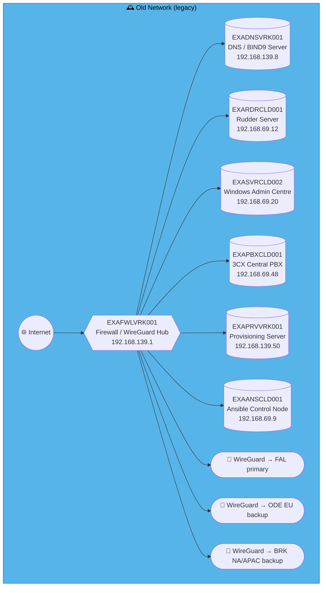
```mermaid
graph TD
    subgraph OLD_CLD ["🕰️ Old Network (legacy)"]
      INET(("🌐 Internet"))
      FWLCLD{{"EXAFWLVRK001<br/>Firewall / WireGuard Hub<br/>192.168.139.1"}}
      DNS[("EXADNSVRK001<br/>DNS / BIND9 Server<br/>192.168.139.8")]
      PRV[("EXAPRVVRK001<br/>Provisioning Server<br/>192.168.139.50")]
      RUD[("EXARDRCLD001<br/>Rudder Server<br/>192.168.69.12")]
      WAC[("EXASVRCLD002<br/>Windows Admin Centre<br/>192.168.69.20")]
      PBX[("EXAPBXCLD001<br/>3CX Central PBX<br/>192.168.69.48")]
      ANS[("EXAANSCLD001<br/>Ansible Control Node<br/>192.168.69.9")]

      VPN_FAL(["🔗 WireGuard → FAL primary"])
      VPN_ODE(["🔗 WireGuard → ODE EU backup"])
      VPN_BRK(["🔗 WireGuard → BRK NA/APAC backup"])

      INET --> FWLCLD
      FWLCLD --> DNS
      FWLCLD --> RUD
      FWLCLD --> WAC
      FWLCLD --> PBX
      FWLCLD --> PRV
      FWLCLD --> ANS
      FWLCLD --> VPN_FAL
      FWLCLD --> VPN_ODE
      FWLCLD --> VPN_BRK

    end
    style OLD_CLD fill:#56B4E9,stroke:#0072B2,color:#000000
```

---

---

## 🏴󠁧󠁢󠁳󠁣󠁴󠁿 Scotland

---

## FAL — Falkirk *(Head Office)* ⭐

**Address:** Brockville Stadium, Hope Street, Falkirk  
**LAN:** `192.168.76.0/24` · **VPN:** `10.0.76.0/24` · **Domain:** `example.net`  
**PVE nodes:** 3 (hub) · **VPN parent:** CLD (primary head node)  
**Entity:** Example Music (Scotland) Ltd · **Landline:** +44 1324 500 0xxx · **Mobile:** +44 7700 903 2xxx

```mermaid
graph TD
    subgraph OLD_FAL ["🕰️ Old Network (legacy)"]
      INET(("🌐 Internet"))
      RTR{{"EXARTRFAL001<br/>Cisco ISR 4331<br/>.254"}}
      FWL{{"EXAFWLFAL001<br/>FortiOS<br/>.1"}}
      SW1{{"EXASWIFAL001<br/>Cisco 9300<br/>.250"}}
      SW2{{"EXASWIFAL002<br/>Cisco 9300<br/>.251"}}

      subgraph BMC ["BMC Pool"]
          RAC1[("EXARACFAL001<br/>Dell iDRAC9<br/>.2")]
          RAC2[("EXARACFAL002<br/>Dell iDRAC9<br/>.3")]
          RAC3[("EXARACFAL003<br/>Dell iDRAC9<br/>.4")]
      end

      subgraph PVE ["Proxmox Cluster (3-node)"]
          PVE1[("EXAPVEFAL001<br/>Proxmox node 1<br/>.5")]
          PVE2[("EXAPVEFAL002<br/>Proxmox node 2<br/>.6")]
          PVE3[("EXAPVEFAL003<br/>Proxmox node 3<br/>.7")]
      end

      subgraph DC ["Domain Controllers"]
          DC1[("EXADCSFAL001<br/>DC · PDC Emulator<br/>.10")]
          DC2[("EXADCSFAL002<br/>DC secondary<br/>.11")]
      end

      subgraph INFRA ["Infrastructure"]
          SBC[("EXASBCFAL001<br/>3CX SBC → CLD PBX<br/>.48")]
          RRY[("EXARRYFAL001<br/>Rudder Relay<br/>.12")]
          NAS[("EXANASFAL001<br/>FreeNAS 13.0-U6<br/>.32")]
          TAR[("EXATARFAL001<br/>Tape Archiver<br/>.33")]
      end

      subgraph ENDPOINTS ["Endpoints"]
          WKS1(["EXAWKSFAL001<br/>Mixing Desk WKS<br/>.100"])
          WKS2(["EXAWKSFAL002<br/>Reel-to-Reel WKS<br/>.101"])
          WKS3(["EXAWKSFAL003<br/>Shared Editing WKS<br/>.102"])
          LAP(["EXALAPFAL001<br/>Production Laptop<br/>.103"])
          SUR(["EXASURFAL001<br/>Microsoft Surface<br/>.104"])
          PHN(["EXAPHNFAL001-003<br/>Staff Phones"])
          PHN2(["EXAPHNFAL006-007<br/>Yealink T58A"])
          TAB(["EXATABFAL001<br/>Tablet"])
      end

      subgraph WAP_CAM ["Wireless & Security"]
          WAP["WAPs x6<br/>Ubiquiti UniFi U6-Pro<br/>.5-.10"]
          CAM1(["EXACAMFAL001<br/>Axis · Front entrance<br/>.70"])
          CAM2(["EXACAMFAL002<br/>Axis · Studio hallway<br/>.71"])
          CAM3(["EXACAMFAL003<br/>Axis · Car park<br/>.72"])
          CAM4(["EXACAMFAL004<br/>Axis · Loading bay<br/>.73"])
          RDR[("EXARDRFAL001<br/>HID Signo Badge Reader<br/>.16")]
      end

      subgraph SITE ["Site-Specific Equipment"]
          LCD(["EXALCDFAL001<br/>Samsung Tizen Display<br/>.50"])
          VCU(["EXAVCUFAL001<br/>Poly Studio X70<br/>.51"])
          JKB>"EXAMUSFAL001<br/>Pureline 128V Jukebox<br/>.67"]
          PAY>"EXAPAYFAL001<br/>GPO Kiosk No.6 Payphone<br/>.95"]
          COF>"EXATEAFAL001<br/>Smart Coffee Machine<br/>.61"]
          VND1>"EXADONFAL001<br/>Tim Hortons Vending<br/>.62"]
          VND2>"EXAVNDFAL002<br/>Irn-Bru Machine<br/>.63"]
          VND3>"EXAVNDFAL003<br/>McCowans Dispenser<br/>.64"]
          VND4>"EXAVNDFAL004<br/>Mrs Tily Dispenser<br/>.65"]
          VND5>"EXAVNDFAL005<br/>¼lb Confectionery<br/>.66"]
          PMP>"EXAPMPFAL001<br/>Networked Petrol Pump<br/>.60"]
          CLK>"EXACLKFAL001<br/>NTP Clock<br/>.80"]
      end

      VPN_CLD(["🔗 WireGuard ← CLD<br/>10.0.76.0/24"])

      INET --> RTR --> FWL --> SW1 & SW2
      SW1 --> PVE1 & PVE2 & PVE3
      SW1 --> DC1 & DC2
      SW1 --> SBC & NAS & TAR
      SW2 --> WKS1
      SW2 --> WAP
      SW2 --> LCD
      RAC1 -.->|"manages"| PVE1
      RAC2 -.->|"manages"| PVE2
      RAC3 -.->|"manages"| PVE3
      FWL <-->|"WireGuard tunnel"| VPN_CLD

      SW1 --> RRY
      RRY -. "→ EXARDRCLD001" .-> VPN_CLD
    end
    style OLD_FAL fill:#56B4E9,stroke:#0072B2,color:#000000
```

---

## EDI — Edinburgh ⚠️

**LAN:** `192.168.131.0/24` · **Domain:** `example.org` / `example.net`  
**PVE nodes:** 1 · **VPN parent:** FAL  
> ⚠️ `EXADCSEDI003` — DFSR stopped, C: drive at 5% free. Immediate action required.  
**Entity:** Example Music (Scotland) Ltd · **Landline:** +44 131 496 0xxx · **Mobile:** +44 770 090 3xxx

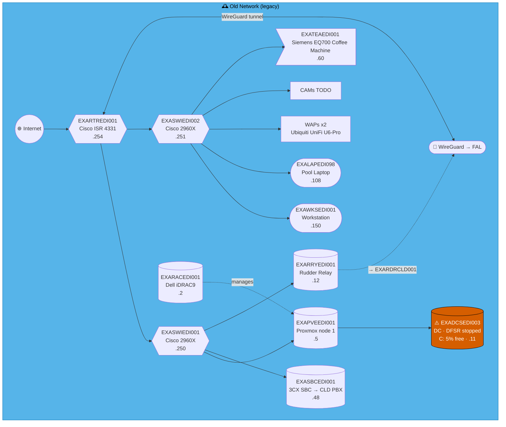
```mermaid
graph TD
    subgraph OLD_EDI ["🕰️ Old Network (legacy)"]
      INET(("🌐 Internet"))
      RTR{{"EXARTREDI001<br/>Cisco ISR 4331<br/>.254"}}
      SW1{{"EXASWIEDI001<br/>Cisco 2960X<br/>.250"}}
      SW2{{"EXASWIEDI002<br/>Cisco 2960X<br/>.251"}}
      RAC[("EXARACEDI001<br/>Dell iDRAC9<br/>.2")]
      PVE[("EXAPVEEDI001<br/>Proxmox node 1<br/>.5")]
      DC[("⚠️ EXADCSEDI003<br/>DC · DFSR stopped<br/>C: 5% free · .11")]
      SBC[("EXASBCEDI001<br/>3CX SBC → CLD PBX<br/>.48")]
      RRY[("EXARRYEDI001<br/>Rudder Relay<br/>.12")]
      WKS(["EXAWKSEDI001<br/>Workstation<br/>.150"])
      LAP(["EXALAPEDI098<br/>Pool Laptop<br/>.108"])
      WAP["WAPs x2<br/>Ubiquiti UniFi U6-Pro"]
      CAM["CAMs TODO"]
      COF>"EXATEAEDI001<br/>Siemens EQ700 Coffee Machine<br/>.60"]
      VPN(["🔗 WireGuard → FAL"])

      INET --> RTR --> SW1 & SW2
      SW1 --> PVE --> DC
      SW1 --> SBC
      RAC -.->|"manages"| PVE
      SW2 --> WKS & LAP & WAP & CAM & COF
      RTR <-->|"WireGuard tunnel"| VPN

      SW1 --> RRY
      RRY -. "→ EXARDRCLD001" .-> VPN
    end
    style OLD_EDI fill:#56B4E9,stroke:#0072B2,color:#000000
    classDef warn fill:#D55E00,stroke:#000000,color:#ffffff
    class DC warn
```

---

## GLA — Glasgow

**LAN:** `192.168.141.0/24` · **Domain:** `example.net`  
**PVE nodes:** 1 · **VPN parent:** FAL  
**Entity:** Example Music (Scotland) Ltd · **Landline:** +44 141 496 01xx · **Mobile:** +44 770 009 4xxx

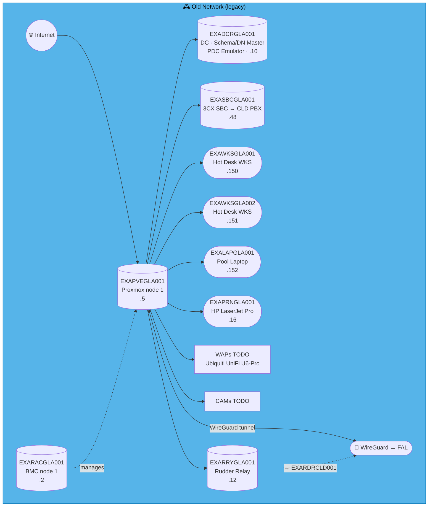
```mermaid
graph TD
    subgraph OLD_GLA ["🕰️ Old Network (legacy)"]
      INET(("🌐 Internet"))
      PVE[("EXAPVEGLA001<br/>Proxmox node 1<br/>.5")]
      RAC[("EXARACGLA001<br/>BMC node 1<br/>.2")]
      DC[("EXADCRGLA001<br/>DC · Schema/DN Master<br/>PDC Emulator · .10")]
      SBC[("EXASBCGLA001<br/>3CX SBC → CLD PBX<br/>.48")]
      RRY[("EXARRYGLA001<br/>Rudder Relay<br/>.12")]
      WKS1(["EXAWKSGLA001<br/>Hot Desk WKS<br/>.150"])
      WKS2(["EXAWKSGLA002<br/>Hot Desk WKS<br/>.151"])
      LAP(["EXALAPGLA001<br/>Pool Laptop<br/>.152"])
      PRN(["EXAPRNGLA001<br/>HP LaserJet Pro<br/>.16"])
      WAP["WAPs TODO<br/>Ubiquiti UniFi U6-Pro"]
      CAM["CAMs TODO"]
      VPN(["🔗 WireGuard → FAL"])

      INET --> PVE
      PVE --> DC & SBC
      RAC -.->|"manages"| PVE
      PVE --> WKS1 & WKS2 & LAP & PRN & WAP & CAM
      PVE <-->|"WireGuard tunnel"| VPN

      PVE --> RRY
      RRY -. "→ EXARDRCLD001" .-> VPN
    end
    style OLD_GLA fill:#56B4E9,stroke:#0072B2,color:#000000
```

---

## CLY — Clydebank

**LAN:** `192.168.41.0/24` · **Domain:** `example.net`  
**PVE nodes:** 1 · **VPN parent:** FAL  
**Entity:** Example Music (Scotland) Ltd · **Landline:** +44 141 496 00xx · **Mobile:** +44 770 090 5xxx

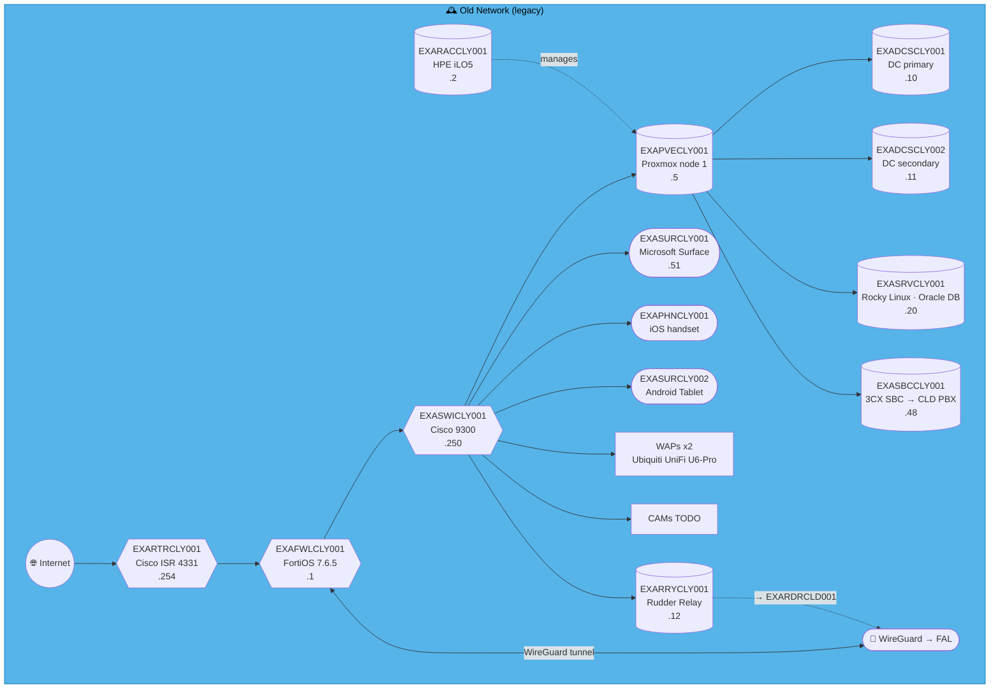
```mermaid
graph TD
    subgraph OLD_CLY ["🕰️ Old Network (legacy)"]
      INET(("🌐 Internet"))
      FWL{{"EXAFWLCLY001<br/>FortiOS 7.6.5<br/>.1"}}
      RTR{{"EXARTRCLY001<br/>Cisco ISR 4331<br/>.254"}}
      SW{{"EXASWICLY001<br/>Cisco 9300<br/>.250"}}
      RAC[("EXARACCLY001<br/>HPE iLO5<br/>.2")]
      PVE[("EXAPVECLY001<br/>Proxmox node 1<br/>.5")]
      DC1[("EXADCSCLY001<br/>DC primary<br/>.10")]
      DC2[("EXADCSCLY002<br/>DC secondary<br/>.11")]
      SRV[("EXASRVCLY001<br/>Rocky Linux · Oracle DB<br/>.20")]
      SBC[("EXASBCCLY001<br/>3CX SBC → CLD PBX<br/>.48")]
      RRY[("EXARRYCLY001<br/>Rudder Relay<br/>.12")]
      SUR(["EXASURCLY001<br/>Microsoft Surface<br/>.51"])
      PHN(["EXAPHNCLY001<br/>iOS handset"])
      TAB(["EXASURCLY002<br/>Android Tablet"])
      WAP["WAPs x2<br/>Ubiquiti UniFi U6-Pro"]
      CAM["CAMs TODO"]
      VPN(["🔗 WireGuard → FAL"])

      INET --> RTR --> FWL --> SW
      SW --> PVE --> DC1 & DC2 & SRV & SBC
      RAC -.->|"manages"| PVE
      SW --> SUR & PHN & TAB & WAP & CAM
      FWL <-->|"WireGuard tunnel"| VPN

      SW --> RRY
      RRY -. "→ EXARDRCLD001" .-> VPN
    end
    style OLD_CLY fill:#56B4E9,stroke:#0072B2,color:#000000
```

---

## DUN — Dundee

**LAN:** `192.168.138.0/24` · **Domain:** `example.net`  
**PVE nodes:** 1 · **VPN parent:** FAL  
**Entity:** Example Music (Scotland) Ltd · **Landline:** +44 163 249 60xx · **Mobile:** +44 770 090 82xx

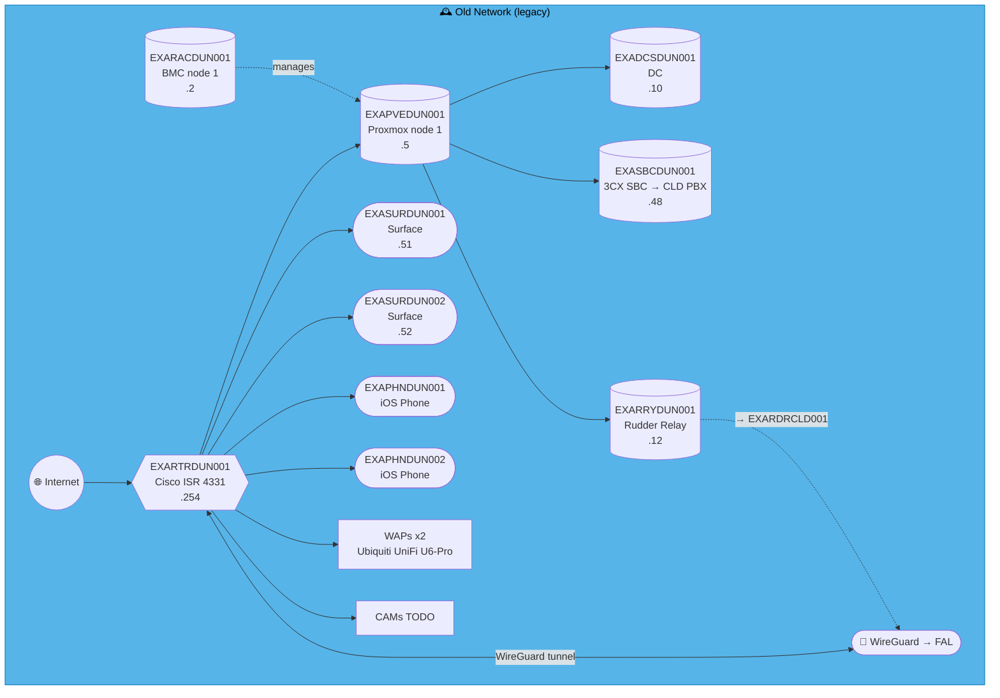
```mermaid
graph TD
    subgraph OLD_DUN ["🕰️ Old Network (legacy)"]
      INET(("🌐 Internet"))
      RTR{{"EXARTRDUN001<br/>Cisco ISR 4331<br/>.254"}}
      RAC[("EXARACDUN001<br/>BMC node 1<br/>.2")]
      PVE[("EXAPVEDUN001<br/>Proxmox node 1<br/>.5")]
      DC[("EXADCSDUN001<br/>DC<br/>.10")]
      SBC[("EXASBCDUN001<br/>3CX SBC → CLD PBX<br/>.48")]
      RRY[("EXARRYDUN001<br/>Rudder Relay<br/>.12")]
      SUR1(["EXASURDUN001<br/>Surface<br/>.51"])
      SUR2(["EXASURDUN002<br/>Surface<br/>.52"])
      PHN1(["EXAPHNDUN001<br/>iOS Phone"])
      PHN2(["EXAPHNDUN002<br/>iOS Phone"])
      WAP["WAPs x2<br/>Ubiquiti UniFi U6-Pro"]
      CAM["CAMs TODO"]
      VPN(["🔗 WireGuard → FAL"])

      INET --> RTR --> PVE
      PVE --> DC & SBC
      RAC -.->|"manages"| PVE
      RTR --> SUR1 & SUR2 & PHN1 & PHN2 & WAP & CAM
      RTR <-->|"WireGuard tunnel"| VPN

      PVE --> RRY
      RRY -. "→ EXARDRCLD001" .-> VPN
    end
    style OLD_DUN fill:#56B4E9,stroke:#0072B2,color:#000000
```

---

## PER — Perth

**LAN:** `192.168.173.0/24` · **Domain:** `example.net`  
**PVE nodes:** 1 · **VPN parent:** FAL  
**Entity:** Example Music (Scotland) Ltd · **Landline:** +44 173 849 60xx · **Mobile:** +44 770 0173 0xx

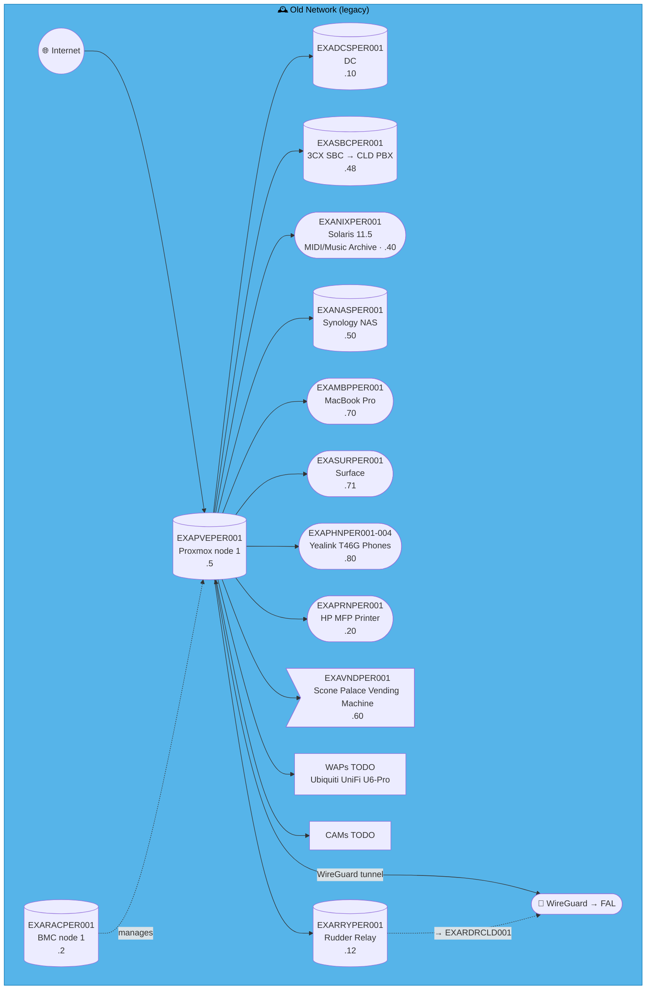
```mermaid
graph TD
    subgraph OLD_PER ["🕰️ Old Network (legacy)"]
      INET(("🌐 Internet"))
      RAC[("EXARACPER001<br/>BMC node 1<br/>.2")]
      PVE[("EXAPVEPER001<br/>Proxmox node 1<br/>.5")]
      DC[("EXADCSPER001<br/>DC<br/>.10")]
      SBC[("EXASBCPER001<br/>3CX SBC → CLD PBX<br/>.48")]
      RRY[("EXARRYPER001<br/>Rudder Relay<br/>.12")]
      NIX(["EXANIXPER001<br/>Solaris 11.5<br/>MIDI/Music Archive · .40"])
      NAS[("EXANASPER001<br/>Synology NAS<br/>.50")]
      MBP(["EXAMBPPER001<br/>MacBook Pro<br/>.70"])
      SUR(["EXASURPER001<br/>Surface<br/>.71"])
      PHN(["EXAPHNPER001-004<br/>Yealink T46G Phones<br/>.80"])
      PRN(["EXAPRNPER001<br/>HP MFP Printer<br/>.20"])
      VND>"EXAVNDPER001<br/>Scone Palace Vending Machine<br/>.60"]
      WAP["WAPs TODO<br/>Ubiquiti UniFi U6-Pro"]
      CAM["CAMs TODO"]
      VPN(["🔗 WireGuard → FAL"])

      INET --> PVE
      PVE --> DC & SBC & NIX & NAS
      RAC -.->|"manages"| PVE
      PVE --> MBP & SUR & PHN & PRN & VND & WAP & CAM
      PVE <-->|"WireGuard tunnel"| VPN

      PVE --> RRY
      RRY -. "→ EXARDRCLD001" .-> VPN
    end
    style OLD_PER fill:#56B4E9,stroke:#0072B2,color:#000000
```

---

## ABD — Aberdeen

**LAN:** `192.168.224.0/24` · **Domain:** `example.org`  
**PVE nodes:** 1 · **VPN parent:** FAL  
**Entity:** Example Music (Scotland) Ltd · **Landline:** +44 1224 496 0xxx · **Mobile:** +44 7700 900 2xxx

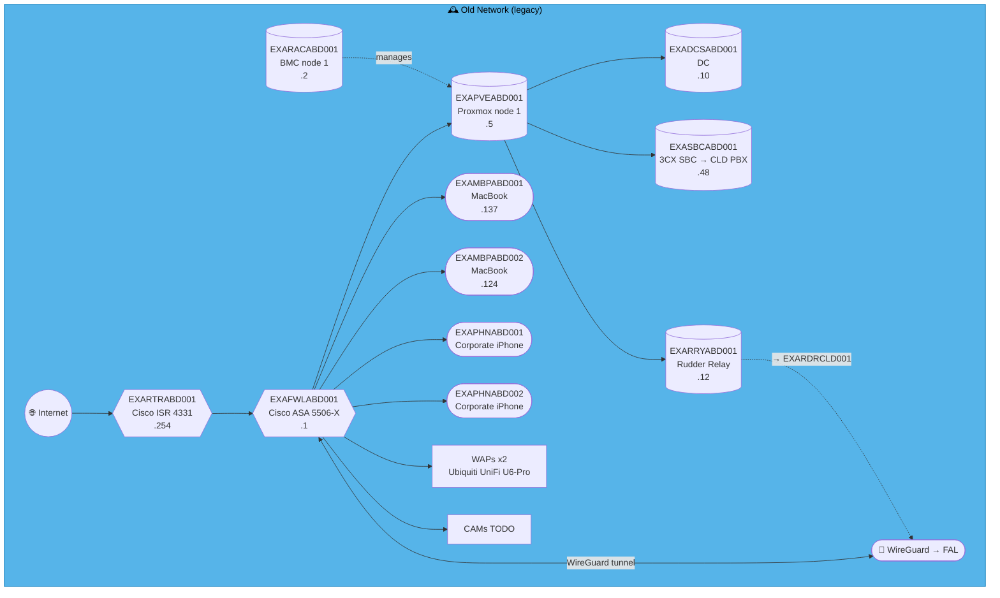
```mermaid
graph TD
    subgraph OLD_ABD ["🕰️ Old Network (legacy)"]
      INET(("🌐 Internet"))
      FWL{{"EXAFWLABD001<br/>Cisco ASA 5506-X<br/>.1"}}
      RTR{{"EXARTRABD001<br/>Cisco ISR 4331<br/>.254"}}
      RAC[("EXARACABD001<br/>BMC node 1<br/>.2")]
      PVE[("EXAPVEABD001<br/>Proxmox node 1<br/>.5")]
      DC[("EXADCSABD001<br/>DC<br/>.10")]
      SBC[("EXASBCABD001<br/>3CX SBC → CLD PBX<br/>.48")]
      RRY[("EXARRYABD001<br/>Rudder Relay<br/>.12")]
      MBP1(["EXAMBPABD001<br/>MacBook<br/>.137"])
      MBP2(["EXAMBPABD002<br/>MacBook<br/>.124"])
      PHN1(["EXAPHNABD001<br/>Corporate iPhone"])
      PHN2(["EXAPHNABD002<br/>Corporate iPhone"])
      WAP["WAPs x2<br/>Ubiquiti UniFi U6-Pro"]
      CAM["CAMs TODO"]
      VPN(["🔗 WireGuard → FAL"])

      INET --> RTR --> FWL --> PVE
      PVE --> DC & SBC
      RAC -.->|"manages"| PVE
      FWL --> MBP1 & MBP2 & PHN1 & PHN2 & WAP & CAM
      FWL <-->|"WireGuard tunnel"| VPN

      PVE --> RRY
      RRY -. "→ EXARDRCLD001" .-> VPN
    end
    style OLD_ABD fill:#56B4E9,stroke:#0072B2,color:#000000
```

---

---

## 🏴󠁧󠁢󠁥󠁮󠁧󠁿 England

---

## LND — London

**LAN:** `192.168.20.0/24` · **Domain:** `example.net`  
**PVE nodes:** 1 · **VPN parent:** FAL  
**Entity:** Example Music (England) Ltd · **Landline:** +44 207 496 0xxx · **Mobile:** +44 770 090 0xxx

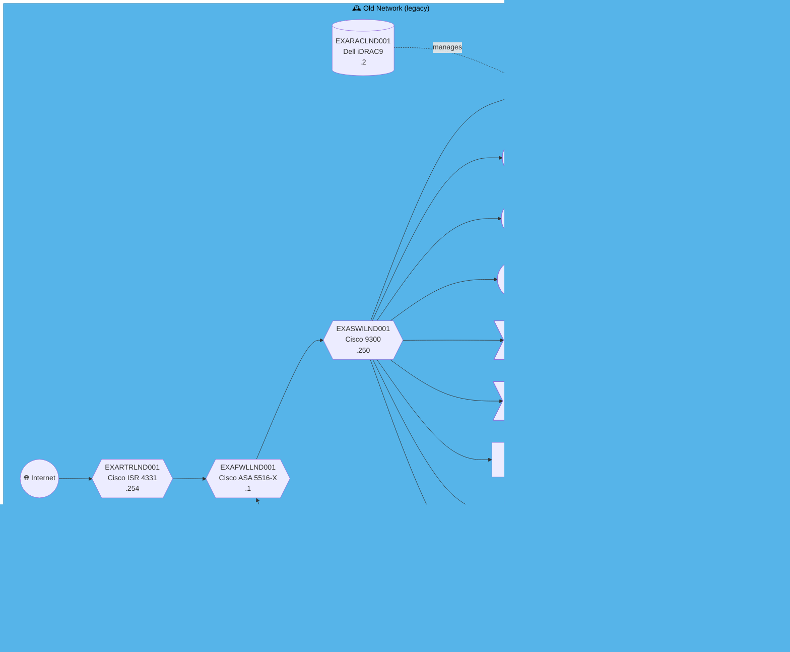
```mermaid
graph TD
    subgraph OLD_LND ["🕰️ Old Network (legacy)"]
      INET(("🌐 Internet"))
      FWL{{"EXAFWLLND001<br/>Cisco ASA 5516-X<br/>.1"}}
      SW{{"EXASWILND001<br/>Cisco 9300<br/>.250"}}
      RTR{{"EXARTRLND001<br/>Cisco ISR 4331<br/>.254"}}
      RAC[("EXARACLND001<br/>Dell iDRAC9<br/>.2")]
      PVE[("EXAPVELND001<br/>Proxmox node 1<br/>.5")]
      DC[("EXADCRLND001<br/>DC · RID/Infra Master<br/>.10")]
      SBC[("EXASBCLND001<br/>3CX SBC → CLD PBX<br/>.48")]
      RRY[("EXARRYLND001<br/>Rudder Relay<br/>.12")]
      WKS(["EXAWKSLND001<br/>Hot Desk WKS<br/>.150"])
      PRN1(["EXAPRNLND001<br/>Xerox WorkCentre<br/>.16"])
      PRN2(["EXAPRNLND002<br/>ProCAT Steno Writer<br/>Court Device"])
      RAD>"EXARADLND001<br/>BBC Office Radio Mk II<br/>.80"]
      MIC>"EXAMICLND001<br/>Shure SM7 Microphone<br/>Dante Audio · .81"]
      WAP["WAPs TODO<br/>Ubiquiti UniFi U6-Pro"]
      CAM["CAMs TODO"]
      VPN(["🔗 WireGuard → FAL"])

      INET --> RTR --> FWL --> SW
      SW --> PVE --> DC & SBC
      RAC -.->|"manages"| PVE
      SW --> WKS & PRN1 & PRN2 & RAD & MIC & WAP & CAM
      FWL <-->|"WireGuard tunnel"| VPN

      SW --> RRY
      RRY -. "→ EXARDRCLD001" .-> VPN
    end
    style OLD_LND fill:#56B4E9,stroke:#0072B2,color:#000000
```

---

## BIR — Birmingham

**LAN:** `192.168.121.0/24` · **Domain:** `example.net`  
**PVE nodes:** 1 · **VPN parent:** FAL  
**Entity:** Example Music (England) Ltd · **Landline:** +44 121 496 0xxx · **Mobile:** +44 7700 900 2xxx

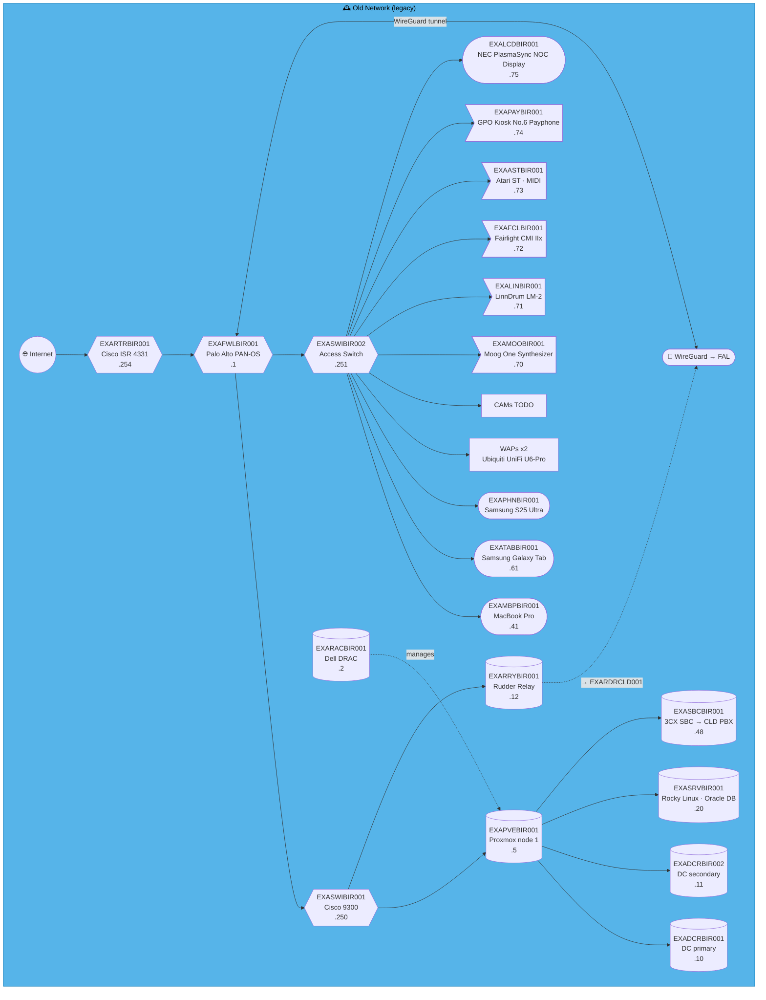
```mermaid
graph TD
    subgraph OLD_BIR ["🕰️ Old Network (legacy)"]
      INET(("🌐 Internet"))
      FWL{{"EXAFWLBIR001<br/>Palo Alto PAN-OS<br/>.1"}}
      SW1{{"EXASWIBIR001<br/>Cisco 9300<br/>.250"}}
      SW2{{"EXASWIBIR002<br/>Access Switch<br/>.251"}}
      RTR{{"EXARTRBIR001<br/>Cisco ISR 4331<br/>.254"}}
      RAC[("EXARACBIR001<br/>Dell DRAC<br/>.2")]
      PVE[("EXAPVEBIR001<br/>Proxmox node 1<br/>.5")]
      DC1[("EXADCRBIR001<br/>DC primary<br/>.10")]
      DC2[("EXADCRBIR002<br/>DC secondary<br/>.11")]
      SRV[("EXASRVBIR001<br/>Rocky Linux · Oracle DB<br/>.20")]
      SBC[("EXASBCBIR001<br/>3CX SBC → CLD PBX<br/>.48")]
      RRY[("EXARRYBIR001<br/>Rudder Relay<br/>.12")]
      MBP(["EXAMBPBIR001<br/>MacBook Pro<br/>.41"])
      TAB(["EXATABBIR001<br/>Samsung Galaxy Tab<br/>.61"])
      PHN(["EXAPHNBIR001<br/>Samsung S25 Ultra"])
      WAP["WAPs x2<br/>Ubiquiti UniFi U6-Pro"]
      CAM["CAMs TODO"]
      MOO>"EXAMOOBIR001<br/>Moog One Synthesizer<br/>.70"]
      LIN>"EXALINBIR001<br/>LinnDrum LM-2<br/>.71"]
      FCL>"EXAFCLBIR001<br/>Fairlight CMI IIx<br/>.72"]
      AST>"EXAASTBIR001<br/>Atari ST · MIDI<br/>.73"]
      PAY>"EXAPAYBIR001<br/>GPO Kiosk No.6 Payphone<br/>.74"]
      LCD(["EXALCDBIR001<br/>NEC PlasmaSync NOC Display<br/>.75"])
      VPN(["🔗 WireGuard → FAL"])

      INET --> RTR --> FWL --> SW1 & SW2
      SW1 --> PVE --> DC1 & DC2 & SRV & SBC
      RAC -.->|"manages"| PVE
      SW2 --> MBP & TAB & PHN & WAP & CAM
      SW2 --> MOO & LIN & FCL & AST & PAY & LCD
      FWL <-->|"WireGuard tunnel"| VPN

      SW1 --> RRY
      RRY -. "→ EXARDRCLD001" .-> VPN
    end
    style OLD_BIR fill:#56B4E9,stroke:#0072B2,color:#000000
```

---

## MCR — Manchester

**LAN:** `192.168.161.0/24` · **Domain:** `example.org`  
**PVE nodes:** 1 · **VPN parent:** FAL  
**Entity:** Example Music (England) Ltd · **Landline:** +44 161 715 xxxx · **Mobile:** +44 770 090 6xxx

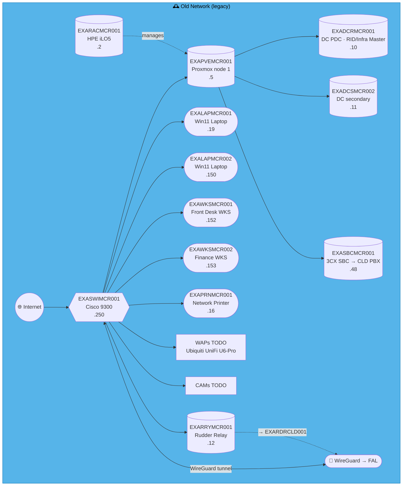
```mermaid
graph TD
    subgraph OLD_MCR ["🕰️ Old Network (legacy)"]
      INET(("🌐 Internet"))
      SW{{"EXASWIMCR001<br/>Cisco 9300<br/>.250"}}
      RAC[("EXARACMCR001<br/>HPE iLO5<br/>.2")]
      PVE[("EXAPVEMCR001<br/>Proxmox node 1<br/>.5")]
      DC1[("EXADCRMCR001<br/>DC PDC · RID/Infra Master<br/>.10")]
      DC2[("EXADCSMCR002<br/>DC secondary<br/>.11")]
      SBC[("EXASBCMCR001<br/>3CX SBC → CLD PBX<br/>.48")]
      RRY[("EXARRYMCR001<br/>Rudder Relay<br/>.12")]
      LAP1(["EXALAPMCR001<br/>Win11 Laptop<br/>.19"])
      LAP2(["EXALAPMCR002<br/>Win11 Laptop<br/>.150"])
      WKS1(["EXAWKSMCR001<br/>Front Desk WKS<br/>.152"])
      WKS2(["EXAWKSMCR002<br/>Finance WKS<br/>.153"])
      PRN(["EXAPRNMCR001<br/>Network Printer<br/>.16"])
      WAP["WAPs TODO<br/>Ubiquiti UniFi U6-Pro"]
      CAM["CAMs TODO"]
      VPN(["🔗 WireGuard → FAL"])

      INET --> SW
      SW --> PVE --> DC1 & DC2 & SBC
      RAC -.->|"manages"| PVE
      SW --> LAP1 & LAP2 & WKS1 & WKS2 & PRN & WAP & CAM
      SW <-->|"WireGuard tunnel"| VPN

      SW --> RRY
      RRY -. "→ EXARDRCLD001" .-> VPN
    end
    style OLD_MCR fill:#56B4E9,stroke:#0072B2,color:#000000
```

---

## LIV — Liverpool

**LAN:** `192.168.151.0/24` · **Domain:** `example.org`  
**PVE nodes:** 1 · **VPN parent:** FAL  
**Entity:** Example Music (England) Ltd · **Landline:** +44 151 496 0xxx · **Mobile:** +44 770 090 5xxx

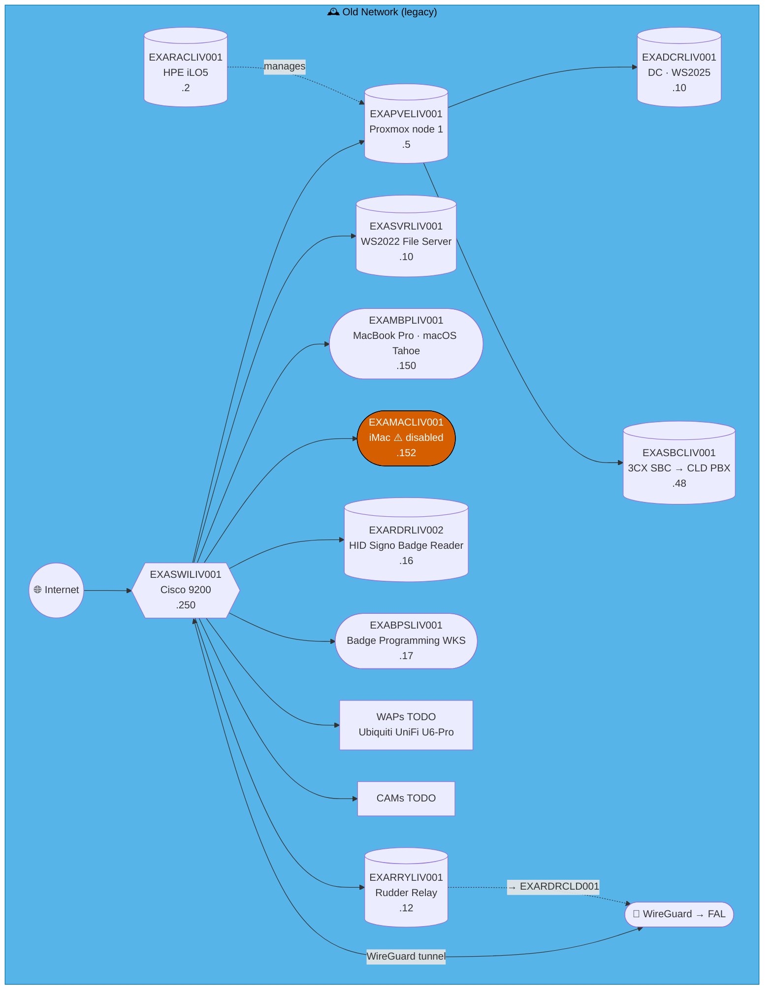
```mermaid
graph TD
    subgraph OLD_LIV ["🕰️ Old Network (legacy)"]
      INET(("🌐 Internet"))
      SW{{"EXASWILIV001<br/>Cisco 9200<br/>.250"}}
      RAC[("EXARACLIV001<br/>HPE iLO5<br/>.2")]
      PVE[("EXAPVELIV001<br/>Proxmox node 1<br/>.5")]
      DC[("EXADCRLIV001<br/>DC · WS2025<br/>.10")]
      SBC[("EXASBCLIV001<br/>3CX SBC → CLD PBX<br/>.48")]
      RRY[("EXARRYLIV001<br/>Rudder Relay<br/>.12")]
      SRV[("EXASVRLIV001<br/>WS2022 File Server<br/>.10")]
      MBP(["EXAMBPLIV001<br/>MacBook Pro · macOS Tahoe<br/>.150"])
      MAC(["EXAMACLIV001<br/>iMac ⚠️ disabled<br/>.152"])
      RDR[("EXARDRLIV002<br/>HID Signo Badge Reader<br/>.16")]
      BPS(["EXABPSLIV001<br/>Badge Programming WKS<br/>.17"])
      WAP["WAPs TODO<br/>Ubiquiti UniFi U6-Pro"]
      CAM["CAMs TODO"]
      VPN(["🔗 WireGuard → FAL"])

      INET --> SW
      SW --> PVE --> DC & SBC
      RAC -.->|"manages"| PVE
      SW --> SRV & MBP & MAC & RDR & BPS & WAP & CAM
      SW <-->|"WireGuard tunnel"| VPN

      SW --> RRY
      RRY -. "→ EXARDRCLD001" .-> VPN
    end
    style OLD_LIV fill:#56B4E9,stroke:#0072B2,color:#000000
    classDef warn fill:#D55E00,stroke:#000000,color:#ffffff
    class MAC warn
```

---

## NEW — Newcastle

**LAN:** `192.168.191.0/24` · **Domain:** `example.org`  
**PVE nodes:** 1 · **VPN parent:** FAL  
**Entity:** Example Music (England) Ltd · **Landline:** +44 191 496 0xxx · **Mobile:** +44 770 090 9xxx

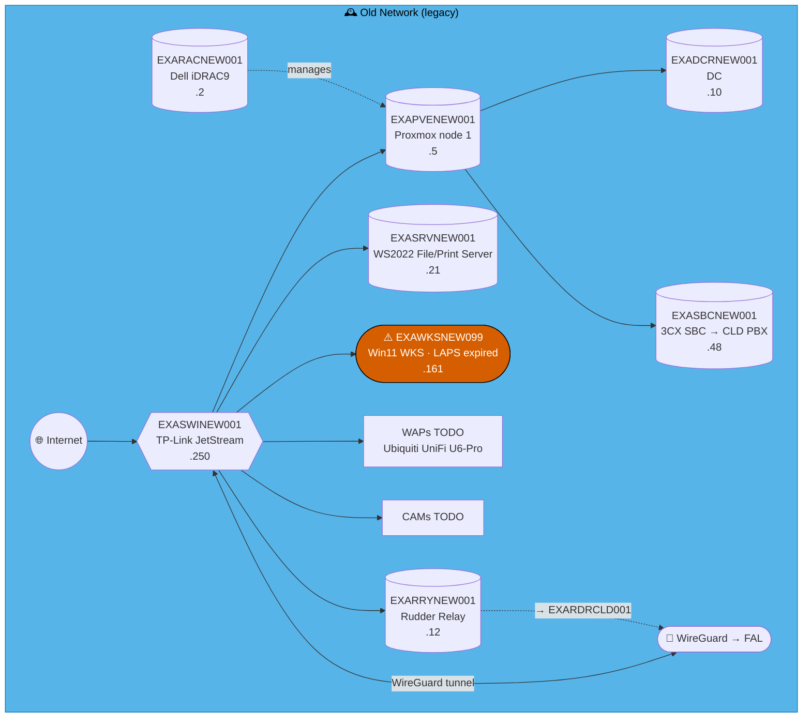
```mermaid
graph TD
    subgraph OLD_NEW ["🕰️ Old Network (legacy)"]
      INET(("🌐 Internet"))
      SW{{"EXASWINEW001<br/>TP-Link JetStream<br/>.250"}}
      RAC[("EXARACNEW001<br/>Dell iDRAC9<br/>.2")]
      PVE[("EXAPVENEW001<br/>Proxmox node 1<br/>.5")]
      DC[("EXADCRNEW001<br/>DC<br/>.10")]
      SBC[("EXASBCNEW001<br/>3CX SBC → CLD PBX<br/>.48")]
      RRY[("EXARRYNEW001<br/>Rudder Relay<br/>.12")]
      SRV[("EXASRVNEW001<br/>WS2022 File/Print Server<br/>.21")]
      WKS(["⚠️ EXAWKSNEW099<br/>Win11 WKS · LAPS expired<br/>.161"])
      WAP["WAPs TODO<br/>Ubiquiti UniFi U6-Pro"]
      CAM["CAMs TODO"]
      VPN(["🔗 WireGuard → FAL"])

      INET --> SW
      SW --> PVE --> DC & SBC
      RAC -.->|"manages"| PVE
      SW --> SRV & WKS & WAP & CAM
      SW <-->|"WireGuard tunnel"| VPN

      SW --> RRY
      RRY -. "→ EXARDRCLD001" .-> VPN
    end
    style OLD_NEW fill:#56B4E9,stroke:#0072B2,color:#000000
    classDef warn fill:#D55E00,stroke:#000000,color:#ffffff
    class WKS warn
```

---

## SHE — Sheffield

**LAN:** `192.168.114.0/24` · **Domain:** `example.net`  
**PVE nodes:** 1 · **VPN parent:** FAL  
**Entity:** Example Music (England) Ltd · **Landline:** +44 114 250 0xxx · **Mobile:** +44 7700 905 2xxx

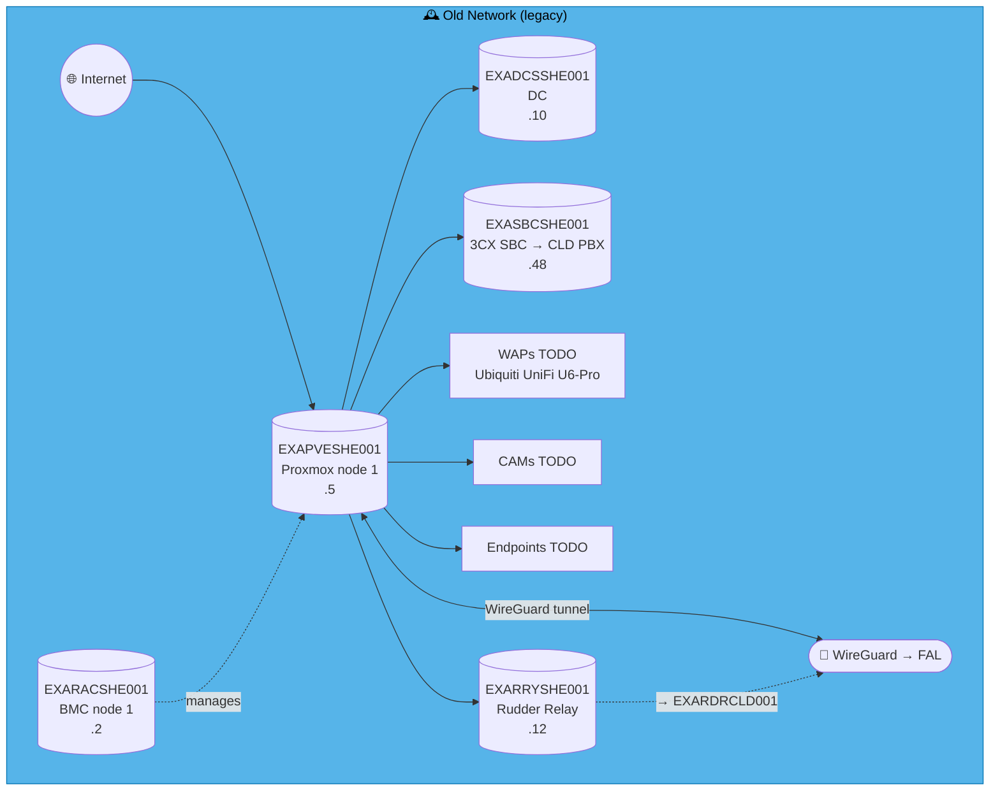
```mermaid
graph TD
    subgraph OLD_SHE ["🕰️ Old Network (legacy)"]
      INET(("🌐 Internet"))
      RAC[("EXARACSHE001<br/>BMC node 1<br/>.2")]
      PVE[("EXAPVESHE001<br/>Proxmox node 1<br/>.5")]
      DC[("EXADCSSHE001<br/>DC<br/>.10")]
      SBC[("EXASBCSHE001<br/>3CX SBC → CLD PBX<br/>.48")]
      RRY[("EXARRYSHE001<br/>Rudder Relay<br/>.12")]
      WAP["WAPs TODO<br/>Ubiquiti UniFi U6-Pro"]
      CAM["CAMs TODO"]
      EP["Endpoints TODO"]
      VPN(["🔗 WireGuard → FAL"])

      INET --> PVE --> DC & SBC
      RAC -.->|"manages"| PVE
      PVE --> WAP & CAM & EP
      PVE <-->|"WireGuard tunnel"| VPN

      PVE --> RRY
      RRY -. "→ EXARDRCLD001" .-> VPN
    end
    style OLD_SHE fill:#56B4E9,stroke:#0072B2,color:#000000
```

---

## HAL — Halifax

**LAN:** `192.168.142.0/24` · **Domain:** `example.net`  
**PVE nodes:** 1 · **VPN parent:** FAL  
**Entity:** Example Music (England) Ltd · **Landline:** +44 1422 200 0xxx · **Mobile:** +44 7700 904 2xxx

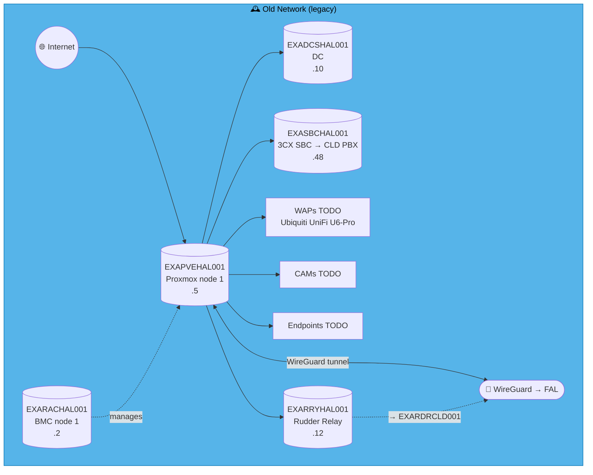
```mermaid
graph TD
    subgraph OLD_HAL ["🕰️ Old Network (legacy)"]
      INET(("🌐 Internet"))
      RAC[("EXARACHAL001<br/>BMC node 1<br/>.2")]
      PVE[("EXAPVEHAL001<br/>Proxmox node 1<br/>.5")]
      DC[("EXADCSHAL001<br/>DC<br/>.10")]
      SBC[("EXASBCHAL001<br/>3CX SBC → CLD PBX<br/>.48")]
      RRY[("EXARRYHAL001<br/>Rudder Relay<br/>.12")]
      WAP["WAPs TODO<br/>Ubiquiti UniFi U6-Pro"]
      CAM["CAMs TODO"]
      EP["Endpoints TODO"]
      VPN(["🔗 WireGuard → FAL"])

      INET --> PVE --> DC & SBC
      RAC -.->|"manages"| PVE
      PVE --> WAP & CAM & EP
      PVE <-->|"WireGuard tunnel"| VPN

      PVE --> RRY
      RRY -. "→ EXARDRCLD001" .-> VPN
    end
    style OLD_HAL fill:#56B4E9,stroke:#0072B2,color:#000000
```

---

## HUL — Hull

**LAN:** `192.168.148.0/24` · **Domain:** `example.net`  
**PVE nodes:** 1 · **VPN parent:** FAL  
**Entity:** Example Music (England) Ltd · **Landline:** +44 1482 300 0xxx · **Mobile:** +44 7700 902 2xxx

```mermaid
graph TD
    subgraph OLD_HUL ["🕰️ Old Network (legacy)"]
      INET(("🌐 Internet"))
      RAC[("EXARACHUL001<br/>BMC node 1<br/>.2")]
      PVE[("EXAPVEHUL001<br/>Proxmox node 1<br/>.5")]
      DC[("EXADCSHUL001<br/>DC<br/>.10")]
      SBC[("EXASBCHUL001<br/>3CX SBC → CLD PBX<br/>.48")]
      RRY[("EXARRYHUL001<br/>Rudder Relay<br/>.12")]
      WAP["WAPs TODO<br/>Ubiquiti UniFi U6-Pro"]
      CAM["CAMs TODO"]
      EP["Endpoints TODO"]
      VPN(["🔗 WireGuard → FAL"])

      INET --> PVE --> DC & SBC
      RAC -.->|"manages"| PVE
      PVE --> WAP & CAM & EP
      PVE <-->|"WireGuard tunnel"| VPN

      PVE --> RRY
      RRY -. "→ EXARDRCLD001" .-> VPN
    end
    style OLD_HUL fill:#56B4E9,stroke:#0072B2,color:#000000
```

---

## COV — Coventry

**LAN:** `192.168.247.0/24` · **Domain:** `example.net`  
**PVE nodes:** 1 · **VPN parent:** FAL  
*Note: WAP/RTR-only site — minimal infrastructure.*  
**Entity:** Example Music (England) Ltd · **Landline:** +44 247 765 0xxx · **Mobile:** +44 7700 901 2xxx

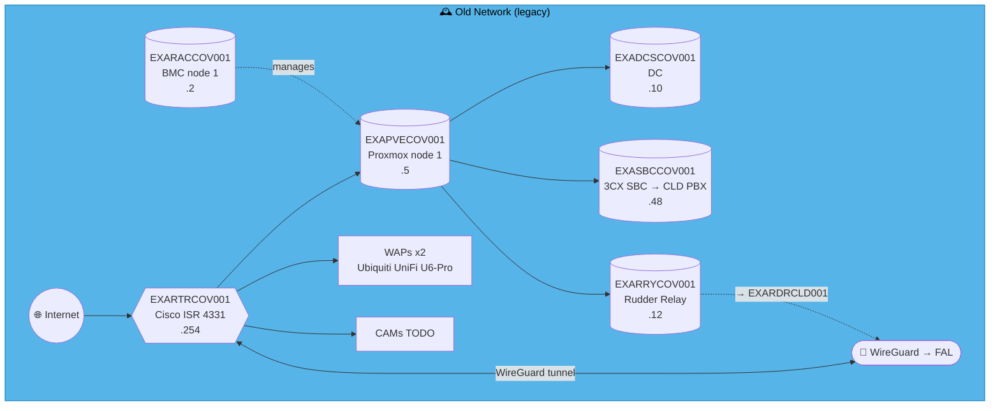
```mermaid
graph TD
    subgraph OLD_COV ["🕰️ Old Network (legacy)"]
      INET(("🌐 Internet"))
      RTR{{"EXARTRCOV001<br/>Cisco ISR 4331<br/>.254"}}
      RAC[("EXARACCOV001<br/>BMC node 1<br/>.2")]
      PVE[("EXAPVECOV001<br/>Proxmox node 1<br/>.5")]
      DC[("EXADCSCOV001<br/>DC<br/>.10")]
      SBC[("EXASBCCOV001<br/>3CX SBC → CLD PBX<br/>.48")]
      RRY[("EXARRYCOV001<br/>Rudder Relay<br/>.12")]
      WAP["WAPs x2<br/>Ubiquiti UniFi U6-Pro"]
      CAM["CAMs TODO"]
      VPN(["🔗 WireGuard → FAL"])

      INET --> RTR --> PVE --> DC & SBC
      RAC -.->|"manages"| PVE
      RTR --> WAP & CAM
      RTR <-->|"WireGuard tunnel"| VPN

      PVE --> RRY
      RRY -. "→ EXARDRCLD001" .-> VPN
    end
    style OLD_COV fill:#56B4E9,stroke:#0072B2,color:#000000
```

---

---

## 🇩🇰 Danmark

---

## CPH — København

**LAN:** `192.168.231.0/24` · **Domain:** `example.com` / `example.net`  
**PVE nodes:** 1 · **VPN parent:** ODE  
**Entity:** Example Music (Danmark) ApS · **Landline:** +45 00 000 xxx · **Mobile:** +45 2x xxx xxx

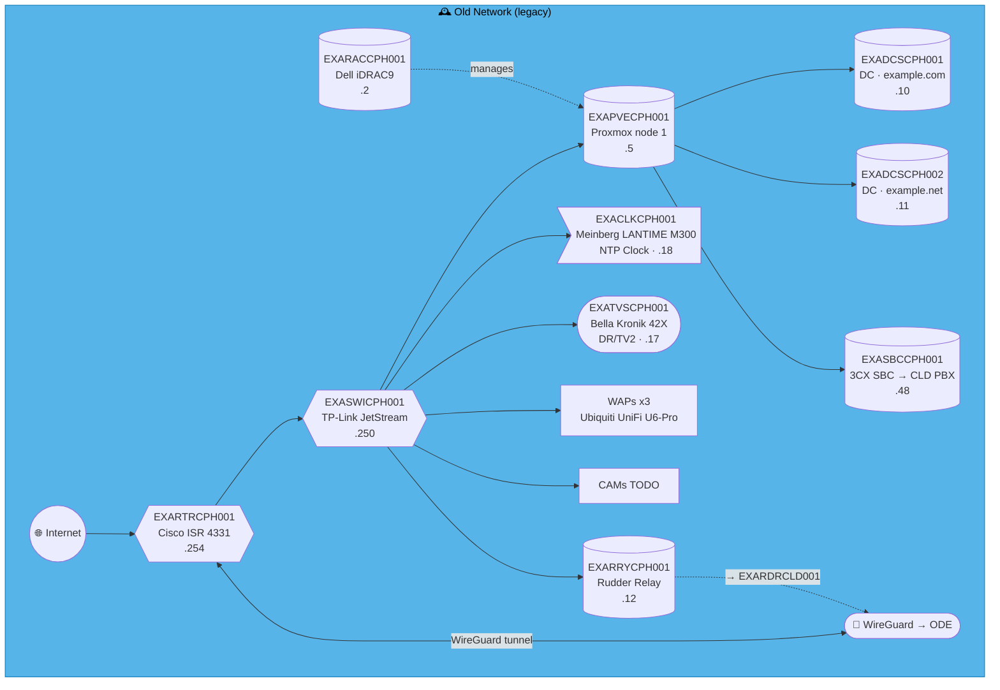
```mermaid
graph TD
    subgraph OLD_CPH ["🕰️ Old Network (legacy)"]
      INET(("🌐 Internet"))
      SW{{"EXASWICPH001<br/>TP-Link JetStream<br/>.250"}}
      RTR{{"EXARTRCPH001<br/>Cisco ISR 4331<br/>.254"}}
      RAC[("EXARACCPH001<br/>Dell iDRAC9<br/>.2")]
      PVE[("EXAPVECPH001<br/>Proxmox node 1<br/>.5")]
      DC1[("EXADCSCPH001<br/>DC · example.com<br/>.10")]
      DC2[("EXADCSCPH002<br/>DC · example.net<br/>.11")]
      SBC[("EXASBCCPH001<br/>3CX SBC → CLD PBX<br/>.48")]
      RRY[("EXARRYCPH001<br/>Rudder Relay<br/>.12")]
      NTP>"EXACLKCPH001<br/>Meinberg LANTIME M300<br/>NTP Clock · .18"]
      TV(["EXATVSCPH001<br/>Bella Kronik 42X<br/>DR/TV2 · .17"])
      WAP["WAPs x3<br/>Ubiquiti UniFi U6-Pro"]
      CAM["CAMs TODO"]
      VPN(["🔗 WireGuard → ODE"])

      INET --> RTR --> SW
      SW --> PVE --> DC1 & DC2 & SBC
      RAC -.->|"manages"| PVE
      SW --> NTP & TV & WAP & CAM
      RTR <-->|"WireGuard tunnel"| VPN

      SW --> RRY
      RRY -. "→ EXARDRCLD001" .-> VPN
    end
    style OLD_CPH fill:#56B4E9,stroke:#0072B2,color:#000000
```

---

## ODE — Odense *(EU Hub)* ⭐

**LAN:** `192.168.126.0/24` · **Domain:** `example.net`  
**PVE nodes:** 3 (EU hub) · **VPN parent:** CLD (EU backup)  
**Entity:** Example Music (Danmark) ApS · **Landline:** +45 00 000 xxx · **Mobile:** +45 2x xxx xxx

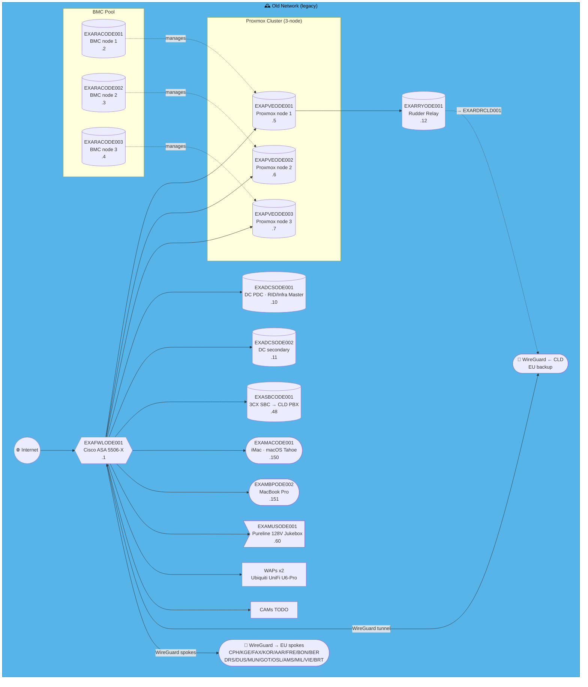
```mermaid
graph TD
    subgraph OLD_ODE ["🕰️ Old Network (legacy)"]
      INET(("🌐 Internet"))
      FWL{{"EXAFWLODE001<br/>Cisco ASA 5506-X<br/>.1"}}

      subgraph BMC ["BMC Pool"]
          RAC1[("EXARACODE001<br/>BMC node 1<br/>.2")]
          RAC2[("EXARACODE002<br/>BMC node 2<br/>.3")]
          RAC3[("EXARACODE003<br/>BMC node 3<br/>.4")]
      end

      subgraph PVE ["Proxmox Cluster (3-node)"]
          PVE1[("EXAPVEODE001<br/>Proxmox node 1<br/>.5")]
          PVE2[("EXAPVEODE002<br/>Proxmox node 2<br/>.6")]
          PVE3[("EXAPVEODE003<br/>Proxmox node 3<br/>.7")]
      end

      DC1[("EXADCSODE001<br/>DC PDC · RID/Infra Master<br/>.10")]
      DC2[("EXADCSODE002<br/>DC secondary<br/>.11")]
      SBC[("EXASBCODE001<br/>3CX SBC → CLD PBX<br/>.48")]
      RRY[("EXARRYODE001<br/>Rudder Relay<br/>.12")]
      MAC(["EXAMACODE001<br/>iMac · macOS Tahoe<br/>.150"])
      MBP(["EXAMBPODE002<br/>MacBook Pro<br/>.151"])
      JKB>"EXAMUSODE001<br/>Pureline 128V Jukebox<br/>.60"]
      WAP["WAPs x2<br/>Ubiquiti UniFi U6-Pro"]
      CAM["CAMs TODO"]
      VPN_CLD(["🔗 WireGuard ← CLD<br/>EU backup"])
      VPN_EU(["🔗 WireGuard → EU spokes<br/>CPH/KGE/FAX/KOR/AAR/FRE/BON/BER<br/>DRS/DUS/MUN/GOT/OSL/AMS/MIL/VIE/BRT"])

      INET --> FWL
      FWL --> PVE1 & PVE2 & PVE3
      FWL --> DC1 & DC2 & SBC
      RAC1 -.->|"manages"| PVE1
      RAC2 -.->|"manages"| PVE2
      RAC3 -.->|"manages"| PVE3
      FWL --> MAC & MBP & JKB & WAP & CAM
      FWL <-->|"WireGuard tunnel"| VPN_CLD
      FWL -->|"WireGuard spokes"| VPN_EU

      PVE1 --> RRY
      RRY -. "→ EXARDRCLD001" .-> VPN_CLD
    end
    style OLD_ODE fill:#56B4E9,stroke:#0072B2,color:#000000
```

---

## KGE — Køge ⚠️

**LAN:** `192.168.65.0/24` · **Domain:** `example.net`  
**PVE nodes:** 1 · **VPN parent:** ODE  
> ⚠️ DC out of sync 27 days · WS2016 EOL · disk space low — rebuild required  
**Entity:** Example Music (Danmark) ApS · **Landline:** +45 00 000 xxx · **Mobile:** +45 2x xxx xxx

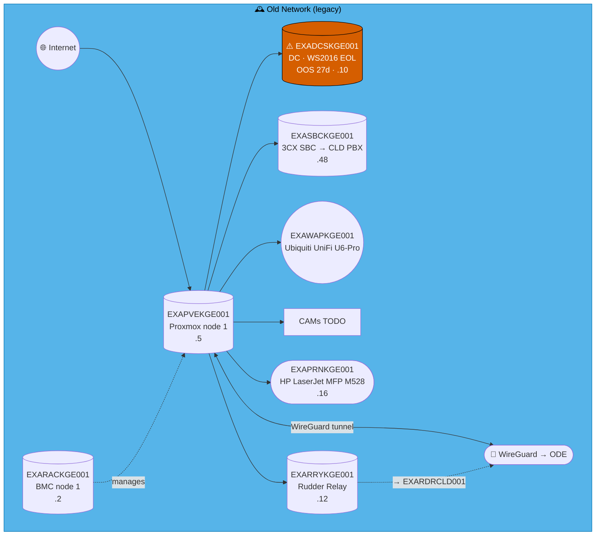
```mermaid
graph TD
    subgraph OLD_KGE ["🕰️ Old Network (legacy)"]
      INET(("🌐 Internet"))
      RAC[("EXARACKGE001<br/>BMC node 1<br/>.2")]
      PVE[("EXAPVEKGE001<br/>Proxmox node 1<br/>.5")]
      DC[("⚠️ EXADCSKGE001<br/>DC · WS2016 EOL<br/>OOS 27d · .10")]
      SBC[("EXASBCKGE001<br/>3CX SBC → CLD PBX<br/>.48")]
      RRY[("EXARRYKGE001<br/>Rudder Relay<br/>.12")]
      WAP(("EXAWAPKGE001<br/>Ubiquiti UniFi U6-Pro"))
      CAM["CAMs TODO"]
      PRN(["EXAPRNKGE001<br/>HP LaserJet MFP M528<br/>.16"])
      VPN(["🔗 WireGuard → ODE"])

      INET --> PVE --> DC & SBC
      RAC -.->|"manages"| PVE
      PVE --> WAP & CAM & PRN
      PVE <-->|"WireGuard tunnel"| VPN

      PVE --> RRY
      RRY -. "→ EXARDRCLD001" .-> VPN
    end
    style OLD_KGE fill:#56B4E9,stroke:#0072B2,color:#000000
    classDef warn fill:#D55E00,stroke:#000000,color:#ffffff
    class DC warn
```

---

## FAX — Faxe

**LAN:** `192.168.246.0/24` · **Domain:** `example.net`  
**PVE nodes:** 1 · **VPN parent:** ODE  
**Entity:** Example Music (Danmark) ApS · **Landline:** +45 00 000 xxx · **Mobile:** +45 2x xxx xxx

```mermaid
graph TD
    subgraph OLD_FAX ["🕰️ Old Network (legacy)"]
      INET(("🌐 Internet"))
      RTR{{"EXARTRFAX001<br/>Cisco ISR 4331<br/>.254"}}
      RAC[("EXARACFAX001<br/>BMC node 1<br/>.2")]
      PVE[("EXAPVEFAX001<br/>Proxmox node 1<br/>.5")]
      DC[("EXADCSFAX001<br/>DC<br/>.10")]
      SBC[("EXASBCFAX001<br/>3CX SBC → CLD PBX<br/>.48")]
      RRY[("EXARRYFAX001<br/>Rudder Relay<br/>.12")]
      WAP["WAPs x2<br/>Ubiquiti UniFi U6-Pro"]
      CAM["CAMs TODO"]
      VPN(["🔗 WireGuard → ODE"])

      INET --> RTR --> PVE --> DC & SBC
      RAC -.->|"manages"| PVE
      RTR --> WAP & CAM
      RTR <-->|"WireGuard tunnel"| VPN

      PVE --> RRY
      RRY -. "→ EXARDRCLD001" .-> VPN
    end
    style OLD_FAX fill:#56B4E9,stroke:#0072B2,color:#000000
```

---

## KOR — Korsør

**LAN:** `192.168.238.0/24` · **Domain:** `example.net`  
**PVE nodes:** 1 · **VPN parent:** ODE  
**Entity:** Example Music (Danmark) ApS · **Landline:** +45 00 000 xxx · **Mobile:** +45 2x xxx xxx

```mermaid
graph TD
    subgraph OLD_KOR ["🕰️ Old Network (legacy)"]
      INET(("🌐 Internet"))
      RAC[("EXARACKOR001<br/>BMC node 1<br/>.2")]
      PVE[("EXAPVEKOR001<br/>Proxmox node 1<br/>.5")]
      DC[("EXADCSKOR001<br/>DC<br/>.10")]
      SBC[("EXASBCKOR001<br/>3CX SBC → CLD PBX<br/>.48")]
      RRY[("EXARRYKOR001<br/>Rudder Relay<br/>.12")]
      WAP["WAPs TODO<br/>Ubiquiti UniFi U6-Pro"]
      CAM["CAMs TODO"]
      VPN(["🔗 WireGuard → ODE"])

      INET --> PVE --> DC & SBC
      RAC -.->|"manages"| PVE
      PVE --> WAP & CAM
      PVE <-->|"WireGuard tunnel"| VPN

      PVE --> RRY
      RRY -. "→ EXARDRCLD001" .-> VPN
    end
    style OLD_KOR fill:#56B4E9,stroke:#0072B2,color:#000000
```

---

## AAR — Aarhus

**LAN:** `192.168.86.0/24` · **Domain:** `example.net`  
**PVE nodes:** 1 · **VPN parent:** ODE  
**Entity:** Example Music (Danmark) ApS · **Landline:** +45 00 000 xxx · **Mobile:** +45 2x xxx xxx

```mermaid
graph TD
    subgraph OLD_AAR ["🕰️ Old Network (legacy)"]
      INET(("🌐 Internet"))
      RAC[("EXARACAAR001<br/>BMC node 1<br/>.2")]
      PVE[("EXAPVEAAR001<br/>Proxmox node 1<br/>.5")]
      DC[("EXADCSAAR001<br/>DC<br/>.10")]
      SBC[("EXASBCAAR001<br/>3CX SBC → CLD PBX<br/>.48")]
      RRY[("EXARRYAAR001<br/>Rudder Relay<br/>.12")]
      WAP["WAPs TODO<br/>Ubiquiti UniFi U6-Pro"]
      CAM["CAMs TODO"]
      VPN(["🔗 WireGuard → ODE"])

      INET --> PVE --> DC & SBC
      RAC -.->|"manages"| PVE
      PVE --> WAP & CAM
      PVE <-->|"WireGuard tunnel"| VPN

      PVE --> RRY
      RRY -. "→ EXARDRCLD001" .-> VPN
    end
    style OLD_AAR fill:#56B4E9,stroke:#0072B2,color:#000000
```

---

## FRE — Fredericia

**LAN:** `192.168.75.0/24` · **Domain:** `example.net`  
**PVE nodes:** 1 · **VPN parent:** ODE  
**Entity:** Example Music (Danmark) ApS · **Landline:** +45 75 xx xx xx · **Mobile:** +45 2x xx xx xx

```mermaid
graph TD
    subgraph OLD_FRE ["🕰️ Old Network (legacy)"]
      INET(("🌐 Internet"))
      RAC[("EXARACFRE001<br/>BMC node 1<br/>.2")]
      PVE[("EXAPVEFRE001<br/>Proxmox node 1<br/>.5")]
      DC[("EXADCSFRE001<br/>DC<br/>.10")]
      SBC[("EXASBCFRE001<br/>3CX SBC → CLD PBX<br/>.48")]
      RRY[("EXARRYFRE001<br/>Rudder Relay<br/>.12")]
      WAP["WAPs TODO<br/>Ubiquiti UniFi U6-Pro"]
      CAM["CAMs TODO"]
      VPN(["🔗 WireGuard → ODE"])

      INET --> PVE --> DC & SBC
      RAC -.->|"manages"| PVE
      PVE --> WAP & CAM
      PVE <-->|"WireGuard tunnel"| VPN

      PVE --> RRY
      RRY -. "→ EXARDRCLD001" .-> VPN
    end
    style OLD_FRE fill:#56B4E9,stroke:#0072B2,color:#000000
```

---

---

## 🇩🇪 Deutschland

---

## BON — Bonn

**LAN:** `192.168.228.0/24` · **Domain:** `example.net`  
**PVE nodes:** 1 · **VPN parent:** ODE  
**Note:** Hosts Schema Master + Domain Naming Master  
**Entity:** Example Music (Deutschland) GmbH · **Landline:** +49 228 555 xxx · **Mobile:** +49 211 xxx xxxx

```mermaid
graph TD
    subgraph OLD_BON ["🕰️ Old Network (legacy)"]
      INET(("🌐 Internet"))
      SW{{"EXASWIBON001<br/>Cisco 2960X<br/>.250"}}
      RTR{{"EXARTRBON001<br/>Cisco ISR 4331<br/>.254"}}
      RAC[("EXARACBON001<br/>Dell iDRAC9<br/>.2")]
      PVE[("EXAPVEBON001<br/>Proxmox node 1<br/>.5")]
      DC[("EXADCSBON001<br/>DC · Schema Master<br/>DN Master · .10")]
      SBC[("EXASBCBON001<br/>3CX SBC → CLD PBX<br/>.48")]
      RRY[("EXARRYBON001<br/>Rudder Relay<br/>.12")]
      WKS(["EXAWKSBON001<br/>Finance WKS · .151"])
      LAP1(["EXALAPBON001<br/>ThinkPad ⚠️ disabled<br/>.150"])
      LAP2(["EXALAPBON002<br/>Finance Laptop · .153"])
      VCU(["EXAVCUBON001<br/>Poly Studio X70<br/>Boardroom · .2"])
      CAM(["EXACAMBON001<br/>Axis P3245-LVE CCTV<br/>.17"])
      TV(["EXATVSBON001<br/>Samsung 65in<br/>.18"])
      WAP["WAPs x2<br/>Ubiquiti UniFi U6-Pro"]
      VPN(["🔗 WireGuard → ODE"])

      INET --> RTR --> SW
      SW --> PVE --> DC & SBC
      RAC -.->|"manages"| PVE
      SW --> WKS & LAP1 & LAP2 & VCU & CAM & TV & WAP
      RTR <-->|"WireGuard tunnel"| VPN

      SW --> RRY
      RRY -. "→ EXARDRCLD001" .-> VPN
    end
    style OLD_BON fill:#56B4E9,stroke:#0072B2,color:#000000
    classDef warn fill:#D55E00,stroke:#000000,color:#ffffff
    class LAP1 warn
```

---

## BER — West Berlin

**LAN:** `192.168.113.0/24` · **Domain:** `example.net`  
**PVE nodes:** 1 · **VPN parent:** ODE  
**Entity:** Example Music (Deutschland) GmbH · **Landline:** +49 311 555 xxx · **Mobile:** +49 211 xxx xxxx

```mermaid
graph TD
    subgraph OLD_BER ["🕰️ Old Network (legacy)"]
      INET(("🌐 Internet"))
      RTR{{"EXARTRBER001<br/>Cisco ISR 4331<br/>.254"}}
      RAC[("EXARACBER001<br/>BMC node 1<br/>.2")]
      PVE[("EXAPVEBER001<br/>Proxmox node 1<br/>.5")]
      DC[("EXADCSBER001<br/>DC · PDC Emulator<br/>RID/Infra Master WS2019 · .10")]
      SBC[("EXASBCBER001<br/>3CX SBC → CLD PBX<br/>.48")]
      RRY[("EXARRYBER001<br/>Rudder Relay<br/>.12")]
      SRV[("EXASRVBER001<br/>WS2019 Legacy App Server<br/>.21")]
      NIX(["EXANIXBER001<br/>Debian 12 Server<br/>.22"])
      WAP["WAPs x2<br/>Ubiquiti UniFi U6-Pro"]
      CAM["CAMs TODO"]
      VPN(["🔗 WireGuard → ODE"])

      INET --> RTR --> PVE --> DC & SBC & SRV & NIX
      RAC -.->|"manages"| PVE
      RTR --> WAP & CAM
      RTR <-->|"WireGuard tunnel"| VPN

      PVE --> RRY
      RRY -. "→ EXARDRCLD001" .-> VPN
    end
    style OLD_BER fill:#56B4E9,stroke:#0072B2,color:#000000
```

---

## MUN — Munich

**LAN:** `192.168.189.0/24` · **Domain:** `example.net`  
**PVE nodes:** 1 · **VPN parent:** ODE  
**Entity:** Example Music (Deutschland) GmbH · **Landline:** +49 893 555 33xx · **Mobile:** +49 893 555 99xx

```mermaid
graph TD
    subgraph OLD_MUN ["🕰️ Old Network (legacy)"]
      INET(("🌐 Internet"))
      SW{{"EXASWIMUN001<br/>Cisco 9200<br/>.250"}}
      RAC[("EXARACMUN001<br/>HPE iLO5<br/>.2")]
      PVE[("EXAPVEMUN001<br/>Proxmox node 1<br/>.5")]
      DC[("EXADCSMUN001<br/>DC<br/>.10")]
      SBC[("EXASBCMUN001<br/>3CX SBC → CLD PBX<br/>.48")]
      RRY[("EXARRYMUN001<br/>Rudder Relay<br/>.12")]
      WKS(["EXAWKSMUN001<br/>Hot Desk WKS<br/>.150"])
      LAP1(["EXALAPMUN001<br/>Pool Laptop<br/>.151"])
      LAP2(["⚠️ EXALAPMUN002<br/>Pool Laptop<br/>LAPS expired 61d · .152"])
      WAP["WAPs TODO<br/>Ubiquiti UniFi U6-Pro"]
      CAM["CAMs TODO"]
      VPN(["🔗 WireGuard → ODE"])

      INET --> SW
      SW --> PVE --> DC & SBC
      RAC -.->|"manages"| PVE
      SW --> WKS & LAP1 & LAP2 & WAP & CAM
      SW <-->|"WireGuard tunnel"| VPN

      SW --> RRY
      RRY -. "→ EXARDRCLD001" .-> VPN
    end
    style OLD_MUN fill:#56B4E9,stroke:#0072B2,color:#000000
    classDef warn fill:#D55E00,stroke:#000000,color:#ffffff
    class LAP2 warn
```

---

## DRS — Dresden

**LAN:** `192.168.153.0/24` · **Domain:** `example.net`  
**PVE nodes:** 1 · **VPN parent:** ODE  
**Entity:** Example Music (Deutschland) GmbH · **Landline:** +49 351 555 xxx · **Mobile:** +49 172 xxx xxxx

```mermaid
graph TD
    subgraph OLD_DRS ["🕰️ Old Network (legacy)"]
      INET(("🌐 Internet"))
      RAC[("EXARACDRS001<br/>BMC node 1<br/>.2")]
      PVE[("EXAPVEDRS001<br/>Proxmox node 1<br/>.5")]
      DC[("EXADCSDRS001<br/>DC<br/>.10")]
      SBC[("EXASBCDRS001<br/>3CX SBC → CLD PBX<br/>.48")]
      RRY[("EXARRYDRS001<br/>Rudder Relay<br/>.12")]
      WAP["WAPs TODO<br/>Ubiquiti UniFi U6-Pro"]
      CAM["CAMs TODO"]
      VPN(["🔗 WireGuard → ODE"])

      INET --> PVE --> DC & SBC
      RAC -.->|"manages"| PVE
      PVE --> WAP & CAM
      PVE <-->|"WireGuard tunnel"| VPN

      PVE --> RRY
      RRY -. "→ EXARDRCLD001" .-> VPN
    end
    style OLD_DRS fill:#56B4E9,stroke:#0072B2,color:#000000
```

---

## DUS — Düsseldorf

**LAN:** `192.168.211.0/24` · **Domain:** `example.net`  
**PVE nodes:** 1 · **VPN parent:** ODE  
**Entity:** Example Music (Deutschland) GmbH · **Landline:** +49 211 555 xxx · **Mobile:** +49 172 xxx xxxx

```mermaid
graph TD
    subgraph OLD_DUS ["🕰️ Old Network (legacy)"]
      INET(("🌐 Internet"))
      RAC[("EXARACDUS001<br/>BMC node 1<br/>.2")]
      PVE[("EXAPVEDUS001<br/>Proxmox node 1<br/>.5")]
      DC[("EXADCSDUS001<br/>DC<br/>.10")]
      SBC[("EXASBCDUS001<br/>3CX SBC → CLD PBX<br/>.48")]
      RRY[("EXARRYDUS001<br/>Rudder Relay<br/>.12")]
      WAP["WAPs TODO<br/>Ubiquiti UniFi U6-Pro"]
      CAM["CAMs TODO"]
      VPN(["🔗 WireGuard → ODE"])

      INET --> PVE --> DC & SBC
      RAC -.->|"manages"| PVE
      PVE --> WAP & CAM
      PVE <-->|"WireGuard tunnel"| VPN

      PVE --> RRY
      RRY -. "→ EXARDRCLD001" .-> VPN
    end
    style OLD_DUS fill:#56B4E9,stroke:#0072B2,color:#000000
```

---

---

## 🇸🇪 Sverige

---

## GOT — Gothenburg

**LAN:** `192.168.46.0/24` · **Domain:** `example.net`  
**PVE nodes:** 1 · **VPN parent:** ODE  
**Entity:** Example Music (Sverige) AB · **Landline:** N/A · **Mobile:** N/A

```mermaid
graph TD
    subgraph OLD_GOT ["🕰️ Old Network (legacy)"]
      INET(("🌐 Internet"))
      RAC[("EXARACGOT001<br/>BMC node 1<br/>.2")]
      PVE[("EXAPVEGOT001<br/>Proxmox node 1<br/>.5")]
      DC[("EXADCSGOT001<br/>DC<br/>.10")]
      SBC[("EXASBCGOT001<br/>3CX SBC → CLD PBX<br/>.48")]
      RRY[("EXARRYGOT001<br/>Rudder Relay<br/>.12")]
      WAP["WAPs TODO<br/>Ubiquiti UniFi U6-Pro"]
      CAM["CAMs TODO"]
      VPN(["🔗 WireGuard → ODE"])

      INET --> PVE --> DC & SBC
      RAC -.->|"manages"| PVE
      PVE --> WAP & CAM
      PVE <-->|"WireGuard tunnel"| VPN

      PVE --> RRY
      RRY -. "→ EXARDRCLD001" .-> VPN
    end
    style OLD_GOT fill:#56B4E9,stroke:#0072B2,color:#000000
```

---

---

## 🇳🇴 Norge

---

## OSL — Oslo

**LAN:** `192.168.47.0/24` · **Domain:** `example.net`  
**PVE nodes:** 1 · **VPN parent:** ODE  
**Entity:** Example Music (Norge) ASA · **Landline:** N/A · **Mobile:** N/A

```mermaid
graph TD
    subgraph OLD_OSL ["🕰️ Old Network (legacy)"]
      INET(("🌐 Internet"))
      RAC[("EXARACOSL001<br/>BMC node 1<br/>.2")]
      PVE[("EXAPVEOSL001<br/>Proxmox node 1<br/>.5")]
      DC[("EXADCSOSL001<br/>DC<br/>.10")]
      SBC[("EXASBCOSL001<br/>3CX SBC → CLD PBX<br/>.48")]
      RRY[("EXARRYOSL001<br/>Rudder Relay<br/>.12")]
      WAP["WAPs TODO<br/>Ubiquiti UniFi U6-Pro"]
      CAM["CAMs TODO"]
      VPN(["🔗 WireGuard → ODE"])

      INET --> PVE --> DC & SBC
      RAC -.->|"manages"| PVE
      PVE --> WAP & CAM
      PVE <-->|"WireGuard tunnel"| VPN

      PVE --> RRY
      RRY -. "→ EXARDRCLD001" .-> VPN
    end
    style OLD_OSL fill:#56B4E9,stroke:#0072B2,color:#000000
```

---

---

## 🇳🇱 Nederland

---

## AMS — Amsterdam

**LAN:** `192.168.31.0/24` · **Domain:** `example.net`  
**PVE nodes:** 1 · **VPN parent:** ODE  
**Entity:** Example Music (Nederland) B.V. · **Landline:** N/A · **Mobile:** N/A

```mermaid
graph TD
    subgraph OLD_AMS ["🕰️ Old Network (legacy)"]
      INET(("🌐 Internet"))
      RAC[("EXARACAMS001<br/>BMC node 1<br/>.2")]
      PVE[("EXAPVEAMS001<br/>Proxmox node 1<br/>.5")]
      DC[("EXADCSAMS001<br/>DC<br/>.10")]
      SBC[("EXASBCAMS001<br/>3CX SBC → CLD PBX<br/>.48")]
      RRY[("EXARRYAMS001<br/>Rudder Relay<br/>.12")]
      WAP["WAPs TODO<br/>Ubiquiti UniFi U6-Pro"]
      CAM["CAMs TODO"]
      VPN(["🔗 WireGuard → ODE"])

      INET --> PVE --> DC & SBC
      RAC -.->|"manages"| PVE
      PVE --> WAP & CAM
      PVE <-->|"WireGuard tunnel"| VPN

      PVE --> RRY
      RRY -. "→ EXARDRCLD001" .-> VPN
    end
    style OLD_AMS fill:#56B4E9,stroke:#0072B2,color:#000000
```

---

---

## 🇮🇹 Italia

---

## MIL — Milan

**LAN:** `192.168.39.0/24` · **Domain:** `example.net`  
**PVE nodes:** 1 · **VPN parent:** ODE  
**Entity:** Example Music (Italia) S.p.a. · **Landline:** N/A · **Mobile:** N/A

```mermaid
graph TD
    subgraph OLD_MIL ["🕰️ Old Network (legacy)"]
      INET(("🌐 Internet"))
      RAC[("EXARACMIL001<br/>BMC node 1<br/>.2")]
      PVE[("EXAPVEMIL001<br/>Proxmox node 1<br/>.5")]
      DC[("EXADCSMIL001<br/>DC<br/>.10")]
      SBC[("EXASBCMIL001<br/>3CX SBC → CLD PBX<br/>.48")]
      RRY[("EXARRYMIL001<br/>Rudder Relay<br/>.12")]
      WAP["WAPs TODO<br/>Ubiquiti UniFi U6-Pro"]
      CAM["CAMs TODO"]
      VPN(["🔗 WireGuard → ODE"])

      INET --> PVE --> DC & SBC
      RAC -.->|"manages"| PVE
      PVE --> WAP & CAM
      PVE <-->|"WireGuard tunnel"| VPN

      PVE --> RRY
      RRY -. "→ EXARDRCLD001" .-> VPN
    end
    style OLD_MIL fill:#56B4E9,stroke:#0072B2,color:#000000
```

---

---

## 🇦🇹 Österreich

---

## VIE — Vienna

**LAN:** `192.168.78.0/24` · **Domain:** `example.net`  
**PVE nodes:** 1 · **VPN parent:** ODE  
**Entity:** Example Music (Osterreich) GmbH · **Landline:** +43 800 078 0xx · **Mobile:** +43 664 665 xxx

```mermaid
graph TD
    subgraph OLD_VIE ["🕰️ Old Network (legacy)"]
      INET(("🌐 Internet"))
      RAC[("EXARACVIE001<br/>BMC node 1<br/>.2")]
      PVE[("EXAPVEVIE001<br/>Proxmox node 1<br/>.5")]
      DC[("EXADCSVIE001<br/>DC<br/>.10")]
      SBC[("EXASBCVIE001<br/>3CX SBC → CLD PBX<br/>.48")]
      RRY[("EXARRYVIE001<br/>Rudder Relay<br/>.12")]
      WAP["WAPs TODO<br/>Ubiquiti UniFi U6-Pro"]
      CAM["CAMs TODO"]
      VPN(["🔗 WireGuard → ODE"])

      INET --> PVE --> DC & SBC
      RAC -.->|"manages"| PVE
      PVE --> WAP & CAM
      PVE <-->|"WireGuard tunnel"| VPN

      PVE --> RRY
      RRY -. "→ EXARDRCLD001" .-> VPN
    end
    style OLD_VIE fill:#56B4E9,stroke:#0072B2,color:#000000
```

---

---

## 🇱🇧 Lebanon

---

## BRT — Beirut

**LAN:** `192.168.169.0/24` · **Domain:** `example.net`  
**PVE nodes:** 1 · **VPN parent:** ODE  
**Entity:** Example Music (Lebanon) SAL · **Landline:** +961 1 555 xxxx · **Mobile:** +961 3 555 xxxx

```mermaid
graph TD
    subgraph OLD_BRT ["🕰️ Old Network (legacy)"]
      INET(("🌐 Internet"))
      RAC[("EXARACBRT001<br/>BMC node 1<br/>.2")]
      PVE[("EXAPVEBRT001<br/>Proxmox node 1<br/>.5")]
      DC[("EXADCSBRT001<br/>DC<br/>.10")]
      SBC[("EXASBCBRT001<br/>3CX SBC → CLD PBX<br/>.48")]
      RRY[("EXARRYBRT001<br/>Rudder Relay<br/>.12")]
      WAP["WAPs TODO<br/>Ubiquiti UniFi U6-Pro"]
      CAM["CAMs TODO"]
      VPN(["🔗 WireGuard → ODE"])

      INET --> PVE --> DC & SBC
      RAC -.->|"manages"| PVE
      PVE --> WAP & CAM
      PVE <-->|"WireGuard tunnel"| VPN

      PVE --> RRY
      RRY -. "→ EXARDRCLD001" .-> VPN
    end
    style OLD_BRT fill:#56B4E9,stroke:#0072B2,color:#000000
```

---

---

## 🇨🇦 Canada

---

## BRK — Brockville *(NA/APAC Hub)* ⭐

**LAN:** `192.168.136.0/24` · **Domain:** `example.net`  
**PVE nodes:** 3 (NA/APAC hub) · **VPN parent:** CLD (NA/APAC backup)  
> ⚠️ `EXADCSBRK001` — DNS, Netlogon and KDC services stopped.  
**Entity:** Example Music (Canada) Inc. · **Landline:** +1 613 555 6xxx · **Mobile:** +1 613 555 6xxx

```mermaid
graph TD
    subgraph OLD_BRK ["🕰️ Old Network (legacy)"]
      INET(("🌐 Internet"))
      RTR{{"EXARTRBRK001<br/>Cisco ISR 4331<br/>.254"}}

      subgraph BMC ["BMC Pool"]
          RAC1[("EXARACBRK001<br/>BMC node 1<br/>.2")]
          RAC2[("EXARACBRK002<br/>BMC node 2<br/>.3")]
          RAC3[("EXARACBRK003<br/>BMC node 3<br/>.4")]
      end

      subgraph PVE ["Proxmox Cluster (3-node)"]
          PVE1[("EXAPVEBRK001<br/>Proxmox node 1<br/>.5")]
          PVE2[("EXAPVEBRK002<br/>Proxmox node 2<br/>.6")]
          PVE3[("EXAPVEBRK003<br/>Proxmox node 3<br/>.7")]
      end

      DC[("🔴 EXADCSBRK001<br/>DC · Services stopped<br/>.10")]
      SBC[("EXASBCBRK001<br/>3CX SBC → CLD PBX<br/>.48")]
      RRY[("EXARRYBRK001<br/>Rudder Relay<br/>.12")]
      LAP(["EXALAPBRK001<br/>Win11 Tour Laptop<br/>.21"])
      WAP(("EXAWAPBRK001<br/>Ubiquiti UniFi U6-Pro"))
      CAM["CAMs TODO"]
      VND1>"EXADONBRK001<br/>Tim Hortons Donut Vending<br/>.60"]
      VND2>"EXAVNDBRK001<br/>Maple Syrup Vending<br/>.61"]
      VPN_CLD(["🔗 WireGuard ← CLD<br/>NA/APAC backup"])
      VPN_NA(["🔗 WireGuard → NA/APAC spokes<br/>TOR/MTL/LAX/NYC/NJC<br/>MIA/ATL/CHI/SYD/MEL/AKL"])

      INET --> RTR
      RTR --> PVE1 & PVE2 & PVE3
      RTR --> DC & SBC
      RAC1 -.->|"manages"| PVE1
      RAC2 -.->|"manages"| PVE2
      RAC3 -.->|"manages"| PVE3
      RTR --> LAP & WAP & CAM & VND1 & VND2
      RTR <-->|"WireGuard tunnel"| VPN_CLD
      RTR -->|"WireGuard spokes"| VPN_NA

      PVE1 --> RRY
      RRY -. "→ EXARDRCLD001" .-> VPN_CLD
    end
    style OLD_BRK fill:#56B4E9,stroke:#0072B2,color:#000000
    classDef warn fill:#D55E00,stroke:#000000,color:#ffffff
    class DC warn
```

---

## TOR — Toronto ⚠️

**LAN:** `192.168.146.0/24` · **Domain:** `example.net`  
**PVE nodes:** 1 · **VPN parent:** BRK  
> ⚠️ `EXADCSTOR001` — DNS, Netlogon and KDC services stopped.  
**Entity:** Example Music (Canada) Inc. · **Landline:** +1 416 555 xxxx · **Mobile:** +1 647 555 xxxx

```mermaid
graph TD
    subgraph OLD_TOR ["🕰️ Old Network (legacy)"]
      INET(("🌐 Internet"))
      RAC[("EXARACTOR001<br/>BMC node 1<br/>.2")]
      PVE[("EXAPVETOR001<br/>Proxmox node 1<br/>.5")]
      DC[("🔴 EXADCSTOR001<br/>DC · Services stopped<br/>.10")]
      SBC[("EXASBCTOR001<br/>3CX SBC → CLD PBX<br/>.48")]
      RRY[("EXARRYTOR001<br/>Rudder Relay<br/>.12")]
      WAP["WAPs TODO<br/>Ubiquiti UniFi U6-Pro"]
      CAM["CAMs TODO"]
      VPN(["🔗 WireGuard → BRK"])

      INET --> PVE --> DC & SBC
      RAC -.->|"manages"| PVE
      PVE --> WAP & CAM
      PVE <-->|"WireGuard tunnel"| VPN

      PVE --> RRY
      RRY -. "→ EXARDRCLD001" .-> VPN
    end
    style OLD_TOR fill:#56B4E9,stroke:#0072B2,color:#000000
    classDef warn fill:#D55E00,stroke:#000000,color:#ffffff
    class DC warn
```

---

## MTL — Montreal

**LAN:** `192.168.154.0/24` · **Domain:** `example.net`  
**PVE nodes:** 1 · **VPN parent:** BRK  
**Entity:** Example Music (Canada) Inc. · **Landline:** +1 514 400 0xxx · **Mobile:** +1 514 900 2xxx

```mermaid
graph TD
    subgraph OLD_MTL ["🕰️ Old Network (legacy)"]
      INET(("🌐 Internet"))
      RAC[("EXARACMTL001<br/>BMC node 1<br/>.2")]
      PVE[("EXAPVEMTL001<br/>Proxmox node 1<br/>.5")]
      DC[("EXADCSMTL001<br/>DC<br/>.10")]
      SBC[("EXASBCMTL001<br/>3CX SBC → CLD PBX<br/>.48")]
      RRY[("EXARRYMTL001<br/>Rudder Relay<br/>.12")]
      WAP["WAPs TODO<br/>Ubiquiti UniFi U6-Pro"]
      CAM["CAMs TODO"]
      VPN(["🔗 WireGuard → BRK"])

      INET --> PVE --> DC & SBC
      RAC -.->|"manages"| PVE
      PVE --> WAP & CAM
      PVE <-->|"WireGuard tunnel"| VPN

      PVE --> RRY
      RRY -. "→ EXARDRCLD001" .-> VPN
    end
    style OLD_MTL fill:#56B4E9,stroke:#0072B2,color:#000000
```

---

---

## 🇺🇸 United States

---

## LAX — Los Angeles ⚠️

**LAN:** `192.168.213.0/24` · **Domain:** `example.net`  
**PVE nodes:** 1 · **VPN parent:** BRK  
> ⚠️ `EXADCSLAX001` — DNS, Netlogon and KDC services stopped.  
**Entity:** Example Music (US) LLC. · **Landline:** +1 213 555 xxxx · **Mobile:** +1 213 555 xxx

```mermaid
graph TD
    subgraph OLD_LAX ["🕰️ Old Network (legacy)"]
      INET(("🌐 Internet"))
      FWL{{"EXAFWLLAX001<br/>Palo Alto PAN-OS 10.x<br/>.1"}}
      SW1{{"EXASWILAX001<br/>Cisco 9300<br/>.250"}}
      SW2{{"EXASWILAX002<br/>Cisco 2960<br/>.251"}}
      RTR{{"EXARTRLAX001<br/>Cisco ISR 4331<br/>.254"}}
      RAC[("EXARACLAX001<br/>Dell iDRAC9<br/>.2")]
      PVE[("EXAPVELAX001<br/>Proxmox node 1<br/>.5")]
      DC[("🔴 EXADCSLAX001<br/>DC · Services stopped<br/>.10")]
      SRV[("EXASRVLAX001<br/>Rocky Linux · Local services/DB<br/>.20")]
      SBC[("EXASBCLAX001<br/>3CX SBC → CLD PBX<br/>.48")]
      RRY[("EXARRYLAX001<br/>Rudder Relay<br/>.12")]
      MBP(["EXAMBPLAX001<br/>MacBook Pro<br/>.41"])
      TAB(["EXATABLAX001<br/>iPad · Setlists<br/>.61"])
      PHN(["EXAPHNLAX001<br/>Android Phone"])
      WAP["WAPs x3<br/>Ubiquiti UniFi U6-Pro"]
      CAM["CAMs TODO"]
      MOO>"EXAMUSLAX001<br/>Moog One Synthesizer<br/>.70"]
      LIN>"EXAMUSLAX002<br/>LinnDrum LM-2<br/>.71"]
      FCL>"EXAMUSLAX003<br/>Fairlight CMI IIx<br/>.72"]
      AST>"EXATTYLAX001<br/>Atari ST · MIDI<br/>.73"]
      PAY>"EXAPAYLAX001<br/>Lobby Payphone<br/>.74"]
      LCD(["EXALCDLAX001<br/>NEC PlasmaSync Display<br/>.75"])
      VPN(["🔗 WireGuard → BRK"])

      INET --> RTR --> FWL --> SW1 & SW2
      SW1 --> PVE --> DC & SRV & SBC
      RAC -.->|"manages"| PVE
      SW2 --> MBP & TAB & PHN & WAP & CAM
      SW2 --> MOO & LIN & FCL & AST & PAY & LCD
      FWL <-->|"WireGuard tunnel"| VPN

      SW1 --> RRY
      RRY -. "→ EXARDRCLD001" .-> VPN
    end
    style OLD_LAX fill:#56B4E9,stroke:#0072B2,color:#000000
    classDef warn fill:#D55E00,stroke:#000000,color:#ffffff
    class DC warn
```

---

## NYC — New York ⚠️

**LAN:** `192.168.212.0/24` · **Domain:** `example.net`  
**PVE nodes:** 1 · **VPN parent:** BRK  
> ⚠️ `EXADCSNYC001` — DNS, Netlogon and KDC services stopped.  
**Entity:** Example Music (US) LLC. · **Landline:** +1 212 500 0xxx · **Mobile:** +1 917 900 2xxx

```mermaid
graph TD
    subgraph OLD_NYC ["🕰️ Old Network (legacy)"]
      INET(("🌐 Internet"))
      RAC[("EXARACNYC001<br/>BMC node 1<br/>.2")]
      PVE[("EXAPVENYC001<br/>Proxmox node 1<br/>.5")]
      DC[("🔴 EXADCSNYC001<br/>DC · Services stopped<br/>.10")]
      SBC[("EXASBCNYC001<br/>3CX SBC → CLD PBX<br/>.48")]
      RRY[("EXARRYNYC001<br/>Rudder Relay<br/>.12")]
      WAP["WAPs TODO<br/>Ubiquiti UniFi U6-Pro"]
      CAM["CAMs TODO"]
      VPN(["🔗 WireGuard → BRK"])

      INET --> PVE --> DC & SBC
      RAC -.->|"manages"| PVE
      PVE --> WAP & CAM
      PVE <-->|"WireGuard tunnel"| VPN

      PVE --> RRY
      RRY -. "→ EXARDRCLD001" .-> VPN
    end
    style OLD_NYC fill:#56B4E9,stroke:#0072B2,color:#000000
    classDef warn fill:#D55E00,stroke:#000000,color:#ffffff
    class DC warn
```

---

## NJC — New Jersey ⚠️

**LAN:** `192.168.201.0/24` · **Domain:** `example.net`  
**PVE nodes:** 1 · **VPN parent:** BRK  
> ⚠️ `EXADCSNJC001` — DNS, Netlogon and KDC services stopped.  
**Entity:** Example Music (US) LLC. · **Landline:** +1 201 400 0xxx · **Mobile:** +1 908 900 2xxx

```mermaid
graph TD
    subgraph OLD_NJC ["🕰️ Old Network (legacy)"]
      INET(("🌐 Internet"))
      RAC[("EXARACNJC001<br/>BMC node 1<br/>.2")]
      PVE[("EXAPVENJC001<br/>Proxmox node 1<br/>.5")]
      DC[("🔴 EXADCSNJC001<br/>DC · Services stopped<br/>.10")]
      SBC[("EXASBCNJC001<br/>3CX SBC → CLD PBX<br/>.48")]
      RRY[("EXARRYNJC001<br/>Rudder Relay<br/>.12")]
      WAP["WAPs TODO<br/>Ubiquiti UniFi U6-Pro"]
      CAM["CAMs TODO"]
      VPN(["🔗 WireGuard → BRK"])

      INET --> PVE --> DC & SBC
      RAC -.->|"manages"| PVE
      PVE --> WAP & CAM
      PVE <-->|"WireGuard tunnel"| VPN

      PVE --> RRY
      RRY -. "→ EXARDRCLD001" .-> VPN
    end
    style OLD_NJC fill:#56B4E9,stroke:#0072B2,color:#000000
    classDef warn fill:#D55E00,stroke:#000000,color:#ffffff
    class DC warn
```

---

## MIA — Miami

**LAN:** `192.168.135.0/24` · **Domain:** `example.net`  
**PVE nodes:** 1 · **VPN parent:** BRK  
**Entity:** Example Music (US) LLC. · **Landline:** +1 305 555 xxxx · **Mobile:** +1 786 555 xxxx

```mermaid
graph TD
    subgraph OLD_MIA ["🕰️ Old Network (legacy)"]
      INET(("🌐 Internet"))
      RAC[("EXARACMIA001<br/>BMC node 1<br/>.2")]
      PVE[("EXAPVEMIA001<br/>Proxmox node 1<br/>.5")]
      DC[("EXADCSMIA001<br/>DC<br/>.10")]
      SBC[("EXASBCMIA001<br/>3CX SBC → CLD PBX<br/>.48")]
      RRY[("EXARRYMIA001<br/>Rudder Relay<br/>.12")]
      LAP(["EXALAPMIA001<br/>macOS Sonoma Laptop<br/>.21"])
      COF>"EXACOFMIA001<br/>Cuban Covfefe Machine<br/>VxWorks · .60"]
      WAP["WAPs TODO<br/>Ubiquiti UniFi U6-Pro"]
      CAM["CAMs TODO"]
      VPN(["🔗 WireGuard → BRK"])

      INET --> PVE --> DC & SBC
      RAC -.->|"manages"| PVE
      PVE --> LAP & COF & WAP & CAM
      PVE <-->|"WireGuard tunnel"| VPN

      PVE --> RRY
      RRY -. "→ EXARDRCLD001" .-> VPN
    end
    style OLD_MIA fill:#56B4E9,stroke:#0072B2,color:#000000
```

---

## ATL — Atlanta ⚠️

**LAN:** `192.168.33.0/24` · **Domain:** `example.net`  
**PVE nodes:** 1 · **VPN parent:** BRK  
> ⚠️ `EXADCSATL001` — DNS, Netlogon and KDC services stopped.  
**Entity:** Example Music (US) LLC. · **Landline:** +1 334 300 0xxx · **Mobile:** +1 770 900 2xxx

```mermaid
graph TD
    subgraph OLD_ATL ["🕰️ Old Network (legacy)"]
      INET(("🌐 Internet"))
      RAC[("EXARACATL001<br/>BMC node 1<br/>.2")]
      PVE[("EXAPVEATL001<br/>Proxmox node 1<br/>.5")]
      DC[("🔴 EXADCSATL001<br/>DC · Services stopped<br/>.10")]
      SBC[("EXASBCATL001<br/>3CX SBC → CLD PBX<br/>.48")]
      RRY[("EXARRYATL001<br/>Rudder Relay<br/>.12")]
      WAP["WAPs TODO<br/>Ubiquiti UniFi U6-Pro"]
      CAM["CAMs TODO"]
      VPN(["🔗 WireGuard → BRK"])

      INET --> PVE --> DC & SBC
      RAC -.->|"manages"| PVE
      PVE --> WAP & CAM
      PVE <-->|"WireGuard tunnel"| VPN

      PVE --> RRY
      RRY -. "→ EXARDRCLD001" .-> VPN
    end
    style OLD_ATL fill:#56B4E9,stroke:#0072B2,color:#000000
    classDef warn fill:#D55E00,stroke:#000000,color:#ffffff
    class DC warn
```

---

## CHI — Chicago ⚠️

**LAN:** `192.168.214.0/24` · **Domain:** `example.net`  
**PVE nodes:** 1 · **VPN parent:** BRK  
> ⚠️ `EXADCSCHI001` — DNS, Netlogon and KDC services stopped.  
**Entity:** Example Music (US) LLC. · **Landline:** +1 312 555 xxxx · **Mobile:** +1 773 900 xxxx

```mermaid
graph TD
    subgraph OLD_CHI ["🕰️ Old Network (legacy)"]
      INET(("🌐 Internet"))
      RAC[("EXARACCHI001<br/>BMC node 1<br/>.2")]
      PVE[("EXAPVECHI001<br/>Proxmox node 1<br/>.5")]
      DC[("🔴 EXADCSCHI001<br/>DC · Services stopped<br/>.10")]
      SBC[("EXASBCCHI001<br/>3CX SBC → CLD PBX<br/>.48")]
      RRY[("EXARRYCHI001<br/>Rudder Relay<br/>.12")]
      WAP["WAPs TODO<br/>Ubiquiti UniFi U6-Pro"]
      CAM["CAMs TODO"]
      VPN(["🔗 WireGuard → BRK"])

      INET --> PVE --> DC & SBC
      RAC -.->|"manages"| PVE
      PVE --> WAP & CAM
      PVE <-->|"WireGuard tunnel"| VPN

      PVE --> RRY
      RRY -. "→ EXARDRCLD001" .-> VPN
    end
    style OLD_CHI fill:#56B4E9,stroke:#0072B2,color:#000000
    classDef warn fill:#D55E00,stroke:#000000,color:#ffffff
    class DC warn
```

---

---

## 🇦🇺 Australia

---

## SYD — Sydney ⚠️

**LAN:** `192.168.29.0/24` · **Domain:** `example.net`  
**PVE nodes:** 1 · **VPN parent:** BRK  
> ⚠️ `EXADCSSYD001` — DNS, Netlogon and KDC services stopped.  
**Entity:** Example Music (Australia) Pty Ltd · **Landline:** +61 2 9000 0xxx · **Mobile:** +61 400 900 2xxx

```mermaid
graph TD
    subgraph OLD_SYD ["🕰️ Old Network (legacy)"]
      INET(("🌐 Internet"))
      FWL{{"EXAFWLSYD001<br/>FortiGate 7.x<br/>.1"}}
      SW1{{"EXASWISYD001<br/>Cisco 9300<br/>.250"}}
      SW2{{"EXASWISYD002<br/>Cisco 2960<br/>.251"}}
      RAC[("EXARACSYD001<br/>Dell iDRAC9<br/>.2")]
      PVE[("EXAPVESYD001<br/>Proxmox node 1<br/>.5")]
      DC[("🔴 EXADCSSYD001<br/>DC · Services stopped<br/>.10")]
      SRV[("EXASRVSYD001<br/>WS2022 Local Infra<br/>.20")]
      SBC[("EXASBCSYD001<br/>3CX SBC → CLD PBX<br/>.48")]
      RRY[("EXARRYSYD001<br/>Rudder Relay<br/>.12")]
      MBP(["EXAMBPSYD001<br/>MacBook Pro<br/>.40"])
      WKS(["EXAWKSSYD001<br/>Win11 Workstation<br/>.41"])
      PHN(["EXAPHNSYD001<br/>Android Phone"])
      TAB(["EXATABSYD001<br/>iPad · Setlists<br/>.60"])
      WAP(("EXAWAPSYD001<br/>Ubiquiti UniFi"))
      CAM1(["EXACAMSYD001<br/>Hikvision · Coffee cam<br/>.82"])
      CAM2(["EXACAMSYD002<br/>Hikvision · Reception<br/>.83"])
      LCD(["EXALCDSYD001<br/>LG Signage Wallboard<br/>.70"])
      PRN(["EXAPRNSYD001<br/>Brother Laser Printer<br/>.80"])
      COF>"EXACOFSYD001<br/>Smart Coffee Machine<br/>RFC2324 · .83"]
      VPN(["🔗 WireGuard → BRK"])

      INET --> FWL --> SW1 & SW2
      SW1 --> PVE --> DC & SRV & SBC
      RAC -.->|"manages"| PVE
      SW2 --> MBP & WKS & PHN & TAB & WAP
      SW2 --> CAM1 & CAM2 & LCD & PRN & COF
      FWL <-->|"WireGuard tunnel"| VPN

      SW1 --> RRY
      RRY -. "→ EXARDRCLD001" .-> VPN
    end
    style OLD_SYD fill:#56B4E9,stroke:#0072B2,color:#000000
    classDef warn fill:#D55E00,stroke:#000000,color:#ffffff
    class DC warn
```

---

## MEL — Melbourne ⚠️

**LAN:** `192.168.61.0/24` · **Domain:** `example.net`  
**PVE nodes:** 1 · **VPN parent:** BRK  
> ⚠️ `EXADCSMEL001` — DNS, Netlogon and KDC services stopped.  
**Entity:** Example Music (Australia) Pty Ltd · **Landline:** +61 3 9000 0xxx · **Mobile:** +61 400 901 2xxx

```mermaid
graph TD
    subgraph OLD_MEL ["🕰️ Old Network (legacy)"]
      INET(("🌐 Internet"))
      FWL{{"EXAFWLMEL001<br/>FortiGate 7.x<br/>.1"}}
      SW1{{"EXASWIMEL001<br/>Cisco 9300<br/>.250"}}
      SW2{{"EXASWIMEL002<br/>Cisco 2960<br/>.251"}}
      RAC[("EXARACMEL001<br/>HPE iLO5<br/>.2")]
      PVE[("EXAPVEMEL001<br/>Proxmox node 1<br/>.5")]
      DC[("🔴 EXADCSMEL001<br/>DC · Services stopped<br/>.10")]
      SRV[("EXASRVMEL001<br/>WS2022 File/Print<br/>.20")]
      SBC[("EXASBCMEL001<br/>3CX SBC → CLD PBX<br/>.48")]
      RRY[("EXARRYMEL001<br/>Rudder Relay<br/>.12")]
      MBP(["EXAMBPMEL001<br/>MacBook Pro<br/>.40"])
      WKS(["EXAWKSMEL001<br/>Win11 Workstation<br/>.41"])
      PHN(["EXAPHNMEL001<br/>iOS Phone"])
      TAB(["EXATABMEL001<br/>iPad<br/>.60"])
      WAP["WAPs TODO<br/>Ubiquiti UniFi U6-Pro"]
      CAM["CAMs TODO"]
      LCD(["EXALCDMEL001<br/>Samsung Signage<br/>.70"])
      PRN(["EXAPRNMEL001<br/>HP LaserJet<br/>.80"])
      NAS[("EXANASMEL001<br/>Synology NAS DSM 7.x<br/>.81")]
      VPN(["🔗 WireGuard → BRK"])

      INET --> FWL --> SW1 & SW2
      SW1 --> PVE --> DC & SRV & SBC
      RAC -.->|"manages"| PVE
      SW2 --> MBP & WKS & PHN & TAB & WAP & CAM
      SW2 --> LCD & PRN & NAS
      FWL <-->|"WireGuard tunnel"| VPN

      SW1 --> RRY
      RRY -. "→ EXARDRCLD001" .-> VPN
    end
    style OLD_MEL fill:#56B4E9,stroke:#0072B2,color:#000000
    classDef warn fill:#D55E00,stroke:#000000,color:#ffffff
    class DC warn
```

---

---

## 🇳🇿 New Zealand

---

## AKL — Auckland ⚠️

**LAN:** `192.168.93.0/24` · **Domain:** `example.net`  
**PVE nodes:** 1 · **VPN parent:** BRK  
> ⚠️ `EXADCSAKL001` — DNS, Netlogon and KDC services stopped.  
**Entity:** Example Music (New Zealand) Tapui · **Landline:** +64 9 300 0xxx · **Mobile:** +64 21 900 2xxx

```mermaid
graph TD
    subgraph OLD_AKL ["🕰️ Old Network (legacy)"]
      INET(("🌐 Internet"))
      FWL{{"EXAFWLAKL001<br/>FortiGate 7.x<br/>.1"}}
      SW1{{"EXASWIAKL001<br/>Cisco 9300<br/>.250"}}
      SW2{{"EXASWIAKL002<br/>Cisco 2960<br/>.251"}}
      RTR{{"EXARTRAKL001<br/>Cisco ISR 4331<br/>.254"}}
      RAC[("EXARACAKL001<br/>HPE iLO5<br/>.2")]
      PVE[("EXAPVEAKL001<br/>Proxmox node 1<br/>.5")]
      DC[("🔴 EXADCSAKL001<br/>DC · Services stopped<br/>.10")]
      SRV[("EXASRVAKL001<br/>WS2022 Local Server<br/>.20")]
      SBC[("EXASBCAKL001<br/>3CX SBC → CLD PBX<br/>.48")]
      RRY[("EXARRYAKL001<br/>Rudder Relay<br/>.12")]
      WKS(["EXAWKSAKL001<br/>Win11 Workstation<br/>.40"])
      MBP(["EXAMBPAKL001<br/>MacBook Pro<br/>.41"])
      PHN(["EXAPHNAKL001<br/>Android Phone"])
      TAB(["EXATABAKL001<br/>iPad<br/>.60"])
      WAP1(("EXAWAPAKL001<br/>Ubiquiti UniFi"))
      WAP2(("EXAWAPAKL002<br/>Ubiquiti UniFi"))
      CAM(["EXACAMAKL001<br/>Axis Camera<br/>.82"])
      LCD(["EXALCDAKL001<br/>Samsung Signage<br/>.70"])
      PRN(["EXAPRNAKL001<br/>HP LaserJet<br/>.80"])
      COF>"EXACOFAKL001<br/>Smart Coffee Machine<br/>.83"]
      VPN(["🔗 WireGuard → BRK"])

      INET --> RTR --> FWL --> SW1 & SW2
      SW1 --> PVE --> DC & SRV & SBC
      RAC -.->|"manages"| PVE
      SW2 --> WKS & MBP & PHN & TAB & WAP1 & WAP2
      SW2 --> CAM & LCD & PRN & COF
      FWL <-->|"WireGuard tunnel"| VPN

      SW1 --> RRY
      RRY -. "→ EXARDRCLD001" .-> VPN
    end
    style OLD_AKL fill:#56B4E9,stroke:#0072B2,color:#000000
    classDef warn fill:#D55E00,stroke:#000000,color:#ffffff
    class DC warn
```

---

*Example Music Limited — Internal Infrastructure Documentation*   *Do not distribute outside the organisation*cloud

