# Example Music Limited — Per-Site Network Diagrams

> **Classification:** Internal — Infrastructure  
> **Generated:** 2026-03-06 · **Old/New split + visual standard applied:** 2026-07-13  
> **Note:** WAPs and cameras confirmed at all 42 sites — marked TODO where full inventory pending.  
> Legend: ⭐ = 3-node hub · ⚠️ = issue flagged · 🔴 = DC services stopped

> **If a diagram on this page shows "Unable to render rich display": hard-refresh (Ctrl/Cmd+Shift+R)
> and try again before assuming a real bug.** Confirmed 2026-07-13, the hard way: with 51 diagrams
> on one page, GitHub's client-side mermaid renderer fails a handful non-deterministically — the
> same content renders fine on one load and fails on the next, and two byte-identical diagrams
> (GOT/OSL, SEA/SFO — confirmed via diff) can show opposite results on the same load. Every
> diagram here is verified to actually render, every commit, via a real `kroki.io` round-trip
> (`ansible/at_have_ryggen_fri`, check 13) — that's a genuine, deterministic, server-side render,
> unlike GitHub's own. If a specific diagram fails to render *consistently* across several hard
> refreshes, that's worth reporting as a real bug; an occasional one-off is this known limitation.

---

## Visual Standard

Every per-site diagram in this file is split into two labelled boxes:

- **Old Network (legacy)** — this file's original content, sourced by hand over time. Kept as-is data-wise; not regenerated.
- **New Network (current)** — generated from `benarbejde/sites.csv` + `benarbejde/devices.csv` + `benarbejde/address_policy.json`, the actual single source of truth for the estate. Regenerated by `benarbejde/generate_network_diagrams.py` and checked for drift by the test harness (`ansible/at_have_ryggen_fri/`, check 14) — if you edit a New Network box by hand, the next harness run will flag it as stale.

**One uniform shape, emoji does the "what is this" job.** Every node in every box (both Old and
New Network) is a plain rect — `["<emoji> label"]` — no per-class shape geometry. This replaced an
earlier 5-shape system (hexagon/cylinder/circle/stadium/flag) on Robert's call, 2026-07-13: across
a 50+ node diagram, five different shapes with their own drop-shadows read as visual noise rather
than signal — "more shapes than the Ministry of Sound." One shape keeps every diagram calmer to
scan; the emoji still tells you what a node is at a glance. Full symbol table, reasoning, and the
handful of "no real Unicode character for that" substitutions: **[`docs/emojis/README.md`](emojis/README.md)**.

**Single-line labels.** Node text is joined with ` · `, not ` ` — one line per node instead of
two or three. Shorter boxes, same information.

**Colour = old vs new**, applied once per box (not per site, not per node — 53 sites of per-site colour would be unreadable, and colourblind-unfriendly with it):

| Box | Fill | Notes |
|---|---|---|
| Old Network (legacy) | `#56B4E9` (sky blue) | Okabe–Ito colourblind-safe palette |
| New Network (current) | `#E69F00` (orange) | Okabe–Ito colourblind-safe palette |
| Issue flagged (`warn`) | `#D55E00` (vermillion) on `#000000` text | Distinct from the above under all common colour-vision deficiencies; replaces this file's former per-diagram ad-hoc `warn`/`net` colours, several of which were red/green pairs — a real colourblind hazard found during the 2026-07-13 audit, not a hypothetical one. |

**Unicode symbols, not icon fonts.** A literal Unicode character prefixed to the node label — confirmed via a live kroki.io round-trip 2026-07-13 to render reliably with no external dependency. FontAwesome-class icon syntax (`fa:fa-x`) and Mermaid's newer `@{ icon: }` syntax were tested the same way and do **not** reliably render through this pipeline (unstyled CSS class with no attached webfont, or a silent fallback to a generic default shape) — do not use either. Real Cisco stencils, an AT&T logo, an Atari logo and a jukebox glyph are not options either (trademarked, or simply don't exist as Unicode — see `docs/emojis/README.md` for what stood in for each). Any device not yet assigned a symbol carries a literal `❓` placeholder pending sign-off — see `ansible/at_have_ryggen_fri/README.md`'s Backlog section.

**What the picture actually is.** Below is every symbol used in this file with what it literally depicts, not what it means in context (that mapping — which device gets which symbol, and why — is `docs/emojis/README.md`; this table is just "what am I looking at").

| Symbol | It's a picture of… | | Symbol | It's a picture of… | | Symbol | It's a picture of… |
|---|---|---|---|---|---|---|---|
| 🕰️ | mantelpiece clock | | 🆕 | a "NEW" badge | | 🏗️ | building under construction (crane) |
| ☎️ | old-style telephone | | 💽 | a mini optical disc | | 🍫 | chocolate bar |
| 🍩 | ring doughnut | | ☕ | steaming hot drink in a cup | | 🫖 | teapot |
| 🚌 | bus | | 🚗 | car | | 🚚 | delivery van/truck |
| ✈️ | aeroplane | | ⛽ | fuel pump | | ⏰ | alarm clock |
| 🎤 | handheld microphone | | 📻 | portable radio | | 🎹 | piano/synth keyboard |
| 🕹️ | joystick | | 🥁 | drum | | ⌨️ | computer keyboard |
| 📡 | satellite dish/antenna | | 🔥 | flame | | 🔀 | two arrows crossing (shuffle) |
| 🗝️ | old-fashioned key | | 🗄️ | filing cabinet | | 🗂️ | card-index dividers (a tabbed folder set) |
| ⚙️ | a gear/cog | | 🔁 | clockwise repeat arrows | | 🤖 | robot face |
| 🔌 | electrical plug | | 🧭 | compass | | 📦 | cardboard parcel |
| 🗃️ | index card box | | 🛡️ | shield | | 🎛️ | mixing-desk control knobs |
| 🔧 | spanner/wrench | | 📶 | signal-strength bars | | 🖥️ | desktop computer/monitor |
| 💻 | laptop | | 📱 | mobile phone | | 🖊️ | fountain pen |
| 📞 | telephone handset | | 🖨️ | printer | | 🎥 | film/video camera |
| 🖼️ | framed picture | | 📺 | television set | | 🍎 | red apple (fruit, not a logo) |
| 🪪 | ID card | | 🐧 | penguin | | 🎧 | headphones |
| ❓ | question mark | | | | | | |

---

## Table of Contents

### ☁️ Cloud (CLD)
- [CLD — Cloud / Provisioning](#cld--cloud--provisioning)

### 🏴󠁧󠁢󠁳󠁣󠁴󠁿 Scotland
- [FAL — Falkirk *(Head Office)*](#fal--falkirk-head-office-)
- [EDI — Edinburgh](#edi--edinburgh-)
- [GLA — Glasgow](#gla--glasgow)
- [CLY — Clydebank](#cly--clydebank)
- [DUN — Dundee](#dun--dundee)
- [PER — Perth](#per--perth)
- [ABD — Aberdeen](#abd--aberdeen)

### 🏴󠁧󠁢󠁥󠁮󠁧󠁿 England
- [LND — London](#lnd--london)
- [BIR — Birmingham](#bir--birmingham)
- [MCR — Manchester](#mcr--manchester)
- [LIV — Liverpool](#liv--liverpool)
- [NEW — Newcastle](#new--newcastle)
- [SHE — Sheffield](#she--sheffield)
- [HAL — Halifax](#hal--halifax)
- [HUL — Hull](#hul--hull)
- [COV — Coventry](#cov--coventry)

### 🇩🇰 Danmark
- [CPH — København](#cph--kbenhavn)
- [ODE — Odense *(EU Hub)*](#ode--odense-eu-hub-)
- [KGE — Køge](#kge--kge-)
- [FAX — Faxe](#fax--faxe)
- [KOR — Korsør](#kor--korsr)
- [AAR — Aarhus](#aar--aarhus)
- [FRE — Fredericia](#fre--fredericia)
- [FRD — Fredericia Havn *(New Build)*](#frd--fredericia-havn-new-build)
- [NYB — Nyborg *(New Build)*](#nyb--nyborg-new-build)

### 🇩🇪 Deutschland
- [BON — Bonn](#bon--bonn)
- [BER — West Berlin](#ber--west-berlin)
- [MUN — Munich](#mun--munich)
- [DRS — Dresden](#drs--dresden)
- [DUS — Düsseldorf](#dus--dsseldorf)

### 🇸🇪 Sverige
- [GOT — Gothenburg](#got--gothenburg)

### 🇳🇴 Norge
- [OSL — Oslo](#osl--oslo)

### 🇳🇱 Nederland
- [AMS — Amsterdam](#ams--amsterdam)

### 🇮🇹 Italia
- [MIL — Milan](#mil--milan)

### 🇦🇹 Österreich
- [VIE — Vienna](#vie--vienna)

### 🇱🇧 Lebanon
- [BRT — Beirut](#brt--beirut)

### 🇨🇦 Canada
- [BRK — Brockville *(NA/APAC Hub)*](#brk--brockville-naapac-hub-)
- [TOR — Toronto](#tor--toronto-)
- [MTL — Montreal](#mtl--montreal)

### 🇺🇸 United States
- [LAX — Los Angeles](#lax--los-angeles-)
- [NYC — New York](#nyc--new-york-)
- [NJC — New Jersey](#njc--new-jersey-)
- [MIA — Miami](#mia--miami)
- [ATL — Atlanta](#atl--atlanta-)
- [CHI — Chicago](#chi--chicago-)
- [SEA — Seattle *(New Build)*](#sea--seattle-new-build)
- [SFO — San Francisco *(New Build)*](#sfo--san-francisco-new-build)

### 🇦🇺 Australia
- [SYD — Sydney](#syd--sydney-)
- [MEL — Melbourne](#mel--melbourne-)

### 🇳🇿 New Zealand
- [AKL — Auckland](#akl--auckland-)

---

---

## ☁️  — Cloud / Provisioning

**vRACK (`VRK`):** `192.168.139.0/24` · **CLD LAN:** `192.168.69.0/24` · **WireGuard VPN:** `10.0.139.0/24`
**Role:** WireGuard hub — routes to all sites. Central PBX, Ansible, Rudder, WAC.
CLD's own LAN is `192.168.69.0/24` — the vRACK (`192.168.139.0/24`) is a separate site code, `VRK`.  
**Entity:** Example Music Limited · **Landline:** N/A · **Mobile:** N/A

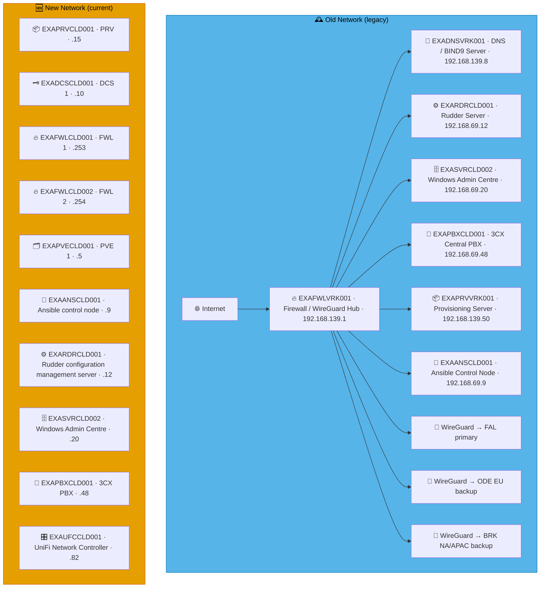
```mermaid
graph TD
    subgraph OLD_CLD ["🕰️ Old Network (legacy)"]
      INET["🌐 Internet"]
      FWLCLD["🔥 EXAFWLVRK001 · Firewall / WireGuard Hub · 192.168.139.1"]
      DNS["🧭 EXADNSVRK001 · DNS / BIND9 Server · 192.168.139.8"]
      PRV["📦 EXAPRVVRK001 · Provisioning Server · 192.168.139.50"]
      RUD["⚙️ EXARDRCLD001 · Rudder Server · 192.168.69.12"]
      WAC["🗄️ EXASVRCLD002 · Windows Admin Centre · 192.168.69.20"]
      PBX["🔌 EXAPBXCLD001 · 3CX Central PBX · 192.168.69.48"]
      ANS["🤖 EXAANSCLD001 · Ansible Control Node · 192.168.69.9"]

      VPN_FAL["🔗 WireGuard → FAL primary"]
      VPN_ODE["🔗 WireGuard → ODE EU backup"]
      VPN_BRK["🔗 WireGuard → BRK NA/APAC backup"]

      INET --> FWLCLD
      FWLCLD --> DNS
      FWLCLD --> RUD
      FWLCLD --> WAC
      FWLCLD --> PBX
      FWLCLD --> PRV
      FWLCLD --> ANS
      FWLCLD --> VPN_FAL
      FWLCLD --> VPN_ODE
      FWLCLD --> VPN_BRK

    end
    style OLD_CLD fill:#56B4E9,stroke:#0072B2,color:#000000
    %% GENERATED:NEW-NETWORK:CLD:START
    subgraph NEW_CLD ["🆕 New Network (current)"]
      N_PRV["📦 EXAPRVCLD001 · PRV · .15"]
      N_DCS["🗝️ EXADCSCLD001 · DCS 1 · .10"]
      N_FWL["🔥 EXAFWLCLD001 · FWL 1 · .253"]
      N_FWL2["🔥 EXAFWLCLD002 · FWL 2 · .254"]
      N_PVE["🗂️ EXAPVECLD001 · PVE 1 · .5"]
      N_ANS["🤖 EXAANSCLD001 · Ansible control node · .9"]
      N_RDR["⚙️ EXARDRCLD001 · Rudder configuration management server · .12"]
      N_SVR["🗄️ EXASVRCLD002 · Windows Admin Centre · .20"]
      N_PBX["🔌 EXAPBXCLD001 · 3CX PBX · .48"]
      N_UFC["🎛️ EXAUFCCLD001 · UniFi Network Controller · .82"]
    end
    style NEW_CLD fill:#E69F00,stroke:#D55E00,color:#000000
    %% GENERATED:NEW-NETWORK:CLD:END
```

---

---

## 🏴󠁧󠁢󠁳󠁣󠁴󠁿 Scotland

---

## FAL — Falkirk *(Head Office)* ⭐

**Address:** Brockville Stadium, Hope Street, Falkirk  
**LAN:** `192.168.76.0/24` · **VPN:** `10.0.76.0/24` · **Domain:** `example.net`  
**PVE nodes:** 3 (hub) · **VPN parent:** CLD (primary head node)  
**Entity:** Example Music (Scotland) Ltd · **Landline:** +44 1324 500 0xxx · **Mobile:** +44 7700 903 2xxx

```mermaid
graph TD
    subgraph OLD_FAL ["🕰️ Old Network (legacy)"]
      INET["🌐 Internet"]
      RTR["📡 EXARTRFAL001 · Cisco ISR 4331 · .254"]
      FWL["🔥 EXAFWLFAL001 · FortiOS · .1"]
      SW1["🔀 EXASWIFAL001 · Cisco 9300 · .250"]
      SW2["🔀 EXASWIFAL002 · Cisco 9300 · .251"]

      subgraph BMC ["BMC Pool"]
          RAC1["🔧 EXARACFAL001 · Dell iDRAC9 · .2"]
          RAC2["🔧 EXARACFAL002 · Dell iDRAC9 · .3"]
          RAC3["🔧 EXARACFAL003 · Dell iDRAC9 · .4"]
      end

      subgraph PVE ["Proxmox Cluster (3-node)"]
          PVE1["🗂️ EXAPVEFAL001 · Proxmox node 1 · .5"]
          PVE2["🗂️ EXAPVEFAL002 · Proxmox node 2 · .6"]
          PVE3["🗂️ EXAPVEFAL003 · Proxmox node 3 · .7"]
      end

      subgraph DC ["Domain Controllers"]
          DC1["🗝️ EXADCSFAL001 · DC · PDC Emulator · .10"]
          DC2["🗝️ EXADCSFAL002 · DC secondary · .11"]
      end

      subgraph INFRA ["Infrastructure"]
          SBC["🛡️ EXASBCFAL001 · 3CX SBC → CLD PBX · .48"]
          RRY["🔁 EXARRYFAL001 · Rudder Relay · .12"]
          NAS["🗃️ EXANASFAL001 · FreeNAS 13.0-U6 · .32"]
          TAR["💽 EXATARFAL001 · Tape Archiver · .33"]
      end

      subgraph ENDPOINTS ["Endpoints"]
          WKS1["🖥️ EXAWKSFAL001 · Mixing Desk WKS · .100"]
          WKS2["🖥️ EXAWKSFAL002 · Reel-to-Reel WKS · .101"]
          WKS3["🖥️ EXAWKSFAL003 · Shared Editing WKS · .102"]
          LAP["💻 EXALAPFAL001 · Production Laptop · .103"]
          SUR["🖊️ EXASURFAL001 · Microsoft Surface · .104"]
          PHN["📞 EXAPHNFAL001-003 · Staff Phones"]
          PHN2["📞 EXAPHNFAL006-007 · Yealink T58A"]
          TAB["📱 EXATABFAL001 · Tablet"]
      end

      subgraph WAP_CAM ["Wireless & Security"]
          WAP["WAPs x6 · Ubiquiti UniFi U6-Pro · .5-.10"]
          CAM1["🎥 EXACAMFAL001 · Axis · Front entrance · .70"]
          CAM2["🎥 EXACAMFAL002 · Axis · Studio hallway · .71"]
          CAM3["🎥 EXACAMFAL003 · Axis · Car park · .72"]
          CAM4["🎥 EXACAMFAL004 · Axis · Loading bay · .73"]
          RDR["⚙️ EXARDRFAL001 · HID Signo Badge Reader · .16"]
      end

      subgraph SITE ["Site-Specific Equipment"]
          LCD["🖼️ EXALCDFAL001 · Samsung Tizen Display · .50"]
          VCU["🎧 EXAVCUFAL001 · Poly Studio X70 · .51"]
          JKB["💿 EXAMUSFAL001 · Pureline 128V Jukebox · .67"]
          PAY["☎️ EXAPAYFAL001 · GPO Kiosk No.6 Payphone · .95"]
          COF["🫖 EXATEAFAL001 · Smart Coffee Machine · .61"]
          VND1["🍩 EXADONFAL001 · Tim Hortons Vending · .62"]
          VND2["🍫 EXAVNDFAL002 · Irn-Bru Machine · .63"]
          VND3["🍫 EXAVNDFAL003 · McCowans Dispenser · .64"]
          VND4["🍫 EXAVNDFAL004 · Mrs Tily Dispenser · .65"]
          VND5["🍫 EXAVNDFAL005 · ¼lb Confectionery · .66"]
          PMP["⛽ EXAPMPFAL001 · Networked Petrol Pump · .60"]
          CLK["⏰ EXACLKFAL001 · NTP Clock · .80"]
      end

      VPN_CLD["🔗 WireGuard ← CLD · 10.0.76.0/24"]

      INET --> RTR --> FWL --> SW1 & SW2
      SW1 --> PVE1 & PVE2 & PVE3
      SW1 --> DC1 & DC2
      SW1 --> SBC & NAS & TAR
      SW2 --> WKS1
      SW2 --> WAP
      SW2 --> LCD
      RAC1 -.->|"manages"| PVE1
      RAC2 -.->|"manages"| PVE2
      RAC3 -.->|"manages"| PVE3
      FWL <-->|"WireGuard tunnel"| VPN_CLD

      SW1 --> RRY
      RRY -. "→ EXARDRCLD001" .-> VPN_CLD
    end
    style OLD_FAL fill:#56B4E9,stroke:#0072B2,color:#000000
    %% GENERATED:NEW-NETWORK:FAL:START
    subgraph NEW_FAL ["🆕 New Network (current)"]
      N_RTR["📡 EXARTRFAL001 · RTR · .1"]
      N_PRV["📦 EXAPRVFAL001 · PRV · .15"]
      N_SBC["🛡️ EXASBCFAL001 · SBC · .48"]
      N_DCS["🗝️ EXADCSFAL001 · DCS 1 · .10"]
      N_FWL["🔥 EXAFWLFAL001 · FWL 1 · .253"]
      N_FWL2["🔥 EXAFWLFAL002 · FWL 2 · .254"]
      N_PVE["🗂️ EXAPVEFAL001 · PVE 1 · .5"]
      N_RDR["⚙️ EXARDRFAL001 · HID Signo badge reader · .16"]
      N_SRV["🗄️ EXASRVFAL001 · Reserved · .20"]
      N_NAS["🗃️ EXANASFAL001 · Primary storage · .32"]
      N_TAR["💽 EXATARFAL001 · Legacy tape archive · .33"]
      N_LCD["🖼️ EXALCDFAL001 · Reception display · .50"]
      N_VCU["🎧 EXAVCUFAL001 · Video conferencing · .51"]
      N_PMP["⛽ EXAPMPFAL001 · Networked petrol pump · .60"]
      N_TEA["🫖 EXATEAFAL001 · Smart coffee machine · .61"]
      N_DON["🍩 EXADONFAL001 · Donut vending · .62"]
      N_VND["🍫 EXAVNDFAL002 · Vending machine · .63"]
      N_VND2["🍫 EXAVNDFAL003 · Vending machine · .64"]
      N_VND3["🍫 EXAVNDFAL004 · Vending machine · .65"]
      N_VND4["🍫 EXAVNDFAL005 · Confectionery machine · .66"]
      N_MUS["💿 EXAMUSFAL001 · Jukebox · .67"]
      N_CAM["🎥 EXACAMFAL001 · Camera front entrance · .70"]
      N_CAM2["🎥 EXACAMFAL002 · Camera studio hallway · .71"]
      N_CAM3["🎥 EXACAMFAL003 · Camera car park · .72"]
      N_CAM4["🎥 EXACAMFAL004 · Camera rear loading bay · .73"]
      N_CLK["⏰ EXACLKFAL001 · Embedded NTP clock · .80"]
      N_PAY["☎️ EXAPAYFAL001 · GPO Kiosk No.6 payphone · .95"]
      N_WKS["🖥️ EXAWKSFAL001 · Workstation Analog Mixing Desk v1 · .100"]
      N_WKS2["🖥️ EXAWKSFAL003 · Workstation shared editing · .102"]
      N_LAP["💻 EXALAPFAL001 · Production laptop · .103"]
      N_SUR["🖊️ EXASURFAL001 · Microsoft Surface · .104"]
      N_SWI["🔀 EXASWIFAL001 · Core switch 1 · .250"]
      N_SWI2["🔀 EXASWIFAL002 · Core switch 2 · .251"]
      N_PHN["📞 EXAPHNFAL001 · Phone 1"]
      N_PHN2["📞 EXAPHNFAL002 · Phone 2"]
      N_PHN3["📞 EXAPHNFAL003 · Phone 3"]
      N_PHN4["📞 EXAPHNFAL006 · Phone 6"]
      N_PHN5["📞 EXAPHNFAL007 · Phone 7"]
      N_TAB["📱 EXATABFAL001 · Tablet"]
      N_TTY["⌨️ EXATTYFAL001 · VT320 serial terminal"]
      N_BUS["🚌 EXABUSFAL001 · Tour bus 1"]
      N_BUS2["🚌 EXABUSFAL002 · Tour bus 2"]
      N_BUS3["🚌 EXABUSFAL003 · Tour bus 3"]
      N_CAR["🚗 EXACARFAL001 · Car 1"]
      N_CAR2["🚗 EXACARFAL002 · Car 2"]
      N_CAR3["🚗 EXACARFAL003 · Car 3"]
      N_CAR4["🚗 EXACARFAL004 · Car 4"]
      N_CAR5["🚗 EXACARFAL005 · Car 5"]
      N_TRK["🚚 EXATRKFAL001 · Truck 1"]
      N_TRK2["🚚 EXATRKFAL002 · Truck 2"]
      N_TRK3["🚚 EXATRKFAL003 · Truck 3"]
      N_TRK4["🚚 EXATRKFAL004 · Truck 4"]
      N_TRK5["🚚 EXATRKFAL005 · Truck 5"]
      N_JET["✈️ EXAJETFAL001 · Jet 1"]
      N_JET2["✈️ EXAJETFAL002 · Jet 2"]
      N_JET3["✈️ EXAJETFAL003 · Jet 3"]
      N_JET4["✈️ EXAJETFAL004 · Jet 4"]
      N_JET5["✈️ EXAJETFAL005 · Jet 5"]
    end
    style NEW_FAL fill:#E69F00,stroke:#D55E00,color:#000000
    %% GENERATED:NEW-NETWORK:FAL:END
```

---

## EDI — Edinburgh ⚠️

**LAN:** `192.168.131.0/24` · **Domain:** `example.org` / `example.net`  
**PVE nodes:** 1 · **VPN parent:** FAL  
> ⚠️ `EXADCSEDI003` — DFSR stopped, C: drive at 5% free. Immediate action required.  
**Entity:** Example Music (Scotland) Ltd · **Landline:** +44 131 496 0xxx · **Mobile:** +44 770 090 3xxx

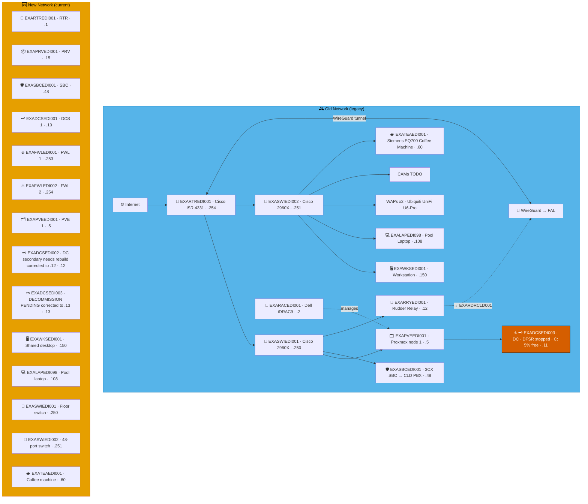
```mermaid
graph TD
    subgraph OLD_EDI ["🕰️ Old Network (legacy)"]
      INET["🌐 Internet"]
      RTR["📡 EXARTREDI001 · Cisco ISR 4331 · .254"]
      SW1["🔀 EXASWIEDI001 · Cisco 2960X · .250"]
      SW2["🔀 EXASWIEDI002 · Cisco 2960X · .251"]
      RAC["🔧 EXARACEDI001 · Dell iDRAC9 · .2"]
      PVE["🗂️ EXAPVEEDI001 · Proxmox node 1 · .5"]
      DC["⚠️ 🗝️ EXADCSEDI003 · DC · DFSR stopped · C: 5% free · .11"]
      SBC["🛡️ EXASBCEDI001 · 3CX SBC → CLD PBX · .48"]
      RRY["🔁 EXARRYEDI001 · Rudder Relay · .12"]
      WKS["🖥️ EXAWKSEDI001 · Workstation · .150"]
      LAP["💻 EXALAPEDI098 · Pool Laptop · .108"]
      WAP["WAPs x2 · Ubiquiti UniFi U6-Pro"]
      CAM["CAMs TODO"]
      COF["🫖 EXATEAEDI001 · Siemens EQ700 Coffee Machine · .60"]
      VPN["🔗 WireGuard → FAL"]

      INET --> RTR --> SW1 & SW2
      SW1 --> PVE --> DC
      SW1 --> SBC
      RAC -.->|"manages"| PVE
      SW2 --> WKS & LAP & WAP & CAM & COF
      RTR <-->|"WireGuard tunnel"| VPN

      SW1 --> RRY
      RRY -. "→ EXARDRCLD001" .-> VPN
    end
    style OLD_EDI fill:#56B4E9,stroke:#0072B2,color:#000000
    %% GENERATED:NEW-NETWORK:EDI:START
    subgraph NEW_EDI ["🆕 New Network (current)"]
      N_RTR["📡 EXARTREDI001 · RTR · .1"]
      N_PRV["📦 EXAPRVEDI001 · PRV · .15"]
      N_SBC["🛡️ EXASBCEDI001 · SBC · .48"]
      N_DCS["🗝️ EXADCSEDI001 · DCS 1 · .10"]
      N_FWL["🔥 EXAFWLEDI001 · FWL 1 · .253"]
      N_FWL2["🔥 EXAFWLEDI002 · FWL 2 · .254"]
      N_PVE["🗂️ EXAPVEEDI001 · PVE 1 · .5"]
      N_DCS2["🗝️ EXADCSEDI002 · DC secondary needs rebuild corrected to .12 · .12"]
      N_DCS3["🗝️ EXADCSEDI003 · DECOMMISSION PENDING corrected to .13 · .13"]
      N_WKS["🖥️ EXAWKSEDI001 · Shared desktop · .150"]
      N_LAP["💻 EXALAPEDI098 · Pool laptop · .108"]
      N_SWI["🔀 EXASWIEDI001 · Floor switch · .250"]
      N_SWI2["🔀 EXASWIEDI002 · 48-port switch · .251"]
      N_TEA["🫖 EXATEAEDI001 · Coffee machine · .60"]
    end
    style NEW_EDI fill:#E69F00,stroke:#D55E00,color:#000000
    %% GENERATED:NEW-NETWORK:EDI:END
    classDef warn fill:#D55E00,stroke:#000000,color:#ffffff
    class DC warn
```

---

## GLA — Glasgow

**LAN:** `192.168.141.0/24` · **Domain:** `example.net`  
**PVE nodes:** 1 · **VPN parent:** FAL  
**Entity:** Example Music (Scotland) Ltd · **Landline:** +44 141 496 01xx · **Mobile:** +44 770 009 4xxx

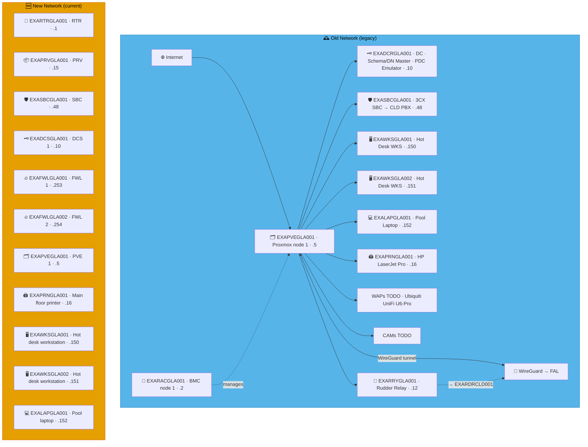
```mermaid
graph TD
    subgraph OLD_GLA ["🕰️ Old Network (legacy)"]
      INET["🌐 Internet"]
      PVE["🗂️ EXAPVEGLA001 · Proxmox node 1 · .5"]
      RAC["🔧 EXARACGLA001 · BMC node 1 · .2"]
      DC["🗝️ EXADCRGLA001 · DC · Schema/DN Master · PDC Emulator · .10"]
      SBC["🛡️ EXASBCGLA001 · 3CX SBC → CLD PBX · .48"]
      RRY["🔁 EXARRYGLA001 · Rudder Relay · .12"]
      WKS1["🖥️ EXAWKSGLA001 · Hot Desk WKS · .150"]
      WKS2["🖥️ EXAWKSGLA002 · Hot Desk WKS · .151"]
      LAP["💻 EXALAPGLA001 · Pool Laptop · .152"]
      PRN["🖨️ EXAPRNGLA001 · HP LaserJet Pro · .16"]
      WAP["WAPs TODO · Ubiquiti UniFi U6-Pro"]
      CAM["CAMs TODO"]
      VPN["🔗 WireGuard → FAL"]

      INET --> PVE
      PVE --> DC & SBC
      RAC -.->|"manages"| PVE
      PVE --> WKS1 & WKS2 & LAP & PRN & WAP & CAM
      PVE <-->|"WireGuard tunnel"| VPN

      PVE --> RRY
      RRY -. "→ EXARDRCLD001" .-> VPN
    end
    style OLD_GLA fill:#56B4E9,stroke:#0072B2,color:#000000
    %% GENERATED:NEW-NETWORK:GLA:START
    subgraph NEW_GLA ["🆕 New Network (current)"]
      N_RTR["📡 EXARTRGLA001 · RTR · .1"]
      N_PRV["📦 EXAPRVGLA001 · PRV · .15"]
      N_SBC["🛡️ EXASBCGLA001 · SBC · .48"]
      N_DCS["🗝️ EXADCSGLA001 · DCS 1 · .10"]
      N_FWL["🔥 EXAFWLGLA001 · FWL 1 · .253"]
      N_FWL2["🔥 EXAFWLGLA002 · FWL 2 · .254"]
      N_PVE["🗂️ EXAPVEGLA001 · PVE 1 · .5"]
      N_PRN["🖨️ EXAPRNGLA001 · Main floor printer · .16"]
      N_WKS["🖥️ EXAWKSGLA001 · Hot desk workstation · .150"]
      N_WKS2["🖥️ EXAWKSGLA002 · Hot desk workstation · .151"]
      N_LAP["💻 EXALAPGLA001 · Pool laptop · .152"]
    end
    style NEW_GLA fill:#E69F00,stroke:#D55E00,color:#000000
    %% GENERATED:NEW-NETWORK:GLA:END
```

---

## CLY — Clydebank

**LAN:** `192.168.41.0/24` · **Domain:** `example.net`  
**PVE nodes:** 1 · **VPN parent:** FAL  
**Entity:** Example Music (Scotland) Ltd · **Landline:** +44 141 496 00xx · **Mobile:** +44 770 090 5xxx

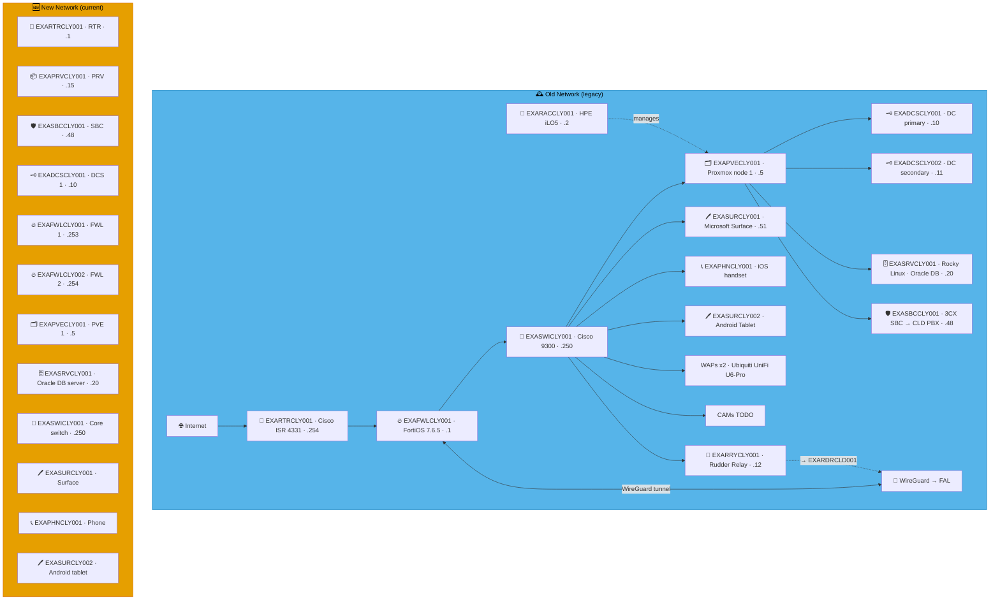
```mermaid
graph TD
    subgraph OLD_CLY ["🕰️ Old Network (legacy)"]
      INET["🌐 Internet"]
      FWL["🔥 EXAFWLCLY001 · FortiOS 7.6.5 · .1"]
      RTR["📡 EXARTRCLY001 · Cisco ISR 4331 · .254"]
      SW["🔀 EXASWICLY001 · Cisco 9300 · .250"]
      RAC["🔧 EXARACCLY001 · HPE iLO5 · .2"]
      PVE["🗂️ EXAPVECLY001 · Proxmox node 1 · .5"]
      DC1["🗝️ EXADCSCLY001 · DC primary · .10"]
      DC2["🗝️ EXADCSCLY002 · DC secondary · .11"]
      SRV["🗄️ EXASRVCLY001 · Rocky Linux · Oracle DB · .20"]
      SBC["🛡️ EXASBCCLY001 · 3CX SBC → CLD PBX · .48"]
      RRY["🔁 EXARRYCLY001 · Rudder Relay · .12"]
      SUR["🖊️ EXASURCLY001 · Microsoft Surface · .51"]
      PHN["📞 EXAPHNCLY001 · iOS handset"]
      TAB["🖊️ EXASURCLY002 · Android Tablet"]
      WAP["WAPs x2 · Ubiquiti UniFi U6-Pro"]
      CAM["CAMs TODO"]
      VPN["🔗 WireGuard → FAL"]

      INET --> RTR --> FWL --> SW
      SW --> PVE --> DC1 & DC2 & SRV & SBC
      RAC -.->|"manages"| PVE
      SW --> SUR & PHN & TAB & WAP & CAM
      FWL <-->|"WireGuard tunnel"| VPN

      SW --> RRY
      RRY -. "→ EXARDRCLD001" .-> VPN
    end
    style OLD_CLY fill:#56B4E9,stroke:#0072B2,color:#000000
    %% GENERATED:NEW-NETWORK:CLY:START
    subgraph NEW_CLY ["🆕 New Network (current)"]
      N_RTR["📡 EXARTRCLY001 · RTR · .1"]
      N_PRV["📦 EXAPRVCLY001 · PRV · .15"]
      N_SBC["🛡️ EXASBCCLY001 · SBC · .48"]
      N_DCS["🗝️ EXADCSCLY001 · DCS 1 · .10"]
      N_FWL["🔥 EXAFWLCLY001 · FWL 1 · .253"]
      N_FWL2["🔥 EXAFWLCLY002 · FWL 2 · .254"]
      N_PVE["🗂️ EXAPVECLY001 · PVE 1 · .5"]
      N_SRV["🗄️ EXASRVCLY001 · Oracle DB server · .20"]
      N_SWI["🔀 EXASWICLY001 · Core switch · .250"]
      N_SUR["🖊️ EXASURCLY001 · Surface"]
      N_PHN["📞 EXAPHNCLY001 · Phone"]
      N_SUR2["🖊️ EXASURCLY002 · Android tablet"]
    end
    style NEW_CLY fill:#E69F00,stroke:#D55E00,color:#000000
    %% GENERATED:NEW-NETWORK:CLY:END
```

---

## DUN — Dundee

**LAN:** `192.168.138.0/24` · **Domain:** `example.net`  
**PVE nodes:** 1 · **VPN parent:** FAL  
**Entity:** Example Music (Scotland) Ltd · **Landline:** +44 163 249 60xx · **Mobile:** +44 770 090 82xx

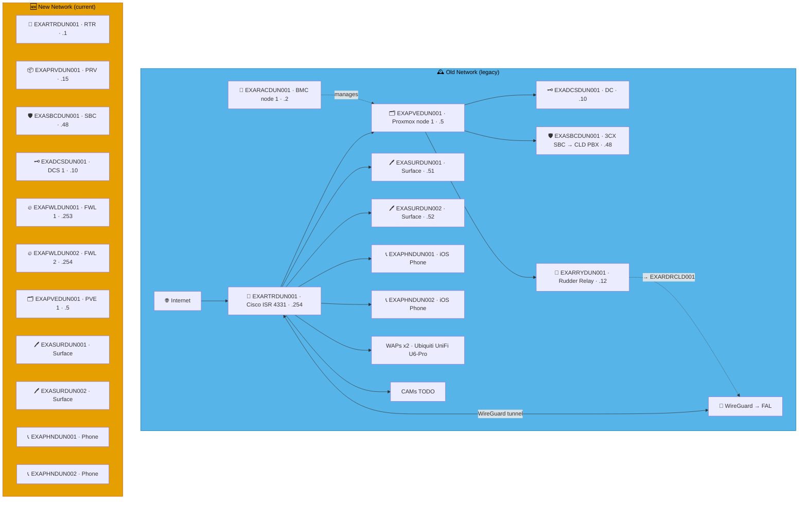
```mermaid
graph TD
    subgraph OLD_DUN ["🕰️ Old Network (legacy)"]
      INET["🌐 Internet"]
      RTR["📡 EXARTRDUN001 · Cisco ISR 4331 · .254"]
      RAC["🔧 EXARACDUN001 · BMC node 1 · .2"]
      PVE["🗂️ EXAPVEDUN001 · Proxmox node 1 · .5"]
      DC["🗝️ EXADCSDUN001 · DC · .10"]
      SBC["🛡️ EXASBCDUN001 · 3CX SBC → CLD PBX · .48"]
      RRY["🔁 EXARRYDUN001 · Rudder Relay · .12"]
      SUR1["🖊️ EXASURDUN001 · Surface · .51"]
      SUR2["🖊️ EXASURDUN002 · Surface · .52"]
      PHN1["📞 EXAPHNDUN001 · iOS Phone"]
      PHN2["📞 EXAPHNDUN002 · iOS Phone"]
      WAP["WAPs x2 · Ubiquiti UniFi U6-Pro"]
      CAM["CAMs TODO"]
      VPN["🔗 WireGuard → FAL"]

      INET --> RTR --> PVE
      PVE --> DC & SBC
      RAC -.->|"manages"| PVE
      RTR --> SUR1 & SUR2 & PHN1 & PHN2 & WAP & CAM
      RTR <-->|"WireGuard tunnel"| VPN

      PVE --> RRY
      RRY -. "→ EXARDRCLD001" .-> VPN
    end
    style OLD_DUN fill:#56B4E9,stroke:#0072B2,color:#000000
    %% GENERATED:NEW-NETWORK:DUN:START
    subgraph NEW_DUN ["🆕 New Network (current)"]
      N_RTR["📡 EXARTRDUN001 · RTR · .1"]
      N_PRV["📦 EXAPRVDUN001 · PRV · .15"]
      N_SBC["🛡️ EXASBCDUN001 · SBC · .48"]
      N_DCS["🗝️ EXADCSDUN001 · DCS 1 · .10"]
      N_FWL["🔥 EXAFWLDUN001 · FWL 1 · .253"]
      N_FWL2["🔥 EXAFWLDUN002 · FWL 2 · .254"]
      N_PVE["🗂️ EXAPVEDUN001 · PVE 1 · .5"]
      N_SUR["🖊️ EXASURDUN001 · Surface"]
      N_SUR2["🖊️ EXASURDUN002 · Surface"]
      N_PHN["📞 EXAPHNDUN001 · Phone"]
      N_PHN2["📞 EXAPHNDUN002 · Phone"]
    end
    style NEW_DUN fill:#E69F00,stroke:#D55E00,color:#000000
    %% GENERATED:NEW-NETWORK:DUN:END
```

---

## PER — Perth

**LAN:** `192.168.173.0/24` · **Domain:** `example.net`  
**PVE nodes:** 1 · **VPN parent:** FAL  
**Entity:** Example Music (Scotland) Ltd · **Landline:** +44 173 849 60xx · **Mobile:** +44 770 0173 0xx

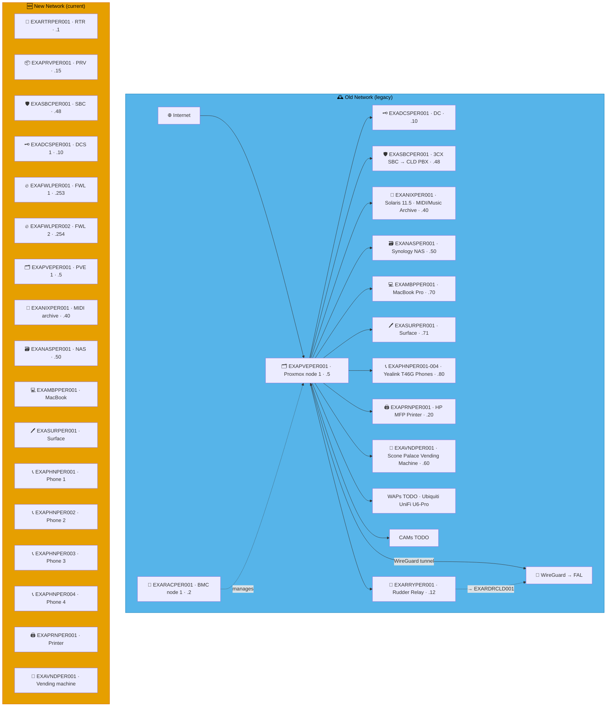
```mermaid
graph TD
    subgraph OLD_PER ["🕰️ Old Network (legacy)"]
      INET["🌐 Internet"]
      RAC["🔧 EXARACPER001 · BMC node 1 · .2"]
      PVE["🗂️ EXAPVEPER001 · Proxmox node 1 · .5"]
      DC["🗝️ EXADCSPER001 · DC · .10"]
      SBC["🛡️ EXASBCPER001 · 3CX SBC → CLD PBX · .48"]
      RRY["🔁 EXARRYPER001 · Rudder Relay · .12"]
      NIX["🐧 EXANIXPER001 · Solaris 11.5 · MIDI/Music Archive · .40"]
      NAS["🗃️ EXANASPER001 · Synology NAS · .50"]
      MBP["💻 EXAMBPPER001 · MacBook Pro · .70"]
      SUR["🖊️ EXASURPER001 · Surface · .71"]
      PHN["📞 EXAPHNPER001-004 · Yealink T46G Phones · .80"]
      PRN["🖨️ EXAPRNPER001 · HP MFP Printer · .20"]
      VND["🍫 EXAVNDPER001 · Scone Palace Vending Machine · .60"]
      WAP["WAPs TODO · Ubiquiti UniFi U6-Pro"]
      CAM["CAMs TODO"]
      VPN["🔗 WireGuard → FAL"]

      INET --> PVE
      PVE --> DC & SBC & NIX & NAS
      RAC -.->|"manages"| PVE
      PVE --> MBP & SUR & PHN & PRN & VND & WAP & CAM
      PVE <-->|"WireGuard tunnel"| VPN

      PVE --> RRY
      RRY -. "→ EXARDRCLD001" .-> VPN
    end
    style OLD_PER fill:#56B4E9,stroke:#0072B2,color:#000000
    %% GENERATED:NEW-NETWORK:PER:START
    subgraph NEW_PER ["🆕 New Network (current)"]
      N_RTR["📡 EXARTRPER001 · RTR · .1"]
      N_PRV["📦 EXAPRVPER001 · PRV · .15"]
      N_SBC["🛡️ EXASBCPER001 · SBC · .48"]
      N_DCS["🗝️ EXADCSPER001 · DCS 1 · .10"]
      N_FWL["🔥 EXAFWLPER001 · FWL 1 · .253"]
      N_FWL2["🔥 EXAFWLPER002 · FWL 2 · .254"]
      N_PVE["🗂️ EXAPVEPER001 · PVE 1 · .5"]
      N_NIX["🐧 EXANIXPER001 · MIDI archive · .40"]
      N_NAS["🗃️ EXANASPER001 · NAS · .50"]
      N_MBP["💻 EXAMBPPER001 · MacBook"]
      N_SUR["🖊️ EXASURPER001 · Surface"]
      N_PHN["📞 EXAPHNPER001 · Phone 1"]
      N_PHN2["📞 EXAPHNPER002 · Phone 2"]
      N_PHN3["📞 EXAPHNPER003 · Phone 3"]
      N_PHN4["📞 EXAPHNPER004 · Phone 4"]
      N_PRN["🖨️ EXAPRNPER001 · Printer"]
      N_VND["🍫 EXAVNDPER001 · Vending machine"]
    end
    style NEW_PER fill:#E69F00,stroke:#D55E00,color:#000000
    %% GENERATED:NEW-NETWORK:PER:END
```

---

## ABD — Aberdeen

**LAN:** `192.168.224.0/24` · **Domain:** `example.org`  
**PVE nodes:** 1 · **VPN parent:** FAL  
**Entity:** Example Music (Scotland) Ltd · **Landline:** +44 1224 496 0xxx · **Mobile:** +44 7700 900 2xxx

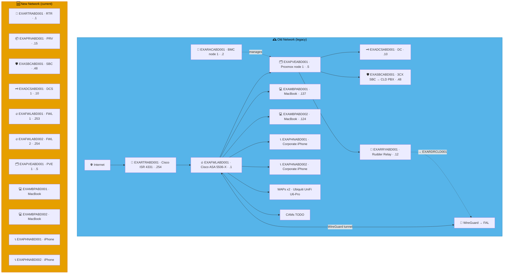
```mermaid
graph TD
    subgraph OLD_ABD ["🕰️ Old Network (legacy)"]
      INET["🌐 Internet"]
      FWL["🔥 EXAFWLABD001 · Cisco ASA 5506-X · .1"]
      RTR["📡 EXARTRABD001 · Cisco ISR 4331 · .254"]
      RAC["🔧 EXARACABD001 · BMC node 1 · .2"]
      PVE["🗂️ EXAPVEABD001 · Proxmox node 1 · .5"]
      DC["🗝️ EXADCSABD001 · DC · .10"]
      SBC["🛡️ EXASBCABD001 · 3CX SBC → CLD PBX · .48"]
      RRY["🔁 EXARRYABD001 · Rudder Relay · .12"]
      MBP1["💻 EXAMBPABD001 · MacBook · .137"]
      MBP2["💻 EXAMBPABD002 · MacBook · .124"]
      PHN1["📞 EXAPHNABD001 · Corporate iPhone"]
      PHN2["📞 EXAPHNABD002 · Corporate iPhone"]
      WAP["WAPs x2 · Ubiquiti UniFi U6-Pro"]
      CAM["CAMs TODO"]
      VPN["🔗 WireGuard → FAL"]

      INET --> RTR --> FWL --> PVE
      PVE --> DC & SBC
      RAC -.->|"manages"| PVE
      FWL --> MBP1 & MBP2 & PHN1 & PHN2 & WAP & CAM
      FWL <-->|"WireGuard tunnel"| VPN

      PVE --> RRY
      RRY -. "→ EXARDRCLD001" .-> VPN
    end
    style OLD_ABD fill:#56B4E9,stroke:#0072B2,color:#000000
    %% GENERATED:NEW-NETWORK:ABD:START
    subgraph NEW_ABD ["🆕 New Network (current)"]
      N_RTR["📡 EXARTRABD001 · RTR · .1"]
      N_PRV["📦 EXAPRVABD001 · PRV · .15"]
      N_SBC["🛡️ EXASBCABD001 · SBC · .48"]
      N_DCS["🗝️ EXADCSABD001 · DCS 1 · .10"]
      N_FWL["🔥 EXAFWLABD001 · FWL 1 · .253"]
      N_FWL2["🔥 EXAFWLABD002 · FWL 2 · .254"]
      N_PVE["🗂️ EXAPVEABD001 · PVE 1 · .5"]
      N_MBP["💻 EXAMBPABD001 · MacBook"]
      N_MBP2["💻 EXAMBPABD002 · MacBook"]
      N_PHN["📞 EXAPHNABD001 · iPhone"]
      N_PHN2["📞 EXAPHNABD002 · iPhone"]
    end
    style NEW_ABD fill:#E69F00,stroke:#D55E00,color:#000000
    %% GENERATED:NEW-NETWORK:ABD:END
```

---

---

## 🏴󠁧󠁢󠁥󠁮󠁧󠁿 England

---

## LND — London

**LAN:** `192.168.20.0/24` · **Domain:** `example.net`  
**PVE nodes:** 1 · **VPN parent:** FAL  
**Entity:** Example Music (England) Ltd · **Landline:** +44 207 496 0xxx · **Mobile:** +44 770 090 0xxx

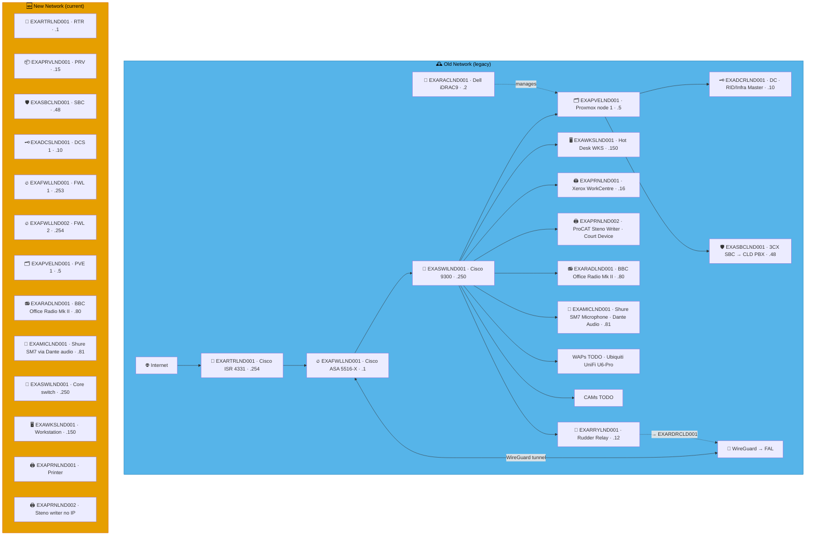
```mermaid
graph TD
    subgraph OLD_LND ["🕰️ Old Network (legacy)"]
      INET["🌐 Internet"]
      FWL["🔥 EXAFWLLND001 · Cisco ASA 5516-X · .1"]
      SW["🔀 EXASWILND001 · Cisco 9300 · .250"]
      RTR["📡 EXARTRLND001 · Cisco ISR 4331 · .254"]
      RAC["🔧 EXARACLND001 · Dell iDRAC9 · .2"]
      PVE["🗂️ EXAPVELND001 · Proxmox node 1 · .5"]
      DC["🗝️ EXADCRLND001 · DC · RID/Infra Master · .10"]
      SBC["🛡️ EXASBCLND001 · 3CX SBC → CLD PBX · .48"]
      RRY["🔁 EXARRYLND001 · Rudder Relay · .12"]
      WKS["🖥️ EXAWKSLND001 · Hot Desk WKS · .150"]
      PRN1["🖨️ EXAPRNLND001 · Xerox WorkCentre · .16"]
      PRN2["🖨️ EXAPRNLND002 · ProCAT Steno Writer · Court Device"]
      RAD["📻 EXARADLND001 · BBC Office Radio Mk II · .80"]
      MIC["🎤 EXAMICLND001 · Shure SM7 Microphone · Dante Audio · .81"]
      WAP["WAPs TODO · Ubiquiti UniFi U6-Pro"]
      CAM["CAMs TODO"]
      VPN["🔗 WireGuard → FAL"]

      INET --> RTR --> FWL --> SW
      SW --> PVE --> DC & SBC
      RAC -.->|"manages"| PVE
      SW --> WKS & PRN1 & PRN2 & RAD & MIC & WAP & CAM
      FWL <-->|"WireGuard tunnel"| VPN

      SW --> RRY
      RRY -. "→ EXARDRCLD001" .-> VPN
    end
    style OLD_LND fill:#56B4E9,stroke:#0072B2,color:#000000
    %% GENERATED:NEW-NETWORK:LND:START
    subgraph NEW_LND ["🆕 New Network (current)"]
      N_RTR["📡 EXARTRLND001 · RTR · .1"]
      N_PRV["📦 EXAPRVLND001 · PRV · .15"]
      N_SBC["🛡️ EXASBCLND001 · SBC · .48"]
      N_DCS["🗝️ EXADCSLND001 · DCS 1 · .10"]
      N_FWL["🔥 EXAFWLLND001 · FWL 1 · .253"]
      N_FWL2["🔥 EXAFWLLND002 · FWL 2 · .254"]
      N_PVE["🗂️ EXAPVELND001 · PVE 1 · .5"]
      N_RAD["📻 EXARADLND001 · BBC Office Radio Mk II · .80"]
      N_MIC["🎤 EXAMICLND001 · Shure SM7 via Dante audio · .81"]
      N_SWI["🔀 EXASWILND001 · Core switch · .250"]
      N_WKS["🖥️ EXAWKSLND001 · Workstation · .150"]
      N_PRN["🖨️ EXAPRNLND001 · Printer"]
      N_PRN2["🖨️ EXAPRNLND002 · Steno writer no IP"]
    end
    style NEW_LND fill:#E69F00,stroke:#D55E00,color:#000000
    %% GENERATED:NEW-NETWORK:LND:END
```

---

## BIR — Birmingham

**LAN:** `192.168.121.0/24` · **Domain:** `example.net`  
**PVE nodes:** 1 · **VPN parent:** FAL  
**Entity:** Example Music (England) Ltd · **Landline:** +44 121 496 0xxx · **Mobile:** +44 7700 900 2xxx

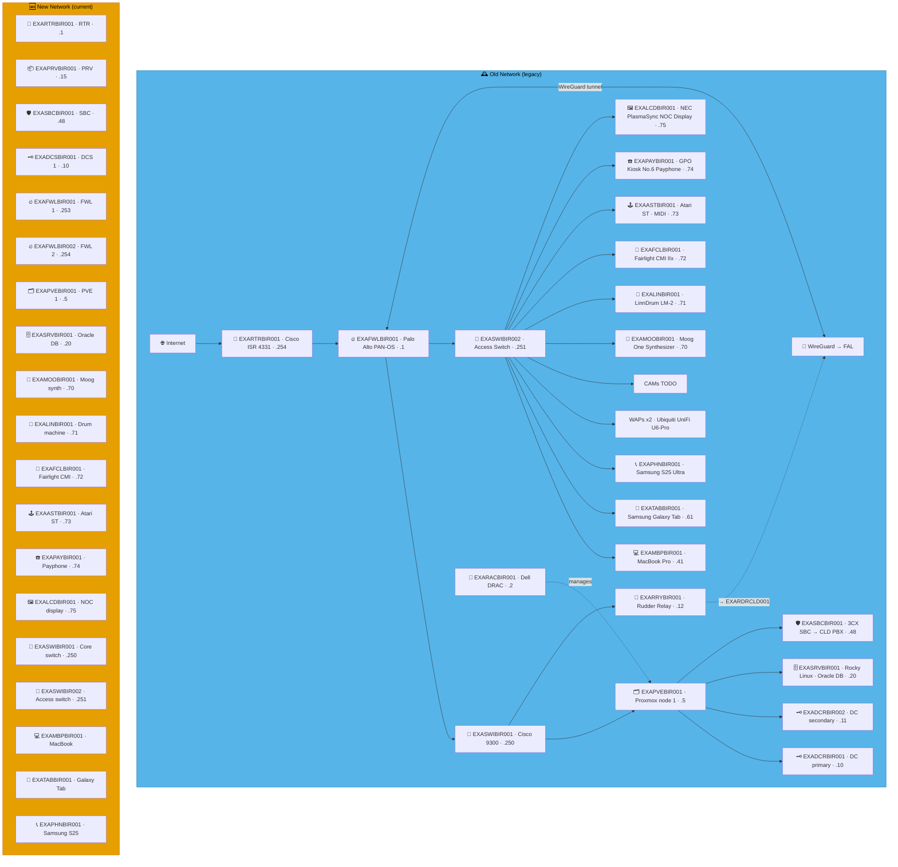
```mermaid
graph TD
    subgraph OLD_BIR ["🕰️ Old Network (legacy)"]
      INET["🌐 Internet"]
      FWL["🔥 EXAFWLBIR001 · Palo Alto PAN-OS · .1"]
      SW1["🔀 EXASWIBIR001 · Cisco 9300 · .250"]
      SW2["🔀 EXASWIBIR002 · Access Switch · .251"]
      RTR["📡 EXARTRBIR001 · Cisco ISR 4331 · .254"]
      RAC["🔧 EXARACBIR001 · Dell DRAC · .2"]
      PVE["🗂️ EXAPVEBIR001 · Proxmox node 1 · .5"]
      DC1["🗝️ EXADCRBIR001 · DC primary · .10"]
      DC2["🗝️ EXADCRBIR002 · DC secondary · .11"]
      SRV["🗄️ EXASRVBIR001 · Rocky Linux · Oracle DB · .20"]
      SBC["🛡️ EXASBCBIR001 · 3CX SBC → CLD PBX · .48"]
      RRY["🔁 EXARRYBIR001 · Rudder Relay · .12"]
      MBP["💻 EXAMBPBIR001 · MacBook Pro · .41"]
      TAB["📱 EXATABBIR001 · Samsung Galaxy Tab · .61"]
      PHN["📞 EXAPHNBIR001 · Samsung S25 Ultra"]
      WAP["WAPs x2 · Ubiquiti UniFi U6-Pro"]
      CAM["CAMs TODO"]
      MOO["🎹 EXAMOOBIR001 · Moog One Synthesizer · .70"]
      LIN["🥁 EXALINBIR001 · LinnDrum LM-2 · .71"]
      FCL["🎹 EXAFCLBIR001 · Fairlight CMI IIx · .72"]
      AST["🕹️ EXAASTBIR001 · Atari ST · MIDI · .73"]
      PAY["☎️ EXAPAYBIR001 · GPO Kiosk No.6 Payphone · .74"]
      LCD["🖼️ EXALCDBIR001 · NEC PlasmaSync NOC Display · .75"]
      VPN["🔗 WireGuard → FAL"]

      INET --> RTR --> FWL --> SW1 & SW2
      SW1 --> PVE --> DC1 & DC2 & SRV & SBC
      RAC -.->|"manages"| PVE
      SW2 --> MBP & TAB & PHN & WAP & CAM
      SW2 --> MOO & LIN & FCL & AST & PAY & LCD
      FWL <-->|"WireGuard tunnel"| VPN

      SW1 --> RRY
      RRY -. "→ EXARDRCLD001" .-> VPN
    end
    style OLD_BIR fill:#56B4E9,stroke:#0072B2,color:#000000
    %% GENERATED:NEW-NETWORK:BIR:START
    subgraph NEW_BIR ["🆕 New Network (current)"]
      N_RTR["📡 EXARTRBIR001 · RTR · .1"]
      N_PRV["📦 EXAPRVBIR001 · PRV · .15"]
      N_SBC["🛡️ EXASBCBIR001 · SBC · .48"]
      N_DCS["🗝️ EXADCSBIR001 · DCS 1 · .10"]
      N_FWL["🔥 EXAFWLBIR001 · FWL 1 · .253"]
      N_FWL2["🔥 EXAFWLBIR002 · FWL 2 · .254"]
      N_PVE["🗂️ EXAPVEBIR001 · PVE 1 · .5"]
      N_SRV["🗄️ EXASRVBIR001 · Oracle DB · .20"]
      N_MOO["🎹 EXAMOOBIR001 · Moog synth · .70"]
      N_LIN["🥁 EXALINBIR001 · Drum machine · .71"]
      N_FCL["🎹 EXAFCLBIR001 · Fairlight CMI · .72"]
      N_AST["🕹️ EXAASTBIR001 · Atari ST · .73"]
      N_PAY["☎️ EXAPAYBIR001 · Payphone · .74"]
      N_LCD["🖼️ EXALCDBIR001 · NOC display · .75"]
      N_SWI["🔀 EXASWIBIR001 · Core switch · .250"]
      N_SWI2["🔀 EXASWIBIR002 · Access switch · .251"]
      N_MBP["💻 EXAMBPBIR001 · MacBook"]
      N_TAB["📱 EXATABBIR001 · Galaxy Tab"]
      N_PHN["📞 EXAPHNBIR001 · Samsung S25"]
    end
    style NEW_BIR fill:#E69F00,stroke:#D55E00,color:#000000
    %% GENERATED:NEW-NETWORK:BIR:END
```

---

## MCR — Manchester

**LAN:** `192.168.161.0/24` · **Domain:** `example.org`  
**PVE nodes:** 1 · **VPN parent:** FAL  
**Entity:** Example Music (England) Ltd · **Landline:** +44 161 715 xxxx · **Mobile:** +44 770 090 6xxx

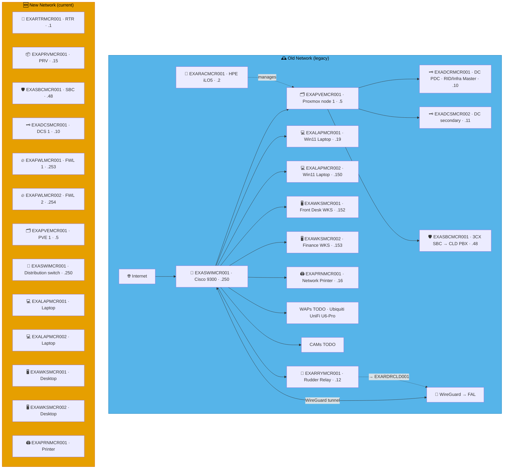
```mermaid
graph TD
    subgraph OLD_MCR ["🕰️ Old Network (legacy)"]
      INET["🌐 Internet"]
      SW["🔀 EXASWIMCR001 · Cisco 9300 · .250"]
      RAC["🔧 EXARACMCR001 · HPE iLO5 · .2"]
      PVE["🗂️ EXAPVEMCR001 · Proxmox node 1 · .5"]
      DC1["🗝️ EXADCRMCR001 · DC PDC · RID/Infra Master · .10"]
      DC2["🗝️ EXADCSMCR002 · DC secondary · .11"]
      SBC["🛡️ EXASBCMCR001 · 3CX SBC → CLD PBX · .48"]
      RRY["🔁 EXARRYMCR001 · Rudder Relay · .12"]
      LAP1["💻 EXALAPMCR001 · Win11 Laptop · .19"]
      LAP2["💻 EXALAPMCR002 · Win11 Laptop · .150"]
      WKS1["🖥️ EXAWKSMCR001 · Front Desk WKS · .152"]
      WKS2["🖥️ EXAWKSMCR002 · Finance WKS · .153"]
      PRN["🖨️ EXAPRNMCR001 · Network Printer · .16"]
      WAP["WAPs TODO · Ubiquiti UniFi U6-Pro"]
      CAM["CAMs TODO"]
      VPN["🔗 WireGuard → FAL"]

      INET --> SW
      SW --> PVE --> DC1 & DC2 & SBC
      RAC -.->|"manages"| PVE
      SW --> LAP1 & LAP2 & WKS1 & WKS2 & PRN & WAP & CAM
      SW <-->|"WireGuard tunnel"| VPN

      SW --> RRY
      RRY -. "→ EXARDRCLD001" .-> VPN
    end
    style OLD_MCR fill:#56B4E9,stroke:#0072B2,color:#000000
    %% GENERATED:NEW-NETWORK:MCR:START
    subgraph NEW_MCR ["🆕 New Network (current)"]
      N_RTR["📡 EXARTRMCR001 · RTR · .1"]
      N_PRV["📦 EXAPRVMCR001 · PRV · .15"]
      N_SBC["🛡️ EXASBCMCR001 · SBC · .48"]
      N_DCS["🗝️ EXADCSMCR001 · DCS 1 · .10"]
      N_FWL["🔥 EXAFWLMCR001 · FWL 1 · .253"]
      N_FWL2["🔥 EXAFWLMCR002 · FWL 2 · .254"]
      N_PVE["🗂️ EXAPVEMCR001 · PVE 1 · .5"]
      N_SWI["🔀 EXASWIMCR001 · Distribution switch · .250"]
      N_LAP["💻 EXALAPMCR001 · Laptop"]
      N_LAP2["💻 EXALAPMCR002 · Laptop"]
      N_WKS["🖥️ EXAWKSMCR001 · Desktop"]
      N_WKS2["🖥️ EXAWKSMCR002 · Desktop"]
      N_PRN["🖨️ EXAPRNMCR001 · Printer"]
    end
    style NEW_MCR fill:#E69F00,stroke:#D55E00,color:#000000
    %% GENERATED:NEW-NETWORK:MCR:END
```

---

## LIV — Liverpool

**LAN:** `192.168.151.0/24` · **Domain:** `example.org`  
**PVE nodes:** 1 · **VPN parent:** FAL  
**Entity:** Example Music (England) Ltd · **Landline:** +44 151 496 0xxx · **Mobile:** +44 770 090 5xxx

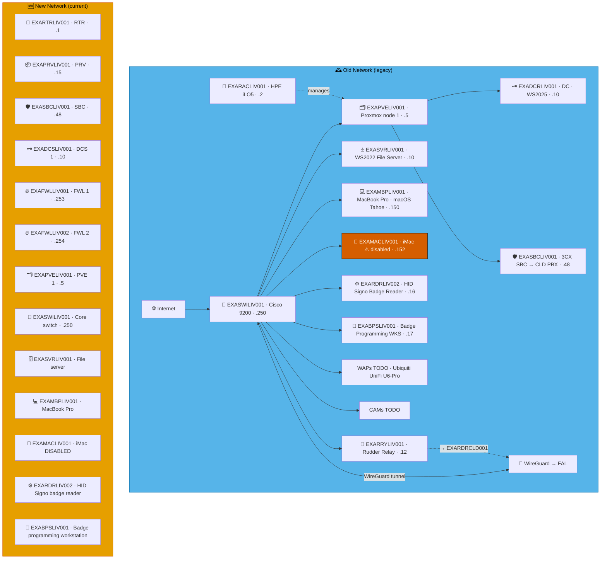
```mermaid
graph TD
    subgraph OLD_LIV ["🕰️ Old Network (legacy)"]
      INET["🌐 Internet"]
      SW["🔀 EXASWILIV001 · Cisco 9200 · .250"]
      RAC["🔧 EXARACLIV001 · HPE iLO5 · .2"]
      PVE["🗂️ EXAPVELIV001 · Proxmox node 1 · .5"]
      DC["🗝️ EXADCRLIV001 · DC · WS2025 · .10"]
      SBC["🛡️ EXASBCLIV001 · 3CX SBC → CLD PBX · .48"]
      RRY["🔁 EXARRYLIV001 · Rudder Relay · .12"]
      SRV["🗄️ EXASVRLIV001 · WS2022 File Server · .10"]
      MBP["💻 EXAMBPLIV001 · MacBook Pro · macOS Tahoe · .150"]
      MAC["🍎 EXAMACLIV001 · iMac ⚠️ disabled · .152"]
      RDR["⚙️ EXARDRLIV002 · HID Signo Badge Reader · .16"]
      BPS["🪪 EXABPSLIV001 · Badge Programming WKS · .17"]
      WAP["WAPs TODO · Ubiquiti UniFi U6-Pro"]
      CAM["CAMs TODO"]
      VPN["🔗 WireGuard → FAL"]

      INET --> SW
      SW --> PVE --> DC & SBC
      RAC -.->|"manages"| PVE
      SW --> SRV & MBP & MAC & RDR & BPS & WAP & CAM
      SW <-->|"WireGuard tunnel"| VPN

      SW --> RRY
      RRY -. "→ EXARDRCLD001" .-> VPN
    end
    style OLD_LIV fill:#56B4E9,stroke:#0072B2,color:#000000
    %% GENERATED:NEW-NETWORK:LIV:START
    subgraph NEW_LIV ["🆕 New Network (current)"]
      N_RTR["📡 EXARTRLIV001 · RTR · .1"]
      N_PRV["📦 EXAPRVLIV001 · PRV · .15"]
      N_SBC["🛡️ EXASBCLIV001 · SBC · .48"]
      N_DCS["🗝️ EXADCSLIV001 · DCS 1 · .10"]
      N_FWL["🔥 EXAFWLLIV001 · FWL 1 · .253"]
      N_FWL2["🔥 EXAFWLLIV002 · FWL 2 · .254"]
      N_PVE["🗂️ EXAPVELIV001 · PVE 1 · .5"]
      N_SWI["🔀 EXASWILIV001 · Core switch · .250"]
      N_SVR["🗄️ EXASVRLIV001 · File server"]
      N_MBP["💻 EXAMBPLIV001 · MacBook Pro"]
      N_MAC["🍎 EXAMACLIV001 · iMac DISABLED"]
      N_RDR["⚙️ EXARDRLIV002 · HID Signo badge reader"]
      N_BPS["🪪 EXABPSLIV001 · Badge programming workstation"]
    end
    style NEW_LIV fill:#E69F00,stroke:#D55E00,color:#000000
    %% GENERATED:NEW-NETWORK:LIV:END
    classDef warn fill:#D55E00,stroke:#000000,color:#ffffff
    class MAC warn
```

---

## NEW — Newcastle

**LAN:** `192.168.191.0/24` · **Domain:** `example.org`  
**PVE nodes:** 1 · **VPN parent:** FAL  
**Entity:** Example Music (England) Ltd · **Landline:** +44 191 496 0xxx · **Mobile:** +44 770 090 9xxx

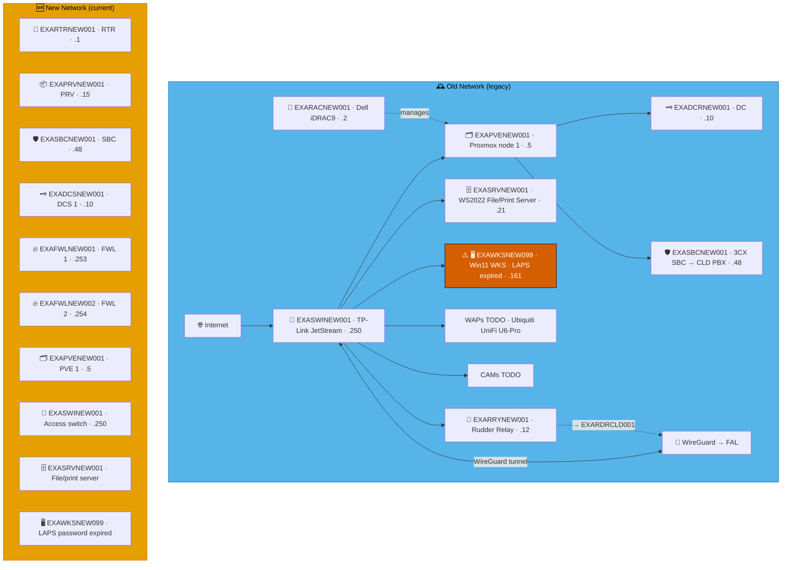
```mermaid
graph TD
    subgraph OLD_NEW ["🕰️ Old Network (legacy)"]
      INET["🌐 Internet"]
      SW["🔀 EXASWINEW001 · TP-Link JetStream · .250"]
      RAC["🔧 EXARACNEW001 · Dell iDRAC9 · .2"]
      PVE["🗂️ EXAPVENEW001 · Proxmox node 1 · .5"]
      DC["🗝️ EXADCRNEW001 · DC · .10"]
      SBC["🛡️ EXASBCNEW001 · 3CX SBC → CLD PBX · .48"]
      RRY["🔁 EXARRYNEW001 · Rudder Relay · .12"]
      SRV["🗄️ EXASRVNEW001 · WS2022 File/Print Server · .21"]
      WKS["⚠️ 🖥️ EXAWKSNEW099 · Win11 WKS · LAPS expired · .161"]
      WAP["WAPs TODO · Ubiquiti UniFi U6-Pro"]
      CAM["CAMs TODO"]
      VPN["🔗 WireGuard → FAL"]

      INET --> SW
      SW --> PVE --> DC & SBC
      RAC -.->|"manages"| PVE
      SW --> SRV & WKS & WAP & CAM
      SW <-->|"WireGuard tunnel"| VPN

      SW --> RRY
      RRY -. "→ EXARDRCLD001" .-> VPN
    end
    style OLD_NEW fill:#56B4E9,stroke:#0072B2,color:#000000
    %% GENERATED:NEW-NETWORK:NEW:START
    subgraph NEW_NEW ["🆕 New Network (current)"]
      N_RTR["📡 EXARTRNEW001 · RTR · .1"]
      N_PRV["📦 EXAPRVNEW001 · PRV · .15"]
      N_SBC["🛡️ EXASBCNEW001 · SBC · .48"]
      N_DCS["🗝️ EXADCSNEW001 · DCS 1 · .10"]
      N_FWL["🔥 EXAFWLNEW001 · FWL 1 · .253"]
      N_FWL2["🔥 EXAFWLNEW002 · FWL 2 · .254"]
      N_PVE["🗂️ EXAPVENEW001 · PVE 1 · .5"]
      N_SWI["🔀 EXASWINEW001 · Access switch · .250"]
      N_SRV["🗄️ EXASRVNEW001 · File/print server"]
      N_WKS["🖥️ EXAWKSNEW099 · LAPS password expired"]
    end
    style NEW_NEW fill:#E69F00,stroke:#D55E00,color:#000000
    %% GENERATED:NEW-NETWORK:NEW:END
    classDef warn fill:#D55E00,stroke:#000000,color:#ffffff
    class WKS warn
```

---

## SHE — Sheffield

**LAN:** `192.168.114.0/24` · **Domain:** `example.net`  
**PVE nodes:** 1 · **VPN parent:** FAL  
**Entity:** Example Music (England) Ltd · **Landline:** +44 114 250 0xxx · **Mobile:** +44 7700 905 2xxx

```mermaid
graph TD
    subgraph OLD_SHE ["🕰️ Old Network (legacy)"]
      INET["🌐 Internet"]
      RAC["🔧 EXARACSHE001 · BMC node 1 · .2"]
      PVE["🗂️ EXAPVESHE001 · Proxmox node 1 · .5"]
      DC["🗝️ EXADCSSHE001 · DC · .10"]
      SBC["🛡️ EXASBCSHE001 · 3CX SBC → CLD PBX · .48"]
      RRY["🔁 EXARRYSHE001 · Rudder Relay · .12"]
      WAP["WAPs TODO · Ubiquiti UniFi U6-Pro"]
      CAM["CAMs TODO"]
      EP["Endpoints TODO"]
      VPN["🔗 WireGuard → FAL"]

      INET --> PVE --> DC & SBC
      RAC -.->|"manages"| PVE
      PVE --> WAP & CAM & EP
      PVE <-->|"WireGuard tunnel"| VPN

      PVE --> RRY
      RRY -. "→ EXARDRCLD001" .-> VPN
    end
    style OLD_SHE fill:#56B4E9,stroke:#0072B2,color:#000000
    %% GENERATED:NEW-NETWORK:SHE:START
    subgraph NEW_SHE ["🆕 New Network (current)"]
      N_RTR["📡 EXARTRSHE001 · RTR · .1"]
      N_PRV["📦 EXAPRVSHE001 · PRV · .15"]
      N_SBC["🛡️ EXASBCSHE001 · SBC · .48"]
      N_DCS["🗝️ EXADCSSHE001 · DCS 1 · .10"]
      N_FWL["🔥 EXAFWLSHE001 · FWL 1 · .253"]
      N_FWL2["🔥 EXAFWLSHE002 · FWL 2 · .254"]
      N_PVE["🗂️ EXAPVESHE001 · PVE 1 · .5"]
    end
    style NEW_SHE fill:#E69F00,stroke:#D55E00,color:#000000
    %% GENERATED:NEW-NETWORK:SHE:END
```

---

## HAL — Halifax

**LAN:** `192.168.142.0/24` · **Domain:** `example.net`  
**PVE nodes:** 1 · **VPN parent:** FAL  
**Entity:** Example Music (England) Ltd · **Landline:** +44 1422 200 0xxx · **Mobile:** +44 7700 904 2xxx

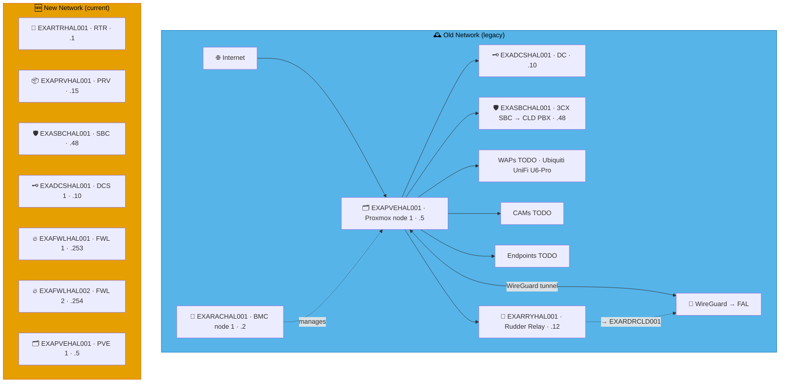
```mermaid
graph TD
    subgraph OLD_HAL ["🕰️ Old Network (legacy)"]
      INET["🌐 Internet"]
      RAC["🔧 EXARACHAL001 · BMC node 1 · .2"]
      PVE["🗂️ EXAPVEHAL001 · Proxmox node 1 · .5"]
      DC["🗝️ EXADCSHAL001 · DC · .10"]
      SBC["🛡️ EXASBCHAL001 · 3CX SBC → CLD PBX · .48"]
      RRY["🔁 EXARRYHAL001 · Rudder Relay · .12"]
      WAP["WAPs TODO · Ubiquiti UniFi U6-Pro"]
      CAM["CAMs TODO"]
      EP["Endpoints TODO"]
      VPN["🔗 WireGuard → FAL"]

      INET --> PVE --> DC & SBC
      RAC -.->|"manages"| PVE
      PVE --> WAP & CAM & EP
      PVE <-->|"WireGuard tunnel"| VPN

      PVE --> RRY
      RRY -. "→ EXARDRCLD001" .-> VPN
    end
    style OLD_HAL fill:#56B4E9,stroke:#0072B2,color:#000000
    %% GENERATED:NEW-NETWORK:HAL:START
    subgraph NEW_HAL ["🆕 New Network (current)"]
      N_RTR["📡 EXARTRHAL001 · RTR · .1"]
      N_PRV["📦 EXAPRVHAL001 · PRV · .15"]
      N_SBC["🛡️ EXASBCHAL001 · SBC · .48"]
      N_DCS["🗝️ EXADCSHAL001 · DCS 1 · .10"]
      N_FWL["🔥 EXAFWLHAL001 · FWL 1 · .253"]
      N_FWL2["🔥 EXAFWLHAL002 · FWL 2 · .254"]
      N_PVE["🗂️ EXAPVEHAL001 · PVE 1 · .5"]
    end
    style NEW_HAL fill:#E69F00,stroke:#D55E00,color:#000000
    %% GENERATED:NEW-NETWORK:HAL:END
```

---

## HUL — Hull

**LAN:** `192.168.148.0/24` · **Domain:** `example.net`  
**PVE nodes:** 1 · **VPN parent:** FAL  
**Entity:** Example Music (England) Ltd · **Landline:** +44 1482 300 0xxx · **Mobile:** +44 7700 902 2xxx

```mermaid
graph TD
    subgraph OLD_HUL ["🕰️ Old Network (legacy)"]
      INET["🌐 Internet"]
      RAC["🔧 EXARACHUL001 · BMC node 1 · .2"]
      PVE["🗂️ EXAPVEHUL001 · Proxmox node 1 · .5"]
      DC["🗝️ EXADCSHUL001 · DC · .10"]
      SBC["🛡️ EXASBCHUL001 · 3CX SBC → CLD PBX · .48"]
      RRY["🔁 EXARRYHUL001 · Rudder Relay · .12"]
      WAP["WAPs TODO · Ubiquiti UniFi U6-Pro"]
      CAM["CAMs TODO"]
      EP["Endpoints TODO"]
      VPN["🔗 WireGuard → FAL"]

      INET --> PVE --> DC & SBC
      RAC -.->|"manages"| PVE
      PVE --> WAP & CAM & EP
      PVE <-->|"WireGuard tunnel"| VPN

      PVE --> RRY
      RRY -. "→ EXARDRCLD001" .-> VPN
    end
    style OLD_HUL fill:#56B4E9,stroke:#0072B2,color:#000000
    %% GENERATED:NEW-NETWORK:HUL:START
    subgraph NEW_HUL ["🆕 New Network (current)"]
      N_RTR["📡 EXARTRHUL001 · RTR · .1"]
      N_PRV["📦 EXAPRVHUL001 · PRV · .15"]
      N_SBC["🛡️ EXASBCHUL001 · SBC · .48"]
      N_DCS["🗝️ EXADCSHUL001 · DCS 1 · .10"]
      N_FWL["🔥 EXAFWLHUL001 · FWL 1 · .253"]
      N_FWL2["🔥 EXAFWLHUL002 · FWL 2 · .254"]
      N_PVE["🗂️ EXAPVEHUL001 · PVE 1 · .5"]
    end
    style NEW_HUL fill:#E69F00,stroke:#D55E00,color:#000000
    %% GENERATED:NEW-NETWORK:HUL:END
```

---

## COV — Coventry

**LAN:** `192.168.247.0/24` · **Domain:** `example.net`  
**PVE nodes:** 1 · **VPN parent:** FAL  
*Note: WAP/RTR-only site — minimal infrastructure.*  
**Entity:** Example Music (England) Ltd · **Landline:** +44 247 765 0xxx · **Mobile:** +44 7700 901 2xxx

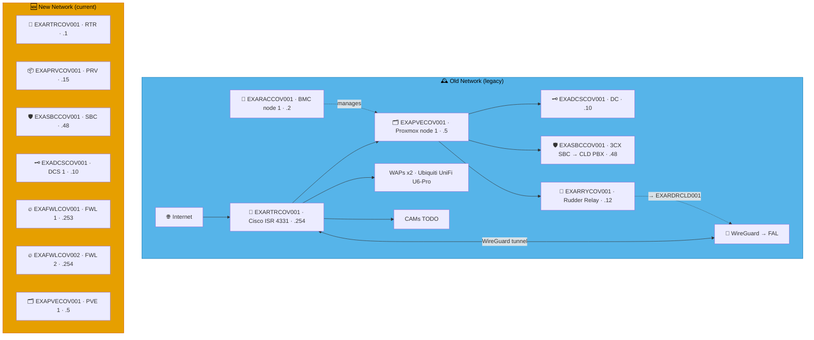
```mermaid
graph TD
    subgraph OLD_COV ["🕰️ Old Network (legacy)"]
      INET["🌐 Internet"]
      RTR["📡 EXARTRCOV001 · Cisco ISR 4331 · .254"]
      RAC["🔧 EXARACCOV001 · BMC node 1 · .2"]
      PVE["🗂️ EXAPVECOV001 · Proxmox node 1 · .5"]
      DC["🗝️ EXADCSCOV001 · DC · .10"]
      SBC["🛡️ EXASBCCOV001 · 3CX SBC → CLD PBX · .48"]
      RRY["🔁 EXARRYCOV001 · Rudder Relay · .12"]
      WAP["WAPs x2 · Ubiquiti UniFi U6-Pro"]
      CAM["CAMs TODO"]
      VPN["🔗 WireGuard → FAL"]

      INET --> RTR --> PVE --> DC & SBC
      RAC -.->|"manages"| PVE
      RTR --> WAP & CAM
      RTR <-->|"WireGuard tunnel"| VPN

      PVE --> RRY
      RRY -. "→ EXARDRCLD001" .-> VPN
    end
    style OLD_COV fill:#56B4E9,stroke:#0072B2,color:#000000
    %% GENERATED:NEW-NETWORK:COV:START
    subgraph NEW_COV ["🆕 New Network (current)"]
      N_RTR["📡 EXARTRCOV001 · RTR · .1"]
      N_PRV["📦 EXAPRVCOV001 · PRV · .15"]
      N_SBC["🛡️ EXASBCCOV001 · SBC · .48"]
      N_DCS["🗝️ EXADCSCOV001 · DCS 1 · .10"]
      N_FWL["🔥 EXAFWLCOV001 · FWL 1 · .253"]
      N_FWL2["🔥 EXAFWLCOV002 · FWL 2 · .254"]
      N_PVE["🗂️ EXAPVECOV001 · PVE 1 · .5"]
    end
    style NEW_COV fill:#E69F00,stroke:#D55E00,color:#000000
    %% GENERATED:NEW-NETWORK:COV:END
```

---

---

## 🇩🇰 Danmark

---

## CPH — København

**LAN:** `192.168.231.0/24` · **Domain:** `example.com` / `example.net`  
**PVE nodes:** 1 · **VPN parent:** ODE  
**Entity:** Example Music (Danmark) ApS · **Landline:** +45 00 000 xxx · **Mobile:** +45 2x xxx xxx

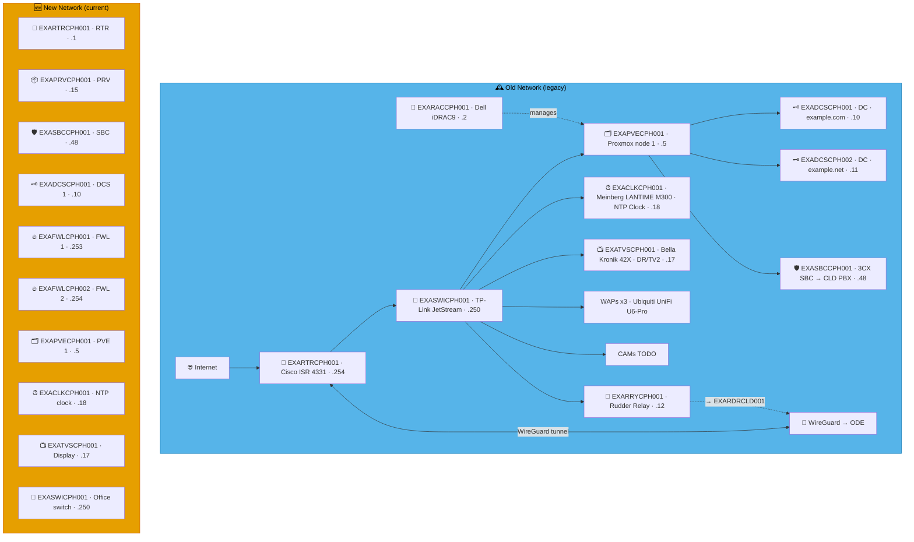
```mermaid
graph TD
    subgraph OLD_CPH ["🕰️ Old Network (legacy)"]
      INET["🌐 Internet"]
      SW["🔀 EXASWICPH001 · TP-Link JetStream · .250"]
      RTR["📡 EXARTRCPH001 · Cisco ISR 4331 · .254"]
      RAC["🔧 EXARACCPH001 · Dell iDRAC9 · .2"]
      PVE["🗂️ EXAPVECPH001 · Proxmox node 1 · .5"]
      DC1["🗝️ EXADCSCPH001 · DC · example.com · .10"]
      DC2["🗝️ EXADCSCPH002 · DC · example.net · .11"]
      SBC["🛡️ EXASBCCPH001 · 3CX SBC → CLD PBX · .48"]
      RRY["🔁 EXARRYCPH001 · Rudder Relay · .12"]
      NTP["⏰ EXACLKCPH001 · Meinberg LANTIME M300 · NTP Clock · .18"]
      TV["📺 EXATVSCPH001 · Bella Kronik 42X · DR/TV2 · .17"]
      WAP["WAPs x3 · Ubiquiti UniFi U6-Pro"]
      CAM["CAMs TODO"]
      VPN["🔗 WireGuard → ODE"]

      INET --> RTR --> SW
      SW --> PVE --> DC1 & DC2 & SBC
      RAC -.->|"manages"| PVE
      SW --> NTP & TV & WAP & CAM
      RTR <-->|"WireGuard tunnel"| VPN

      SW --> RRY
      RRY -. "→ EXARDRCLD001" .-> VPN
    end
    style OLD_CPH fill:#56B4E9,stroke:#0072B2,color:#000000
    %% GENERATED:NEW-NETWORK:CPH:START
    subgraph NEW_CPH ["🆕 New Network (current)"]
      N_RTR["📡 EXARTRCPH001 · RTR · .1"]
      N_PRV["📦 EXAPRVCPH001 · PRV · .15"]
      N_SBC["🛡️ EXASBCCPH001 · SBC · .48"]
      N_DCS["🗝️ EXADCSCPH001 · DCS 1 · .10"]
      N_FWL["🔥 EXAFWLCPH001 · FWL 1 · .253"]
      N_FWL2["🔥 EXAFWLCPH002 · FWL 2 · .254"]
      N_PVE["🗂️ EXAPVECPH001 · PVE 1 · .5"]
      N_CLK["⏰ EXACLKCPH001 · NTP clock · .18"]
      N_TVS["📺 EXATVSCPH001 · Display · .17"]
      N_SWI["🔀 EXASWICPH001 · Office switch · .250"]
    end
    style NEW_CPH fill:#E69F00,stroke:#D55E00,color:#000000
    %% GENERATED:NEW-NETWORK:CPH:END
```

---

## ODE — Odense *(EU Hub)* ⭐

**LAN:** `192.168.126.0/24` · **Domain:** `example.net`  
**PVE nodes:** 3 (EU hub) · **VPN parent:** CLD (EU backup)  
**Entity:** Example Music (Danmark) ApS · **Landline:** +45 00 000 xxx · **Mobile:** +45 2x xxx xxx

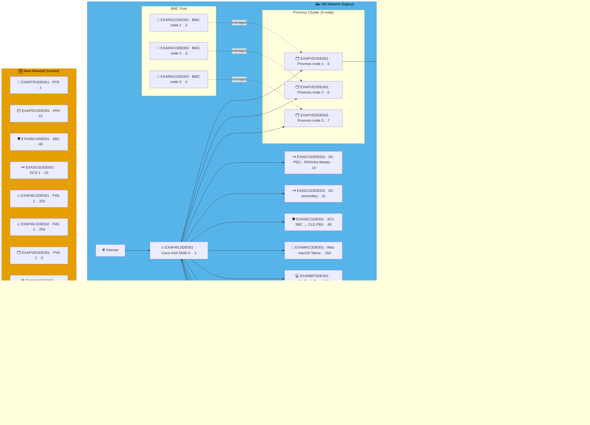
```mermaid
graph TD
    subgraph OLD_ODE ["🕰️ Old Network (legacy)"]
      INET["🌐 Internet"]
      FWL["🔥 EXAFWLODE001 · Cisco ASA 5506-X · .1"]

      subgraph BMC ["BMC Pool"]
          RAC1["🔧 EXARACODE001 · BMC node 1 · .2"]
          RAC2["🔧 EXARACODE002 · BMC node 2 · .3"]
          RAC3["🔧 EXARACODE003 · BMC node 3 · .4"]
      end

      subgraph PVE ["Proxmox Cluster (3-node)"]
          PVE1["🗂️ EXAPVEODE001 · Proxmox node 1 · .5"]
          PVE2["🗂️ EXAPVEODE002 · Proxmox node 2 · .6"]
          PVE3["🗂️ EXAPVEODE003 · Proxmox node 3 · .7"]
      end

      DC1["🗝️ EXADCSODE001 · DC PDC · RID/Infra Master · .10"]
      DC2["🗝️ EXADCSODE002 · DC secondary · .11"]
      SBC["🛡️ EXASBCODE001 · 3CX SBC → CLD PBX · .48"]
      RRY["🔁 EXARRYODE001 · Rudder Relay · .12"]
      MAC["🍎 EXAMACODE001 · iMac · macOS Tahoe · .150"]
      MBP["💻 EXAMBPODE002 · MacBook Pro · .151"]
      JKB["💿 EXAMUSODE001 · Pureline 128V Jukebox · .60"]
      WAP["WAPs x2 · Ubiquiti UniFi U6-Pro"]
      CAM["CAMs TODO"]
      VPN_CLD["🔗 WireGuard ← CLD · EU backup"]
      VPN_EU["🔗 WireGuard → EU spokes · CPH/KGE/FAX/KOR/AAR/FRE/BON/BER · DRS/DUS/MUN/GOT/OSL/AMS/MIL/VIE/BRT"]

      INET --> FWL
      FWL --> PVE1 & PVE2 & PVE3
      FWL --> DC1 & DC2 & SBC
      RAC1 -.->|"manages"| PVE1
      RAC2 -.->|"manages"| PVE2
      RAC3 -.->|"manages"| PVE3
      FWL --> MAC & MBP & JKB & WAP & CAM
      FWL <-->|"WireGuard tunnel"| VPN_CLD
      FWL -->|"WireGuard spokes"| VPN_EU

      PVE1 --> RRY
      RRY -. "→ EXARDRCLD001" .-> VPN_CLD
    end
    style OLD_ODE fill:#56B4E9,stroke:#0072B2,color:#000000
    %% GENERATED:NEW-NETWORK:ODE:START
    subgraph NEW_ODE ["🆕 New Network (current)"]
      N_RTR["📡 EXARTRODE001 · RTR · .1"]
      N_PRV["📦 EXAPRVODE001 · PRV · .15"]
      N_SBC["🛡️ EXASBCODE001 · SBC · .48"]
      N_DCS["🗝️ EXADCSODE001 · DCS 1 · .10"]
      N_FWL["🔥 EXAFWLODE001 · FWL 1 · .253"]
      N_FWL2["🔥 EXAFWLODE002 · FWL 2 · .254"]
      N_PVE["🗂️ EXAPVEODE001 · PVE 1 · .5"]
      N_MUS["💿 EXAMUSODE001 · Jukebox · .60"]
      N_MAC["🍎 EXAMACODE001 · iMac"]
      N_MBP["💻 EXAMBPODE002 · MacBook Pro"]
    end
    style NEW_ODE fill:#E69F00,stroke:#D55E00,color:#000000
    %% GENERATED:NEW-NETWORK:ODE:END
```

---

## KGE — Køge ⚠️

**LAN:** `192.168.65.0/24` · **Domain:** `example.net`  
**PVE nodes:** 1 · **VPN parent:** ODE  
> ⚠️ DC out of sync 27 days · WS2016 EOL · disk space low — rebuild required  
**Entity:** Example Music (Danmark) ApS · **Landline:** +45 00 000 xxx · **Mobile:** +45 2x xxx xxx

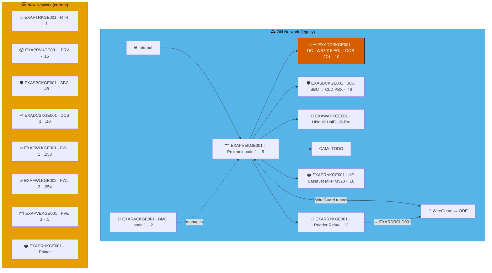
```mermaid
graph TD
    subgraph OLD_KGE ["🕰️ Old Network (legacy)"]
      INET["🌐 Internet"]
      RAC["🔧 EXARACKGE001 · BMC node 1 · .2"]
      PVE["🗂️ EXAPVEKGE001 · Proxmox node 1 · .5"]
      DC["⚠️ 🗝️ EXADCSKGE001 · DC · WS2016 EOL · OOS 27d · .10"]
      SBC["🛡️ EXASBCKGE001 · 3CX SBC → CLD PBX · .48"]
      RRY["🔁 EXARRYKGE001 · Rudder Relay · .12"]
      WAP["📶 EXAWAPKGE001 · Ubiquiti UniFi U6-Pro"]
      CAM["CAMs TODO"]
      PRN["🖨️ EXAPRNKGE001 · HP LaserJet MFP M528 · .16"]
      VPN["🔗 WireGuard → ODE"]

      INET --> PVE --> DC & SBC
      RAC -.->|"manages"| PVE
      PVE --> WAP & CAM & PRN
      PVE <-->|"WireGuard tunnel"| VPN

      PVE --> RRY
      RRY -. "→ EXARDRCLD001" .-> VPN
    end
    style OLD_KGE fill:#56B4E9,stroke:#0072B2,color:#000000
    %% GENERATED:NEW-NETWORK:KGE:START
    subgraph NEW_KGE ["🆕 New Network (current)"]
      N_RTR["📡 EXARTRKGE001 · RTR · .1"]
      N_PRV["📦 EXAPRVKGE001 · PRV · .15"]
      N_SBC["🛡️ EXASBCKGE001 · SBC · .48"]
      N_DCS["🗝️ EXADCSKGE001 · DCS 1 · .10"]
      N_FWL["🔥 EXAFWLKGE001 · FWL 1 · .253"]
      N_FWL2["🔥 EXAFWLKGE002 · FWL 2 · .254"]
      N_PVE["🗂️ EXAPVEKGE001 · PVE 1 · .5"]
      N_PRN["🖨️ EXAPRNKGE001 · Printer"]
    end
    style NEW_KGE fill:#E69F00,stroke:#D55E00,color:#000000
    %% GENERATED:NEW-NETWORK:KGE:END
    classDef warn fill:#D55E00,stroke:#000000,color:#ffffff
    class DC warn
```

---

## FAX — Faxe

**LAN:** `192.168.246.0/24` · **Domain:** `example.net`  
**PVE nodes:** 1 · **VPN parent:** ODE  
**Entity:** Example Music (Danmark) ApS · **Landline:** +45 00 000 xxx · **Mobile:** +45 2x xxx xxx

```mermaid
graph TD
    subgraph OLD_FAX ["🕰️ Old Network (legacy)"]
      INET["🌐 Internet"]
      RTR["📡 EXARTRFAX001 · Cisco ISR 4331 · .254"]
      RAC["🔧 EXARACFAX001 · BMC node 1 · .2"]
      PVE["🗂️ EXAPVEFAX001 · Proxmox node 1 · .5"]
      DC["🗝️ EXADCSFAX001 · DC · .10"]
      SBC["🛡️ EXASBCFAX001 · 3CX SBC → CLD PBX · .48"]
      RRY["🔁 EXARRYFAX001 · Rudder Relay · .12"]
      WAP["WAPs x2 · Ubiquiti UniFi U6-Pro"]
      CAM["CAMs TODO"]
      VPN["🔗 WireGuard → ODE"]

      INET --> RTR --> PVE --> DC & SBC
      RAC -.->|"manages"| PVE
      RTR --> WAP & CAM
      RTR <-->|"WireGuard tunnel"| VPN

      PVE --> RRY
      RRY -. "→ EXARDRCLD001" .-> VPN
    end
    style OLD_FAX fill:#56B4E9,stroke:#0072B2,color:#000000
    %% GENERATED:NEW-NETWORK:FAX:START
    subgraph NEW_FAX ["🆕 New Network (current)"]
      N_RTR["📡 EXARTRFAX001 · RTR · .1"]
      N_PRV["📦 EXAPRVFAX001 · PRV · .15"]
      N_SBC["🛡️ EXASBCFAX001 · SBC · .48"]
      N_DCS["🗝️ EXADCSFAX001 · DCS 1 · .10"]
      N_FWL["🔥 EXAFWLFAX001 · FWL 1 · .253"]
      N_FWL2["🔥 EXAFWLFAX002 · FWL 2 · .254"]
      N_PVE["🗂️ EXAPVEFAX001 · PVE 1 · .5"]
    end
    style NEW_FAX fill:#E69F00,stroke:#D55E00,color:#000000
    %% GENERATED:NEW-NETWORK:FAX:END
```

---

## KOR — Korsør

**LAN:** `192.168.238.0/24` · **Domain:** `example.net`  
**PVE nodes:** 1 · **VPN parent:** ODE  
**Entity:** Example Music (Danmark) ApS · **Landline:** +45 00 000 xxx · **Mobile:** +45 2x xxx xxx

```mermaid
graph TD
    subgraph OLD_KOR ["🕰️ Old Network (legacy)"]
      INET["🌐 Internet"]
      RAC["🔧 EXARACKOR001 · BMC node 1 · .2"]
      PVE["🗂️ EXAPVEKOR001 · Proxmox node 1 · .5"]
      DC["🗝️ EXADCSKOR001 · DC · .10"]
      SBC["🛡️ EXASBCKOR001 · 3CX SBC → CLD PBX · .48"]
      RRY["🔁 EXARRYKOR001 · Rudder Relay · .12"]
      WAP["WAPs TODO · Ubiquiti UniFi U6-Pro"]
      CAM["CAMs TODO"]
      VPN["🔗 WireGuard → ODE"]

      INET --> PVE --> DC & SBC
      RAC -.->|"manages"| PVE
      PVE --> WAP & CAM
      PVE <-->|"WireGuard tunnel"| VPN

      PVE --> RRY
      RRY -. "→ EXARDRCLD001" .-> VPN
    end
    style OLD_KOR fill:#56B4E9,stroke:#0072B2,color:#000000
    %% GENERATED:NEW-NETWORK:KOR:START
    subgraph NEW_KOR ["🆕 New Network (current)"]
      N_RTR["📡 EXARTRKOR001 · RTR · .1"]
      N_PRV["📦 EXAPRVKOR001 · PRV · .15"]
      N_SBC["🛡️ EXASBCKOR001 · SBC · .48"]
      N_DCS["🗝️ EXADCSKOR001 · DCS 1 · .10"]
      N_FWL["🔥 EXAFWLKOR001 · FWL 1 · .253"]
      N_FWL2["🔥 EXAFWLKOR002 · FWL 2 · .254"]
      N_PVE["🗂️ EXAPVEKOR001 · PVE 1 · .5"]
    end
    style NEW_KOR fill:#E69F00,stroke:#D55E00,color:#000000
    %% GENERATED:NEW-NETWORK:KOR:END
```

---

## AAR — Aarhus

**LAN:** `192.168.86.0/24` · **Domain:** `example.net`  
**PVE nodes:** 1 · **VPN parent:** ODE  
**Entity:** Example Music (Danmark) ApS · **Landline:** +45 00 000 xxx · **Mobile:** +45 2x xxx xxx

```mermaid
graph TD
    subgraph OLD_AAR ["🕰️ Old Network (legacy)"]
      INET["🌐 Internet"]
      RAC["🔧 EXARACAAR001 · BMC node 1 · .2"]
      PVE["🗂️ EXAPVEAAR001 · Proxmox node 1 · .5"]
      DC["🗝️ EXADCSAAR001 · DC · .10"]
      SBC["🛡️ EXASBCAAR001 · 3CX SBC → CLD PBX · .48"]
      RRY["🔁 EXARRYAAR001 · Rudder Relay · .12"]
      WAP["WAPs TODO · Ubiquiti UniFi U6-Pro"]
      CAM["CAMs TODO"]
      VPN["🔗 WireGuard → ODE"]

      INET --> PVE --> DC & SBC
      RAC -.->|"manages"| PVE
      PVE --> WAP & CAM
      PVE <-->|"WireGuard tunnel"| VPN

      PVE --> RRY
      RRY -. "→ EXARDRCLD001" .-> VPN
    end
    style OLD_AAR fill:#56B4E9,stroke:#0072B2,color:#000000
    %% GENERATED:NEW-NETWORK:AAR:START
    subgraph NEW_AAR ["🆕 New Network (current)"]
      N_RTR["📡 EXARTRAAR001 · RTR · .1"]
      N_PRV["📦 EXAPRVAAR001 · PRV · .15"]
      N_SBC["🛡️ EXASBCAAR001 · SBC · .48"]
      N_DCS["🗝️ EXADCSAAR001 · DCS 1 · .10"]
      N_FWL["🔥 EXAFWLAAR001 · FWL 1 · .253"]
      N_FWL2["🔥 EXAFWLAAR002 · FWL 2 · .254"]
      N_PVE["🗂️ EXAPVEAAR001 · PVE 1 · .5"]
    end
    style NEW_AAR fill:#E69F00,stroke:#D55E00,color:#000000
    %% GENERATED:NEW-NETWORK:AAR:END
```

---

## FRE — Fredericia

**LAN:** `192.168.75.0/24` · **Domain:** `example.net`  
**PVE nodes:** 1 · **VPN parent:** ODE  
**Entity:** Example Music (Danmark) ApS · **Landline:** +45 75 xx xx xx · **Mobile:** +45 2x xx xx xx

```mermaid
graph TD
    subgraph OLD_FRE ["🕰️ Old Network (legacy)"]
      INET["🌐 Internet"]
      RAC["🔧 EXARACFRE001 · BMC node 1 · .2"]
      PVE["🗂️ EXAPVEFRE001 · Proxmox node 1 · .5"]
      DC["🗝️ EXADCSFRE001 · DC · .10"]
      SBC["🛡️ EXASBCFRE001 · 3CX SBC → CLD PBX · .48"]
      RRY["🔁 EXARRYFRE001 · Rudder Relay · .12"]
      WAP["WAPs TODO · Ubiquiti UniFi U6-Pro"]
      CAM["CAMs TODO"]
      VPN["🔗 WireGuard → ODE"]

      INET --> PVE --> DC & SBC
      RAC -.->|"manages"| PVE
      PVE --> WAP & CAM
      PVE <-->|"WireGuard tunnel"| VPN

      PVE --> RRY
      RRY -. "→ EXARDRCLD001" .-> VPN
    end
    style OLD_FRE fill:#56B4E9,stroke:#0072B2,color:#000000
    %% GENERATED:NEW-NETWORK:FRE:START
    subgraph NEW_FRE ["🆕 New Network (current)"]
      N_RTR["📡 EXARTRFRE001 · RTR · .1"]
      N_PRV["📦 EXAPRVFRE001 · PRV · .15"]
      N_SBC["🛡️ EXASBCFRE001 · SBC · .48"]
      N_DCS["🗝️ EXADCSFRE001 · DCS 1 · .10"]
      N_FWL["🔥 EXAFWLFRE001 · FWL 1 · .253"]
      N_FWL2["🔥 EXAFWLFRE002 · FWL 2 · .254"]
      N_PVE["🗂️ EXAPVEFRE001 · PVE 1 · .5"]
    end
    style NEW_FRE fill:#E69F00,stroke:#D55E00,color:#000000
    %% GENERATED:NEW-NETWORK:FRE:END
```

---

## FRD — Fredericia Havn *(New Build)*

**LAN:** `172.16.124.0/24` · **Domain:** `example.net`  
**PVE nodes:** 0 — see notes below · **VPN parent:** CLD (direct, non-standard networking)  
**Entity:** Example Music Limited · **Landline:** N/A · **Mobile:** N/A

> **New-build site.** No legacy infrastructure ever existed here — see the "New Build Location" box below in place of "Old Network." Fredericia Havn is one machine today: a MacBook running `python3 -m http.server 8000` as a PXE mirror, plus a secondary 3CX PBX hostnamed under CLD (`EXAPBXCLD002`) but physically here — see `benarbejde/generate_inventory.py`'s `NON_STANDARD_SITES`/`SubnetSite` handling.

```mermaid
graph TD
    subgraph OLD_FRD ["🏗️ New Build Location — no legacy infrastructure existed here"]
      N_OLD_NOTE["This is a new-build site. · No prior/legacy network existed before commissioning."]
    end
    style OLD_FRD fill:#56B4E9,stroke:#0072B2,color:#000000
    %% GENERATED:NEW-NETWORK:FRD:START
    subgraph NEW_FRD ["🆕 New Network (current)"]
      N_PRV["📦 EXAPRVFRD001 · Provisioning server (PXE, port 8000) · .1"]
      N_PBX["🔌 EXAPBXCLD002 · Secondary 3CX PBX (hostnamed under CLD) · .48"]
    end
    style NEW_FRD fill:#E69F00,stroke:#D55E00,color:#000000
    %% GENERATED:NEW-NETWORK:FRD:END
```

---

## NYB — Nyborg *(New Build)*

**LAN:** `192.168.90.0/24` · **Domain:** `example.net`  
**PVE nodes:** 1 (reserved — see notes below) · **VPN parent:** ODE  
**Entity:** Example Music (Danmark) ApS · **Landline:** +45 80 400 0xxx · **Mobile:** +45 200 900 2xxx

> **New-build site.** No legacy infrastructure ever existed here — see the "New Build Location" box below in place of "Old Network." Standard-slot addresses are allocated in `benarbejde/address_policy.json`/`sites.csv` the same as any other site (this is what makes the .ini/DNS generation already treat them as real, per the generated-file-freshness harness check) but no `devices.csv` exception rows exist yet — nothing beyond the standard template has been confirmed built on site.

```mermaid
graph TD
    subgraph OLD_NYB ["🏗️ New Build Location — no legacy infrastructure existed here"]
      N_OLD_NOTE["This is a new-build site. · No prior/legacy network existed before commissioning."]
    end
    style OLD_NYB fill:#56B4E9,stroke:#0072B2,color:#000000
    %% GENERATED:NEW-NETWORK:NYB:START
    subgraph NEW_NYB ["🆕 New Network (current)"]
      N_RTR["📡 EXARTRNYB001 · RTR · .1"]
      N_PRV["📦 EXAPRVNYB001 · PRV · .15"]
      N_SBC["🛡️ EXASBCNYB001 · SBC · .48"]
      N_DCS["🗝️ EXADCSNYB001 · DCS 1 · .10"]
      N_FWL["🔥 EXAFWLNYB001 · FWL 1 · .253"]
      N_FWL2["🔥 EXAFWLNYB002 · FWL 2 · .254"]
      N_PVE["🗂️ EXAPVENYB001 · PVE 1 · .5"]
    end
    style NEW_NYB fill:#E69F00,stroke:#D55E00,color:#000000
    %% GENERATED:NEW-NETWORK:NYB:END
```

---

---

## 🇩🇪 Deutschland

---

## BON — Bonn

**LAN:** `192.168.228.0/24` · **Domain:** `example.net`  
**PVE nodes:** 1 · **VPN parent:** ODE  
**Note:** Hosts Schema Master + Domain Naming Master  
**Entity:** Example Music (Deutschland) GmbH · **Landline:** +49 228 555 xxx · **Mobile:** +49 211 xxx xxxx

```mermaid
graph TD
    subgraph OLD_BON ["🕰️ Old Network (legacy)"]
      INET["🌐 Internet"]
      SW["🔀 EXASWIBON001 · Cisco 2960X · .250"]
      RTR["📡 EXARTRBON001 · Cisco ISR 4331 · .254"]
      RAC["🔧 EXARACBON001 · Dell iDRAC9 · .2"]
      PVE["🗂️ EXAPVEBON001 · Proxmox node 1 · .5"]
      DC["🗝️ EXADCSBON001 · DC · Schema Master · DN Master · .10"]
      SBC["🛡️ EXASBCBON001 · 3CX SBC → CLD PBX · .48"]
      RRY["🔁 EXARRYBON001 · Rudder Relay · .12"]
      WKS["🖥️ EXAWKSBON001 · Finance WKS · .151"]
      LAP1["💻 EXALAPBON001 · ThinkPad ⚠️ disabled · .150"]
      LAP2["💻 EXALAPBON002 · Finance Laptop · .153"]
      VCU["🎧 EXAVCUBON001 · Poly Studio X70 · Boardroom · .2"]
      CAM["🎥 EXACAMBON001 · Axis P3245-LVE CCTV · .17"]
      TV["📺 EXATVSBON001 · Samsung 65in · .18"]
      WAP["WAPs x2 · Ubiquiti UniFi U6-Pro"]
      VPN["🔗 WireGuard → ODE"]

      INET --> RTR --> SW
      SW --> PVE --> DC & SBC
      RAC -.->|"manages"| PVE
      SW --> WKS & LAP1 & LAP2 & VCU & CAM & TV & WAP
      RTR <-->|"WireGuard tunnel"| VPN

      SW --> RRY
      RRY -. "→ EXARDRCLD001" .-> VPN
    end
    style OLD_BON fill:#56B4E9,stroke:#0072B2,color:#000000
    %% GENERATED:NEW-NETWORK:BON:START
    subgraph NEW_BON ["🆕 New Network (current)"]
      N_RTR["📡 EXARTRBON001 · RTR · .1"]
      N_PRV["📦 EXAPRVBON001 · PRV · .15"]
      N_SBC["🛡️ EXASBCBON001 · SBC · .48"]
      N_DCS["🗝️ EXADCSBON001 · DCS 1 · .10"]
      N_FWL["🔥 EXAFWLBON001 · FWL 1 · .253"]
      N_FWL2["🔥 EXAFWLBON002 · FWL 2 · .254"]
      N_PVE["🗂️ EXAPVEBON001 · PVE 1 · .5"]
      N_SWI["🔀 EXASWIBON001 · Office switch · .250"]
      N_LAP["💻 EXALAPBON001 · ThinkPad DISABLED"]
      N_WKS["🖥️ EXAWKSBON001 · Finance workstation"]
      N_LAP2["💻 EXALAPBON002 · Finance laptop"]
      N_VCU["🎧 EXAVCUBON001 · Boardroom video conferencing"]
      N_CAM["🎥 EXACAMBON001 · CCTV camera"]
      N_TVS["📺 EXATVSBON001 · Display"]
    end
    style NEW_BON fill:#E69F00,stroke:#D55E00,color:#000000
    %% GENERATED:NEW-NETWORK:BON:END
    classDef warn fill:#D55E00,stroke:#000000,color:#ffffff
    class LAP1 warn
```

---

## BER — West Berlin

**LAN:** `192.168.113.0/24` · **Domain:** `example.net`  
**PVE nodes:** 1 · **VPN parent:** ODE  
**Entity:** Example Music (Deutschland) GmbH · **Landline:** +49 311 555 xxx · **Mobile:** +49 211 xxx xxxx

```mermaid
graph TD
    subgraph OLD_BER ["🕰️ Old Network (legacy)"]
      INET["🌐 Internet"]
      RTR["📡 EXARTRBER001 · Cisco ISR 4331 · .254"]
      RAC["🔧 EXARACBER001 · BMC node 1 · .2"]
      PVE["🗂️ EXAPVEBER001 · Proxmox node 1 · .5"]
      DC["🗝️ EXADCSBER001 · DC · PDC Emulator · RID/Infra Master WS2019 · .10"]
      SBC["🛡️ EXASBCBER001 · 3CX SBC → CLD PBX · .48"]
      RRY["🔁 EXARRYBER001 · Rudder Relay · .12"]
      SRV["🗄️ EXASRVBER001 · WS2019 Legacy App Server · .21"]
      NIX["🐧 EXANIXBER001 · Debian 12 Server · .22"]
      WAP["WAPs x2 · Ubiquiti UniFi U6-Pro"]
      CAM["CAMs TODO"]
      VPN["🔗 WireGuard → ODE"]

      INET --> RTR --> PVE --> DC & SBC & SRV & NIX
      RAC -.->|"manages"| PVE
      RTR --> WAP & CAM
      RTR <-->|"WireGuard tunnel"| VPN

      PVE --> RRY
      RRY -. "→ EXARDRCLD001" .-> VPN
    end
    style OLD_BER fill:#56B4E9,stroke:#0072B2,color:#000000
    %% GENERATED:NEW-NETWORK:BER:START
    subgraph NEW_BER ["🆕 New Network (current)"]
      N_RTR["📡 EXARTRBER001 · RTR · .1"]
      N_PRV["📦 EXAPRVBER001 · PRV · .15"]
      N_SBC["🛡️ EXASBCBER001 · SBC · .48"]
      N_DCS["🗝️ EXADCSBER001 · DCS 1 · .10"]
      N_FWL["🔥 EXAFWLBER001 · FWL 1 · .253"]
      N_FWL2["🔥 EXAFWLBER002 · FWL 2 · .254"]
      N_PVE["🗂️ EXAPVEBER001 · PVE 1 · .5"]
    end
    style NEW_BER fill:#E69F00,stroke:#D55E00,color:#000000
    %% GENERATED:NEW-NETWORK:BER:END
```

---

## MUN — Munich

**LAN:** `192.168.189.0/24` · **Domain:** `example.net`  
**PVE nodes:** 1 · **VPN parent:** ODE  
**Entity:** Example Music (Deutschland) GmbH · **Landline:** +49 893 555 33xx · **Mobile:** +49 893 555 99xx

```mermaid
graph TD
    subgraph OLD_MUN ["🕰️ Old Network (legacy)"]
      INET["🌐 Internet"]
      SW["🔀 EXASWIMUN001 · Cisco 9200 · .250"]
      RAC["🔧 EXARACMUN001 · HPE iLO5 · .2"]
      PVE["🗂️ EXAPVEMUN001 · Proxmox node 1 · .5"]
      DC["🗝️ EXADCSMUN001 · DC · .10"]
      SBC["🛡️ EXASBCMUN001 · 3CX SBC → CLD PBX · .48"]
      RRY["🔁 EXARRYMUN001 · Rudder Relay · .12"]
      WKS["🖥️ EXAWKSMUN001 · Hot Desk WKS · .150"]
      LAP1["💻 EXALAPMUN001 · Pool Laptop · .151"]
      LAP2["⚠️ 💻 EXALAPMUN002 · Pool Laptop · LAPS expired 61d · .152"]
      WAP["WAPs TODO · Ubiquiti UniFi U6-Pro"]
      CAM["CAMs TODO"]
      VPN["🔗 WireGuard → ODE"]

      INET --> SW
      SW --> PVE --> DC & SBC
      RAC -.->|"manages"| PVE
      SW --> WKS & LAP1 & LAP2 & WAP & CAM
      SW <-->|"WireGuard tunnel"| VPN

      SW --> RRY
      RRY -. "→ EXARDRCLD001" .-> VPN
    end
    style OLD_MUN fill:#56B4E9,stroke:#0072B2,color:#000000
    %% GENERATED:NEW-NETWORK:MUN:START
    subgraph NEW_MUN ["🆕 New Network (current)"]
      N_RTR["📡 EXARTRMUN001 · RTR · .1"]
      N_PRV["📦 EXAPRVMUN001 · PRV · .15"]
      N_SBC["🛡️ EXASBCMUN001 · SBC · .48"]
      N_DCS["🗝️ EXADCSMUN001 · DCS 1 · .10"]
      N_FWL["🔥 EXAFWLMUN001 · FWL 1 · .253"]
      N_FWL2["🔥 EXAFWLMUN002 · FWL 2 · .254"]
      N_PVE["🗂️ EXAPVEMUN001 · PVE 1 · .5"]
      N_SWI["🔀 EXASWIMUN001 · Access switch · .250"]
      N_WKS["🖥️ EXAWKSMUN001 · Hot desk workstation"]
      N_LAP["💻 EXALAPMUN001 · Pool laptop"]
      N_LAP2["💻 EXALAPMUN002 · LAPS expired"]
    end
    style NEW_MUN fill:#E69F00,stroke:#D55E00,color:#000000
    %% GENERATED:NEW-NETWORK:MUN:END
    classDef warn fill:#D55E00,stroke:#000000,color:#ffffff
    class LAP2 warn
```

---

## DRS — Dresden

**LAN:** `192.168.153.0/24` · **Domain:** `example.net`  
**PVE nodes:** 1 · **VPN parent:** ODE  
**Entity:** Example Music (Deutschland) GmbH · **Landline:** +49 351 555 xxx · **Mobile:** +49 172 xxx xxxx

```mermaid
graph TD
    subgraph OLD_DRS ["🕰️ Old Network (legacy)"]
      INET["🌐 Internet"]
      RAC["🔧 EXARACDRS001 · BMC node 1 · .2"]
      PVE["🗂️ EXAPVEDRS001 · Proxmox node 1 · .5"]
      DC["🗝️ EXADCSDRS001 · DC · .10"]
      SBC["🛡️ EXASBCDRS001 · 3CX SBC → CLD PBX · .48"]
      RRY["🔁 EXARRYDRS001 · Rudder Relay · .12"]
      WAP["WAPs TODO · Ubiquiti UniFi U6-Pro"]
      CAM["CAMs TODO"]
      VPN["🔗 WireGuard → ODE"]

      INET --> PVE --> DC & SBC
      RAC -.->|"manages"| PVE
      PVE --> WAP & CAM
      PVE <-->|"WireGuard tunnel"| VPN

      PVE --> RRY
      RRY -. "→ EXARDRCLD001" .-> VPN
    end
    style OLD_DRS fill:#56B4E9,stroke:#0072B2,color:#000000
    %% GENERATED:NEW-NETWORK:DRS:START
    subgraph NEW_DRS ["🆕 New Network (current)"]
      N_RTR["📡 EXARTRDRS001 · RTR · .1"]
      N_PRV["📦 EXAPRVDRS001 · PRV · .15"]
      N_SBC["🛡️ EXASBCDRS001 · SBC · .48"]
      N_DCS["🗝️ EXADCSDRS001 · DCS 1 · .10"]
      N_FWL["🔥 EXAFWLDRS001 · FWL 1 · .253"]
      N_FWL2["🔥 EXAFWLDRS002 · FWL 2 · .254"]
      N_PVE["🗂️ EXAPVEDRS001 · PVE 1 · .5"]
    end
    style NEW_DRS fill:#E69F00,stroke:#D55E00,color:#000000
    %% GENERATED:NEW-NETWORK:DRS:END
```

---

## DUS — Düsseldorf

**LAN:** `192.168.211.0/24` · **Domain:** `example.net`  
**PVE nodes:** 1 · **VPN parent:** ODE  
**Entity:** Example Music (Deutschland) GmbH · **Landline:** +49 211 555 xxx · **Mobile:** +49 172 xxx xxxx

```mermaid
graph TD
    subgraph OLD_DUS ["🕰️ Old Network (legacy)"]
      INET["🌐 Internet"]
      RAC["🔧 EXARACDUS001 · BMC node 1 · .2"]
      PVE["🗂️ EXAPVEDUS001 · Proxmox node 1 · .5"]
      DC["🗝️ EXADCSDUS001 · DC · .10"]
      SBC["🛡️ EXASBCDUS001 · 3CX SBC → CLD PBX · .48"]
      RRY["🔁 EXARRYDUS001 · Rudder Relay · .12"]
      WAP["WAPs TODO · Ubiquiti UniFi U6-Pro"]
      CAM["CAMs TODO"]
      VPN["🔗 WireGuard → ODE"]

      INET --> PVE --> DC & SBC
      RAC -.->|"manages"| PVE
      PVE --> WAP & CAM
      PVE <-->|"WireGuard tunnel"| VPN

      PVE --> RRY
      RRY -. "→ EXARDRCLD001" .-> VPN
    end
    style OLD_DUS fill:#56B4E9,stroke:#0072B2,color:#000000
    %% GENERATED:NEW-NETWORK:DUS:START
    subgraph NEW_DUS ["🆕 New Network (current)"]
      N_RTR["📡 EXARTRDUS001 · RTR · .1"]
      N_PRV["📦 EXAPRVDUS001 · PRV · .15"]
      N_SBC["🛡️ EXASBCDUS001 · SBC · .48"]
      N_DCS["🗝️ EXADCSDUS001 · DCS 1 · .10"]
      N_FWL["🔥 EXAFWLDUS001 · FWL 1 · .253"]
      N_FWL2["🔥 EXAFWLDUS002 · FWL 2 · .254"]
      N_PVE["🗂️ EXAPVEDUS001 · PVE 1 · .5"]
    end
    style NEW_DUS fill:#E69F00,stroke:#D55E00,color:#000000
    %% GENERATED:NEW-NETWORK:DUS:END
```

---

---

## 🇸🇪 Sverige

---

## GOT — Gothenburg

**LAN:** `192.168.46.0/24` · **Domain:** `example.net`  
**PVE nodes:** 1 · **VPN parent:** ODE  
**Entity:** Example Music (Sverige) AB · **Landline:** N/A · **Mobile:** N/A

```mermaid
graph TD
    subgraph OLD_GOT ["🕰️ Old Network (legacy)"]
      INET["🌐 Internet"]
      RAC["🔧 EXARACGOT001 · BMC node 1 · .2"]
      PVE["🗂️ EXAPVEGOT001 · Proxmox node 1 · .5"]
      DC["🗝️ EXADCSGOT001 · DC · .10"]
      SBC["🛡️ EXASBCGOT001 · 3CX SBC → CLD PBX · .48"]
      RRY["🔁 EXARRYGOT001 · Rudder Relay · .12"]
      WAP["WAPs TODO · Ubiquiti UniFi U6-Pro"]
      CAM["CAMs TODO"]
      VPN["🔗 WireGuard → ODE"]

      INET --> PVE --> DC & SBC
      RAC -.->|"manages"| PVE
      PVE --> WAP & CAM
      PVE <-->|"WireGuard tunnel"| VPN

      PVE --> RRY
      RRY -. "→ EXARDRCLD001" .-> VPN
    end
    style OLD_GOT fill:#56B4E9,stroke:#0072B2,color:#000000
    %% GENERATED:NEW-NETWORK:GOT:START
    subgraph NEW_GOT ["🆕 New Network (current)"]
      N_RTR["📡 EXARTRGOT001 · RTR · .1"]
      N_PRV["📦 EXAPRVGOT001 · PRV · .15"]
      N_SBC["🛡️ EXASBCGOT001 · SBC · .48"]
      N_DCS["🗝️ EXADCSGOT001 · DCS 1 · .10"]
      N_FWL["🔥 EXAFWLGOT001 · FWL 1 · .253"]
      N_FWL2["🔥 EXAFWLGOT002 · FWL 2 · .254"]
      N_PVE["🗂️ EXAPVEGOT001 · PVE 1 · .5"]
    end
    style NEW_GOT fill:#E69F00,stroke:#D55E00,color:#000000
    %% GENERATED:NEW-NETWORK:GOT:END
```

---

---

## 🇳🇴 Norge

---

## OSL — Oslo

**LAN:** `192.168.47.0/24` · **Domain:** `example.net`  
**PVE nodes:** 1 · **VPN parent:** ODE  
**Entity:** Example Music (Norge) ASA · **Landline:** N/A · **Mobile:** N/A

```mermaid
graph TD
    subgraph OLD_OSL ["🕰️ Old Network (legacy)"]
      INET["🌐 Internet"]
      RAC["🔧 EXARACOSL001 · BMC node 1 · .2"]
      PVE["🗂️ EXAPVEOSL001 · Proxmox node 1 · .5"]
      DC["🗝️ EXADCSOSL001 · DC · .10"]
      SBC["🛡️ EXASBCOSL001 · 3CX SBC → CLD PBX · .48"]
      RRY["🔁 EXARRYOSL001 · Rudder Relay · .12"]
      WAP["WAPs TODO · Ubiquiti UniFi U6-Pro"]
      CAM["CAMs TODO"]
      VPN["🔗 WireGuard → ODE"]

      INET --> PVE --> DC & SBC
      RAC -.->|"manages"| PVE
      PVE --> WAP & CAM
      PVE <-->|"WireGuard tunnel"| VPN

      PVE --> RRY
      RRY -. "→ EXARDRCLD001" .-> VPN
    end
    style OLD_OSL fill:#56B4E9,stroke:#0072B2,color:#000000
    %% GENERATED:NEW-NETWORK:OSL:START
    subgraph NEW_OSL ["🆕 New Network (current)"]
      N_RTR["📡 EXARTROSL001 · RTR · .1"]
      N_PRV["📦 EXAPRVOSL001 · PRV · .15"]
      N_SBC["🛡️ EXASBCOSL001 · SBC · .48"]
      N_DCS["🗝️ EXADCSOSL001 · DCS 1 · .10"]
      N_FWL["🔥 EXAFWLOSL001 · FWL 1 · .253"]
      N_FWL2["🔥 EXAFWLOSL002 · FWL 2 · .254"]
      N_PVE["🗂️ EXAPVEOSL001 · PVE 1 · .5"]
    end
    style NEW_OSL fill:#E69F00,stroke:#D55E00,color:#000000
    %% GENERATED:NEW-NETWORK:OSL:END
```

---

---

## 🇳🇱 Nederland

---

## AMS — Amsterdam

**LAN:** `192.168.31.0/24` · **Domain:** `example.net`  
**PVE nodes:** 1 · **VPN parent:** ODE  
**Entity:** Example Music (Nederland) B.V. · **Landline:** N/A · **Mobile:** N/A

```mermaid
graph TD
    subgraph OLD_AMS ["🕰️ Old Network (legacy)"]
      INET["🌐 Internet"]
      RAC["🔧 EXARACAMS001 · BMC node 1 · .2"]
      PVE["🗂️ EXAPVEAMS001 · Proxmox node 1 · .5"]
      DC["🗝️ EXADCSAMS001 · DC · .10"]
      SBC["🛡️ EXASBCAMS001 · 3CX SBC → CLD PBX · .48"]
      RRY["🔁 EXARRYAMS001 · Rudder Relay · .12"]
      WAP["WAPs TODO · Ubiquiti UniFi U6-Pro"]
      CAM["CAMs TODO"]
      VPN["🔗 WireGuard → ODE"]

      INET --> PVE --> DC & SBC
      RAC -.->|"manages"| PVE
      PVE --> WAP & CAM
      PVE <-->|"WireGuard tunnel"| VPN

      PVE --> RRY
      RRY -. "→ EXARDRCLD001" .-> VPN
    end
    style OLD_AMS fill:#56B4E9,stroke:#0072B2,color:#000000
    %% GENERATED:NEW-NETWORK:AMS:START
    subgraph NEW_AMS ["🆕 New Network (current)"]
      N_RTR["📡 EXARTRAMS001 · RTR · .1"]
      N_PRV["📦 EXAPRVAMS001 · PRV · .15"]
      N_SBC["🛡️ EXASBCAMS001 · SBC · .48"]
      N_DCS["🗝️ EXADCSAMS001 · DCS 1 · .10"]
      N_FWL["🔥 EXAFWLAMS001 · FWL 1 · .253"]
      N_FWL2["🔥 EXAFWLAMS002 · FWL 2 · .254"]
      N_PVE["🗂️ EXAPVEAMS001 · PVE 1 · .5"]
    end
    style NEW_AMS fill:#E69F00,stroke:#D55E00,color:#000000
    %% GENERATED:NEW-NETWORK:AMS:END
```

---

---

## 🇮🇹 Italia

---

## MIL — Milan

**LAN:** `192.168.39.0/24` · **Domain:** `example.net`  
**PVE nodes:** 1 · **VPN parent:** ODE  
**Entity:** Example Music (Italia) S.p.a. · **Landline:** N/A · **Mobile:** N/A

```mermaid
graph TD
    subgraph OLD_MIL ["🕰️ Old Network (legacy)"]
      INET["🌐 Internet"]
      RAC["🔧 EXARACMIL001 · BMC node 1 · .2"]
      PVE["🗂️ EXAPVEMIL001 · Proxmox node 1 · .5"]
      DC["🗝️ EXADCSMIL001 · DC · .10"]
      SBC["🛡️ EXASBCMIL001 · 3CX SBC → CLD PBX · .48"]
      RRY["🔁 EXARRYMIL001 · Rudder Relay · .12"]
      WAP["WAPs TODO · Ubiquiti UniFi U6-Pro"]
      CAM["CAMs TODO"]
      VPN["🔗 WireGuard → ODE"]

      INET --> PVE --> DC & SBC
      RAC -.->|"manages"| PVE
      PVE --> WAP & CAM
      PVE <-->|"WireGuard tunnel"| VPN

      PVE --> RRY
      RRY -. "→ EXARDRCLD001" .-> VPN
    end
    style OLD_MIL fill:#56B4E9,stroke:#0072B2,color:#000000
    %% GENERATED:NEW-NETWORK:MIL:START
    subgraph NEW_MIL ["🆕 New Network (current)"]
      N_RTR["📡 EXARTRMIL001 · RTR · .1"]
      N_PRV["📦 EXAPRVMIL001 · PRV · .15"]
      N_SBC["🛡️ EXASBCMIL001 · SBC · .48"]
      N_DCS["🗝️ EXADCSMIL001 · DCS 1 · .10"]
      N_FWL["🔥 EXAFWLMIL001 · FWL 1 · .253"]
      N_FWL2["🔥 EXAFWLMIL002 · FWL 2 · .254"]
      N_PVE["🗂️ EXAPVEMIL001 · PVE 1 · .5"]
    end
    style NEW_MIL fill:#E69F00,stroke:#D55E00,color:#000000
    %% GENERATED:NEW-NETWORK:MIL:END
```

---

---

## 🇦🇹 Österreich

---

## VIE — Vienna

**LAN:** `192.168.78.0/24` · **Domain:** `example.net`  
**PVE nodes:** 1 · **VPN parent:** ODE  
**Entity:** Example Music (Osterreich) GmbH · **Landline:** +43 800 078 0xx · **Mobile:** +43 664 665 xxx

```mermaid
graph TD
    subgraph OLD_VIE ["🕰️ Old Network (legacy)"]
      INET["🌐 Internet"]
      RAC["🔧 EXARACVIE001 · BMC node 1 · .2"]
      PVE["🗂️ EXAPVEVIE001 · Proxmox node 1 · .5"]
      DC["🗝️ EXADCSVIE001 · DC · .10"]
      SBC["🛡️ EXASBCVIE001 · 3CX SBC → CLD PBX · .48"]
      RRY["🔁 EXARRYVIE001 · Rudder Relay · .12"]
      WAP["WAPs TODO · Ubiquiti UniFi U6-Pro"]
      CAM["CAMs TODO"]
      VPN["🔗 WireGuard → ODE"]

      INET --> PVE --> DC & SBC
      RAC -.->|"manages"| PVE
      PVE --> WAP & CAM
      PVE <-->|"WireGuard tunnel"| VPN

      PVE --> RRY
      RRY -. "→ EXARDRCLD001" .-> VPN
    end
    style OLD_VIE fill:#56B4E9,stroke:#0072B2,color:#000000
    %% GENERATED:NEW-NETWORK:VIE:START
    subgraph NEW_VIE ["🆕 New Network (current)"]
      N_RTR["📡 EXARTRVIE001 · RTR · .1"]
      N_PRV["📦 EXAPRVVIE001 · PRV · .15"]
      N_SBC["🛡️ EXASBCVIE001 · SBC · .48"]
      N_DCS["🗝️ EXADCSVIE001 · DCS 1 · .10"]
      N_FWL["🔥 EXAFWLVIE001 · FWL 1 · .253"]
      N_FWL2["🔥 EXAFWLVIE002 · FWL 2 · .254"]
      N_PVE["🗂️ EXAPVEVIE001 · PVE 1 · .5"]
    end
    style NEW_VIE fill:#E69F00,stroke:#D55E00,color:#000000
    %% GENERATED:NEW-NETWORK:VIE:END
```

---

---

## 🇱🇧 Lebanon

---

## BRT — Beirut

**LAN:** `192.168.169.0/24` · **Domain:** `example.net`  
**PVE nodes:** 1 · **VPN parent:** ODE  
**Entity:** Example Music (Lebanon) SAL · **Landline:** +961 1 555 xxxx · **Mobile:** +961 3 555 xxxx

```mermaid
graph TD
    subgraph OLD_BRT ["🕰️ Old Network (legacy)"]
      INET["🌐 Internet"]
      RAC["🔧 EXARACBRT001 · BMC node 1 · .2"]
      PVE["🗂️ EXAPVEBRT001 · Proxmox node 1 · .5"]
      DC["🗝️ EXADCSBRT001 · DC · .10"]
      SBC["🛡️ EXASBCBRT001 · 3CX SBC → CLD PBX · .48"]
      RRY["🔁 EXARRYBRT001 · Rudder Relay · .12"]
      WAP["WAPs TODO · Ubiquiti UniFi U6-Pro"]
      CAM["CAMs TODO"]
      VPN["🔗 WireGuard → ODE"]

      INET --> PVE --> DC & SBC
      RAC -.->|"manages"| PVE
      PVE --> WAP & CAM
      PVE <-->|"WireGuard tunnel"| VPN

      PVE --> RRY
      RRY -. "→ EXARDRCLD001" .-> VPN
    end
    style OLD_BRT fill:#56B4E9,stroke:#0072B2,color:#000000
    %% GENERATED:NEW-NETWORK:BRT:START
    subgraph NEW_BRT ["🆕 New Network (current)"]
      N_RTR["📡 EXARTRBRT001 · RTR · .1"]
      N_PRV["📦 EXAPRVBRT001 · PRV · .15"]
      N_SBC["🛡️ EXASBCBRT001 · SBC · .48"]
      N_DCS["🗝️ EXADCSBRT001 · DCS 1 · .10"]
      N_FWL["🔥 EXAFWLBRT001 · FWL 1 · .253"]
      N_FWL2["🔥 EXAFWLBRT002 · FWL 2 · .254"]
      N_PVE["🗂️ EXAPVEBRT001 · PVE 1 · .5"]
    end
    style NEW_BRT fill:#E69F00,stroke:#D55E00,color:#000000
    %% GENERATED:NEW-NETWORK:BRT:END
```

---

---

## 🇨🇦 Canada

---

## BRK — Brockville *(NA/APAC Hub)* ⭐

**LAN:** `192.168.136.0/24` · **Domain:** `example.net`  
**PVE nodes:** 3 (NA/APAC hub) · **VPN parent:** CLD (NA/APAC backup)  
> ⚠️ `EXADCSBRK001` — DNS, Netlogon and KDC services stopped.  
**Entity:** Example Music (Canada) Inc. · **Landline:** +1 613 555 6xxx · **Mobile:** +1 613 555 6xxx

```mermaid
graph TD
    subgraph OLD_BRK ["🕰️ Old Network (legacy)"]
      INET["🌐 Internet"]
      RTR["📡 EXARTRBRK001 · Cisco ISR 4331 · .254"]

      subgraph BMC ["BMC Pool"]
          RAC1["🔧 EXARACBRK001 · BMC node 1 · .2"]
          RAC2["🔧 EXARACBRK002 · BMC node 2 · .3"]
          RAC3["🔧 EXARACBRK003 · BMC node 3 · .4"]
      end

      subgraph PVE ["Proxmox Cluster (3-node)"]
          PVE1["🗂️ EXAPVEBRK001 · Proxmox node 1 · .5"]
          PVE2["🗂️ EXAPVEBRK002 · Proxmox node 2 · .6"]
          PVE3["🗂️ EXAPVEBRK003 · Proxmox node 3 · .7"]
      end

      DC["🔴 🗝️ EXADCSBRK001 · DC · Services stopped · .10"]
      SBC["🛡️ EXASBCBRK001 · 3CX SBC → CLD PBX · .48"]
      RRY["🔁 EXARRYBRK001 · Rudder Relay · .12"]
      LAP["💻 EXALAPBRK001 · Win11 Tour Laptop · .21"]
      WAP["📶 EXAWAPBRK001 · Ubiquiti UniFi U6-Pro"]
      CAM["CAMs TODO"]
      VND1["🍩 EXADONBRK001 · Tim Hortons Donut Vending · .60"]
      VND2["🍫 EXAVNDBRK001 · Maple Syrup Vending · .61"]
      VPN_CLD["🔗 WireGuard ← CLD · NA/APAC backup"]
      VPN_NA["🔗 WireGuard → NA/APAC spokes · TOR/MTL/LAX/NYC/NJC · MIA/ATL/CHI/SYD/MEL/AKL"]

      INET --> RTR
      RTR --> PVE1 & PVE2 & PVE3
      RTR --> DC & SBC
      RAC1 -.->|"manages"| PVE1
      RAC2 -.->|"manages"| PVE2
      RAC3 -.->|"manages"| PVE3
      RTR --> LAP & WAP & CAM & VND1 & VND2
      RTR <-->|"WireGuard tunnel"| VPN_CLD
      RTR -->|"WireGuard spokes"| VPN_NA

      PVE1 --> RRY
      RRY -. "→ EXARDRCLD001" .-> VPN_CLD
    end
    style OLD_BRK fill:#56B4E9,stroke:#0072B2,color:#000000
    %% GENERATED:NEW-NETWORK:BRK:START
    subgraph NEW_BRK ["🆕 New Network (current)"]
      N_RTR["📡 EXARTRBRK001 · RTR · .1"]
      N_PRV["📦 EXAPRVBRK001 · PRV · .15"]
      N_SBC["🛡️ EXASBCBRK001 · SBC · .48"]
      N_DCS["🗝️ EXADCSBRK001 · DCS 1 · .10"]
      N_FWL["🔥 EXAFWLBRK001 · FWL 1 · .253"]
      N_FWL2["🔥 EXAFWLBRK002 · FWL 2 · .254"]
      N_PVE["🗂️ EXAPVEBRK001 · PVE 1 · .5"]
      N_DON["🍩 EXADONBRK001 · Donut vending · .60"]
      N_LAP["💻 EXALAPBRK001 · Tour laptop"]
      N_VND["🍫 EXAVNDBRK001 · Vending machine"]
    end
    style NEW_BRK fill:#E69F00,stroke:#D55E00,color:#000000
    %% GENERATED:NEW-NETWORK:BRK:END
    classDef warn fill:#D55E00,stroke:#000000,color:#ffffff
    class DC warn
```

---

## TOR — Toronto ⚠️

**LAN:** `192.168.146.0/24` · **Domain:** `example.net`  
**PVE nodes:** 1 · **VPN parent:** BRK  
> ⚠️ `EXADCSTOR001` — DNS, Netlogon and KDC services stopped.  
**Entity:** Example Music (Canada) Inc. · **Landline:** +1 416 555 xxxx · **Mobile:** +1 647 555 xxxx

```mermaid
graph TD
    subgraph OLD_TOR ["🕰️ Old Network (legacy)"]
      INET["🌐 Internet"]
      RAC["🔧 EXARACTOR001 · BMC node 1 · .2"]
      PVE["🗂️ EXAPVETOR001 · Proxmox node 1 · .5"]
      DC["🔴 🗝️ EXADCSTOR001 · DC · Services stopped · .10"]
      SBC["🛡️ EXASBCTOR001 · 3CX SBC → CLD PBX · .48"]
      RRY["🔁 EXARRYTOR001 · Rudder Relay · .12"]
      WAP["WAPs TODO · Ubiquiti UniFi U6-Pro"]
      CAM["CAMs TODO"]
      VPN["🔗 WireGuard → BRK"]

      INET --> PVE --> DC & SBC
      RAC -.->|"manages"| PVE
      PVE --> WAP & CAM
      PVE <-->|"WireGuard tunnel"| VPN

      PVE --> RRY
      RRY -. "→ EXARDRCLD001" .-> VPN
    end
    style OLD_TOR fill:#56B4E9,stroke:#0072B2,color:#000000
    %% GENERATED:NEW-NETWORK:TOR:START
    subgraph NEW_TOR ["🆕 New Network (current)"]
      N_RTR["📡 EXARTRTOR001 · RTR · .1"]
      N_PRV["📦 EXAPRVTOR001 · PRV · .15"]
      N_SBC["🛡️ EXASBCTOR001 · SBC · .48"]
      N_DCS["🗝️ EXADCSTOR001 · DCS 1 · .10"]
      N_FWL["🔥 EXAFWLTOR001 · FWL 1 · .253"]
      N_FWL2["🔥 EXAFWLTOR002 · FWL 2 · .254"]
      N_PVE["🗂️ EXAPVETOR001 · PVE 1 · .5"]
    end
    style NEW_TOR fill:#E69F00,stroke:#D55E00,color:#000000
    %% GENERATED:NEW-NETWORK:TOR:END
    classDef warn fill:#D55E00,stroke:#000000,color:#ffffff
    class DC warn
```

---

## MTL — Montreal

**LAN:** `192.168.154.0/24` · **Domain:** `example.net`  
**PVE nodes:** 1 · **VPN parent:** BRK  
**Entity:** Example Music (Canada) Inc. · **Landline:** +1 514 400 0xxx · **Mobile:** +1 514 900 2xxx

```mermaid
graph TD
    subgraph OLD_MTL ["🕰️ Old Network (legacy)"]
      INET["🌐 Internet"]
      RAC["🔧 EXARACMTL001 · BMC node 1 · .2"]
      PVE["🗂️ EXAPVEMTL001 · Proxmox node 1 · .5"]
      DC["🗝️ EXADCSMTL001 · DC · .10"]
      SBC["🛡️ EXASBCMTL001 · 3CX SBC → CLD PBX · .48"]
      RRY["🔁 EXARRYMTL001 · Rudder Relay · .12"]
      WAP["WAPs TODO · Ubiquiti UniFi U6-Pro"]
      CAM["CAMs TODO"]
      VPN["🔗 WireGuard → BRK"]

      INET --> PVE --> DC & SBC
      RAC -.->|"manages"| PVE
      PVE --> WAP & CAM
      PVE <-->|"WireGuard tunnel"| VPN

      PVE --> RRY
      RRY -. "→ EXARDRCLD001" .-> VPN
    end
    style OLD_MTL fill:#56B4E9,stroke:#0072B2,color:#000000
    %% GENERATED:NEW-NETWORK:MTL:START
    subgraph NEW_MTL ["🆕 New Network (current)"]
      N_RTR["📡 EXARTRMTL001 · RTR · .1"]
      N_PRV["📦 EXAPRVMTL001 · PRV · .15"]
      N_SBC["🛡️ EXASBCMTL001 · SBC · .48"]
      N_DCS["🗝️ EXADCSMTL001 · DCS 1 · .10"]
      N_FWL["🔥 EXAFWLMTL001 · FWL 1 · .253"]
      N_FWL2["🔥 EXAFWLMTL002 · FWL 2 · .254"]
      N_PVE["🗂️ EXAPVEMTL001 · PVE 1 · .5"]
    end
    style NEW_MTL fill:#E69F00,stroke:#D55E00,color:#000000
    %% GENERATED:NEW-NETWORK:MTL:END
```

---

---

## 🇺🇸 United States

---

## LAX — Los Angeles ⚠️

**LAN:** `192.168.213.0/24` · **Domain:** `example.net`  
**PVE nodes:** 1 · **VPN parent:** BRK  
> ⚠️ `EXADCSLAX001` — DNS, Netlogon and KDC services stopped.  
**Entity:** Example Music (US) LLC. · **Landline:** +1 213 555 xxxx · **Mobile:** +1 213 555 xxx

```mermaid
graph TD
    subgraph OLD_LAX ["🕰️ Old Network (legacy)"]
      INET["🌐 Internet"]
      FWL["🔥 EXAFWLLAX001 · Palo Alto PAN-OS 10.x · .1"]
      SW1["🔀 EXASWILAX001 · Cisco 9300 · .250"]
      SW2["🔀 EXASWILAX002 · Cisco 2960 · .251"]
      RTR["📡 EXARTRLAX001 · Cisco ISR 4331 · .254"]
      RAC["🔧 EXARACLAX001 · Dell iDRAC9 · .2"]
      PVE["🗂️ EXAPVELAX001 · Proxmox node 1 · .5"]
      DC["🔴 🗝️ EXADCSLAX001 · DC · Services stopped · .10"]
      SRV["🗄️ EXASRVLAX001 · Rocky Linux · Local services/DB · .20"]
      SBC["🛡️ EXASBCLAX001 · 3CX SBC → CLD PBX · .48"]
      RRY["🔁 EXARRYLAX001 · Rudder Relay · .12"]
      MBP["💻 EXAMBPLAX001 · MacBook Pro · .41"]
      TAB["📱 EXATABLAX001 · iPad · Setlists · .61"]
      PHN["📞 EXAPHNLAX001 · Android Phone"]
      WAP["WAPs x3 · Ubiquiti UniFi U6-Pro"]
      CAM["CAMs TODO"]
      MOO["💿 EXAMUSLAX001 · Moog One Synthesizer · .70"]
      LIN["💿 EXAMUSLAX002 · LinnDrum LM-2 · .71"]
      FCL["💿 EXAMUSLAX003 · Fairlight CMI IIx · .72"]
      AST["⌨️ EXATTYLAX001 · Atari ST · MIDI · .73"]
      PAY["☎️ EXAPAYLAX001 · Lobby Payphone · .74"]
      LCD["🖼️ EXALCDLAX001 · NEC PlasmaSync Display · .75"]
      VPN["🔗 WireGuard → BRK"]

      INET --> RTR --> FWL --> SW1 & SW2
      SW1 --> PVE --> DC & SRV & SBC
      RAC -.->|"manages"| PVE
      SW2 --> MBP & TAB & PHN & WAP & CAM
      SW2 --> MOO & LIN & FCL & AST & PAY & LCD
      FWL <-->|"WireGuard tunnel"| VPN

      SW1 --> RRY
      RRY -. "→ EXARDRCLD001" .-> VPN
    end
    style OLD_LAX fill:#56B4E9,stroke:#0072B2,color:#000000
    %% GENERATED:NEW-NETWORK:LAX:START
    subgraph NEW_LAX ["🆕 New Network (current)"]
      N_RTR["📡 EXARTRLAX001 · RTR · .1"]
      N_PRV["📦 EXAPRVLAX001 · PRV · .15"]
      N_SBC["🛡️ EXASBCLAX001 · SBC · .48"]
      N_DCS["🗝️ EXADCSLAX001 · DCS 1 · .10"]
      N_FWL["🔥 EXAFWLLAX001 · FWL 1 · .253"]
      N_FWL2["🔥 EXAFWLLAX002 · FWL 2 · .254"]
      N_PVE["🗂️ EXAPVELAX001 · PVE 1 · .5"]
      N_SRV["🗄️ EXASRVLAX001 · Local services DB · .20"]
      N_MUS["💿 EXAMUSLAX001 · Synth · .70"]
      N_MUS2["💿 EXAMUSLAX002 · Drum machine · .71"]
      N_MUS3["💿 EXAMUSLAX003 · Fairlight CMI · .72"]
      N_AST["🕹️ EXAASTLAX001 · Atari ST · .73"]
      N_PAY["☎️ EXAPAYLAX001 · Payphone · .74"]
      N_LCD["🖼️ EXALCDLAX001 · Status wallboard · .75"]
      N_SWI["🔀 EXASWILAX001 · Core switch · .250"]
      N_SWI2["🔀 EXASWILAX002 · Access switch · .251"]
      N_MBP["💻 EXAMBPLAX001 · MacBook Pro"]
      N_TAB["📱 EXATABLAX001 · iPad"]
      N_PHN["📞 EXAPHNLAX001 · Phone"]
    end
    style NEW_LAX fill:#E69F00,stroke:#D55E00,color:#000000
    %% GENERATED:NEW-NETWORK:LAX:END
    classDef warn fill:#D55E00,stroke:#000000,color:#ffffff
    class DC warn
```

---

## NYC — New York ⚠️

**LAN:** `192.168.212.0/24` · **Domain:** `example.net`  
**PVE nodes:** 1 · **VPN parent:** BRK  
> ⚠️ `EXADCSNYC001` — DNS, Netlogon and KDC services stopped.  
**Entity:** Example Music (US) LLC. · **Landline:** +1 212 500 0xxx · **Mobile:** +1 917 900 2xxx

```mermaid
graph TD
    subgraph OLD_NYC ["🕰️ Old Network (legacy)"]
      INET["🌐 Internet"]
      RAC["🔧 EXARACNYC001 · BMC node 1 · .2"]
      PVE["🗂️ EXAPVENYC001 · Proxmox node 1 · .5"]
      DC["🔴 🗝️ EXADCSNYC001 · DC · Services stopped · .10"]
      SBC["🛡️ EXASBCNYC001 · 3CX SBC → CLD PBX · .48"]
      RRY["🔁 EXARRYNYC001 · Rudder Relay · .12"]
      WAP["WAPs TODO · Ubiquiti UniFi U6-Pro"]
      CAM["CAMs TODO"]
      VPN["🔗 WireGuard → BRK"]

      INET --> PVE --> DC & SBC
      RAC -.->|"manages"| PVE
      PVE --> WAP & CAM
      PVE <-->|"WireGuard tunnel"| VPN

      PVE --> RRY
      RRY -. "→ EXARDRCLD001" .-> VPN
    end
    style OLD_NYC fill:#56B4E9,stroke:#0072B2,color:#000000
    %% GENERATED:NEW-NETWORK:NYC:START
    subgraph NEW_NYC ["🆕 New Network (current)"]
      N_RTR["📡 EXARTRNYC001 · RTR · .1"]
      N_PRV["📦 EXAPRVNYC001 · PRV · .15"]
      N_SBC["🛡️ EXASBCNYC001 · SBC · .48"]
      N_DCS["🗝️ EXADCSNYC001 · DCS 1 · .10"]
      N_FWL["🔥 EXAFWLNYC001 · FWL 1 · .253"]
      N_FWL2["🔥 EXAFWLNYC002 · FWL 2 · .254"]
      N_PVE["🗂️ EXAPVENYC001 · PVE 1 · .5"]
    end
    style NEW_NYC fill:#E69F00,stroke:#D55E00,color:#000000
    %% GENERATED:NEW-NETWORK:NYC:END
    classDef warn fill:#D55E00,stroke:#000000,color:#ffffff
    class DC warn
```

---

## NJC — New Jersey ⚠️

**LAN:** `192.168.201.0/24` · **Domain:** `example.net`  
**PVE nodes:** 1 · **VPN parent:** BRK  
> ⚠️ `EXADCSNJC001` — DNS, Netlogon and KDC services stopped.  
**Entity:** Example Music (US) LLC. · **Landline:** +1 201 400 0xxx · **Mobile:** +1 908 900 2xxx

```mermaid
graph TD
    subgraph OLD_NJC ["🕰️ Old Network (legacy)"]
      INET["🌐 Internet"]
      RAC["🔧 EXARACNJC001 · BMC node 1 · .2"]
      PVE["🗂️ EXAPVENJC001 · Proxmox node 1 · .5"]
      DC["🔴 🗝️ EXADCSNJC001 · DC · Services stopped · .10"]
      SBC["🛡️ EXASBCNJC001 · 3CX SBC → CLD PBX · .48"]
      RRY["🔁 EXARRYNJC001 · Rudder Relay · .12"]
      WAP["WAPs TODO · Ubiquiti UniFi U6-Pro"]
      CAM["CAMs TODO"]
      VPN["🔗 WireGuard → BRK"]

      INET --> PVE --> DC & SBC
      RAC -.->|"manages"| PVE
      PVE --> WAP & CAM
      PVE <-->|"WireGuard tunnel"| VPN

      PVE --> RRY
      RRY -. "→ EXARDRCLD001" .-> VPN
    end
    style OLD_NJC fill:#56B4E9,stroke:#0072B2,color:#000000
    %% GENERATED:NEW-NETWORK:NJC:START
    subgraph NEW_NJC ["🆕 New Network (current)"]
      N_RTR["📡 EXARTRNJC001 · RTR · .1"]
      N_PRV["📦 EXAPRVNJC001 · PRV · .15"]
      N_SBC["🛡️ EXASBCNJC001 · SBC · .48"]
      N_DCS["🗝️ EXADCSNJC001 · DCS 1 · .10"]
      N_FWL["🔥 EXAFWLNJC001 · FWL 1 · .253"]
      N_FWL2["🔥 EXAFWLNJC002 · FWL 2 · .254"]
      N_PVE["🗂️ EXAPVENJC001 · PVE 1 · .5"]
    end
    style NEW_NJC fill:#E69F00,stroke:#D55E00,color:#000000
    %% GENERATED:NEW-NETWORK:NJC:END
    classDef warn fill:#D55E00,stroke:#000000,color:#ffffff
    class DC warn
```

---

## MIA — Miami

**LAN:** `192.168.135.0/24` · **Domain:** `example.net`  
**PVE nodes:** 1 · **VPN parent:** BRK  
**Entity:** Example Music (US) LLC. · **Landline:** +1 305 555 xxxx · **Mobile:** +1 786 555 xxxx

```mermaid
graph TD
    subgraph OLD_MIA ["🕰️ Old Network (legacy)"]
      INET["🌐 Internet"]
      RAC["🔧 EXARACMIA001 · BMC node 1 · .2"]
      PVE["🗂️ EXAPVEMIA001 · Proxmox node 1 · .5"]
      DC["🗝️ EXADCSMIA001 · DC · .10"]
      SBC["🛡️ EXASBCMIA001 · 3CX SBC → CLD PBX · .48"]
      RRY["🔁 EXARRYMIA001 · Rudder Relay · .12"]
      LAP["💻 EXALAPMIA001 · macOS Sonoma Laptop · .21"]
      COF["☕ EXACOFMIA001 · Cuban Covfefe Machine · VxWorks · .60"]
      WAP["WAPs TODO · Ubiquiti UniFi U6-Pro"]
      CAM["CAMs TODO"]
      VPN["🔗 WireGuard → BRK"]

      INET --> PVE --> DC & SBC
      RAC -.->|"manages"| PVE
      PVE --> LAP & COF & WAP & CAM
      PVE <-->|"WireGuard tunnel"| VPN

      PVE --> RRY
      RRY -. "→ EXARDRCLD001" .-> VPN
    end
    style OLD_MIA fill:#56B4E9,stroke:#0072B2,color:#000000
    %% GENERATED:NEW-NETWORK:MIA:START
    subgraph NEW_MIA ["🆕 New Network (current)"]
      N_RTR["📡 EXARTRMIA001 · RTR · .1"]
      N_PRV["📦 EXAPRVMIA001 · PRV · .15"]
      N_SBC["🛡️ EXASBCMIA001 · SBC · .48"]
      N_DCS["🗝️ EXADCSMIA001 · DCS 1 · .10"]
      N_FWL["🔥 EXAFWLMIA001 · FWL 1 · .253"]
      N_FWL2["🔥 EXAFWLMIA002 · FWL 2 · .254"]
      N_PVE["🗂️ EXAPVEMIA001 · PVE 1 · .5"]
      N_COF["☕ EXACOFMIA001 · Coffee machine · .60"]
      N_LAP["💻 EXALAPMIA001 · MacBook"]
    end
    style NEW_MIA fill:#E69F00,stroke:#D55E00,color:#000000
    %% GENERATED:NEW-NETWORK:MIA:END
```

---

## ATL — Atlanta ⚠️

**LAN:** `192.168.33.0/24` · **Domain:** `example.net`  
**PVE nodes:** 1 · **VPN parent:** BRK  
> ⚠️ `EXADCSATL001` — DNS, Netlogon and KDC services stopped.  
**Entity:** Example Music (US) LLC. · **Landline:** +1 334 300 0xxx · **Mobile:** +1 770 900 2xxx

```mermaid
graph TD
    subgraph OLD_ATL ["🕰️ Old Network (legacy)"]
      INET["🌐 Internet"]
      RAC["🔧 EXARACATL001 · BMC node 1 · .2"]
      PVE["🗂️ EXAPVEATL001 · Proxmox node 1 · .5"]
      DC["🔴 🗝️ EXADCSATL001 · DC · Services stopped · .10"]
      SBC["🛡️ EXASBCATL001 · 3CX SBC → CLD PBX · .48"]
      RRY["🔁 EXARRYATL001 · Rudder Relay · .12"]
      WAP["WAPs TODO · Ubiquiti UniFi U6-Pro"]
      CAM["CAMs TODO"]
      VPN["🔗 WireGuard → BRK"]

      INET --> PVE --> DC & SBC
      RAC -.->|"manages"| PVE
      PVE --> WAP & CAM
      PVE <-->|"WireGuard tunnel"| VPN

      PVE --> RRY
      RRY -. "→ EXARDRCLD001" .-> VPN
    end
    style OLD_ATL fill:#56B4E9,stroke:#0072B2,color:#000000
    %% GENERATED:NEW-NETWORK:ATL:START
    subgraph NEW_ATL ["🆕 New Network (current)"]
      N_RTR["📡 EXARTRATL001 · RTR · .1"]
      N_PRV["📦 EXAPRVATL001 · PRV · .15"]
      N_SBC["🛡️ EXASBCATL001 · SBC · .48"]
      N_DCS["🗝️ EXADCSATL001 · DCS 1 · .10"]
      N_FWL["🔥 EXAFWLATL001 · FWL 1 · .253"]
      N_FWL2["🔥 EXAFWLATL002 · FWL 2 · .254"]
      N_PVE["🗂️ EXAPVEATL001 · PVE 1 · .5"]
    end
    style NEW_ATL fill:#E69F00,stroke:#D55E00,color:#000000
    %% GENERATED:NEW-NETWORK:ATL:END
    classDef warn fill:#D55E00,stroke:#000000,color:#ffffff
    class DC warn
```

---

## CHI — Chicago ⚠️

**LAN:** `192.168.214.0/24` · **Domain:** `example.net`  
**PVE nodes:** 1 · **VPN parent:** BRK  
> ⚠️ `EXADCSCHI001` — DNS, Netlogon and KDC services stopped.  
**Entity:** Example Music (US) LLC. · **Landline:** +1 312 555 xxxx · **Mobile:** +1 773 900 xxxx

```mermaid
graph TD
    subgraph OLD_CHI ["🕰️ Old Network (legacy)"]
      INET["🌐 Internet"]
      RAC["🔧 EXARACCHI001 · BMC node 1 · .2"]
      PVE["🗂️ EXAPVECHI001 · Proxmox node 1 · .5"]
      DC["🔴 🗝️ EXADCSCHI001 · DC · Services stopped · .10"]
      SBC["🛡️ EXASBCCHI001 · 3CX SBC → CLD PBX · .48"]
      RRY["🔁 EXARRYCHI001 · Rudder Relay · .12"]
      WAP["WAPs TODO · Ubiquiti UniFi U6-Pro"]
      CAM["CAMs TODO"]
      VPN["🔗 WireGuard → BRK"]

      INET --> PVE --> DC & SBC
      RAC -.->|"manages"| PVE
      PVE --> WAP & CAM
      PVE <-->|"WireGuard tunnel"| VPN

      PVE --> RRY
      RRY -. "→ EXARDRCLD001" .-> VPN
    end
    style OLD_CHI fill:#56B4E9,stroke:#0072B2,color:#000000
    %% GENERATED:NEW-NETWORK:CHI:START
    subgraph NEW_CHI ["🆕 New Network (current)"]
      N_RTR["📡 EXARTRCHI001 · RTR · .1"]
      N_PRV["📦 EXAPRVCHI001 · PRV · .15"]
      N_SBC["🛡️ EXASBCCHI001 · SBC · .48"]
      N_DCS["🗝️ EXADCSCHI001 · DCS 1 · .10"]
      N_FWL["🔥 EXAFWLCHI001 · FWL 1 · .253"]
      N_FWL2["🔥 EXAFWLCHI002 · FWL 2 · .254"]
      N_PVE["🗂️ EXAPVECHI001 · PVE 1 · .5"]
    end
    style NEW_CHI fill:#E69F00,stroke:#D55E00,color:#000000
    %% GENERATED:NEW-NETWORK:CHI:END
    classDef warn fill:#D55E00,stroke:#000000,color:#ffffff
    class DC warn
```

---

## SEA — Seattle *(New Build)*

**LAN:** `192.168.206.0/24` · **Domain:** `example.net`  
**PVE nodes:** 1 (reserved — see notes below) · **VPN parent:** BRK  
**Entity:** Example Music (US) LLC. · **Landline:** +1 206 555 xxxx · **Mobile:** +1 425 555 xxxx

> **New-build site.** No legacy infrastructure ever existed here — see the "New Build Location" box below in place of "Old Network." Standard-slot addresses are allocated in `benarbejde/address_policy.json`/`sites.csv` the same as any other site, but no `devices.csv` exception rows exist yet.

```mermaid
graph TD
    subgraph OLD_SEA ["🏗️ New Build Location — no legacy infrastructure existed here"]
      N_OLD_NOTE["This is a new-build site. · No prior/legacy network existed before commissioning."]
    end
    style OLD_SEA fill:#56B4E9,stroke:#0072B2,color:#000000
    %% GENERATED:NEW-NETWORK:SEA:START
    subgraph NEW_SEA ["🆕 New Network (current)"]
      N_RTR["📡 EXARTRSEA001 · RTR · .1"]
      N_PRV["📦 EXAPRVSEA001 · PRV · .15"]
      N_SBC["🛡️ EXASBCSEA001 · SBC · .48"]
      N_DCS["🗝️ EXADCSSEA001 · DCS 1 · .10"]
      N_FWL["🔥 EXAFWLSEA001 · FWL 1 · .253"]
      N_FWL2["🔥 EXAFWLSEA002 · FWL 2 · .254"]
      N_PVE["🗂️ EXAPVESEA001 · PVE 1 · .5"]
    end
    style NEW_SEA fill:#E69F00,stroke:#D55E00,color:#000000
    %% GENERATED:NEW-NETWORK:SEA:END
```

---

## SFO — San Francisco *(New Build)*

**LAN:** `192.168.145.0/24` · **Domain:** `example.net`  
**PVE nodes:** 1 (reserved — see notes below) · **VPN parent:** BRK  
**Entity:** Example Music (US) LLC. · **Landline:** +1 415 555 xxxx · **Mobile:** +1 628 555 xxxx

> **New-build site.** No legacy infrastructure ever existed here — see the "New Build Location" box below in place of "Old Network." Standard-slot addresses are allocated in `benarbejde/address_policy.json`/`sites.csv` the same as any other site, but no `devices.csv` exception rows exist yet.

```mermaid
graph TD
    subgraph OLD_SFO ["🏗️ New Build Location — no legacy infrastructure existed here"]
      N_OLD_NOTE["This is a new-build site. · No prior/legacy network existed before commissioning."]
    end
    style OLD_SFO fill:#56B4E9,stroke:#0072B2,color:#000000
    %% GENERATED:NEW-NETWORK:SFO:START
    subgraph NEW_SFO ["🆕 New Network (current)"]
      N_RTR["📡 EXARTRSFO001 · RTR · .1"]
      N_PRV["📦 EXAPRVSFO001 · PRV · .15"]
      N_SBC["🛡️ EXASBCSFO001 · SBC · .48"]
      N_DCS["🗝️ EXADCSSFO001 · DCS 1 · .10"]
      N_FWL["🔥 EXAFWLSFO001 · FWL 1 · .253"]
      N_FWL2["🔥 EXAFWLSFO002 · FWL 2 · .254"]
      N_PVE["🗂️ EXAPVESFO001 · PVE 1 · .5"]
    end
    style NEW_SFO fill:#E69F00,stroke:#D55E00,color:#000000
    %% GENERATED:NEW-NETWORK:SFO:END
```

---

---

## 🇦🇺 Australia

---

## SYD — Sydney ⚠️

**LAN:** `192.168.29.0/24` · **Domain:** `example.net`  
**PVE nodes:** 1 · **VPN parent:** BRK  
> ⚠️ `EXADCSSYD001` — DNS, Netlogon and KDC services stopped.  
**Entity:** Example Music (Australia) Pty Ltd · **Landline:** +61 2 9000 0xxx · **Mobile:** +61 400 900 2xxx

```mermaid
graph TD
    subgraph OLD_SYD ["🕰️ Old Network (legacy)"]
      INET["🌐 Internet"]
      FWL["🔥 EXAFWLSYD001 · FortiGate 7.x · .1"]
      SW1["🔀 EXASWISYD001 · Cisco 9300 · .250"]
      SW2["🔀 EXASWISYD002 · Cisco 2960 · .251"]
      RAC["🔧 EXARACSYD001 · Dell iDRAC9 · .2"]
      PVE["🗂️ EXAPVESYD001 · Proxmox node 1 · .5"]
      DC["🔴 🗝️ EXADCSSYD001 · DC · Services stopped · .10"]
      SRV["🗄️ EXASRVSYD001 · WS2022 Local Infra · .20"]
      SBC["🛡️ EXASBCSYD001 · 3CX SBC → CLD PBX · .48"]
      RRY["🔁 EXARRYSYD001 · Rudder Relay · .12"]
      MBP["💻 EXAMBPSYD001 · MacBook Pro · .40"]
      WKS["🖥️ EXAWKSSYD001 · Win11 Workstation · .41"]
      PHN["📞 EXAPHNSYD001 · Android Phone"]
      TAB["📱 EXATABSYD001 · iPad · Setlists · .60"]
      WAP["📶 EXAWAPSYD001 · Ubiquiti UniFi"]
      CAM1["🎥 EXACAMSYD001 · Hikvision · Coffee cam · .82"]
      CAM2["🎥 EXACAMSYD002 · Hikvision · Reception · .83"]
      LCD["🖼️ EXALCDSYD001 · LG Signage Wallboard · .70"]
      PRN["🖨️ EXAPRNSYD001 · Brother Laser Printer · .80"]
      COF["☕ EXACOFSYD001 · Smart Coffee Machine · RFC2324 · .83"]
      VPN["🔗 WireGuard → BRK"]

      INET --> FWL --> SW1 & SW2
      SW1 --> PVE --> DC & SRV & SBC
      RAC -.->|"manages"| PVE
      SW2 --> MBP & WKS & PHN & TAB & WAP
      SW2 --> CAM1 & CAM2 & LCD & PRN & COF
      FWL <-->|"WireGuard tunnel"| VPN

      SW1 --> RRY
      RRY -. "→ EXARDRCLD001" .-> VPN
    end
    style OLD_SYD fill:#56B4E9,stroke:#0072B2,color:#000000
    %% GENERATED:NEW-NETWORK:SYD:START
    subgraph NEW_SYD ["🆕 New Network (current)"]
      N_RTR["📡 EXARTRSYD001 · RTR · .1"]
      N_PRV["📦 EXAPRVSYD001 · PRV · .15"]
      N_SBC["🛡️ EXASBCSYD001 · SBC · .48"]
      N_DCS["🗝️ EXADCSSYD001 · DCS 1 · .10"]
      N_FWL["🔥 EXAFWLSYD001 · FWL 1 · .253"]
      N_FWL2["🔥 EXAFWLSYD002 · FWL 2 · .254"]
      N_PVE["🗂️ EXAPVESYD001 · PVE 1 · .5"]
      N_SRV["🗄️ EXASRVSYD001 · Local infra server · .20"]
      N_SWI["🔀 EXASWISYD001 · Core switch · .250"]
      N_SWI2["🔀 EXASWISYD002 · Access switch · .251"]
      N_MBP["💻 EXAMBPSYD001 · MacBook Pro"]
      N_WKS["🖥️ EXAWKSSYD001 · Workstation"]
      N_PHN["📞 EXAPHNSYD001 · Phone"]
      N_TAB["📱 EXATABSYD001 · iPad"]
      N_LCD["🖼️ EXALCDSYD001 · LG Signage wallboard"]
      N_PRN["🖨️ EXAPRNSYD001 · Laser printer"]
      N_CAM["🎥 EXACAMSYD001 · Camera"]
      N_CAM2["🎥 EXACAMSYD002 · Camera reception"]
      N_COF["☕ EXACOFSYD001 · Coffee machine"]
    end
    style NEW_SYD fill:#E69F00,stroke:#D55E00,color:#000000
    %% GENERATED:NEW-NETWORK:SYD:END
    classDef warn fill:#D55E00,stroke:#000000,color:#ffffff
    class DC warn
```

---

## MEL — Melbourne ⚠️

**LAN:** `192.168.61.0/24` · **Domain:** `example.net`  
**PVE nodes:** 1 · **VPN parent:** BRK  
> ⚠️ `EXADCSMEL001` — DNS, Netlogon and KDC services stopped.  
**Entity:** Example Music (Australia) Pty Ltd · **Landline:** +61 3 9000 0xxx · **Mobile:** +61 400 901 2xxx

```mermaid
graph TD
    subgraph OLD_MEL ["🕰️ Old Network (legacy)"]
      INET["🌐 Internet"]
      FWL["🔥 EXAFWLMEL001 · FortiGate 7.x · .1"]
      SW1["🔀 EXASWIMEL001 · Cisco 9300 · .250"]
      SW2["🔀 EXASWIMEL002 · Cisco 2960 · .251"]
      RAC["🔧 EXARACMEL001 · HPE iLO5 · .2"]
      PVE["🗂️ EXAPVEMEL001 · Proxmox node 1 · .5"]
      DC["🔴 🗝️ EXADCSMEL001 · DC · Services stopped · .10"]
      SRV["🗄️ EXASRVMEL001 · WS2022 File/Print · .20"]
      SBC["🛡️ EXASBCMEL001 · 3CX SBC → CLD PBX · .48"]
      RRY["🔁 EXARRYMEL001 · Rudder Relay · .12"]
      MBP["💻 EXAMBPMEL001 · MacBook Pro · .40"]
      WKS["🖥️ EXAWKSMEL001 · Win11 Workstation · .41"]
      PHN["📞 EXAPHNMEL001 · iOS Phone"]
      TAB["📱 EXATABMEL001 · iPad · .60"]
      WAP["WAPs TODO · Ubiquiti UniFi U6-Pro"]
      CAM["CAMs TODO"]
      LCD["🖼️ EXALCDMEL001 · Samsung Signage · .70"]
      PRN["🖨️ EXAPRNMEL001 · HP LaserJet · .80"]
      NAS["🗃️ EXANASMEL001 · Synology NAS DSM 7.x · .81"]
      VPN["🔗 WireGuard → BRK"]

      INET --> FWL --> SW1 & SW2
      SW1 --> PVE --> DC & SRV & SBC
      RAC -.->|"manages"| PVE
      SW2 --> MBP & WKS & PHN & TAB & WAP & CAM
      SW2 --> LCD & PRN & NAS
      FWL <-->|"WireGuard tunnel"| VPN

      SW1 --> RRY
      RRY -. "→ EXARDRCLD001" .-> VPN
    end
    style OLD_MEL fill:#56B4E9,stroke:#0072B2,color:#000000
    %% GENERATED:NEW-NETWORK:MEL:START
    subgraph NEW_MEL ["🆕 New Network (current)"]
      N_RTR["📡 EXARTRMEL001 · RTR · .1"]
      N_PRV["📦 EXAPRVMEL001 · PRV · .15"]
      N_SBC["🛡️ EXASBCMEL001 · SBC · .48"]
      N_DCS["🗝️ EXADCSMEL001 · DCS 1 · .10"]
      N_FWL["🔥 EXAFWLMEL001 · FWL 1 · .253"]
      N_FWL2["🔥 EXAFWLMEL002 · FWL 2 · .254"]
      N_PVE["🗂️ EXAPVEMEL001 · PVE 1 · .5"]
      N_SRV["🗄️ EXASRVMEL001 · Local file and print server · .20"]
      N_SWI["🔀 EXASWIMEL001 · Core switch · .250"]
      N_SWI2["🔀 EXASWIMEL002 · Access switch · .251"]
      N_MBP["💻 EXAMBPMEL001 · MacBook Pro"]
      N_WKS["🖥️ EXAWKSMEL001 · Workstation"]
      N_PHN["📞 EXAPHNMEL001 · Phone"]
      N_TAB["📱 EXATABMEL001 · iPad"]
      N_LCD["🖼️ EXALCDMEL001 · Signage display"]
      N_PRN["🖨️ EXAPRNMEL001 · LaserJet printer"]
      N_NAS["🗃️ EXANASMEL001 · NAS"]
    end
    style NEW_MEL fill:#E69F00,stroke:#D55E00,color:#000000
    %% GENERATED:NEW-NETWORK:MEL:END
    classDef warn fill:#D55E00,stroke:#000000,color:#ffffff
    class DC warn
```

---

---

## 🇳🇿 New Zealand

---

## AKL — Auckland ⚠️

**LAN:** `192.168.93.0/24` · **Domain:** `example.net`  
**PVE nodes:** 1 · **VPN parent:** BRK  
> ⚠️ `EXADCSAKL001` — DNS, Netlogon and KDC services stopped.  
**Entity:** Example Music (New Zealand) Tapui · **Landline:** +64 9 300 0xxx · **Mobile:** +64 21 900 2xxx

```mermaid
graph TD
    subgraph OLD_AKL ["🕰️ Old Network (legacy)"]
      INET["🌐 Internet"]
      FWL["🔥 EXAFWLAKL001 · FortiGate 7.x · .1"]
      SW1["🔀 EXASWIAKL001 · Cisco 9300 · .250"]
      SW2["🔀 EXASWIAKL002 · Cisco 2960 · .251"]
      RTR["📡 EXARTRAKL001 · Cisco ISR 4331 · .254"]
      RAC["🔧 EXARACAKL001 · HPE iLO5 · .2"]
      PVE["🗂️ EXAPVEAKL001 · Proxmox node 1 · .5"]
      DC["🔴 🗝️ EXADCSAKL001 · DC · Services stopped · .10"]
      SRV["🗄️ EXASRVAKL001 · WS2022 Local Server · .20"]
      SBC["🛡️ EXASBCAKL001 · 3CX SBC → CLD PBX · .48"]
      RRY["🔁 EXARRYAKL001 · Rudder Relay · .12"]
      WKS["🖥️ EXAWKSAKL001 · Win11 Workstation · .40"]
      MBP["💻 EXAMBPAKL001 · MacBook Pro · .41"]
      PHN["📞 EXAPHNAKL001 · Android Phone"]
      TAB["📱 EXATABAKL001 · iPad · .60"]
      WAP1["📶 EXAWAPAKL001 · Ubiquiti UniFi"]
      WAP2["📶 EXAWAPAKL002 · Ubiquiti UniFi"]
      CAM["🎥 EXACAMAKL001 · Axis Camera · .82"]
      LCD["🖼️ EXALCDAKL001 · Samsung Signage · .70"]
      PRN["🖨️ EXAPRNAKL001 · HP LaserJet · .80"]
      COF["☕ EXACOFAKL001 · Smart Coffee Machine · .83"]
      VPN["🔗 WireGuard → BRK"]

      INET --> RTR --> FWL --> SW1 & SW2
      SW1 --> PVE --> DC & SRV & SBC
      RAC -.->|"manages"| PVE
      SW2 --> WKS & MBP & PHN & TAB & WAP1 & WAP2
      SW2 --> CAM & LCD & PRN & COF
      FWL <-->|"WireGuard tunnel"| VPN

      SW1 --> RRY
      RRY -. "→ EXARDRCLD001" .-> VPN
    end
    style OLD_AKL fill:#56B4E9,stroke:#0072B2,color:#000000
    %% GENERATED:NEW-NETWORK:AKL:START
    subgraph NEW_AKL ["🆕 New Network (current)"]
      N_RTR["📡 EXARTRAKL001 · RTR · .1"]
      N_PRV["📦 EXAPRVAKL001 · PRV · .15"]
      N_SBC["🛡️ EXASBCAKL001 · SBC · .48"]
      N_DCS["🗝️ EXADCSAKL001 · DCS 1 · .10"]
      N_FWL["🔥 EXAFWLAKL001 · FWL 1 · .253"]
      N_FWL2["🔥 EXAFWLAKL002 · FWL 2 · .254"]
      N_PVE["🗂️ EXAPVEAKL001 · PVE 1 · .5"]
      N_SRV["🗄️ EXASRVAKL001 · Local server · .20"]
      N_SWI["🔀 EXASWIAKL001 · Core switch · .250"]
      N_SWI2["🔀 EXASWIAKL002 · Access switch · .251"]
      N_WKS["🖥️ EXAWKSAKL001 · Workstation"]
      N_MBP["💻 EXAMBPAKL001 · MacBook Pro"]
      N_PHN["📞 EXAPHNAKL001 · Phone"]
      N_TAB["📱 EXATABAKL001 · iPad"]
      N_LCD["🖼️ EXALCDAKL001 · Signage display"]
      N_PRN["🖨️ EXAPRNAKL001 · LaserJet printer"]
      N_CAM["🎥 EXACAMAKL001 · Camera"]
      N_COF["☕ EXACOFAKL001 · Coffee machine"]
    end
    style NEW_AKL fill:#E69F00,stroke:#D55E00,color:#000000
    %% GENERATED:NEW-NETWORK:AKL:END
    classDef warn fill:#D55E00,stroke:#000000,color:#ffffff
    class DC warn
```

---

*Example Music Limited — Internal Infrastructure Documentation*   *Do not distribute outside the organisation*cloud

