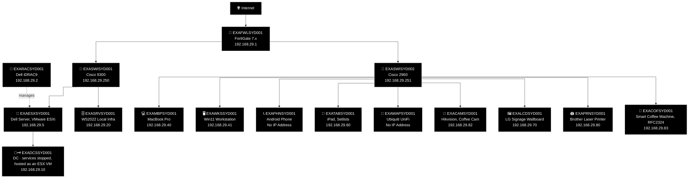
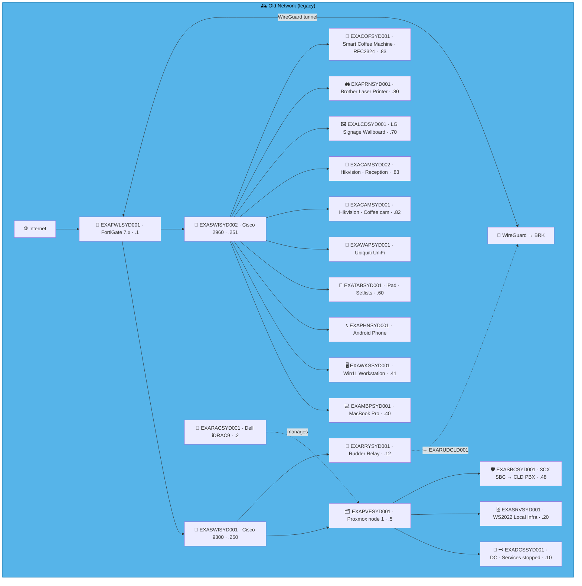
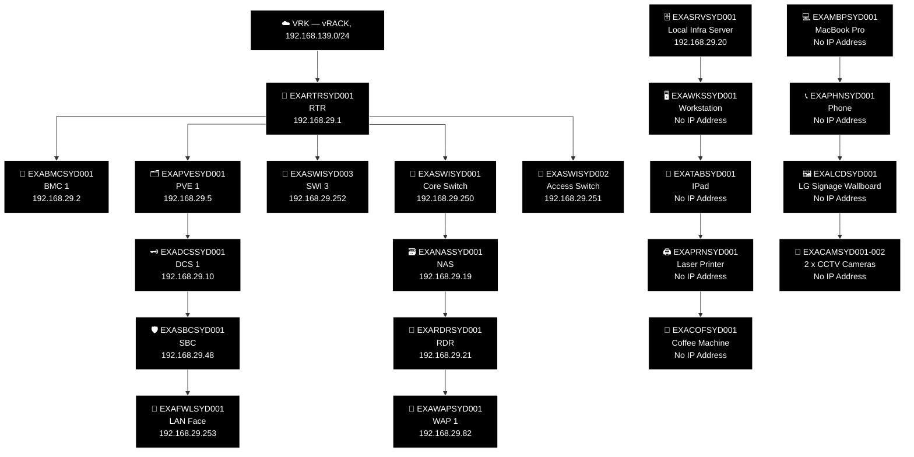
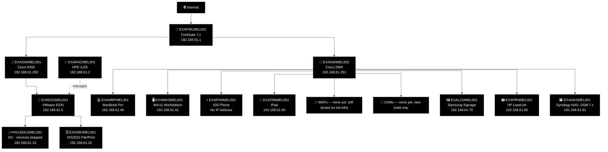
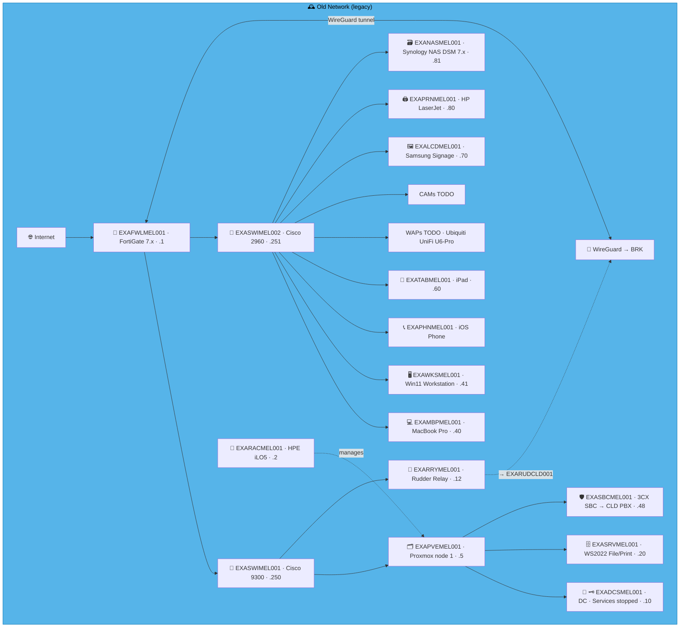
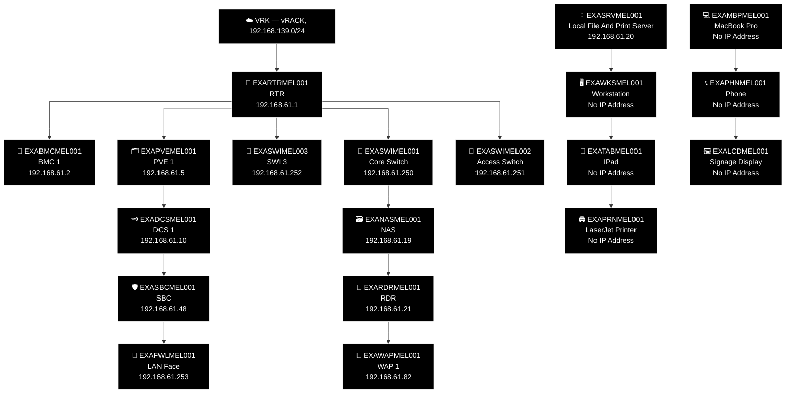

# Example Music Limited — Australia Network Diagrams

> **Classification:** Internal — Infrastructure
> **Part of:** [`../network-diagram.md`](../network-diagram.md) — see there for the Visual
> Standard (shape/colour/emoji convention), the full emoji legend, and links to every other
> region.

---

## SYD — Sydney ⚠️ 🎭

**LAN:** `192.168.29.0/24` · **Domain:** `example.net`  
**PVE nodes:** 1 · **VPN parent:** BRK  
> ⚠️ `EXADCSSYD001` — DNS, Netlogon and KDC services stopped.  
**Entity:** Example Music (Australia) Pty Ltd · **Landline:** +61 2 9000 0xxx · **Mobile:** +61 400 900 2xxx

### 🕰️ Old Network (legacy, hand restyled — prototype, not yet generated)

> **Corrected against Robert's real facts, 2026-07-31.** Standing corrections applied (no SBC;
> no `RRY`; no WireGuard on old infra). BMC confirmed Dell iDRAC9 (kept as documented — HP was a
> same-day slip, same pattern as LAX). Real ESX, and `EXADCSSYD001` genuinely ran as a VM on it —
> the "services stopped" state is real, kept. `EXACAMSYD002` (reception camera) removed — Robert:
> "it's bleed, we added CCTV as part of the new build" — confirmed by `devices.csv`'s own
> `Legacy=no` flag on that specific row; also resolves an octet collision with the coffee machine
> (`.83`), which keeps its real IP now the bleed is gone. Everything else (FWL, both switches,
> local infra server, MacBook, workstation, phone, iPad, WAP, coffee-area camera, signage, and
> printer) confirmed real via `devices.csv`.

> 🚨 **Migration priority — Tier 1.** DNS/Netlogon/KDC stopped on the ESX-hosted DC. Not a
> repair candidate — the fix is a new `EXADCSSYD001` build promoting and replicating against
> `EXADCSCLD001` (`ansible/playbooks/windows_dc/`), not restoring this node.

Original hand-maintained Old Network box (pre-restyle, kept for reference during prototype review)

### 🗺️ Topology sketch (generated — see benarbejde/generate_network_diagrams.py)

---

## MEL — Melbourne ⚠️ 🎨

**LAN:** `192.168.61.0/24` · **Domain:** `example.net`  
**PVE nodes:** 1 · **VPN parent:** BRK  
> ⚠️ `EXADCSMEL001` — DNS, Netlogon and KDC services stopped.  
**Entity:** Example Music (Australia) Pty Ltd · **Landline:** +61 3 9000 0xxx · **Mobile:** +61 400 901 2xxx

### 🕰️ Old Network (legacy, hand restyled — prototype, not yet generated)

> **Corrected against Robert's real facts, 2026-07-31.** Standing corrections applied (no SBC;
> no `RRY`; no WireGuard on old infra). Real, working ESX (HPE iLO5-managed), replaced by a new
> node in the new build. The DC's "services stopped" warning confirmed real. NAS
> (`EXANASMEL001`, Synology) confirmed real — replaced by a new TrueNAS node on new hardware, but
> the old Synology itself genuinely existed (missing from `devices.csv` for some other reason,
> not fabrication). WAPs confirmed never used — still in their boxes.

> 🚨 **Migration priority — Tier 1.** DNS/Netlogon/KDC stopped on the ESX-hosted DC. Not a
> repair candidate — the fix is a new `EXADCSMEL001` build promoting and replicating against
> `EXADCSCLD001` (`ansible/playbooks/windows_dc/`), not restoring this node.

Original hand-maintained Old Network box (pre-restyle, kept for reference during prototype review)

### 🗺️ Topology sketch (generated — see benarbejde/generate_network_diagrams.py)

