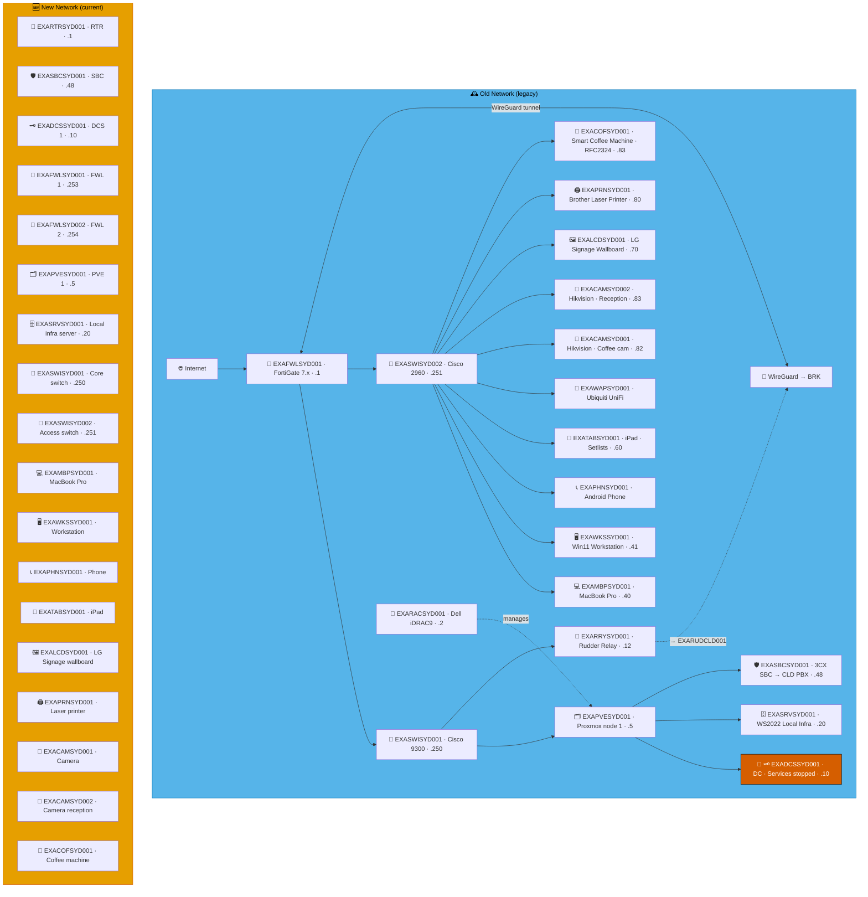
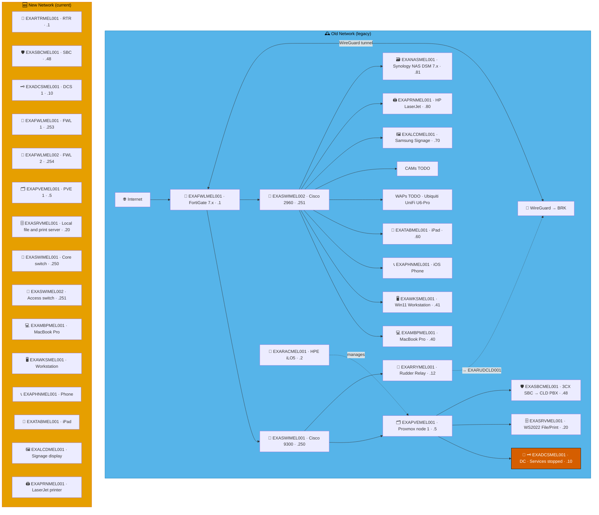

# Example Music Limited — Australia Network Diagrams

> **Classification:** Internal — Infrastructure
> **Part of:** [`../network-diagram.md`](../network-diagram.md) — see there for the Visual
> Standard (shape/colour/emoji convention), the full emoji legend, and links to every other
> region.

---

## SYD — Sydney ⚠️ 🎭

**LAN:** `192.168.29.0/24` · **Domain:** `example.net`  
**PVE nodes:** 1 · **VPN parent:** BRK  
> ⚠️ `EXADCSSYD001` — DNS, Netlogon and KDC services stopped.  
**Entity:** Example Music (Australia) Pty Ltd · **Landline:** +61 2 9000 0xxx · **Mobile:** +61 400 900 2xxx

---

## MEL — Melbourne ⚠️ 🎨

**LAN:** `192.168.61.0/24` · **Domain:** `example.net`  
**PVE nodes:** 1 · **VPN parent:** BRK  
> ⚠️ `EXADCSMEL001` — DNS, Netlogon and KDC services stopped.  
**Entity:** Example Music (Australia) Pty Ltd · **Landline:** +61 3 9000 0xxx · **Mobile:** +61 400 901 2xxx

