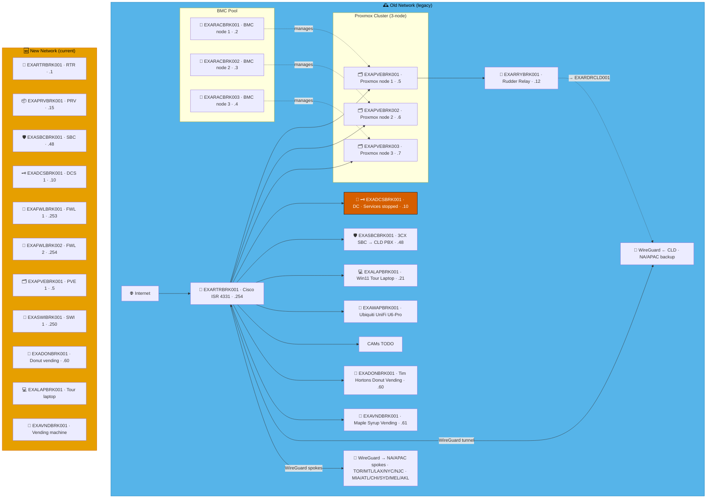
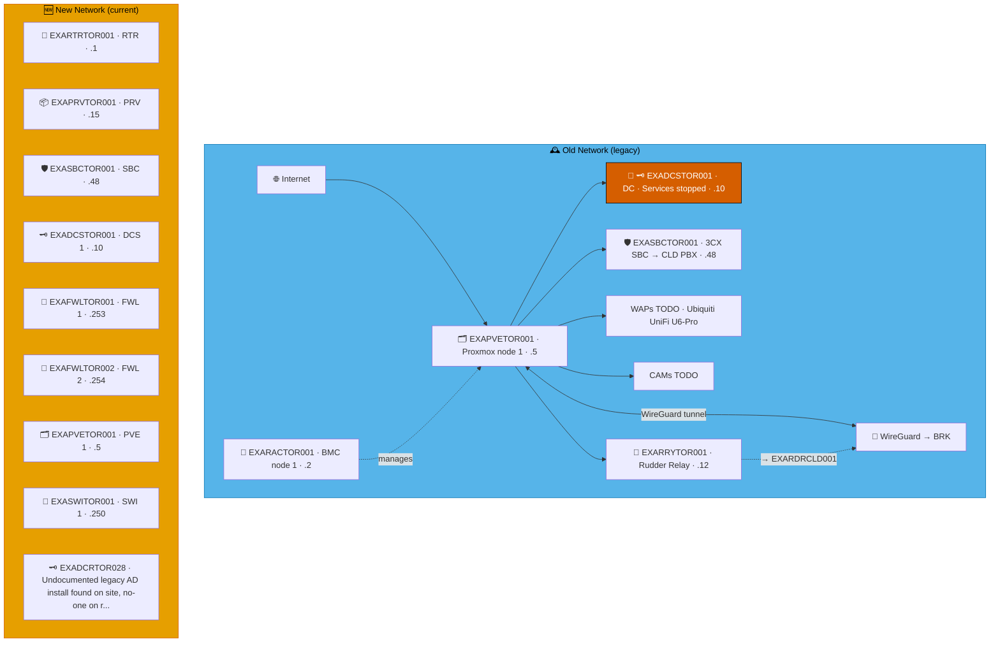
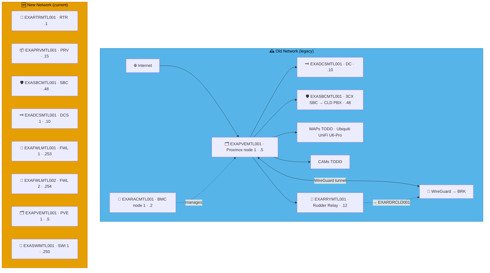

# Example Music Limited — Canada Network Diagrams

> **Classification:** Internal — Infrastructure
> **Part of:** [`../network-diagram.md`](../network-diagram.md) — see there for the Visual
> Standard (shape/colour/emoji convention), the full emoji legend, and links to every other
> region.

---

## BRK — Brockville *(NA/APAC Hub)* ⭐ 🍁

**LAN:** `192.168.136.0/24` · **Domain:** `example.net`  
**PVE nodes:** 3 (NA/APAC hub) · **VPN parent:** CLD (NA/APAC backup)  
> ⚠️ `EXADCSBRK001` — DNS, Netlogon and KDC services stopped.  
**Entity:** Example Music (Canada) Inc. · **Landline:** +1 613 555 6xxx · **Mobile:** +1 613 555 6xxx

---

## TOR — Toronto ⚠️ 🗼

**LAN:** `192.168.146.0/24` · **Domain:** `example.net`  
**PVE nodes:** 1 · **VPN parent:** BRK  
> ⚠️ `EXADCSTOR001` — DNS, Netlogon and KDC services stopped.  
**Entity:** Example Music (Canada) Inc. · **Landline:** +1 416 555 xxxx · **Mobile:** +1 647 555 xxxx

---

## MTL — Montreal ⚜️

**LAN:** `192.168.154.0/24` · **Domain:** `example.net`  
**PVE nodes:** 1 · **VPN parent:** BRK  
**Entity:** Example Music (Canada) Inc. · **Landline:** +1 514 400 0xxx · **Mobile:** +1 514 900 2xxx

