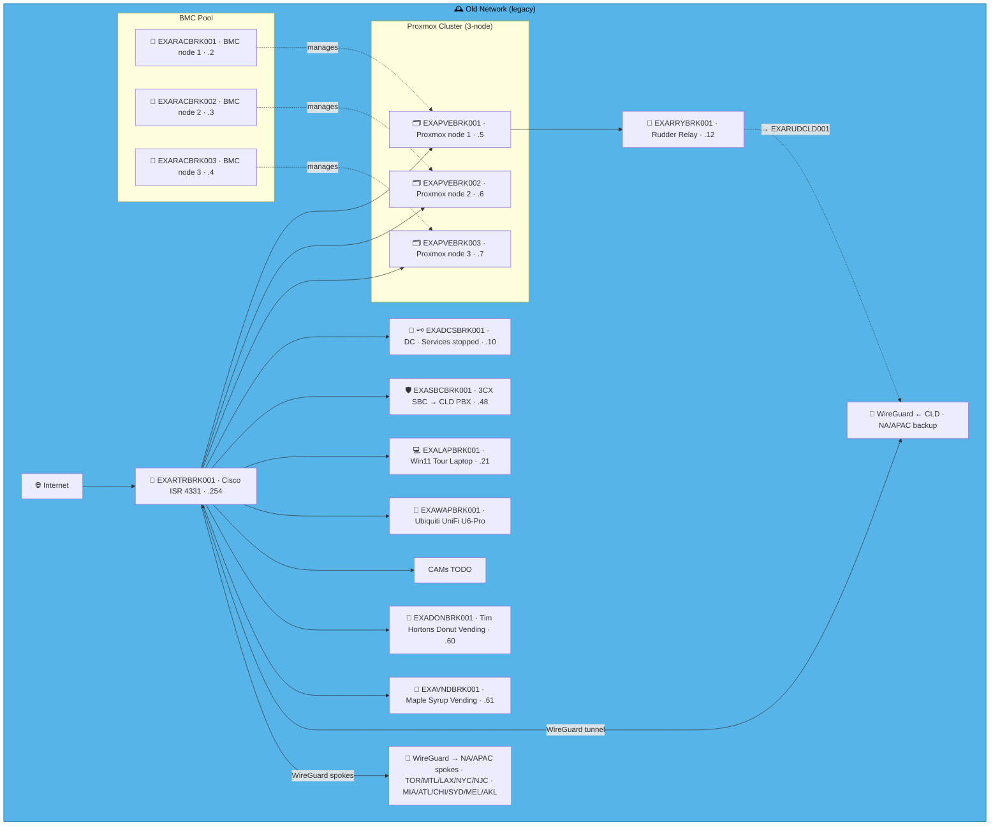
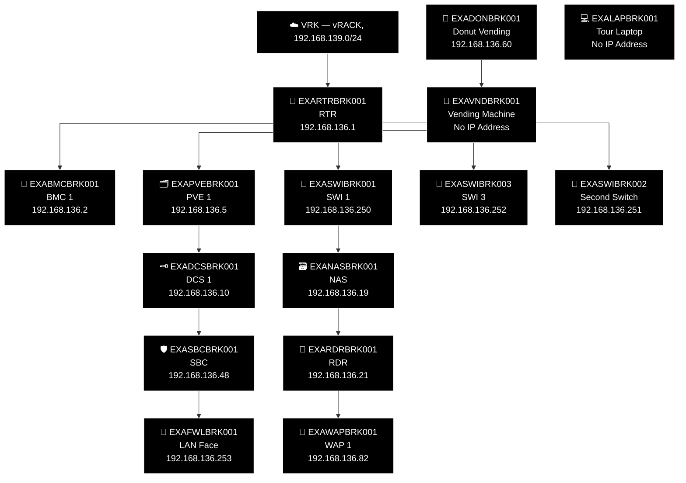
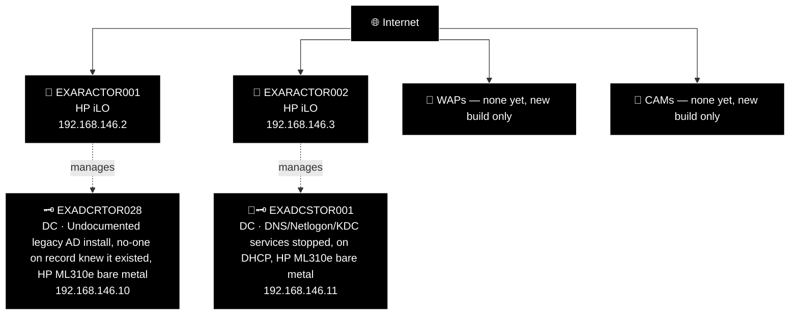
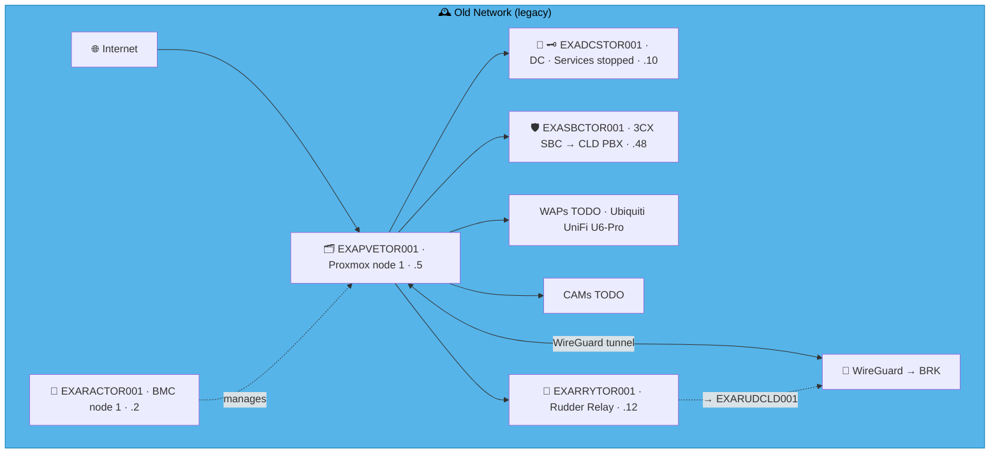
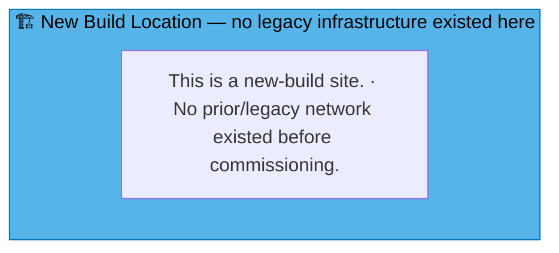
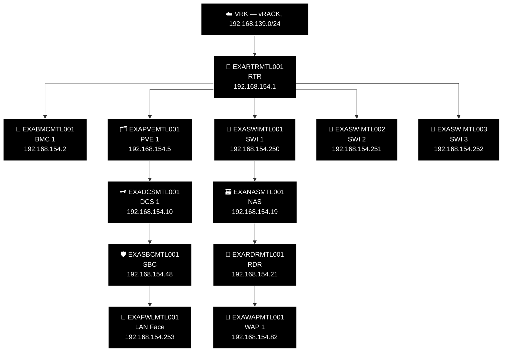

# Example Music Limited — Canada Network Diagrams

> **Classification:** Internal — Infrastructure
> **Part of:** [`../network-diagram.md`](../network-diagram.md) — see there for the Visual
> Standard (shape/colour/emoji convention), the full emoji legend, and links to every other
> region.

---

## BRK — Brockville *(NA/APAC Hub)* ⭐ 🍁

**LAN:** `192.168.136.0/24` · **Domain:** `example.net`  
**PVE nodes:** 3 (NA/APAC hub) · **VPN parent:** CLD (NA/APAC backup)  
> ⚠️ `EXADCSBRK001` — DNS, Netlogon and KDC services stopped.  
**Entity:** Example Music (Canada) Inc. · **Landline:** +1 613 555 6xxx · **Mobile:** +1 613 555 6xxx

### 🕰️ Old Network (legacy, hand restyled — prototype, not yet generated)

> **Corrected against Robert's real facts, 2026-07-31.** Standing corrections applied (no SBC;
> no `RRY`; no WireGuard on old infra — including BRK's own hub/spoke relay to the NA/APAC sites,
> same "old sites had zero connectivity to each other" rule confirmed for both hub sites now).
> Like ODE: a genuinely real 3-node cluster — VMware ESXi, managed by a real vCenter
> (`EXAVCTBRK001`) plus per-node BMCs. **Presumed** the same HP ML310e/iLO hardware as every other
> confirmed site so far — not independently re-confirmed for BRK, flag if different. The DC's
> "services stopped" warning is real (confirmed, unlike NJC/ATL/CHI's copy-pasted version of the
> same text) — kept, and now correctly shown as a VM hosted on the cluster/vCenter rather than a
> standalone box, per Robert: "the DC node was on this vcentre." Laptop, WAP, and both vending
> machines (donut, maple syrup) all confirmed real.

> 🚨 **Migration priority — Tier 1 (highest).** DNS/Netlogon/KDC stopped on the NA/APAC hub
> site's own DC. Not a repair candidate — the fix is a new `EXADCSBRK001` build promoting and
> replicating against `EXADCSCLD001` (`ansible/playbooks/windows_dc/`), not restoring this node;
> the whole point of building `EXADCSCLD001` as forest root was to get every site's DC talking
> to it and replicating around, independent of whatever state the old box was in.

```mermaid
%%{init: {'flowchart': {'curve': 'stepAfter'}}}%%
graph TD
    O_INET["🌐 Internet"]
    O_RTR["📡 EXARTRBRK001<br/>Cisco ISR 4331<br/>192.168.136.1"]
    O_INET --> O_RTR

    O_ILO1["🔧 EXARACBRK001<br/>HP iLO 1<br/>192.168.136.2"]
    O_ILO2["🔧 EXARACBRK002<br/>HP iLO 2<br/>192.168.136.3"]
    O_ILO3["🔧 EXARACBRK003<br/>HP iLO 3<br/>192.168.136.4"]
    O_ESX1["💾 EXAESXBRK001<br/>HP ML310e, VMware ESXi 1<br/>192.168.136.5"]
    O_ESX2["💾 EXAESXBRK002<br/>HP ML310e, VMware ESXi 2<br/>192.168.136.6"]
    O_ESX3["💾 EXAESXBRK003<br/>HP ML310e, VMware ESXi 3<br/>192.168.136.7"]
    O_VCT["🛰️ EXAVCTBRK001<br/>VMware vCenter · cluster management<br/>IP not recorded"]
    O_RTR --> O_ESX1
    O_RTR --> O_ESX2
    O_RTR --> O_ESX3
    O_RTR --> O_VCT
    O_ILO1 -.->|"manages"| O_ESX1
    O_ILO2 -.->|"manages"| O_ESX2
    O_ILO3 -.->|"manages"| O_ESX3
    O_VCT -.->|"manages"| O_ESX1
    O_VCT -.->|"manages"| O_ESX2
    O_VCT -.->|"manages"| O_ESX3

    O_DC["🔴🗝️ EXADCSBRK001<br/>DC · DNS/Netlogon/KDC services stopped, hosted on the vCenter cluster<br/>192.168.136.10"]
    O_VCT --> O_DC

    O_LAP["💻 EXALAPBRK001<br/>Win11 Tour Laptop<br/>192.168.136.21"]
    O_WAP["📶 EXAWAPBRK001<br/>Ubiquiti UniFi U6-Pro<br/>No IP Address"]
    O_CAM["🎥 CAMs — none yet, new build only"]
    O_VND1["🍩 EXADONBRK001<br/>Tim Hortons Donut Vending<br/>192.168.136.60"]
    O_VND2["🍫 EXAVNDBRK001<br/>Maple Syrup Vending<br/>192.168.136.61"]
    O_RTR --> O_LAP
    O_RTR --> O_WAP
    O_RTR --> O_CAM
    O_RTR --> O_VND1
    O_RTR --> O_VND2

    style O_INET fill:#000000,stroke:#FFFFFF,color:#FFFFFF
    style O_RTR fill:#000000,stroke:#FFFFFF,color:#FFFFFF
    style O_ILO1 fill:#000000,stroke:#FFFFFF,color:#FFFFFF
    style O_ILO2 fill:#000000,stroke:#FFFFFF,color:#FFFFFF
    style O_ILO3 fill:#000000,stroke:#FFFFFF,color:#FFFFFF
    style O_ESX1 fill:#000000,stroke:#FFFFFF,color:#FFFFFF
    style O_ESX2 fill:#000000,stroke:#FFFFFF,color:#FFFFFF
    style O_ESX3 fill:#000000,stroke:#FFFFFF,color:#FFFFFF
    style O_VCT fill:#000000,stroke:#FFFFFF,color:#FFFFFF
    style O_DC fill:#000000,stroke:#FFFFFF,color:#FFFFFF
    style O_LAP fill:#000000,stroke:#FFFFFF,color:#FFFFFF
    style O_WAP fill:#000000,stroke:#FFFFFF,color:#FFFFFF
    style O_CAM fill:#000000,stroke:#FFFFFF,color:#FFFFFF
    style O_VND1 fill:#000000,stroke:#FFFFFF,color:#FFFFFF
    style O_VND2 fill:#000000,stroke:#FFFFFF,color:#FFFFFF
```

Original hand-maintained Old Network box (pre-restyle, kept for reference during prototype review)

### 🗺️ Topology sketch (generated — see benarbejde/generate_network_diagrams.py)

---

## TOR — Toronto ⚠️ 🗼

**LAN:** `192.168.146.0/24` · **Domain:** `example.net`  
**PVE nodes:** 1 · **VPN parent:** BRK  
**Entity:** Example Music (Canada) Inc. · **Landline:** +1 416 555 xxxx · **Mobile:** +1 647 555 xxxx

### 🕰️ Old Network (legacy, hand restyled — prototype, not yet generated)

> **Corrected against Robert's real facts, 2026-07-31.** Standing corrections applied (no SBC;
> no `RRY`; no WireGuard on old infra). TOR genuinely had **two** DCs, both bare metal on
> separate HP ML310e boxes with iLO cards, both decommissioned once the new network was up: the
> already-known `EXADCRTOR028` ("undocumented... no-one on record knew it existed", excluded
> from the *new* topology diagrams via check 29 but real, historical content that belongs here),
> and `EXADCSTOR001` — services stopped, and genuinely running on DHCP. Second iLO hostname
> (`EXARACTOR002`) follows the standard numbering convention, not independently confirmed
> per-device — flag if wrong. WAP/CAM confirmed genuinely never-installed.

> 🚨 **Migration priority — Tier 1.** `EXADCSTOR001` — services stopped and running on DHCP.
> Not a repair candidate — the fix is a new `EXADCSTOR001` build promoting and replicating
> against `EXADCSCLD001` (`ansible/playbooks/windows_dc/`), not restoring this node.
>
> 🚩 **Governance flag — undocumented node.** `EXADCRTOR028` — no-one on record knew this DC
> existed until this audit. Confirm its decommission status directly rather than presuming it's
> gone just because the new build never referenced it.

Original hand-maintained Old Network box (pre-restyle, kept for reference during prototype review)

### 🗺️ Topology sketch (generated — see benarbejde/generate_network_diagrams.py)

---

## MTL — Montreal ⚜️

**LAN:** `192.168.154.0/24` · **Domain:** `example.net`  
**PVE nodes:** 1 (reserved — see notes below) · **VPN parent:** BRK  
**Entity:** Example Music (Canada) Inc. · **Landline:** +1 514 400 0xxx · **Mobile:** +1 514 900 2xxx

> **New-build site — corrected 2026-07-31.** The previous "Old Network" box here was entirely
> fabricated template content — zero real `devices.csv` rows exist for MTL, and Robert confirmed
> it's an expansion office. Converted to the same "New Build Location" placeholder pattern used
> for FRD/NYB/SEA/SFO/FRE/DRS/DUS/GOT/OSL/AMS/MIL/VIE/BRT.

### 🗺️ Topology sketch (generated — see benarbejde/generate_network_diagrams.py)

