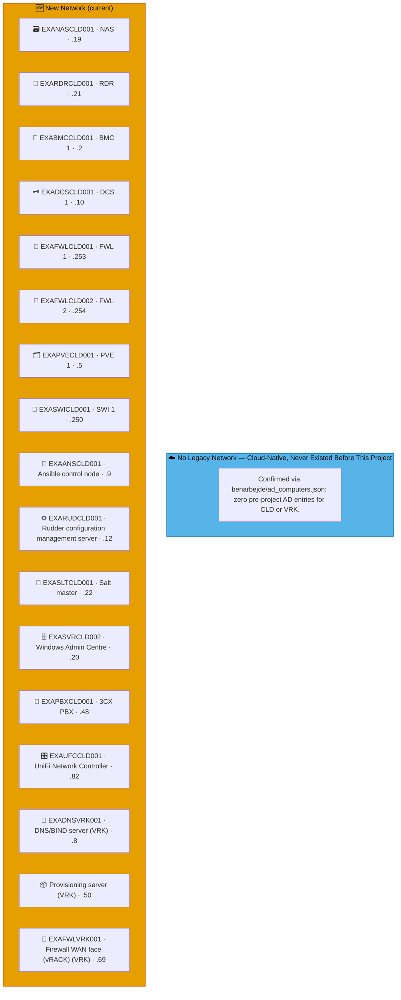
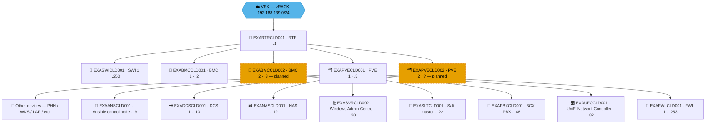

# Example Music Limited — Cloud (CLD) Network Diagrams

> **Classification:** Internal — Infrastructure
> **Part of:** [`../network-diagram.md`](../network-diagram.md) — see there for the Visual
> Standard (shape/colour/emoji convention), the full emoji legend, and links to every other
> region.

---

## ☁️  — Cloud / Provisioning

**vRACK (`VRK`):** `192.168.139.0/24` · **CLD LAN:** `192.168.69.0/24` · **WireGuard VPN:** `10.0.69.0/24`
**Role:** WireGuard hub — routes to all sites. Central PBX, Ansible, Rudder, WAC.
CLD's own LAN is `192.168.69.0/24` — the vRACK (`192.168.139.0/24`) is a separate site code, `VRK`.  
**Entity:** Example Music Limited · **Landline:** N/A · **Mobile:** N/A

> **CLD and VRK never had a legacy network — confirmed, not assumed.** Neither appears anywhere in
> `benarbejde/ad_computers.json` (the real pre-project Active Directory export the TDF file
> captured) — zero entries for either site code. Both are purely current infrastructure, added as
> part of this project. The box below reflects that; VRK's real devices (it has no diagram section
> of its own) now show up in the New Network box, folded in by `generate_network_diagrams.py`.

---

## 🗺️ Topology sketch (draft, hand-drawn — not yet generated)

