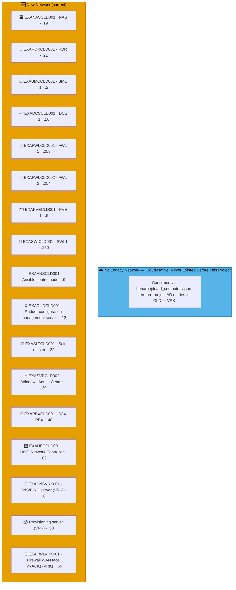
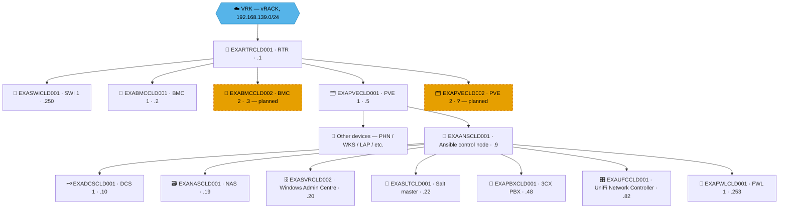

# Example Music Limited — Cloud (CLD) Network Diagrams

> **Classification:** Internal — Infrastructure
> **Part of:** [`../network-diagram.md`](../network-diagram.md) — see there for the Visual
> Standard (shape/colour/emoji convention), the full emoji legend, and links to every other
> region.

---

## ☁️  — Cloud / Provisioning

**vRACK (`VRK`):** `192.168.139.0/24` · **CLD LAN:** `192.168.69.0/24` · **WireGuard VPN:** `10.0.69.0/24`
**Role:** WireGuard hub — routes to all sites. Central PBX, Ansible, Rudder, WAC.
CLD's own LAN is `192.168.69.0/24` — the vRACK (`192.168.139.0/24`) is a separate site code, `VRK`.  
**Entity:** Example Music Limited · **Landline:** N/A · **Mobile:** N/A

> **CLD and VRK never had a legacy network — confirmed, not assumed.** Neither appears anywhere in
> `benarbejde/ad_computers.json` (the real pre-project Active Directory export the TDF file
> captured) — zero entries for either site code. Both are purely current infrastructure, added as
> part of this project. The box below reflects that; VRK's real devices (it has no diagram section
> of its own) now show up in the New Network box, folded in by `generate_network_diagrams.py`.

---

## 🗺️ Topology sketch (draft, hand-drawn — not yet generated)

> **Draft, 2026-07-30.** Robert sketched this by hand as an ASCII diagram to fix the layout/flow he
> wants before any topology view gets built into `generate_network_diagrams.py` proper. This block
> is a first attempt at the same shape in real mermaid, hand-maintained (not marker-wrapped, so
> regeneration won't touch it) — for review, not final. Reads: `VRK` is the vRACK boundary the
> whole CLD network hangs off; `EXARTRCLD001` is the gateway router; `EXASWICLD001`/BMC pair/PVE
> pair all connect off the router; `EXAPVECLD001` hosts everything below it as VMs, fanning out from
> `EXAANSCLD001`. Dashed nodes (`EXABMCCLD002`, `EXAPVECLD002`) are the "not yet in production,
> future expansion" items from Robert's sketch.
>
> **Open questions before this is final** (the original ASCII was genuinely ambiguous at this level
> of detail, called out rather than guessed silently):
> - Does `EXASWICLD001` branch directly off the router, same as the BMC/PVE pairs, or off something
>   else? Drawn as a direct router child here.
> - Is the DCS/NAS/SVR/SLT/PBX/UFC/FWL1 block really a flat fan-out all hanging off
>   `EXAANSCLD001` (drawn that way below, reading the repeated `|--|` ladder in the ASCII as
>   siblings, not a chain), or did you mean something more specific by the ordering?
> - Not included yet, pending your call on whether/how they fit into this view: `EXARDRCLD001`
>   (badge reader), `EXAFWLCLD002` (2nd firewall, confirmed not yet in use), VRK's own real devices
>   (`EXADNSVRK001`, `EXAFWLVRK001` WAN face, the provisioning server), and `EXARUDCLD001` (Rudder —
>   confirmed dormant/reference-only, see `project_rudder_dormant_docs_correction` in memory food for
>   thought on whether it belongs in a *current* topology view at all).

