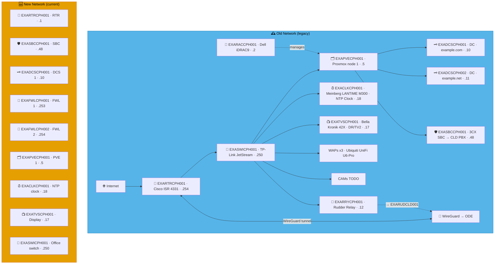
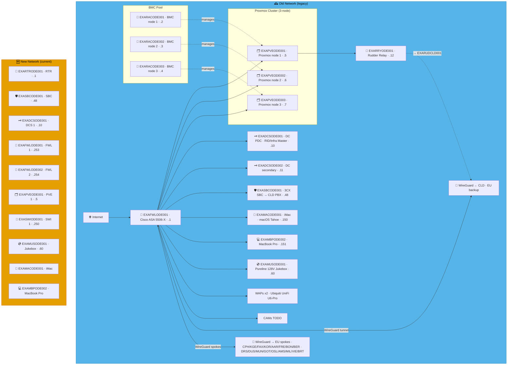
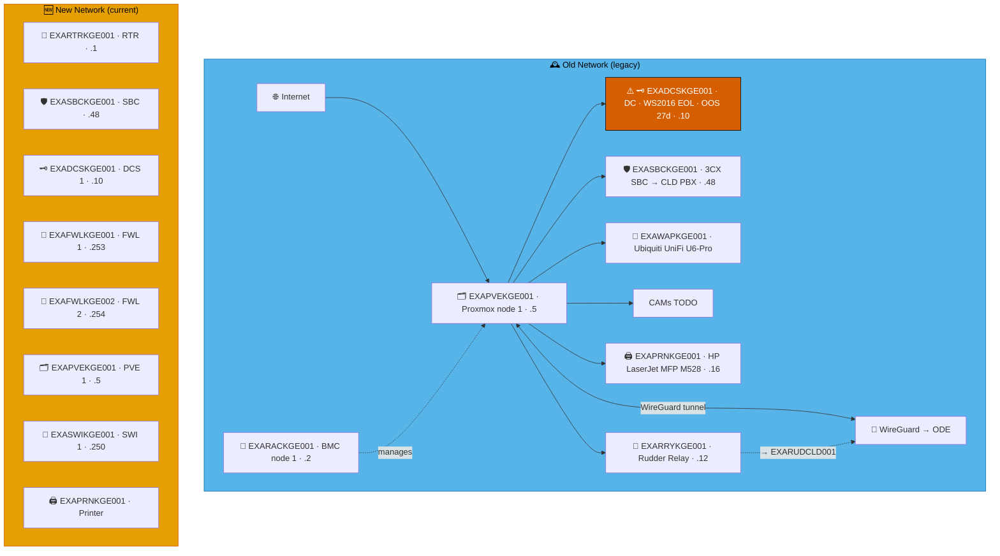
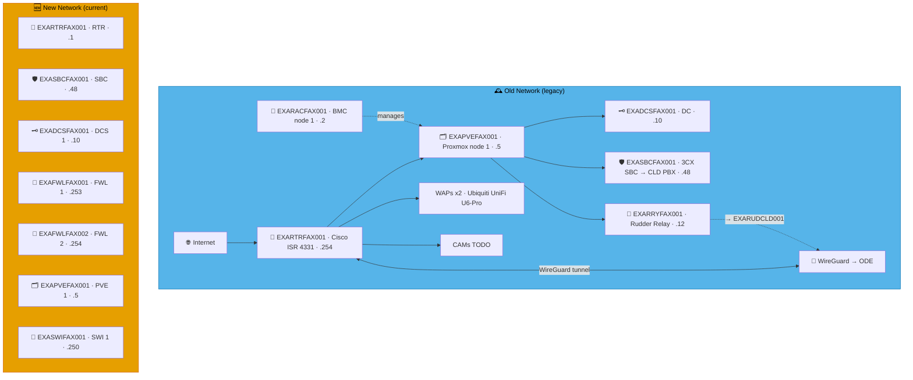
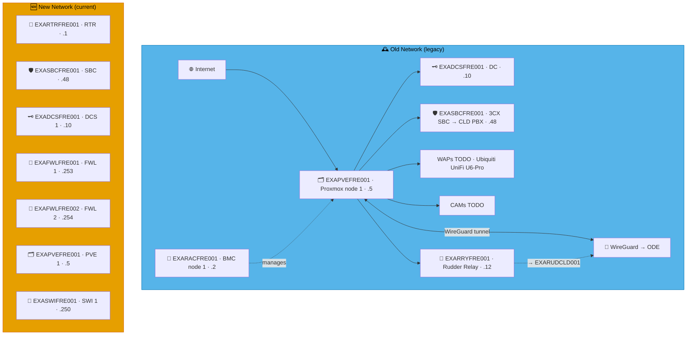
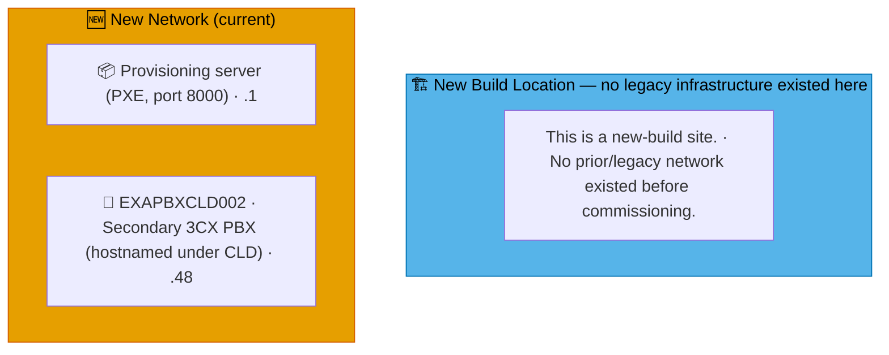
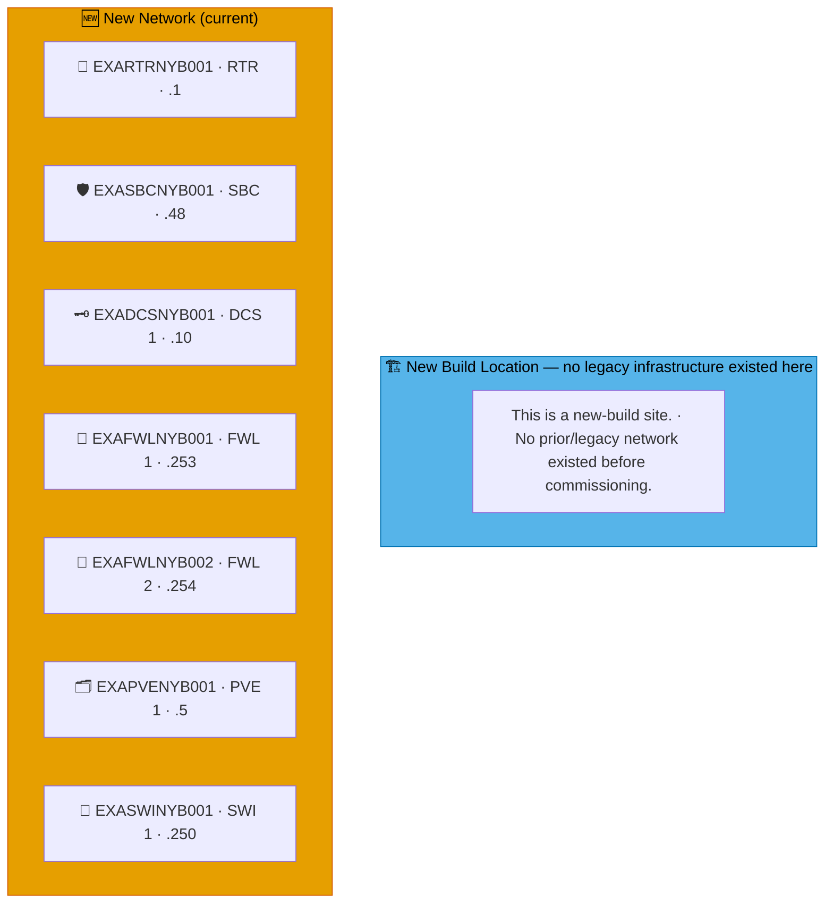

# Example Music Limited — Danmark Network Diagrams

> **Classification:** Internal — Infrastructure
> **Part of:** [`../network-diagram.md`](../network-diagram.md) — see there for the Visual
> Standard (shape/colour/emoji convention), the full emoji legend, and links to every other
> region.

---

## CPH — København 🧜‍♀️

**LAN:** `192.168.231.0/24` · **Domain:** `example.com` / `example.net`  
**PVE nodes:** 1 · **VPN parent:** ODE  
**Entity:** Example Music (Danmark) ApS · **Landline:** +45 00 000 xxx · **Mobile:** +45 2x xxx xxx

---

## ODE — Odense *(EU Hub)* ⭐ 🎩

**LAN:** `192.168.126.0/24` · **Domain:** `example.net`  
**PVE nodes:** 3 (EU hub) · **VPN parent:** CLD (EU backup)  
**Entity:** Example Music (Danmark) ApS · **Landline:** +45 00 000 xxx · **Mobile:** +45 2x xxx xxx

---

## KGE — Køge ⚠️ 🏘️

**LAN:** `192.168.65.0/24` · **Domain:** `example.net`  
**PVE nodes:** 1 · **VPN parent:** ODE  
> ⚠️ DC out of sync 27 days · WS2016 EOL · disk space low — rebuild required  
**Entity:** Example Music (Danmark) ApS · **Landline:** +45 00 000 xxx · **Mobile:** +45 2x xxx xxx

---

## FAX — Faxe 🥤

**LAN:** `192.168.246.0/24` · **Domain:** `example.net`  
**PVE nodes:** 1 · **VPN parent:** ODE  
**Entity:** Example Music (Danmark) ApS · **Landline:** +45 00 000 xxx · **Mobile:** +45 2x xxx xxx

---

## KOR — Korsør 🚂

**LAN:** `192.168.238.0/24` · **Domain:** `example.net`  
**PVE nodes:** 1 · **VPN parent:** ODE  
**Entity:** Example Music (Danmark) ApS · **Landline:** +45 00 000 xxx · **Mobile:** +45 2x xxx xxx

---

## AAR — Aarhus 🎓

**LAN:** `192.168.86.0/24` · **Domain:** `example.net`  
**PVE nodes:** 1 · **VPN parent:** ODE  
**Entity:** Example Music (Danmark) ApS · **Landline:** +45 00 000 xxx · **Mobile:** +45 2x xxx xxx

---

## FRE — Fredericia 🏯

**LAN:** `192.168.75.0/24` · **Domain:** `example.net`  
**PVE nodes:** 1 · **VPN parent:** ODE  
**Entity:** Example Music (Danmark) ApS · **Landline:** +45 75 xx xx xx · **Mobile:** +45 2x xx xx xx

---

## FRD — Fredericia Havn *(New Build)* ⚓

**LAN:** `172.16.124.0/24` · **Domain:** `example.net`  
**PVE nodes:** 0 — see notes below · **VPN parent:** CLD (direct, non-standard networking)  
**Entity:** Example Music Limited · **Landline:** N/A · **Mobile:** N/A

> **New-build site.** No legacy infrastructure ever existed here — see the "New Build Location" box below in place of "Old Network." Fredericia Havn is one machine today: a MacBook running `python3 -m http.server 8000` as a PXE mirror, plus a secondary 3CX PBX hostnamed under CLD (`EXAPBXCLD002`) but physically here — see `benarbejde/generate_inventory.py`'s `NON_STANDARD_SITES`/`SubnetSite` handling.

---

## NYB — Nyborg *(New Build)* 📜

**LAN:** `192.168.90.0/24` · **Domain:** `example.net`  
**PVE nodes:** 1 (reserved — see notes below) · **VPN parent:** ODE  
**Entity:** Example Music (Danmark) ApS · **Landline:** +45 80 400 0xxx · **Mobile:** +45 200 900 2xxx

> **New-build site.** No legacy infrastructure ever existed here — see the "New Build Location" box below in place of "Old Network." Standard-slot addresses are allocated in `benarbejde/address_policy.json`/`sites.csv` the same as any other site (this is what makes the .ini/DNS generation already treat them as real, per the generated-file-freshness harness check) but no `devices.csv` exception rows exist yet — nothing beyond the standard template has been confirmed built on site.

