# Example Music Limited — Danmark Network Diagrams

> **Classification:** Internal — Infrastructure
> **Part of:** [`../network-diagram.md`](../network-diagram.md) — see there for the Visual
> Standard (shape/colour/emoji convention), the full emoji legend, and links to every other
> region.

---

## CPH — København 🧜‍♀️

**LAN:** `192.168.231.0/24` · **Domain:** `example.com` / `example.net`  
**PVE nodes:** 1 · **VPN parent:** ODE  
**Entity:** Example Music (Danmark) ApS · **Landline:** +45 00 000 xxx · **Mobile:** +45 2x xxx xxx

### 🕰️ Old Network (legacy, hand restyled — prototype, not yet generated)

> **Corrected against Robert's real facts, 2026-07-31.** Standing corrections applied (ESX not
> PVE; no SBC; no `RRY`; no WireGuard on old infra). Real working ESX box confirmed
> (`EXAESXCPH001`), managed by the Dell iDRAC9 already on record (`EXARACCPH001`, kept as `RAC`).
> Both DCs (dual-domain, example.com/example.net) hosted on it. NTP clock, TV display, and WAPs
> (×3, real count already on record) all kept as-is.

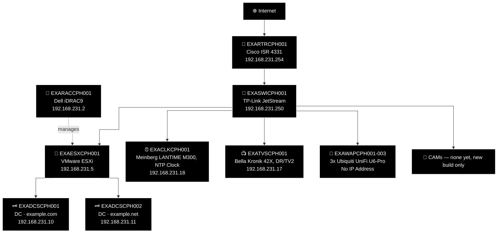

<details>
<summary>Original hand-maintained Old Network box (pre-restyle, kept for reference during prototype review)</summary>

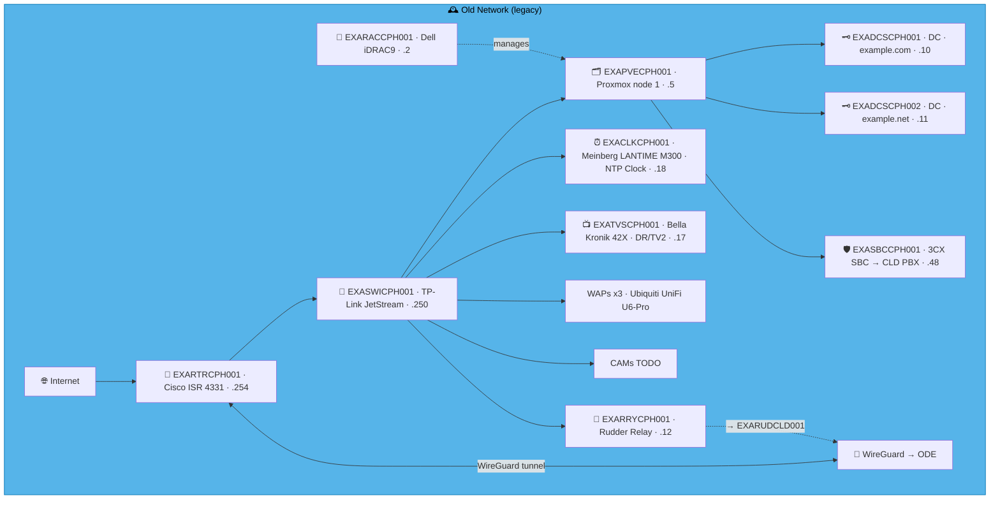

</details>

### 🗺️ Topology sketch (generated — see benarbejde/generate_network_diagrams.py)

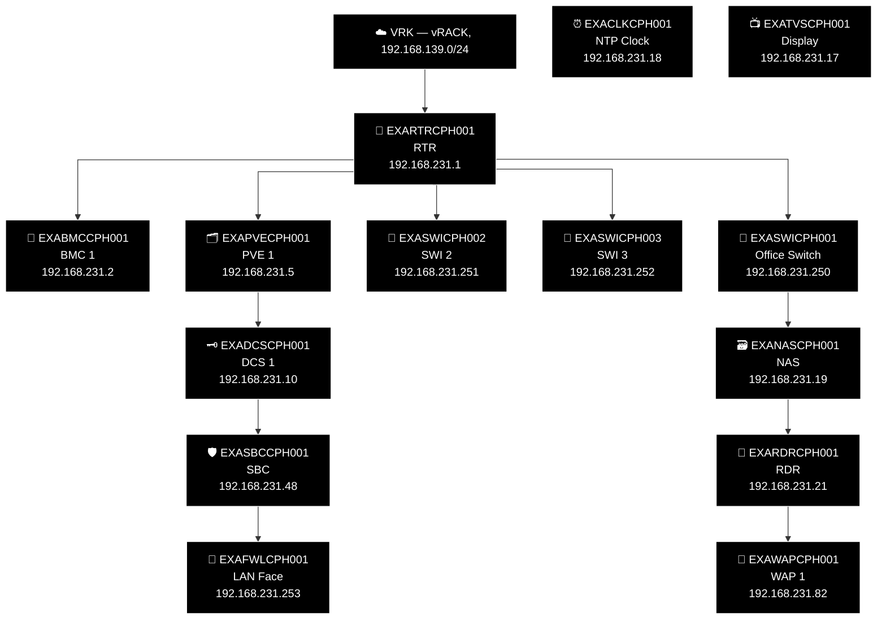

---

## ODE — Odense *(EU Hub)* ⭐ 🎩

**LAN:** `192.168.126.0/24` · **Domain:** `example.net`  
**PVE nodes:** 3 (EU hub) · **VPN parent:** CLD (EU backup)  
**Entity:** Example Music (Danmark) ApS · **Landline:** +45 00 000 xxx · **Mobile:** +45 2x xxx xxx

### 🕰️ Old Network (legacy, hand restyled — prototype, not yet generated)

> **Corrected against Robert's real facts, 2026-07-31.** Standing corrections applied (no SBC;
> no `RRY`; no WireGuard on old infra — including ODE's own hub/spoke relay to the EU sites,
> confirmed the same "old sites had zero connectivity to each other, in any form" rule applies
> even at the hub). Unlike FAL, ODE's 3-node cluster was **real** — genuine VMware ESXi on 3x HP
> ML310e, managed by 3x HP iLO (kept as `RAC`, corrected from generic "BMC node N" to the real
> vendor) — plus a new detail: a central VMware vCenter (`EXAVCTODE001`) managing the whole
> cluster, a new `VCT` type added to `role_codes.csv`/`docs/emojis/README.md`. iMac, MacBook Pro,
> jukebox, and WAPs (×2, real, moved over) all confirmed real.

```mermaid
%%{init: {'flowchart': {'curve': 'stepAfter'}}}%%
graph TD
    O_INET["🌐 Internet"]
    O_FWL["🧱 EXAFWLODE001<br/>Cisco ASA 5506-X<br/>192.168.126.1"]
    O_INET --> O_FWL

    O_ILO1["🔧 EXARACODE001<br/>HP iLO 1<br/>192.168.126.2"]
    O_ILO2["🔧 EXARACODE002<br/>HP iLO 2<br/>192.168.126.3"]
    O_ILO3["🔧 EXARACODE003<br/>HP iLO 3<br/>192.168.126.4"]
    O_ESX1["💾 EXAESXODE001<br/>HP ML310e, VMware ESXi 1<br/>192.168.126.5"]
    O_ESX2["💾 EXAESXODE002<br/>HP ML310e, VMware ESXi 2<br/>192.168.126.6"]
    O_ESX3["💾 EXAESXODE003<br/>HP ML310e, VMware ESXi 3<br/>192.168.126.7"]
    O_VCT["🛰️ EXAVCTODE001<br/>VMware vCenter · cluster management<br/>IP not recorded"]
    O_FWL --> O_ESX1
    O_FWL --> O_ESX2
    O_FWL --> O_ESX3
    O_FWL --> O_VCT
    O_ILO1 -.->|"manages"| O_ESX1
    O_ILO2 -.->|"manages"| O_ESX2
    O_ILO3 -.->|"manages"| O_ESX3
    O_VCT -.->|"manages"| O_ESX1
    O_VCT -.->|"manages"| O_ESX2
    O_VCT -.->|"manages"| O_ESX3

    O_DC1["🗝️ EXADCSODE001<br/>DC PDC, RID/Infra Master<br/>192.168.126.10"]
    O_DC2["🗝️ EXADCSODE002<br/>DC Secondary<br/>192.168.126.11"]
    O_FWL --> O_DC1
    O_FWL --> O_DC2

    O_MAC["🍎 EXAMACODE001<br/>iMac, macOS Tahoe<br/>192.168.126.150"]
    O_MBP["💻 EXAMBPODE002<br/>MacBook Pro<br/>192.168.126.151"]
    O_JKB["💿 EXAMUSODE001<br/>Pureline 128V Jukebox<br/>192.168.126.60"]
    O_WAP["📶 EXAWAPODE001-002<br/>2x Ubiquiti UniFi U6-Pro<br/>No IP Address"]
    O_CAM["🎥 CAMs — none yet, new build only"]
    O_FWL --> O_MAC
    O_FWL --> O_MBP
    O_FWL --> O_JKB
    O_FWL --> O_WAP
    O_FWL --> O_CAM

    style O_INET fill:#000000,stroke:#FFFFFF,color:#FFFFFF
    style O_FWL fill:#000000,stroke:#FFFFFF,color:#FFFFFF
    style O_ILO1 fill:#000000,stroke:#FFFFFF,color:#FFFFFF
    style O_ILO2 fill:#000000,stroke:#FFFFFF,color:#FFFFFF
    style O_ILO3 fill:#000000,stroke:#FFFFFF,color:#FFFFFF
    style O_ESX1 fill:#000000,stroke:#FFFFFF,color:#FFFFFF
    style O_ESX2 fill:#000000,stroke:#FFFFFF,color:#FFFFFF
    style O_ESX3 fill:#000000,stroke:#FFFFFF,color:#FFFFFF
    style O_VCT fill:#000000,stroke:#FFFFFF,color:#FFFFFF
    style O_DC1 fill:#000000,stroke:#FFFFFF,color:#FFFFFF
    style O_DC2 fill:#000000,stroke:#FFFFFF,color:#FFFFFF
    style O_MAC fill:#000000,stroke:#FFFFFF,color:#FFFFFF
    style O_MBP fill:#000000,stroke:#FFFFFF,color:#FFFFFF
    style O_JKB fill:#000000,stroke:#FFFFFF,color:#FFFFFF
    style O_WAP fill:#000000,stroke:#FFFFFF,color:#FFFFFF
    style O_CAM fill:#000000,stroke:#FFFFFF,color:#FFFFFF
```

<details>
<summary>Original hand-maintained Old Network box (pre-restyle, kept for reference during prototype review)</summary>

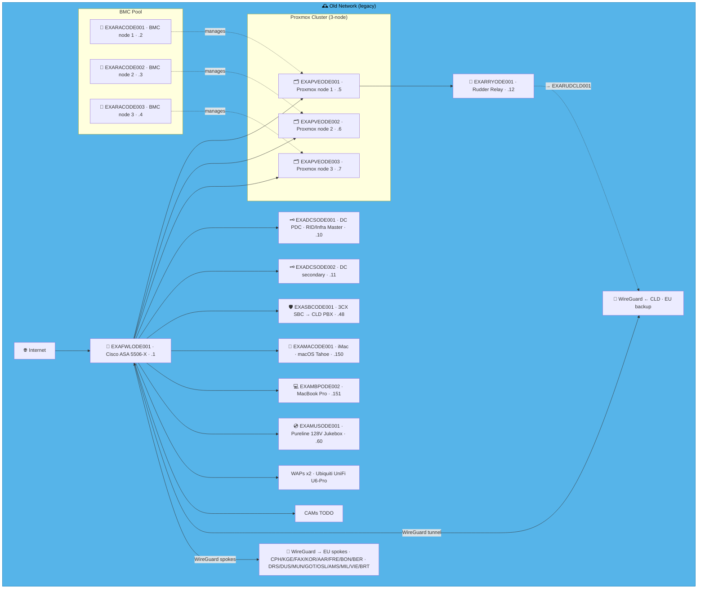

</details>
```

### 🗺️ Topology sketch (generated — see benarbejde/generate_network_diagrams.py)

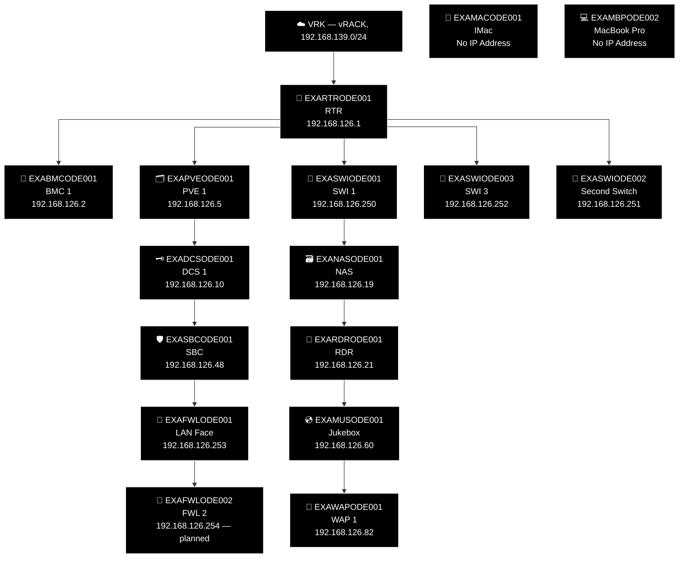

---

## KGE — Køge ⚠️ 🏘️

**LAN:** `192.168.65.0/24` · **Domain:** `example.net`  
**PVE nodes:** 1 · **VPN parent:** ODE  
> ⚠️ DC out of sync 27 days · WS2016 EOL · disk space low — rebuild required  
**Entity:** Example Music (Danmark) ApS · **Landline:** +45 00 000 xxx · **Mobile:** +45 2x xxx xxx

### 🕰️ Old Network (legacy, hand restyled — prototype, not yet generated)

> **Corrected against Robert's real facts, 2026-07-31.** Standing corrections applied (no SBC;
> no `RRY`; no WireGuard on old infra). No hypervisor here — `EXADCSKGE001` ran WS2016 bare metal
> directly on the RAC-managed hardware, same shape as ABD's Server 2008R2 box. The real ⚠️
> EOL/out-of-sync/disk-space warning kept per the migration-priority rule. WAP and printer both
> confirmed real, moving over as-is.

> 🚨 **Migration priority — Tier 2.** WS2016 EOL, 27 days out of AD sync, disk space low. Same
> remediation path as Tier 1: a new `EXADCSKGE001` build promoting and replicating against
> `EXADCSCLD001` (`ansible/playbooks/windows_dc/`), not patching this box.

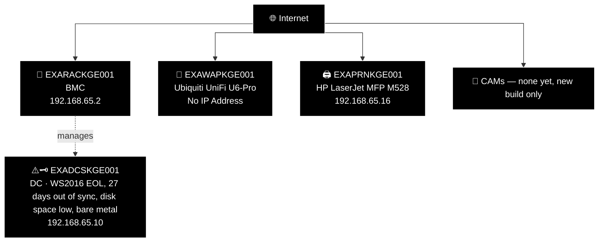

<details>
<summary>Original hand-maintained Old Network box (pre-restyle, kept for reference during prototype review)</summary>

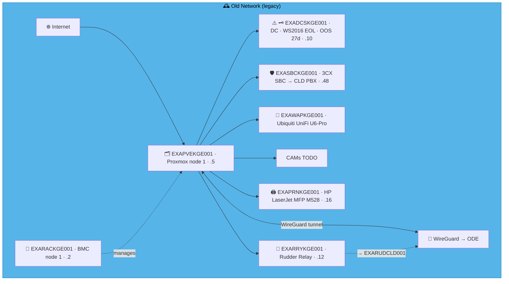

</details>

### 🗺️ Topology sketch (generated — see benarbejde/generate_network_diagrams.py)

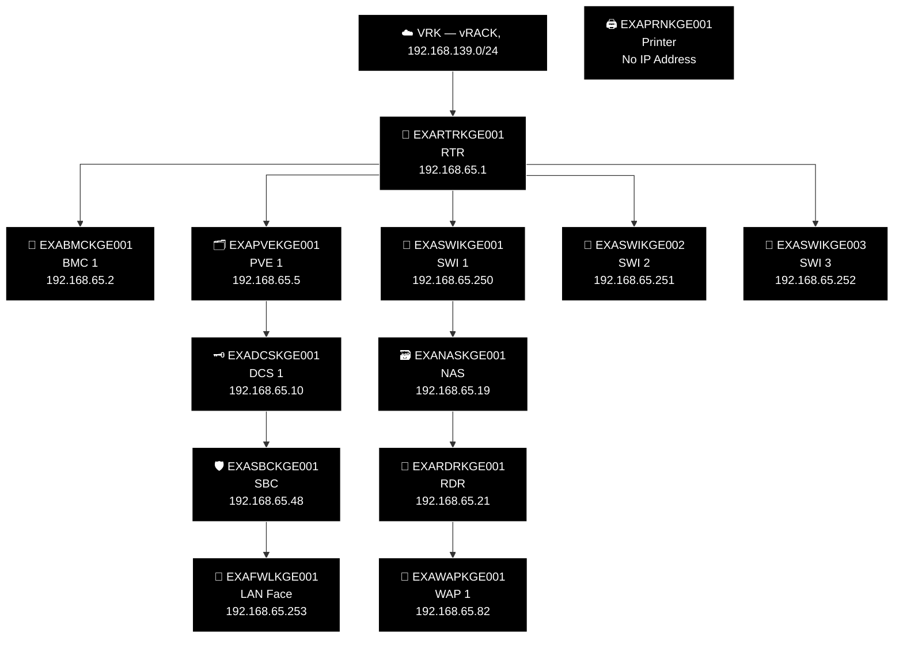

---

## FAX — Faxe 🥤

**LAN:** `192.168.246.0/24` · **Domain:** `example.net`  
**PVE nodes:** 1 · **VPN parent:** ODE  
**Entity:** Example Music (Danmark) ApS · **Landline:** +45 00 000 xxx · **Mobile:** +45 2x xxx xxx

### 🕰️ Old Network (legacy, hand restyled — prototype, not yet generated)

> **Corrected against Robert's real facts, 2026-07-31.** Standing corrections applied (no SBC;
> no `RRY`; no WireGuard on old infra). Bare metal, same as KGE — no ESX layer.
> `EXADCSFAX001` "was there but totally unused" — present, never adopted. WAPs (×2) confirmed
> real, moving over.

> 🚨 **Migration priority — Tier 3.** DC built, never used — no live users depending on it
> today. Still counts toward the estate-wide rollout: a new `EXADCSFAX001` build promoting and
> replicating against `EXADCSCLD001` (`ansible/playbooks/windows_dc/`).

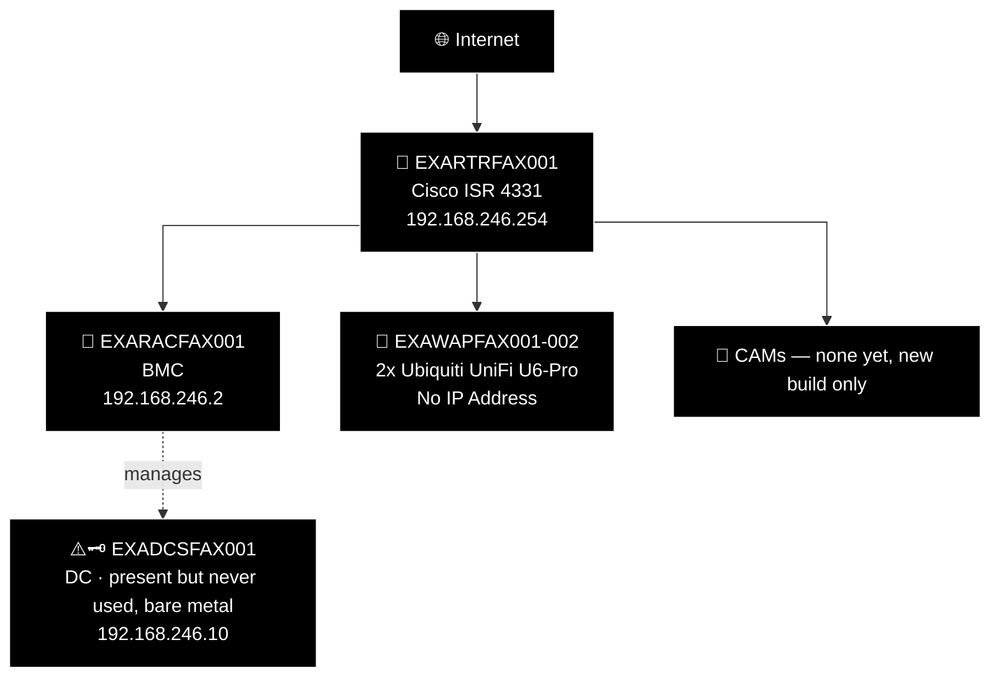

<details>
<summary>Original hand-maintained Old Network box (pre-restyle, kept for reference during prototype review)</summary>

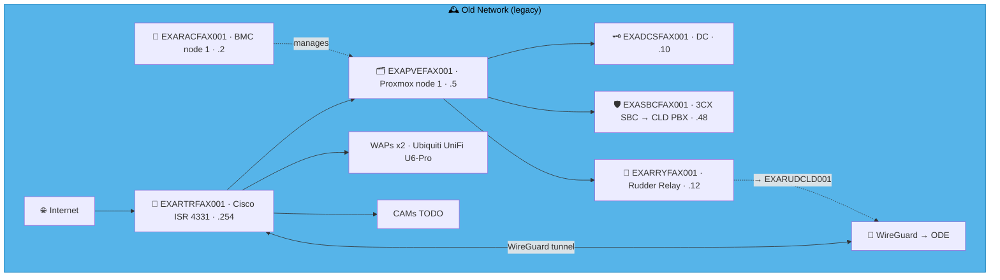

</details>

### 🗺️ Topology sketch (generated — see benarbejde/generate_network_diagrams.py)


---

## KOR — Korsør 🚂

**LAN:** `192.168.238.0/24` · **Domain:** `example.net`  
**PVE nodes:** 1 · **VPN parent:** ODE  
**Entity:** Example Music (Danmark) ApS · **Landline:** +45 00 000 xxx · **Mobile:** +45 2x xxx xxx

### 🕰️ Old Network (legacy, hand restyled — prototype, not yet generated)

> **Corrected against Robert's real facts, 2026-07-31.** Standing corrections applied (no SBC;
> no `RRY`; no WireGuard on old infra). Another HP ML310e/iLO pair — but bare metal, DC OS
> installed directly, no ESX layer (same shape as KGE/FAX). WAP confirmed real — physically
> there, never actually connected to anything, brought over regardless.

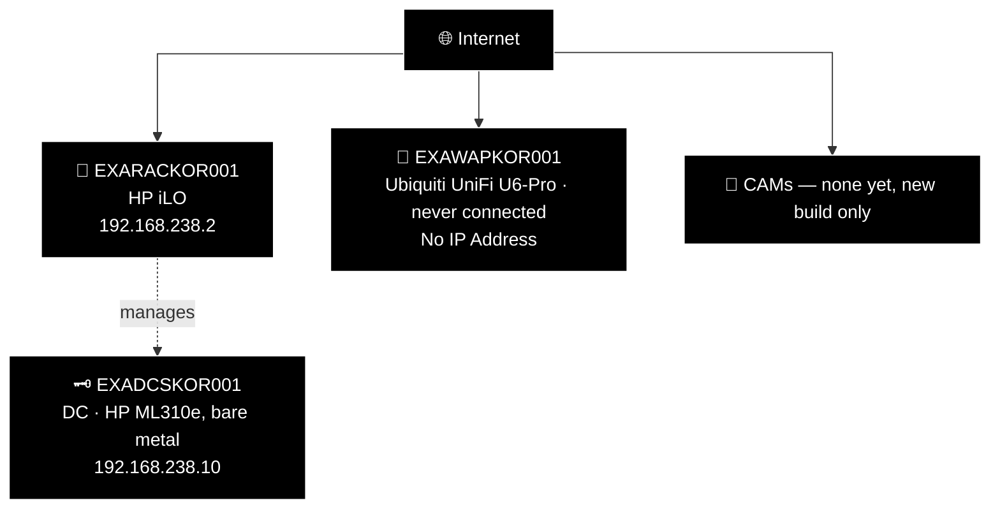

<details>
<summary>Original hand-maintained Old Network box (pre-restyle, kept for reference during prototype review)</summary>


</details>

### 🗺️ Topology sketch (generated — see benarbejde/generate_network_diagrams.py)


---

## AAR — Aarhus 🎓

**LAN:** `192.168.86.0/24` · **Domain:** `example.net`  
**PVE nodes:** 1 · **VPN parent:** ODE  
**Entity:** Example Music (Danmark) ApS · **Landline:** +45 00 000 xxx · **Mobile:** +45 2x xxx xxx

### 🕰️ Old Network (legacy, hand restyled — prototype, not yet generated)

> **Corrected against Robert's real facts, 2026-07-31.** Standing corrections applied (no SBC;
> no `RRY`; no WireGuard on old infra). Unused hardware — **presumed** the same HP ML310e/iLO
> pattern as every other bare-metal site so far, since it's been that combo every time; flag if
> AAR was actually different. `EXADCSAAR001` was installed on the bare metal, same as
> KOR/KGE/FAX/ABD — corrected after initially, wrongly, dropping the DC entirely. WAP confirmed
> never installed — "still in its box" — put to use only in the new build.

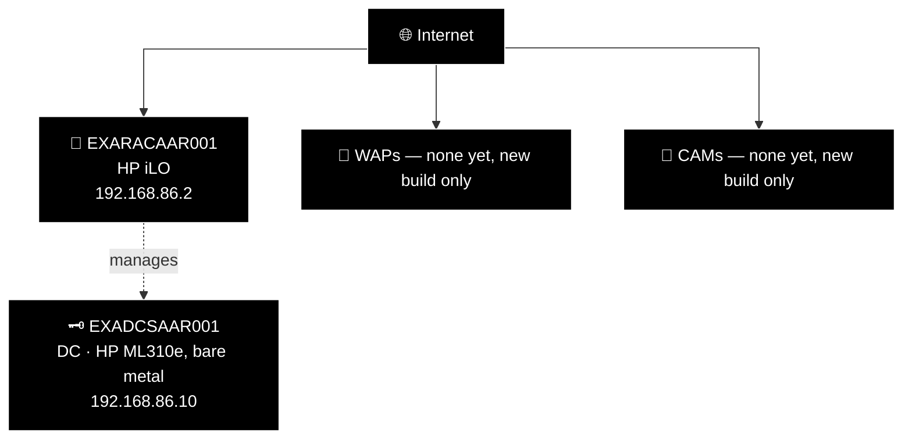

<details>
<summary>Original hand-maintained Old Network box (pre-restyle, kept for reference during prototype review)</summary>

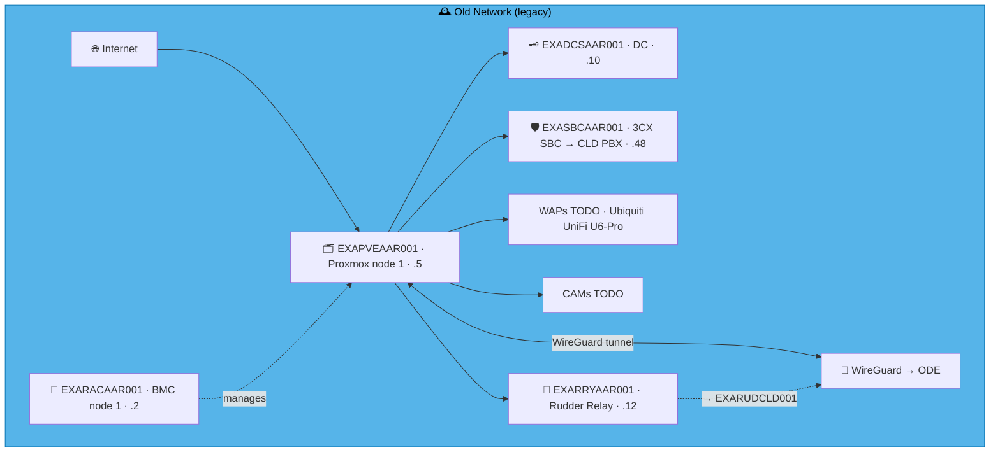

</details>

### 🗺️ Topology sketch (generated — see benarbejde/generate_network_diagrams.py)


---

## FRE — Fredericia 🏯

**LAN:** `192.168.75.0/24` · **Domain:** `example.net`  
**PVE nodes:** 1 (reserved — see notes below) · **VPN parent:** ODE  
**Entity:** Example Music (Danmark) ApS · **Landline:** +45 75 xx xx xx · **Mobile:** +45 2x xx xx xx

> **New-build site — corrected 2026-07-31.** The previous "Old Network" box here (RAC/PVE/DC/
> SBC/RRY/WAP/CAM) was entirely fabricated template content, not real history — zero real
> `devices.csv` rows exist for FRE, and Robert confirmed: "as far as I know FRE had nothing, it
> was a new expansion office." Converted to the same "New Build Location" placeholder pattern
> already used for FRD/NYB/SEA/SFO. Standard-slot addresses are allocated in
> `benarbejde/address_policy.csv`/`sites.csv` the same as any other site, but no `devices.csv`
> exception rows exist yet — nothing beyond the standard template has been confirmed built here.

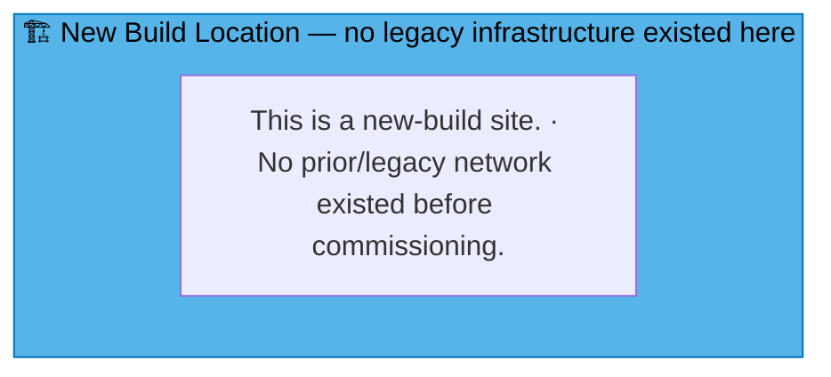

### 🗺️ Topology sketch (generated — see benarbejde/generate_network_diagrams.py)

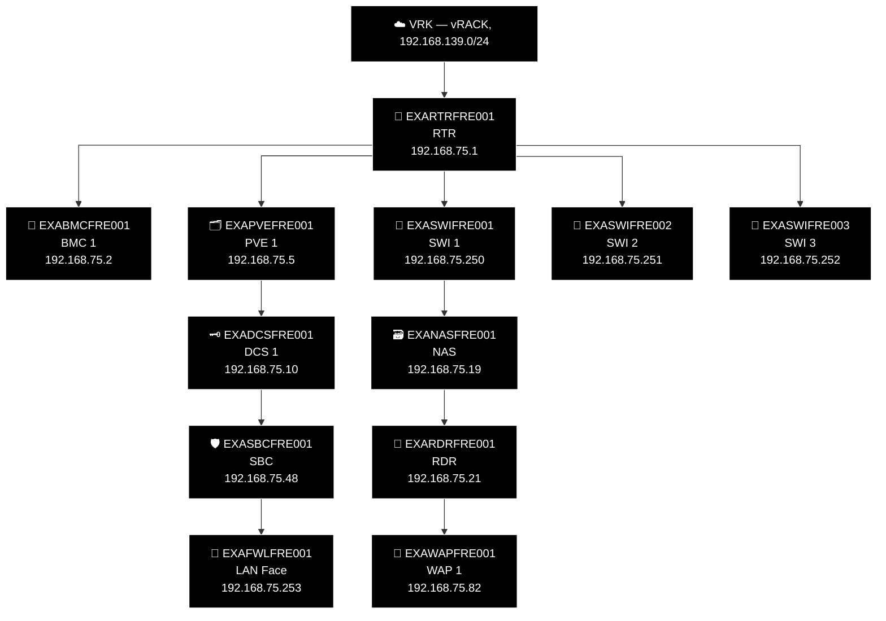

---

## FRD — Fredericia Havn *(New Build)* ⚓

**LAN:** `172.16.124.0/24` · **Domain:** `example.net`  
**PVE nodes:** 1 (`EXAPVEFRD001`, real hardware) · **VPN parent:** CLD (direct, non-standard networking)  
**Entity:** Example Music Limited · **Landline:** N/A · **Mobile:** N/A

> **New-build site.** No legacy infrastructure ever existed here — see the "New Build Location" box below in place of "Old Network." Fredericia Havn is a legal fiction run off a MacBook (`python3 -m http.server 8000` as a PXE mirror) — but it has a real "site kit" alongside that: a small Intel NUC running Proxmox VE (`EXAPVEFRD001`) and a 48-port switch (`EXASWIFRD001`), confirmed by Robert 2026-07-30. Also physically here, though hostnamed under CLD: a secondary 3CX PBX (`EXAPBXCLD002`) — see `benarbejde/generate_inventory.py`'s `NON_STANDARD_SITES`/`SubnetSite` handling.
>
> **Possible future addition:** a QNAP NAS may be added to the site kit, to support either Proxmox Backup Server or a VMware→Proxmox migration path (Robert, 2026-07-30). Proxmox VE already ships an official, built-in migration tool for this — the Import Wizard (since 8.2, connects directly to the ESXi API and imports a VM with on-the-fly disk conversion via Datacenter → Storage → Add → ESXi, then right-click → Import; see https://pve.proxmox.com/wiki/Migrate_to_Proxmox_VE). Nothing bespoke is needed here — not yet built, no timeline.

```mermaid
graph TD
    subgraph OLD_FRD ["🏗️ New Build Location — no legacy infrastructure existed here"]
      N_OLD_NOTE["This is a new-build site. · No prior/legacy network existed before commissioning."]
    end
    style OLD_FRD fill:#56B4E9,stroke:#0072B2,color:#000000
```

### 🗺️ Topology sketch (generated — see benarbejde/generate_network_diagrams.py)

> Robert, 2026-07-30: FRD is "literally just online, it's a legal function but we treat it like a
> fallback VRK site." `172.16.124.253` (`sites.csv`'s `FW` field) doesn't have a real device yet —
> unlike VRK's own `.254` (confirmed OVH's, not ours), this one is genuinely planned, mirroring
> VRK's own `EXAFWLVRK001`. `EXAPBXCLD002` is confirmed to belong here — hostnamed under CLD,
> physically at FRD. Robert's own words on the naming: "note the naming convention, this might
> cause some shenanigans, if it does you have my permission to call it `EXAPBXFRD001`" — not
> renamed here, no actual conflict has come up; this is standing permission for later, not
> something exercised pre-emptively.

```mermaid
%% GENERATED:TOPOLOGY:FRD:START
%%{init: {'flowchart': {'curve': 'stepAfter'}}}%%
graph TD
    T_FRD["☁️ FRD — Fredericia Havn network fabric, 172.16.124.0/24"]
    T_TMP["📦<br/>Provisioning Server (PXE, Port 8000)<br/>172.16.124.1"]
    T_PVE["🗂️ EXAPVEFRD001<br/>Small Intel NUC Running Proxmox VE<br/>172.16.124.5"]
    T_SWI["🔀 EXASWIFRD001<br/>48-port Switch<br/>172.16.124.250"]
    T_PBX["🔌 EXAPBXCLD002<br/>Secondary 3CX PBX (hostnamed Under CLD)<br/>172.16.124.48"]
    T_FWL["🧱 EXAFWLFRD001<br/>FWL 1<br/>172.16.124.253 — planned"]
    T_FRD --> T_TMP --> T_PVE --> T_SWI --> T_PBX --> T_FWL
    style T_FRD fill:#000000,stroke:#FFFFFF,color:#FFFFFF
    style T_TMP fill:#000000,stroke:#FFFFFF,color:#FFFFFF
    style T_PVE fill:#000000,stroke:#FFFFFF,color:#FFFFFF
    style T_SWI fill:#000000,stroke:#FFFFFF,color:#FFFFFF
    style T_PBX fill:#000000,stroke:#FFFFFF,color:#FFFFFF
    style T_FWL fill:#000000,stroke:#FFFFFF,color:#FFFFFF
%% GENERATED:TOPOLOGY:FRD:END
```

---

## NYB — Nyborg *(New Build)* 📜

**LAN:** `192.168.90.0/24` · **Domain:** `example.net`  
**PVE nodes:** 1 (reserved — see notes below) · **VPN parent:** ODE  
**Entity:** Example Music (Danmark) ApS · **Landline:** +45 80 400 0xxx · **Mobile:** +45 200 900 2xxx

> **New-build site.** No legacy infrastructure ever existed here — see the "New Build Location" box below in place of "Old Network." Standard-slot addresses are allocated in `benarbejde/address_policy.csv`/`sites.csv` the same as any other site (this is what makes the .ini/DNS generation already treat them as real, per the generated-file-freshness harness check) but no `devices.csv` exception rows exist yet — nothing beyond the standard template has been confirmed built on site.

```mermaid
graph TD
    subgraph OLD_NYB ["🏗️ New Build Location — no legacy infrastructure existed here"]
      N_OLD_NOTE["This is a new-build site. · No prior/legacy network existed before commissioning."]
    end
    style OLD_NYB fill:#56B4E9,stroke:#0072B2,color:#000000
```

### 🗺️ Topology sketch (generated — see benarbejde/generate_network_diagrams.py)

```mermaid
%% GENERATED:TOPOLOGY:NYB:START
%%{init: {'flowchart': {'curve': 'stepAfter'}}}%%
graph TD
    T_VRK["☁️ VRK — vRACK, 192.168.139.0/24"]
    T_RTR["📡 EXARTRNYB001<br/>RTR<br/>192.168.90.1"]
    T_VRK --> T_RTR
    T_BMC["🔧 EXABMCNYB001<br/>BMC 1<br/>192.168.90.2"]
    T_RTR --> T_BMC
    T_PVE["🗂️ EXAPVENYB001<br/>PVE 1<br/>192.168.90.5"]
    T_RTR --> T_PVE
    T_SWI["🔀 EXASWINYB001<br/>SWI 1<br/>192.168.90.250"]
    T_RTR --> T_SWI
    T_SWI2["🔀 EXASWINYB002<br/>SWI 2<br/>192.168.90.251"]
    T_RTR --> T_SWI2
    T_SWI3["🔀 EXASWINYB003<br/>SWI 3<br/>192.168.90.252"]
    T_RTR --> T_SWI3
    T_NAS["🗃️ EXANASNYB001<br/>NAS<br/>192.168.90.19"]
    T_RDR["🔐 EXARDRNYB001<br/>RDR<br/>192.168.90.21"]
    T_WAP["📶 EXAWAPNYB001<br/>WAP 1<br/>192.168.90.82"]
    T_SWI --> T_NAS --> T_RDR --> T_WAP
    T_DCS["🗝️ EXADCSNYB001<br/>DCS 1<br/>192.168.90.10"]
    T_SBC["🛡️ EXASBCNYB001<br/>SBC<br/>192.168.90.48"]
    T_FWL["🧱 EXAFWLNYB001<br/>LAN Face<br/>192.168.90.253"]
    T_PVE --> T_DCS --> T_SBC --> T_FWL
    style T_VRK fill:#000000,stroke:#FFFFFF,color:#FFFFFF
    style T_RTR fill:#000000,stroke:#FFFFFF,color:#FFFFFF
    style T_BMC fill:#000000,stroke:#FFFFFF,color:#FFFFFF
    style T_PVE fill:#000000,stroke:#FFFFFF,color:#FFFFFF
    style T_SWI fill:#000000,stroke:#FFFFFF,color:#FFFFFF
    style T_SWI2 fill:#000000,stroke:#FFFFFF,color:#FFFFFF
    style T_SWI3 fill:#000000,stroke:#FFFFFF,color:#FFFFFF
    style T_NAS fill:#000000,stroke:#FFFFFF,color:#FFFFFF
    style T_RDR fill:#000000,stroke:#FFFFFF,color:#FFFFFF
    style T_WAP fill:#000000,stroke:#FFFFFF,color:#FFFFFF
    style T_DCS fill:#000000,stroke:#FFFFFF,color:#FFFFFF
    style T_SBC fill:#000000,stroke:#FFFFFF,color:#FFFFFF
    style T_FWL fill:#000000,stroke:#FFFFFF,color:#FFFFFF
%% GENERATED:TOPOLOGY:NYB:END
```
