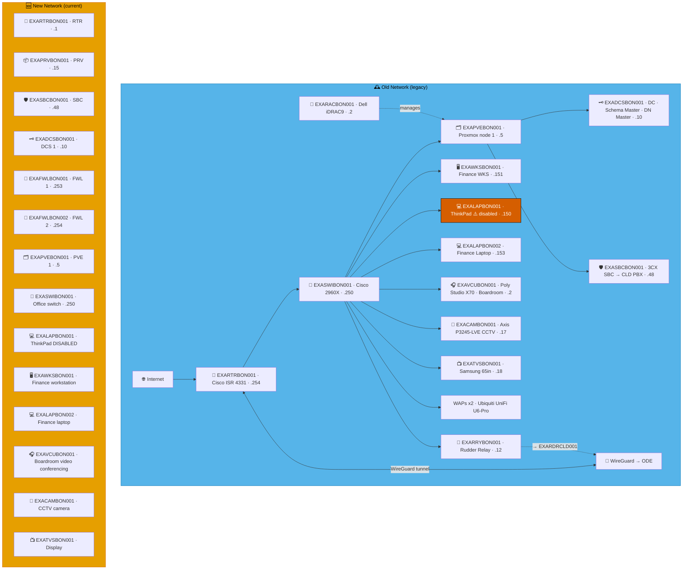
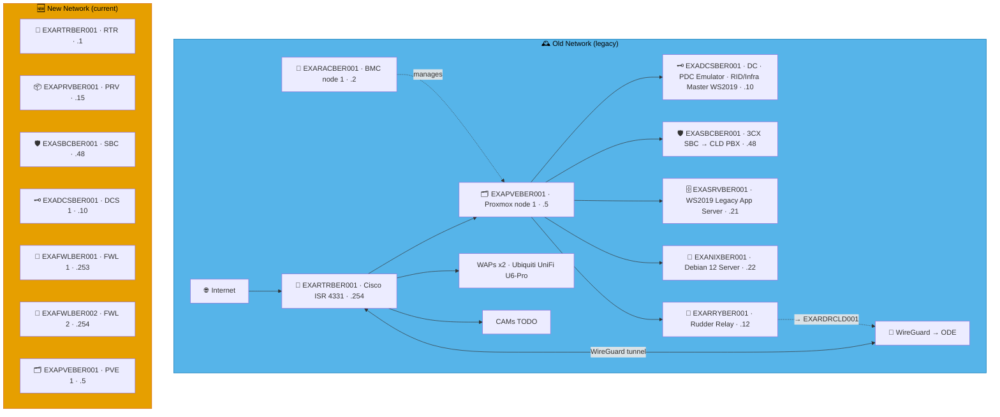
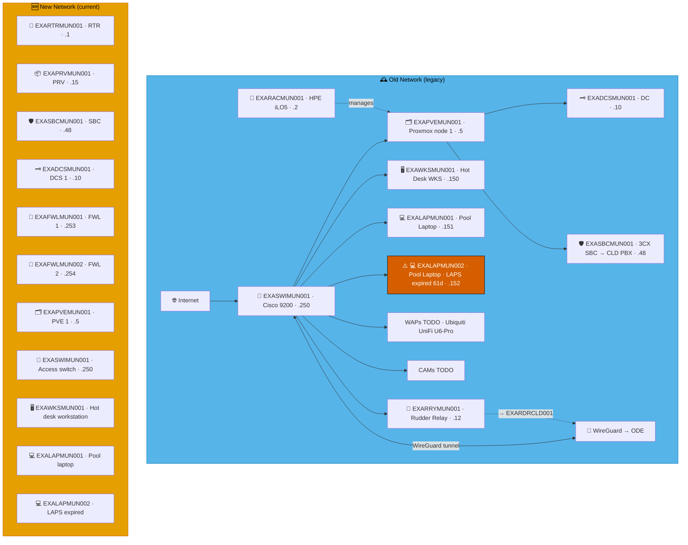
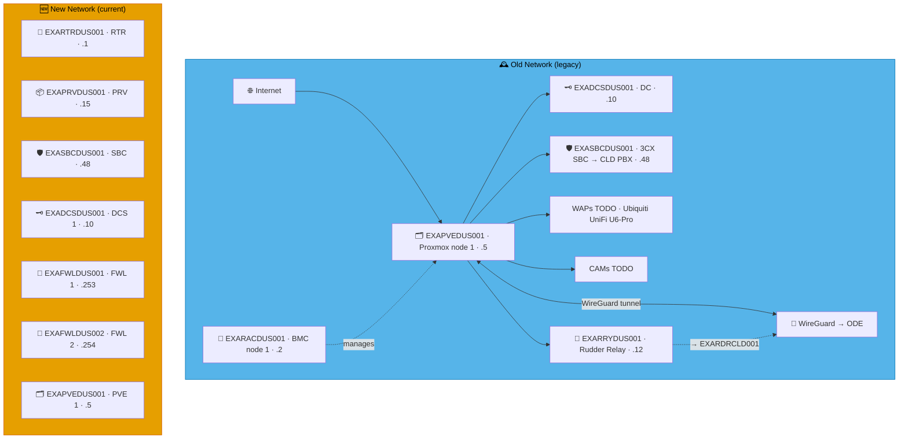

# Example Music Limited — Deutschland Network Diagrams

> **Classification:** Internal — Infrastructure
> **Part of:** [`../network-diagram.md`](../network-diagram.md) — see there for the Visual
> Standard (shape/colour/emoji convention), the full emoji legend, and links to every other
> region.

---

## BON — Bonn

**LAN:** `192.168.228.0/24` · **Domain:** `example.net`  
**PVE nodes:** 1 · **VPN parent:** ODE  
**Note:** Hosts Schema Master + Domain Naming Master  
**Entity:** Example Music (Deutschland) GmbH · **Landline:** +49 228 555 xxx · **Mobile:** +49 211 xxx xxxx

---

## BER — West Berlin

**LAN:** `192.168.113.0/24` · **Domain:** `example.net`  
**PVE nodes:** 1 · **VPN parent:** ODE  
**Entity:** Example Music (Deutschland) GmbH · **Landline:** +49 311 555 xxx · **Mobile:** +49 211 xxx xxxx

---

## MUN — Munich

**LAN:** `192.168.189.0/24` · **Domain:** `example.net`  
**PVE nodes:** 1 · **VPN parent:** ODE  
**Entity:** Example Music (Deutschland) GmbH · **Landline:** +49 893 555 33xx · **Mobile:** +49 893 555 99xx

---

## DRS — Dresden

**LAN:** `192.168.153.0/24` · **Domain:** `example.net`  
**PVE nodes:** 1 · **VPN parent:** ODE  
**Entity:** Example Music (Deutschland) GmbH · **Landline:** +49 351 555 xxx · **Mobile:** +49 172 xxx xxxx

---

## DUS — Düsseldorf

**LAN:** `192.168.211.0/24` · **Domain:** `example.net`  
**PVE nodes:** 1 · **VPN parent:** ODE  
**Entity:** Example Music (Deutschland) GmbH · **Landline:** +49 211 555 xxx · **Mobile:** +49 172 xxx xxxx

