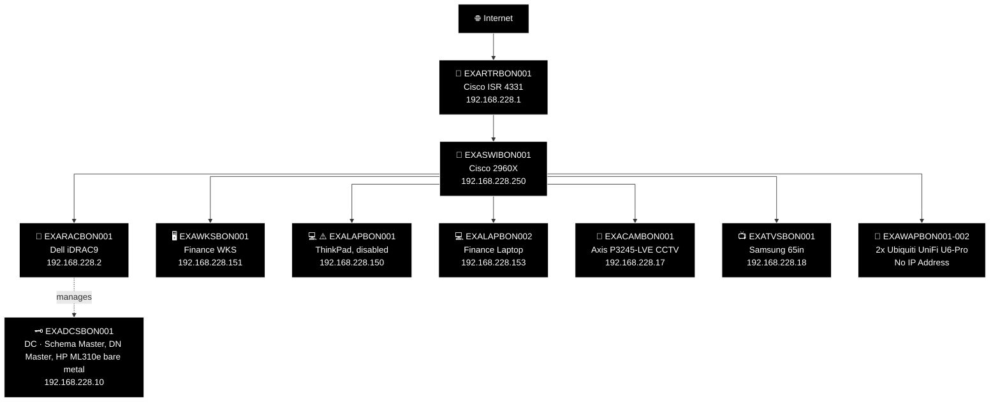
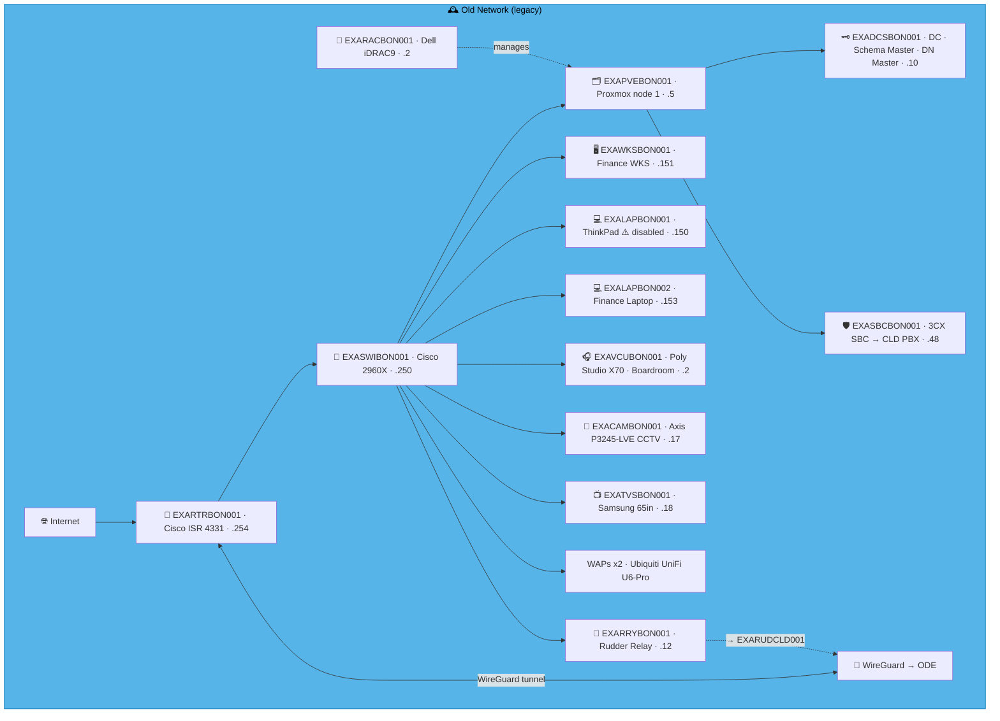
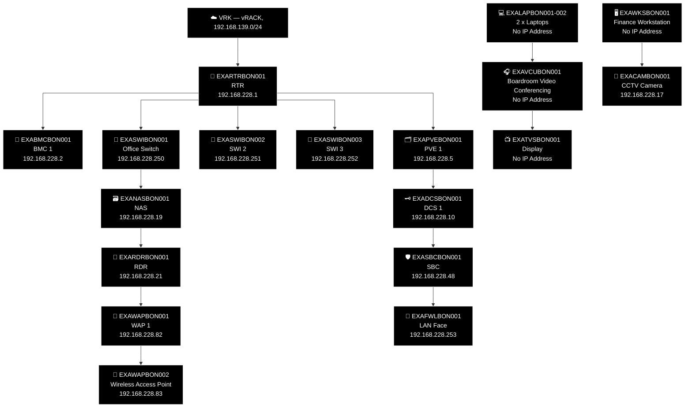
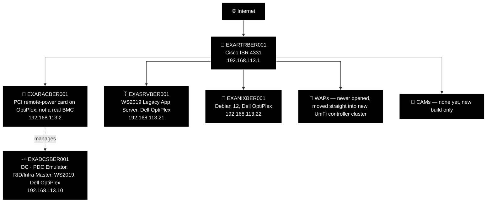
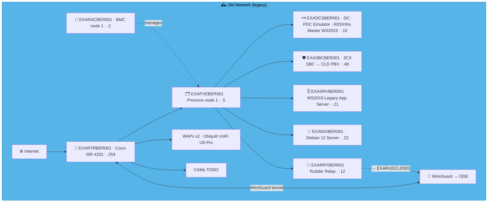
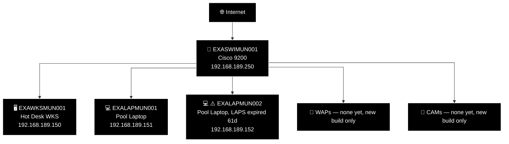
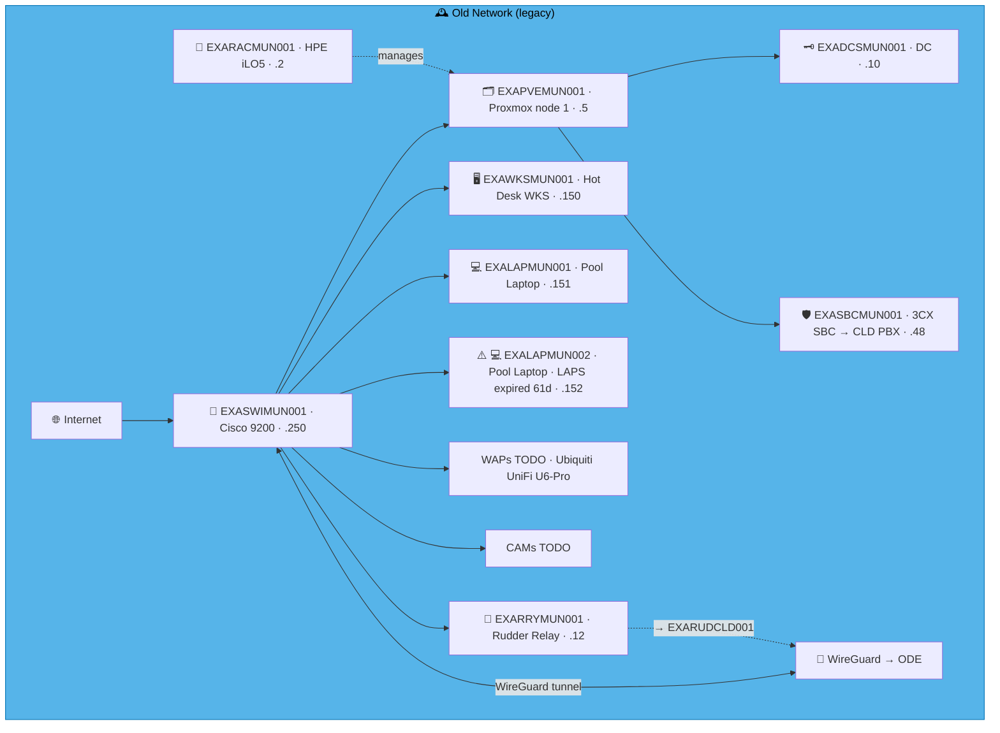
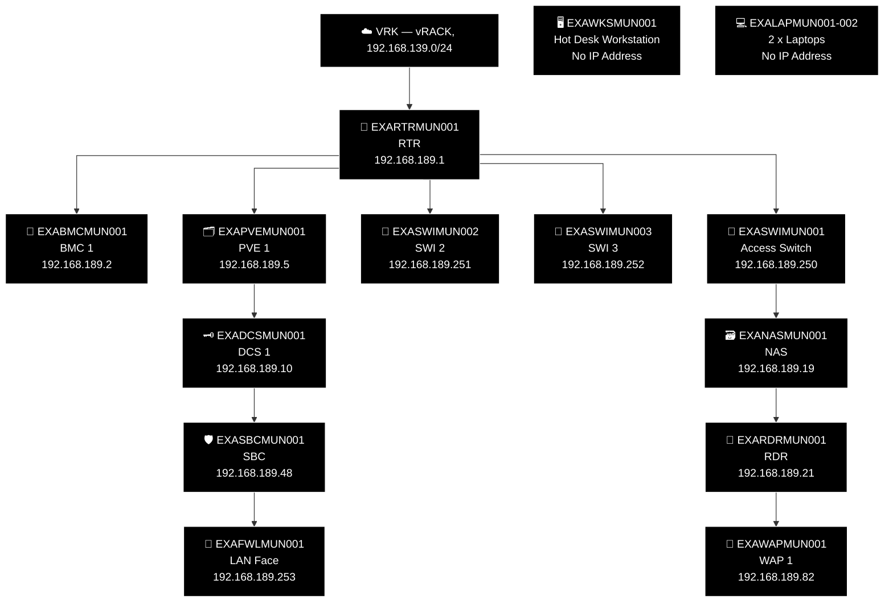
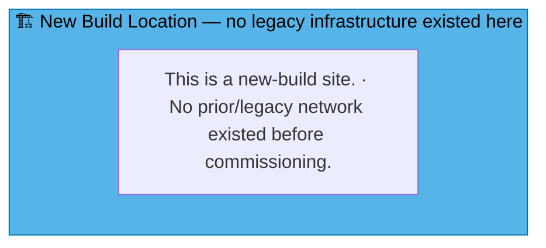
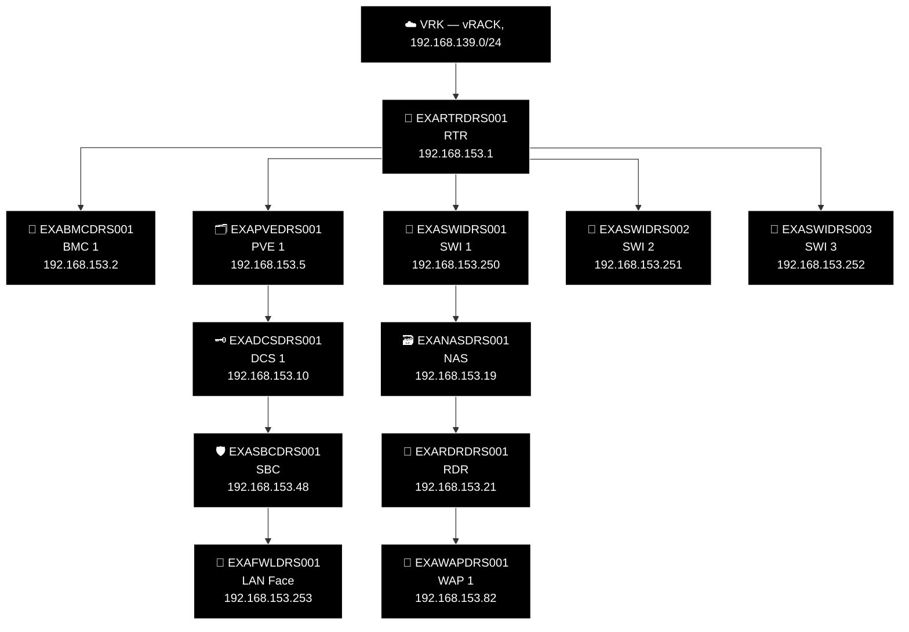

# Example Music Limited — Deutschland Network Diagrams

> **Classification:** Internal — Infrastructure
> **Part of:** [`../network-diagram.md`](../network-diagram.md) — see there for the Visual
> Standard (shape/colour/emoji convention), the full emoji legend, and links to every other
> region.

---

## BON — Bonn 🎼

**LAN:** `192.168.228.0/24` · **Domain:** `example.net`  
**PVE nodes:** 1 · **VPN parent:** ODE  
**Note:** Hosts Schema Master + Domain Naming Master  
**Entity:** Example Music (Deutschland) GmbH · **Landline:** +49 228 555 xxx · **Mobile:** +49 211 xxx xxxx

### 🕰️ Old Network (legacy, hand restyled — prototype, not yet generated)

> **Corrected against Robert's real facts, 2026-07-31.** Standing corrections applied (no SBC;
> no `RRY`; no WireGuard on old infra). Octet collision resolved — `.2` belongs to `EXARACBON001`
> (real), not `EXAVCUBON001`; the VCU turned out to be new-build-supplied kit with "no business
> being in the old network" at all — removed entirely (it uses DHCP in the new build, explaining
> the stray octet clash). `EXADCSBON001` (Schema Master, Domain Naming Master) confirmed real,
> bare metal on the HP ML310e attached to the Dell iDRAC9. Workstation, both laptops (including
> the ⚠️ disabled ThinkPad), CCTV camera, display, and WAPs all confirmed real and kept.

Original hand-maintained Old Network box (pre-restyle, kept for reference during prototype review)

### 🗺️ Topology sketch (generated — see benarbejde/generate_network_diagrams.py)

---

## BER — West Berlin 🐻

**LAN:** `192.168.113.0/24` · **Domain:** `example.net`  
**PVE nodes:** 1 · **VPN parent:** ODE  
**Entity:** Example Music (Deutschland) GmbH · **Landline:** +49 311 555 xxx · **Mobile:** +49 211 xxx xxxx

### 🕰️ Old Network (legacy, hand restyled — prototype, not yet generated)

> **Corrected against Robert's real facts, 2026-07-31.** Standing corrections applied (no SBC;
> no `RRY`; no WireGuard on old infra). All three "servers" were Dell OptiPlex consumer PCs —
> `EXADCSBER001` (PDC Emulator/RID-Infra Master), `EXASRVBER001` (WS2019 Legacy App Server), and
> `EXANIXBER001` (Debian 12), all confirmed separate real devices. `EXARACBER001` "was called RAC
> but wasn't a real RAC" — a basic PCI remote-power-on add-in card, not a genuine enterprise
> BMC/iLO/iDRAC; kept as `RAC` type (role_codes.csv's own definition already covers "RAC
> emulator") with that nuance stated plainly. Replaced by a proper PVE-hosted hypervisor in the
> new build. WAPs (×2) confirmed never opened — still shrink-wrapped — moved straight into the
> new UniFi controller cluster rather than ever deployed on old infra.

Original hand-maintained Old Network box (pre-restyle, kept for reference during prototype review)

### 🗺️ Topology sketch (generated — see benarbejde/generate_network_diagrams.py)

---

## MUN — Munich 🍺

**LAN:** `192.168.189.0/24` · **Domain:** `example.net`  
**PVE nodes:** 1 · **VPN parent:** ODE  
**Entity:** Example Music (Deutschland) GmbH · **Landline:** +49 893 555 33xx · **Mobile:** +49 893 555 99xx

### 🕰️ Old Network (legacy, hand restyled — prototype, not yet generated)

> **Corrected against Robert's real facts, 2026-07-31.** Standing corrections applied (no SBC;
> no `RRY`; no WireGuard on old infra). No DC, no hypervisor, no BMC ever existed here — Robert:
> "if you didn't find them then no, they are not there" (confirmed against `devices.csv`, which
> only has the switch and endpoints, nothing BMC/DC-shaped). `EXARACMUN001`/`EXADCSMUN001`
> removed entirely. WAP confirmed never deployed. Switch, hot-desk WKS, and both pool laptops
> (including `⚠️ LAPS expired 61d`, kept per the standing rule) all confirmed real.

Original hand-maintained Old Network box (pre-restyle, kept for reference during prototype review)

### 🗺️ Topology sketch (generated — see benarbejde/generate_network_diagrams.py)

---

## DRS — Dresden 🕺

**LAN:** `192.168.153.0/24` · **Domain:** `example.net`  
**PVE nodes:** 1 (reserved — see notes below) · **VPN parent:** ODE  
**Entity:** Example Music (Deutschland) GmbH · **Landline:** +49 351 555 xxx · **Mobile:** +49 172 xxx xxxx

> **New-build site — corrected 2026-07-31.** The previous "Old Network" box here was entirely
> fabricated template content, not real history — zero real `devices.csv` rows exist for DRS,
> and Robert confirmed: "it's an expansion office." Converted to the same "New Build Location"
> placeholder pattern used for FRD/NYB/SEA/SFO/FRE. Standard-slot addresses are allocated the
> same as any other site, but no `devices.csv` exception rows exist yet — nothing beyond the
> standard template has been confirmed built here.

### 🗺️ Topology sketch (generated — see benarbejde/generate_network_diagrams.py)

---

## DUS — Düsseldorf 👗

**LAN:** `192.168.211.0/24` · **Domain:** `example.net`  
**PVE nodes:** 1 (reserved — see notes below) · **VPN parent:** ODE  
**Entity:** Example Music (Deutschland) GmbH · **Landline:** +49 211 555 xxx · **Mobile:** +49 172 xxx xxxx

> **New-build site — corrected 2026-07-31.** The previous "Old Network" box here was entirely
> fabricated template content — zero real `devices.csv` rows exist for DUS, and Robert confirmed
> it's an expansion office. Converted to the same "New Build Location" placeholder pattern used
> for FRD/NYB/SEA/SFO/FRE/DRS. Standard-slot addresses are allocated the same as any other site,
> but no `devices.csv` exception rows exist yet.

### 🗺️ Topology sketch (generated — see benarbejde/generate_network_diagrams.py)

