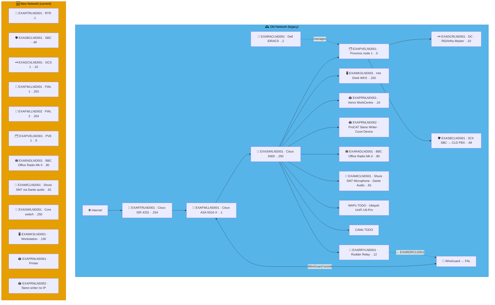
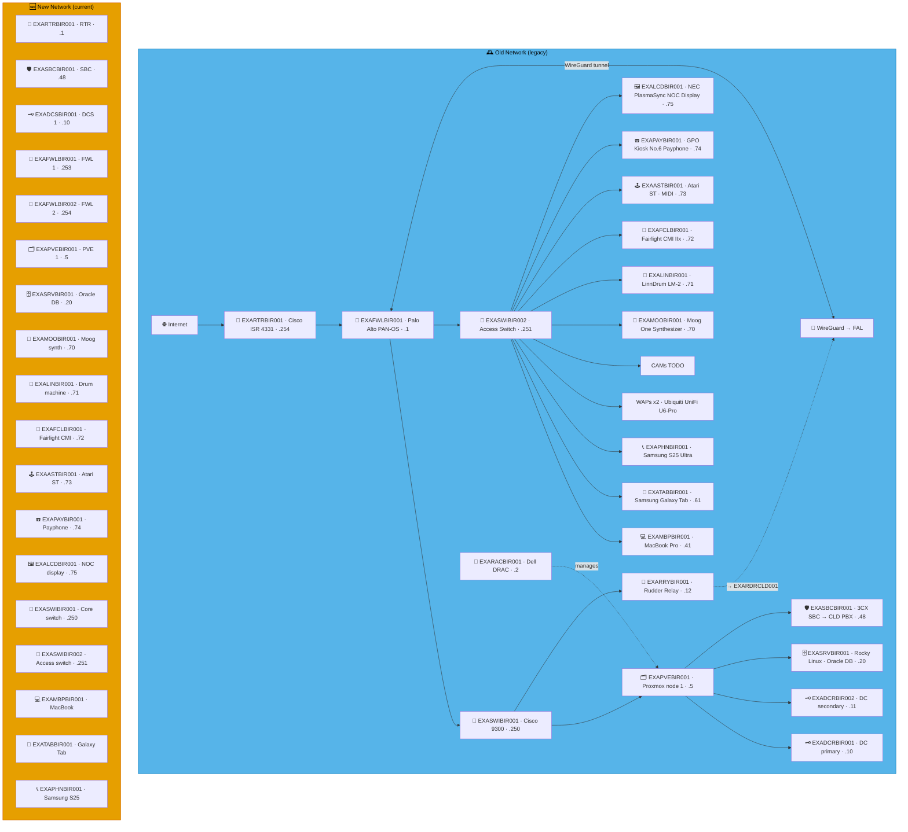
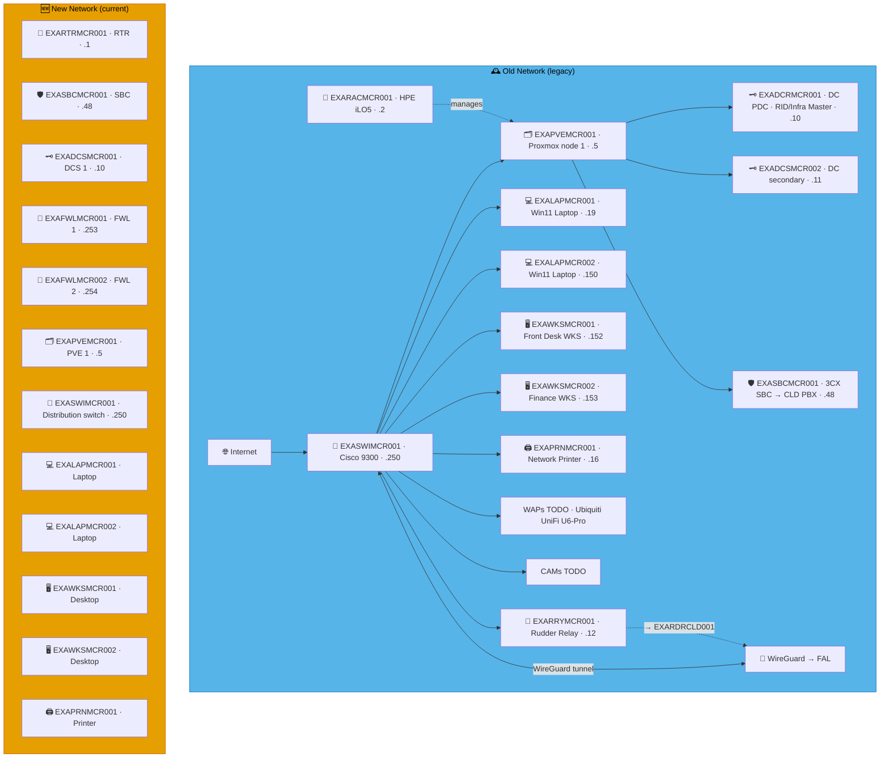
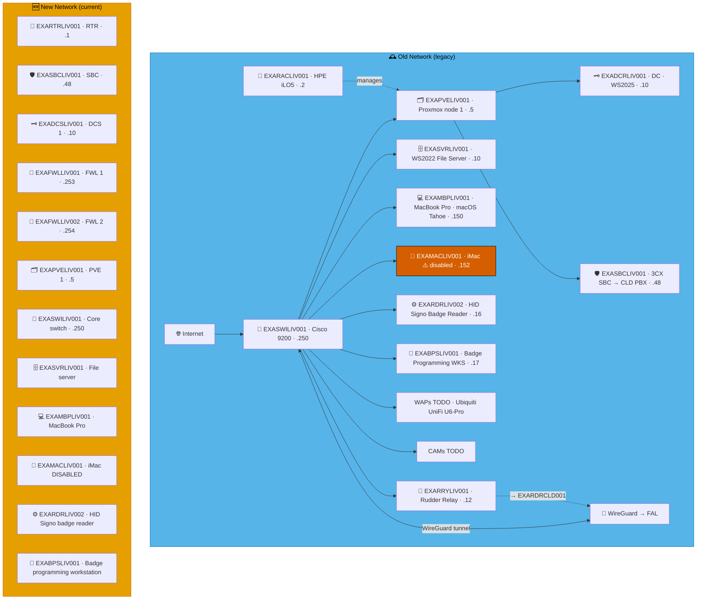
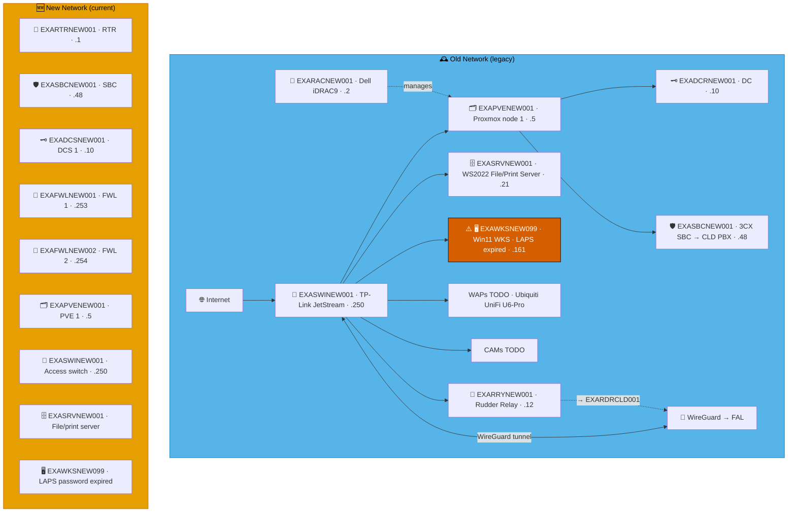
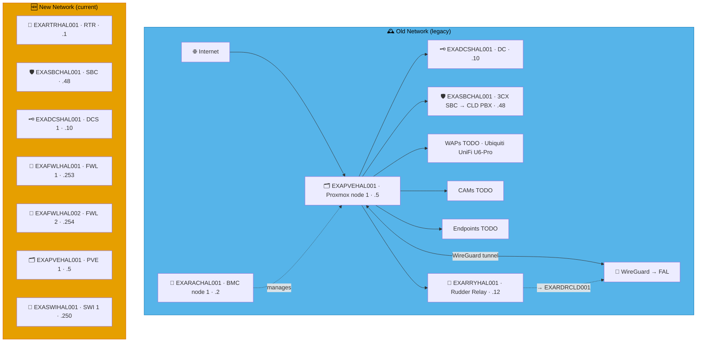
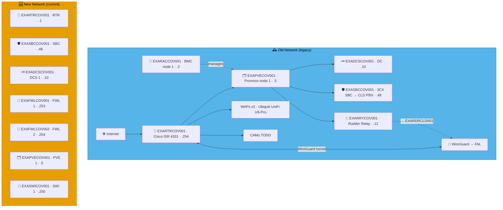

# Example Music Limited — England Network Diagrams

> **Classification:** Internal — Infrastructure
> **Part of:** [`../network-diagram.md`](../network-diagram.md) — see there for the Visual
> Standard (shape/colour/emoji convention), the full emoji legend, and links to every other
> region.

---

## LND — London 🥑

**LAN:** `192.168.20.0/24` · **Domain:** `example.net`  
**PVE nodes:** 1 · **VPN parent:** FAL  
**Entity:** Example Music (England) Ltd · **Landline:** +44 207 496 0xxx · **Mobile:** +44 770 090 0xxx

---

## BIR — Birmingham 🪠

**LAN:** `192.168.121.0/24` · **Domain:** `example.net`  
**PVE nodes:** 1 · **VPN parent:** FAL  
**Entity:** Example Music (England) Ltd · **Landline:** +44 121 496 0xxx · **Mobile:** +44 7700 900 2xxx

---

## MCR — Manchester 🐝

**LAN:** `192.168.161.0/24` · **Domain:** `example.org`  
**PVE nodes:** 1 · **VPN parent:** FAL  
**Entity:** Example Music (England) Ltd · **Landline:** +44 161 715 xxxx · **Mobile:** +44 770 090 6xxx

---

## LIV — Liverpool 🎸

**LAN:** `192.168.151.0/24` · **Domain:** `example.org`  
**PVE nodes:** 1 · **VPN parent:** FAL  
**Entity:** Example Music (England) Ltd · **Landline:** +44 151 496 0xxx · **Mobile:** +44 770 090 5xxx

---

## NEW — Newcastle 🌉

**LAN:** `192.168.191.0/24` · **Domain:** `example.org`  
**PVE nodes:** 1 · **VPN parent:** FAL  
**Entity:** Example Music (England) Ltd · **Landline:** +44 191 496 0xxx · **Mobile:** +44 770 090 9xxx

---

## SHE — Sheffield 🥄

**LAN:** `192.168.114.0/24` · **Domain:** `example.net`  
**PVE nodes:** 1 · **VPN parent:** FAL  
**Entity:** Example Music (England) Ltd · **Landline:** +44 114 250 0xxx · **Mobile:** +44 7700 905 2xxx

---

## HAL — Halifax 🏦

**LAN:** `192.168.142.0/24` · **Domain:** `example.net`  
**PVE nodes:** 1 · **VPN parent:** FAL  
**Entity:** Example Music (England) Ltd · **Landline:** +44 1422 200 0xxx · **Mobile:** +44 7700 904 2xxx

---

## HUL — Hull 🎣

**LAN:** `192.168.148.0/24` · **Domain:** `example.net`  
**PVE nodes:** 1 · **VPN parent:** FAL  
**Entity:** Example Music (England) Ltd · **Landline:** +44 1482 300 0xxx · **Mobile:** +44 7700 902 2xxx

---

## COV — Coventry 🐎

**LAN:** `192.168.247.0/24` · **Domain:** `example.net`  
**PVE nodes:** 1 · **VPN parent:** FAL  
*Note: WAP/RTR-only site — minimal infrastructure.*  
**Entity:** Example Music (England) Ltd · **Landline:** +44 247 765 0xxx · **Mobile:** +44 7700 901 2xxx

