# Example Music Limited — England Network Diagrams

> **Classification:** Internal — Infrastructure
> **Part of:** [`../network-diagram.md`](../network-diagram.md) — see there for the Visual
> Standard (shape/colour/emoji convention), the full emoji legend, and links to every other
> region.

---

## LND — London 🥑

**LAN:** `192.168.20.0/24` · **Domain:** `example.net`  
**PVE nodes:** 1 · **VPN parent:** FAL  
**Entity:** Example Music (England) Ltd · **Landline:** +44 207 496 0xxx · **Mobile:** +44 770 090 0xxx

### 🕰️ Old Network (legacy, machine-generated from devices.csv/legacy-devices.csv)

> **Corrected against Robert's real facts, 2026-07-31.** Standing corrections applied (ESX not
> PVE; no SBC; no `RRY`; no WireGuard on old infra). More unused hardware — the Dell iDRAC9
> (`EXARACLND001`) never had a hypervisor built on it (kept as `RAC`, not `ILO` — unlike FAL, the
> vendor here was never disputed, so no swap). `EXADCRLND001` confirmed real legacy-naming DC,
> RID/Infra Master, migrating to `EXADCSLND001`. Hot-desk WKS, both printers (including the
> "ProCAT Steno Writer" court device), the BBC office radio, and the Shure SM7/Dante mic all
> confirmed real and moving over. WAP corrected to "none yet" — unlike CLY/DUN/PER/ABD, London's
> WAPs genuinely never existed on old infra, arriving fresh with the new build.

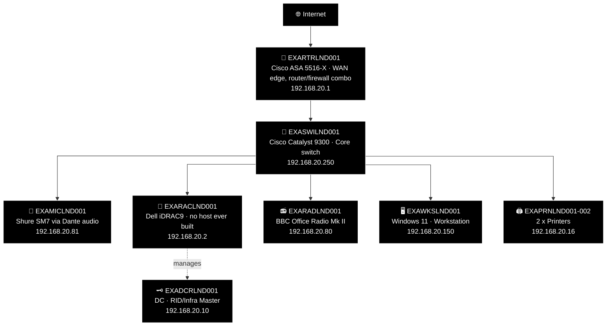
```mermaid
%% GENERATED:OLDNETWORK:LND:START
%%{init: {'flowchart': {'curve': 'stepAfter'}}}%%
graph TD
    O_INET["🌐 Internet"]
    O_RTR["📡 EXARTRLND001<br/>Cisco ASA 5516-X · WAN edge, router/firewall combo<br/>192.168.20.1"]
    O_SWI["🔀 EXASWILND001<br/>Cisco Catalyst 9300 · Core switch<br/>192.168.20.250"]
    O_DCR["🗝️ EXADCRLND001<br/>DC · RID/Infra Master<br/>192.168.20.10"]
    O_MIC["🎤 EXAMICLND001<br/>Shure SM7 via Dante audio<br/>192.168.20.81"]
    O_RAC["🔧 EXARACLND001<br/>Dell iDRAC9 · no host ever built<br/>192.168.20.2"]
    O_RAD["📻 EXARADLND001<br/>BBC Office Radio Mk II<br/>192.168.20.80"]
    O_WKS["🖥️ EXAWKSLND001<br/>Windows 11 · Workstation<br/>192.168.20.150"]
    O_PRN["🖨️ EXAPRNLND001-002<br/>2 x Printers<br/>192.168.20.16"]
    O_INET --> O_RTR
    O_RTR --> O_SWI
    O_SWI --> O_MIC
    O_SWI --> O_RAC
    O_RAC -.->|"manages"| O_DCR
    O_SWI --> O_RAD
    O_SWI --> O_WKS
    O_SWI --> O_PRN

    style O_INET fill:#000000,stroke:#FFFFFF,color:#FFFFFF
    style O_RTR fill:#000000,stroke:#FFFFFF,color:#FFFFFF
    style O_SWI fill:#000000,stroke:#FFFFFF,color:#FFFFFF
    style O_DCR fill:#000000,stroke:#FFFFFF,color:#FFFFFF
    style O_MIC fill:#000000,stroke:#FFFFFF,color:#FFFFFF
    style O_RAC fill:#000000,stroke:#FFFFFF,color:#FFFFFF
    style O_RAD fill:#000000,stroke:#FFFFFF,color:#FFFFFF
    style O_WKS fill:#000000,stroke:#FFFFFF,color:#FFFFFF
    style O_PRN fill:#000000,stroke:#FFFFFF,color:#FFFFFF
%% GENERATED:OLDNETWORK:LND:END
```

Original hand-maintained Old Network box (pre-restyle, kept for reference during prototype review)

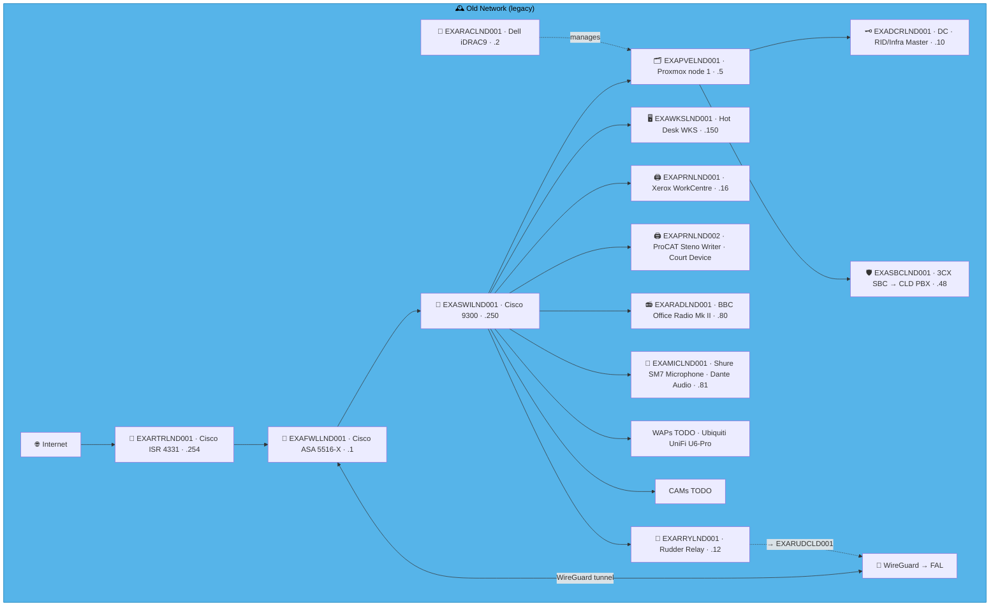
```mermaid
graph TD
    subgraph OLD_LND ["🕰️ Old Network (legacy)"]
      INET["🌐 Internet"]
      FWL["🧱 EXAFWLLND001 · Cisco ASA 5516-X · .1"]
      SW["🔀 EXASWILND001 · Cisco 9300 · .250"]
      RTR["📡 EXARTRLND001 · Cisco ISR 4331 · .254"]
      RAC["🔧 EXARACLND001 · Dell iDRAC9 · .2"]
      PVE["🗂️ EXAPVELND001 · Proxmox node 1 · .5"]
      DC["🗝️ EXADCRLND001 · DC · RID/Infra Master · .10"]
      SBC["🛡️ EXASBCLND001 · 3CX SBC → CLD PBX · .48"]
      RRY["🔁 EXARRYLND001 · Rudder Relay · .12"]
      WKS["🖥️ EXAWKSLND001 · Hot Desk WKS · .150"]
      PRN1["🖨️ EXAPRNLND001 · Xerox WorkCentre · .16"]
      PRN2["🖨️ EXAPRNLND002 · ProCAT Steno Writer · Court Device"]
      RAD["📻 EXARADLND001 · BBC Office Radio Mk II · .80"]
      MIC["🎤 EXAMICLND001 · Shure SM7 Microphone · Dante Audio · .81"]
      WAP["WAPs TODO · Ubiquiti UniFi U6-Pro"]
      CAM["CAMs TODO"]
      VPN["🔗 WireGuard → FAL"]

      INET --> RTR --> FWL --> SW
      SW --> PVE --> DC & SBC
      RAC -.->|"manages"| PVE
      SW --> WKS & PRN1 & PRN2 & RAD & MIC & WAP & CAM
      FWL <-->|"WireGuard tunnel"| VPN

      SW --> RRY
      RRY -. "→ EXARUDCLD001" .-> VPN
    end
    style OLD_LND fill:#56B4E9,stroke:#0072B2,color:#000000
```

### 🗺️ Topology sketch (generated — see benarbejde/generate_network_diagrams.py)

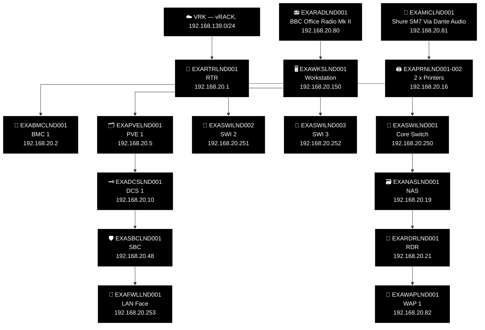
```mermaid
%% GENERATED:TOPOLOGY:LND:START
%%{init: {'flowchart': {'curve': 'stepAfter'}}}%%
graph TD
    T_VRK["☁️ VRK — vRACK, 192.168.139.0/24"]
    T_RTR["📡 EXARTRLND001<br/>RTR<br/>192.168.20.1"]
    T_VRK --> T_RTR
    T_BMC["🔧 EXABMCLND001<br/>BMC 1<br/>192.168.20.2"]
    T_RTR --> T_BMC
    T_PVE["🗂️ EXAPVELND001<br/>PVE 1<br/>192.168.20.5"]
    T_RTR --> T_PVE
    T_SWI["🔀 EXASWILND002<br/>SWI 2<br/>192.168.20.251"]
    T_RTR --> T_SWI
    T_SWI2["🔀 EXASWILND003<br/>SWI 3<br/>192.168.20.252"]
    T_RTR --> T_SWI2
    T_SWI3["🔀 EXASWILND001<br/>Core Switch<br/>192.168.20.250"]
    T_RTR --> T_SWI3
    T_NAS["🗃️ EXANASLND001<br/>NAS<br/>192.168.20.19"]
    T_RDR["🔐 EXARDRLND001<br/>RDR<br/>192.168.20.21"]
    T_WAP["📶 EXAWAPLND001<br/>WAP 1<br/>192.168.20.82"]
    T_SWI3 --> T_NAS --> T_RDR --> T_WAP
    T_DCS["🗝️ EXADCSLND001<br/>DCS 1<br/>192.168.20.10"]
    T_SBC["🛡️ EXASBCLND001<br/>SBC<br/>192.168.20.48"]
    T_FWL["🧱 EXAFWLLND001<br/>LAN Face<br/>192.168.20.253"]
    T_PVE --> T_DCS --> T_SBC --> T_FWL
    T_RAD["📻 EXARADLND001<br/>BBC Office Radio Mk II<br/>192.168.20.80"]
    T_MIC["🎤 EXAMICLND001<br/>Shure SM7 Via Dante Audio<br/>192.168.20.81"]
    T_WKS["🖥️ EXAWKSLND001<br/>Workstation<br/>192.168.20.150"]
    T_OTH_PRN["🖨️ EXAPRNLND001-002<br/>2 x Printers<br/>192.168.20.16"]
    T_RAD --> T_WKS
    T_MIC --> T_OTH_PRN
    style T_VRK fill:#000000,stroke:#FFFFFF,color:#FFFFFF
    style T_RTR fill:#000000,stroke:#FFFFFF,color:#FFFFFF
    style T_BMC fill:#000000,stroke:#FFFFFF,color:#FFFFFF
    style T_PVE fill:#000000,stroke:#FFFFFF,color:#FFFFFF
    style T_SWI fill:#000000,stroke:#FFFFFF,color:#FFFFFF
    style T_SWI2 fill:#000000,stroke:#FFFFFF,color:#FFFFFF
    style T_SWI3 fill:#000000,stroke:#FFFFFF,color:#FFFFFF
    style T_NAS fill:#000000,stroke:#FFFFFF,color:#FFFFFF
    style T_RDR fill:#000000,stroke:#FFFFFF,color:#FFFFFF
    style T_WAP fill:#000000,stroke:#FFFFFF,color:#FFFFFF
    style T_DCS fill:#000000,stroke:#FFFFFF,color:#FFFFFF
    style T_SBC fill:#000000,stroke:#FFFFFF,color:#FFFFFF
    style T_FWL fill:#000000,stroke:#FFFFFF,color:#FFFFFF
    style T_RAD fill:#000000,stroke:#FFFFFF,color:#FFFFFF
    style T_MIC fill:#000000,stroke:#FFFFFF,color:#FFFFFF
    style T_WKS fill:#000000,stroke:#FFFFFF,color:#FFFFFF
    style T_OTH_PRN fill:#000000,stroke:#FFFFFF,color:#FFFFFF
%% GENERATED:TOPOLOGY:LND:END
```

---

## BIR — Birmingham 🪠

**LAN:** `192.168.121.0/24` · **Domain:** `example.net`  
**PVE nodes:** 1 · **VPN parent:** FAL  
**Entity:** Example Music (England) Ltd · **Landline:** +44 121 496 0xxx · **Mobile:** +44 7700 900 2xxx

### 🕰️ Old Network (legacy, machine-generated from devices.csv/legacy-devices.csv)

> **Corrected against Robert's real facts, 2026-07-31.** Standing corrections applied (ESX not
> PVE; no SBC; no `RRY`; no WireGuard on old infra). BIR is the first England site with a
> genuinely **working** old hypervisor rather than the CLY/DUN/PER/ABD/LND "unused hardware"
> pattern — real Dell server, VMware ESXi, managed by the Dell DRAC already on record
> (`EXARACBIR001`, unchanged). `EXADCRBIR001`/`002` confirmed real, both rebuilt as `DCS` in the
> new build. MacBook Pro, Galaxy Tab, phone, WAPs (real, already there, moving over), and the
> full vintage-gear collection (Moog One, LinnDrum, Fairlight CMI, Atari ST, GPO payphone, NEC
> PlasmaSync) all confirmed real and moving with the rest.

```mermaid
%% GENERATED:OLDNETWORK:BIR:START
%%{init: {'flowchart': {'curve': 'stepAfter'}}}%%
graph TD
    O_INET["🌐 Internet"]
    O_RTR["📡 EXARTRBIR001<br/>Palo Alto PanOS · WAN edge, router/firewall combo<br/>192.168.121.1"]
    O_SWI1["🔀 EXASWIBIR001<br/>Cisco Catalyst 9300 · Core switch<br/>192.168.121.250"]
    O_SWI2["🔀 EXASWIBIR002<br/>Cisco Catalyst 48-port · Access switch<br/>192.168.121.251"]
    O_AST["🕹️ EXAASTBIR001<br/>TOS 1.04 · Atari ST<br/>192.168.121.73"]
    O_DCR1["🗝️ EXADCRBIR001<br/>DC Primary<br/>192.168.121.10"]
    O_DCR2["🗝️ EXADCRBIR002<br/>DC Secondary<br/>192.168.121.11"]
    O_ESX["💾 EXAESXBIR001<br/>Dell server, VMware ESXi<br/>192.168.121.5"]
    O_FCL["🎹 EXAFCLBIR001<br/>QDOS 2.x · Fairlight CMI<br/>192.168.121.72"]
    O_LCD["🖼️ EXALCDBIR001<br/>NEC PlasmaSync · NOC display<br/>192.168.121.75"]
    O_LIN["🥁 EXALINBIR001<br/>Drum machine<br/>192.168.121.71"]
    O_MBP["💻 EXAMBPBIR001<br/>macOS · MacBook<br/>192.168.121.41"]
    O_MOO["🎹 EXAMOOBIR001<br/>Moog synth<br/>192.168.121.70"]
    O_PAY["☎️ EXAPAYBIR001<br/>Payphone<br/>192.168.121.74"]
    O_PHN["📞 EXAPHNBIR001<br/>Android · Samsung S25<br/>No IP Address"]
    O_RAC["🔧 EXARACBIR001<br/>Dell DRAC<br/>192.168.121.2"]
    O_SVR["🗄️ EXASVRBIR001<br/>Rocky Linux · Oracle DB<br/>192.168.121.20"]
    O_TAB["📱 EXATABBIR001<br/>Android · Galaxy Tab<br/>192.168.121.61"]
    O_INET --> O_RTR
    O_RTR --> O_SWI1
    O_RTR --> O_SWI2
    O_SWI1 --> O_AST
    O_SWI1 --> O_DCR1
    O_SWI1 --> O_DCR2
    O_SWI1 --> O_ESX
    O_SWI1 --> O_FCL
    O_SWI1 --> O_LCD
    O_SWI1 --> O_LIN
    O_SWI1 --> O_MBP
    O_SWI1 --> O_MOO
    O_SWI1 --> O_PAY
    O_SWI1 --> O_PHN
    O_SWI1 --> O_RAC
    O_RAC -.->|"manages"| O_ESX
    O_SWI1 --> O_SVR
    O_SWI1 --> O_TAB

    style O_INET fill:#000000,stroke:#FFFFFF,color:#FFFFFF
    style O_RTR fill:#000000,stroke:#FFFFFF,color:#FFFFFF
    style O_SWI1 fill:#000000,stroke:#FFFFFF,color:#FFFFFF
    style O_SWI2 fill:#000000,stroke:#FFFFFF,color:#FFFFFF
    style O_AST fill:#000000,stroke:#FFFFFF,color:#FFFFFF
    style O_DCR1 fill:#000000,stroke:#FFFFFF,color:#FFFFFF
    style O_DCR2 fill:#000000,stroke:#FFFFFF,color:#FFFFFF
    style O_ESX fill:#000000,stroke:#FFFFFF,color:#FFFFFF
    style O_FCL fill:#000000,stroke:#FFFFFF,color:#FFFFFF
    style O_LCD fill:#000000,stroke:#FFFFFF,color:#FFFFFF
    style O_LIN fill:#000000,stroke:#FFFFFF,color:#FFFFFF
    style O_MBP fill:#000000,stroke:#FFFFFF,color:#FFFFFF
    style O_MOO fill:#000000,stroke:#FFFFFF,color:#FFFFFF
    style O_PAY fill:#000000,stroke:#FFFFFF,color:#FFFFFF
    style O_PHN fill:#000000,stroke:#FFFFFF,color:#FFFFFF
    style O_RAC fill:#000000,stroke:#FFFFFF,color:#FFFFFF
    style O_SVR fill:#000000,stroke:#FFFFFF,color:#FFFFFF
    style O_TAB fill:#000000,stroke:#FFFFFF,color:#FFFFFF
%% GENERATED:OLDNETWORK:BIR:END
```

Original hand-maintained Old Network box (pre-restyle, kept for reference during prototype review)

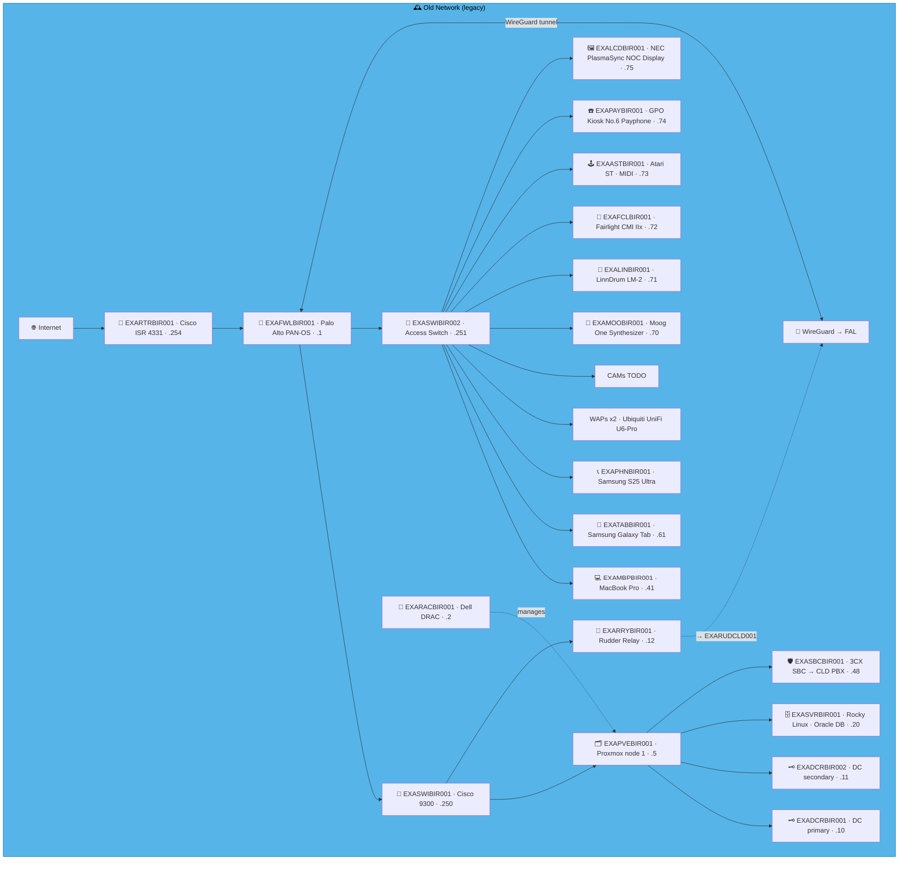
```mermaid
graph TD
    subgraph OLD_BIR ["🕰️ Old Network (legacy)"]
      INET["🌐 Internet"]
      FWL["🧱 EXAFWLBIR001 · Palo Alto PAN-OS · .1"]
      SW1["🔀 EXASWIBIR001 · Cisco 9300 · .250"]
      SW2["🔀 EXASWIBIR002 · Access Switch · .251"]
      RTR["📡 EXARTRBIR001 · Cisco ISR 4331 · .254"]
      RAC["🔧 EXARACBIR001 · Dell DRAC · .2"]
      PVE["🗂️ EXAPVEBIR001 · Proxmox node 1 · .5"]
      DC1["🗝️ EXADCRBIR001 · DC primary · .10"]
      DC2["🗝️ EXADCRBIR002 · DC secondary · .11"]
      SRV["🗄️ EXASVRBIR001 · Rocky Linux · Oracle DB · .20"]
      SBC["🛡️ EXASBCBIR001 · 3CX SBC → CLD PBX · .48"]
      RRY["🔁 EXARRYBIR001 · Rudder Relay · .12"]
      MBP["💻 EXAMBPBIR001 · MacBook Pro · .41"]
      TAB["📱 EXATABBIR001 · Samsung Galaxy Tab · .61"]
      PHN["📞 EXAPHNBIR001 · Samsung S25 Ultra"]
      WAP["WAPs x2 · Ubiquiti UniFi U6-Pro"]
      CAM["CAMs TODO"]
      MOO["🎹 EXAMOOBIR001 · Moog One Synthesizer · .70"]
      LIN["🥁 EXALINBIR001 · LinnDrum LM-2 · .71"]
      FCL["🎹 EXAFCLBIR001 · Fairlight CMI IIx · .72"]
      AST["🕹️ EXAASTBIR001 · Atari ST · MIDI · .73"]
      PAY["☎️ EXAPAYBIR001 · GPO Kiosk No.6 Payphone · .74"]
      LCD["🖼️ EXALCDBIR001 · NEC PlasmaSync NOC Display · .75"]
      VPN["🔗 WireGuard → FAL"]

      INET --> RTR --> FWL --> SW1 & SW2
      SW1 --> PVE --> DC1 & DC2 & SRV & SBC
      RAC -.->|"manages"| PVE
      SW2 --> MBP & TAB & PHN & WAP & CAM
      SW2 --> MOO & LIN & FCL & AST & PAY & LCD
      FWL <-->|"WireGuard tunnel"| VPN

      SW1 --> RRY
      RRY -. "→ EXARUDCLD001" .-> VPN
    end
    style OLD_BIR fill:#56B4E9,stroke:#0072B2,color:#000000
```

### 🗺️ Topology sketch (generated — see benarbejde/generate_network_diagrams.py)

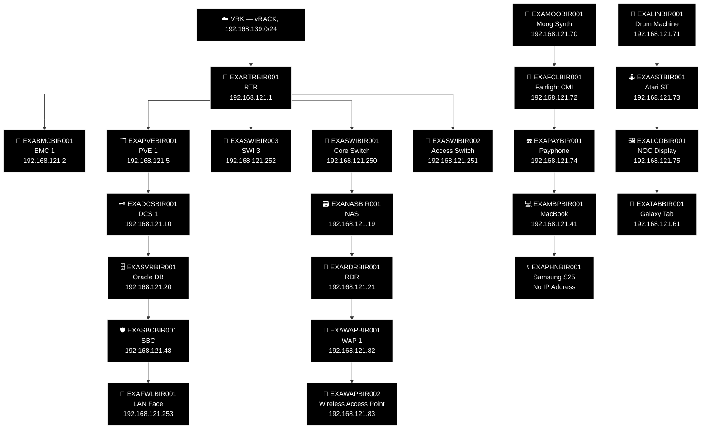
```mermaid
%% GENERATED:TOPOLOGY:BIR:START
%%{init: {'flowchart': {'curve': 'stepAfter'}}}%%
graph TD
    T_VRK["☁️ VRK — vRACK, 192.168.139.0/24"]
    T_RTR["📡 EXARTRBIR001<br/>RTR<br/>192.168.121.1"]
    T_VRK --> T_RTR
    T_BMC["🔧 EXABMCBIR001<br/>BMC 1<br/>192.168.121.2"]
    T_RTR --> T_BMC
    T_PVE["🗂️ EXAPVEBIR001<br/>PVE 1<br/>192.168.121.5"]
    T_RTR --> T_PVE
    T_SWI["🔀 EXASWIBIR003<br/>SWI 3<br/>192.168.121.252"]
    T_RTR --> T_SWI
    T_SWI2["🔀 EXASWIBIR001<br/>Core Switch<br/>192.168.121.250"]
    T_RTR --> T_SWI2
    T_SWI3["🔀 EXASWIBIR002<br/>Access Switch<br/>192.168.121.251"]
    T_RTR --> T_SWI3
    T_NAS["🗃️ EXANASBIR001<br/>NAS<br/>192.168.121.19"]
    T_RDR["🔐 EXARDRBIR001<br/>RDR<br/>192.168.121.21"]
    T_WAP["📶 EXAWAPBIR001<br/>WAP 1<br/>192.168.121.82"]
    T_WAP2["📶 EXAWAPBIR002<br/>Wireless Access Point<br/>192.168.121.83"]
    T_SWI2 --> T_NAS --> T_RDR --> T_WAP --> T_WAP2
    T_DCS["🗝️ EXADCSBIR001<br/>DCS 1<br/>192.168.121.10"]
    T_SVR["🗄️ EXASVRBIR001<br/>Oracle DB<br/>192.168.121.20"]
    T_SBC["🛡️ EXASBCBIR001<br/>SBC<br/>192.168.121.48"]
    T_FWL["🧱 EXAFWLBIR001<br/>LAN Face<br/>192.168.121.253"]
    T_PVE --> T_DCS --> T_SVR --> T_SBC --> T_FWL
    T_MOO["🎹 EXAMOOBIR001<br/>Moog Synth<br/>192.168.121.70"]
    T_LIN["🥁 EXALINBIR001<br/>Drum Machine<br/>192.168.121.71"]
    T_FCL["🎹 EXAFCLBIR001<br/>Fairlight CMI<br/>192.168.121.72"]
    T_AST["🕹️ EXAASTBIR001<br/>Atari ST<br/>192.168.121.73"]
    T_PAY["☎️ EXAPAYBIR001<br/>Payphone<br/>192.168.121.74"]
    T_LCD["🖼️ EXALCDBIR001<br/>NOC Display<br/>192.168.121.75"]
    T_MBP["💻 EXAMBPBIR001<br/>MacBook<br/>192.168.121.41"]
    T_TAB["📱 EXATABBIR001<br/>Galaxy Tab<br/>192.168.121.61"]
    T_PHN["📞 EXAPHNBIR001<br/>Samsung S25<br/>No IP Address"]
    T_MOO --> T_FCL --> T_PAY --> T_MBP --> T_PHN
    T_LIN --> T_AST --> T_LCD --> T_TAB
    style T_VRK fill:#000000,stroke:#FFFFFF,color:#FFFFFF
    style T_RTR fill:#000000,stroke:#FFFFFF,color:#FFFFFF
    style T_BMC fill:#000000,stroke:#FFFFFF,color:#FFFFFF
    style T_PVE fill:#000000,stroke:#FFFFFF,color:#FFFFFF
    style T_SWI fill:#000000,stroke:#FFFFFF,color:#FFFFFF
    style T_SWI2 fill:#000000,stroke:#FFFFFF,color:#FFFFFF
    style T_SWI3 fill:#000000,stroke:#FFFFFF,color:#FFFFFF
    style T_NAS fill:#000000,stroke:#FFFFFF,color:#FFFFFF
    style T_RDR fill:#000000,stroke:#FFFFFF,color:#FFFFFF
    style T_WAP fill:#000000,stroke:#FFFFFF,color:#FFFFFF
    style T_WAP2 fill:#000000,stroke:#FFFFFF,color:#FFFFFF
    style T_DCS fill:#000000,stroke:#FFFFFF,color:#FFFFFF
    style T_SVR fill:#000000,stroke:#FFFFFF,color:#FFFFFF
    style T_SBC fill:#000000,stroke:#FFFFFF,color:#FFFFFF
    style T_FWL fill:#000000,stroke:#FFFFFF,color:#FFFFFF
    style T_MOO fill:#000000,stroke:#FFFFFF,color:#FFFFFF
    style T_LIN fill:#000000,stroke:#FFFFFF,color:#FFFFFF
    style T_FCL fill:#000000,stroke:#FFFFFF,color:#FFFFFF
    style T_AST fill:#000000,stroke:#FFFFFF,color:#FFFFFF
    style T_PAY fill:#000000,stroke:#FFFFFF,color:#FFFFFF
    style T_LCD fill:#000000,stroke:#FFFFFF,color:#FFFFFF
    style T_MBP fill:#000000,stroke:#FFFFFF,color:#FFFFFF
    style T_TAB fill:#000000,stroke:#FFFFFF,color:#FFFFFF
    style T_PHN fill:#000000,stroke:#FFFFFF,color:#FFFFFF
%% GENERATED:TOPOLOGY:BIR:END
```

---

## MCR — Manchester 🐝

**LAN:** `192.168.161.0/24` · **Domain:** `example.org`  
**PVE nodes:** 1 · **VPN parent:** FAL  
**Entity:** Example Music (England) Ltd · **Landline:** +44 161 715 xxxx · **Mobile:** +44 770 090 6xxx

### 🕰️ Old Network (legacy, hand restyled — prototype, not yet generated)

> **Corrected against Robert's real facts, 2026-07-31.** Standing corrections applied (ESX not
> PVE; no SBC; no `RRY`; no WireGuard on old infra). Both DCs were genuinely `DCR` — the box's
> own `EXADCSMCR002` was a naming inconsistency, corrected to `EXADCRMCR002`; both get real new
> `EXADCSMCR001-002` builds on the new PVE nodes. Real, working hypervisor this time — an HP
> server (`EXAESXMCR001`) managed by the HPE iLO5 already on record (`EXARACMCR001`, kept as
> `RAC` — real vendor, unchanged from the original box). WAPs
> confirmed the LND-style case — the old entry was just a "marker," never real old hardware,
> installed fresh on the new build. Laptops, workstations, and printer all confirmed real and
> moving over.

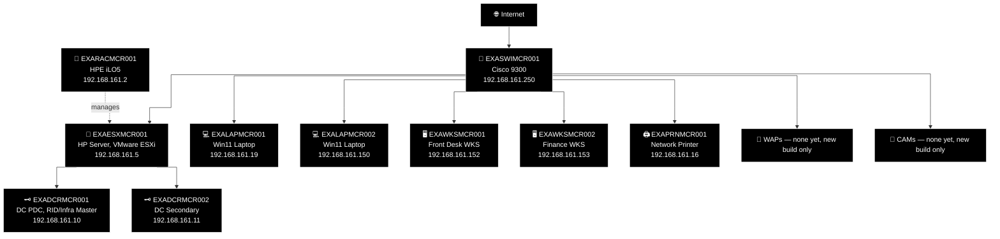
```mermaid
%%{init: {'flowchart': {'curve': 'stepAfter'}}}%%
graph TD
    O_INET["🌐 Internet"]
    O_SW["🔀 EXASWIMCR001<br/>Cisco 9300<br/>192.168.161.250"]
    O_INET --> O_SW

    O_RAC["🔧 EXARACMCR001<br/>HPE iLO5<br/>192.168.161.2"]
    O_ESX["💾 EXAESXMCR001<br/>HP Server, VMware ESXi<br/>192.168.161.5"]
    O_DC1["🗝️ EXADCRMCR001<br/>DC PDC, RID/Infra Master<br/>192.168.161.10"]
    O_DC2["🗝️ EXADCRMCR002<br/>DC Secondary<br/>192.168.161.11"]
    O_SW --> O_ESX
    O_RAC -.->|"manages"| O_ESX
    O_ESX --> O_DC1
    O_ESX --> O_DC2

    O_LAP1["💻 EXALAPMCR001<br/>Win11 Laptop<br/>192.168.161.19"]
    O_LAP2["💻 EXALAPMCR002<br/>Win11 Laptop<br/>192.168.161.150"]
    O_WKS1["🖥️ EXAWKSMCR001<br/>Front Desk WKS<br/>192.168.161.152"]
    O_WKS2["🖥️ EXAWKSMCR002<br/>Finance WKS<br/>192.168.161.153"]
    O_PRN["🖨️ EXAPRNMCR001<br/>Network Printer<br/>192.168.161.16"]
    O_WAP["📶 WAPs — none yet, new build only"]
    O_CAM["🎥 CAMs — none yet, new build only"]
    O_SW --> O_LAP1
    O_SW --> O_LAP2
    O_SW --> O_WKS1
    O_SW --> O_WKS2
    O_SW --> O_PRN
    O_SW --> O_WAP
    O_SW --> O_CAM

    style O_INET fill:#000000,stroke:#FFFFFF,color:#FFFFFF
    style O_SW fill:#000000,stroke:#FFFFFF,color:#FFFFFF
    style O_RAC fill:#000000,stroke:#FFFFFF,color:#FFFFFF
    style O_ESX fill:#000000,stroke:#FFFFFF,color:#FFFFFF
    style O_DC1 fill:#000000,stroke:#FFFFFF,color:#FFFFFF
    style O_DC2 fill:#000000,stroke:#FFFFFF,color:#FFFFFF
    style O_LAP1 fill:#000000,stroke:#FFFFFF,color:#FFFFFF
    style O_LAP2 fill:#000000,stroke:#FFFFFF,color:#FFFFFF
    style O_WKS1 fill:#000000,stroke:#FFFFFF,color:#FFFFFF
    style O_WKS2 fill:#000000,stroke:#FFFFFF,color:#FFFFFF
    style O_PRN fill:#000000,stroke:#FFFFFF,color:#FFFFFF
    style O_WAP fill:#000000,stroke:#FFFFFF,color:#FFFFFF
    style O_CAM fill:#000000,stroke:#FFFFFF,color:#FFFFFF
```

Original hand-maintained Old Network box (pre-restyle, kept for reference during prototype review)

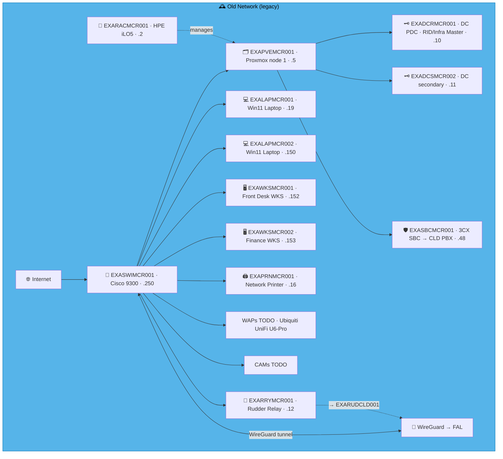
```mermaid
graph TD
    subgraph OLD_MCR ["🕰️ Old Network (legacy)"]
      INET["🌐 Internet"]
      SW["🔀 EXASWIMCR001 · Cisco 9300 · .250"]
      RAC["🔧 EXARACMCR001 · HPE iLO5 · .2"]
      PVE["🗂️ EXAPVEMCR001 · Proxmox node 1 · .5"]
      DC1["🗝️ EXADCRMCR001 · DC PDC · RID/Infra Master · .10"]
      DC2["🗝️ EXADCSMCR002 · DC secondary · .11"]
      SBC["🛡️ EXASBCMCR001 · 3CX SBC → CLD PBX · .48"]
      RRY["🔁 EXARRYMCR001 · Rudder Relay · .12"]
      LAP1["💻 EXALAPMCR001 · Win11 Laptop · .19"]
      LAP2["💻 EXALAPMCR002 · Win11 Laptop · .150"]
      WKS1["🖥️ EXAWKSMCR001 · Front Desk WKS · .152"]
      WKS2["🖥️ EXAWKSMCR002 · Finance WKS · .153"]
      PRN["🖨️ EXAPRNMCR001 · Network Printer · .16"]
      WAP["WAPs TODO · Ubiquiti UniFi U6-Pro"]
      CAM["CAMs TODO"]
      VPN["🔗 WireGuard → FAL"]

      INET --> SW
      SW --> PVE --> DC1 & DC2 & SBC
      RAC -.->|"manages"| PVE
      SW --> LAP1 & LAP2 & WKS1 & WKS2 & PRN & WAP & CAM
      SW <-->|"WireGuard tunnel"| VPN

      SW --> RRY
      RRY -. "→ EXARUDCLD001" .-> VPN
    end
    style OLD_MCR fill:#56B4E9,stroke:#0072B2,color:#000000
```

### 🗺️ Topology sketch (generated — see benarbejde/generate_network_diagrams.py)

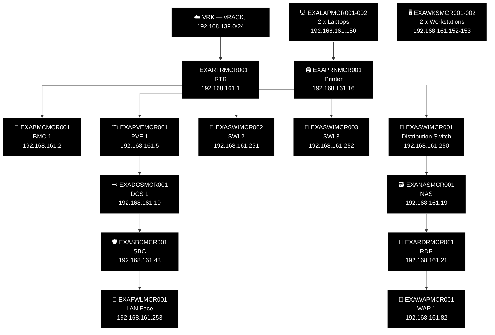
```mermaid
%% GENERATED:TOPOLOGY:MCR:START
%%{init: {'flowchart': {'curve': 'stepAfter'}}}%%
graph TD
    T_VRK["☁️ VRK — vRACK, 192.168.139.0/24"]
    T_RTR["📡 EXARTRMCR001<br/>RTR<br/>192.168.161.1"]
    T_VRK --> T_RTR
    T_BMC["🔧 EXABMCMCR001<br/>BMC 1<br/>192.168.161.2"]
    T_RTR --> T_BMC
    T_PVE["🗂️ EXAPVEMCR001<br/>PVE 1<br/>192.168.161.5"]
    T_RTR --> T_PVE
    T_SWI["🔀 EXASWIMCR002<br/>SWI 2<br/>192.168.161.251"]
    T_RTR --> T_SWI
    T_SWI2["🔀 EXASWIMCR003<br/>SWI 3<br/>192.168.161.252"]
    T_RTR --> T_SWI2
    T_SWI3["🔀 EXASWIMCR001<br/>Distribution Switch<br/>192.168.161.250"]
    T_RTR --> T_SWI3
    T_NAS["🗃️ EXANASMCR001<br/>NAS<br/>192.168.161.19"]
    T_RDR["🔐 EXARDRMCR001<br/>RDR<br/>192.168.161.21"]
    T_WAP["📶 EXAWAPMCR001<br/>WAP 1<br/>192.168.161.82"]
    T_SWI3 --> T_NAS --> T_RDR --> T_WAP
    T_DCS["🗝️ EXADCSMCR001<br/>DCS 1<br/>192.168.161.10"]
    T_SBC["🛡️ EXASBCMCR001<br/>SBC<br/>192.168.161.48"]
    T_FWL["🧱 EXAFWLMCR001<br/>LAN Face<br/>192.168.161.253"]
    T_PVE --> T_DCS --> T_SBC --> T_FWL
    T_OTH_LAP["💻 EXALAPMCR001-002<br/>2 x Laptops<br/>192.168.161.150"]
    T_OTH_WKS["🖥️ EXAWKSMCR001-002<br/>2 x Workstations<br/>192.168.161.152-153"]
    T_PRN["🖨️ EXAPRNMCR001<br/>Printer<br/>192.168.161.16"]
    T_OTH_LAP --> T_PRN
    style T_VRK fill:#000000,stroke:#FFFFFF,color:#FFFFFF
    style T_RTR fill:#000000,stroke:#FFFFFF,color:#FFFFFF
    style T_BMC fill:#000000,stroke:#FFFFFF,color:#FFFFFF
    style T_PVE fill:#000000,stroke:#FFFFFF,color:#FFFFFF
    style T_SWI fill:#000000,stroke:#FFFFFF,color:#FFFFFF
    style T_SWI2 fill:#000000,stroke:#FFFFFF,color:#FFFFFF
    style T_SWI3 fill:#000000,stroke:#FFFFFF,color:#FFFFFF
    style T_NAS fill:#000000,stroke:#FFFFFF,color:#FFFFFF
    style T_RDR fill:#000000,stroke:#FFFFFF,color:#FFFFFF
    style T_WAP fill:#000000,stroke:#FFFFFF,color:#FFFFFF
    style T_DCS fill:#000000,stroke:#FFFFFF,color:#FFFFFF
    style T_SBC fill:#000000,stroke:#FFFFFF,color:#FFFFFF
    style T_FWL fill:#000000,stroke:#FFFFFF,color:#FFFFFF
    style T_OTH_LAP fill:#000000,stroke:#FFFFFF,color:#FFFFFF
    style T_OTH_WKS fill:#000000,stroke:#FFFFFF,color:#FFFFFF
    style T_PRN fill:#000000,stroke:#FFFFFF,color:#FFFFFF
%% GENERATED:TOPOLOGY:MCR:END
```

---

## LIV — Liverpool 🎸

**LAN:** `192.168.151.0/24` · **Domain:** `example.org`  
**PVE nodes:** 1 · **VPN parent:** FAL  
**Entity:** Example Music (England) Ltd · **Landline:** +44 151 496 0xxx · **Mobile:** +44 770 090 5xxx

### 🕰️ Old Network (legacy, hand restyled — prototype, not yet generated)

> **Corrected against Robert's real facts, 2026-07-31.** Standing corrections applied (ESX not
> PVE; no SBC; no `RRY`; no WireGuard on old infra). Real working hypervisor — HP ML310e + HP
> iLO, ESXi actually running. `EXADCRLIV001`'s "WS2025" is real, but for an unusual reason:
> **Liverpool built it unauthorized**, off their own initiative, not through the standard
> process — kept as a real governance flag, not just a health one. The site also put all its
> file shares directly on that same DC (Robert: "we are fine with that but the known source of
> truth for that IP is `EXADCRLIV001`") — the box's separate `EXASVRLIV001` "WS2022 File Server"
> node was a duplicate representation of the same physical device at the same IP, not a second
> real one — removed. `EXAMACLIV001`'s `⚠️ disabled` status kept per the migration-priority rule.

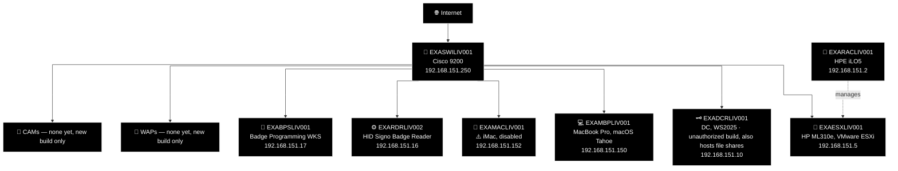
```mermaid
%%{init: {'flowchart': {'curve': 'stepAfter'}}}%%
graph TD
    O_INET["🌐 Internet"]
    O_SW["🔀 EXASWILIV001<br/>Cisco 9200<br/>192.168.151.250"]
    O_INET --> O_SW

    O_RAC["🔧 EXARACLIV001<br/>HPE iLO5<br/>192.168.151.2"]
    O_ESX["💾 EXAESXLIV001<br/>HP ML310e, VMware ESXi<br/>192.168.151.5"]
    O_SW --> O_ESX
    O_RAC -.->|"manages"| O_ESX

    O_DC["🗝️ EXADCRLIV001<br/>DC, WS2025 · unauthorized build, also hosts file shares<br/>192.168.151.10"]
    O_SW --> O_DC

    O_MBP["💻 EXAMBPLIV001<br/>MacBook Pro, macOS Tahoe<br/>192.168.151.150"]
    O_MAC["🍎 EXAMACLIV001<br/>⚠️ iMac, disabled<br/>192.168.151.152"]
    O_RDR["⚙️ EXARDRLIV002<br/>HID Signo Badge Reader<br/>192.168.151.16"]
    O_BPS["🪪 EXABPSLIV001<br/>Badge Programming WKS<br/>192.168.151.17"]
    O_WAP["📶 WAPs — none yet, new build only"]
    O_CAM["🎥 CAMs — none yet, new build only"]
    O_SW --> O_MBP
    O_SW --> O_MAC
    O_SW --> O_RDR
    O_SW --> O_BPS
    O_SW --> O_WAP
    O_SW --> O_CAM

    style O_INET fill:#000000,stroke:#FFFFFF,color:#FFFFFF
    style O_SW fill:#000000,stroke:#FFFFFF,color:#FFFFFF
    style O_RAC fill:#000000,stroke:#FFFFFF,color:#FFFFFF
    style O_ESX fill:#000000,stroke:#FFFFFF,color:#FFFFFF
    style O_DC fill:#000000,stroke:#FFFFFF,color:#FFFFFF
    style O_MBP fill:#000000,stroke:#FFFFFF,color:#FFFFFF
    style O_MAC fill:#000000,stroke:#FFFFFF,color:#FFFFFF
    style O_RDR fill:#000000,stroke:#FFFFFF,color:#FFFFFF
    style O_BPS fill:#000000,stroke:#FFFFFF,color:#FFFFFF
    style O_WAP fill:#000000,stroke:#FFFFFF,color:#FFFFFF
    style O_CAM fill:#000000,stroke:#FFFFFF,color:#FFFFFF
```

Original hand-maintained Old Network box (pre-restyle, kept for reference during prototype review)

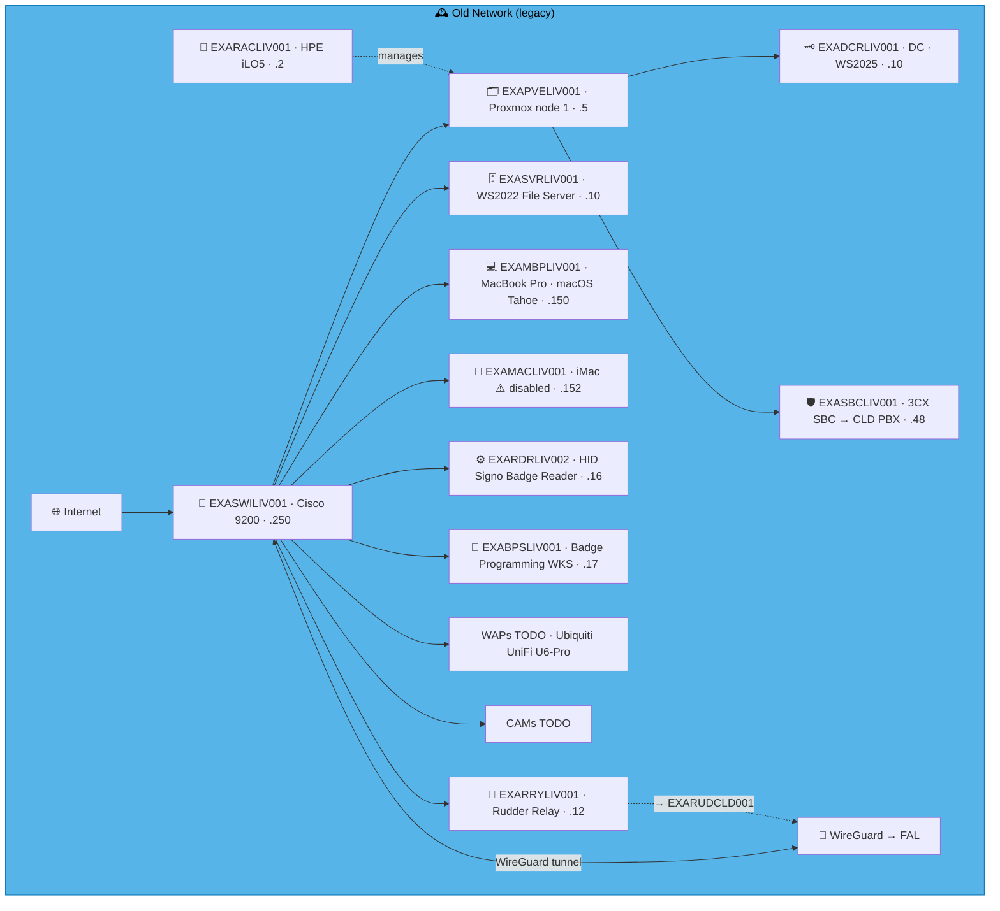
```mermaid
graph TD
    subgraph OLD_LIV ["🕰️ Old Network (legacy)"]
      INET["🌐 Internet"]
      SW["🔀 EXASWILIV001 · Cisco 9200 · .250"]
      RAC["🔧 EXARACLIV001 · HPE iLO5 · .2"]
      PVE["🗂️ EXAPVELIV001 · Proxmox node 1 · .5"]
      DC["🗝️ EXADCRLIV001 · DC · WS2025 · .10"]
      SBC["🛡️ EXASBCLIV001 · 3CX SBC → CLD PBX · .48"]
      RRY["🔁 EXARRYLIV001 · Rudder Relay · .12"]
      SRV["🗄️ EXASVRLIV001 · WS2022 File Server · .10"]
      MBP["💻 EXAMBPLIV001 · MacBook Pro · macOS Tahoe · .150"]
      MAC["🍎 EXAMACLIV001 · iMac ⚠️ disabled · .152"]
      RDR["⚙️ EXARDRLIV002 · HID Signo Badge Reader · .16"]
      BPS["🪪 EXABPSLIV001 · Badge Programming WKS · .17"]
      WAP["WAPs TODO · Ubiquiti UniFi U6-Pro"]
      CAM["CAMs TODO"]
      VPN["🔗 WireGuard → FAL"]

      INET --> SW
      SW --> PVE --> DC & SBC
      RAC -.->|"manages"| PVE
      SW --> SRV & MBP & MAC & RDR & BPS & WAP & CAM
      SW <-->|"WireGuard tunnel"| VPN

      SW --> RRY
      RRY -. "→ EXARUDCLD001" .-> VPN
    end
    style OLD_LIV fill:#56B4E9,stroke:#0072B2,color:#000000
```

### 🗺️ Topology sketch (generated — see benarbejde/generate_network_diagrams.py)

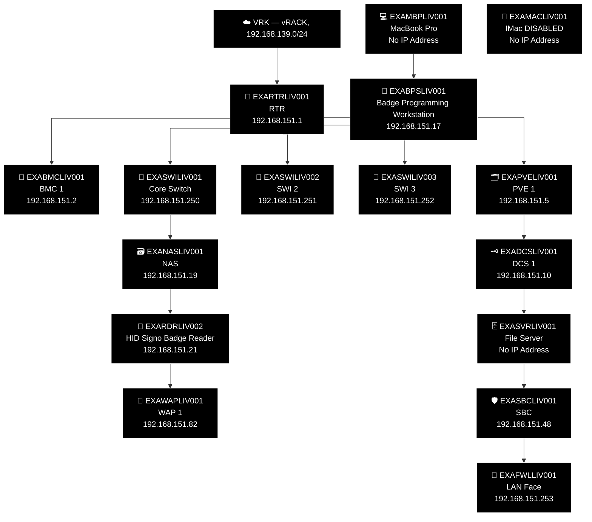
```mermaid
%% GENERATED:TOPOLOGY:LIV:START
%%{init: {'flowchart': {'curve': 'stepAfter'}}}%%
graph TD
    T_VRK["☁️ VRK — vRACK, 192.168.139.0/24"]
    T_RTR["📡 EXARTRLIV001<br/>RTR<br/>192.168.151.1"]
    T_VRK --> T_RTR
    T_BMC["🔧 EXABMCLIV001<br/>BMC 1<br/>192.168.151.2"]
    T_RTR --> T_BMC
    T_PVE["🗂️ EXAPVELIV001<br/>PVE 1<br/>192.168.151.5"]
    T_RTR --> T_PVE
    T_SWI["🔀 EXASWILIV002<br/>SWI 2<br/>192.168.151.251"]
    T_RTR --> T_SWI
    T_SWI2["🔀 EXASWILIV003<br/>SWI 3<br/>192.168.151.252"]
    T_RTR --> T_SWI2
    T_SWI3["🔀 EXASWILIV001<br/>Core Switch<br/>192.168.151.250"]
    T_RTR --> T_SWI3
    T_NAS["🗃️ EXANASLIV001<br/>NAS<br/>192.168.151.19"]
    T_RDR["🔐 EXARDRLIV002<br/>HID Signo Badge Reader<br/>192.168.151.21"]
    T_WAP["📶 EXAWAPLIV001<br/>WAP 1<br/>192.168.151.82"]
    T_SWI3 --> T_NAS --> T_RDR --> T_WAP
    T_DCS["🗝️ EXADCSLIV001<br/>DCS 1<br/>192.168.151.10"]
    T_SVR["🗄️ EXASVRLIV001<br/>File Server<br/>No IP Address"]
    T_SBC["🛡️ EXASBCLIV001<br/>SBC<br/>192.168.151.48"]
    T_FWL["🧱 EXAFWLLIV001<br/>LAN Face<br/>192.168.151.253"]
    T_PVE --> T_DCS --> T_SVR --> T_SBC --> T_FWL
    T_MBP["💻 EXAMBPLIV001<br/>MacBook Pro<br/>No IP Address"]
    T_MAC["🍎 EXAMACLIV001<br/>IMac DISABLED<br/>No IP Address"]
    T_BPS["🪪 EXABPSLIV001<br/>Badge Programming Workstation<br/>192.168.151.17"]
    T_MBP --> T_BPS
    style T_VRK fill:#000000,stroke:#FFFFFF,color:#FFFFFF
    style T_RTR fill:#000000,stroke:#FFFFFF,color:#FFFFFF
    style T_BMC fill:#000000,stroke:#FFFFFF,color:#FFFFFF
    style T_PVE fill:#000000,stroke:#FFFFFF,color:#FFFFFF
    style T_SWI fill:#000000,stroke:#FFFFFF,color:#FFFFFF
    style T_SWI2 fill:#000000,stroke:#FFFFFF,color:#FFFFFF
    style T_SWI3 fill:#000000,stroke:#FFFFFF,color:#FFFFFF
    style T_NAS fill:#000000,stroke:#FFFFFF,color:#FFFFFF
    style T_RDR fill:#000000,stroke:#FFFFFF,color:#FFFFFF
    style T_WAP fill:#000000,stroke:#FFFFFF,color:#FFFFFF
    style T_DCS fill:#000000,stroke:#FFFFFF,color:#FFFFFF
    style T_SVR fill:#000000,stroke:#FFFFFF,color:#FFFFFF
    style T_SBC fill:#000000,stroke:#FFFFFF,color:#FFFFFF
    style T_FWL fill:#000000,stroke:#FFFFFF,color:#FFFFFF
    style T_MBP fill:#000000,stroke:#FFFFFF,color:#FFFFFF
    style T_MAC fill:#000000,stroke:#FFFFFF,color:#FFFFFF
    style T_BPS fill:#000000,stroke:#FFFFFF,color:#FFFFFF
%% GENERATED:TOPOLOGY:LIV:END
```

---

## NEW — Newcastle 🌉

**LAN:** `192.168.191.0/24` · **Domain:** `example.org`  
**PVE nodes:** 1 · **VPN parent:** FAL  
**Entity:** Example Music (England) Ltd · **Landline:** +44 191 496 0xxx · **Mobile:** +44 770 090 9xxx

### 🕰️ Old Network (legacy, hand restyled — prototype, not yet generated)

> **Corrected against Robert's real facts, 2026-07-31.** Standing corrections applied (no SBC;
> no `RRY`; no WireGuard on old infra). The consumer-grade TP-Link JetStream switch is genuinely
> real (replaced by a proper one on upgrade). Real working hypervisor — `EXAESXNEW001`
> (VMware ESXi) managed by `EXARACNEW001` (Dell iDRAC9) — and a nice piece of continuity: that
> same physical hardware was later repurposed as a new-build PVE node, `EXAPVENEW002`. Both
> `EXADCRNEW001` and `EXASVRNEW001` were technically built and running (AD services / WS2022
> File-Print) but **never actually configured with real users, shares, or even a static IP** —
> the file server was running on DHCP. Kept as real, sharp migration-priority signals — this
> wasn't a working site, it was a shell. `EXAWKSNEW099`'s LAPS-expired flag kept per the standing
> rule. WAP/CAM both confirmed genuinely never-installed — planned, never built, arriving fresh
> with the new network.

> 🚨 **Migration priority — Tier 3.** `EXADCRNEW001` (AD, never given real users/shares) and
> `EXASVRNEW001` (file/print, never configured, still on DHCP) — no live users depending on
> either today. Still counts toward the estate-wide rollout: a new `EXADCSNEW001` build
> promoting and replicating against `EXADCSCLD001` (`ansible/playbooks/windows_dc/`).

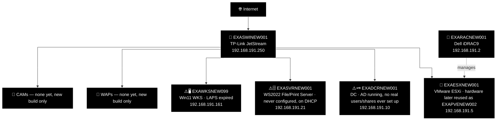
```mermaid
%%{init: {'flowchart': {'curve': 'stepAfter'}}}%%
graph TD
    O_INET["🌐 Internet"]
    O_SW["🔀 EXASWINEW001<br/>TP-Link JetStream<br/>192.168.191.250"]
    O_INET --> O_SW

    O_RAC["🔧 EXARACNEW001<br/>Dell iDRAC9<br/>192.168.191.2"]
    O_ESX["💾 EXAESXNEW001<br/>VMware ESXi · hardware later reused as EXAPVENEW002<br/>192.168.191.5"]
    O_SW --> O_ESX
    O_RAC -.->|"manages"| O_ESX

    O_DC["⚠️🗝️ EXADCRNEW001<br/>DC · AD running, no real users/shares ever set up<br/>192.168.191.10"]
    O_SRV["⚠️🗄️ EXASVRNEW001<br/>WS2022 File/Print Server · never configured, on DHCP<br/>192.168.191.21"]
    O_WKS["⚠️🖥️ EXAWKSNEW099<br/>Win11 WKS · LAPS expired<br/>192.168.191.161"]
    O_WAP["📶 WAPs — none yet, new build only"]
    O_CAM["🎥 CAMs — none yet, new build only"]
    O_SW --> O_DC
    O_SW --> O_SRV
    O_SW --> O_WKS
    O_SW --> O_WAP
    O_SW --> O_CAM

    style O_INET fill:#000000,stroke:#FFFFFF,color:#FFFFFF
    style O_SW fill:#000000,stroke:#FFFFFF,color:#FFFFFF
    style O_RAC fill:#000000,stroke:#FFFFFF,color:#FFFFFF
    style O_ESX fill:#000000,stroke:#FFFFFF,color:#FFFFFF
    style O_DC fill:#000000,stroke:#FFFFFF,color:#FFFFFF
    style O_SRV fill:#000000,stroke:#FFFFFF,color:#FFFFFF
    style O_WKS fill:#000000,stroke:#FFFFFF,color:#FFFFFF
    style O_WAP fill:#000000,stroke:#FFFFFF,color:#FFFFFF
    style O_CAM fill:#000000,stroke:#FFFFFF,color:#FFFFFF
```

Original hand-maintained Old Network box (pre-restyle, kept for reference during prototype review)

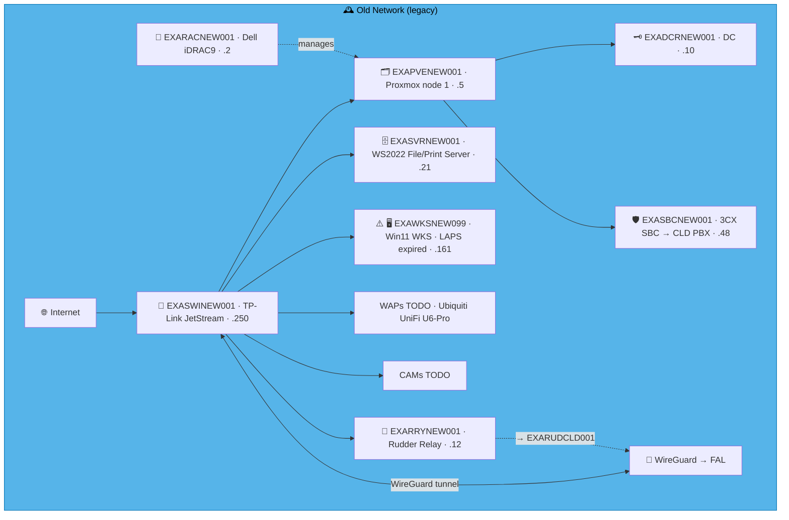
```mermaid
graph TD
    subgraph OLD_NEW ["🕰️ Old Network (legacy)"]
      INET["🌐 Internet"]
      SW["🔀 EXASWINEW001 · TP-Link JetStream · .250"]
      RAC["🔧 EXARACNEW001 · Dell iDRAC9 · .2"]
      PVE["🗂️ EXAPVENEW001 · Proxmox node 1 · .5"]
      DC["🗝️ EXADCRNEW001 · DC · .10"]
      SBC["🛡️ EXASBCNEW001 · 3CX SBC → CLD PBX · .48"]
      RRY["🔁 EXARRYNEW001 · Rudder Relay · .12"]
      SRV["🗄️ EXASVRNEW001 · WS2022 File/Print Server · .21"]
      WKS["⚠️ 🖥️ EXAWKSNEW099 · Win11 WKS · LAPS expired · .161"]
      WAP["WAPs TODO · Ubiquiti UniFi U6-Pro"]
      CAM["CAMs TODO"]
      VPN["🔗 WireGuard → FAL"]

      INET --> SW
      SW --> PVE --> DC & SBC
      RAC -.->|"manages"| PVE
      SW --> SRV & WKS & WAP & CAM
      SW <-->|"WireGuard tunnel"| VPN

      SW --> RRY
      RRY -. "→ EXARUDCLD001" .-> VPN
    end
    style OLD_NEW fill:#56B4E9,stroke:#0072B2,color:#000000
```

### 🗺️ Topology sketch (generated — see benarbejde/generate_network_diagrams.py)

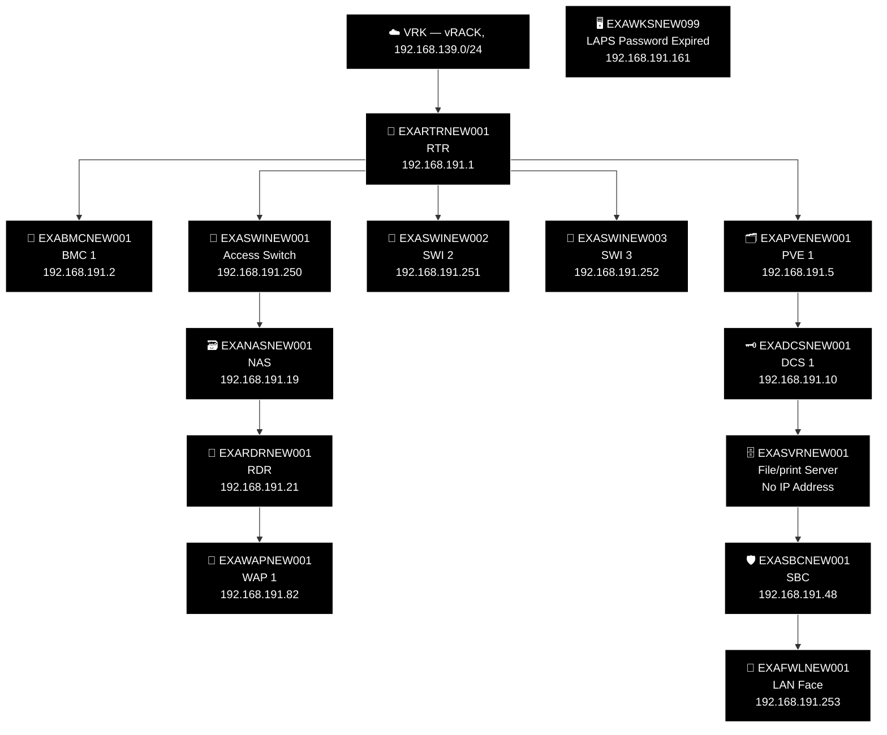
```mermaid
%% GENERATED:TOPOLOGY:NEW:START
%%{init: {'flowchart': {'curve': 'stepAfter'}}}%%
graph TD
    T_VRK["☁️ VRK — vRACK, 192.168.139.0/24"]
    T_RTR["📡 EXARTRNEW001<br/>RTR<br/>192.168.191.1"]
    T_VRK --> T_RTR
    T_BMC["🔧 EXABMCNEW001<br/>BMC 1<br/>192.168.191.2"]
    T_RTR --> T_BMC
    T_PVE["🗂️ EXAPVENEW001<br/>PVE 1<br/>192.168.191.5"]
    T_RTR --> T_PVE
    T_SWI["🔀 EXASWINEW002<br/>SWI 2<br/>192.168.191.251"]
    T_RTR --> T_SWI
    T_SWI2["🔀 EXASWINEW003<br/>SWI 3<br/>192.168.191.252"]
    T_RTR --> T_SWI2
    T_SWI3["🔀 EXASWINEW001<br/>Access Switch<br/>192.168.191.250"]
    T_RTR --> T_SWI3
    T_NAS["🗃️ EXANASNEW001<br/>NAS<br/>192.168.191.19"]
    T_RDR["🔐 EXARDRNEW001<br/>RDR<br/>192.168.191.21"]
    T_WAP["📶 EXAWAPNEW001<br/>WAP 1<br/>192.168.191.82"]
    T_SWI3 --> T_NAS --> T_RDR --> T_WAP
    T_DCS["🗝️ EXADCSNEW001<br/>DCS 1<br/>192.168.191.10"]
    T_SVR["🗄️ EXASVRNEW001<br/>File/print Server<br/>No IP Address"]
    T_SBC["🛡️ EXASBCNEW001<br/>SBC<br/>192.168.191.48"]
    T_FWL["🧱 EXAFWLNEW001<br/>LAN Face<br/>192.168.191.253"]
    T_PVE --> T_DCS --> T_SVR --> T_SBC --> T_FWL
    T_WKS["🖥️ EXAWKSNEW099<br/>LAPS Password Expired<br/>192.168.191.161"]
    style T_VRK fill:#000000,stroke:#FFFFFF,color:#FFFFFF
    style T_RTR fill:#000000,stroke:#FFFFFF,color:#FFFFFF
    style T_BMC fill:#000000,stroke:#FFFFFF,color:#FFFFFF
    style T_PVE fill:#000000,stroke:#FFFFFF,color:#FFFFFF
    style T_SWI fill:#000000,stroke:#FFFFFF,color:#FFFFFF
    style T_SWI2 fill:#000000,stroke:#FFFFFF,color:#FFFFFF
    style T_SWI3 fill:#000000,stroke:#FFFFFF,color:#FFFFFF
    style T_NAS fill:#000000,stroke:#FFFFFF,color:#FFFFFF
    style T_RDR fill:#000000,stroke:#FFFFFF,color:#FFFFFF
    style T_WAP fill:#000000,stroke:#FFFFFF,color:#FFFFFF
    style T_DCS fill:#000000,stroke:#FFFFFF,color:#FFFFFF
    style T_SVR fill:#000000,stroke:#FFFFFF,color:#FFFFFF
    style T_SBC fill:#000000,stroke:#FFFFFF,color:#FFFFFF
    style T_FWL fill:#000000,stroke:#FFFFFF,color:#FFFFFF
    style T_WKS fill:#000000,stroke:#FFFFFF,color:#FFFFFF
%% GENERATED:TOPOLOGY:NEW:END
```

---

## SHE — Sheffield 🥄

**LAN:** `192.168.114.0/24` · **Domain:** `example.net`  
**PVE nodes:** 1 · **VPN parent:** FAL  
**Entity:** Example Music (England) Ltd · **Landline:** +44 114 250 0xxx · **Mobile:** +44 7700 905 2xxx

### 🕰️ Old Network (legacy, hand restyled — prototype, not yet generated)

> **Corrected against Robert's real facts, 2026-07-31.** Standing corrections applied (no SBC;
> no `RRY`; no WireGuard on old infra). Sheffield was genuinely as bare as the original box
> suggested — Robert: "nothing existed." No hypervisor, no BMC (`EXARACSHE001` removed — a
> consumer desktop tower has no out-of-band management to represent). `EXADCRSHE001` was
> "literally just Windows Server running on an old Dell OptiPlex tower" — kept, plainly, as the
> sharpest hardware-inadequacy signal so far. WAP/CAM/Endpoints all confirmed genuinely
> never-installed — everything arrives fresh with the new build.

> 🚨 **Migration priority — Tier 4.** Hardware inadequate from the outset (consumer OptiPlex
> tower) — no in-place remediation possible. A new `EXADCRSHE001` build promotes and replicates
> against `EXADCSCLD001` (`ansible/playbooks/windows_dc/`) on proper server hardware.

```mermaid
%%{init: {'flowchart': {'curve': 'stepAfter'}}}%%
graph TD
    O_INET["🌐 Internet"]
    O_DC["⚠️🗝️ EXADCRSHE001<br/>DC · Windows Server on a Dell OptiPlex tower<br/>192.168.114.10"]
    O_INET --> O_DC

    O_WAP["📶 WAPs — none yet, new build only"]
    O_CAM["🎥 CAMs — none yet, new build only"]
    O_EP["🖥️ Endpoints — none yet, new build only"]
    O_INET --> O_WAP
    O_INET --> O_CAM
    O_INET --> O_EP

    style O_INET fill:#000000,stroke:#FFFFFF,color:#FFFFFF
    style O_DC fill:#000000,stroke:#FFFFFF,color:#FFFFFF
    style O_WAP fill:#000000,stroke:#FFFFFF,color:#FFFFFF
    style O_CAM fill:#000000,stroke:#FFFFFF,color:#FFFFFF
    style O_EP fill:#000000,stroke:#FFFFFF,color:#FFFFFF
```

Original hand-maintained Old Network box (pre-restyle, kept for reference during prototype review)

```mermaid
graph TD
    subgraph OLD_SHE ["🕰️ Old Network (legacy)"]
      INET["🌐 Internet"]
      RAC["🔧 EXARACSHE001 · BMC node 1 · .2"]
      PVE["🗂️ EXAPVESHE001 · Proxmox node 1 · .5"]
      DC["🗝️ EXADCRSHE001 · DC · .10"]
      SBC["🛡️ EXASBCSHE001 · 3CX SBC → CLD PBX · .48"]
      RRY["🔁 EXARRYSHE001 · Rudder Relay · .12"]
      WAP["WAPs TODO · Ubiquiti UniFi U6-Pro"]
      CAM["CAMs TODO"]
      EP["Endpoints TODO"]
      VPN["🔗 WireGuard → FAL"]

      INET --> PVE --> DC & SBC
      RAC -.->|"manages"| PVE
      PVE --> WAP & CAM & EP
      PVE <-->|"WireGuard tunnel"| VPN

      PVE --> RRY
      RRY -. "→ EXARUDCLD001" .-> VPN
    end
    style OLD_SHE fill:#56B4E9,stroke:#0072B2,color:#000000
```

### 🗺️ Topology sketch (generated — see benarbejde/generate_network_diagrams.py)

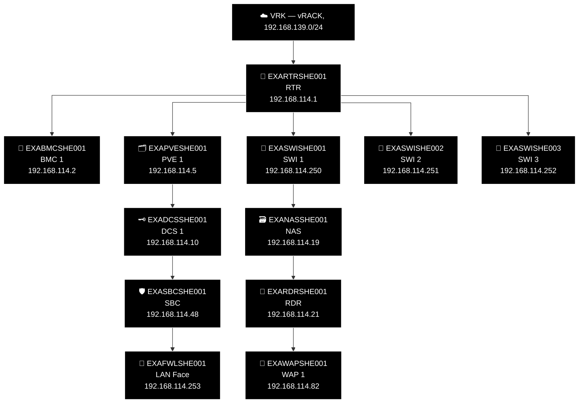
```mermaid
%% GENERATED:TOPOLOGY:SHE:START
%%{init: {'flowchart': {'curve': 'stepAfter'}}}%%
graph TD
    T_VRK["☁️ VRK — vRACK, 192.168.139.0/24"]
    T_RTR["📡 EXARTRSHE001<br/>RTR<br/>192.168.114.1"]
    T_VRK --> T_RTR
    T_BMC["🔧 EXABMCSHE001<br/>BMC 1<br/>192.168.114.2"]
    T_RTR --> T_BMC
    T_PVE["🗂️ EXAPVESHE001<br/>PVE 1<br/>192.168.114.5"]
    T_RTR --> T_PVE
    T_SWI["🔀 EXASWISHE001<br/>SWI 1<br/>192.168.114.250"]
    T_RTR --> T_SWI
    T_SWI2["🔀 EXASWISHE002<br/>SWI 2<br/>192.168.114.251"]
    T_RTR --> T_SWI2
    T_SWI3["🔀 EXASWISHE003<br/>SWI 3<br/>192.168.114.252"]
    T_RTR --> T_SWI3
    T_NAS["🗃️ EXANASSHE001<br/>NAS<br/>192.168.114.19"]
    T_RDR["🔐 EXARDRSHE001<br/>RDR<br/>192.168.114.21"]
    T_WAP["📶 EXAWAPSHE001<br/>WAP 1<br/>192.168.114.82"]
    T_SWI --> T_NAS --> T_RDR --> T_WAP
    T_DCS["🗝️ EXADCSSHE001<br/>DCS 1<br/>192.168.114.10"]
    T_SBC["🛡️ EXASBCSHE001<br/>SBC<br/>192.168.114.48"]
    T_FWL["🧱 EXAFWLSHE001<br/>LAN Face<br/>192.168.114.253"]
    T_PVE --> T_DCS --> T_SBC --> T_FWL
    style T_VRK fill:#000000,stroke:#FFFFFF,color:#FFFFFF
    style T_RTR fill:#000000,stroke:#FFFFFF,color:#FFFFFF
    style T_BMC fill:#000000,stroke:#FFFFFF,color:#FFFFFF
    style T_PVE fill:#000000,stroke:#FFFFFF,color:#FFFFFF
    style T_SWI fill:#000000,stroke:#FFFFFF,color:#FFFFFF
    style T_SWI2 fill:#000000,stroke:#FFFFFF,color:#FFFFFF
    style T_SWI3 fill:#000000,stroke:#FFFFFF,color:#FFFFFF
    style T_NAS fill:#000000,stroke:#FFFFFF,color:#FFFFFF
    style T_RDR fill:#000000,stroke:#FFFFFF,color:#FFFFFF
    style T_WAP fill:#000000,stroke:#FFFFFF,color:#FFFFFF
    style T_DCS fill:#000000,stroke:#FFFFFF,color:#FFFFFF
    style T_SBC fill:#000000,stroke:#FFFFFF,color:#FFFFFF
    style T_FWL fill:#000000,stroke:#FFFFFF,color:#FFFFFF
%% GENERATED:TOPOLOGY:SHE:END
```

---

## HAL — Halifax 🏦

**LAN:** `192.168.142.0/24` · **Domain:** `example.net`  
**PVE nodes:** 1 · **VPN parent:** FAL  
**Entity:** Example Music (England) Ltd · **Landline:** +44 1422 200 0xxx · **Mobile:** +44 7700 904 2xxx

### 🕰️ Old Network (legacy, hand restyled — prototype, not yet generated)

> **Corrected against Robert's real facts, 2026-07-31.** Same shape as SHE: "nothing built."
> No hypervisor, no BMC (`EXARACHAL001` removed). `EXADCRHAL001` was another "OptiPlex special"
> — Windows Server on a consumer desktop tower, same as Sheffield. WAP/CAM/Endpoints all
> confirmed genuinely never-installed.

> 🚨 **Migration priority — Tier 4.** Hardware inadequate from the outset (consumer OptiPlex
> tower) — no in-place remediation possible. A new `EXADCRHAL001` build promotes and replicates
> against `EXADCSCLD001` (`ansible/playbooks/windows_dc/`) on proper server hardware.

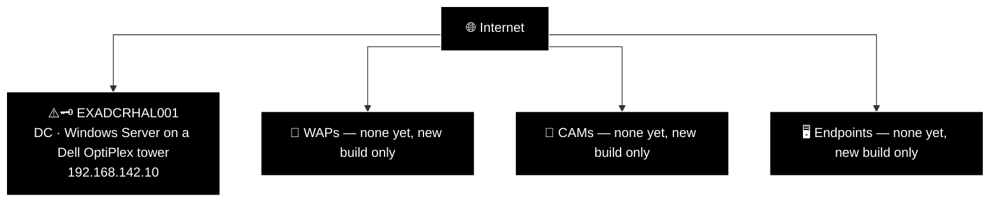
```mermaid
%%{init: {'flowchart': {'curve': 'stepAfter'}}}%%
graph TD
    O_INET["🌐 Internet"]
    O_DC["⚠️🗝️ EXADCRHAL001<br/>DC · Windows Server on a Dell OptiPlex tower<br/>192.168.142.10"]
    O_INET --> O_DC

    O_WAP["📶 WAPs — none yet, new build only"]
    O_CAM["🎥 CAMs — none yet, new build only"]
    O_EP["🖥️ Endpoints — none yet, new build only"]
    O_INET --> O_WAP
    O_INET --> O_CAM
    O_INET --> O_EP

    style O_INET fill:#000000,stroke:#FFFFFF,color:#FFFFFF
    style O_DC fill:#000000,stroke:#FFFFFF,color:#FFFFFF
    style O_WAP fill:#000000,stroke:#FFFFFF,color:#FFFFFF
    style O_CAM fill:#000000,stroke:#FFFFFF,color:#FFFFFF
    style O_EP fill:#000000,stroke:#FFFFFF,color:#FFFFFF
```

Original hand-maintained Old Network box (pre-restyle, kept for reference during prototype review)

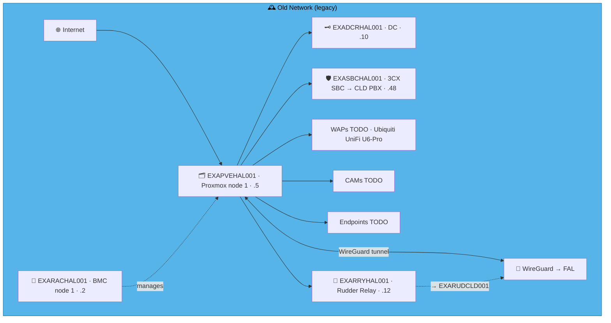
```mermaid
graph TD
    subgraph OLD_HAL ["🕰️ Old Network (legacy)"]
      INET["🌐 Internet"]
      RAC["🔧 EXARACHAL001 · BMC node 1 · .2"]
      PVE["🗂️ EXAPVEHAL001 · Proxmox node 1 · .5"]
      DC["🗝️ EXADCRHAL001 · DC · .10"]
      SBC["🛡️ EXASBCHAL001 · 3CX SBC → CLD PBX · .48"]
      RRY["🔁 EXARRYHAL001 · Rudder Relay · .12"]
      WAP["WAPs TODO · Ubiquiti UniFi U6-Pro"]
      CAM["CAMs TODO"]
      EP["Endpoints TODO"]
      VPN["🔗 WireGuard → FAL"]

      INET --> PVE --> DC & SBC
      RAC -.->|"manages"| PVE
      PVE --> WAP & CAM & EP
      PVE <-->|"WireGuard tunnel"| VPN

      PVE --> RRY
      RRY -. "→ EXARUDCLD001" .-> VPN
    end
    style OLD_HAL fill:#56B4E9,stroke:#0072B2,color:#000000
```

### 🗺️ Topology sketch (generated — see benarbejde/generate_network_diagrams.py)

```mermaid
%% GENERATED:TOPOLOGY:HAL:START
%%{init: {'flowchart': {'curve': 'stepAfter'}}}%%
graph TD
    T_VRK["☁️ VRK — vRACK, 192.168.139.0/24"]
    T_RTR["📡 EXARTRHAL001<br/>RTR<br/>192.168.142.1"]
    T_VRK --> T_RTR
    T_BMC["🔧 EXABMCHAL001<br/>BMC 1<br/>192.168.142.2"]
    T_RTR --> T_BMC
    T_PVE["🗂️ EXAPVEHAL001<br/>PVE 1<br/>192.168.142.5"]
    T_RTR --> T_PVE
    T_SWI["🔀 EXASWIHAL001<br/>SWI 1<br/>192.168.142.250"]
    T_RTR --> T_SWI
    T_SWI2["🔀 EXASWIHAL002<br/>SWI 2<br/>192.168.142.251"]
    T_RTR --> T_SWI2
    T_SWI3["🔀 EXASWIHAL003<br/>SWI 3<br/>192.168.142.252"]
    T_RTR --> T_SWI3
    T_NAS["🗃️ EXANASHAL001<br/>NAS<br/>192.168.142.19"]
    T_RDR["🔐 EXARDRHAL001<br/>RDR<br/>192.168.142.21"]
    T_WAP["📶 EXAWAPHAL001<br/>WAP 1<br/>192.168.142.82"]
    T_SWI --> T_NAS --> T_RDR --> T_WAP
    T_DCS["🗝️ EXADCSHAL001<br/>DCS 1<br/>192.168.142.10"]
    T_SBC["🛡️ EXASBCHAL001<br/>SBC<br/>192.168.142.48"]
    T_FWL["🧱 EXAFWLHAL001<br/>LAN Face<br/>192.168.142.253"]
    T_PVE --> T_DCS --> T_SBC --> T_FWL
    style T_VRK fill:#000000,stroke:#FFFFFF,color:#FFFFFF
    style T_RTR fill:#000000,stroke:#FFFFFF,color:#FFFFFF
    style T_BMC fill:#000000,stroke:#FFFFFF,color:#FFFFFF
    style T_PVE fill:#000000,stroke:#FFFFFF,color:#FFFFFF
    style T_SWI fill:#000000,stroke:#FFFFFF,color:#FFFFFF
    style T_SWI2 fill:#000000,stroke:#FFFFFF,color:#FFFFFF
    style T_SWI3 fill:#000000,stroke:#FFFFFF,color:#FFFFFF
    style T_NAS fill:#000000,stroke:#FFFFFF,color:#FFFFFF
    style T_RDR fill:#000000,stroke:#FFFFFF,color:#FFFFFF
    style T_WAP fill:#000000,stroke:#FFFFFF,color:#FFFFFF
    style T_DCS fill:#000000,stroke:#FFFFFF,color:#FFFFFF
    style T_SBC fill:#000000,stroke:#FFFFFF,color:#FFFFFF
    style T_FWL fill:#000000,stroke:#FFFFFF,color:#FFFFFF
%% GENERATED:TOPOLOGY:HAL:END
```

---

## HUL — Hull 🎣

**LAN:** `192.168.148.0/24` · **Domain:** `example.net`  
**PVE nodes:** 1 · **VPN parent:** FAL  
**Entity:** Example Music (England) Ltd · **Landline:** +44 1482 300 0xxx · **Mobile:** +44 7700 902 2xxx

### 🕰️ Old Network (legacy, hand restyled — prototype, not yet generated)

> **Corrected against Robert's real facts, 2026-07-31.** Same shape as SHE/HAL: nothing built, no
> hypervisor, no real BMC (`EXARACHUL001` removed). `EXADCRHUL001` was another OptiPlex special.
> WAP/CAM/Endpoints all confirmed genuinely never-installed.

> 🚨 **Migration priority — Tier 4.** Hardware inadequate from the outset (consumer OptiPlex
> tower) — no in-place remediation possible. A new `EXADCRHUL001` build promotes and replicates
> against `EXADCSCLD001` (`ansible/playbooks/windows_dc/`) on proper server hardware.

```mermaid
%%{init: {'flowchart': {'curve': 'stepAfter'}}}%%
graph TD
    O_INET["🌐 Internet"]
    O_DC["⚠️🗝️ EXADCRHUL001<br/>DC · Windows Server on a Dell OptiPlex tower<br/>192.168.148.10"]
    O_INET --> O_DC

    O_WAP["📶 WAPs — none yet, new build only"]
    O_CAM["🎥 CAMs — none yet, new build only"]
    O_EP["🖥️ Endpoints — none yet, new build only"]
    O_INET --> O_WAP
    O_INET --> O_CAM
    O_INET --> O_EP

    style O_INET fill:#000000,stroke:#FFFFFF,color:#FFFFFF
    style O_DC fill:#000000,stroke:#FFFFFF,color:#FFFFFF
    style O_WAP fill:#000000,stroke:#FFFFFF,color:#FFFFFF
    style O_CAM fill:#000000,stroke:#FFFFFF,color:#FFFFFF
    style O_EP fill:#000000,stroke:#FFFFFF,color:#FFFFFF
```

Original hand-maintained Old Network box (pre-restyle, kept for reference during prototype review)

```mermaid
graph TD
    subgraph OLD_HUL ["🕰️ Old Network (legacy)"]
      INET["🌐 Internet"]
      RAC["🔧 EXARACHUL001 · BMC node 1 · .2"]
      PVE["🗂️ EXAPVEHUL001 · Proxmox node 1 · .5"]
      DC["🗝️ EXADCRHUL001 · DC · .10"]
      SBC["🛡️ EXASBCHUL001 · 3CX SBC → CLD PBX · .48"]
      RRY["🔁 EXARRYHUL001 · Rudder Relay · .12"]
      WAP["WAPs TODO · Ubiquiti UniFi U6-Pro"]
      CAM["CAMs TODO"]
      EP["Endpoints TODO"]
      VPN["🔗 WireGuard → FAL"]

      INET --> PVE --> DC & SBC
      RAC -.->|"manages"| PVE
      PVE --> WAP & CAM & EP
      PVE <-->|"WireGuard tunnel"| VPN

      PVE --> RRY
      RRY -. "→ EXARUDCLD001" .-> VPN
    end
    style OLD_HUL fill:#56B4E9,stroke:#0072B2,color:#000000
```

### 🗺️ Topology sketch (generated — see benarbejde/generate_network_diagrams.py)

```mermaid
%% GENERATED:TOPOLOGY:HUL:START
%%{init: {'flowchart': {'curve': 'stepAfter'}}}%%
graph TD
    T_VRK["☁️ VRK — vRACK, 192.168.139.0/24"]
    T_RTR["📡 EXARTRHUL001<br/>RTR<br/>192.168.148.1"]
    T_VRK --> T_RTR
    T_BMC["🔧 EXABMCHUL001<br/>BMC 1<br/>192.168.148.2"]
    T_RTR --> T_BMC
    T_PVE["🗂️ EXAPVEHUL001<br/>PVE 1<br/>192.168.148.5"]
    T_RTR --> T_PVE
    T_SWI["🔀 EXASWIHUL001<br/>SWI 1<br/>192.168.148.250"]
    T_RTR --> T_SWI
    T_SWI2["🔀 EXASWIHUL002<br/>SWI 2<br/>192.168.148.251"]
    T_RTR --> T_SWI2
    T_SWI3["🔀 EXASWIHUL003<br/>SWI 3<br/>192.168.148.252"]
    T_RTR --> T_SWI3
    T_NAS["🗃️ EXANASHUL001<br/>NAS<br/>192.168.148.19"]
    T_RDR["🔐 EXARDRHUL001<br/>RDR<br/>192.168.148.21"]
    T_WAP["📶 EXAWAPHUL001<br/>WAP 1<br/>192.168.148.82"]
    T_SWI --> T_NAS --> T_RDR --> T_WAP
    T_DCS["🗝️ EXADCSHUL001<br/>DCS 1<br/>192.168.148.10"]
    T_SBC["🛡️ EXASBCHUL001<br/>SBC<br/>192.168.148.48"]
    T_FWL["🧱 EXAFWLHUL001<br/>LAN Face<br/>192.168.148.253"]
    T_PVE --> T_DCS --> T_SBC --> T_FWL
    style T_VRK fill:#000000,stroke:#FFFFFF,color:#FFFFFF
    style T_RTR fill:#000000,stroke:#FFFFFF,color:#FFFFFF
    style T_BMC fill:#000000,stroke:#FFFFFF,color:#FFFFFF
    style T_PVE fill:#000000,stroke:#FFFFFF,color:#FFFFFF
    style T_SWI fill:#000000,stroke:#FFFFFF,color:#FFFFFF
    style T_SWI2 fill:#000000,stroke:#FFFFFF,color:#FFFFFF
    style T_SWI3 fill:#000000,stroke:#FFFFFF,color:#FFFFFF
    style T_NAS fill:#000000,stroke:#FFFFFF,color:#FFFFFF
    style T_RDR fill:#000000,stroke:#FFFFFF,color:#FFFFFF
    style T_WAP fill:#000000,stroke:#FFFFFF,color:#FFFFFF
    style T_DCS fill:#000000,stroke:#FFFFFF,color:#FFFFFF
    style T_SBC fill:#000000,stroke:#FFFFFF,color:#FFFFFF
    style T_FWL fill:#000000,stroke:#FFFFFF,color:#FFFFFF
%% GENERATED:TOPOLOGY:HUL:END
```

---

## COV — Coventry 🐎

**LAN:** `192.168.247.0/24` · **Domain:** `example.net`  
**PVE nodes:** 1 · **VPN parent:** FAL  
*Note: WAP/RTR-only site — minimal infrastructure.*  
**Entity:** Example Music (England) Ltd · **Landline:** +44 247 765 0xxx · **Mobile:** +44 7700 901 2xxx

### 🕰️ Old Network (legacy, machine-generated from devices.csv/legacy-devices.csv)

> **Corrected against Robert's real facts, 2026-07-31.** Robert: "COV only had a WAP/RTR
> initially" — confirms the page's own "WAP/RTR-only site" note over the box's own fuller
> content. No hypervisor, no BMC, no DC, no SBC ever existed here — all removed, along with the
> standing `RRY`/WireGuard corrections. WAP (×2) confirmed genuinely real, kept as-is.

```mermaid
%% GENERATED:OLDNETWORK:COV:START
%%{init: {'flowchart': {'curve': 'stepAfter'}}}%%
graph TD
    O_INET["🌐 Internet"]
    O_RTR["📡 EXARTRCOV001<br/>Cisco ISR 4331 · WAN edge no server infra<br/>192.168.247.1"]
    O_INET --> O_RTR

    style O_INET fill:#000000,stroke:#FFFFFF,color:#FFFFFF
    style O_RTR fill:#000000,stroke:#FFFFFF,color:#FFFFFF
%% GENERATED:OLDNETWORK:COV:END
```

Original hand-maintained Old Network box (pre-restyle, kept for reference during prototype review)

```mermaid
graph TD
    subgraph OLD_COV ["🕰️ Old Network (legacy)"]
      INET["🌐 Internet"]
      RTR["📡 EXARTRCOV001 · Cisco ISR 4331 · .254"]
      RAC["🔧 EXARACCOV001 · BMC node 1 · .2"]
      PVE["🗂️ EXAPVECOV001 · Proxmox node 1 · .5"]
      DC["🗝️ EXADCSCOV001 · DC · .10"]
      SBC["🛡️ EXASBCCOV001 · 3CX SBC → CLD PBX · .48"]
      RRY["🔁 EXARRYCOV001 · Rudder Relay · .12"]
      WAP["WAPs x2 · Ubiquiti UniFi U6-Pro"]
      CAM["CAMs TODO"]
      VPN["🔗 WireGuard → FAL"]

      INET --> RTR --> PVE --> DC & SBC
      RAC -.->|"manages"| PVE
      RTR --> WAP & CAM
      RTR <-->|"WireGuard tunnel"| VPN

      PVE --> RRY
      RRY -. "→ EXARUDCLD001" .-> VPN
    end
    style OLD_COV fill:#56B4E9,stroke:#0072B2,color:#000000
```

### 🗺️ Topology sketch (generated — see benarbejde/generate_network_diagrams.py)

```mermaid
%% GENERATED:TOPOLOGY:COV:START
%%{init: {'flowchart': {'curve': 'stepAfter'}}}%%
graph TD
    T_VRK["☁️ VRK — vRACK, 192.168.139.0/24"]
    T_RTR["📡 EXARTRCOV001<br/>RTR<br/>192.168.247.1"]
    T_VRK --> T_RTR
    T_BMC["🔧 EXABMCCOV001<br/>BMC 1<br/>192.168.247.2"]
    T_RTR --> T_BMC
    T_PVE["🗂️ EXAPVECOV001<br/>PVE 1<br/>192.168.247.5"]
    T_RTR --> T_PVE
    T_SWI["🔀 EXASWICOV001<br/>SWI 1<br/>192.168.247.250"]
    T_RTR --> T_SWI
    T_SWI2["🔀 EXASWICOV002<br/>SWI 2<br/>192.168.247.251"]
    T_RTR --> T_SWI2
    T_SWI3["🔀 EXASWICOV003<br/>SWI 3<br/>192.168.247.252"]
    T_RTR --> T_SWI3
    T_NAS["🗃️ EXANASCOV001<br/>NAS<br/>192.168.247.19"]
    T_RDR["🔐 EXARDRCOV001<br/>RDR<br/>192.168.247.21"]
    T_WAP["📶 EXAWAPCOV001<br/>WAP 1<br/>192.168.247.82"]
    T_WAP2["📶 EXAWAPCOV002<br/>Wireless Access Point<br/>192.168.247.83"]
    T_SWI --> T_NAS --> T_RDR --> T_WAP --> T_WAP2
    T_DCS["🗝️ EXADCSCOV001<br/>DCS 1<br/>192.168.247.10"]
    T_SBC["🛡️ EXASBCCOV001<br/>SBC<br/>192.168.247.48"]
    T_FWL["🧱 EXAFWLCOV001<br/>LAN Face<br/>192.168.247.253"]
    T_PVE --> T_DCS --> T_SBC --> T_FWL
    style T_VRK fill:#000000,stroke:#FFFFFF,color:#FFFFFF
    style T_RTR fill:#000000,stroke:#FFFFFF,color:#FFFFFF
    style T_BMC fill:#000000,stroke:#FFFFFF,color:#FFFFFF
    style T_PVE fill:#000000,stroke:#FFFFFF,color:#FFFFFF
    style T_SWI fill:#000000,stroke:#FFFFFF,color:#FFFFFF
    style T_SWI2 fill:#000000,stroke:#FFFFFF,color:#FFFFFF
    style T_SWI3 fill:#000000,stroke:#FFFFFF,color:#FFFFFF
    style T_NAS fill:#000000,stroke:#FFFFFF,color:#FFFFFF
    style T_RDR fill:#000000,stroke:#FFFFFF,color:#FFFFFF
    style T_WAP fill:#000000,stroke:#FFFFFF,color:#FFFFFF
    style T_WAP2 fill:#000000,stroke:#FFFFFF,color:#FFFFFF
    style T_DCS fill:#000000,stroke:#FFFFFF,color:#FFFFFF
    style T_SBC fill:#000000,stroke:#FFFFFF,color:#FFFFFF
    style T_FWL fill:#000000,stroke:#FFFFFF,color:#FFFFFF
%% GENERATED:TOPOLOGY:COV:END
```
