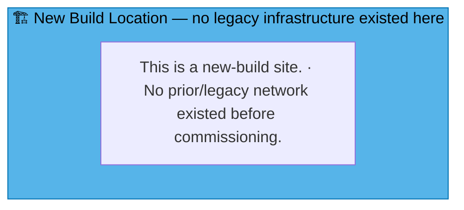
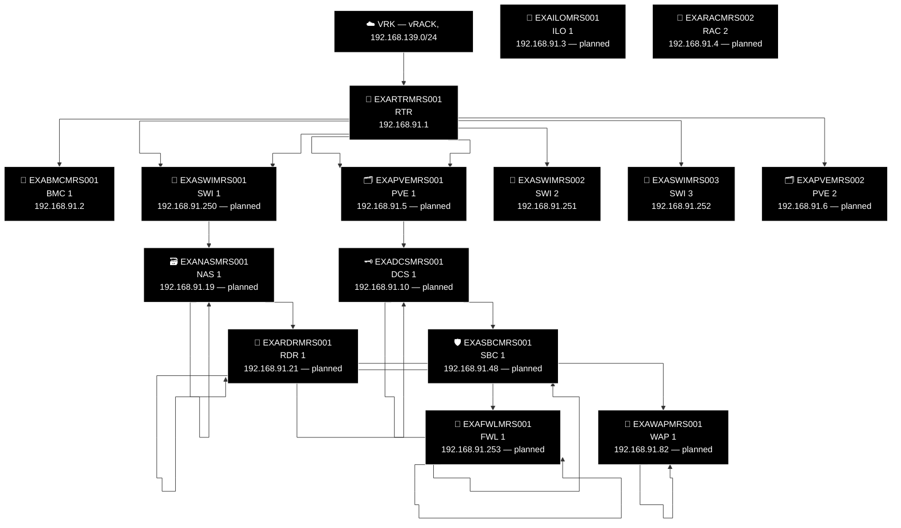

# Example Music Limited — France Network Diagrams

> **Classification:** Internal — Infrastructure
> **Part of:** [`../network-diagram.md`](../network-diagram.md) — see there for the Visual
> Standard (shape/colour/emoji convention), the full emoji legend, and links to every other
> region.

---

## MRS — Marseille ⚓

**LAN:** `192.168.91.0/24` · **Domain:** `jukebox.internal`
**PVE nodes:** 1 (reserved — see notes below) · **VPN parent:** ODE
**Entity:** Example Music (France) SARL · **Landline:** +33 4 91 555 0xxx · **Mobile:** +33 6 91 555 2xxx

> **New-build site, added 2026-10-08** — zero real `devices.csv` rows exist yet (standard
> boilerplate only, all `Planned=yes`, via `check_new_site_boilerplate.py --apply MRS`). Same
> "New Build Location" placeholder pattern used for AMS/FRD/NYB/SEA/SFO/FRE/DRS/DUS/GOT/OSL.

### 🗺️ Topology sketch (generated — see benarbejde/generate_network_diagrams.py)

