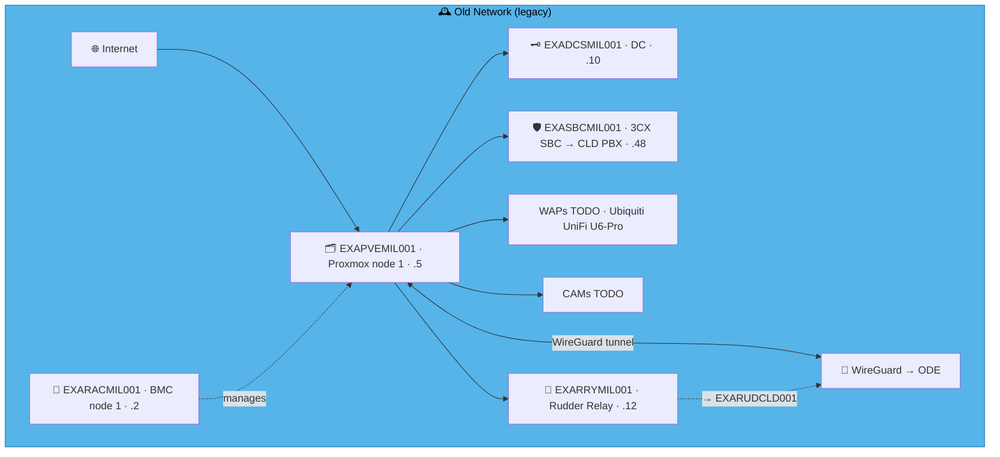
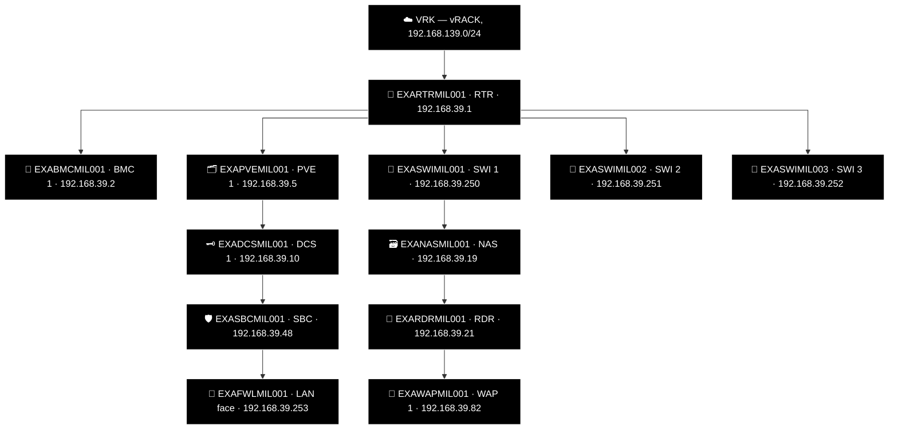

# Example Music Limited — Italia Network Diagrams

> **Classification:** Internal — Infrastructure
> **Part of:** [`../network-diagram.md`](../network-diagram.md) — see there for the Visual
> Standard (shape/colour/emoji convention), the full emoji legend, and links to every other
> region.

---

## MIL — Milan 👔

**LAN:** `192.168.39.0/24` · **Domain:** `example.net`  
**PVE nodes:** 1 · **VPN parent:** ODE  
**Entity:** Example Music (Italia) S.p.a. · **Landline:** N/A · **Mobile:** N/A

### 🗺️ Topology sketch (generated — see benarbejde/generate_network_diagrams.py)

