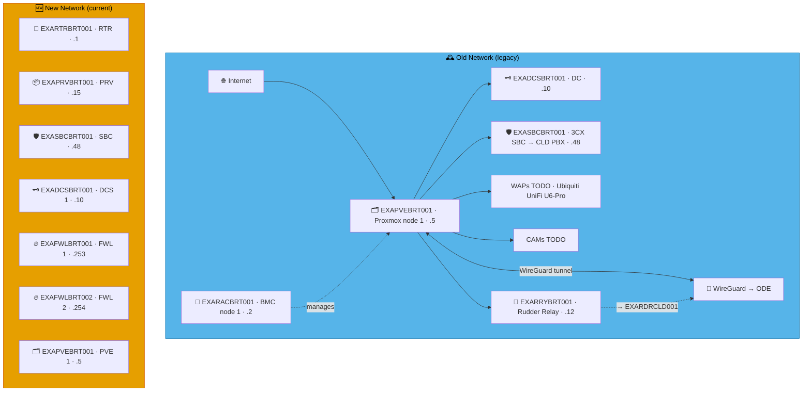

# Example Music Limited — Lebanon Network Diagrams

> **Classification:** Internal — Infrastructure
> **Part of:** [`../network-diagram.md`](../network-diagram.md) — see there for the Visual
> Standard (shape/colour/emoji convention), the full emoji legend, and links to every other
> region.

---

## BRT — Beirut

**LAN:** `192.168.169.0/24` · **Domain:** `example.net`  
**PVE nodes:** 1 · **VPN parent:** ODE  
**Entity:** Example Music (Lebanon) SAL · **Landline:** +961 1 555 xxxx · **Mobile:** +961 3 555 xxxx

