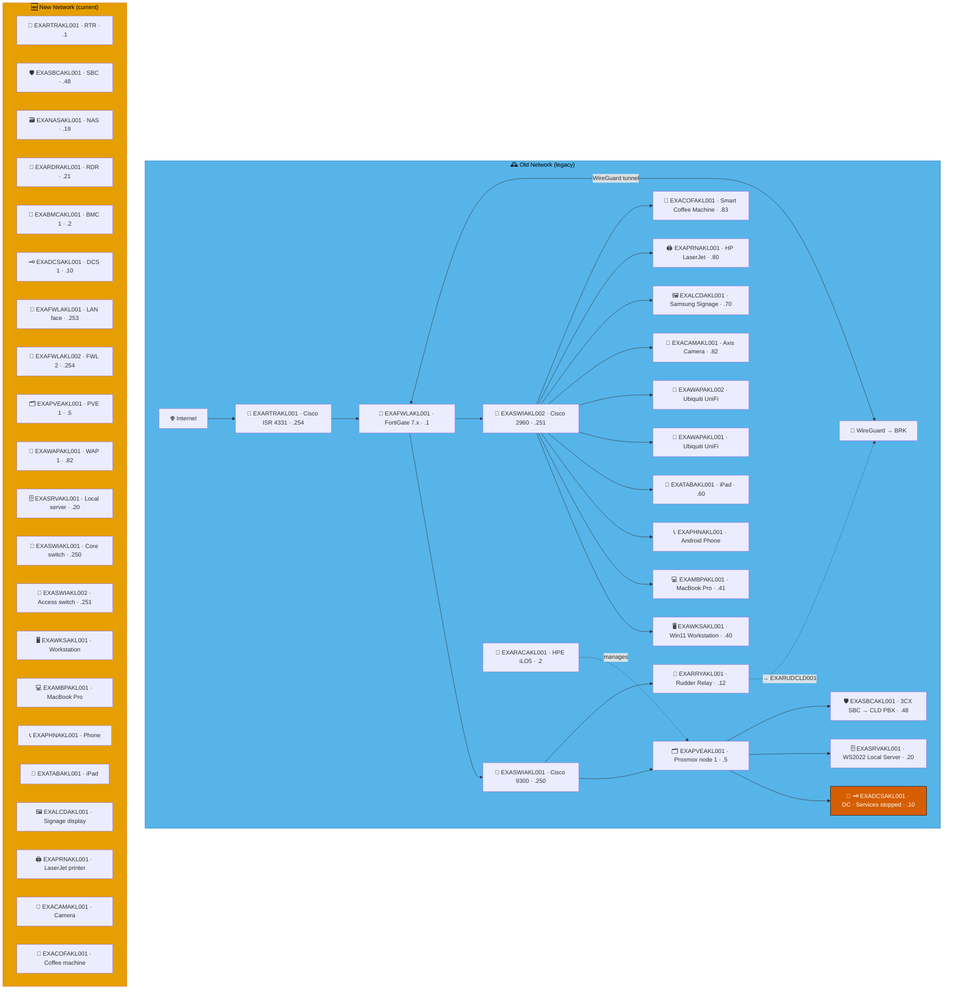

# Example Music Limited — New Zealand Network Diagrams

> **Classification:** Internal — Infrastructure
> **Part of:** [`../network-diagram.md`](../network-diagram.md) — see there for the Visual
> Standard (shape/colour/emoji convention), the full emoji legend, and links to every other
> region.

---

## AKL — Auckland ⚠️ ⛵

**LAN:** `192.168.93.0/24` · **Domain:** `example.net`  
**PVE nodes:** 1 · **VPN parent:** BRK  
> ⚠️ `EXADCSAKL001` — DNS, Netlogon and KDC services stopped.  
**Entity:** Example Music (New Zealand) Tapui · **Landline:** +64 9 300 0xxx · **Mobile:** +64 21 900 2xxx

---

*Example Music Limited — Internal Infrastructure Documentation*   *Do not distribute outside the organisation*cloud
