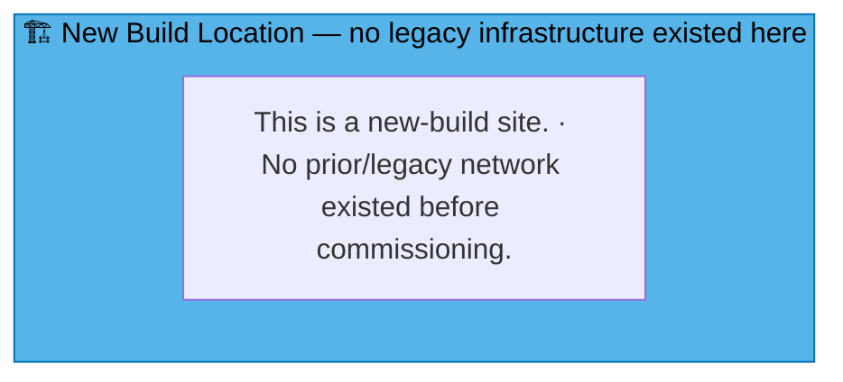
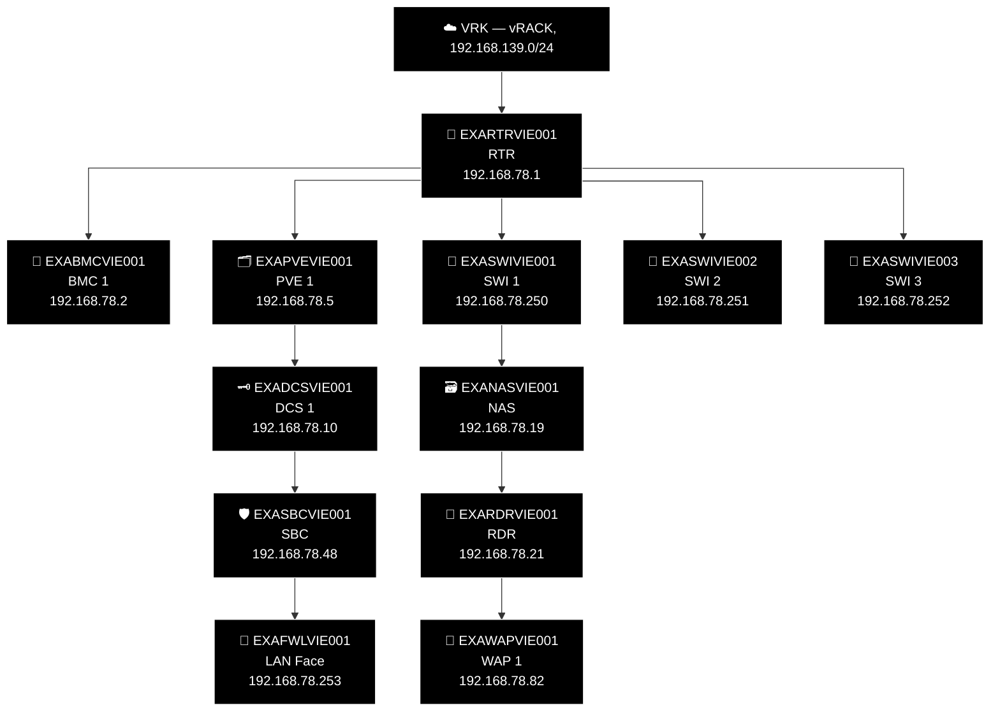

# Example Music Limited — Österreich Network Diagrams

> **Classification:** Internal — Infrastructure
> **Part of:** [`../network-diagram.md`](../network-diagram.md) — see there for the Visual
> Standard (shape/colour/emoji convention), the full emoji legend, and links to every other
> region.

---

## VIE — Vienna 🎻

**LAN:** `192.168.78.0/24` · **Domain:** `example.net`  
**PVE nodes:** 1 (reserved — see notes below) · **VPN parent:** ODE  
**Entity:** Example Music (Osterreich) GmbH · **Landline:** +43 800 078 0xx · **Mobile:** +43 664 665 xxx

> **New-build site — corrected 2026-07-31.** The previous "Old Network" box here was entirely
> fabricated template content — zero real `devices.csv` rows exist for VIE, and Robert confirmed
> it's an expansion office. Converted to the same "New Build Location" placeholder pattern used
> for FRD/NYB/SEA/SFO/FRE/DRS/DUS/GOT/OSL/AMS/MIL.

### 🗺️ Topology sketch (generated — see benarbejde/generate_network_diagrams.py)

