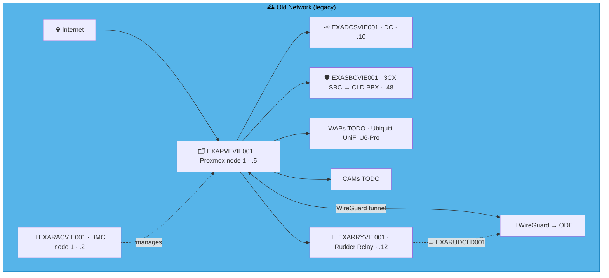
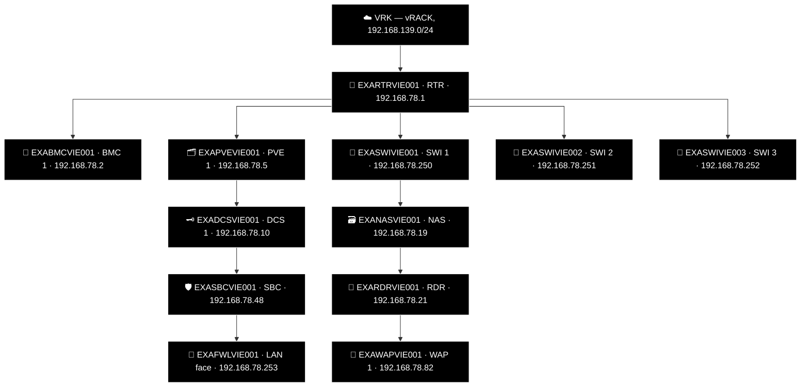

# Example Music Limited — Österreich Network Diagrams

> **Classification:** Internal — Infrastructure
> **Part of:** [`../network-diagram.md`](../network-diagram.md) — see there for the Visual
> Standard (shape/colour/emoji convention), the full emoji legend, and links to every other
> region.

---

## VIE — Vienna 🎻

**LAN:** `192.168.78.0/24` · **Domain:** `example.net`  
**PVE nodes:** 1 · **VPN parent:** ODE  
**Entity:** Example Music (Osterreich) GmbH · **Landline:** +43 800 078 0xx · **Mobile:** +43 664 665 xxx

### 🗺️ Topology sketch (draft, hand-drawn — not yet generated)

