# Example Music Limited — Scotland Network Diagrams

> **Classification:** Internal — Infrastructure
> **Part of:** [`../network-diagram.md`](../network-diagram.md) — see there for the Visual
> Standard (shape/colour/emoji convention), the full emoji legend, and links to every other
> region.

---

## FAL — Falkirk *(Head Office)* ⭐ 🏛️

**Address:** Brockville Stadium, Hope Street, Falkirk  
**LAN:** `192.168.76.0/24` · **VPN:** `10.0.76.0/24` · **Domain:** `example.net`  
**PVE nodes:** 3 (hub) · **VPN parent:** CLD (primary head node)  
**Entity:** Example Music (Scotland) Ltd · **Landline:** +44 1324 500 0xxx · **Mobile:** +44 7700 903 2xxx

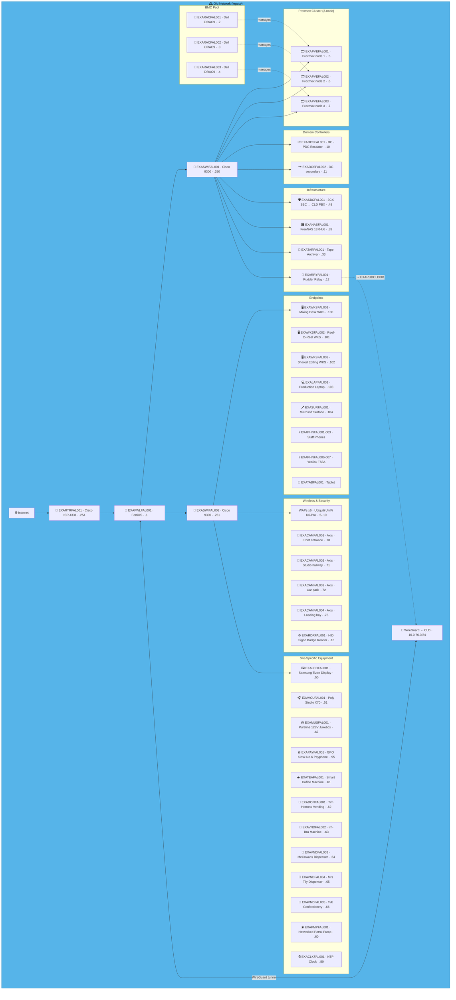

### 🗺️ Topology sketch (generated — see benarbejde/generate_network_diagrams.py)

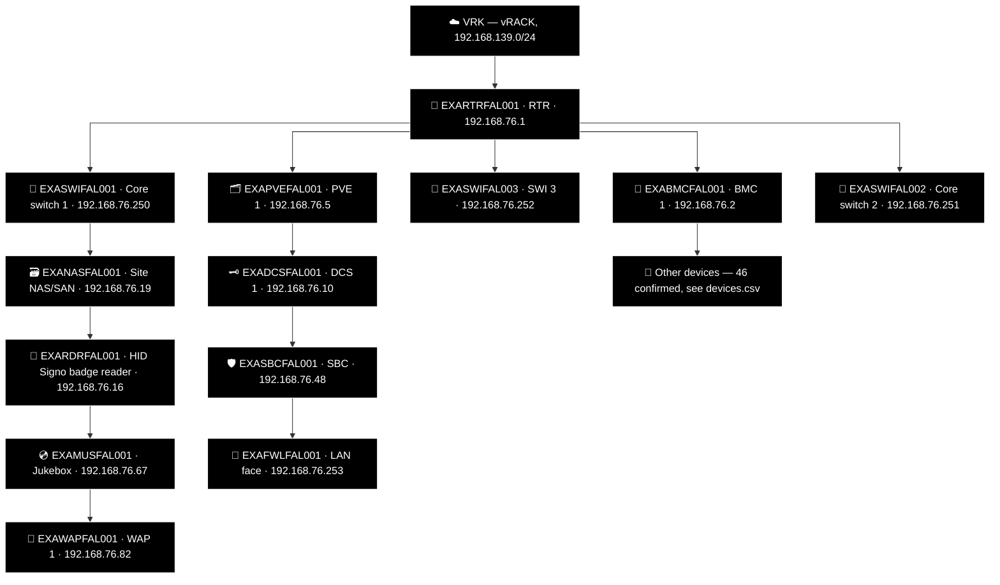

---

## EDI — Edinburgh ⚠️ 🏰

**LAN:** `192.168.131.0/24` · **Domain:** `example.org` / `example.net`  
**PVE nodes:** 1 · **VPN parent:** FAL  
> ⚠️ `EXADCSEDI003` — DFSR stopped, C: drive at 5% free. Immediate action required.  
**Entity:** Example Music (Scotland) Ltd · **Landline:** +44 131 496 0xxx · **Mobile:** +44 770 090 3xxx

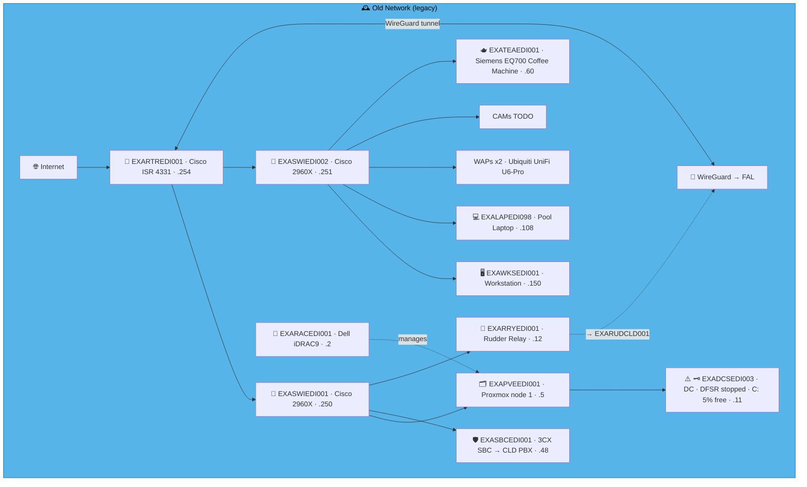

### 🗺️ Topology sketch (generated — see benarbejde/generate_network_diagrams.py)

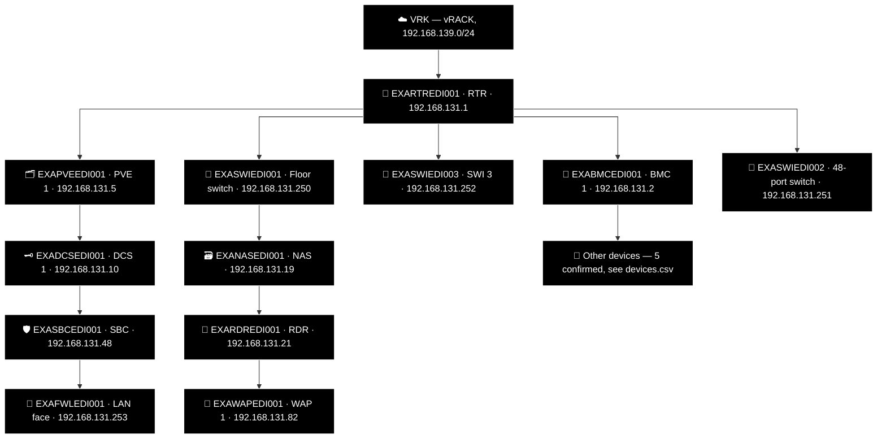

---

## GLA — Glasgow 🚧

**LAN:** `192.168.141.0/24` · **Domain:** `example.net`  
**PVE nodes:** 1 · **VPN parent:** FAL  
**Entity:** Example Music (Scotland) Ltd · **Landline:** +44 141 496 01xx · **Mobile:** +44 770 009 4xxx

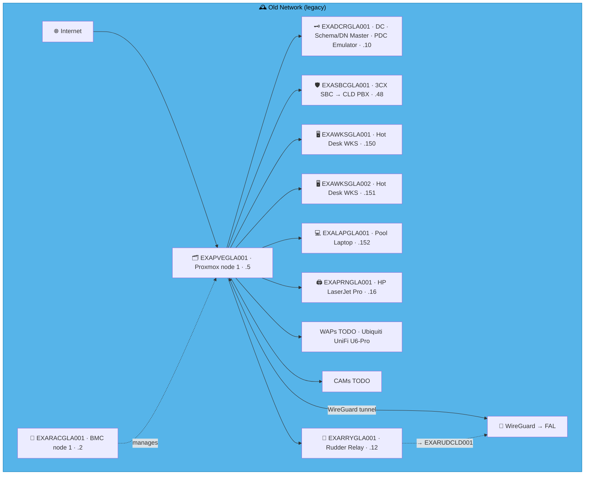

### 🗺️ Topology sketch (generated — see benarbejde/generate_network_diagrams.py)

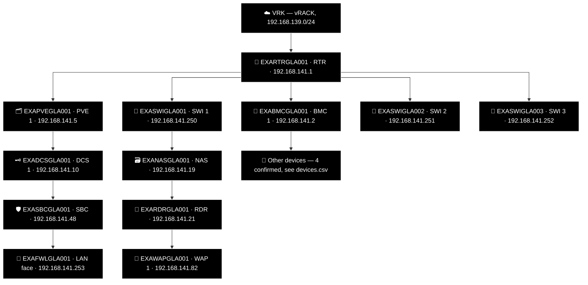

---

## CLY — Clydebank 🚢

**LAN:** `192.168.41.0/24` · **Domain:** `example.net`  
**PVE nodes:** 1 · **VPN parent:** FAL  
**Entity:** Example Music (Scotland) Ltd · **Landline:** +44 141 496 00xx · **Mobile:** +44 770 090 5xxx

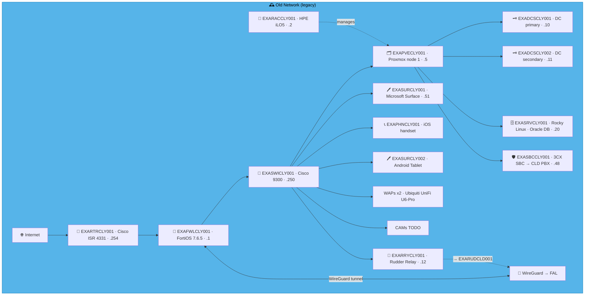

### 🗺️ Topology sketch (generated — see benarbejde/generate_network_diagrams.py)

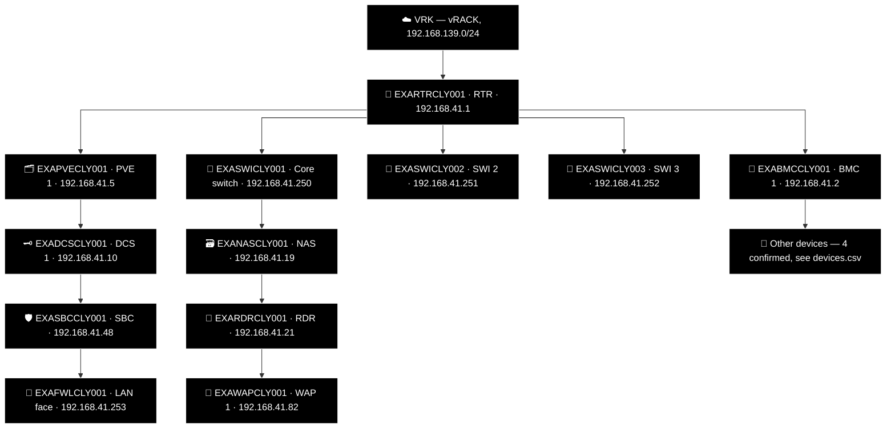

---

## DUN — Dundee 🛳️

**LAN:** `192.168.138.0/24` · **Domain:** `example.net`  
**PVE nodes:** 1 · **VPN parent:** FAL  
**Entity:** Example Music (Scotland) Ltd · **Landline:** +44 163 249 60xx · **Mobile:** +44 770 090 82xx

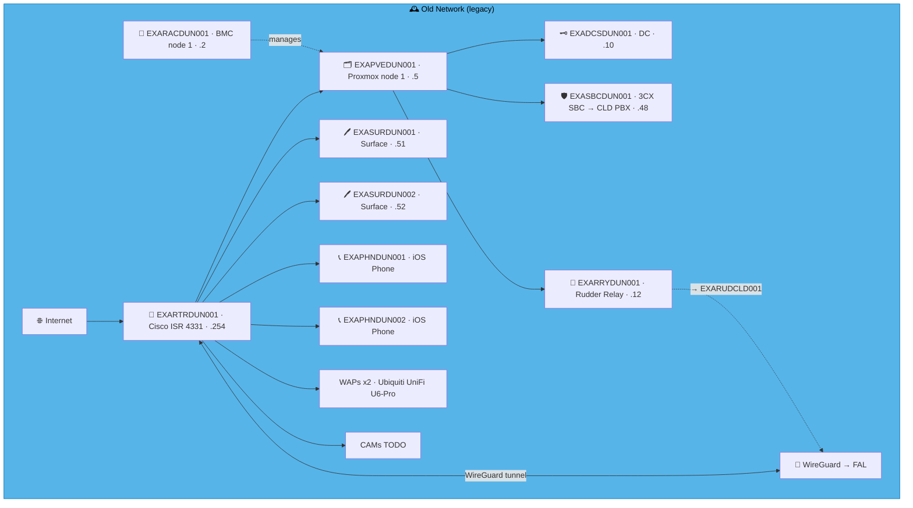

### 🗺️ Topology sketch (generated — see benarbejde/generate_network_diagrams.py)

---

## PER — Perth 👑

**LAN:** `192.168.173.0/24` · **Domain:** `example.net`  
**PVE nodes:** 1 · **VPN parent:** FAL  
**Entity:** Example Music (Scotland) Ltd · **Landline:** +44 173 849 60xx · **Mobile:** +44 770 0173 0xx

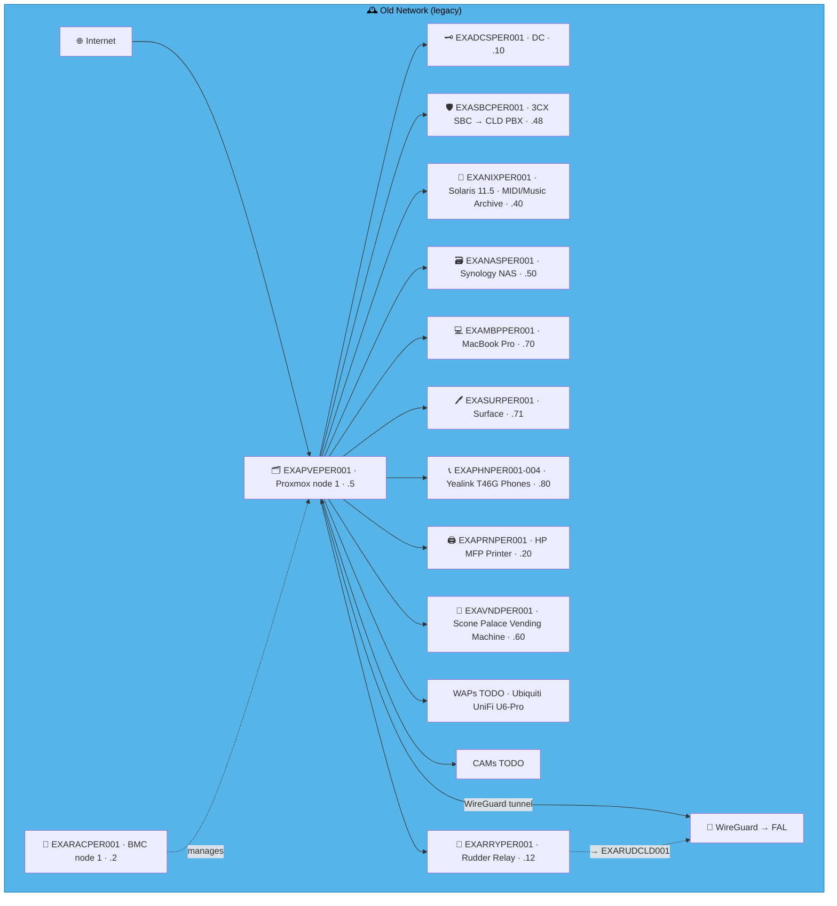

### 🗺️ Topology sketch (generated — see benarbejde/generate_network_diagrams.py)

---

## ABD — Aberdeen 🪨

**LAN:** `192.168.224.0/24` · **Domain:** `example.org`  
**PVE nodes:** 1 · **VPN parent:** FAL  
**Entity:** Example Music (Scotland) Ltd · **Landline:** +44 1224 496 0xxx · **Mobile:** +44 7700 900 2xxx

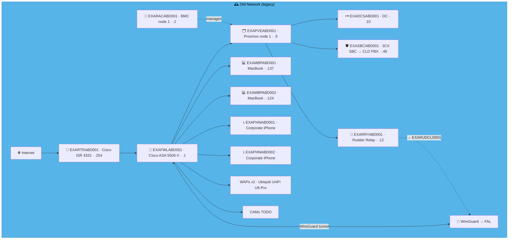

### 🗺️ Topology sketch (generated — see benarbejde/generate_network_diagrams.py)

