# Example Music Limited — Scotland Network Diagrams

> **Classification:** Internal — Infrastructure
> **Part of:** [`../network-diagram.md`](../network-diagram.md) — see there for the Visual
> Standard (shape/colour/emoji convention), the full emoji legend, and links to every other
> region.

---

## FAL — Falkirk *(Head Office)* ⭐ 🏛️

**Address:** Brockville Stadium, Hope Street, Falkirk  
**LAN:** `192.168.76.0/24` · **VPN:** `10.0.76.0/24` · **Domain:** `example.net`  
**PVE nodes:** 3 (hub) · **VPN parent:** CLD (primary head node)  
**Entity:** Example Music (Scotland) Ltd · **Landline:** +44 1324 500 0xxx · **Mobile:** +44 7700 903 2xxx

### 🕰️ Old Network (legacy, hand restyled — prototype, not yet generated)

> **Prototype only** — hand-built to agree the visual convention before generalising into
> `generate_network_diagrams.py`. Right-angle edges, black/white boxes, three-line ` ` labels,
> full IPs, no subgraph nesting (subgraphs clip edges — the same lesson learned building the new
> topology sketches). Devices with genuinely distinct real descriptions (the vending machines,
> phones) are NOT grouped by count the way the new diagram's "Other" bucket is — that grouping
> exists there because synthesized devices.csv Notes are generic/repetitive; these aren't, so
> collapsing them would lose real information. `RDR`'s emoji is now 🔐 (the current
> `role_codes.csv` symbol), not the original box's own ad-hoc ⚙️ — a visual-only change.
>
> **Corrected against Robert's real facts, 2026-07-31** — the original hand-written box (kept
> below for reference) had real content errors, not just style ones, present since this repo's
> initial commit: a 3-node Proxmox cluster + 3x Dell iDRAC9 BMC pool that never existed (real
> legacy hardware was a single HP ML310e running VMware ESXi, `EXAESXFAL001`, managed by a single
> HP iLO, `EXAILOFAL001` — new `ESX` type added to `role_codes.csv`/`docs/emojis/README.md`); an
> SBC implying VOIP that never existed (phones were POTS lines directly on the network, no SBC at
> all); a Rudder Relay that was planned but dropped in favour of Salt and never actually built,
> "never got off the drawing board"; and a WireGuard tunnel to CLD, which is real but **only on
> each site's new infrastructure** — old sites had zero connectivity to each other or to CLD, in
> any form. All four removed/corrected here. This is exactly the kind of drift the harness and a
> known source of truth exist to catch — going through the other 45 sites' boxes the same way,
> one at a time, is the current plan.

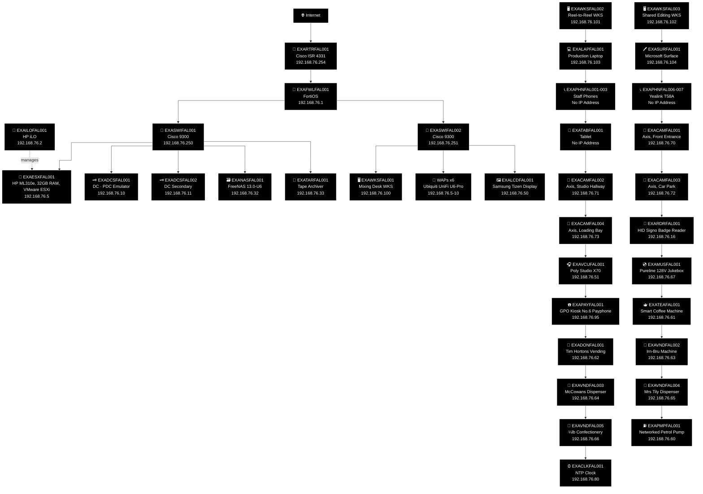
```mermaid
%%{init: {'flowchart': {'curve': 'stepAfter'}}}%%
graph TD
    O_INET["🌐 Internet"]
    O_RTR["📡 EXARTRFAL001<br/>Cisco ISR 4331<br/>192.168.76.254"]
    O_INET --> O_RTR
    O_FWL["🧱 EXAFWLFAL001<br/>FortiOS<br/>192.168.76.1"]
    O_RTR --> O_FWL
    O_SW1["🔀 EXASWIFAL001<br/>Cisco 9300<br/>192.168.76.250"]
    O_SW2["🔀 EXASWIFAL002<br/>Cisco 9300<br/>192.168.76.251"]
    O_FWL --> O_SW1
    O_FWL --> O_SW2

    O_ILO["🔧 EXAILOFAL001<br/>HP iLO<br/>192.168.76.2"]
    O_ESX["💾 EXAESXFAL001<br/>HP ML310e, 32GB RAM, VMware ESXi<br/>192.168.76.5"]
    O_SW1 --> O_ESX
    O_ILO -.->|"manages"| O_ESX

    O_DC1["🗝️ EXADCSFAL001<br/>DC · PDC Emulator<br/>192.168.76.10"]
    O_DC2["🗝️ EXADCSFAL002<br/>DC Secondary<br/>192.168.76.11"]
    O_SW1 --> O_DC1
    O_SW1 --> O_DC2

    O_NAS["🗃️ EXANASFAL001<br/>FreeNAS 13.0-U6<br/>192.168.76.32"]
    O_TAR["💽 EXATARFAL001<br/>Tape Archiver<br/>192.168.76.33"]
    O_SW1 --> O_NAS
    O_SW1 --> O_TAR

    O_WKS1["🖥️ EXAWKSFAL001<br/>Mixing Desk WKS<br/>192.168.76.100"]
    O_WAP["📶 WAPs x6<br/>Ubiquiti UniFi U6-Pro<br/>192.168.76.5-10"]
    O_LCD["🖼️ EXALCDFAL001<br/>Samsung Tizen Display<br/>192.168.76.50"]
    O_SW2 --> O_WKS1
    O_SW2 --> O_WAP
    O_SW2 --> O_LCD

    O_WKS2["🖥️ EXAWKSFAL002<br/>Reel-to-Reel WKS<br/>192.168.76.101"]
    O_LAP["💻 EXALAPFAL001<br/>Production Laptop<br/>192.168.76.103"]
    O_PHN["📞 EXAPHNFAL001-003<br/>Staff Phones<br/>No IP Address"]
    O_TAB["📱 EXATABFAL001<br/>Tablet<br/>No IP Address"]
    O_CAM2["🎥 EXACAMFAL002<br/>Axis, Studio Hallway<br/>192.168.76.71"]
    O_CAM4["🎥 EXACAMFAL004<br/>Axis, Loading Bay<br/>192.168.76.73"]
    O_VCU["🎧 EXAVCUFAL001<br/>Poly Studio X70<br/>192.168.76.51"]
    O_PAY["☎️ EXAPAYFAL001<br/>GPO Kiosk No.6 Payphone<br/>192.168.76.95"]
    O_VND1["🍩 EXADONFAL001<br/>Tim Hortons Vending<br/>192.168.76.62"]
    O_VND3["🍫 EXAVNDFAL003<br/>McCowans Dispenser<br/>192.168.76.64"]
    O_VND5["🍫 EXAVNDFAL005<br/>¼lb Confectionery<br/>192.168.76.66"]
    O_CLK["⏰ EXACLKFAL001<br/>NTP Clock<br/>192.168.76.80"]
    O_WKS2 --> O_LAP --> O_PHN --> O_TAB --> O_CAM2 --> O_CAM4 --> O_VCU --> O_PAY --> O_VND1 --> O_VND3 --> O_VND5 --> O_CLK

    O_WKS3["🖥️ EXAWKSFAL003<br/>Shared Editing WKS<br/>192.168.76.102"]
    O_SUR["🖊️ EXASURFAL001<br/>Microsoft Surface<br/>192.168.76.104"]
    O_PHN2["📞 EXAPHNFAL006-007<br/>Yealink T58A<br/>No IP Address"]
    O_CAM1["🎥 EXACAMFAL001<br/>Axis, Front Entrance<br/>192.168.76.70"]
    O_CAM3["🎥 EXACAMFAL003<br/>Axis, Car Park<br/>192.168.76.72"]
    O_RDR["🔐 EXARDRFAL001<br/>HID Signo Badge Reader<br/>192.168.76.16"]
    O_JKB["💿 EXAMUSFAL001<br/>Pureline 128V Jukebox<br/>192.168.76.67"]
    O_COF["🫖 EXATEAFAL001<br/>Smart Coffee Machine<br/>192.168.76.61"]
    O_VND2["🍫 EXAVNDFAL002<br/>Irn-Bru Machine<br/>192.168.76.63"]
    O_VND4["🍫 EXAVNDFAL004<br/>Mrs Tily Dispenser<br/>192.168.76.65"]
    O_PMP["⛽ EXAPMPFAL001<br/>Networked Petrol Pump<br/>192.168.76.60"]
    O_WKS3 --> O_SUR --> O_PHN2 --> O_CAM1 --> O_CAM3 --> O_RDR --> O_JKB --> O_COF --> O_VND2 --> O_VND4 --> O_PMP

    style O_INET fill:#000000,stroke:#FFFFFF,color:#FFFFFF
    style O_RTR fill:#000000,stroke:#FFFFFF,color:#FFFFFF
    style O_FWL fill:#000000,stroke:#FFFFFF,color:#FFFFFF
    style O_SW1 fill:#000000,stroke:#FFFFFF,color:#FFFFFF
    style O_SW2 fill:#000000,stroke:#FFFFFF,color:#FFFFFF
    style O_ILO fill:#000000,stroke:#FFFFFF,color:#FFFFFF
    style O_ESX fill:#000000,stroke:#FFFFFF,color:#FFFFFF
    style O_DC1 fill:#000000,stroke:#FFFFFF,color:#FFFFFF
    style O_DC2 fill:#000000,stroke:#FFFFFF,color:#FFFFFF
    style O_NAS fill:#000000,stroke:#FFFFFF,color:#FFFFFF
    style O_TAR fill:#000000,stroke:#FFFFFF,color:#FFFFFF
    style O_WKS1 fill:#000000,stroke:#FFFFFF,color:#FFFFFF
    style O_WAP fill:#000000,stroke:#FFFFFF,color:#FFFFFF
    style O_LCD fill:#000000,stroke:#FFFFFF,color:#FFFFFF
    style O_WKS2 fill:#000000,stroke:#FFFFFF,color:#FFFFFF
    style O_LAP fill:#000000,stroke:#FFFFFF,color:#FFFFFF
    style O_PHN fill:#000000,stroke:#FFFFFF,color:#FFFFFF
    style O_TAB fill:#000000,stroke:#FFFFFF,color:#FFFFFF
    style O_CAM2 fill:#000000,stroke:#FFFFFF,color:#FFFFFF
    style O_CAM4 fill:#000000,stroke:#FFFFFF,color:#FFFFFF
    style O_VCU fill:#000000,stroke:#FFFFFF,color:#FFFFFF
    style O_PAY fill:#000000,stroke:#FFFFFF,color:#FFFFFF
    style O_VND1 fill:#000000,stroke:#FFFFFF,color:#FFFFFF
    style O_VND3 fill:#000000,stroke:#FFFFFF,color:#FFFFFF
    style O_VND5 fill:#000000,stroke:#FFFFFF,color:#FFFFFF
    style O_CLK fill:#000000,stroke:#FFFFFF,color:#FFFFFF
    style O_WKS3 fill:#000000,stroke:#FFFFFF,color:#FFFFFF
    style O_SUR fill:#000000,stroke:#FFFFFF,color:#FFFFFF
    style O_PHN2 fill:#000000,stroke:#FFFFFF,color:#FFFFFF
    style O_CAM1 fill:#000000,stroke:#FFFFFF,color:#FFFFFF
    style O_CAM3 fill:#000000,stroke:#FFFFFF,color:#FFFFFF
    style O_RDR fill:#000000,stroke:#FFFFFF,color:#FFFFFF
    style O_JKB fill:#000000,stroke:#FFFFFF,color:#FFFFFF
    style O_COF fill:#000000,stroke:#FFFFFF,color:#FFFFFF
    style O_VND2 fill:#000000,stroke:#FFFFFF,color:#FFFFFF
    style O_VND4 fill:#000000,stroke:#FFFFFF,color:#FFFFFF
    style O_PMP fill:#000000,stroke:#FFFFFF,color:#FFFFFF
```

Original hand-maintained Old Network box (pre-restyle, kept for reference during prototype review)

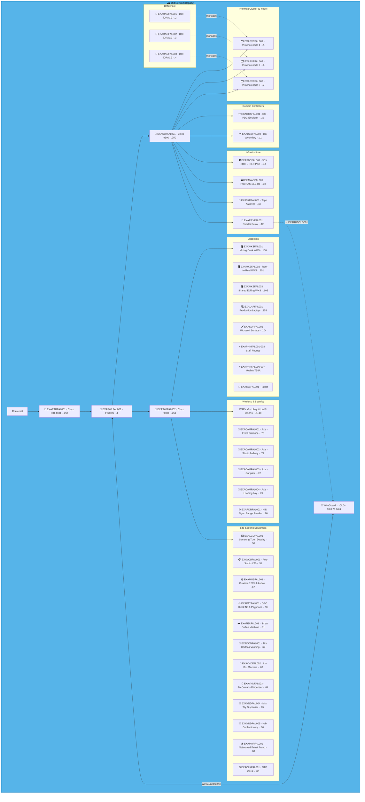
```mermaid
graph TD
    subgraph OLD_FAL ["🕰️ Old Network (legacy)"]
      INET["🌐 Internet"]
      RTR["📡 EXARTRFAL001 · Cisco ISR 4331 · .254"]
      FWL["🧱 EXAFWLFAL001 · FortiOS · .1"]
      SW1["🔀 EXASWIFAL001 · Cisco 9300 · .250"]
      SW2["🔀 EXASWIFAL002 · Cisco 9300 · .251"]

      subgraph BMC ["BMC Pool"]
          RAC1["🔧 EXARACFAL001 · Dell iDRAC9 · .2"]
          RAC2["🔧 EXARACFAL002 · Dell iDRAC9 · .3"]
          RAC3["🔧 EXARACFAL003 · Dell iDRAC9 · .4"]
      end

      subgraph PVE ["Proxmox Cluster (3-node)"]
          PVE1["🗂️ EXAPVEFAL001 · Proxmox node 1 · .5"]
          PVE2["🗂️ EXAPVEFAL002 · Proxmox node 2 · .6"]
          PVE3["🗂️ EXAPVEFAL003 · Proxmox node 3 · .7"]
      end

      subgraph DC ["Domain Controllers"]
          DC1["🗝️ EXADCSFAL001 · DC · PDC Emulator · .10"]
          DC2["🗝️ EXADCSFAL002 · DC secondary · .11"]
      end

      subgraph INFRA ["Infrastructure"]
          SBC["🛡️ EXASBCFAL001 · 3CX SBC → CLD PBX · .48"]
          RRY["🔁 EXARRYFAL001 · Rudder Relay · .12"]
          NAS["🗃️ EXANASFAL001 · FreeNAS 13.0-U6 · .32"]
          TAR["💽 EXATARFAL001 · Tape Archiver · .33"]
      end

      subgraph ENDPOINTS ["Endpoints"]
          WKS1["🖥️ EXAWKSFAL001 · Mixing Desk WKS · .100"]
          WKS2["🖥️ EXAWKSFAL002 · Reel-to-Reel WKS · .101"]
          WKS3["🖥️ EXAWKSFAL003 · Shared Editing WKS · .102"]
          LAP["💻 EXALAPFAL001 · Production Laptop · .103"]
          SUR["🖊️ EXASURFAL001 · Microsoft Surface · .104"]
          PHN["📞 EXAPHNFAL001-003 · Staff Phones"]
          PHN2["📞 EXAPHNFAL006-007 · Yealink T58A"]
          TAB["📱 EXATABFAL001 · Tablet"]
      end

      subgraph WAP_CAM ["Wireless & Security"]
          WAP["WAPs x6 · Ubiquiti UniFi U6-Pro · .5-.10"]
          CAM1["🎥 EXACAMFAL001 · Axis · Front entrance · .70"]
          CAM2["🎥 EXACAMFAL002 · Axis · Studio hallway · .71"]
          CAM3["🎥 EXACAMFAL003 · Axis · Car park · .72"]
          CAM4["🎥 EXACAMFAL004 · Axis · Loading bay · .73"]
          RDR["⚙️ EXARDRFAL001 · HID Signo Badge Reader · .16"]
      end

      subgraph SITE ["Site-Specific Equipment"]
          LCD["🖼️ EXALCDFAL001 · Samsung Tizen Display · .50"]
          VCU["🎧 EXAVCUFAL001 · Poly Studio X70 · .51"]
          JKB["💿 EXAMUSFAL001 · Pureline 128V Jukebox · .67"]
          PAY["☎️ EXAPAYFAL001 · GPO Kiosk No.6 Payphone · .95"]
          COF["🫖 EXATEAFAL001 · Smart Coffee Machine · .61"]
          VND1["🍩 EXADONFAL001 · Tim Hortons Vending · .62"]
          VND2["🍫 EXAVNDFAL002 · Irn-Bru Machine · .63"]
          VND3["🍫 EXAVNDFAL003 · McCowans Dispenser · .64"]
          VND4["🍫 EXAVNDFAL004 · Mrs Tily Dispenser · .65"]
          VND5["🍫 EXAVNDFAL005 · ¼lb Confectionery · .66"]
          PMP["⛽ EXAPMPFAL001 · Networked Petrol Pump · .60"]
          CLK["⏰ EXACLKFAL001 · NTP Clock · .80"]
      end

      VPN_CLD["🔗 WireGuard ← CLD · 10.0.76.0/24"]

      INET --> RTR --> FWL --> SW1 & SW2
      SW1 --> PVE1 & PVE2 & PVE3
      SW1 --> DC1 & DC2
      SW1 --> SBC & NAS & TAR
      SW2 --> WKS1
      SW2 --> WAP
      SW2 --> LCD
      RAC1 -.->|"manages"| PVE1
      RAC2 -.->|"manages"| PVE2
      RAC3 -.->|"manages"| PVE3
      FWL <-->|"WireGuard tunnel"| VPN_CLD

      SW1 --> RRY
      RRY -. "→ EXARUDCLD001" .-> VPN_CLD
    end
    style OLD_FAL fill:#56B4E9,stroke:#0072B2,color:#000000
```

### 🗺️ Topology sketch (generated — see benarbejde/generate_network_diagrams.py)

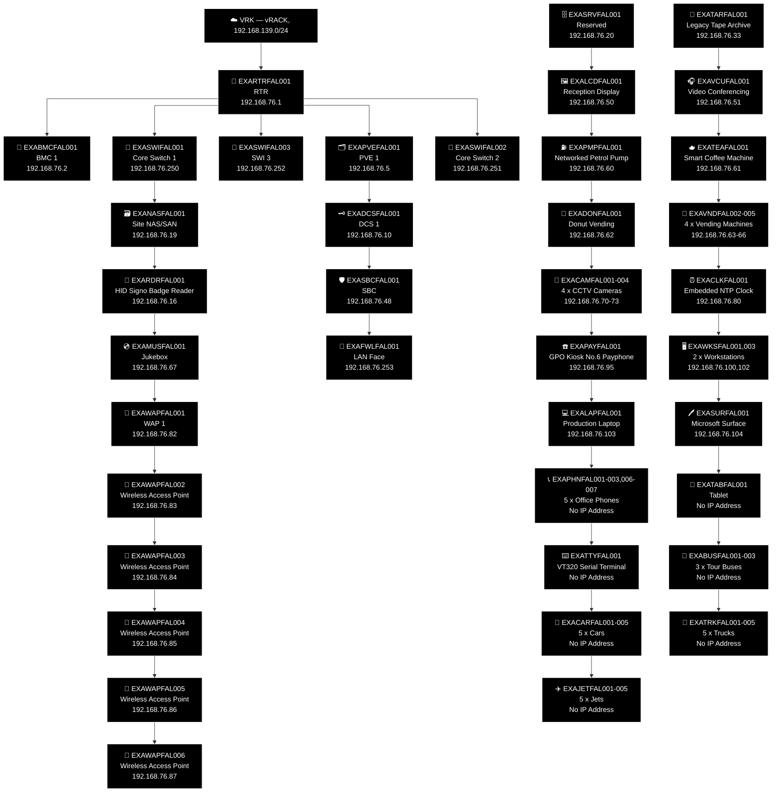
```mermaid
%% GENERATED:TOPOLOGY:FAL:START
%%{init: {'flowchart': {'curve': 'stepAfter'}}}%%
graph TD
    T_VRK["☁️ VRK — vRACK, 192.168.139.0/24"]
    T_RTR["📡 EXARTRFAL001<br/>RTR<br/>192.168.76.1"]
    T_VRK --> T_RTR
    T_BMC["🔧 EXABMCFAL001<br/>BMC 1<br/>192.168.76.2"]
    T_RTR --> T_BMC
    T_PVE["🗂️ EXAPVEFAL001<br/>PVE 1<br/>192.168.76.5"]
    T_RTR --> T_PVE
    T_SWI["🔀 EXASWIFAL003<br/>SWI 3<br/>192.168.76.252"]
    T_RTR --> T_SWI
    T_SWI2["🔀 EXASWIFAL001<br/>Core Switch 1<br/>192.168.76.250"]
    T_RTR --> T_SWI2
    T_SWI3["🔀 EXASWIFAL002<br/>Core Switch 2<br/>192.168.76.251"]
    T_RTR --> T_SWI3
    T_NAS["🗃️ EXANASFAL001<br/>Site NAS/SAN<br/>192.168.76.19"]
    T_RDR["🔐 EXARDRFAL001<br/>HID Signo Badge Reader<br/>192.168.76.16"]
    T_MUS["💿 EXAMUSFAL001<br/>Jukebox<br/>192.168.76.67"]
    T_WAP["📶 EXAWAPFAL001<br/>WAP 1<br/>192.168.76.82"]
    T_WAP2["📶 EXAWAPFAL002<br/>Wireless Access Point<br/>192.168.76.83"]
    T_WAP3["📶 EXAWAPFAL003<br/>Wireless Access Point<br/>192.168.76.84"]
    T_WAP4["📶 EXAWAPFAL004<br/>Wireless Access Point<br/>192.168.76.85"]
    T_WAP5["📶 EXAWAPFAL005<br/>Wireless Access Point<br/>192.168.76.86"]
    T_WAP6["📶 EXAWAPFAL006<br/>Wireless Access Point<br/>192.168.76.87"]
    T_SWI2 --> T_NAS --> T_RDR --> T_MUS --> T_WAP --> T_WAP2 --> T_WAP3 --> T_WAP4 --> T_WAP5 --> T_WAP6
    T_DCS["🗝️ EXADCSFAL001<br/>DCS 1<br/>192.168.76.10"]
    T_SBC["🛡️ EXASBCFAL001<br/>SBC<br/>192.168.76.48"]
    T_FWL["🧱 EXAFWLFAL001<br/>LAN Face<br/>192.168.76.253"]
    T_PVE --> T_DCS --> T_SBC --> T_FWL
    T_SRV["🗄️ EXASRVFAL001<br/>Reserved<br/>192.168.76.20"]
    T_TAR["💽 EXATARFAL001<br/>Legacy Tape Archive<br/>192.168.76.33"]
    T_LCD["🖼️ EXALCDFAL001<br/>Reception Display<br/>192.168.76.50"]
    T_VCU["🎧 EXAVCUFAL001<br/>Video Conferencing<br/>192.168.76.51"]
    T_PMP["⛽ EXAPMPFAL001<br/>Networked Petrol Pump<br/>192.168.76.60"]
    T_TEA["🫖 EXATEAFAL001<br/>Smart Coffee Machine<br/>192.168.76.61"]
    T_DON["🍩 EXADONFAL001<br/>Donut Vending<br/>192.168.76.62"]
    T_OTH_VND["🍫 EXAVNDFAL002-005<br/>4 x Vending Machines<br/>192.168.76.63-66"]
    T_OTH_CAM["🎥 EXACAMFAL001-004<br/>4 x CCTV Cameras<br/>192.168.76.70-73"]
    T_CLK["⏰ EXACLKFAL001<br/>Embedded NTP Clock<br/>192.168.76.80"]
    T_PAY["☎️ EXAPAYFAL001<br/>GPO Kiosk No.6 Payphone<br/>192.168.76.95"]
    T_OTH_WKS["🖥️ EXAWKSFAL001,003<br/>2 x Workstations<br/>192.168.76.100,102"]
    T_LAP["💻 EXALAPFAL001<br/>Production Laptop<br/>192.168.76.103"]
    T_SUR["🖊️ EXASURFAL001<br/>Microsoft Surface<br/>192.168.76.104"]
    T_OTH_PHN["📞 EXAPHNFAL001-003,006-007<br/>5 x Office Phones<br/>No IP Address"]
    T_TAB["📱 EXATABFAL001<br/>Tablet<br/>No IP Address"]
    T_TTY["⌨️ EXATTYFAL001<br/>VT320 Serial Terminal<br/>No IP Address"]
    T_OTH_BUS["🚌 EXABUSFAL001-003<br/>3 x Tour Buses<br/>No IP Address"]
    T_OTH_CAR["🚗 EXACARFAL001-005<br/>5 x Cars<br/>No IP Address"]
    T_OTH_TRK["🚚 EXATRKFAL001-005<br/>5 x Trucks<br/>No IP Address"]
    T_OTH_JET["✈️ EXAJETFAL001-005<br/>5 x Jets<br/>No IP Address"]
    T_SRV --> T_LCD --> T_PMP --> T_DON --> T_OTH_CAM --> T_PAY --> T_LAP --> T_OTH_PHN --> T_TTY --> T_OTH_CAR --> T_OTH_JET
    T_TAR --> T_VCU --> T_TEA --> T_OTH_VND --> T_CLK --> T_OTH_WKS --> T_SUR --> T_TAB --> T_OTH_BUS --> T_OTH_TRK
    style T_VRK fill:#000000,stroke:#FFFFFF,color:#FFFFFF
    style T_RTR fill:#000000,stroke:#FFFFFF,color:#FFFFFF
    style T_BMC fill:#000000,stroke:#FFFFFF,color:#FFFFFF
    style T_PVE fill:#000000,stroke:#FFFFFF,color:#FFFFFF
    style T_SWI fill:#000000,stroke:#FFFFFF,color:#FFFFFF
    style T_SWI2 fill:#000000,stroke:#FFFFFF,color:#FFFFFF
    style T_SWI3 fill:#000000,stroke:#FFFFFF,color:#FFFFFF
    style T_NAS fill:#000000,stroke:#FFFFFF,color:#FFFFFF
    style T_RDR fill:#000000,stroke:#FFFFFF,color:#FFFFFF
    style T_MUS fill:#000000,stroke:#FFFFFF,color:#FFFFFF
    style T_WAP fill:#000000,stroke:#FFFFFF,color:#FFFFFF
    style T_WAP2 fill:#000000,stroke:#FFFFFF,color:#FFFFFF
    style T_WAP3 fill:#000000,stroke:#FFFFFF,color:#FFFFFF
    style T_WAP4 fill:#000000,stroke:#FFFFFF,color:#FFFFFF
    style T_WAP5 fill:#000000,stroke:#FFFFFF,color:#FFFFFF
    style T_WAP6 fill:#000000,stroke:#FFFFFF,color:#FFFFFF
    style T_DCS fill:#000000,stroke:#FFFFFF,color:#FFFFFF
    style T_SBC fill:#000000,stroke:#FFFFFF,color:#FFFFFF
    style T_FWL fill:#000000,stroke:#FFFFFF,color:#FFFFFF
    style T_SRV fill:#000000,stroke:#FFFFFF,color:#FFFFFF
    style T_TAR fill:#000000,stroke:#FFFFFF,color:#FFFFFF
    style T_LCD fill:#000000,stroke:#FFFFFF,color:#FFFFFF
    style T_VCU fill:#000000,stroke:#FFFFFF,color:#FFFFFF
    style T_PMP fill:#000000,stroke:#FFFFFF,color:#FFFFFF
    style T_TEA fill:#000000,stroke:#FFFFFF,color:#FFFFFF
    style T_DON fill:#000000,stroke:#FFFFFF,color:#FFFFFF
    style T_OTH_VND fill:#000000,stroke:#FFFFFF,color:#FFFFFF
    style T_OTH_CAM fill:#000000,stroke:#FFFFFF,color:#FFFFFF
    style T_CLK fill:#000000,stroke:#FFFFFF,color:#FFFFFF
    style T_PAY fill:#000000,stroke:#FFFFFF,color:#FFFFFF
    style T_OTH_WKS fill:#000000,stroke:#FFFFFF,color:#FFFFFF
    style T_LAP fill:#000000,stroke:#FFFFFF,color:#FFFFFF
    style T_SUR fill:#000000,stroke:#FFFFFF,color:#FFFFFF
    style T_OTH_PHN fill:#000000,stroke:#FFFFFF,color:#FFFFFF
    style T_TAB fill:#000000,stroke:#FFFFFF,color:#FFFFFF
    style T_TTY fill:#000000,stroke:#FFFFFF,color:#FFFFFF
    style T_OTH_BUS fill:#000000,stroke:#FFFFFF,color:#FFFFFF
    style T_OTH_CAR fill:#000000,stroke:#FFFFFF,color:#FFFFFF
    style T_OTH_TRK fill:#000000,stroke:#FFFFFF,color:#FFFFFF
    style T_OTH_JET fill:#000000,stroke:#FFFFFF,color:#FFFFFF
%% GENERATED:TOPOLOGY:FAL:END
```

---

## EDI — Edinburgh ⚠️ 🏰

**LAN:** `192.168.131.0/24` · **Domain:** `example.org` / `example.net`  
**PVE nodes:** 1 · **VPN parent:** FAL  
> ⚠️ `EXADCSEDI003` — DFSR stopped, C: drive at 5% free. Immediate action required.  
**Entity:** Example Music (Scotland) Ltd · **Landline:** +44 131 496 0xxx · **Mobile:** +44 770 090 3xxx

### 🕰️ Old Network (legacy, hand restyled — prototype, not yet generated)

> **Corrected against Robert's real facts, 2026-07-31.** Real hardware: ESXi (not Proxmox) with
> a genuinely correct Dell iDRAC9 BMC (unlike FAL, `RAC` was right here — not every site made the
> same mistake). `SBC` removed — never existed, new-build-only. `RRY` removed — confirmed
> **never existed at any site**, dropped in favour of Salt before it was ever built; applying
> this as a standing rule for every remaining site from here on, not re-asking per site.
> WireGuard tunnel/`VPN` node removed — confirmed **new-infra-only at every site** (EDI's own new
> firewall, `EXAFWLEDI001`, carries this now); also a standing rule going forward. WAP count/
> vendor corrected: the box said "x2 · Ubiquiti UniFi U6-Pro" — wrong on both counts, that's the
> *replacement* hardware. Real old kit was 3× Cisco WAP121, since e-wasted. `EXADCSEDI003`'s
> DFSR/disk-space warning kept (confirmed genuinely broken — "disaster zone" — replaced by
> `EXADCSEDI001` in the new build). Coffee machine, workstation, and laptop all confirmed real
> and carried into the new build, kept as-is.

> 🚨 **Migration priority — Tier 2.** DFSR stopped, C: drive at 5% free — "disaster zone." Same
> remediation path as Tier 1: `EXADCSEDI001` (the new build's replacement) promotes and
> replicates against `EXADCSCLD001` (`ansible/playbooks/windows_dc/`), not patching this box.

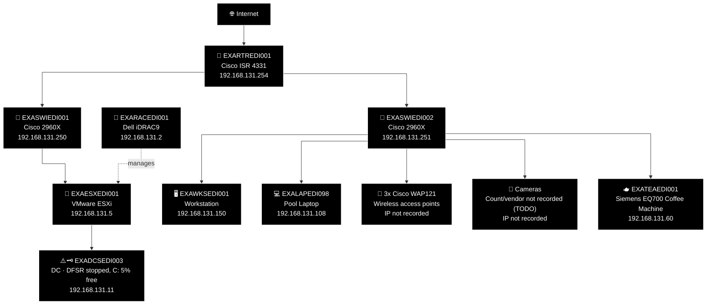
```mermaid
%%{init: {'flowchart': {'curve': 'stepAfter'}}}%%
graph TD
    O_INET["🌐 Internet"]
    O_RTR["📡 EXARTREDI001<br/>Cisco ISR 4331<br/>192.168.131.254"]
    O_INET --> O_RTR
    O_SW1["🔀 EXASWIEDI001<br/>Cisco 2960X<br/>192.168.131.250"]
    O_SW2["🔀 EXASWIEDI002<br/>Cisco 2960X<br/>192.168.131.251"]
    O_RTR --> O_SW1
    O_RTR --> O_SW2

    O_RAC["🔧 EXARACEDI001<br/>Dell iDRAC9<br/>192.168.131.2"]
    O_ESX["💾 EXAESXEDI001<br/>VMware ESXi<br/>192.168.131.5"]
    O_DC["⚠️🗝️ EXADCSEDI003<br/>DC · DFSR stopped, C: 5% free<br/>192.168.131.11"]
    O_SW1 --> O_ESX --> O_DC
    O_RAC -.->|"manages"| O_ESX

    O_WKS["🖥️ EXAWKSEDI001<br/>Workstation<br/>192.168.131.150"]
    O_LAP["💻 EXALAPEDI098<br/>Pool Laptop<br/>192.168.131.108"]
    O_WAP["📶 3x Cisco WAP121<br/>Wireless access points<br/>IP not recorded"]
    O_CAM["🎥 Cameras<br/>Count/vendor not recorded (TODO)<br/>IP not recorded"]
    O_COF["🫖 EXATEAEDI001<br/>Siemens EQ700 Coffee Machine<br/>192.168.131.60"]
    O_SW2 --> O_WKS
    O_SW2 --> O_LAP
    O_SW2 --> O_WAP
    O_SW2 --> O_CAM
    O_SW2 --> O_COF

    style O_INET fill:#000000,stroke:#FFFFFF,color:#FFFFFF
    style O_RTR fill:#000000,stroke:#FFFFFF,color:#FFFFFF
    style O_SW1 fill:#000000,stroke:#FFFFFF,color:#FFFFFF
    style O_SW2 fill:#000000,stroke:#FFFFFF,color:#FFFFFF
    style O_RAC fill:#000000,stroke:#FFFFFF,color:#FFFFFF
    style O_ESX fill:#000000,stroke:#FFFFFF,color:#FFFFFF
    style O_DC fill:#000000,stroke:#FFFFFF,color:#FFFFFF
    style O_WKS fill:#000000,stroke:#FFFFFF,color:#FFFFFF
    style O_LAP fill:#000000,stroke:#FFFFFF,color:#FFFFFF
    style O_WAP fill:#000000,stroke:#FFFFFF,color:#FFFFFF
    style O_CAM fill:#000000,stroke:#FFFFFF,color:#FFFFFF
    style O_COF fill:#000000,stroke:#FFFFFF,color:#FFFFFF
```

Original hand-maintained Old Network box (pre-restyle, kept for reference during prototype review)

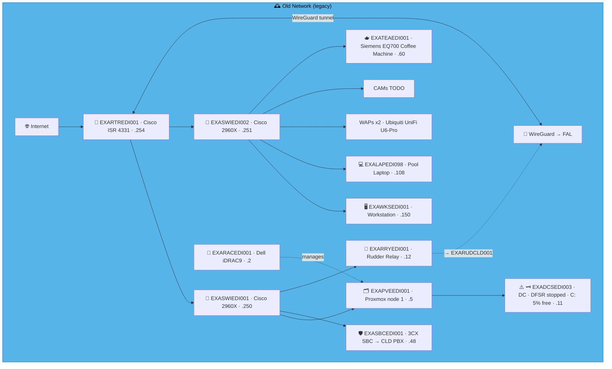
```mermaid
graph TD
    subgraph OLD_EDI ["🕰️ Old Network (legacy)"]
      INET["🌐 Internet"]
      RTR["📡 EXARTREDI001 · Cisco ISR 4331 · .254"]
      SW1["🔀 EXASWIEDI001 · Cisco 2960X · .250"]
      SW2["🔀 EXASWIEDI002 · Cisco 2960X · .251"]
      RAC["🔧 EXARACEDI001 · Dell iDRAC9 · .2"]
      PVE["🗂️ EXAPVEEDI001 · Proxmox node 1 · .5"]
      DC["⚠️ 🗝️ EXADCSEDI003 · DC · DFSR stopped · C: 5% free · .11"]
      SBC["🛡️ EXASBCEDI001 · 3CX SBC → CLD PBX · .48"]
      RRY["🔁 EXARRYEDI001 · Rudder Relay · .12"]
      WKS["🖥️ EXAWKSEDI001 · Workstation · .150"]
      LAP["💻 EXALAPEDI098 · Pool Laptop · .108"]
      WAP["WAPs x2 · Ubiquiti UniFi U6-Pro"]
      CAM["CAMs TODO"]
      COF["🫖 EXATEAEDI001 · Siemens EQ700 Coffee Machine · .60"]
      VPN["🔗 WireGuard → FAL"]

      INET --> RTR --> SW1 & SW2
      SW1 --> PVE --> DC
      SW1 --> SBC
      RAC -.->|"manages"| PVE
      SW2 --> WKS & LAP & WAP & CAM & COF
      RTR <-->|"WireGuard tunnel"| VPN

      SW1 --> RRY
      RRY -. "→ EXARUDCLD001" .-> VPN
    end
    style OLD_EDI fill:#56B4E9,stroke:#0072B2,color:#000000
```

### 🗺️ Topology sketch (generated — see benarbejde/generate_network_diagrams.py)

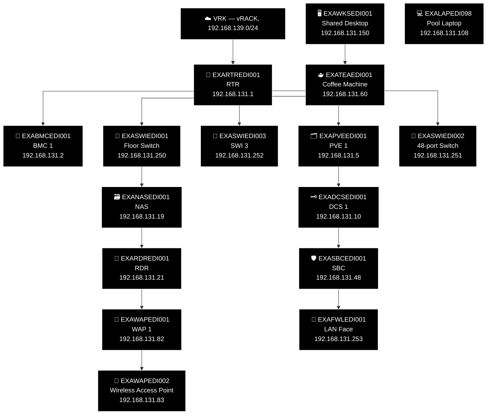
```mermaid
%% GENERATED:TOPOLOGY:EDI:START
%%{init: {'flowchart': {'curve': 'stepAfter'}}}%%
graph TD
    T_VRK["☁️ VRK — vRACK, 192.168.139.0/24"]
    T_RTR["📡 EXARTREDI001<br/>RTR<br/>192.168.131.1"]
    T_VRK --> T_RTR
    T_BMC["🔧 EXABMCEDI001<br/>BMC 1<br/>192.168.131.2"]
    T_RTR --> T_BMC
    T_PVE["🗂️ EXAPVEEDI001<br/>PVE 1<br/>192.168.131.5"]
    T_RTR --> T_PVE
    T_SWI["🔀 EXASWIEDI003<br/>SWI 3<br/>192.168.131.252"]
    T_RTR --> T_SWI
    T_SWI2["🔀 EXASWIEDI001<br/>Floor Switch<br/>192.168.131.250"]
    T_RTR --> T_SWI2
    T_SWI3["🔀 EXASWIEDI002<br/>48-port Switch<br/>192.168.131.251"]
    T_RTR --> T_SWI3
    T_NAS["🗃️ EXANASEDI001<br/>NAS<br/>192.168.131.19"]
    T_RDR["🔐 EXARDREDI001<br/>RDR<br/>192.168.131.21"]
    T_WAP["📶 EXAWAPEDI001<br/>WAP 1<br/>192.168.131.82"]
    T_WAP2["📶 EXAWAPEDI002<br/>Wireless Access Point<br/>192.168.131.83"]
    T_SWI2 --> T_NAS --> T_RDR --> T_WAP --> T_WAP2
    T_DCS["🗝️ EXADCSEDI001<br/>DCS 1<br/>192.168.131.10"]
    T_SBC["🛡️ EXASBCEDI001<br/>SBC<br/>192.168.131.48"]
    T_FWL["🧱 EXAFWLEDI001<br/>LAN Face<br/>192.168.131.253"]
    T_PVE --> T_DCS --> T_SBC --> T_FWL
    T_WKS["🖥️ EXAWKSEDI001<br/>Shared Desktop<br/>192.168.131.150"]
    T_LAP["💻 EXALAPEDI098<br/>Pool Laptop<br/>192.168.131.108"]
    T_TEA["🫖 EXATEAEDI001<br/>Coffee Machine<br/>192.168.131.60"]
    T_WKS --> T_TEA
    style T_VRK fill:#000000,stroke:#FFFFFF,color:#FFFFFF
    style T_RTR fill:#000000,stroke:#FFFFFF,color:#FFFFFF
    style T_BMC fill:#000000,stroke:#FFFFFF,color:#FFFFFF
    style T_PVE fill:#000000,stroke:#FFFFFF,color:#FFFFFF
    style T_SWI fill:#000000,stroke:#FFFFFF,color:#FFFFFF
    style T_SWI2 fill:#000000,stroke:#FFFFFF,color:#FFFFFF
    style T_SWI3 fill:#000000,stroke:#FFFFFF,color:#FFFFFF
    style T_NAS fill:#000000,stroke:#FFFFFF,color:#FFFFFF
    style T_RDR fill:#000000,stroke:#FFFFFF,color:#FFFFFF
    style T_WAP fill:#000000,stroke:#FFFFFF,color:#FFFFFF
    style T_WAP2 fill:#000000,stroke:#FFFFFF,color:#FFFFFF
    style T_DCS fill:#000000,stroke:#FFFFFF,color:#FFFFFF
    style T_SBC fill:#000000,stroke:#FFFFFF,color:#FFFFFF
    style T_FWL fill:#000000,stroke:#FFFFFF,color:#FFFFFF
    style T_WKS fill:#000000,stroke:#FFFFFF,color:#FFFFFF
    style T_LAP fill:#000000,stroke:#FFFFFF,color:#FFFFFF
    style T_TEA fill:#000000,stroke:#FFFFFF,color:#FFFFFF
%% GENERATED:TOPOLOGY:EDI:END
```

---

## GLA — Glasgow 🚧

**LAN:** `192.168.141.0/24` · **Domain:** `example.net`  
**PVE nodes:** 1 · **VPN parent:** FAL  
**Entity:** Example Music (Scotland) Ltd · **Landline:** +44 141 496 01xx · **Mobile:** +44 770 009 4xxx

### 🕰️ Old Network (legacy, hand restyled — prototype, not yet generated)

> **Corrected against Robert's real facts, 2026-07-31.** Standing corrections now confirmed
> estate-wide (applied without re-asking from here on): hypervisor was ESX/VMware everywhere,
> never PVE/Proxmox; SBC never existed at any old site, full stop. `RRY`/WireGuard already
> confirmed the same way. Here: real hardware another HP ML310e (`EXAESXGLA001`) + HP iLO
> (`EXAILOGLA001`), same reference pair as FAL. `EXADCRGLA001` confirmed real (genuinely
> legacy-naming, not a data error) — will be migrated to a new host, `EXADCSGLA001`. Printer,
> laptop, workstations confirmed real and moving to the new build. WAP/CAM confirmed genuinely
> `TODO` in the strict sense — no old hardware existed at all, new build adds them fresh (not
> "data we don't have," unlike EDI's WAPs) — kept as simple placeholders, not device boxes.

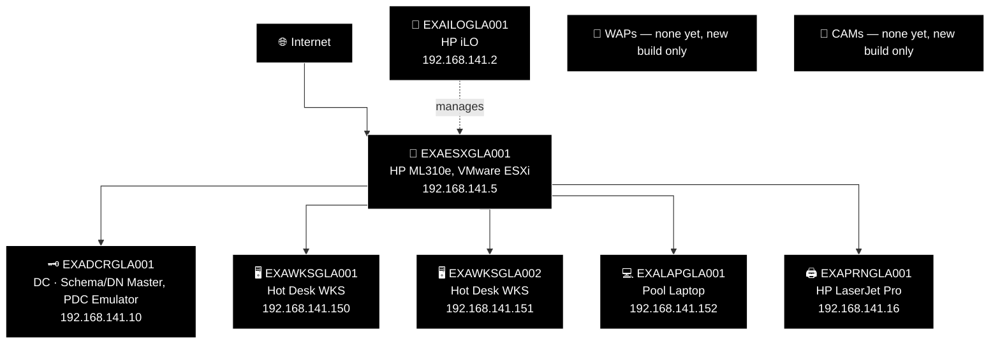
```mermaid
%%{init: {'flowchart': {'curve': 'stepAfter'}}}%%
graph TD
    O_INET["🌐 Internet"]
    O_ILO["🔧 EXAILOGLA001<br/>HP iLO<br/>192.168.141.2"]
    O_ESX["💾 EXAESXGLA001<br/>HP ML310e, VMware ESXi<br/>192.168.141.5"]
    O_INET --> O_ESX
    O_ILO -.->|"manages"| O_ESX

    O_DC["🗝️ EXADCRGLA001<br/>DC · Schema/DN Master, PDC Emulator<br/>192.168.141.10"]
    O_WKS1["🖥️ EXAWKSGLA001<br/>Hot Desk WKS<br/>192.168.141.150"]
    O_WKS2["🖥️ EXAWKSGLA002<br/>Hot Desk WKS<br/>192.168.141.151"]
    O_LAP["💻 EXALAPGLA001<br/>Pool Laptop<br/>192.168.141.152"]
    O_PRN["🖨️ EXAPRNGLA001<br/>HP LaserJet Pro<br/>192.168.141.16"]
    O_ESX --> O_DC
    O_ESX --> O_WKS1
    O_ESX --> O_WKS2
    O_ESX --> O_LAP
    O_ESX --> O_PRN

    O_WAP["📶 WAPs — none yet, new build only"]
    O_CAM["🎥 CAMs — none yet, new build only"]

    style O_INET fill:#000000,stroke:#FFFFFF,color:#FFFFFF
    style O_ILO fill:#000000,stroke:#FFFFFF,color:#FFFFFF
    style O_ESX fill:#000000,stroke:#FFFFFF,color:#FFFFFF
    style O_DC fill:#000000,stroke:#FFFFFF,color:#FFFFFF
    style O_WKS1 fill:#000000,stroke:#FFFFFF,color:#FFFFFF
    style O_WKS2 fill:#000000,stroke:#FFFFFF,color:#FFFFFF
    style O_LAP fill:#000000,stroke:#FFFFFF,color:#FFFFFF
    style O_PRN fill:#000000,stroke:#FFFFFF,color:#FFFFFF
    style O_WAP fill:#000000,stroke:#FFFFFF,color:#FFFFFF
    style O_CAM fill:#000000,stroke:#FFFFFF,color:#FFFFFF
```

Original hand-maintained Old Network box (pre-restyle, kept for reference during prototype review)

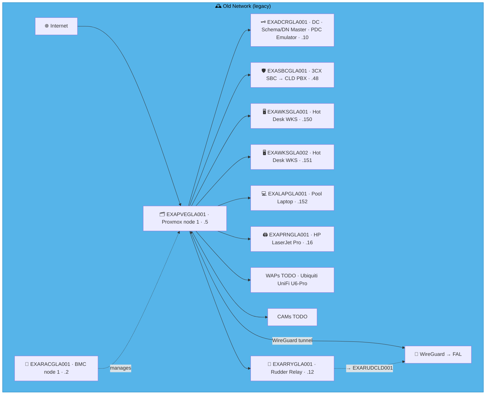
```mermaid
graph TD
    subgraph OLD_GLA ["🕰️ Old Network (legacy)"]
      INET["🌐 Internet"]
      PVE["🗂️ EXAPVEGLA001 · Proxmox node 1 · .5"]
      RAC["🔧 EXARACGLA001 · BMC node 1 · .2"]
      DC["🗝️ EXADCRGLA001 · DC · Schema/DN Master · PDC Emulator · .10"]
      SBC["🛡️ EXASBCGLA001 · 3CX SBC → CLD PBX · .48"]
      RRY["🔁 EXARRYGLA001 · Rudder Relay · .12"]
      WKS1["🖥️ EXAWKSGLA001 · Hot Desk WKS · .150"]
      WKS2["🖥️ EXAWKSGLA002 · Hot Desk WKS · .151"]
      LAP["💻 EXALAPGLA001 · Pool Laptop · .152"]
      PRN["🖨️ EXAPRNGLA001 · HP LaserJet Pro · .16"]
      WAP["WAPs TODO · Ubiquiti UniFi U6-Pro"]
      CAM["CAMs TODO"]
      VPN["🔗 WireGuard → FAL"]

      INET --> PVE
      PVE --> DC & SBC
      RAC -.->|"manages"| PVE
      PVE --> WKS1 & WKS2 & LAP & PRN & WAP & CAM
      PVE <-->|"WireGuard tunnel"| VPN

      PVE --> RRY
      RRY -. "→ EXARUDCLD001" .-> VPN
    end
    style OLD_GLA fill:#56B4E9,stroke:#0072B2,color:#000000
```

### 🗺️ Topology sketch (generated — see benarbejde/generate_network_diagrams.py)

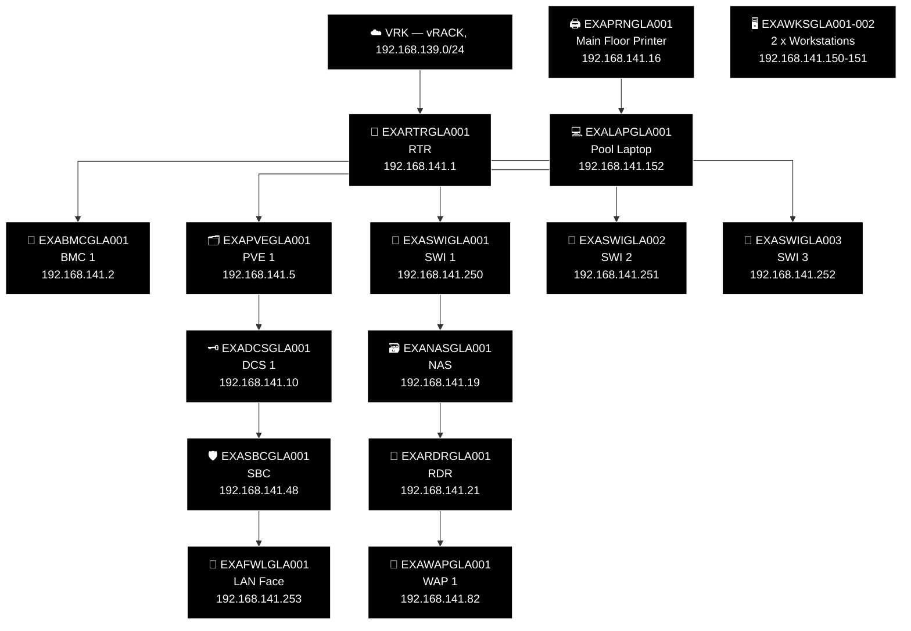
```mermaid
%% GENERATED:TOPOLOGY:GLA:START
%%{init: {'flowchart': {'curve': 'stepAfter'}}}%%
graph TD
    T_VRK["☁️ VRK — vRACK, 192.168.139.0/24"]
    T_RTR["📡 EXARTRGLA001<br/>RTR<br/>192.168.141.1"]
    T_VRK --> T_RTR
    T_BMC["🔧 EXABMCGLA001<br/>BMC 1<br/>192.168.141.2"]
    T_RTR --> T_BMC
    T_PVE["🗂️ EXAPVEGLA001<br/>PVE 1<br/>192.168.141.5"]
    T_RTR --> T_PVE
    T_SWI["🔀 EXASWIGLA001<br/>SWI 1<br/>192.168.141.250"]
    T_RTR --> T_SWI
    T_SWI2["🔀 EXASWIGLA002<br/>SWI 2<br/>192.168.141.251"]
    T_RTR --> T_SWI2
    T_SWI3["🔀 EXASWIGLA003<br/>SWI 3<br/>192.168.141.252"]
    T_RTR --> T_SWI3
    T_NAS["🗃️ EXANASGLA001<br/>NAS<br/>192.168.141.19"]
    T_RDR["🔐 EXARDRGLA001<br/>RDR<br/>192.168.141.21"]
    T_WAP["📶 EXAWAPGLA001<br/>WAP 1<br/>192.168.141.82"]
    T_SWI --> T_NAS --> T_RDR --> T_WAP
    T_DCS["🗝️ EXADCSGLA001<br/>DCS 1<br/>192.168.141.10"]
    T_SBC["🛡️ EXASBCGLA001<br/>SBC<br/>192.168.141.48"]
    T_FWL["🧱 EXAFWLGLA001<br/>LAN Face<br/>192.168.141.253"]
    T_PVE --> T_DCS --> T_SBC --> T_FWL
    T_PRN["🖨️ EXAPRNGLA001<br/>Main Floor Printer<br/>192.168.141.16"]
    T_OTH_WKS["🖥️ EXAWKSGLA001-002<br/>2 x Workstations<br/>192.168.141.150-151"]
    T_LAP["💻 EXALAPGLA001<br/>Pool Laptop<br/>192.168.141.152"]
    T_PRN --> T_LAP
    style T_VRK fill:#000000,stroke:#FFFFFF,color:#FFFFFF
    style T_RTR fill:#000000,stroke:#FFFFFF,color:#FFFFFF
    style T_BMC fill:#000000,stroke:#FFFFFF,color:#FFFFFF
    style T_PVE fill:#000000,stroke:#FFFFFF,color:#FFFFFF
    style T_SWI fill:#000000,stroke:#FFFFFF,color:#FFFFFF
    style T_SWI2 fill:#000000,stroke:#FFFFFF,color:#FFFFFF
    style T_SWI3 fill:#000000,stroke:#FFFFFF,color:#FFFFFF
    style T_NAS fill:#000000,stroke:#FFFFFF,color:#FFFFFF
    style T_RDR fill:#000000,stroke:#FFFFFF,color:#FFFFFF
    style T_WAP fill:#000000,stroke:#FFFFFF,color:#FFFFFF
    style T_DCS fill:#000000,stroke:#FFFFFF,color:#FFFFFF
    style T_SBC fill:#000000,stroke:#FFFFFF,color:#FFFFFF
    style T_FWL fill:#000000,stroke:#FFFFFF,color:#FFFFFF
    style T_PRN fill:#000000,stroke:#FFFFFF,color:#FFFFFF
    style T_OTH_WKS fill:#000000,stroke:#FFFFFF,color:#FFFFFF
    style T_LAP fill:#000000,stroke:#FFFFFF,color:#FFFFFF
%% GENERATED:TOPOLOGY:GLA:END
```

---

## CLY — Clydebank 🚢

**LAN:** `192.168.41.0/24` · **Domain:** `example.net`  
**PVE nodes:** 1 · **VPN parent:** FAL  
**Entity:** Example Music (Scotland) Ltd · **Landline:** +44 141 496 00xx · **Mobile:** +44 770 090 5xxx

### 🕰️ Old Network (legacy, hand restyled — prototype, not yet generated)

> **Corrected against Robert's real facts, 2026-07-31.** Standing corrections applied (ESX not
> PVE; no SBC; no `RRY`; no WireGuard on old infra) — but CLY is a genuine exception to the first
> one: **no hypervisor was ever built here at all.** The BMC (`EXARACCLY001`, HPE iLO5) is real —
> newer hardware than FAL/GLA's, but it never had a host to manage, so no `ESX` node exists for
> CLY and the BMC has no "manages" edge, just its own real network presence. `DC1`/`DC2`/`SRV`
> were standalone physical boxes under the switch, not VMs on a hypervisor that didn't exist —
> restructured accordingly. `EXAPHNCLY001`'s "iOS handset" confirmed real. WAPs confirmed
> genuinely real this time (not a new-hardware bleed like EDI's) — bought new, carrying over to
> the new build as-is. `TAB` corrected to `EXATABCLY001` — `devices.csv` already has this exact
> rename on record ("real AD record's own Name field was stale"), the diagram just hadn't caught
> up. `DC1`/`DC2` will be shut down once rebuilt under the same hostnames in the new build.

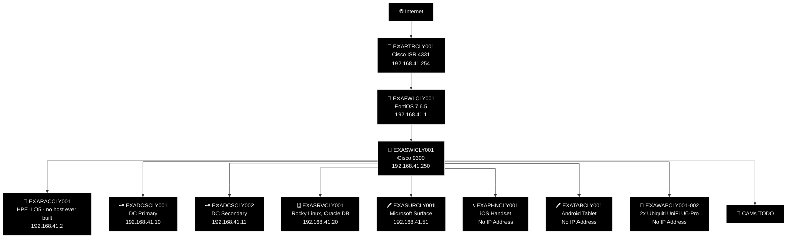
```mermaid
%%{init: {'flowchart': {'curve': 'stepAfter'}}}%%
graph TD
    O_INET["🌐 Internet"]
    O_RTR["📡 EXARTRCLY001<br/>Cisco ISR 4331<br/>192.168.41.254"]
    O_INET --> O_RTR
    O_FWL["🧱 EXAFWLCLY001<br/>FortiOS 7.6.5<br/>192.168.41.1"]
    O_RTR --> O_FWL
    O_SW["🔀 EXASWICLY001<br/>Cisco 9300<br/>192.168.41.250"]
    O_FWL --> O_SW

    O_ILO["🔧 EXARACCLY001<br/>HPE iLO5 · no host ever built<br/>192.168.41.2"]
    O_DC1["🗝️ EXADCSCLY001<br/>DC Primary<br/>192.168.41.10"]
    O_DC2["🗝️ EXADCSCLY002<br/>DC Secondary<br/>192.168.41.11"]
    O_SRV["🗄️ EXASRVCLY001<br/>Rocky Linux, Oracle DB<br/>192.168.41.20"]
    O_SW --> O_ILO
    O_SW --> O_DC1
    O_SW --> O_DC2
    O_SW --> O_SRV

    O_SUR["🖊️ EXASURCLY001<br/>Microsoft Surface<br/>192.168.41.51"]
    O_PHN["📞 EXAPHNCLY001<br/>iOS Handset<br/>No IP Address"]
    O_TAB["🖊️ EXATABCLY001<br/>Android Tablet<br/>No IP Address"]
    O_WAP["📶 EXAWAPCLY001-002<br/>2x Ubiquiti UniFi U6-Pro<br/>No IP Address"]
    O_CAM["🎥 CAMs TODO"]
    O_SW --> O_SUR
    O_SW --> O_PHN
    O_SW --> O_TAB
    O_SW --> O_WAP
    O_SW --> O_CAM

    style O_INET fill:#000000,stroke:#FFFFFF,color:#FFFFFF
    style O_RTR fill:#000000,stroke:#FFFFFF,color:#FFFFFF
    style O_FWL fill:#000000,stroke:#FFFFFF,color:#FFFFFF
    style O_SW fill:#000000,stroke:#FFFFFF,color:#FFFFFF
    style O_ILO fill:#000000,stroke:#FFFFFF,color:#FFFFFF
    style O_DC1 fill:#000000,stroke:#FFFFFF,color:#FFFFFF
    style O_DC2 fill:#000000,stroke:#FFFFFF,color:#FFFFFF
    style O_SRV fill:#000000,stroke:#FFFFFF,color:#FFFFFF
    style O_SUR fill:#000000,stroke:#FFFFFF,color:#FFFFFF
    style O_PHN fill:#000000,stroke:#FFFFFF,color:#FFFFFF
    style O_TAB fill:#000000,stroke:#FFFFFF,color:#FFFFFF
    style O_WAP fill:#000000,stroke:#FFFFFF,color:#FFFFFF
    style O_CAM fill:#000000,stroke:#FFFFFF,color:#FFFFFF
```

Original hand-maintained Old Network box (pre-restyle, kept for reference during prototype review)

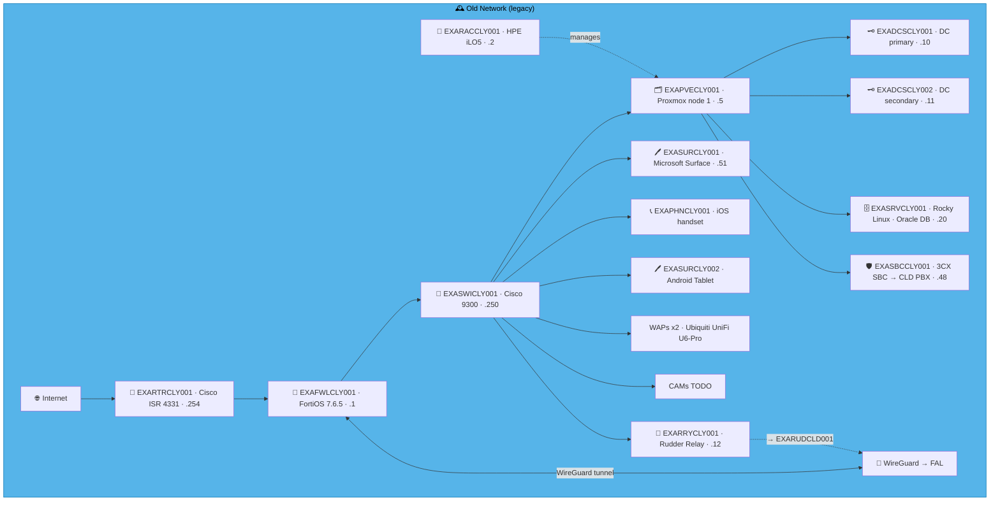
```mermaid
graph TD
    subgraph OLD_CLY ["🕰️ Old Network (legacy)"]
      INET["🌐 Internet"]
      FWL["🧱 EXAFWLCLY001 · FortiOS 7.6.5 · .1"]
      RTR["📡 EXARTRCLY001 · Cisco ISR 4331 · .254"]
      SW["🔀 EXASWICLY001 · Cisco 9300 · .250"]
      RAC["🔧 EXARACCLY001 · HPE iLO5 · .2"]
      PVE["🗂️ EXAPVECLY001 · Proxmox node 1 · .5"]
      DC1["🗝️ EXADCSCLY001 · DC primary · .10"]
      DC2["🗝️ EXADCSCLY002 · DC secondary · .11"]
      SRV["🗄️ EXASRVCLY001 · Rocky Linux · Oracle DB · .20"]
      SBC["🛡️ EXASBCCLY001 · 3CX SBC → CLD PBX · .48"]
      RRY["🔁 EXARRYCLY001 · Rudder Relay · .12"]
      SUR["🖊️ EXASURCLY001 · Microsoft Surface · .51"]
      PHN["📞 EXAPHNCLY001 · iOS handset"]
      TAB["🖊️ EXASURCLY002 · Android Tablet"]
      WAP["WAPs x2 · Ubiquiti UniFi U6-Pro"]
      CAM["CAMs TODO"]
      VPN["🔗 WireGuard → FAL"]

      INET --> RTR --> FWL --> SW
      SW --> PVE --> DC1 & DC2 & SRV & SBC
      RAC -.->|"manages"| PVE
      SW --> SUR & PHN & TAB & WAP & CAM
      FWL <-->|"WireGuard tunnel"| VPN

      SW --> RRY
      RRY -. "→ EXARUDCLD001" .-> VPN
    end
    style OLD_CLY fill:#56B4E9,stroke:#0072B2,color:#000000
```

### 🗺️ Topology sketch (generated — see benarbejde/generate_network_diagrams.py)

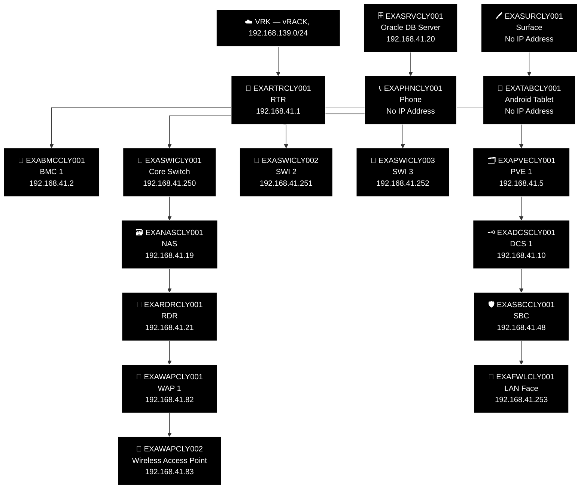
```mermaid
%% GENERATED:TOPOLOGY:CLY:START
%%{init: {'flowchart': {'curve': 'stepAfter'}}}%%
graph TD
    T_VRK["☁️ VRK — vRACK, 192.168.139.0/24"]
    T_RTR["📡 EXARTRCLY001<br/>RTR<br/>192.168.41.1"]
    T_VRK --> T_RTR
    T_BMC["🔧 EXABMCCLY001<br/>BMC 1<br/>192.168.41.2"]
    T_RTR --> T_BMC
    T_PVE["🗂️ EXAPVECLY001<br/>PVE 1<br/>192.168.41.5"]
    T_RTR --> T_PVE
    T_SWI["🔀 EXASWICLY002<br/>SWI 2<br/>192.168.41.251"]
    T_RTR --> T_SWI
    T_SWI2["🔀 EXASWICLY003<br/>SWI 3<br/>192.168.41.252"]
    T_RTR --> T_SWI2
    T_SWI3["🔀 EXASWICLY001<br/>Core Switch<br/>192.168.41.250"]
    T_RTR --> T_SWI3
    T_NAS["🗃️ EXANASCLY001<br/>NAS<br/>192.168.41.19"]
    T_RDR["🔐 EXARDRCLY001<br/>RDR<br/>192.168.41.21"]
    T_WAP["📶 EXAWAPCLY001<br/>WAP 1<br/>192.168.41.82"]
    T_WAP2["📶 EXAWAPCLY002<br/>Wireless Access Point<br/>192.168.41.83"]
    T_SWI3 --> T_NAS --> T_RDR --> T_WAP --> T_WAP2
    T_DCS["🗝️ EXADCSCLY001<br/>DCS 1<br/>192.168.41.10"]
    T_SBC["🛡️ EXASBCCLY001<br/>SBC<br/>192.168.41.48"]
    T_FWL["🧱 EXAFWLCLY001<br/>LAN Face<br/>192.168.41.253"]
    T_PVE --> T_DCS --> T_SBC --> T_FWL
    T_SRV["🗄️ EXASRVCLY001<br/>Oracle DB Server<br/>192.168.41.20"]
    T_SUR["🖊️ EXASURCLY001<br/>Surface<br/>No IP Address"]
    T_PHN["📞 EXAPHNCLY001<br/>Phone<br/>No IP Address"]
    T_TAB["📱 EXATABCLY001<br/>Android Tablet<br/>No IP Address"]
    T_SRV --> T_PHN
    T_SUR --> T_TAB
    style T_VRK fill:#000000,stroke:#FFFFFF,color:#FFFFFF
    style T_RTR fill:#000000,stroke:#FFFFFF,color:#FFFFFF
    style T_BMC fill:#000000,stroke:#FFFFFF,color:#FFFFFF
    style T_PVE fill:#000000,stroke:#FFFFFF,color:#FFFFFF
    style T_SWI fill:#000000,stroke:#FFFFFF,color:#FFFFFF
    style T_SWI2 fill:#000000,stroke:#FFFFFF,color:#FFFFFF
    style T_SWI3 fill:#000000,stroke:#FFFFFF,color:#FFFFFF
    style T_NAS fill:#000000,stroke:#FFFFFF,color:#FFFFFF
    style T_RDR fill:#000000,stroke:#FFFFFF,color:#FFFFFF
    style T_WAP fill:#000000,stroke:#FFFFFF,color:#FFFFFF
    style T_WAP2 fill:#000000,stroke:#FFFFFF,color:#FFFFFF
    style T_DCS fill:#000000,stroke:#FFFFFF,color:#FFFFFF
    style T_SBC fill:#000000,stroke:#FFFFFF,color:#FFFFFF
    style T_FWL fill:#000000,stroke:#FFFFFF,color:#FFFFFF
    style T_SRV fill:#000000,stroke:#FFFFFF,color:#FFFFFF
    style T_SUR fill:#000000,stroke:#FFFFFF,color:#FFFFFF
    style T_PHN fill:#000000,stroke:#FFFFFF,color:#FFFFFF
    style T_TAB fill:#000000,stroke:#FFFFFF,color:#FFFFFF
%% GENERATED:TOPOLOGY:CLY:END
```

---

## DUN — Dundee 🛳️

**LAN:** `192.168.138.0/24` · **Domain:** `example.net`  
**PVE nodes:** 1 · **VPN parent:** FAL  
**Entity:** Example Music (Scotland) Ltd · **Landline:** +44 163 249 60xx · **Mobile:** +44 770 090 82xx

### 🕰️ Old Network (legacy, hand restyled — prototype, not yet generated)

> **Corrected against Robert's real facts, 2026-07-31.** Standing corrections applied (ESX not
> PVE; no SBC; no `RRY`; no WireGuard on old infra). Like CLY: real hardware was an HP ML310e +
> HP iLO (`EXAILODUN001`), but it "sat unused in a room" — never actually deployed as a running
> hypervisor, so no `ESX` node here either. `EXADCSDUN001` was a genuinely alarming find — a
> **Windows Server 2003 box nobody was even logging into** — kept as a real warning (same
> migration-priority signal as EDI's DFSR/disk-space one), replaced by a new build under the same
> hostname. WAPs and camera(s) both confirmed real and physically moving to the new network —
> WAPs already had vendor/model on record (Ubiquiti UniFi U6-Pro); the camera's exact count/model
> isn't on record here, only that it's the same as the new hardware and made the move.

> 🚨 **Migration priority — Tier 2.** Windows Server 2003 — 20+ years past EOL. Same remediation
> path as Tier 1: a new `EXADCSDUN001` build promoting and replicating against `EXADCSCLD001`
> (`ansible/playbooks/windows_dc/`), not patching this box.

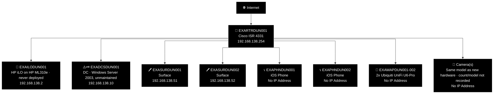
```mermaid
%%{init: {'flowchart': {'curve': 'stepAfter'}}}%%
graph TD
    O_INET["🌐 Internet"]
    O_RTR["📡 EXARTRDUN001<br/>Cisco ISR 4331<br/>192.168.138.254"]
    O_INET --> O_RTR

    O_ILO["🔧 EXAILODUN001<br/>HP iLO on HP ML310e · never deployed<br/>192.168.138.2"]
    O_DC["⚠️🗝️ EXADCSDUN001<br/>DC · Windows Server 2003, unmaintained<br/>192.168.138.10"]
    O_RTR --> O_ILO
    O_RTR --> O_DC

    O_SUR1["🖊️ EXASURDUN001<br/>Surface<br/>192.168.138.51"]
    O_SUR2["🖊️ EXASURDUN002<br/>Surface<br/>192.168.138.52"]
    O_PHN1["📞 EXAPHNDUN001<br/>iOS Phone<br/>No IP Address"]
    O_PHN2["📞 EXAPHNDUN002<br/>iOS Phone<br/>No IP Address"]
    O_WAP["📶 EXAWAPDUN001-002<br/>2x Ubiquiti UniFi U6-Pro<br/>No IP Address"]
    O_CAM["🎥 Camera(s)<br/>Same model as new hardware · count/model not recorded<br/>No IP Address"]
    O_RTR --> O_SUR1
    O_RTR --> O_SUR2
    O_RTR --> O_PHN1
    O_RTR --> O_PHN2
    O_RTR --> O_WAP
    O_RTR --> O_CAM

    style O_INET fill:#000000,stroke:#FFFFFF,color:#FFFFFF
    style O_RTR fill:#000000,stroke:#FFFFFF,color:#FFFFFF
    style O_ILO fill:#000000,stroke:#FFFFFF,color:#FFFFFF
    style O_DC fill:#000000,stroke:#FFFFFF,color:#FFFFFF
    style O_SUR1 fill:#000000,stroke:#FFFFFF,color:#FFFFFF
    style O_SUR2 fill:#000000,stroke:#FFFFFF,color:#FFFFFF
    style O_PHN1 fill:#000000,stroke:#FFFFFF,color:#FFFFFF
    style O_PHN2 fill:#000000,stroke:#FFFFFF,color:#FFFFFF
    style O_WAP fill:#000000,stroke:#FFFFFF,color:#FFFFFF
    style O_CAM fill:#000000,stroke:#FFFFFF,color:#FFFFFF
```

Original hand-maintained Old Network box (pre-restyle, kept for reference during prototype review)

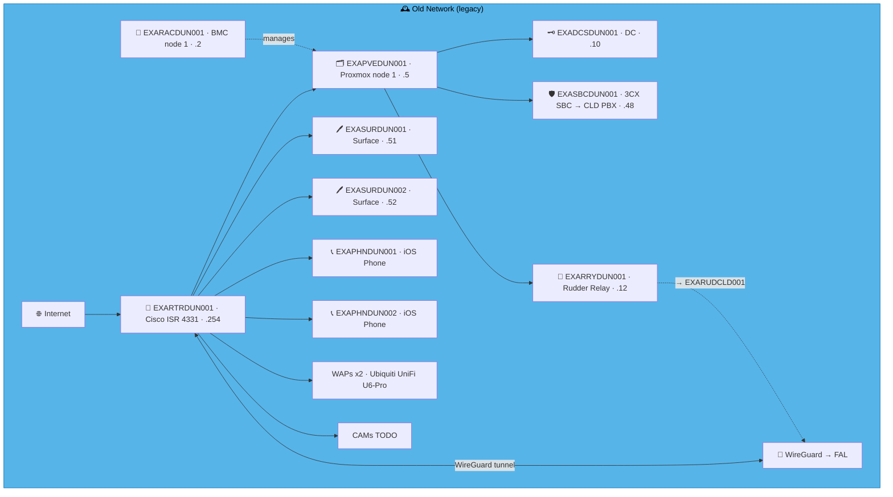
```mermaid
graph TD
    subgraph OLD_DUN ["🕰️ Old Network (legacy)"]
      INET["🌐 Internet"]
      RTR["📡 EXARTRDUN001 · Cisco ISR 4331 · .254"]
      RAC["🔧 EXARACDUN001 · BMC node 1 · .2"]
      PVE["🗂️ EXAPVEDUN001 · Proxmox node 1 · .5"]
      DC["🗝️ EXADCSDUN001 · DC · .10"]
      SBC["🛡️ EXASBCDUN001 · 3CX SBC → CLD PBX · .48"]
      RRY["🔁 EXARRYDUN001 · Rudder Relay · .12"]
      SUR1["🖊️ EXASURDUN001 · Surface · .51"]
      SUR2["🖊️ EXASURDUN002 · Surface · .52"]
      PHN1["📞 EXAPHNDUN001 · iOS Phone"]
      PHN2["📞 EXAPHNDUN002 · iOS Phone"]
      WAP["WAPs x2 · Ubiquiti UniFi U6-Pro"]
      CAM["CAMs TODO"]
      VPN["🔗 WireGuard → FAL"]

      INET --> RTR --> PVE
      PVE --> DC & SBC
      RAC -.->|"manages"| PVE
      RTR --> SUR1 & SUR2 & PHN1 & PHN2 & WAP & CAM
      RTR <-->|"WireGuard tunnel"| VPN

      PVE --> RRY
      RRY -. "→ EXARUDCLD001" .-> VPN
    end
    style OLD_DUN fill:#56B4E9,stroke:#0072B2,color:#000000
```

### 🗺️ Topology sketch (generated — see benarbejde/generate_network_diagrams.py)

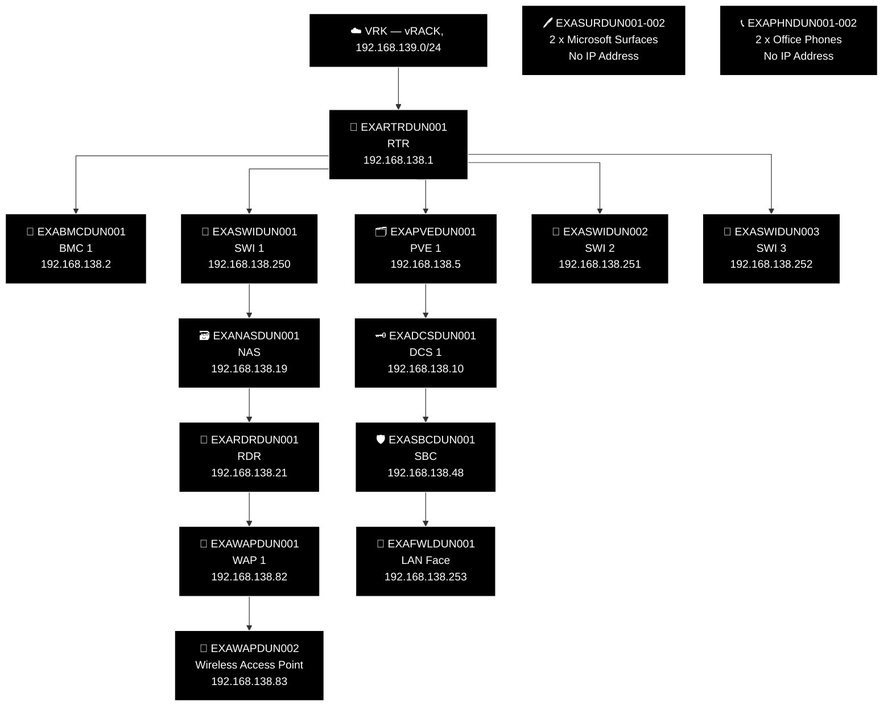
```mermaid
%% GENERATED:TOPOLOGY:DUN:START
%%{init: {'flowchart': {'curve': 'stepAfter'}}}%%
graph TD
    T_VRK["☁️ VRK — vRACK, 192.168.139.0/24"]
    T_RTR["📡 EXARTRDUN001<br/>RTR<br/>192.168.138.1"]
    T_VRK --> T_RTR
    T_BMC["🔧 EXABMCDUN001<br/>BMC 1<br/>192.168.138.2"]
    T_RTR --> T_BMC
    T_PVE["🗂️ EXAPVEDUN001<br/>PVE 1<br/>192.168.138.5"]
    T_RTR --> T_PVE
    T_SWI["🔀 EXASWIDUN001<br/>SWI 1<br/>192.168.138.250"]
    T_RTR --> T_SWI
    T_SWI2["🔀 EXASWIDUN002<br/>SWI 2<br/>192.168.138.251"]
    T_RTR --> T_SWI2
    T_SWI3["🔀 EXASWIDUN003<br/>SWI 3<br/>192.168.138.252"]
    T_RTR --> T_SWI3
    T_NAS["🗃️ EXANASDUN001<br/>NAS<br/>192.168.138.19"]
    T_RDR["🔐 EXARDRDUN001<br/>RDR<br/>192.168.138.21"]
    T_WAP["📶 EXAWAPDUN001<br/>WAP 1<br/>192.168.138.82"]
    T_WAP2["📶 EXAWAPDUN002<br/>Wireless Access Point<br/>192.168.138.83"]
    T_SWI --> T_NAS --> T_RDR --> T_WAP --> T_WAP2
    T_DCS["🗝️ EXADCSDUN001<br/>DCS 1<br/>192.168.138.10"]
    T_SBC["🛡️ EXASBCDUN001<br/>SBC<br/>192.168.138.48"]
    T_FWL["🧱 EXAFWLDUN001<br/>LAN Face<br/>192.168.138.253"]
    T_PVE --> T_DCS --> T_SBC --> T_FWL
    T_OTH_SUR["🖊️ EXASURDUN001-002<br/>2 x Microsoft Surfaces<br/>No IP Address"]
    T_OTH_PHN["📞 EXAPHNDUN001-002<br/>2 x Office Phones<br/>No IP Address"]
    style T_VRK fill:#000000,stroke:#FFFFFF,color:#FFFFFF
    style T_RTR fill:#000000,stroke:#FFFFFF,color:#FFFFFF
    style T_BMC fill:#000000,stroke:#FFFFFF,color:#FFFFFF
    style T_PVE fill:#000000,stroke:#FFFFFF,color:#FFFFFF
    style T_SWI fill:#000000,stroke:#FFFFFF,color:#FFFFFF
    style T_SWI2 fill:#000000,stroke:#FFFFFF,color:#FFFFFF
    style T_SWI3 fill:#000000,stroke:#FFFFFF,color:#FFFFFF
    style T_NAS fill:#000000,stroke:#FFFFFF,color:#FFFFFF
    style T_RDR fill:#000000,stroke:#FFFFFF,color:#FFFFFF
    style T_WAP fill:#000000,stroke:#FFFFFF,color:#FFFFFF
    style T_WAP2 fill:#000000,stroke:#FFFFFF,color:#FFFFFF
    style T_DCS fill:#000000,stroke:#FFFFFF,color:#FFFFFF
    style T_SBC fill:#000000,stroke:#FFFFFF,color:#FFFFFF
    style T_FWL fill:#000000,stroke:#FFFFFF,color:#FFFFFF
    style T_OTH_SUR fill:#000000,stroke:#FFFFFF,color:#FFFFFF
    style T_OTH_PHN fill:#000000,stroke:#FFFFFF,color:#FFFFFF
%% GENERATED:TOPOLOGY:DUN:END
```

---

## PER — Perth 👑

**LAN:** `192.168.173.0/24` · **Domain:** `example.net`  
**PVE nodes:** 1 · **VPN parent:** FAL  
**Entity:** Example Music (Scotland) Ltd · **Landline:** +44 173 849 60xx · **Mobile:** +44 770 0173 0xx

### 🕰️ Old Network (legacy, hand restyled — prototype, not yet generated)

> **Corrected against Robert's real facts, 2026-07-31.** Standing corrections applied (ESX not
> PVE; no SBC; no `RRY`; no WireGuard on old infra). PER is the most extreme "never actually
> ran" case so far: the BMC/hypervisor pair was the same unused HP ML310e pattern as CLY/DUN, and
> even the DC (`EXADCSPER001`) — a physical HP ML310e of its own — **was never switched on at
> all**. Kept as a real node with that fact stated plainly (the sharpest version yet of the
> migration-priority signal — nothing here was ever live). NIX, NAS, MacBooks, Surface, phones,
> printer, and the vending machine (`devices.csv` already has this one resolved as real/current)
> all confirmed real and moving to the new build. WAP confirmed real Ubiquiti hardware, purchased
> and coming over — count wasn't given, so left unstated rather than guessed. CAM confirmed
> genuinely `TODO` in GLA's sense — didn't exist yet, new build adds it fresh.

> 🚨 **Migration priority — Tier 3.** DC never switched on at all — no live users depending on
> it today. Still counts toward the estate-wide rollout: a new `EXADCSPER001` build promoting
> and replicating against `EXADCSCLD001` (`ansible/playbooks/windows_dc/`).

```mermaid
%%{init: {'flowchart': {'curve': 'stepAfter'}}}%%
graph TD
    O_INET["🌐 Internet"]
    O_ILO["🔧 EXARACPER001<br/>HP iLO on HP ML310e · never deployed<br/>192.168.173.2"]
    O_DC["⚠️🗝️ EXADCSPER001<br/>DC · physical HP ML310e, never switched on<br/>192.168.173.10"]
    O_NIX["🐧 EXANIXPER001<br/>Solaris 11.5, MIDI/Music Archive<br/>192.168.173.40"]
    O_NAS["🗃️ EXANASPER001<br/>Synology NAS<br/>192.168.173.50"]
    O_INET --> O_ILO
    O_INET --> O_DC
    O_INET --> O_NIX
    O_INET --> O_NAS

    O_MBP["💻 EXAMBPPER001<br/>MacBook Pro<br/>192.168.173.70"]
    O_SUR["🖊️ EXASURPER001<br/>Surface<br/>192.168.173.71"]
    O_PHN["📞 EXAPHNPER001-004<br/>Yealink T46G Phones<br/>192.168.173.80"]
    O_PRN["🖨️ EXAPRNPER001<br/>HP MFP Printer<br/>192.168.173.20"]
    O_VND["🍫 EXAVNDPER001<br/>Scone Palace Vending Machine<br/>192.168.173.60"]
    O_WAP["📶 Ubiquiti UniFi U6-Pro<br/>WAP(s) · count not recorded<br/>No IP Address"]
    O_CAM["🎥 CAMs — none yet, new build only"]
    O_INET --> O_MBP
    O_INET --> O_SUR
    O_INET --> O_PHN
    O_INET --> O_PRN
    O_INET --> O_VND
    O_INET --> O_WAP
    O_INET --> O_CAM

    style O_INET fill:#000000,stroke:#FFFFFF,color:#FFFFFF
    style O_ILO fill:#000000,stroke:#FFFFFF,color:#FFFFFF
    style O_DC fill:#000000,stroke:#FFFFFF,color:#FFFFFF
    style O_NIX fill:#000000,stroke:#FFFFFF,color:#FFFFFF
    style O_NAS fill:#000000,stroke:#FFFFFF,color:#FFFFFF
    style O_MBP fill:#000000,stroke:#FFFFFF,color:#FFFFFF
    style O_SUR fill:#000000,stroke:#FFFFFF,color:#FFFFFF
    style O_PHN fill:#000000,stroke:#FFFFFF,color:#FFFFFF
    style O_PRN fill:#000000,stroke:#FFFFFF,color:#FFFFFF
    style O_VND fill:#000000,stroke:#FFFFFF,color:#FFFFFF
    style O_WAP fill:#000000,stroke:#FFFFFF,color:#FFFFFF
    style O_CAM fill:#000000,stroke:#FFFFFF,color:#FFFFFF
```

Original hand-maintained Old Network box (pre-restyle, kept for reference during prototype review)

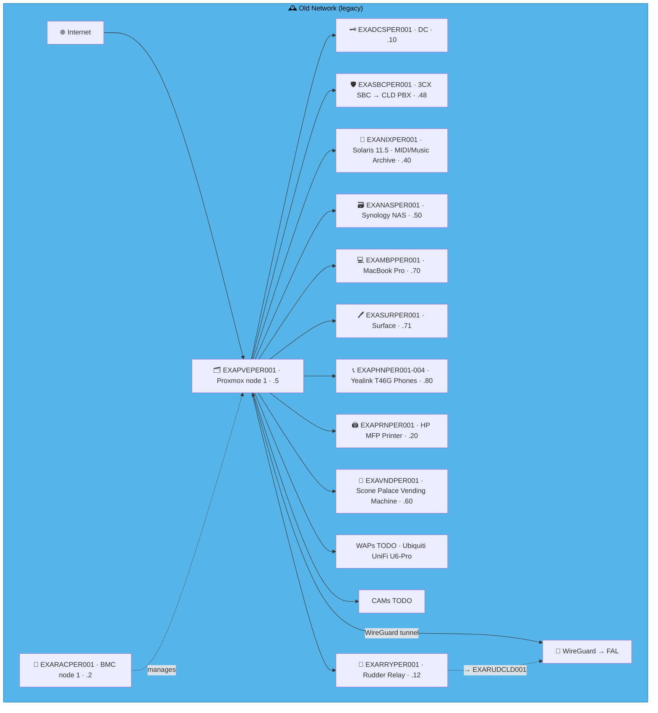
```mermaid
graph TD
    subgraph OLD_PER ["🕰️ Old Network (legacy)"]
      INET["🌐 Internet"]
      RAC["🔧 EXARACPER001 · BMC node 1 · .2"]
      PVE["🗂️ EXAPVEPER001 · Proxmox node 1 · .5"]
      DC["🗝️ EXADCSPER001 · DC · .10"]
      SBC["🛡️ EXASBCPER001 · 3CX SBC → CLD PBX · .48"]
      RRY["🔁 EXARRYPER001 · Rudder Relay · .12"]
      NIX["🐧 EXANIXPER001 · Solaris 11.5 · MIDI/Music Archive · .40"]
      NAS["🗃️ EXANASPER001 · Synology NAS · .50"]
      MBP["💻 EXAMBPPER001 · MacBook Pro · .70"]
      SUR["🖊️ EXASURPER001 · Surface · .71"]
      PHN["📞 EXAPHNPER001-004 · Yealink T46G Phones · .80"]
      PRN["🖨️ EXAPRNPER001 · HP MFP Printer · .20"]
      VND["🍫 EXAVNDPER001 · Scone Palace Vending Machine · .60"]
      WAP["WAPs TODO · Ubiquiti UniFi U6-Pro"]
      CAM["CAMs TODO"]
      VPN["🔗 WireGuard → FAL"]

      INET --> PVE
      PVE --> DC & SBC & NIX & NAS
      RAC -.->|"manages"| PVE
      PVE --> MBP & SUR & PHN & PRN & VND & WAP & CAM
      PVE <-->|"WireGuard tunnel"| VPN

      PVE --> RRY
      RRY -. "→ EXARUDCLD001" .-> VPN
    end
    style OLD_PER fill:#56B4E9,stroke:#0072B2,color:#000000
```

### 🗺️ Topology sketch (generated — see benarbejde/generate_network_diagrams.py)

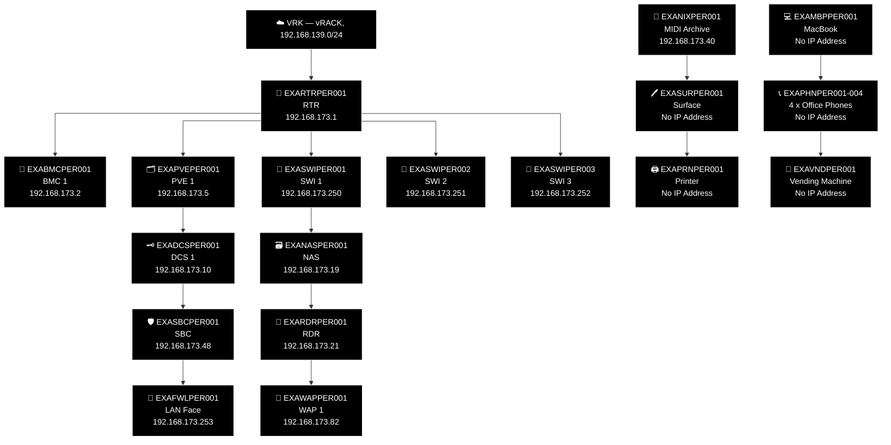
```mermaid
%% GENERATED:TOPOLOGY:PER:START
%%{init: {'flowchart': {'curve': 'stepAfter'}}}%%
graph TD
    T_VRK["☁️ VRK — vRACK, 192.168.139.0/24"]
    T_RTR["📡 EXARTRPER001<br/>RTR<br/>192.168.173.1"]
    T_VRK --> T_RTR
    T_BMC["🔧 EXABMCPER001<br/>BMC 1<br/>192.168.173.2"]
    T_RTR --> T_BMC
    T_PVE["🗂️ EXAPVEPER001<br/>PVE 1<br/>192.168.173.5"]
    T_RTR --> T_PVE
    T_SWI["🔀 EXASWIPER001<br/>SWI 1<br/>192.168.173.250"]
    T_RTR --> T_SWI
    T_SWI2["🔀 EXASWIPER002<br/>SWI 2<br/>192.168.173.251"]
    T_RTR --> T_SWI2
    T_SWI3["🔀 EXASWIPER003<br/>SWI 3<br/>192.168.173.252"]
    T_RTR --> T_SWI3
    T_NAS["🗃️ EXANASPER001<br/>NAS<br/>192.168.173.19"]
    T_RDR["🔐 EXARDRPER001<br/>RDR<br/>192.168.173.21"]
    T_WAP["📶 EXAWAPPER001<br/>WAP 1<br/>192.168.173.82"]
    T_SWI --> T_NAS --> T_RDR --> T_WAP
    T_DCS["🗝️ EXADCSPER001<br/>DCS 1<br/>192.168.173.10"]
    T_SBC["🛡️ EXASBCPER001<br/>SBC<br/>192.168.173.48"]
    T_FWL["🧱 EXAFWLPER001<br/>LAN Face<br/>192.168.173.253"]
    T_PVE --> T_DCS --> T_SBC --> T_FWL
    T_NIX["🐧 EXANIXPER001<br/>MIDI Archive<br/>192.168.173.40"]
    T_MBP["💻 EXAMBPPER001<br/>MacBook<br/>No IP Address"]
    T_SUR["🖊️ EXASURPER001<br/>Surface<br/>No IP Address"]
    T_OTH_PHN["📞 EXAPHNPER001-004<br/>4 x Office Phones<br/>No IP Address"]
    T_PRN["🖨️ EXAPRNPER001<br/>Printer<br/>No IP Address"]
    T_VND["🍫 EXAVNDPER001<br/>Vending Machine<br/>No IP Address"]
    T_NIX --> T_SUR --> T_PRN
    T_MBP --> T_OTH_PHN --> T_VND
    style T_VRK fill:#000000,stroke:#FFFFFF,color:#FFFFFF
    style T_RTR fill:#000000,stroke:#FFFFFF,color:#FFFFFF
    style T_BMC fill:#000000,stroke:#FFFFFF,color:#FFFFFF
    style T_PVE fill:#000000,stroke:#FFFFFF,color:#FFFFFF
    style T_SWI fill:#000000,stroke:#FFFFFF,color:#FFFFFF
    style T_SWI2 fill:#000000,stroke:#FFFFFF,color:#FFFFFF
    style T_SWI3 fill:#000000,stroke:#FFFFFF,color:#FFFFFF
    style T_NAS fill:#000000,stroke:#FFFFFF,color:#FFFFFF
    style T_RDR fill:#000000,stroke:#FFFFFF,color:#FFFFFF
    style T_WAP fill:#000000,stroke:#FFFFFF,color:#FFFFFF
    style T_DCS fill:#000000,stroke:#FFFFFF,color:#FFFFFF
    style T_SBC fill:#000000,stroke:#FFFFFF,color:#FFFFFF
    style T_FWL fill:#000000,stroke:#FFFFFF,color:#FFFFFF
    style T_NIX fill:#000000,stroke:#FFFFFF,color:#FFFFFF
    style T_MBP fill:#000000,stroke:#FFFFFF,color:#FFFFFF
    style T_SUR fill:#000000,stroke:#FFFFFF,color:#FFFFFF
    style T_OTH_PHN fill:#000000,stroke:#FFFFFF,color:#FFFFFF
    style T_PRN fill:#000000,stroke:#FFFFFF,color:#FFFFFF
    style T_VND fill:#000000,stroke:#FFFFFF,color:#FFFFFF
%% GENERATED:TOPOLOGY:PER:END
```

---

## ABD — Aberdeen 🪨

**LAN:** `192.168.224.0/24` · **Domain:** `example.org`  
**PVE nodes:** 1 · **VPN parent:** FAL  
**Entity:** Example Music (Scotland) Ltd · **Landline:** +44 1224 496 0xxx · **Mobile:** +44 7700 900 2xxx

### 🕰️ Old Network (legacy, hand restyled — prototype, not yet generated)

> **Corrected against Robert's real facts, 2026-07-31.** Standing corrections applied (ESX not
> PVE; no SBC; no `RRY`; no WireGuard on old infra; `CAM TODO` now defaults to "not yet built,
> new-network-only" going forward unless corrected per-site). Same unused HP ML310e/iLO pattern
> as CLY/DUN/PER — but unlike those, this one *was* pressed into service: `EXADCSABD001` ran
> **Windows Server 2008R2 bare metal directly on that hardware**, no ESX/virtualization layer
> ever existed. Kept the OS version as a real migration-priority signal (2008R2 is long past
> EOL). MacBooks, iPhones, and WAPs (real Ubiquiti hardware, already there) all confirmed moving
> to the new build as-is.

> 🚨 **Migration priority — Tier 2.** Windows Server 2008R2, long past EOL, bare metal with no
> ESX layer. Same remediation path as Tier 1: a new `EXADCSABD001` build promoting and
> replicating against `EXADCSCLD001` (`ansible/playbooks/windows_dc/`), not patching this box.

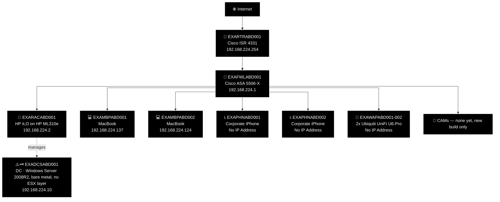
```mermaid
%%{init: {'flowchart': {'curve': 'stepAfter'}}}%%
graph TD
    O_INET["🌐 Internet"]
    O_RTR["📡 EXARTRABD001<br/>Cisco ISR 4331<br/>192.168.224.254"]
    O_INET --> O_RTR
    O_FWL["🧱 EXAFWLABD001<br/>Cisco ASA 5506-X<br/>192.168.224.1"]
    O_RTR --> O_FWL

    O_ILO["🔧 EXARACABD001<br/>HP iLO on HP ML310e<br/>192.168.224.2"]
    O_DC["⚠️🗝️ EXADCSABD001<br/>DC · Windows Server 2008R2, bare metal, no ESX layer<br/>192.168.224.10"]
    O_FWL --> O_ILO
    O_ILO -.->|"manages"| O_DC

    O_MBP1["💻 EXAMBPABD001<br/>MacBook<br/>192.168.224.137"]
    O_MBP2["💻 EXAMBPABD002<br/>MacBook<br/>192.168.224.124"]
    O_PHN1["📞 EXAPHNABD001<br/>Corporate iPhone<br/>No IP Address"]
    O_PHN2["📞 EXAPHNABD002<br/>Corporate iPhone<br/>No IP Address"]
    O_WAP["📶 EXAWAPABD001-002<br/>2x Ubiquiti UniFi U6-Pro<br/>No IP Address"]
    O_CAM["🎥 CAMs — none yet, new build only"]
    O_FWL --> O_MBP1
    O_FWL --> O_MBP2
    O_FWL --> O_PHN1
    O_FWL --> O_PHN2
    O_FWL --> O_WAP
    O_FWL --> O_CAM

    style O_INET fill:#000000,stroke:#FFFFFF,color:#FFFFFF
    style O_RTR fill:#000000,stroke:#FFFFFF,color:#FFFFFF
    style O_FWL fill:#000000,stroke:#FFFFFF,color:#FFFFFF
    style O_ILO fill:#000000,stroke:#FFFFFF,color:#FFFFFF
    style O_DC fill:#000000,stroke:#FFFFFF,color:#FFFFFF
    style O_MBP1 fill:#000000,stroke:#FFFFFF,color:#FFFFFF
    style O_MBP2 fill:#000000,stroke:#FFFFFF,color:#FFFFFF
    style O_PHN1 fill:#000000,stroke:#FFFFFF,color:#FFFFFF
    style O_PHN2 fill:#000000,stroke:#FFFFFF,color:#FFFFFF
    style O_WAP fill:#000000,stroke:#FFFFFF,color:#FFFFFF
    style O_CAM fill:#000000,stroke:#FFFFFF,color:#FFFFFF
```

Original hand-maintained Old Network box (pre-restyle, kept for reference during prototype review)

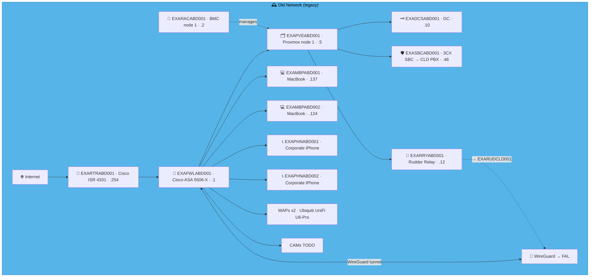
```mermaid
graph TD
    subgraph OLD_ABD ["🕰️ Old Network (legacy)"]
      INET["🌐 Internet"]
      FWL["🧱 EXAFWLABD001 · Cisco ASA 5506-X · .1"]
      RTR["📡 EXARTRABD001 · Cisco ISR 4331 · .254"]
      RAC["🔧 EXARACABD001 · BMC node 1 · .2"]
      PVE["🗂️ EXAPVEABD001 · Proxmox node 1 · .5"]
      DC["🗝️ EXADCSABD001 · DC · .10"]
      SBC["🛡️ EXASBCABD001 · 3CX SBC → CLD PBX · .48"]
      RRY["🔁 EXARRYABD001 · Rudder Relay · .12"]
      MBP1["💻 EXAMBPABD001 · MacBook · .137"]
      MBP2["💻 EXAMBPABD002 · MacBook · .124"]
      PHN1["📞 EXAPHNABD001 · Corporate iPhone"]
      PHN2["📞 EXAPHNABD002 · Corporate iPhone"]
      WAP["WAPs x2 · Ubiquiti UniFi U6-Pro"]
      CAM["CAMs TODO"]
      VPN["🔗 WireGuard → FAL"]

      INET --> RTR --> FWL --> PVE
      PVE --> DC & SBC
      RAC -.->|"manages"| PVE
      FWL --> MBP1 & MBP2 & PHN1 & PHN2 & WAP & CAM
      FWL <-->|"WireGuard tunnel"| VPN

      PVE --> RRY
      RRY -. "→ EXARUDCLD001" .-> VPN
    end
    style OLD_ABD fill:#56B4E9,stroke:#0072B2,color:#000000
```

### 🗺️ Topology sketch (generated — see benarbejde/generate_network_diagrams.py)

```mermaid
%% GENERATED:TOPOLOGY:ABD:START
%%{init: {'flowchart': {'curve': 'stepAfter'}}}%%
graph TD
    T_VRK["☁️ VRK — vRACK, 192.168.139.0/24"]
    T_RTR["📡 EXARTRABD001<br/>RTR<br/>192.168.224.1"]
    T_VRK --> T_RTR
    T_BMC["🔧 EXABMCABD001<br/>BMC 1<br/>192.168.224.2"]
    T_RTR --> T_BMC
    T_PVE["🗂️ EXAPVEABD001<br/>PVE 1<br/>192.168.224.5"]
    T_RTR --> T_PVE
    T_SWI["🔀 EXASWIABD001<br/>SWI 1<br/>192.168.224.250"]
    T_RTR --> T_SWI
    T_SWI2["🔀 EXASWIABD002<br/>SWI 2<br/>192.168.224.251"]
    T_RTR --> T_SWI2
    T_SWI3["🔀 EXASWIABD003<br/>SWI 3<br/>192.168.224.252"]
    T_RTR --> T_SWI3
    T_NAS["🗃️ EXANASABD001<br/>NAS<br/>192.168.224.19"]
    T_RDR["🔐 EXARDRABD001<br/>RDR<br/>192.168.224.21"]
    T_WAP["📶 EXAWAPABD001<br/>WAP 1<br/>192.168.224.82"]
    T_WAP2["📶 EXAWAPABD002<br/>Wireless Access Point<br/>192.168.224.83"]
    T_SWI --> T_NAS --> T_RDR --> T_WAP --> T_WAP2
    T_DCS["🗝️ EXADCSABD001<br/>DCS 1<br/>192.168.224.10"]
    T_SBC["🛡️ EXASBCABD001<br/>SBC<br/>192.168.224.48"]
    T_FWL["🧱 EXAFWLABD001<br/>LAN Face<br/>192.168.224.253"]
    T_PVE --> T_DCS --> T_SBC --> T_FWL
    T_OTH_MBP["💻 EXAMBPABD001-002<br/>2 x MacBook Pros<br/>No IP Address"]
    T_OTH_PHN["📞 EXAPHNABD001-002<br/>2 x Office Phones<br/>No IP Address"]
    style T_VRK fill:#000000,stroke:#FFFFFF,color:#FFFFFF
    style T_RTR fill:#000000,stroke:#FFFFFF,color:#FFFFFF
    style T_BMC fill:#000000,stroke:#FFFFFF,color:#FFFFFF
    style T_PVE fill:#000000,stroke:#FFFFFF,color:#FFFFFF
    style T_SWI fill:#000000,stroke:#FFFFFF,color:#FFFFFF
    style T_SWI2 fill:#000000,stroke:#FFFFFF,color:#FFFFFF
    style T_SWI3 fill:#000000,stroke:#FFFFFF,color:#FFFFFF
    style T_NAS fill:#000000,stroke:#FFFFFF,color:#FFFFFF
    style T_RDR fill:#000000,stroke:#FFFFFF,color:#FFFFFF
    style T_WAP fill:#000000,stroke:#FFFFFF,color:#FFFFFF
    style T_WAP2 fill:#000000,stroke:#FFFFFF,color:#FFFFFF
    style T_DCS fill:#000000,stroke:#FFFFFF,color:#FFFFFF
    style T_SBC fill:#000000,stroke:#FFFFFF,color:#FFFFFF
    style T_FWL fill:#000000,stroke:#FFFFFF,color:#FFFFFF
    style T_OTH_MBP fill:#000000,stroke:#FFFFFF,color:#FFFFFF
    style T_OTH_PHN fill:#000000,stroke:#FFFFFF,color:#FFFFFF
%% GENERATED:TOPOLOGY:ABD:END
```
