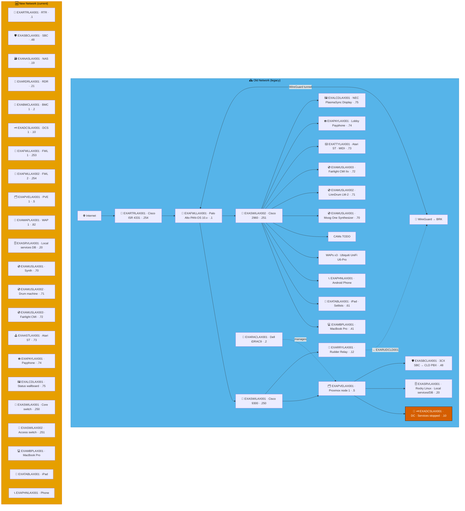
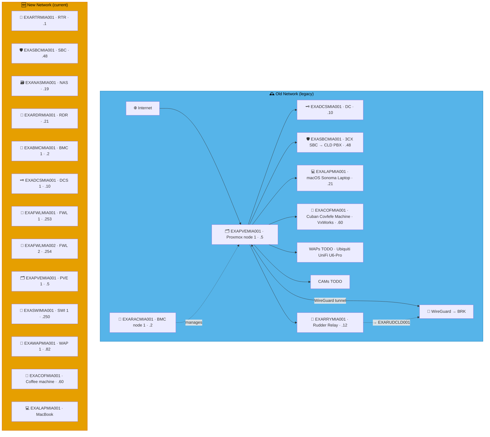
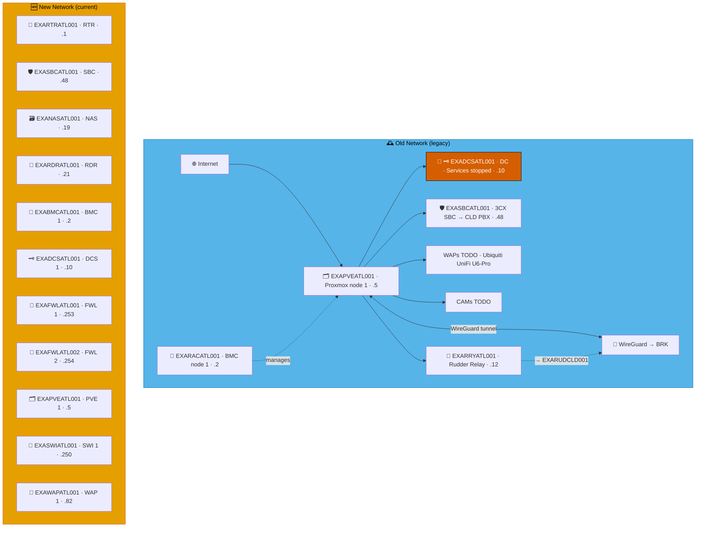
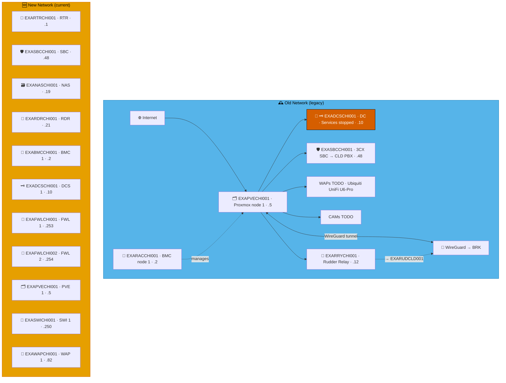
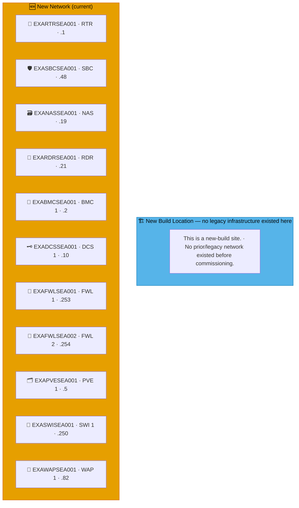
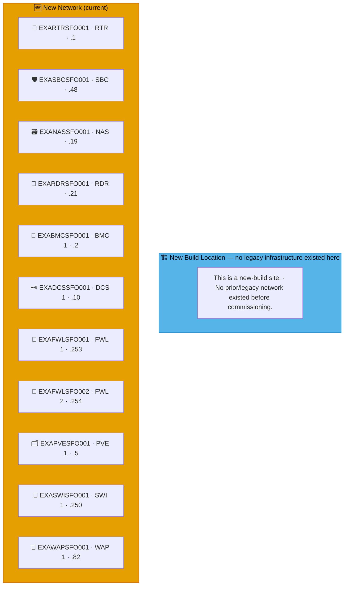

# Example Music Limited — United States Network Diagrams

> **Classification:** Internal — Infrastructure
> **Part of:** [`../network-diagram.md`](../network-diagram.md) — see there for the Visual
> Standard (shape/colour/emoji convention), the full emoji legend, and links to every other
> region.

---

## LAX — Los Angeles ⚠️ 🎬

**LAN:** `192.168.213.0/24` · **Domain:** `example.net`  
**PVE nodes:** 1 · **VPN parent:** BRK  
> ⚠️ `EXADCSLAX001` — DNS, Netlogon and KDC services stopped.  
**Entity:** Example Music (US) LLC. · **Landline:** +1 213 555 xxxx · **Mobile:** +1 213 555 xxx

---

## NYC — New York ⚠️ 🗽

**LAN:** `192.168.212.0/24` · **Domain:** `example.net`  
**PVE nodes:** 1 · **VPN parent:** BRK  
> ⚠️ `EXADCSNYC001` — DNS, Netlogon and KDC services stopped.  
**Entity:** Example Music (US) LLC. · **Landline:** +1 212 500 0xxx · **Mobile:** +1 917 900 2xxx

---

## NJC — New Jersey ⚠️ 🚕

**LAN:** `192.168.201.0/24` · **Domain:** `example.net`  
**PVE nodes:** 1 · **VPN parent:** BRK  
> ⚠️ `EXADCSNJC001` — DNS, Netlogon and KDC services stopped.  
**Entity:** Example Music (US) LLC. · **Landline:** +1 201 400 0xxx · **Mobile:** +1 908 900 2xxx

---

## MIA — Miami 🌴

**LAN:** `192.168.135.0/24` · **Domain:** `example.net`  
**PVE nodes:** 1 · **VPN parent:** BRK  
**Entity:** Example Music (US) LLC. · **Landline:** +1 305 555 xxxx · **Mobile:** +1 786 555 xxxx

---

## ATL — Atlanta ⚠️ 🍑

**LAN:** `192.168.33.0/24` · **Domain:** `example.net`  
**PVE nodes:** 1 · **VPN parent:** BRK  
> ⚠️ `EXADCSATL001` — DNS, Netlogon and KDC services stopped.  
**Entity:** Example Music (US) LLC. · **Landline:** +1 334 300 0xxx · **Mobile:** +1 770 900 2xxx

---

## CHI — Chicago ⚠️ 🏠

**LAN:** `192.168.214.0/24` · **Domain:** `example.net`  
**PVE nodes:** 1 · **VPN parent:** BRK  
> ⚠️ `EXADCSCHI001` — DNS, Netlogon and KDC services stopped.  
**Entity:** Example Music (US) LLC. · **Landline:** +1 312 555 xxxx · **Mobile:** +1 773 900 xxxx

---

## SEA — Seattle *(New Build)* ☕

**LAN:** `192.168.206.0/24` · **Domain:** `example.net`  
**PVE nodes:** 1 (reserved — see notes below) · **VPN parent:** BRK  
**Entity:** Example Music (US) LLC. · **Landline:** +1 206 555 xxxx · **Mobile:** +1 425 555 xxxx

> **New-build site.** No legacy infrastructure ever existed here — see the "New Build Location" box below in place of "Old Network." Standard-slot addresses are allocated in `benarbejde/address_policy.json`/`sites.csv` the same as any other site, but no `devices.csv` exception rows exist yet.

---

## SFO — San Francisco *(New Build)* 🌁

**LAN:** `192.168.145.0/24` · **Domain:** `example.net`  
**PVE nodes:** 1 (reserved — see notes below) · **VPN parent:** BRK  
**Entity:** Example Music (US) LLC. · **Landline:** +1 415 555 xxxx · **Mobile:** +1 628 555 xxxx

> **New-build site.** No legacy infrastructure ever existed here — see the "New Build Location" box below in place of "Old Network." Standard-slot addresses are allocated in `benarbejde/address_policy.json`/`sites.csv` the same as any other site, but no `devices.csv` exception rows exist yet.

