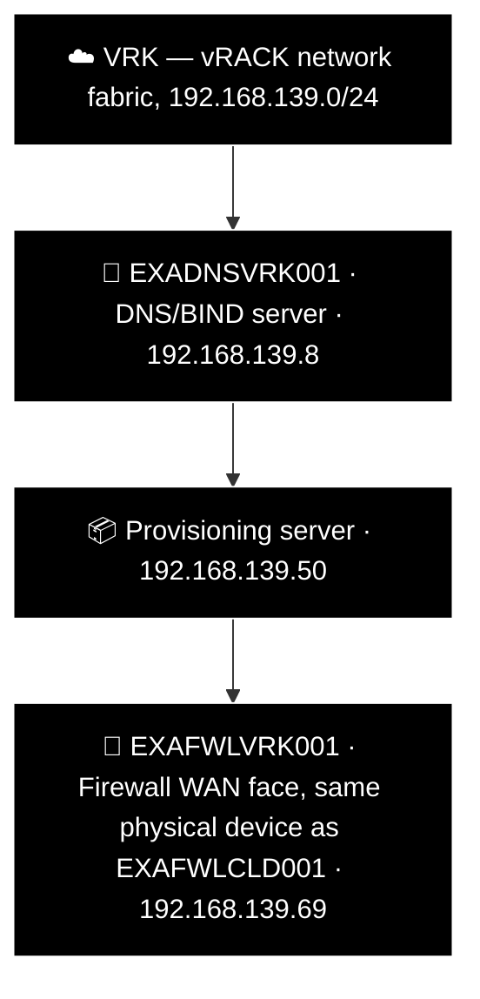

# Example Music Limited — vRACK (VRK) Network Diagram

> **Classification:** Internal — Infrastructure
> **Part of:** [`../network-diagram.md`](../network-diagram.md) — see there for the Visual
> Standard (shape/colour/emoji convention), the full emoji legend, and links to every other
> region.

---

## ☁️ — vRACK

```
vRACK (VRK): 192.168.139.0/24
Role:        WireGuard hub network fabric — routes to all sites. Every site's firewall WAN
             face sits on this subnet.
Entity: Example Music Limited
Landline: N/A
Mobile: N/A
```

> **VRK is a special case, not a regular site.** It has no `RTR`/`PVE`/`BMC`/`SWI` of its own —
> `generate_inventory.py`'s `NON_STANDARD_SITES` excludes it from all standard-slot synthesis
> entirely, so only real `devices.csv` rows exist here, three of them. There is no
> `EXARTRVRK001` anywhere in this repo — confirmed via a full grep and a full git-history search,
> neither found one, past or present. `192.168.139.254` (`sites.csv`'s `Gateway` field for VRK) is
> **OVH's own vRACK gateway, confirmed by Robert** — routed through, never managed or touched by
> Example Music. Correctly represented only in `sites.csv`'s `Gateway` field, deliberately absent
> from `devices.csv` (that list is only for devices Example Music actually manages — every other
> row there has a real `ConnectionMethod`). Not a gap; do not add a row for it.


